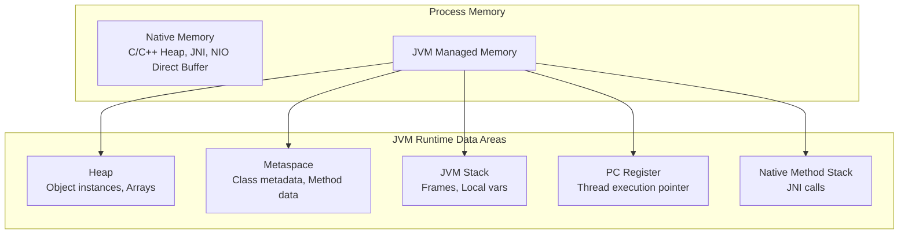
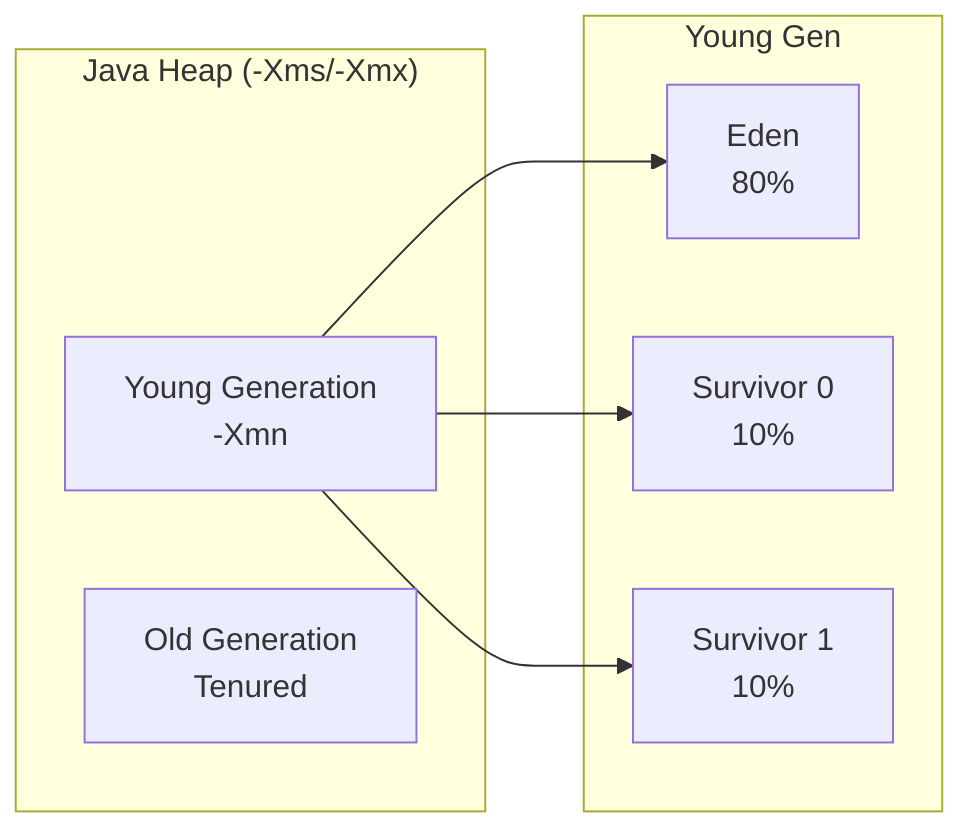
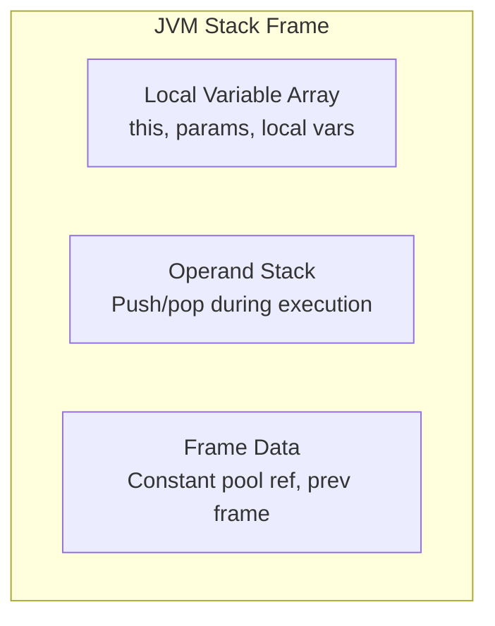
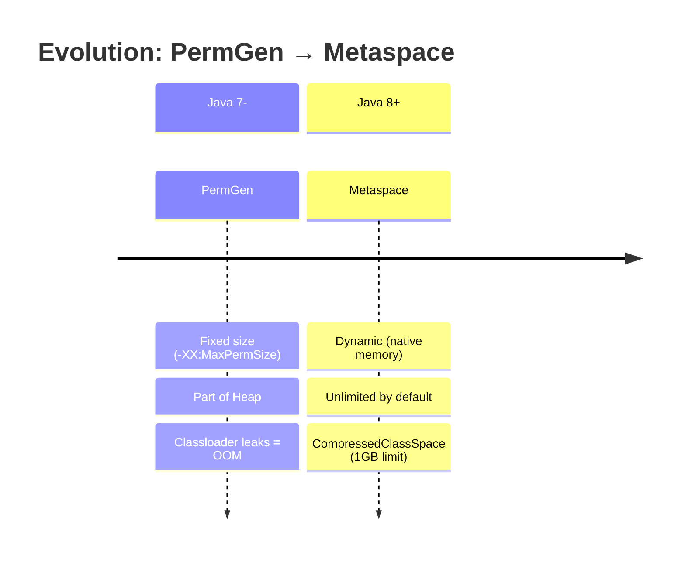
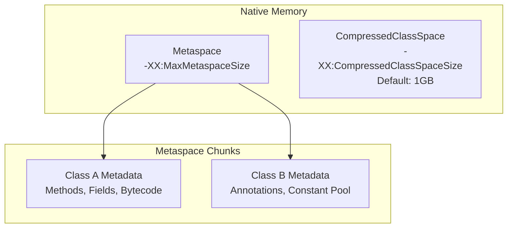

# 🔬 Cấu Trúc Bộ Nhớ JVM: Heap, Stack & Metaspace

> **Mức độ:** Senior Backend Architect | **Thờ gian đọc:** 25 phút | **Java Version:** 8 - 21+

---

## 1. Tổng Quan Kiến Trúc Bộ Nhớ JVM

### 1.1 Bản Chất Vật Lý vs Logic



> **🔑 Insight Senior:** JVM không trực tiếp quản lý toàn bộ RAM. Nó xin cấp phát từ OS thông qua `malloc/mmap`, sau đó tự quản lý phân chia. Điều này giải thích tại sao RSS (Resident Set Size) thường lớn hơn Heap Size.

---

## 2. HEAP - Vùng Nhớ Động (Runtime Data Area)

### 2.1 Cấu Trúc Phân Vùng



### 2.2 Chi Tiết Từng Vùng

| Vùng | Mục đích | Đặc điểm quan trọng |
|------|----------|---------------------|
| **Eden** | Chứa objects mới tạo | Allocation nhanh (bump-the-pointer), khi đầy → Minor GC |
| **Survivor S0/S1** | Objects sống sót sau Minor GC | Luôn có 1 vùng trống (copying algorithm), đếm age threshold |
| **Old/Tenured** | Objects dài hạn, large objects | Major GC/Full GC, đắt đỏ, "Stop-the-world" |

### 2.3 Cơ Chế Allocation Tầng Thấp

```java
// TLAB (Thread Local Allocation Buffer) - Tối ưu multi-thread
// Mỗi thread có "private" Eden chunk để tránh contention
// JVM flag: -XX:+UseTLAB (mặc định bật từ Java 6+)

public class HeapAllocationDemo {
    // Object này nằm ở đâu phụ thuộc vào context
    private static final Object STATIC_OBJ = new Object(); // Heap, ref ở Metaspace
    
    public void method() {
        // Allocation trong Eden (thường TLAB)
        Object local = new Object();
        
        // Large object (> PretenureSizeThreshold) → Old Gen ngay
        byte[] large = new byte[10 * 1024 * 1024]; // 10MB
    }
}
```

### 2.4 Rủi Ro & Anti-patterns

> **⚠️ CRITICAL:** Large Object Allocation Failures
> 
> Khi Eden không đủ space và Old Gen cũng fragmented, JVM phải:
> 1. Trigger Full GC (STW)
> 2. Compact memory (càng đắt)
> 3. Nếu vẫn fail → `OutOfMemoryError: Java heap space`

```java
// ❌ ANTI-PATTERN: Object pooling không cần thiết (trừ khi cực nặng)
// Java GC hiện đại (ZGC/Shenandoah) xử lý short-lived objects rất tốt
public class UnnecessaryPooling {
    private static final Queue<byte[]> POOL = new LinkedList<>();
    
    public byte[] getBuffer() {
        return POOL.poll() != null ? POOL.poll() : new byte[8192];
    }
}

// ✅ SENIOR APPROACH: Trust the GC (với caveats)
// Chỉ pool khi: Object creation cost > GC cost (DB connections, Thread pools)
```

---

## 3. STACK - Vùng Nhớ Gọi Hàm (Thread Private)

### 3.1 Stack Frame Structure



### 3.2 Stack vs Heap: Quyết Định Kiến Trúc

| Tiêu chí | Stack | Heap |
|----------|-------|------|
| **Lifetime** | Method execution | Object lifetime |
| **Thread** | Private per thread | Shared, cần synchronization |
| **Allocation** | O(1) - chỉ con trỏ | TLAB/CAS (multi-thread) |
| **Size** | Fixed (-Xss), nhỏ | Dynamic (-Xms/-Xmx), lớn |
| **Data** | Primitives, references | Objects, arrays |

### 3.3 Stack Overflow & Deep Dive

```java
// StackOverflowError khi recursion không base case
// Hoặc: quá nhiều nested method calls

public class StackFrameDemo {
    // Mỗi lần gọi: tạo frame mới, push vào stack
    // -Xss1m = 1MB per thread
    
    public void recursiveRisk(int n) {
        // Local variables live trong frame
        long a = 1, b = 2, c = 3; // 24 bytes
        
        // Risk: Deep recursion trong production
        if (n > 0) recursiveRisk(n - 1);
    }
}
```

> **🔑 Senior Pattern:** Tail Recursion Optimization?
> JVM **KHÔNG** tối ưu tail recursion (khác Scala/Kotlin). Dùng iteration hoặc `Stream.reduce()`.

---

## 4. METASPACE - Thay Thế PermGen (Java 8+)

### 4.1 PermGen vs Metaspace: Cuộc Cách Mạng



### 4.2 Metaspace Architecture



### 4.3 Cấu Trúc Chi Tiết Metaspace

| Thành phần | Nội dung | Giải phóng |
|------------|----------|------------|
| **Klass structure** | Class metadata, vtable | Khi ClassLoader bị unload |
| **Constant Pool** | String literals, method refs | Reference counting |
| **Method metadata** | Bytecode, exception tables | Với Class |
| **Annotations** | Runtime-visible | Với Class |

### 4.4 Metaspace Memory Leak - Case Study

```java
// ❌ CLASSIC LEAK: Dynamic Proxy + Caching ClassLoader
public class MetaspaceLeakExample {
    private static final Map<String, Class<?>> CACHE = new HashMap<>();
    
    public Class<?> generateProxy(String name) {
        // Mỗi lần tạo proxy = defineClass mới
        // ClassLoader giữ reference → Metaspace không giải phóng
        
        byte[] bytecode = generateBytecode(name);
        
        // Custom ClassLoader mới mỗi lần!
        ClassLoader loader = new ClassLoader() {
            @Override
            protected Class<?> findClass(String name) {
                return defineClass(name, bytecode, 0, bytecode.length);
            }
        };
        
        return CACHE.computeIfAbsent(name, n -> {
            try {
                return loader.loadClass(n);
            } catch (ClassNotFoundException e) {
                throw new RuntimeException(e);
            }
        });
    }
}

// ✅ SOLUTION: Reuse ClassLoader hoặc weak references
// Hoặc: Giới hạn Metaspace, bật GC class unloading
// -XX:+CMSClassUnloadingEnabled (Java 7)
// -XX:+ClassUnloadingWithConcurrentMark (Java 8+)
```

> **⚠️ Production Alert:** 
> 
> Metaspace mặc định **unlimited** trên native memory. Containerized environment có thể bị OOM-Killer từ OS thay vì JVM OOM.

---

## 5. Code Regions & Code Cache (Thường Bị Bỏ Quên)

### 5.1 JIT Compiler Memory

```
Code Cache Structure:
├── Non-method Code: ~5MB (interpreter, buffers)
├── Profiled Code (C1): -XX:ReservedCodeCacheSize/2
│   └── Tier 1-3: Quick compilation with profiling
└── Non-profiled Code (C2): -XX:ReservedCodeCacheSize/2
    └── Tier 4: Aggressive optimization
```

```bash
# Monitoring
jcmd <pid> Compiler.codecache
jcmd <pid> VM.native_memory summary
```

---

## 6. Java 21+: Virtual Threads & Memory Impact

### 6.1 Platform Thread vs Virtual Thread

```java
// Java 21: Virtual Threads (Project Loom)
// - Stack được mount/unmount từ carrier thread
// - Continuation stack stored trong heap (không phải native stack)

Thread.startVirtualThread(() -> {
    // Stack frame không chiếm OS thread stack
    // Heap cost: ~few KB cho continuation
});

// Implication: -Xss không áp dụng cho virtual threads
// Có thể tạo millions virtual threads với memory vừa phải
```

### 6.2 ZGC/Shenandoah: Heap khác biệt

```bash
# ZGC: Heap regions có thể resize dynamically
# -XX:+UseZGC
# Không còn Young/Old rigid division
# Colored pointers, load barriers

# Shenandoah: Brooks pointers
# -XX:+UseShenandoahGC
# Concurrent compaction
```

---

## 7. Monitoring & Diagnostic

### 7.1 Key Metrics

| Metric | Command/Tool | Ngưỡng cảnh báo |
|--------|--------------|-----------------|
| Heap Usage | `jmap -heap`, JMX | >80% before GC |
| Metaspace | `jcmd VM.metaspace` | Growth không giảm |
| Stack Depth | Thread dumps | >1000 frames |
| GC Pressure | GC logs, JFR | >10% CPU time |

### 7.2 Essential JVM Flags

```bash
# Production-ready configuration
java \
  -Xms4g -Xmx4g \                           # Heap cố định, tránh resize
  -XX:MaxMetaspaceSize=512m \               # Giới hạn Metaspace
  -Xss1m \                                   # Stack per thread
  -XX:+UseG1GC \                            # Hoặc ZGC cho large heap
  -XX:MaxGCPauseMillis=200 \                # SLA target
  -Xlog:gc*:file=gc.log:time,uptime:filecount=5,filesize=100m \
  -XX:+HeapDumpOnOutOfMemoryError \
  -XX:HeapDumpPath=/var/log/heapdump.hprof \
  -jar application.jar
```

---

## 8. Anti-patterns & Best Practices Summary

### ❌ Không nên

1. **Manual finalization:** `Object.finalize()` deprecated Java 9, removed Java 18
2. **System.gc():** Disable với `-XX:+DisableExplicitGC`
3. **Large static caches:** Không giới hạn, không eviction
4. **Thread-local abuse:** Giữ references trong ThreadLocal không clean

### ✅ Nên làm

1. **Set explicit limits:** Mọi vùng nhớ đều có bound
2. **Monitor Metaspace:** Đặc biệt với dynamic class generation
3. **Use off-heap carefully:** Direct ByteBuffers cần explicit `cleaner()`
4. **Profile trước optimize:** Không đoán, đo lường

---

## 9. References

- [JVM Specification 21 - Runtime Data Areas](https://docs.oracle.com/javase/specs/jvms/se21/html/jvms-2.html#jvms-2.5)
- [Java SE 21 HotSpot Virtual Machine Garbage Collection Tuning Guide](https://docs.oracle.com/en/java/javase/21/gctuning/)
- [Metaspace in OpenJDK](https://openjdk.org/jeps/122)
- [JEP 444: Virtual Threads](https://openjdk.org/jeps/444)

---

*Ngày nghiên cứu: 26/03/2026*  
*Người thực hiện: Senior Backend Architect Agent*  
*Phiên bản: 1.0*
