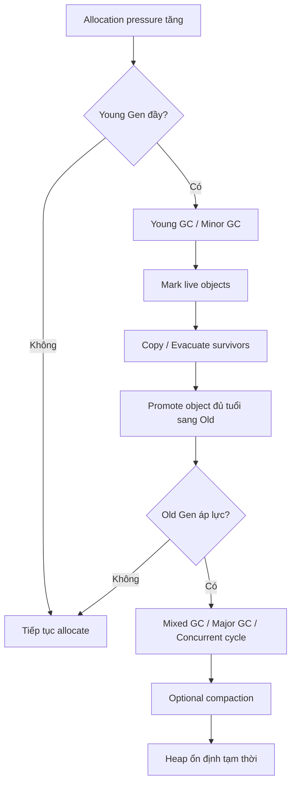
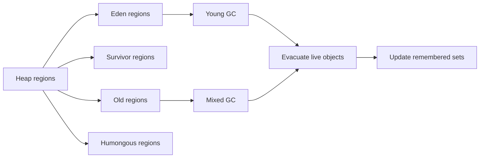
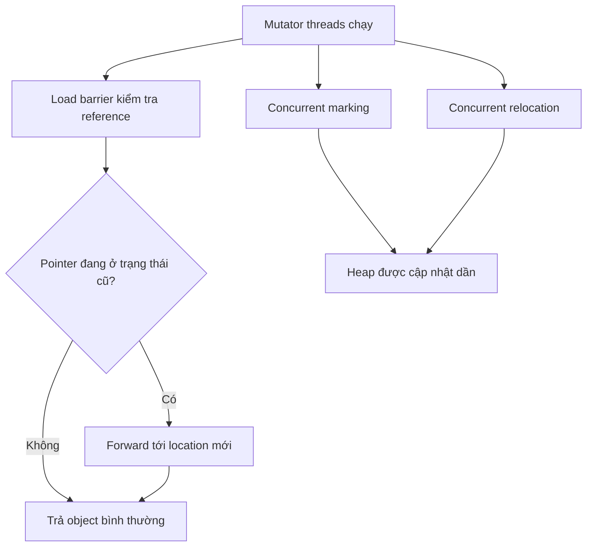

# 🔬 Cơ Chế Garbage Collection (GC) trong JVM: G1, ZGC, Shenandoah và Stop-the-world

> **Mức độ:** Senior Backend Architect | **Thời gian đọc:** 30-40 phút | **Java Version:** 8 - 21+

## 1. Mục tiêu của task

Mục tiêu của nghiên cứu này là hiểu **bản chất cơ chế thu gom rác trong JVM**, thay vì chỉ nhớ tên các collector.

Cần nắm được:
- Vì sao JVM cần GC, và GC đang tối ưu cho bài toán gì.
- GC hoạt động ở tầng thấp như thế nào: root scanning, marking, evacuation, compaction, remembered set, load barrier, concurrent phases.
- Khi nào xảy ra **Stop-the-world (STW)**, và vì sao STW không phải là “lỗi” mà là một đánh đổi thiết kế.
- Khác biệt thực chất giữa **G1**, **ZGC**, **Shenandoah**.
- Cách chọn GC theo workload và các rủi ro khi vận hành production.

> **Điểm mấu chốt:** GC không chỉ là “dọn rác”, mà là **hệ thống quản trị sống/chết của object** với mục tiêu tối ưu giữa throughput, latency, memory overhead và tính đơn giản của runtime.

---

## 2. Bản chất và cơ chế hoạt động

### 2.1 GC giải quyết bài toán gì?

Trong Java, object được cấp phát liên tục. Nếu lập trình viên phải tự giải phóng bộ nhớ như C/C++, hệ thống sẽ đối mặt với:
- double free,
- use-after-free,
- memory leak do quên giải phóng,
- fragmentation phức tạp,
- tăng mạnh độ phức tạp ngôn ngữ.

JVM chọn hướng khác: **xác định object nào còn sống bằng reachability từ GC Roots**, rồi thu hồi object không còn reachable.

### 2.2 Tư duy nền tảng: reachability, không phải “đếm reference”

JVM không đơn giản chỉ đếm số reference. Nó dựa trên **đồ thị tham chiếu**:
- Từ các **GC Roots** như stack local variables, static fields, JNI references, thread objects…
- JVM đi theo các edge của object graph.
- Object nào không còn đường đi từ root → là ứng viên thu hồi.

Điều này giải thích:
- **Cyclic reference** không phải vấn đề nếu không còn root nào trỏ tới.
- Một object có thể “được giữ sống” chỉ vì một reference ở thread local, static cache, listener registry, hoặc classloader chain.

### 2.3 Pipeline tổng quát của một GC cycle



### 2.4 Stop-the-world là gì?

**STW** là thời điểm JVM tạm dừng các Java threads để thực hiện một số pha GC cần trạng thái heap nhất quán.

Không phải mọi pha đều phải STW, nhưng thường có một vài điểm dừng ngắn hoặc dài, tùy collector.

STW thường cần cho:
- thu thập root set chính xác,
- chốt metadata hoặc card table state,
- di chuyển object an toàn,
- cập nhật reference đồng bộ,
- đảm bảo không có race với mutator threads.

> **Lưu ý:** STW không hẳn là “JVM tệ”, mà là **điểm chặn nhất quán** để giảm độ phức tạp của quản lý bộ nhớ. Vấn đề thật sự là **thời lượng và tần suất** STW có phù hợp SLA hay không.

### 2.5 Các pha cơ bản của collector hiện đại

#### Mark
Xác định object nào còn sống.

#### Evacuate / Copy
Di chuyển object còn sống sang vùng mới để:
- gom cụm object sống,
- giảm fragmentation,
- tối ưu locality.

#### Sweep
Duyệt và trả lại vùng nhớ object chết.

#### Compact
Dồn object sống lại để loại bỏ fragmentation.

#### Update references
Khi object bị move, mọi reference trỏ tới nó phải cập nhật.

### 2.6 Vì sao GC hiện đại dùng vùng nhớ theo region?

Các collector thế hệ mới thường chia heap thành nhiều **region** thay vì chỉ nhìn heap như một khối monolithic.

Lý do:
- dễ chọn vùng phù hợp để thu gom,
- giảm phạm vi dừng,
- hỗ trợ compaction linh hoạt,
- dễ tune theo live data.

---

## 3. Kiến trúc / luồng xử lý / sơ đồ nếu phù hợp

### 3.1 G1 GC: collector mặc định “cân bằng” cho backend

G1 chia heap thành nhiều region bằng kích thước tương đối đồng nhất. Mỗi region có thể đóng vai trò:
- Eden,
- Survivor,
- Old,
- Humongous.

G1 không cố gắng thu gom toàn heap mỗi lần. Nó chọn các region có lợi nhất để thu gom trong một budget pause time.



#### Cơ chế lõi của G1
- **Remembered Set (RSet):** theo dõi tham chiếu từ region khác sang region này.
- **Card Table:** đánh dấu phần heap có thể chứa reference cross-region.
- **Predictive pause:** G1 cố dự đoán thời gian pause và chọn lượng region phù hợp.

#### Vì sao G1 được thiết kế như vậy?
Mục tiêu của G1 không phải latency cực thấp, mà là:
- pause time tương đối ổn định,
- throughput tốt,
- phù hợp heap lớn,
- hành vi dễ dự đoán hơn collector cũ.

### 3.2 ZGC: low-latency collector hướng “pause cực ngắn”

ZGC được thiết kế để giữ pause time rất thấp, thường ở mức millisecond nhỏ, ngay cả với heap rất lớn.

#### Điểm cốt lõi
ZGC dựa vào:
- **colored pointers / metadata bits trong pointer**,
- **load barriers** thay vì heavy STW,
- relocation concurrent,
- marking concurrent,
- compaction concurrent gần như toàn bộ.



#### Tại sao ZGC làm được?
ZGC dồn nhiều công việc sang concurrent phases và để load barrier xử lý “trạng thái chuyển tiếp” của reference.

Đổi lại, nó chấp nhận:
- phức tạp hơn,
- overhead runtime từ barrier,
- yêu cầu CPU hiện đại hơn,
- không phải lúc nào throughput cũng thắng G1.

### 3.3 Shenandoah: low-pause collector với concurrent compaction

Shenandoah cũng hướng tới pause thấp, nhưng tiếp cận khác ZGC.

#### Cơ chế chính
- concurrent marking,
- concurrent evacuation/compaction,
- **brooks pointer** hoặc cơ chế forwarding để theo dõi object đã di chuyển,
- cập nhật reference an toàn trong khi application vẫn chạy.

#### Ý nghĩa thiết kế
Shenandoah ưu tiên:
- giảm pause,
- vẫn giữ heap compact,
- giảm fragmentation.

Đổi lại:
- nhiều barrier hơn,
- complexity cao,
- sensitive hơn với workload và tuning,
- phụ thuộc distro/JDK build ở một số môi trường hơn G1.

### 3.4 So sánh cơ chế luồng xử lý

| Collector | Mục tiêu chính | Cách làm nổi bật | STW | Fragmentation |
|---|---|---|---|---|
| G1 | Cân bằng throughput + pause | Region-based, predictive pause, mixed collections | Có, nhưng thường ngắn hơn collector cổ điển | Giảm bằng evacuation/compaction |
| ZGC | Latency cực thấp | Load barriers, concurrent relocation, colored pointers | Rất ngắn | Rất thấp |
| Shenandoah | Latency thấp | Concurrent compaction, forwarding | Rất ngắn | Rất thấp |

---

## 4. So sánh các lựa chọn hoặc cách triển khai

### 4.1 Chọn theo mục tiêu hệ thống

| Mục tiêu hệ thống | Lựa chọn thường phù hợp | Lý do |
|---|---|---|
| Web API thông thường, throughput tốt, SLA pause vài chục đến vài trăm ms | G1 | Cân bằng nhất, mặc định thực tế cho server Java hiện đại |
| Hệ thống latency-sensitive, p99/p999 quan trọng | ZGC hoặc Shenandoah | Pause thấp, phù hợp heap lớn và tải đều |
| Ứng dụng heap nhỏ, workload đơn giản | G1 vẫn đủ | Không cần complexity thêm |
| Hệ thống batch throughput nặng | G1 hoặc collector throughput chuyên biệt tùy version | Throughput có thể quan trọng hơn latency |

### 4.2 G1 vs ZGC vs Shenandoah: trade-off thật

| Tiêu chí | G1 | ZGC | Shenandoah |
|---|---|---|---|
| Throughput | Tốt | Thường thấp hơn G1 một chút | Thường thấp hơn G1 một chút |
| Latency | Tốt, không thấp nhất | Rất tốt | Rất tốt |
| Heap lớn | Tốt | Rất tốt | Tốt |
| Complexity nội bộ | Trung bình | Cao | Cao |
| Tuning | Có thể tune được | Ít tune hơn, thiên về auto | Có thể cần hiểu sâu |
| Compatibility | Rộng | Rộng trên JDK mới | Phụ thuộc distro/JDK hơn ở một số môi trường |

### 4.3 Khi nào không nên dùng collector low-latency?

Không nên mặc định chọn ZGC/Shenandoah chỉ vì “mới” nếu:
- hệ thống không có latency pressure rõ ràng,
- heap nhỏ và workload bình thường,
- team vận hành chưa có kinh nghiệm đọc GC logs/JFR,
- cần ưu tiên ổn định, dễ đoán, dễ support.

> **Nguyên tắc thực chiến:** Chọn GC theo **SLA thực tế**, không chọn theo danh tiếng.

---

## 5. Rủi ro, anti-patterns, lỗi thường gặp

### 5.1 Failure modes phổ biến

#### 1) Pause dài bất thường
Nguyên nhân thường gặp:
- live set quá lớn,
- mixed GC không theo kịp allocation rate,
- fragmentation nặng,
- humongous allocation nhiều,
- reference graph quá phức tạp.

#### 2) Promotion failure / evacuation failure
Xảy ra khi object sống sót nhiều hơn dự kiến hoặc old gen không đủ chỗ để nhận object được đẩy lên.

Hậu quả:
- pause dài,
- có thể dẫn tới Full GC hoặc degraded performance.

#### 3) Humongous object pressure
Trong G1, object lớn có thể chiếm nhiều region và làm collector khó tối ưu.

Dấu hiệu:
- allocation spike,
- fragmentation,
- GC cycle dày,
- pause khó đoán.

#### 4) Allocation rate vượt năng lực GC
Nếu ứng dụng allocate quá nhanh mà GC không kịp reclaim:
- young GC liên tục,
- CPU bị GC ăn mất,
- throughput giảm mạnh.

### 5.2 Anti-patterns trong code và kiến trúc

- Dùng **static cache không giới hạn**.
- Giữ object sống lâu qua listener, ThreadLocal, singleton registry.
- Tạo quá nhiều temporary objects trong hot path mà không đo đạc.
- Dùng large byte[]/String concat sai cách trong request loop.
- Tắt GC logs / không có observability.

### 5.3 Những hiểu lầm nguy hiểm

- “GC tự lo hết nên không cần quan tâm memory leak” → sai.
- “Full GC là điều bình thường” → sai trong production nếu lặp lại.
- “ZGC lúc nào cũng nhanh hơn G1” → sai.
- “Pause thấp = hệ thống tốt” → chưa đủ, throughput và tail latency cũng quan trọng.

### 5.4 Case thực tế: leak logic không phải leak heap

Một hệ thống có thể không leak theo nghĩa object không bao giờ mất reference, nhưng vẫn tăng memory vì:
- cache quá lớn,
- object sống quá lâu do retention,
- queue backlog,
- direct buffer / off-heap tăng mà heap nhìn vẫn bình thường.

---

## 6. Khuyến nghị thực chiến trong production

### 6.1 Mặc định hợp lý

- Với đa số backend service: **bắt đầu bằng G1**.
- Chuyển sang ZGC/Shenandoah khi có bằng chứng rõ ràng về latency requirement.
- Không tune trước khi có dữ liệu.

### 6.2 Quan sát đúng thứ cần quan sát

#### Metrics nên theo dõi
- GC pause p50/p95/p99.
- Allocation rate.
- Young GC frequency.
- Old generation occupancy / live set.
- Humongous allocations.
- GC CPU percentage.
- Promotion/evacuation failure.
- Concurrent cycle duration.

#### Công cụ nên dùng
- GC logs (`-Xlog:gc*` trên Java 9+).
- JFR.
- `jcmd`.
- Prometheus + Grafana nếu có exporter.
- Heap dump chỉ khi cần điều tra, không lạm dụng.

### 6.3 Thiết lập vận hành

- Đặt heap hợp lý, tránh để JVM tự co giãn lung tung nếu workload ổn định.
- Giám sát live set sau GC, không chỉ nhìn heap before GC.
- Đọc GC logs theo chuỗi sự kiện, không nhìn từng dòng rời rạc.
- Kiểm thử với tải giống production, đặc biệt là object churn và peak traffic.

### 6.4 Khi debug sự cố GC, cần hỏi đúng câu

1. Allocation rate có tăng bất thường không?
2. Live set có phình lên không?
3. Có humongous object hoặc large arrays không?
4. Có ThreadLocal / cache / listener retention không?
5. GC pause là dài vì marking, evacuation, compaction hay remark?
6. Đây là latency problem hay memory pressure problem?

> **Lưu ý vận hành:** Đừng “tune GC” khi root cause là query chậm, queue backlog, hoặc object retention do business logic. GC chỉ là nơi hứng hậu quả.

### 6.5 Java 21+ và xu hướng hiện đại

- ZGC đã trưởng thành hơn nhiều ở Java 21+ và phù hợp hệ thống latency-sensitive.
- G1 vẫn là default thực dụng cho phần lớn backend.
- Loom/Virtual Threads làm tăng số lượng thread logic, nhưng không tự động giải quyết vấn đề memory retention hay allocation churn.
- Theo dõi JFR và GC logs vẫn là kỹ năng cốt lõi, không lỗi thời.

---

## 7. Kết luận ngắn gọn, chốt lại bản chất

GC là cơ chế quản lý vòng đời object dựa trên **reachability**, với đánh đổi giữa **throughput, latency, memory overhead và độ phức tạp của runtime**.

- **G1**: lựa chọn cân bằng, phù hợp đa số backend.
- **ZGC**: ưu tiên latency cực thấp, thích hợp heap lớn và SLA khắt khe.
- **Shenandoah**: cũng low-pause, thiên về concurrent compaction.

**Stop-the-world** là một phần của thiết kế GC, không phải lỗi; điều quan trọng là biết nó xảy ra ở đâu, vì sao, và có thể kiểm soát được đến mức nào.

---

## 8. Ghi chú code tối thiểu

Ví dụ dưới đây chỉ để minh họa **điểm giữ object sống** chứ không phải demo GC đầy đủ:

```java
class LeakPattern {
    private static final java.util.Map<String, byte[]> CACHE = new java.util.HashMap<>();

    static byte[] hold(String key) {
        return CACHE.computeIfAbsent(key, k -> new byte[1024 * 1024]);
    }
}
```

Ý nghĩa:
- `static` cache giữ reference lâu dài.
- Object không còn “rác” với GC nếu vẫn còn đường đi từ root.
- Đây là kiểu retention thường bị nhầm là “GC yếu”, trong khi nguyên nhân là **thiết kế giữ sống object**.

---

## 9. Tài liệu tham khảo

- JEP 248: Make G1 the Default Garbage Collector
- JEP 333: ZGC: A Scalable Low-Latency Garbage Collector
- JEP 189 / Shenandoah project docs
- Java SE 21 HotSpot GC Tuning Guide
- JVM Specification: Runtime Data Areas, Execution, Memory Model

---

*Ngày nghiên cứu: 27/03/2026*  
*Người thực hiện: Senior Backend Architect Agent*  
*Phiên bản: 1.0*
