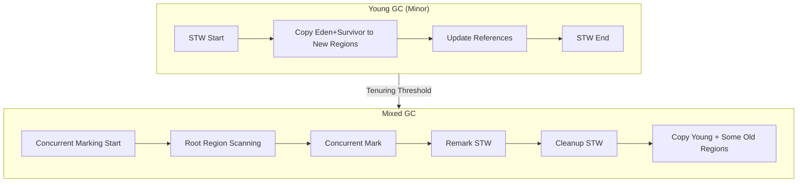
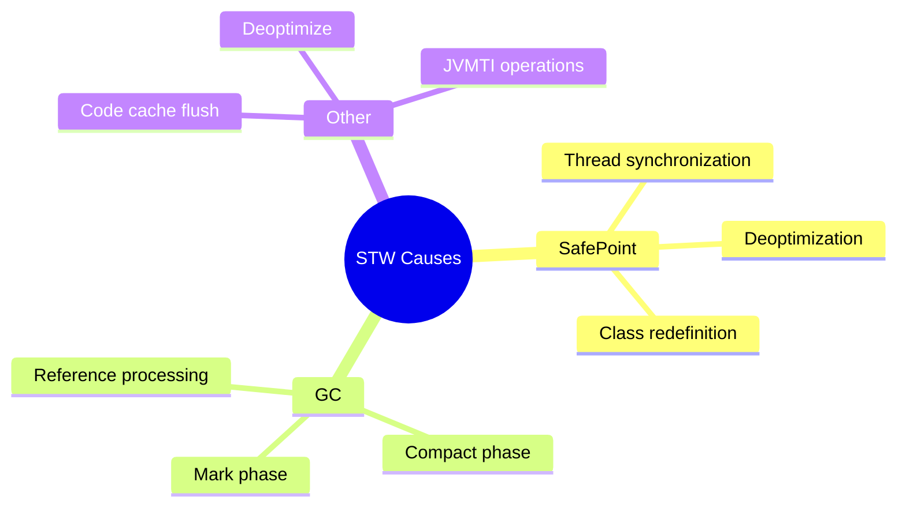

# Cơ Chế Garbage Collection (GC) Trong Java

> **Tóm tắt Senior:** GC không chỉ là "dọn rác" - đó là sự cân bằng tinh tế giữa **Throughput**, **Latency** và **Memory Footprint**. Chọn sai algorithm hoặc tune sai tham số có thể khiến ứng dụng production sập trong giây lát.

---

## 1. Bản Chất: Tại Sao Cần GC?

### 1.1 Manual Memory Management vs Automatic GC

| Tiêu chí | C/C++ (Manual) | Java (Automatic GC) |
|----------|---------------|---------------------|
| **Control** | Hoàn toàn kiểm soát | Trao quyền cho JVM |
| **Bug phổ biến** | Memory leak, Dangling pointer, Double free | GC thrashing, Stop-the-world quá lâu |
| **Performance** | Tối ưu nếu làm đúng | Predictable, nhưng có overhead |
| **Developer Effort** | Cao (quan lý vòng đỏi object) | Thấp (tập trung business logic) |

> **🔥 Rủi ro Production:** GC không phải "silver bullet". Các ứng dụng low-latency (trading, gaming, telecom) có thể bị ảnh hưởng nghiêm trọng bởi pause time.

### 1.2 Triết Lý Generational Hypothesis

JVM dựa trên quan sát thực nghiệm **Weak Generational Hypothesis**:

```
┌─────────────────────────────────────────────────────────────┐
│                     HEAP MEMORY                              │
├────────────────────────┬────────────────────────────────────┤
│       YOUNG GEN        │              OLD GEN               │
│  (Eden + S0 + S1)      │                                    │
│                        │                                    │
│  ┌─────┐ ┌────┐┌────┐  │   ┌────┐ ┌────┐ ┌────┐            │
│  │     │ │    ││    │  │   │    │ │    │ │    │ ...        │
│  │Eden │ │S0  ││S1  │  │   │Old │ │Old │ │Old │            │
│  │     │ │    ││    │  │   │    │ │    │ │    │            │
│  └─────┘ └────┘└────┘  │   └────┘ └────┘ └────┘            │
│                        │                                    │
│  • 90% objects die     │   • 10% objects survive           │
│    trong Minor GC      │   • Long-lived objects            │
│  • Fast collection     │   • Full GC/Major GC              │
└────────────────────────┴────────────────────────────────────┘
```

**Số liệu thực tế:**
- ~90-95% objects chết trong lần GC đầu tiên (Eden space)
- ~5-10% objects "promote" sang Old Gen
- Minor GC: < 10ms (nhanh)
- Major GC: 100ms - several seconds (chậm)

---

## 2. Các Thuật Toán Garbage Collection

### 2.1 Serial GC (Legacy - Single Threaded)

```
┌────────────────────────────────────────────────────────────┐
│  Stop-the-World                                            │
│  ┌─────────────────────────────────────────────────────┐   │
│  │  Mark → Sweep → Compact (Single Thread)             │   │
│  └─────────────────────────────────────────────────────┘   │
│                                                             │
│  ⏱️ Pause: 100ms - 10s+                                     │
│  💻 Use case: Single-core, small heap (< 100MB)            │
└────────────────────────────────────────────────────────────┘
```

**Khi nào dùng:** Chỉ dùng cho CLI tools, batch processing không yêu cầu latency.

### 2.2 Parallel GC (Throughput Collector)

```java
// JVM Flags
-XX:+UseParallelGC
-XX:ParallelGCThreads=N
-XX:MaxGCPauseMillis=200
```

| Ưu điểm | Nhược điểm |
|---------|------------|
| Multi-threaded GC | Stop-the-world vẫn xảy ra |
| Tối ưu throughput | Không phù hợp low-latency |
| Default cho Java 8 | Pause time không predictable |

> **⚠️ Anti-pattern:** Dùng Parallel GC cho microservices có SLA < 100ms response time.

### 2.3 CMS (Concurrent Mark Sweep) - **DEPRECATED (Java 14+)**

CMS cố gắng giảm pause time bằng cách mark và sweep concurrent với application threads.

```
┌─────────────────────────────────────────────────────────────────────┐
│ CMS Collection Cycle                                                │
├─────────────────────────────────────────────────────────────────────┤
│                                                                     │
│ Initial Mark (STW) ──────► Concurrent Mark ──────► Remark (STW)     │
│    (< 10ms)                   (Concurrent)            (< 10ms)      │
│                                                                     │
│ ─────────────────────────────────────────────────────────────────►  │
│ Total pause: ~20ms (phân tán)                                       │
└─────────────────────────────────────────────────────────────────────┘
```

**Tại sao deprecated:**
- **Memory Fragmentation:** Không compact → OutOfMemoryError dù còn memory
- **Concurrent Mode Failure:** Old Gen đầy trong lúc concurrent mark
- **Complex tuning:** ~20+ flags cần tune

---

## 3. Modern GC Algorithms (Java 11+)

### 3.1 G1 GC (Garbage First) - Default từ Java 9+

#### Kiến Trúc Region-Based

```
┌─────────────────────────────────────────────────────────────────────┐
│ G1 Heap Layout (Regions)                                            │
├─────────────────────────────────────────────────────────────────────┤
│                                                                     │
│ ┌────┐ ┌────┐ ┌────┐ ┌────┐ ┌────┐ ┌────┐ ┌────┐ ┌────┐           │
│ │ E  │ │ S  │ │ S  │ │ O  │ │ O  │ │ H  │ │ O  │ │ O  │ ...       │
│ └────┘ └────┘ └────┘ └────┘ └────┘ └────┘ └────┘ └────┘           │
│                                                                     │
│ E = Eden, S = Survivor, O = Old, H = Humongous                     │
│                                                                     │
│ • Heap chia thành regions 1MB-32MB (default 1MB)                   │
│ • G1 ưu tiên thu gom regions có nhiều garbage nhất                  │
│ • Incremental compaction theo region                                 │
└─────────────────────────────────────────────────────────────────────┘
```

#### Phases của G1 GC



#### Tuning G1 GC

```java
// Cấu hình cơ bản
-XX:+UseG1GC
-XX:MaxGCPauseMillis=200              // Target pause time
-XX:G1HeapRegionSize=16m               // Region size (must be 2^n)
-XX:InitiatingHeapOccupancyPercent=45  // Start concurrent mark at 45% heap

// Tuning nâng cao cho large heap (> 32GB)
-XX:G1MixedGCCountTarget=8            // Số mixed GC để reclaim old gen
-XX:G1MixedGCLiveThresholdPercent=85  // Region có < 15% live data → thu gom
-XX:G1HeapWastePercent=5              // Chấp nhận 5% waste không thu gom
```

| Metric | Typical Value | Giải thích |
|--------|---------------|------------|
| **Pause time** | 10-200ms | Dependent on region count |
| **Throughput** | ~90-95% | 5-10% overhead cho GC |
| **Memory** | Region metadata overhead | ~5-10% extra memory |

> **💡 Best Practice:** G1 là lựa chọn mặc định tốt cho hầu hết ứng dụng. Chỉ chuyển ZGC/Shenandoah khi pause time > 100ms là không chấp nhận được.

---

### 3.2 ZGC (The Ultra-Low Latency Champion)

#### Kiến Trúc Cốt Lõi

ZGC (JEP 333, Java 11+) - **Pause time < 1ms** regardless of heap size!

```
┌─────────────────────────────────────────────────────────────────────┐
│ ZGC Core Innovations                                                │
├─────────────────────────────────────────────────────────────────────┤
│                                                                     │
│ 1. Load Barriers (Colored Pointers)                                │
│    ┌─────────────────────────────────────────────┐                 │
│    │  Pointer: [Metadata|Color|Address]          │                 │
│    │           4 bits color: Marked0/Marked1/Remapped │            │
│    └─────────────────────────────────────────────┘                 │
│                                                                     │
│ 2. Concurrent Compaction                                           │
│    - Relocate objects trong lúc app đang chạy                      │
│    - Load barrier tự động remap references                         │
│                                                                     │
│ 3. Region-based + Partial Compaction                               │
│    - Không cần STW để compact heap                                 │
└─────────────────────────────────────────────────────────────────────┘
```

#### ZGC Phases (Mostly Concurrent)

```
┌─────────────────────────────────────────────────────────────────────┐
│ ZGC Cycle (~99.9% concurrent)                                       │
├─────────────────────────────────────────────────────────────────────┤
│                                                                     │
│ Pause Mark Start    (< 0.01ms)                                      │
│       ↓                                                             │
│ Concurrent Mark     (~99% thời gian)                                │
│       ↓                                                             │
│ Pause Mark End      (< 0.01ms)                                      │
│       ↓                                                             │
│ Concurrent Prepare  (prepare for relocate)                          │
│       ↓                                                             │
│ Pause Relocate Start (< 0.01ms)                                     │
│       ↓                                                             │
│ Concurrent Relocate (copy objects to new locations)                 │
│       ↓                                                             │
│ Pause Relocate End  (< 0.01ms)                                      │
│                                                                     │
│ Tổng STW: < 1ms trong mọi trường hợp!                              │
└─────────────────────────────────────────────────────────────────────┘
```

#### ZGC Generational (Java 21+) - Game Changer

```java
// Kích hoạt ZGC Generational (Java 21+)
-XX:+UseZGC
-XX:+ZGenerational

// Cấu hình bộ nhớ
-Xms16g -Xmx16g
-XX:SoftMaxHeapSize=12g  // GC sẽ cố gắng không vượt quá 12G
```

| Feature | ZGC Non-Generational | ZGC Generational (Java 21+) |
|---------|---------------------|----------------------------|
| **Young Collection** | Không phân biệt | Concurrent, rất nhanh |
| **Old Collection** | Full heap | Lazy, incremental |
| **Memory Overhead** | Cao (hơn 2x metadata) | Tối ưu hơn |
| **Allocation Rate** | Tốt | Xuất sắc (> 1GB/s) |

> **🔥 Benchmark thực tế (Java 21, heap 64GB):**
> - ZGC Gen: ~0.5ms max pause
> - G1: ~50-200ms pause
> - Throughput ZGC vs G1: ~3-5% difference (negligible)

---

### 3.3 Shenandoah GC (Red Hat's Answer)

Shenandoah (JEP 189, Java 12+) - Cùng mục tiêu với ZGC nhưng cách tiếp cận khác.

#### Khác Biệt Chính: Brooks Pointers

```
┌─────────────────────────────────────────────────────────────────────┐
│ Shenandoah vs ZGC: Concurrency Model                                │
├─────────────────────────────────────────────────────────────────────┤
│                                                                     │
│ Shenandoah: Brooks Pointers                                        │
│ ┌──────────────────────────────────────────────────────────────┐   │
│ │ Object Header: [Mark Word | Class Pointer | Brooks Pointer]  │   │
│ │                                              │               │   │
│ │                                              ▼               │   │
│ │                                    [Forwarding Address]      │   │
│ │                                              │               │   │
│ │                    ┌─────────────────────────┘               │   │
│ │                    ▼                                         │   │
│ │              [New Location]                                  │   │
│ └──────────────────────────────────────────────────────────────┘   │
│                                                                     │
│ • Brooks pointer cho phép atomic relocation                        │
│ • Không cần load barriers phức tạp như ZGC                         │
│ • Memory overhead: 1 word/object (8 bytes on 64-bit)               │
└─────────────────────────────────────────────────────────────────────┘
```

#### So Sánh Trực Tiếp: ZGC vs Shenandoah

| Criteria | ZGC | Shenandoah |
|----------|-----|------------|
| **Pause time** | < 1ms | < 10ms |
| **Max heap** | 16TB (theoretical) | 1TB (tested) |
| **Memory overhead** | Higher (colored pointers metadata) | Lower (Brooks pointers) |
| **Throughput impact** | ~5-15% | ~5-10% |
| **Platform support** | Linux (primary), Windows, macOS | Linux (primary) |
| **Generational** | Java 21+ | No (planned) |
| **Maturity** | Very High (Oracle-backed) | High (Red Hat-backed) |

> **🎯 Lựa chọn:**
> - ZGC: Khi cần pause time cực thấp (< 1ms) và có đủ memory
> - Shenandoah: Khi memory overhead quan trọng và có thể chấp nhận ~5-10ms pause

---

## 4. Stop-The-World (STW): Hiểu Rõ Kẻ Thù

### 4.1 Khi Nào STW Xảy Ra?

```
┌─────────────────────────────────────────────────────────────────────┐
│ Stop-The-World Events by Collector                                  │
├─────────────────────────────────────────────────────────────────────┤
│                                                                     │
│ Collector        │ STW Events              │ Duration              │
│ ─────────────────┼─────────────────────────┼───────────────────────│
│ Serial           │ Mark + Sweep + Compact  │ 100ms - 10s+          │
│ Parallel         │ Mark + Compact          │ 100ms - 5s            │
│ CMS              │ Initial Mark + Remark   │ < 50ms (nếu không     │
│                  │                         │ có promotion failure) │
│ G1               │ Mark Start + Mark End   │ 10-200ms              │
│                  │ + Mixed GC              │                       │
│ ZGC              │ Mark Start/End          │ < 1ms                 │
│                  │ Relocate Start/End      │                       │
│ Shenandoah       │ Init Mark + Final Mark  │ < 10ms                │
│                  │ + Init Update Refs      │                       │
└─────────────────────────────────────────────────────────────────────┘
```

### 4.2 Root Causes của STW



> **⚠️ Warning:** GC không phải lúc nào cũng là thủ phạm! Hãy check GC logs trước khi đổ lỗi.

---

## 5. Tuning & Best Practices

### 5.1 JVM Flags Theo Use Case

```bash
# 🚀 High Throughput (Batch Processing, Analytics)
-XX:+UseParallelGC
-XX:ParallelGCThreads=8
-XX:MaxGCPauseMillis=1000  # Không quan tâm latency
-Xms32g -Xmx32g

# ⚡ Low Latency (Microservices, Web APIs)
-XX:+UseG1GC
-XX:MaxGCPauseMillis=50
-XX:+UseStringDeduplication
-Xms8g -Xmx8g

# 🎯 Ultra-Low Latency (Trading, Gaming, Real-time)
-XX:+UseZGC
-XX:+ZGenerational  # Java 21+
-XX:MaxGCPauseMillis=5
-Xms64g -Xmx64g
-XX:SoftMaxHeapSize=48g

# 📊 Large Heap, Balanced (Data Processing)
-XX:+UseShenandoahGC
-XX:ShenandoahGCHeuristics=compact
-Xms128g -Xmx128g
```

### 5.2 GC Logging & Monitoring

```bash
# Java 9+ Unified Logging
-Xlog:gc*:file=/var/log/app/gc.log:time,uptime,level,tags:filecount=10,filesize=100m

# Key metrics to watch
# - Pause time (avg, max, p99)
# - Allocation rate
# - Promotion rate
# - Heap usage trend
```

```java
// Programmatic GC monitoring
import java.lang.management.*;
import javax.management.*;

public class GCMonitor {
    public static void main(String[] args) {
        for (GarbageCollectorMXBean gcBean : ManagementFactory.getGarbageCollectorMXBeans()) {
            System.out.println("GC Name: " + gcBean.getName());
            System.out.println("Collection Count: " + gcBean.getCollectionCount());
            System.out.println("Collection Time: " + gcBean.getCollectionTime() + "ms");
            
            // Memory pools
            for (String pool : gcBean.getMemoryPoolNames()) {
                System.out.println("  Pool: " + pool);
            }
        }
    }
}
```

### 5.3 Common Anti-Patterns

| Anti-Pattern | Tại sao tệ | Cách fix |
|--------------|-----------|----------|
| **System.gc()** | Force full GC, ignore collector logic | Xóa hết, để JVM tự quyết định |
| **Finalizers** | Unpredictable delay, resource leak | Dùng try-with-resources |
| **Large objects** | Premature promotion, fragmentation | Tối ưu object size < region/2 |
| **ThreadLocal không clean** | Memory leak khi thread pool | Dùng TransmittableThreadLocal |
| **Over-allocate heap** | Longer GC cycles | Size heap theo实际需要 |

---

## 6. Java 21+ Features Mới

### 6.1 Generational ZGC

```java
// Trước Java 21: ZGC quét cả heap
// Java 21+: ZGC có Generational mode

-XX:+UseZGC
-XX:+ZGenerational  // Bật chế độ phân thế hệ

// Kết quả: 
// - Young collection: ~0.1ms
// - Old collection: Lazy, incremental
// - Throughput: Tăng 10-20% so với non-gen
```

### 6.2 String Deduplication (G1/Shenandoah/ZGC)

```bash
-XX:+UseStringDeduplication

// Tự động dedup String objects trong heap
// Hiệu quả cho applications có nhiều duplicate strings
// (JSON parsing, log processing, etc.)
```

---

## 7. Quyết Định: Chọn GC Nào?

```
┌─────────────────────────────────────────────────────────────────────┐
│              GC Selection Decision Tree                              │
├─────────────────────────────────────────────────────────────────────┤
│                                                                     │
│  Heap Size?                                                         │
│  ├── < 4GB → G1 (đơn giản, hiệu quả)                               │
│  │                                                                     │
│  └── >= 4GB → Latency Requirements?                                 │
│      │                                                              │
│      ├── < 10ms acceptable → G1 (tuned)                            │
│      │                                                              │
│      └── < 1ms required → Java Version?                             │
│          │                                                          │
│          ├── Java 21+ → ZGC Generational ⭐                          │
│          │                                                          │
│          └── Java 11-17 → ZGC non-gen hoặc Shenandoah               │
│                                                                     │
│  Special Cases:                                                     │
│  • Throughput critical, batch → Parallel GC                        │
│  • Large heap (100GB+), balanced → Shenandoah                      │
│  • Container/K8s with limits → G1 hoặc ZGC (aware of cgroup)       │
└─────────────────────────────────────────────────────────────────────┘
```

---

## 8. Kết Luận

| Yếu tố | G1 | ZGC | Shenandoah |
|--------|-----|-----|------------|
| **Pause time** | 10-200ms | < 1ms | < 10ms |
| **Latency SLA** | 99th < 200ms | 99.99th < 10ms | 99.9th < 20ms |
| **Throughput** | ★★★★★ | ★★★★☆ | ★★★★☆ |
| **Memory efficiency** | ★★★★☆ | ★★★☆☆ | ★★★★☆ |
| **Complexity** | Thấp | Trung bình | Trung bình |
| **Recommendation** | Default | Low-latency apps | Large heap apps |

> **💡 Senior Takeaway:**
> 1. Bắt đầu với G1 cho mọi thứ
> 2. Chuyển ZGC khi latency metrics vượt ngưỡng
> 3. Luôn enable GC logging và monitor
> 4. Test GC trước khi deploy production
> 5. Java 21+ với ZGC Generational là tương lai

---

## References

- [JEP 333: ZGC](https://openjdk.org/jeps/333)
- [JEP 377: ZGC Generational](https://openjdk.org/jeps/377)
- [JEP 189: Shenandoah GC](https://openjdk.org/jeps/189)
- [Oracle GC Tuning Guide](https://docs.oracle.com/en/java/javase/21/gctuning/)
- [Java GC Handbook - InfoQ](https://www.infoq.com/articles/Java-GC-handbook/)
