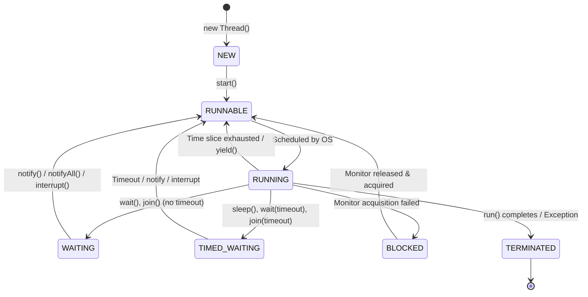
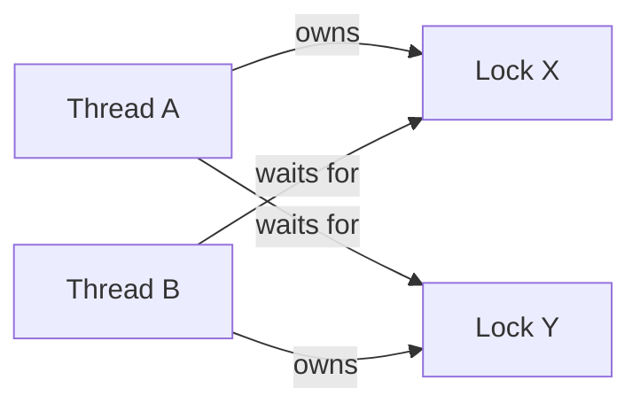

# Thread Lifecycle & Synchronization: wait/notify, join, synchronized, volatile

## 1. Mục tiêu của Task

Hiểu sâu bản chất đa luồng trong Java: cách thread chuyển trạng thái, cơ chế đồng bộ hóa bản chất, và tại sao các primitive này được thiết kế như vậy. Không dừng ở "cách dùng" mà phải hiểu "tại sao nó hoạt động như vậy ở JVM level".

---

## 2. Bản chất và Cơ chế Hoạt động

### 2.1 Thread Lifecycle - Trạng thái và Chuyển tiếp



#### Bản chất JVM Thread Mapping

> **Quan trọng**: `java.lang.Thread` không phải là thread thực sự - nó chỉ là **wrapper object** tham chiếu đến OS thread (pthreads trên Linux, Windows threads trên Windows).

| Thành phần | Vai trò |
|------------|---------|
| `java.lang.Thread` | Java object chứa trạng thái, group, priority, name |
| JVM Thread (VMThread) | Cấu trúc dữ liệu trong JVM để quản lý |
| OS Thread | Thread thực sự được OS scheduler quản lý |

**Chuyển đổi trạng thái expensive**: Mỗi lần thread chuyển từ RUNNING → WAITING/BLOCKED → RUNNABLE đều phải:
1. JVM cập nhật thread state
2. JNI call để điều khiển OS thread
3. OS context switch (save/restore registers, switch address space)
4. Cache invalidation, TLB shootdown

> **Trade-off**: Context switch cost ~1-10μs trên modern CPU. Với 100,000 threads liên tục context switch → throughput collapse.

---

### 2.2 Synchronized - Monitor & Intrinsic Lock

#### Bản chất Monitor

`synchronized` trong Java implement **Monitor pattern** (Hoare/C. A. R. Hoare, Brinch Hansen):

```
┌─────────────────────────────────────────┐
│           Object Header (64-bit)        │
├─────────────────────────────────────────┤
│  Mark Word (64-bit)                     │
│  ├── biased_lock: 1 bit                 │
│  ├── lock:      2 bits (state)          │
│  ├── age:       4 bits (GC)             │
│  └── ptr:       58 bits → Monitor       │
└─────────────────────────────────────────┘
```

**Lock states trong HotSpot JVM**:

| State | Mark Word | Ý nghĩa |
|-------|-----------|---------|
| Unlocked | 01 | Không thread nào sở hữu |
| Biased | 01 + thread ID | Thread đầu tiên sở hữu bias |
| Lightweight | 00 → ptr to Lock Record | Spin lock trong stack frame |
| Heavyweight | 10 → ptr to Monitor | OS mutex + condition variable |

**Lock escalation path**:
```
No lock → Biased Lock → Lightweight Lock → Heavyweight Lock
         (single thread)   (contention, short)   (high contention)
```

> **Biased Lock (Java 15 deprecated, Java 21 removed)**: Tối ưu cho single-threaded access pattern. Khi có contention, cần **revoke** (expensive operation ~safepoint pause). Java 21+ không còn biased locking.

#### Cơ chế Heavyweight Lock (Monitor)

Khi contention cao, JVM tạo `ObjectMonitor`:

```c
// hotspot/share/runtime/objectMonitor.hpp (simplified)
class ObjectMonitor {
    void*    _owner;           // Thread sở hữu monitor
    volatile intptr_t _count;  // Recursion count (reentrant)
    ObjectWaiter* _WaitSet;    // Threads waiting on wait()
    ObjectWaiter* _EntryList;  // Threads blocked trying to enter
    volatile intptr_t _cxq;    // Contention queue (LIFO)
};
```

**Entry protocol**:
1. Thread gọi `monitorenter`
2. Nếu `_owner == null`: CAS để acquire, return immediately
3. Nếu `_owner == self`: `_count++`, return (reentrant)
4. Nếu khác: push vào `_cxq`, block trên OS condition variable

**Exit protocol**:
1. `_count--`, nếu > 0: return (still owned)
2. `_owner = null`
3. Wake one thread từ `_WaitSet` (notify) hoặc `_EntryList`/`_cxq`

> **Spurious wakeup**: `wait()` có thể return mà không có `notify()` - luôn check condition trong while loop.

---

### 2.3 wait/notify/notifyAll - Condition Variables

#### Bản chất

`wait()`/`notify()` implement **condition variables** của monitor:
- `wait()`: Release monitor, đưa thread vào `_WaitSet`, block
- `notify()`: Wake một thread từ `_WaitSet` (move to `_EntryList` hoặc `_cxq`)
- `notifyAll()`: Wake tất cả threads trong `_WaitSet`

**Quan trọng**: `wait()` atomically release lock VÀ block - đảm bảo không miss notification.

```
Thread A (waiter)              Thread B (notifier)
─────────────────────────────────────────────────────────
monitor.enter()                monitor.enter()
while (!condition) {           condition = true
    monitor.wait()             monitor.notify()
    // atomically:             monitor.exit()
    //   release lock
    //   add to WaitSet
    //   block
}
// woken, reacquire lock
// check condition again
```

#### Lost Wakeup Problem

Nếu `notify()` gọi trước `wait()`:

```java
// BUG: Lost wakeup
// Thread A                    // Thread B
while (!ready) {               ready = true;
    // Context switch here!    notify();
    wait(); // Missed!         
}                              // No one to wake A
```

**Solution**: Always use `while` loop, not `if`:
```java
while (!condition) {  // NOT: if (!condition)
    wait();
}
```

---

### 2.4 join() - Thread Completion Synchronization

#### Bản chất

`join()` đợi một thread khác terminate:

```java
public final synchronized void join(long millis) {
    while (isAlive()) {
        wait(millis);  // Wait on THIS thread object
    }
}
```

**Cơ chế**:
1. Thread gọi `t.join()` sẽ `wait()` trên object `t`
2. Khi `t` terminate, JVM tự động gọi `t.notifyAll()`
3. Waiting threads wake up, check `isAlive()`, return

> **Production concern**: `join()` không propagate exception từ target thread. Nếu thread crash với unchecked exception, `join()` vẫn return bình thường. Cần kết hợp với `Future` hoặc exception handler.

---

### 2.5 volatile - Memory Visibility

#### Bản chất Memory Model

`volatile` giải quyết **visibility problem**, không phải **atomicity problem**.

**Java Memory Model (JMM) - Happens-Before**:

```
Thread A writes volatile X          Thread B reads volatile X
─────────────────────────           ─────────────────────────
store X=1
├─ StoreStore barrier (prevent reordering before)
├─ StoreLoad barrier (flush cache, invalidate others)
flush to main memory                read from main memory
                                    ├─ LoadLoad barrier
                                    ├─ LoadStore barrier
                                    load X
```

**Guarantees của volatile**:
1. **Visibility**: Write được đảm bảo visible với subsequent read (cùng variable, khác thread)
2. **Happens-Before**: Các statements trước volatile write HB với statements sau volatile read
3. **No reordering**: Compiler/JIT không reorder across volatile access

**KHÔNG guarantee**:
1. **Atomicity**: `volatile++` vẫn là read-modify-write, không atomic
2. **Mutual exclusion**: Nhiều threads có thể đọc cùng lúc

> **volatile++ broken**:
> ```java
> volatile int counter = 0;
> // Thread A: read(0) → increment → write(1)
> // Thread B: read(0) → increment → write(1) // Lost update!
> ```

---

## 3. Kiến trúc và Luồng Xử lý

### 3.1 Monitor vs Semaphore/Mutex

| Đặc điểm | synchronized | ReentrantLock | Semaphore |
|----------|--------------|---------------|-----------|
| Reentrant | ✅ Yes | ✅ Yes | ⚠️ Configurable |
| Fairness | ❌ No (default) | ✅ Optional | ✅ Optional |
| Interruptible | ❌ No | ✅ Yes | ✅ Yes |
| Try-lock | ❌ No | ✅ Yes | ✅ Yes |
| Timeout | ❌ No | ✅ Yes | ✅ Yes |
| Condition vars | 1 per monitor | Multiple | N/A |
| Performance | Good (biased/opt) | Good | Good |
| Footprint | Low (object header) | Higher (object) | Medium |

### 3.2 Synchronization Primitives Comparison

| Primitive | Use case | Trade-off |
|-----------|----------|-----------|
| `synchronized` | Simple mutual exclusion, low contention | Deadlock prone, no timeout, no interrupt |
| `volatile` | State flags, one-writer-many-readers | Không atomic, không mutex |
| `wait/notify` | Condition-based waiting | Complex, error-prone, prefer `Lock.newCondition()` |
| `join()` | Thread completion | No result passing, no exception propagation |
| `Atomic*` | CAS-based atomic ops | Busy-wait, ABA problem |

---

## 4. Rủi ro, Anti-patterns, Lỗi thường gặp

### 4.1 Deadlock



**Điều kiện Coffman (cần cả 4)**:
1. Mutual exclusion
2. Hold and wait
3. No preemption
4. Circular wait

**Prevention**:
- Lock ordering: Luôn acquire locks theo thứ tự toàn cục
- Lock timeout: `tryLock(timeout)` và rollback
- Lock striping: Chia nhỏ lock scope

### 4.2 Anti-patterns nguy hiểm

| Anti-pattern | Vấn đề | Fix |
|--------------|--------|-----|
| `if (condition) wait()` | Spurious wakeup, missed signal | `while (condition) wait()` |
| `synchronized` on mutable object | Object reference thay đổi, lock không còn exclusive | Synchronize on `final` object |
| `wait()` outside loop | Race condition | Always `while` |
| `notify()` instead of `notifyAll()` | Missed wakeups nếu multiple waiters | Use `notifyAll()` hoặc careful design |
| Nested `synchronized` | Deadlock risk | Lock ordering hoặc open call |
| `volatile` cho compound ops | Race condition | `AtomicReference` hoặc `synchronized` |
| `Thread.stop()` | Corrupted state, resource leaks | Cooperative interruption |

### 4.3 Thread Starvation

Thread có priority thấp hoặc unlucky trong scheduling không bao giờ acquire được lock.

**Indicators**:
- Thread CPU time ~0% nhưng không terminate
- Lock hold time ngắn nhưng wait time dài

**Fix**: Fair locks (expensive ~10-100x slower) hoặc backoff strategies.

### 4.4 Livelock

Threads liên tục thay đổi state để phản ứng với nhau, không tiến triển.

```java
// Livelock example: Both threads keep yielding to each other
while (!acquired) {
    if (other.isTryingToAcquire()) {
        Thread.yield(); // Keep yielding forever
    } else {
        acquired = tryAcquire();
    }
}
```

---

## 5. Khuyến nghị thực chiến trong Production

### 5.1 Khi nào dùng gì

| Scenario | Khuyến nghị | Lý do |
|----------|-------------|-------|
| Simple counter | `LongAdder` (Java 8+) | Striped accumulation, reduce contention |
| State flag | `volatile boolean` | Visibility, không cần atomicity |
| Complex condition wait | `Lock.newCondition()` | Multiple conditions, interruptible, timeout |
| Thread pool coordination | `CountDownLatch`, `CyclicBarrier` | Purpose-built, clearer intent |
| Single producer-consumer | `ArrayBlockingQueue` | Lock-free implementation, backpressure |
| High-contention counter | `AtomicLong` hoặc `LongAdder` | CAS vs striped accumulation |
| Read-heavy, rare write | `ReadWriteLock` | Parallel reads, exclusive writes |

### 5.2 Monitoring & Debugging

**JVM flags cho lock monitoring**:
```bash
-XX:+PrintConcurrentLocks    # Print lock info in thread dump
-XX:+PrintJNIGlobalRefs      # JNI reference tracking
```

**Thread dump analysis**:
```bash
jstack -l <pid> | grep -A 5 "BLOCKED"
```

**Identify deadlocks**:
```
"Thread-1" #12 prio=5 os_prio=0 cpu=... WAITING (on object monitor)
   at java.lang.Object.wait(Native Method)
   - waiting on <0x000000076b5c7d58> (a java.lang.Object)
   at com.example.Deadlock.run(Deadlock.java:15)
   - locked <0x000000076b5c7d48> (a java.lang.Object)
```

**VisualVM/Async-profiler**: Flame graphs để identify lock contention hotspots.

### 5.3 Modern Java (21+) Recommendations

| Feature | Khi nào dùng | Lưu ý |
|---------|--------------|-------|
| Virtual Threads (JEP 444) | I/O-bound workloads, 10K+ concurrent ops | Không dùng cho CPU-bound, cẩn thận với `synchronized` (pins carrier) |
| Structured Concurrency (JEP 462) | Task hierarchy, error propagation | Preview API, requires explicit shutdown |
| Scoped Values (JEP 464) | Thread-local replacement | Immutable, no inheritance |

> **Virtual Thread pinning**: `synchronized` block/method trong virtual thread sẽ **pin** carrier thread, làm giảm scalability. Tránh `synchronized` trong virtual threads, dùng `ReentrantLock` thay thế.

---

## 6. So sánh với Alternatives

### 6.1 synchronized vs ReentrantLock

| Aspect | synchronized | ReentrantLock |
|--------|--------------|---------------|
| Code style | Structured (block) | Manual (lock/unlock) |
| Try-finally | Không cần | Bắt buộc |
| Lock splitting | Không | Có (`lock1`, `lock2`) |
| Condition variables | 1 (`wait/notify`) | Nhiều (`newCondition()`) |
| Fairness | Không | Có thể config |
| Interruptible | Không | Có (`lockInterruptibly()`) |

### 6.2 volatile vs Atomic* vs synchronized

```java
// volatile: visibility only
volatile int v;
v++; // NOT atomic!

// Atomic: visibility + atomicity
AtomicInteger a = new AtomicInteger();
a.incrementAndGet(); // Atomic CAS

// synchronized: visibility + atomicity + mutex
synchronized (this) {
    s++; // Atomic, mutually exclusive
}
```

**CAS (Compare-And-Set) trong Atomic***:
```
while (true) {
    int current = get();
    int next = current + 1;
    if (compareAndSet(current, next))  // Hardware atomic instruction
        return next;
    // Retry if CAS failed
}
```

> **ABA Problem**: CAS chỉ check value, không check history. Nếu A→B→A, CAS succeeds nhưng state đã thay đổi. Solution: `AtomicStampedReference`.

---

## 7. Kết luận

### Bản chất cốt lõi

1. **Thread là OS resource expensive**: Context switch có cost, không tạo thread mỗi request. Dùng thread pools.

2. **synchronized là monitor, không phải mutex đơn thuần**: Nó có reentrancy, condition variables built-in, lock escalation tự động.

3. **volatile chỉ giải quyết visibility**: Không dùng cho compound operations. `volatile++` là race condition.

4. **wait/notify là error-prone**: Spurious wakeup, lost wakeup, phức tạp. Modern code nên dùng `java.util.concurrent` abstractions.

5. **Lock contention là scalability killer**: Biết cách detect (profiling), biết cách giảm (striping, lock-free, finer granularity).

### Checklist Production

- [ ] Không dùng `synchronized` trong virtual threads (Java 21+)
- [ ] Luôn `while (condition) wait()` không phải `if`
- [ ] Synchronize trên `final` objects
- [ ] Dùng `java.util.concurrent` thay vì hand-rolled synchronization
- [ ] Thread dump định kỳ để check for deadlocks
- [ ] Monitor lock contention qua JFR/async-profiler
- [ ] Prefer `LongAdder` over `AtomicLong` cho high-write counters
- [ ] Document invariants và lock ordering cho maintainers

### Trade-off quan trọng nhất

**Simplicity vs Control**: `synchronized` đơn giản nhưng hạn chế; `ReentrantLock` linh hoạt nhưng dễ misuse; `java.util.concurrent` abstractions tốt nhất cho 90% use cases.

---

## 8. Code Reference (Minimal)

### Correct Producer-Consumer với wait/notify

```java
public class BoundedBuffer<T> {
    private final Object[] items;
    private int putIndex, takeIndex, count;
    
    public synchronized void put(T item) throws InterruptedException {
        while (count == items.length) {  // Always while!
            wait();  // Release lock, wait for space
        }
        items[putIndex] = item;
        putIndex = (putIndex + 1) % items.length;
        count++;
        notifyAll();  // Notify waiting consumers
    }
    
    public synchronized T take() throws InterruptedException {
        while (count == 0) {
            wait();
        }
        @SuppressWarnings("unchecked")
        T item = (T) items[takeIndex];
        takeIndex = (takeIndex + 1) % items.length;
        count--;
        notifyAll();
        return item;
    }
}
```

> **Why notifyAll() not notify()**: Nếu có nhiều producers và consumers, `notify()` có thể wake thread cùng loại (producer wake producer) dẫn đến livelock. `notifyAll()` đảm bảo progress.

### Virtual Thread-safe Counter (Java 21+)

```java
// WRONG: synchronized pins carrier thread
public class BadCounter {
    private int count;
    public synchronized void increment() { count++; }
}

// CORRECT: Use ReentrantLock or Atomic
public class GoodCounter {
    private final AtomicInteger count = new AtomicInteger();
    public void increment() { count.incrementAndGet(); }
}
```

---

*Document version: 1.0 | Java 8-21 | Last updated: 2026-03-28*
