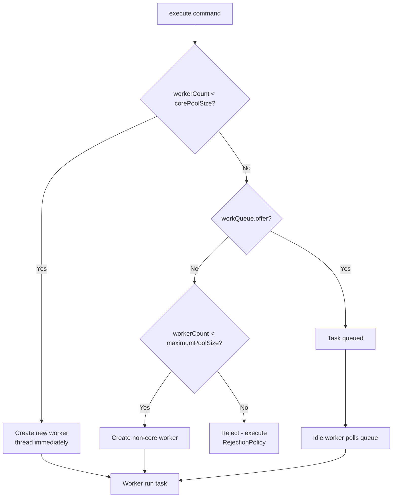
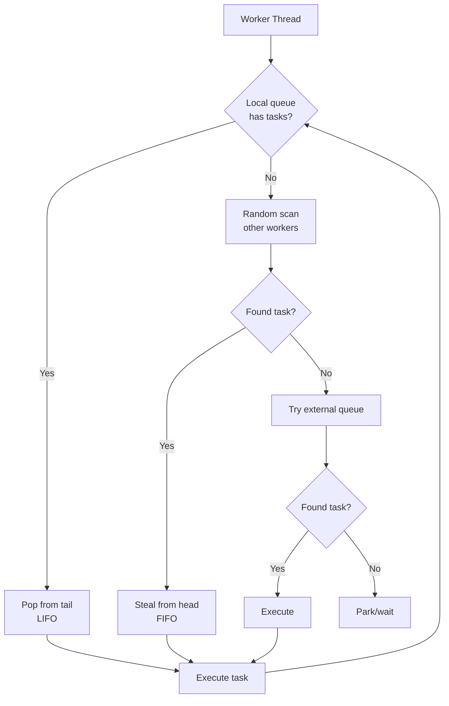
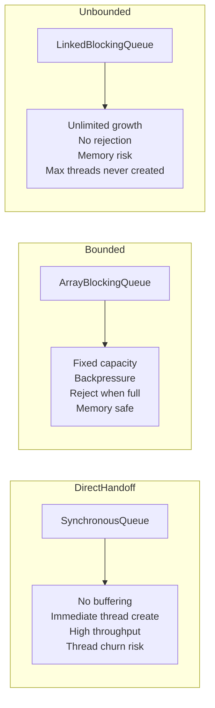

# java.util.concurrent Package - Deep Dive Research

## 1. Mục tiêu của Task

Hiểu sâu bản chất java.util.concurrent (JUC) - framework concurrency hiện đại của Java, thay thế hoàn toàn cách tiếp cận low-level (Thread/synchronized/wait/notify). Mục tiêu:
- **ExecutorService**: Thread pool management, lifecycle, task submission strategies
- **ThreadPoolExecutor**: Internals, work queue, rejection policies, tuning
- **CompletableFuture**: Async programming model, composition, error handling
- **Fork/Join Framework**: Work-stealing algorithm, divide-and-conquer parallelism

> **Tại sao cần nghiên cứu**: JUC là nền tảng của mọi hệ thống Java production hiện đại. Không hiểu sâu JUC = không thể tối ưu performance, debug deadlock/starvation, hoặc thiết kế scalable architecture.

---

## 2. Bản chất và Cơ chế Hoạt động

### 2.1 ExecutorService - Abstraction của Thread Management

#### Bản chất vấn đề
Trước Java 5, mỗi task mới = `new Thread().start()`:
- Thread creation cost: ~1MB stack + kernel resources
- Context switch overhead khi thread count > CPU cores
- Không có cơ chế quản lý, giới hạn, reuse thread

**Thread Pool Pattern** giải quyết bằng:
- **Thread reuse**: Worker threads sống lâu, poll task từ queue
- **Resource bound**: Giới hạn số thread và queue size
- **Separation of concerns**: Submit task vs Execute task

#### Kiến trúc Executor Framework

```
┌─────────────────────────────────────────────────────────────┐
│                    Executor Framework                        │
├─────────────────────────────────────────────────────────────┤
│  ┌─────────────┐    submit()    ┌──────────────────────┐   │
│  │   Client    │ ──────────────> │   ExecutorService    │   │
│  │   Code      │                 │  (Interface)         │   │
│  └─────────────┘                 └──────────────────────┘   │
│                                           │                  │
│                           ┌───────────────┼───────────────┐  │
│                           ▼               ▼               ▼  │
│                    ┌──────────┐   ┌──────────┐   ┌────────┐ │
│                    │ ThreadPool│   │ Scheduled│   │ ForkJoin│ │
│                    │ Executor  │   │ThreadPool│   │  Pool   │ │
│                    └──────────┘   └──────────┘   └────────┘ │
└─────────────────────────────────────────────────────────────┘
```

**Design Philosophy**:
- `Executor`: Đơn giản nhất, chỉ có `execute(Runnable)`
- `ExecutorService`: Mở rộng với lifecycle management + Future
- `ScheduledExecutorService`: Thêm scheduling capability
- `ThreadPoolExecutor`: Implementation cụ thể với full control

---

### 2.2 ThreadPoolExecutor - Internals

#### State Machine (quan trọng!)

ThreadPoolExecutor dùng **single atomic integer** để encode 2 thông tin:
- **runState**: RUNNING, SHUTDOWN, STOP, TIDYING, TERMINATED
- **workerCount**: Số worker threads hiện tại

```
32-bit integer packing:
┌────────────┬─────────────────────────────┐
│  Run State │       Worker Count          │
│  (3 bits)  │        (29 bits)            │
├────────────┼─────────────────────────────┤
│  RUNNING   │    current thread count     │
│  SHUTDOWN  │    (max ~536 million)       │
│  STOP      │                             │
│  TIDYING   │                             │
│ TERMINATED │                             │
└────────────┴─────────────────────────────┘
```

**Tại sao pack chung?**: Đảm bảo atomicity khi update cả state lẫn count. Single CAS operation.

#### Luồng xử lý Task Submission



**Queue Interaction**:
- Core threads tạo ngay khi submit, không cần queue có task
- Queue chỉ dùng khi core threads đang bận
- Max threads chỉ tạo khi queue full

> **Critical Insight**: Queue type quyết định behavior hoàn toàn:
> - `SynchronousQueue`: Direct handoff, không buffering → max threads tạo sớm
> - `LinkedBlockingQueue`: Unbounded → max threads không bao giờ tạo!
> - `ArrayBlockingQueue`: Bounded → backpressure thực sự

#### Worker Thread Lifecycle

```java
// Simplified worker run loop
final void runWorker(Worker w) {
    Thread wt = Thread.currentThread();
    Runnable task = w.firstTask;
    w.firstTask = null;
    
    while (task != null || (task = getTask()) != null) {
        w.lock(); // Guard against interrupts
        try {
            beforeExecute(wt, task); // Hook for monitoring
            task.run();
            afterExecute(task, null);  // Hook for monitoring
        } catch (Throwable ex) {
            afterExecute(task, ex);    // Exception handling
        } finally {
            task = null;
            w.completedTasks++;
            w.unlock();
        }
    }
    processWorkerExit(w, completedAbruptly);
}
```

**Worker termination** (getTask() returns null):
1. Pool đang STOP
2. Pool SHUTDOWN và queue empty
3. Worker count > max (khi giảm maxPoolSize) 
4. Worker idle quá `keepAliveTime` và worker count > corePoolSize

---

### 2.3 CompletableFuture - Async Programming Model

#### Bản chất: Future + Callback + Composition

**Vấn đề của Future đơn thuần**:
- Blocking `get()` kills async benefit
- No composition: Không chain các async operations
- No error handling: Exception propagate khó khăn
- No timeout control

**CompletableFuture giải quyết**:
- **Non-blocking**: Callback-based (thenApply, thenAccept, thenRun)
- **Composable**: Pipeline các async operations
- **Exception handling**: exceptionally, handle methods
- **Combining**: allOf, anyOf, thenCombine

#### Kiến trúc Nội bộ

```
┌──────────────────────────────────────────────────────────────┐
│                   CompletableFuture                          │
├──────────────────────────────────────────────────────────────┤
│  Object result                    // Đã hoàn thành?         │
│  Throwable ex                     // Exception?               │
│  volatile int state               // COMPLETING, etc.        │
│  Stack<Completion> completions    // Callback stack          │
└──────────────────────────────────────────────────────────────┘
                            │
                            ▼
┌──────────────────────────────────────────────────────────────┐
│  abstract class Completion extends ForkJoinTask<Void>        │
│  - UniApply, UniAccept, UniRun                               │
│  - BiApply, BiAccept                                         │
│  - OrApply, OrAccept                                         │
│  - Async = wrapped in ForkJoinTask hoặc plain Runnable       │
└──────────────────────────────────────────────────────────────┘
```

**Threading Model**:
- Default: `ForkJoinPool.commonPool()` (threads = CPU cores - 1)
- Có thể override bằng custom Executor
- **Cẩn thận**: Blocking trong CF chain = block common pool = affect JVM-wide parallelism

#### Execution Path

```mermaid
flowchart LR
    A[CompletableFuture] -->|complete(value)| B[State: NORMAL]
    A -->|completeExceptionally| C[State: ALT]
    B --> D{Has completions?}
    C --> D
    D -->|Yes| E[Pop completion]
    E --> F[Execute callback]
    F -->|Chain| D
    D -->|No| G[Done]
    
    H[thenApply] --> I{Already complete?}
    I -->|Yes| J[Execute immediately]
    I -->|No| K[Push to stack]
    K --> L[Wait for completion]
```

**Memory visibility guarantee**:
- Completion chain dùng `volatile` state + CAS operations
- Happens-before: Complete → Callback execution
- Không cần synchronized hay volatile trong callbacks

---

### 2.4 Fork/Join Framework - Work-Stealing

#### Bản chất: Divide-and-Conquer + Work-Stealing

**Vấn đề của thread pools truyền thống**:
- Fixed work assignment: Thread A lấy task từ queue chung
- Load imbalance: Thread A bận, Thread B idle nhưng không giúp

**Work-Stealing Algorithm**:
- Mỗi worker có **local deque** (double-ended queue)
- Worker push/pop task ở **tail** (LIFO - own work)
- Worker **steal** từ **head** (FIFO - other's work) của worker khác
- **Advantage**: Steal ít contention (head vs tail khác nhau)

```
Worker Thread A          Worker Thread B
┌─────────────┐          ┌─────────────┐
│ Local Deque │          │ Local Deque │
├─────────────┤          ├─────────────┤
│   Task 3    │          │   Task 1    │
│   Task 2    │          │   Task 4    │
│   Task 5    │          └─────────────┘
└─────────────┘                ▲
      │                        │
      │ push/pop (LIFO)        │ steal (FIFO)
      ▼                        │
    [Tail]                [Head]
```

#### ForkJoinPool Internals

```
┌───────────────────────────────────────────────────────────┐
│                    ForkJoinPool                           │
├───────────────────────────────────────────────────────────┤
│  ForkJoinWorkerThread[] workers                           │
│  WorkQueue[] workQueues  (odd indices = external submits) │
│  AtomicLong stealCount                                    │
│  int parallelism (target parallelism level)               │
└───────────────────────────────────────────────────────────┘
                             │
                             ▼
┌───────────────────────────────────────────────────────────┐
│  class WorkQueue extends Internal Stack/Deque             │
│  - top, base indices (for push/pop vs steal)             │
│  - ForkJoinTask<?>[] array (circular buffer)             │
│  - lock-free operations via CAS on top/base              │
└───────────────────────────────────────────────────────────┘
```

**Task Types**:
- **ForkJoinTask**: Abstract base, `fork()` và `join()`
- **RecursiveAction**: Không return value
- **RecursiveTask<T>**: Return value T

**Fork/Join Semantics**:
```java
// fork() = async submit to local queue
// join() = wait for result, may help execute other tasks
```

#### Work-Stealing Loop



**Why LIFO for own, FIFO for steal?**:
- **LIFO (own)**: Depth-first execution, cache locality tốt
- **FIFO (steal)**: Bread-first stealing, giảm contention (tail không bao giờ xung đột với head)

---

## 3. So sánh Các Lựa chọn

### 3.1 ExecutorService Types Comparison

| Type | Core | Max | Queue | Use Case |
|------|------|-----|-------|----------|
| `newFixedThreadPool(n)` | n | n | Unbounded LinkedBlockingQueue | **KHÔNG NÊN DÙNG** - Queue grow vô hạn, OOM risk |
| `newCachedThreadPool()` | 0 | Integer.MAX_VALUE | SynchronousQueue | Short-lived async tasks, nhưng unbounded threads = dangerous |
| `newSingleThreadExecutor()` | 1 | 1 | Unbounded LinkedBlockingQueue | Sequential execution, **KHÔNG NÊN DÙNG** - OOM risk |
| `newWorkStealingPool()` | 0 | CPU cores | Work-stealing deque | Divide-and-conquer, parallel streams |
| **Custom ThreadPoolExecutor** | Tuned | Tuned | Bounded ArrayBlockingQueue | **Production recommendation** |

> **Trade-off Analysis**:
> - Unbounded queue = never reject, but OOM risk
> - SynchronousQueue = immediate scaling, nhưng thread churn
> - Bounded queue = backpressure thực sự, requires rejection policy

### 3.2 Queue Type Impact



### 3.3 Async Models: Future vs CompletableFuture vs Reactive

| Aspect | Future | CompletableFuture | Reactive Streams |
|--------|--------|-------------------|------------------|
| Blocking | `get()` blocks | Non-blocking callbacks | Non-blocking backpressure |
| Composition | Manual | Chain methods | Operator chains |
| Error handling | Try-catch around get | `exceptionally`, `handle` | `onError` signal |
| Threading | Caller or pool | Configurable executor | Scheduler abstraction |
| Cancellation | Limited | Cooperative | Cooperative |
| Learning curve | Low | Medium | High |

### 3.4 Parallelism: ThreadPool vs ForkJoin

| Aspect | ThreadPoolExecutor | ForkJoinPool |
|--------|-------------------|--------------|
| Work distribution | Central queue | Local queues + stealing |
| Task granularity | Course-grained | Fine-grained |
| Ideal for | IO-bound, mixed | CPU-bound, recursive |
| Thread count | Configurable | Usually CPU cores |
| Overhead | Higher | Lower for fine tasks |
| Blocking tolerance | OK | **Tránh** - block steals |

---

## 4. Rủi ro, Anti-patterns, Lỗi Thường gặp

### 4.1 ThreadPoolExecutor Anti-patterns

#### ⚠️ Anti-pattern 1: Unbounded Queue
```java
// KHÔNG BAO GIỜ làm điều này!
new ThreadPoolExecutor(4, 4, 
    0L, TimeUnit.MILLISECONDS,
    new LinkedBlockingQueue<>() // Unbounded!
);
```
**Vấn đề**: 
- Max threads = vô nghĩa (không bao giờ tạo vì queue chưa full)
- Queue grow đến khi OOM
- Không có backpressure

**Fix**: Dùng `ArrayBlockingQueue(capacity)` hoặc `LinkedBlockingQueue(capacity)`

#### ⚠️ Anti-pattern 2: Caller Runs Policy Without Monitoring
```java
new ThreadPoolExecutor(4, 8, 60, TimeUnit.SECONDS,
    new ArrayBlockingQueue<>(100),
    new ThreadPoolExecutor.CallerRunsPolicy()
);
```
**Vấn đề**: Caller (main thread) chạy task khi reject → block caller → cascade failure

**Fix**: Kết hợp với monitoring, alert khi caller runs xảy ra

#### ⚠️ Anti-pattern 3: Ignoring RejectedExecutionException
```java
// AbortPolicy (default) - throw exception
// Nếu không catch = task lost
```
**Fix**: Luôn có error handling, log rejected tasks

#### ⚠️ Anti-pattern 4: No ThreadFactory
```java
// Default thread factory: pool-N-thread-M
// Không đặt tên = khó debug, khó trace
```
**Fix**: 
```java
new ThreadFactoryBuilder()
    .setNameFormat("payment-processor-%d")
    .setUncaughtExceptionHandler((t, e) -> log.error(...))
    .build()
```

#### ⚠️ Anti-pattern 5: Long-Running Tasks in Fixed Pool
```java
// 4 threads, task chạy 10 phút
// -> Pool exhausted, new tasks queue hoặc reject
```
**Fix**: Separate pools cho short vs long tasks

### 4.2 CompletableFuture Pitfalls

#### ⚠️ Pitfall 1: Blocking in Chain
```java
CompletableFuture.supplyAsync(() -> fetchUser())
    .thenApply(user -> {
        // BLOCKING database call!
        return database.getOrders(user.id);
    });
```
**Vấn đề**: Block ForkJoinPool.commonPool() → affect Parallel Streams và các CF khác

**Fix**: Dùng `thenApplyAsync` với custom executor cho blocking operations

#### ⚠️ Pitfall 2: Exception Swallowing
```java
future.thenApply(x -> x / 0)  // Exception!
      .thenApply(y -> y + 1); // This never executes
// Exception = lost if không handle
```
**Fix**: Luôn có `exceptionally` hoặc `handle` ở cuối chain

#### ⚠️ Pitfall 3: Wrong Exception Handler Placement
```java
future.exceptionally(ex -> defaultValue)
      .thenApply(x -> x.toString()); // Có thể throw NPE!
```
`exceptionally` chỉ catch exception từ stage **trước nó**, không phải cả chain.

#### ⚠️ Pitfall 4: Timeout Forgetting
```java
future.get(); // Block forever!
```
**Fix**: `future.get(timeout, TimeUnit.SECONDS)` hoặc `orTimeout()` / `completeOnTimeout()`

### 4.3 Fork/Join Gotchas

#### ⚠️ Gotcha 1: Blocking in ForkJoinTask
```java
protected Integer compute() {
    Thread.sleep(1000); // BLOCKING!
    // ...
}
```
**Vấn đề**: Worker thread block = không thể steal = parallelism giảm

**Fix**: Dùng `ForkJoinPool.managedBlock()` hoặc không dùng FJ cho IO

#### ⚠️ Gotcha 2: Too Fine Granularity
```java
if (taskSize <= 1) return; // Quá nhỏ
// Overhead tạo task > benefit
```
**Rule of thumb**: Threshold nên để mỗi leaf task chạy 100ms-1s

#### ⚠️ Gotcha 3: Recursive Result Duplication
```java
// Sai: Mỗi recursive call tạo mảng mới
// Đúng: Truyền mảng chung, pass indices
```

---

## 5. Khuyến nghị Thực chiến trong Production

### 5.1 ThreadPool Configuration Template

```java
public class ExecutorConfig {
    
    // IO-Bound Pool (network, disk)
    public static ExecutorService ioBoundPool() {
        int core = 50;      // Nhiều thread (chờ IO)
        int max = 200;      // Burst capacity
        long keepAlive = 60L;
        
        return new ThreadPoolExecutor(
            core, max, keepAlive, TimeUnit.SECONDS,
            new ArrayBlockingQueue<>(1000), // Bounded!
            new ThreadFactoryBuilder()
                .setNameFormat("io-pool-%d")
                .build(),
            new ThreadPoolExecutor.CallerRunsPolicy() // Backpressure
        );
    }
    
    // CPU-Bound Pool (computation)
    public static ExecutorService cpuBoundPool() {
        int core = Runtime.getRuntime().availableProcessors();
        int max = core; // Không cần more threads
        
        return new ThreadPoolExecutor(
            core, max, 0L, TimeUnit.MILLISECONDS,
            new LinkedBlockingQueue<>(100), // Bounded, nhỏ
            new ThreadFactoryBuilder()
                .setNameFormat("cpu-pool-%d")
                .build(),
            new ThreadPoolExecutor.AbortPolicy() // Fail fast
        );
    }
}
```

### 5.2 CompletableFuture Best Practices

```java
// 1. Luôn dùng custom executor cho blocking ops
Executor dbExecutor = Executors.newFixedThreadPool(20);

CompletableFuture.supplyAsync(() -> callApi(), apiExecutor)
    .thenApplyAsync(response -> parseJson(response), cpuExecutor)
    .thenApplyAsync(data -> saveToDb(data), dbExecutor)
    .orTimeout(5, TimeUnit.SECONDS)  // Timeout!
    .exceptionally(ex -> {
        log.error("Pipeline failed", ex);
        return defaultValue;
    });

// 2. Multiple futures - giới hạn concurrency
List<CompletableFuture<Result>> futures = urls.stream()
    .map(url -> CompletableFuture.supplyAsync(
        () -> download(url), 
        limitedExecutor // Giới hạn concurrent downloads
    ))
    .toList();

// 3. allOf với timeout
CompletableFuture<Void> all = CompletableFuture.allOf(
    futures.toArray(new CompletableFuture[0])
);
try {
    all.get(30, TimeUnit.SECONDS);
} catch (TimeoutException e) {
    futures.forEach(f -> f.cancel(true));
    throw e;
}
```

### 5.3 Monitoring & Observability

**ThreadPool Metrics cần track**:
```java
ThreadPoolExecutor pool = ...;

// Via JMX hoặc custom exporter
pool.getActiveCount();        // Đang chạy
pool.getQueue().size();       // Đang chờ
pool.getCompletedTaskCount(); // Throughput
pool.getLargestPoolSize();    // Peak threads
```

**Alert thresholds**:
- Queue size > 80% capacity → Scale up hoặc backpressure
- Active count == max for > 5 minutes → Bottleneck
- Rejection rate > 0.1% → Capacity issue

### 5.4 Graceful Shutdown Pattern

```java
public void shutdownGracefully(ExecutorService pool, int timeoutSec) {
    pool.shutdown(); // Disable new tasks
    try {
        if (!pool.awaitTermination(timeoutSec, TimeUnit.SECONDS)) {
            pool.shutdownNow(); // Force interrupt
            if (!pool.awaitTermination(timeoutSec, TimeUnit.SECONDS)) {
                log.error("Pool did not terminate");
            }
        }
    } catch (InterruptedException e) {
        pool.shutdownNow();
        Thread.currentThread().interrupt();
    }
}
```

---

## 6. Kết luận

**Bản chất java.util.concurrent**:

1. **ExecutorService** = Resource management pattern cho threads. Thread pool giải quyết vấn đề expensive thread creation và unbounded resource consumption. Bản chất là worker threads liên tục poll task từ queue.

2. **ThreadPoolExecutor** = State machine kết hợp thread count và pool state trong single atomic value. Core insight: queue type quyết định behavior nhiều hơn thread counts. Bounded queue là backpressure mechanism duy nhất reliable.

3. **CompletableFuture** = Monad pattern cho async computation. Bản chất là lock-free state machine với completion chain. Non-blocking composition nhưng cẩn thận với thread pool selection.

4. **Fork/Join** = Work-stealing algorithm cho divide-and-conquer. Bản chất: local LIFO queue + steal FIFO = giảm contention, tăng locality. Chỉ hiệu quả với fine-grained, CPU-bound, non-blocking tasks.

**Trade-off chính**:
- **Bounded queue**: Memory safe nhưng cần rejection strategy
- **Unbounded queue**: Never reject nhưng OOM risk, max threads vô nghĩa
- **Synchronous queue**: Low latency nhưng thread churn
- **Common pool**: Convenient nhưng easy to exhaust

**Rủi ro production lớn nhất**: Không hiểu queue behavior dẫn đến OOM hoặc hidden rejection. Không monitor pool metrics dẫn đến blind failure.

**Recommendation cuối cùng**: 
- Luôn dùng bounded queues với explicit capacity
- Luôn monitor pool metrics
- Tách biệt pools cho IO vs CPU tasks  
- Dùng custom executors với CompletableFuture cho blocking operations
- Tránh Fork/Join cho IO-bound work
