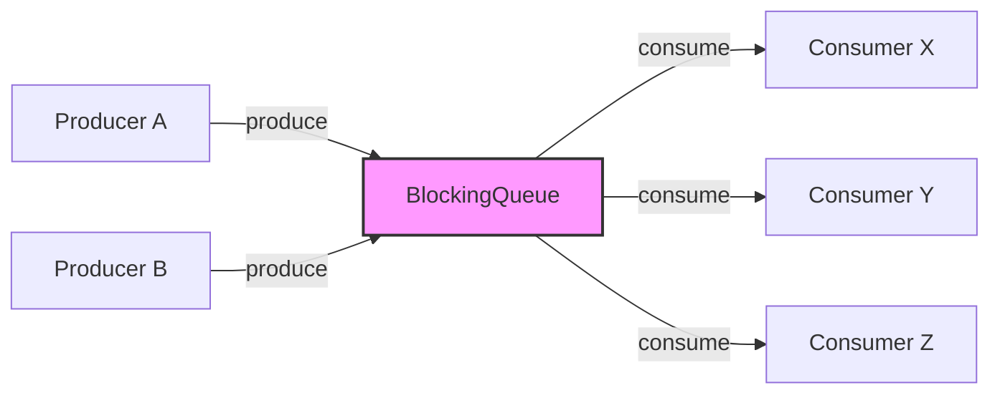
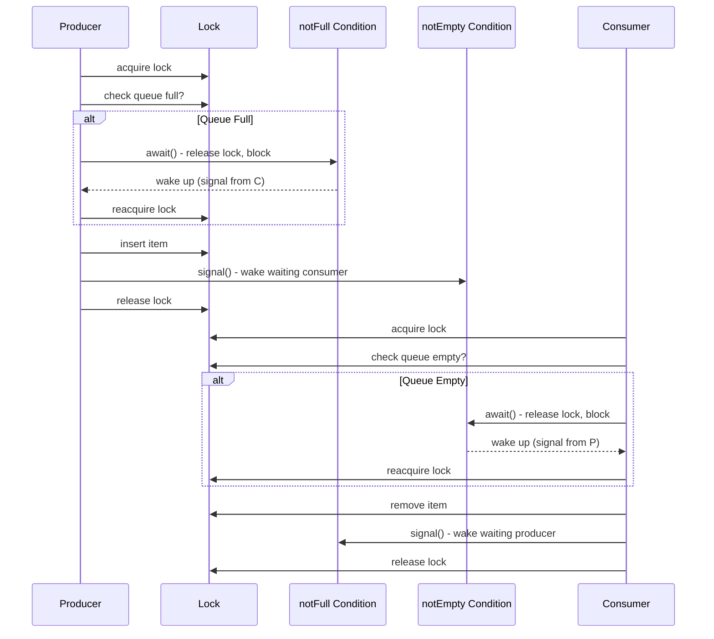
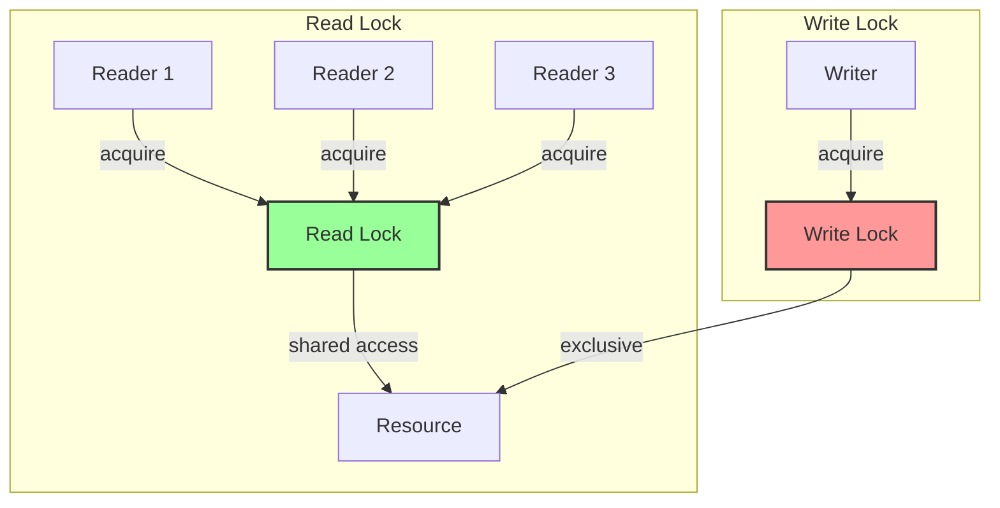
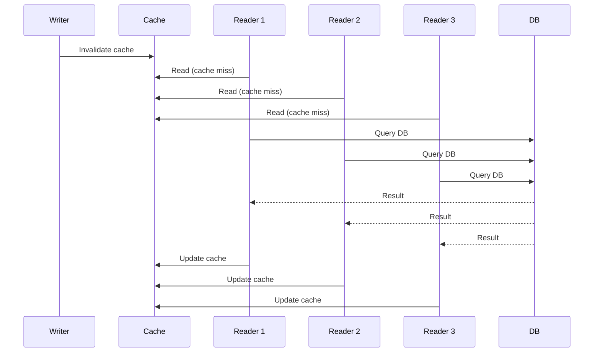
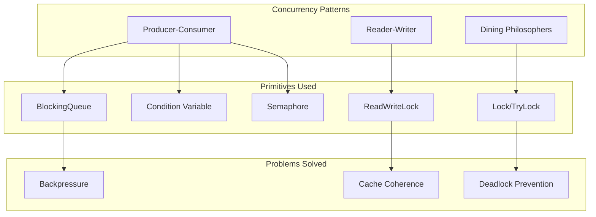

# Concurrency Patterns - Producer-Consumer, Reader-Writer, Dining Philosophers

## 1. Mục tiêu của task

Hiểu sâu bản chất của 3 pattern đồng bộ hóa cơ bản trong lập trình concurrency:
- **Producer-Consumer**: Điều phối luồng sản xuất và tiêu thụ dữ liệu
- **Reader-Writer**: Tối ưu truy cập đọc/ghi vào resource chia sẻ
- **Dining Philosophers**: Giải quyết deadlock và resource contention

Mục tiêu không chỉ là "viết code đúng" mà là hiểu **vì sao** các pattern này tồn tại, **khi nào** chúng phá sản, và **cách triển khai production-grade**.

---

## 2. Bản chất và cơ chế hoạt động

### 2.1 Producer-Consumer Pattern

#### Bản chất vấn đề

Vấn đề cốt lõi: **Tốc độ sản xuất và tiêu thụ không đồng đều**. Producer và consumer chạy ở tốc độ khác nhau, và chúng không thể (hoặc không nên) đợi lẫn nhau.

#### Cơ chế hoạt động



**BlockingQueue là giải pháp tối ưu** vì nó kết hợp 3 cơ chế:

| Cơ chế | Điều kiện | Hành vi |
|--------|-----------|---------|
| `put()` | Queue full | Thread blocked, waiting for space |
| `take()` | Queue empty | Thread blocked, waiting for item |
| `offer()`/`poll()` | Timeout-based | Non-blocking với timeout |

#### Kiến trúc tầng thấp

BlockingQueue trong Java sử dụng **2 condition variables** (trong AbstractQueuedSynchronizer):

```
notFull  → Signal khi có space mới (consumer vừa take)
notEmpty → Signal khi có item mới (producer vừa put)
```



#### Trade-offs trong triển khai

| Triển khai | Ưu điểm | Nhược điểm | Khi nào dùng |
|------------|---------|------------|--------------|
| `LinkedBlockingQueue` | Unbounded/bounded, lock tách biệt put/take | Node allocation overhead | Đa số trường hợp |
| `ArrayBlockingQueue` | Bounded, array pre-allocated, cache-friendly | Lock chung cho put/take | Bounded queue, high throughput |
| `SynchronousQueue` | Zero-capacity, direct handoff | Blocking ngay lập tức | Immediate transfer, thread pool |
| `LinkedTransferQueue` | Transfer capability, lock-free | Phức tạp | Work stealing, fork/join |

> **Quan trọng**: `LinkedBlockingQueue` mặc định unbounded (Integer.MAX_VALUE) - **NGUY HIỂM trong production**. Luôn set capacity hoặc dùng `ArrayBlockingQueue`.

---

### 2.2 Reader-Writer Pattern

#### Bản chất vấn đề

Vấn đề cốt lõi: **Read-heavy workloads**. Nhiều readers có thể đọc đồng thỳ, nhưng writer cần exclusive access.

**Giả thiết**: Read operations nhiều hơn write operations, và reads không conflict với nhau.

#### Cơ chế hoạt động



**Java ReentrantReadWriteLock** triển khai với 2 locks:
- **Read Lock**: Cho phép multiple readers, block khi có writer
- **Write Lock**: Exclusive, block tất cả readers và writers khác

#### State Management

ReentrantReadWriteLock dùng **1 int để track cả 2 locks** (tiết kiệm memory):

```
32-bit state: [ writeHoldCount (16 bits) | readHoldCount (16 bits) ]
               
Write lock: high 16 bits
Read lock:  low 16 bits + thread-local hold counts
```

#### Writer Starvation Problem

**Vấn đề nghiêm trọng**: Nếu readers liên tục đến, writer sẽ bị đói (starvation) vì:
1. Reader 1 đang đọc
2. Writer đợi Reader 1
3. Reader 2 đến, được phép đọc (vì read lock shared)
4. Writer tiếp tục đợi...
5. Reader 3, 4, 5... liên tục đến

**Giải pháp - Fair Mode**:

```java
ReentrantReadWriteLock fairLock = new ReentrantReadWriteLock(true);
```

Fair mode dùng **FIFO queue**: writer được xếp hàng, readers đến sau writer sẽ block.

#### Trade-offs: Fair vs Non-Fair

| Mode | Throughput | Starvation | Latency | Khi nào dùng |
|------|------------|------------|---------|--------------|
| Non-Fair | Cao | Reader: no<br>Writer: có thể | Thấp | Read-heavy, writer không critical |
| Fair | Thấp hơn | Không | Cao hơn | Writer cần đảm bảo progress |

#### Stampede Pattern (Read Amplification)

**Vấn đề cache**: Khi write xong, hàng loạt readers đồng loạt đọc lại cache.



**Giải pháp**: Cache stampede prevention (mutex per key, probabilistic early expiration).

---

### 2.3 Dining Philosophers Problem

#### Bản chất vấn đề

Vấn đề cốt lõi: **Circular wait + Resource holding**. 5 philosophers, 5 forks, mỗi người cần 2 forks để ăn.


#### Deadlock xảy ra khi:

1. Tất cả philosophers cùng pick up fork trái
2. Tất cả đợi fork phải (đã bị neighbor giữ)
3. Circular wait → Deadlock

#### Các giải pháp và phân tích

| Giải pháp | Cơ chế | Trade-off | Production? |
|-----------|--------|-----------|-------------|
| **Resource Hierarchy** | Number forks, luôn pick lower trước | Simple, no deadlock | Limited |
| **Arbitrator (Mutex)** | Bồi bàn phê duyệt | Sequential, bottleneck | Có thể |
| **Chandy/Misra** | Distributed permission | Phức tạp | Không |
| **Try-Lock Timeout** | TryLock with timeout + backoff | Liveness issue possible | Phổ biến nhất |
| **Ticket System** | Fair ordering | Implementation phức tạp | Có thể |

#### Giải pháp Production-Grade: Try-Lock với Backoff

```
while (true) {
    if (leftFork.tryLock()) {
        try {
            if (rightFork.tryLock(waitTime, TimeUnit.MILLISECONDS)) {
                try {
                    eat();
                    break;
                } finally {
                    rightFork.unlock();
                }
            }
        } finally {
            leftFork.unlock();
        }
    }
    // Backoff để giảm contention
    Thread.sleep(random.nextInt(maxBackoff));
}
```

**Tại sao backoff quan trọng**:
- Không backoff: 5 philosophers liên tục try-lock → CPU spinning
- Random backoff: Giảm probability của simultaneous retry

#### Liveness vs Safety

- **Safety**: Không có deadlock (mutual exclusion, no circular wait)
- **Liveness**: Mỗi philosopher cuối cùng sẽ ăn được (no starvation)

Try-lock giải quyết safety nhưng **không đảm bảo liveness** - có thể xảy ra livelock hoặc starvation.

---

## 3. Kiến trúc và luồng xử lý

### 3.1 Tổng quan Pattern Relationships



### 3.2 Decision Tree: Khi nào dùng pattern nào?

```
Bạn cần đồng bộ hóa access vào resource?
│
├── Dữ liệu được sản xuất/tiêu thụ ở tốc độ khác nhau?
│   └── YES → Producer-Consumer + BlockingQueue
│
├── Read operations nhiều hơn write, và reads có thể concurrent?
│   └── YES → Reader-Writer + ReentrantReadWriteLock
│       └── Writer bị starvation?
│           └── YES → Fair mode hoặc StampedLock
│
├── Multiple threads cần multiple resources để hoàn thành task?
│   └── YES → Dining Philosophers pattern
│       └── Có thể acquire tất cả resources cùng lúc?
│           └── YES → Coarse-grained lock (Arbitrator)
│           └── NO → Try-lock with timeout + backoff
│
└── Simple mutual exclusion?
    └── ReentrantLock hoặc synchronized
```

---

## 4. So sánh các lựa chọn triển khai

### 4.1 Producer-Consumer: Java 8+ Enhancements

| Approach | Java Version | Đặc điểm | Use Case |
|----------|--------------|----------|----------|
| `BlockingQueue` | 5+ | Traditional, battle-tested | General purpose |
| `TransferQueue` | 7+ | Direct handoff capability | Work stealing |
| `CompletableFuture` | 8+ | Functional async | Pipeline processing |
| `SubmissionPublisher` | 9+ | Reactive Streams compliant | Reactive systems |
| Virtual Threads | 21+ | Millions of threads | High concurrency, blocking-friendly |

### 4.2 Reader-Writer: Lock Evolution

| Lock Type | Java | Đặc điểm | Best For |
|-----------|------|----------|----------|
| `synchronized` | 1.0 | Exclusive only | Simple exclusion |
| `ReentrantReadWriteLock` | 5 | Read/Write separation | Read-heavy |
| `StampedLock` | 8 | Optimistic reading | Read-mostly, low write |
| `VarHandle` | 9 | Low-level atomic | Ultra-low latency |

**StampedLock - Game changer cho Java 8+**:

```java
StampedLock lock = new StampedLock();

// Optimistic read (no actual locking)
long stamp = lock.tryOptimisticRead();
try {
    // Read data
    if (!lock.validate(stamp)) {
        // Someone wrote, fallback to read lock
        stamp = lock.readLock();
        try {
            // Read data again
        } finally {
            lock.unlockRead(stamp);
        }
    }
} 

// Write
long stamp = lock.writeLock();
try {
    // Modify data
} finally {
    lock.unlockWrite(stamp);
}
```

**Trade-off của StampedLock**:
- Optimistic read: **Không reentrant**, nếu validate fail phải upgrade
- Không có fair mode
- Phức tạp hơn ReadWriteLock

---

## 5. Rủi ro, anti-patterns, lỗi thường gặp

### 5.1 Producer-Consumer Pitfalls

#### 1. Unbounded Queue = OutOfMemoryError

```java
// ANTI-PATTERN - KHÔNG BAO GIỜ LÀM
BlockingQueue<Task> queue = new LinkedBlockingQueue<>(); // Integer.MAX_VALUE capacity!
```

**Giải pháp**:
```java
// Tốt - Bounded queue với caller-runs policy
BlockingQueue<Task> queue = new LinkedBlockingQueue<>(1000);
ThreadPoolExecutor executor = new ThreadPoolExecutor(
    4, 8, 60, TimeUnit.SECONDS, queue,
    new ThreadPoolExecutor.CallerRunsPolicy() // Backpressure
);
```

#### 2. Poison Pill Pattern sai cách

```java
// ANTI-PATTERN - Consumer có thể miss poison pill
while (true) {
    Task task = queue.take();
    if (task.isPoison()) break; // Nếu queue còn items, chúng bị bỏ lại
    process(task);
}
```

**Giải pháp đúng**: Dùng `drainTo()` hoặc đảm bảo poison pill là item cuối.

#### 3. Silent Producer Exception

```java
// ANTI-PATTERN - Exception trong producer làm mất task
executor.submit(() -> {
    try {
        queue.put(produce()); // Nếu interrupted, task bị mất
    } catch (InterruptedException e) {
        // Swallow exception
    }
});
```

### 5.2 Reader-Writer Pitfalls

#### 1. Read-Modify-Write với Read Lock

```java
// ANTI-PATTERN - Race condition
readLock.lock();
try {
    int value = sharedValue;
    value++; // Read done, modifying without write lock!
    sharedValue = value;
} finally {
    readLock.unlock();
}
```

**Giải pháp**: Upgrade lock hoặc dùng `AtomicInteger`/`LongAdder`.

#### 2. Long-Held Read Lock

```java
// ANTI-PATTERN - Writer starvation
readLock.lock();
try {
    // Do slow I/O, network call, or heavy computation
    Thread.sleep(10000); // Writer đợi 10s!
} finally {
    readLock.unlock();
}
```

#### 3. Nested Lock Acquisition (Deadlock)

```java
// Thread 1
readLock.lock(); // Gets read lock
// ...
writeLock.lock(); // BLOCKS - waiting for all readers

// Thread 2
readLock.lock(); // BLOCKS - waiting for Thread 1 to release? NO!
// Actually in Java: Thread 2 gets read lock
// Thread 1 cannot upgrade → DEADLOCK
```

> **Java's ReentrantReadWriteLock không hỗ trợ lock upgrade**. Phải release read lock trước khi acquire write lock.

### 5.3 Dining Philosophers Pitfalls

#### 1. Deadlock (đã đề cập)

#### 2. Livelock

```java
// ANTI-PATTERN - Try-lock liên tục không backoff
while (true) {
    if (left.tryLock() && right.tryLock()) {
        eat();
        break;
    }
    // Không có sleep/release → CPU spinning
}
```

#### 3. Unfair Resource Distribution

Random backoff có thể dẫn đến một philosopher "may mắn" liên tục ăn được, philosopher khác bị đói.

---

## 6. Khuyến nghị thực chiến trong production

### 6.1 Monitoring & Observability

```java
// Expose queue metrics
public class MonitoredQueue<T> {
    private final BlockingQueue<T> queue;
    private final MeterRegistry registry;
    
    public void put(T item) throws InterruptedException {
        int sizeBefore = queue.size();
        queue.put(item);
        int sizeAfter = queue.size();
        
        if (sizeAfter > highWatermark) {
            registry.counter("queue.backpressure").increment();
        }
        registry.gauge("queue.size", queue.size());
        registry.gauge("queue.remaining", queue.remainingCapacity());
    }
}
```

**Metrics quan trọng**:
- Queue size, remaining capacity
- Wait time for put/take
- Throughput (items/sec)
- Consumer lag (producer rate - consumer rate)

### 6.2 Graceful Shutdown

```java
public class GracefulProducerConsumer {
    private final ExecutorService executor;
    private final BlockingQueue<Task> queue;
    private volatile boolean shutdown = false;
    
    public void shutdown() {
        shutdown = true;
        
        // 1. Stop accepting new tasks
        // 2. Wait for queue to drain
        while (!queue.isEmpty()) {
            Thread.sleep(100);
        }
        
        // 3. Poison pill cho consumers
        for (int i = 0; i < consumerCount; i++) {
            queue.offer(POISON_PILL);
        }
        
        // 4. Await termination
        executor.awaitTermination(timeout, TimeUnit.SECONDS);
    }
}
```

### 6.3 Java 21+ Virtual Threads

```java
// Producer-Consumer với Virtual Threads
try (var executor = Executors.newVirtualThreadPerTaskExecutor()) {
    BlockingQueue<Task> queue = new LinkedBlockingQueue<>(1000);
    
    // Tạo 1000 producers (virtual threads rẻ)
    for (int i = 0; i < 1000; i++) {
        executor.submit(() -> {
            while (!Thread.interrupted()) {
                queue.put(produce()); // Blocking là OK với virtual threads
            }
        });
    }
    
    // Tạo consumers
    for (int i = 0; i < 10; i++) {
        executor.submit(() -> {
            while (true) {
                Task task = queue.take();
                process(task);
            }
        });
    }
}
```

### 6.4 Production Checklist

| Pattern | Checklist Item | Priority |
|---------|---------------|----------|
| All | Bounded resources | CRITICAL |
| All | Timeout trên tất cả blocking operations | HIGH |
| All | Metrics và alerting | HIGH |
| All | Graceful shutdown | HIGH |
| P-C | Backpressure strategy (caller-runs, discard, etc.) | CRITICAL |
| P-C | Dead letter queue cho failed items | MEDIUM |
| R-W | Writer starvation monitoring | MEDIUM |
| R-W | Lock hold time metrics | HIGH |
| DP | Try-lock timeout config | CRITICAL |
| DP | Random backoff range tuning | MEDIUM |

---

## 7. Kết luận

### Bản chất tóm tắt

| Pattern | Bài toán cốt lõi | Cơ chế then chốt | Dấu hiệu nhận biết cần dùng |
|---------|-----------------|------------------|---------------------------|
| **Producer-Consumer** | Tốc độ không đồng đều, cần decoupling | BlockingQueue + Condition variables | "Producer nhanh hơn consumer" hoặc ngược lại |
| **Reader-Writer** | Read-heavy access pattern | Shared read lock + Exclusive write lock | "Nhiều thread đọc, ít thread ghi" |
| **Dining Philosophers** | Multiple resources, circular dependency | Try-lock + Timeout + Backoff | "Thread cần nhiều lock để hoàn thành task" |

### Nguyên tắc vàng

1. **Luôn dùng bounded queues** - Unbounded = tự sát
2. **Monitor everything** - Queue size, lock wait time, contention
3. **Plan for shutdown** - Graceful > Immediate
4. **Prefer higher-level abstractions** - BlockingQueue > wait/notify
5. **Understand your workload** - Read-heavy vs Write-heavy, throughput vs latency

### Tư duy Senior

> Concurrency patterns không phải là "best practices" để học thuộc. Chúng là **solutions cho specific problems**. Hiểu problem trước, pattern sau. Đừng ép problem vào pattern bạn biết.

Trade-off quan trọng nhất: **Complexity vs Correctness**. Đôi khi `synchronized` method đơn giản tốt hơn cả rừng ReadWriteLock phức tạp.

---

*Research completed: 2026-03-28*
