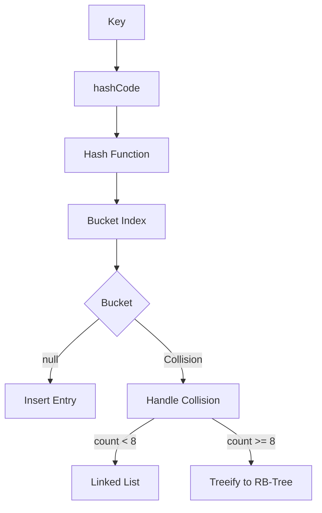

# HashMap Implementation - Deep Dive

## 1. Mục tiêu của task

Hiểu sâu cơ chế hoạt động bên trong của `HashMap` - cấu trúc dữ liệu được sử dụng nhiều nhất trong Java Collections Framework. Tập trung vào:
- Cơ chế ánh xạ key → hash → bucket
- Xử lý va chạm hash (hash collision)
- Cơ chế treeify (chuyển linked list thành cây đỏ-đen)
- Quá trình resize và rehash
- Vai trò của load factor

---

## 2. Bản chất và cơ chế hoạt động

### 2.1. Kiến trúc tổng quan



**Cấu trúc dữ liệu nền tảng:**

```
HashMap<K, V>
├── Node<K,V>[] table      // Mảng buckets (mảng con trỏ)
├── int size               // Số entry thực tế
├── int threshold          // Ngưỡng resize = capacity × loadFactor
├── float loadFactor       // Tỷ lệ tải (default 0.75)
└── int TREEIFY_THRESHOLD  // = 8, ngưỡng chuyển sang cây
```

> **Lưu ý quan trọng:** HashMap trong Java là **mảng của linked list/cây**, không phải bảng băm hoàn chỉnh (perfect hash table). Thiết kế này chấp nhận collision như một đặc điểm, không phải lỗi.

### 2.2. Hash Function - Bước ánh xạ quan trọng

Java 8+ sử dụng hàm hash **tinh chỉnh cao**:

```java
static final int hash(Object key) {
    int h;
    // XOR với phần cao 16-bit để phân tán tốt hơn
    return (key == null) ? 0 : (h = key.hashCode()) ^ (h >>> 16);
}
```

**Tại sao cần XOR với `h >>> 16`?**

Vấn đề: `hashCode()` trả về 32-bit int. Khi tính index: `index = hash & (n-1)` (n là capacity), chỉ dùng **log2(n) bit thấp**.

- Với table size = 16 (2^4), chỉ dùng 4 bit thấp của hash
- Nếu hashCode phân bố không đều ở bit cao → clustering nghiêm trọng

**Giải pháp:** XOR bit cao vào bit thấp để đảm bảo **tất cả bit đều ảnh hưởng index**:

```
Original: 1101 0010 1010 1100 0011 0100 1111 0000
>>> 16:   0000 0000 0000 0000 1101 0010 1010 1100
XOR:      1101 0010 1010 1100 1110 0110 0101 1100
           ↑↑↑↑ ↑↑↑↑ ↑↑↑↑ ↑↑↑↑  ← bit cao ảnh hưởng bit thấp
```

> **Trade-off:** Thêm 1 phép XOR để cải thiện phân tán đáng kể, đặc biệt với table size nhỏ.

### 2.3. Index Calculation

```java
// Với capacity = n (luôn là lũy thừa của 2)
// index = hash % n  →  index = hash & (n - 1)  (tối ưu bitwise)
```

**Tại sao capacity luôn là lũy thừa của 2?**

| Capacity (n) | n-1 (binary) | Lợi ích |
|--------------|--------------|---------|
| 16 | 1111 | `hash & 1111` = giữ 4 bit cuối |
| 32 | 11111 | `hash & 11111` = giữ 5 bit cuối |

- **Tính index O(1)** bằng bitwise AND thay vì modulo
- **Resize đơn giản:** Element ở bucket i sẽ ở bucket i hoặc i+n sau resize

---

## 3. Xử lý Hash Collision

### 3.1. Collision là gì?

Khi hai key khác nhau có cùng hash hoặc cùng bucket index.

```
Bucket 0: null
Bucket 1: ["key1" → hash=33] → ["key2" → hash=33]  ← Collision!
Bucket 2: null
```

### 3.2. Chiến lược: Separate Chaining

Java HashMap dùng **Separate Chaining** - mỗi bucket chứa linked list/cây các entry.

**So sánh với Open Addressing:**

| Approach | Ưu điểm | Nhược điểm | Khi nào dùng |
|----------|---------|------------|--------------|
| **Separate Chaining** | - Xử lý collision tốt dù load factor cao<br>- Dễ implement remove<br>- Không bị clustering | - Overhead bộ nhớ (con trỏ next)<br>- Cache locality kém | HashMap (Java), kích thước không xác định trước |
| **Open Addressing** | - Cache locality tốt<br>- Không overhead con trỏ<br>- Nhỏ gọn hơn | - Clustering nghiêm trọng khi đầy<br>- Remove phức tạp<br>- Resize sớm hơn | ConcurrentHashMap (Java 8+), kích thước cố định |

> **Quyết định thiết kế:** Java chọn Separate Chaining vì HashMap cần linh hoạt với kích thước động và load factor có thể > 1.

### 3.3. Cấu trúc Node

```java
// Node cơ bản (linked list)
static class Node<K,V> implements Map.Entry<K,V> {
    final int hash;      // Hash được cache để tránh tính lại
    final K key;         // Key (immutable)
    V value;             // Value (có thể update)
    Node<K,V> next;      // Con trỏ next cho linked list
}

// TreeNode (cây đỏ-đen khi treeify)
static final class TreeNode<K,V> extends LinkedHashMap.Entry<K,V> {
    TreeNode<K,V> parent;
    TreeNode<K,V> left;
    TreeNode<K,V> right;
    TreeNode<K,V> prev;    // Linked list trước treeify
    boolean red;
}
```

> **Lưu ý:** `hash` được cache trong Node để tránh gọi `hashCode()` lại khi resize/rehash - tối ưu hiệu năng.

---

## 4. Treeify - Chuyển Linked List thành Cây Đỏ-Đen

### 4.1. Tại sao cần Treeify?

**Vấn đề với linked list:**
- Tìm kiếm O(n) khi nhiều collision
- Worst case: Tất cả key cùng hash → linked list dài n phần tử
- Get/put trở thành O(n) thay vì O(1)

**Giải pháp:** Chuyển thành **Red-Black Tree** (cây cân bằng) → tìm kiếm O(log n)

### 4.2. Điều kiện Treeify

```java
// Điều kiện cần:
1. Số node trong bucket >= TREEIFY_THRESHOLD (8)
2. Tổng capacity >= MIN_TREEIFY_CAPACITY (64)
```

> **Tại sao cần cả 2 điều kiện?** Nếu capacity nhỏ (<64), resize sẽ phân tán lại tốt hơn. Tree có overhead bộ nhớ lớn - chỉ đáng khi table đã đủ lớn.

### 4.3. Quá trình Treeify

```
Before Treeify (Linked List):
Bucket 3: A → B → C → D → E → F → G → H

After Treeify (Red-Black Tree):
Bucket 3:        D (black)
                /   \
              B       F
             / \     / \
            A   C   E   G
                       \
                        H
```

**Thuật toán:**
1. Duyệt linked list, tạo TreeNode cho mỗi entry
2. Xây dựng cây đỏ-đen dựa trên `compareTo` hoặc `System.identityHashCode`
3. Cân bằng cây (rotations + recoloring)

> **Chi phí treeify:** O(n log n) một lần, nhưng sau đó mỗi thao tác là O(log n).

### 4.4. Untreeify - Quá trình ngược

Khi số node trong cây giảm xuống **UNTREEIFY_THRESHOLD (6)**, chuyển về linked list:

```java
// resize() hoặc remove() có thể gọy untreeify
if (root == null || root.right == null || root.left == null) {
    // Chuyển về linked list
}
```

> **Tại sao threshold treeify (8) > untreeify (6)?** Tránh "dao động" (thrashing) giữa 2 trạng thái khi số node dao động quanh ngưỡng.

---

## 5. Resize và Rehash

### 5.1. Khi nào Resize?

```java
// Khi size > threshold (capacity × loadFactor)
if (++size > threshold) {
    resize();
}
```

**Tính chất resize:**
- Capacity nhân đôi: n → 2n
- Tất cả entry phải rehash vào bucket mới
- **Expensive operation:** O(n), cần lock trong single-thread hoặc retry trong concurrent

### 5.2. Cơ chế Resize thông minh của Java 8+

**Quan sát quan trọng:** Với capacity = n (lũy thừa của 2), khi resize lên 2n:

```
Old index: hash & (n-1)
New index: hash & (2n-1) = hash & (n-1) hoặc hash & (n-1) + n
```

Bit thứ log2(n) của hash quyết định element ở bucket cũ hay bucket mới:

```java
// Trong resize(), không cần tính hash lại!
// Chỉ cần kiểm tra bit cao nhất mới
Node<K,V> loHead = null, loTail = null;  // Giữ nguyên index
Node<K,V> hiHead = null, hiTail = null;  // Index + oldCap

for (Node<K,V> e = oldTab[j]; e != null; e = e.next) {
    if ((e.hash & oldCap) == 0) {
        // Bit thứ log2(oldCap) = 0 → giữ nguyên index
        addToLoList(e);
    } else {
        // Bit thứ log2(oldCap) = 1 → index + oldCap
        addToHiList(e);
    }
}
```

**Ưu điểm:**
- Không tính lại hash
- Không cần modulo
- Phân chia thành 2 list và gán vào 2 bucket - **O(n) nhưng rất nhanh**

### 5.3. Resize với Tree

```java
// Nếu bucket là cây, cần phân chia cây
if (e instanceof TreeNode) {
    ((TreeNode<K,V>)e).split(this, newTab, j, oldCap);
}
```

Cây cũng được phân chia tương tự, nhưng nếu số node trong nhánh quá ít → untreeify.

---

## 6. Load Factor - Tham số quyết định Trade-off

### 6.1. Load Factor là gì?

```
Load Factor = size / capacity
```

- **Default: 0.75** - Được chọn qua thực nghiệm và lý thuyết
- Ngưỡng resize: `threshold = capacity × loadFactor`

### 6.2. Ảnh hưởng của Load Factor

| Load Factor | Bộ nhớ | Collision | Tìm kiếm | Resize frequency |
|-------------|--------|-----------|----------|------------------|
| **0.5** | Nhiều (50% unused) | Ít | Nhanh | Thường xuyên |
| **0.75** | Cân bằng | Vừa phải | Tốt | Vừa phải |
| **1.0** | Hiệu quả | Nhiều | Chậm | Hiếm |
| **>1.0** | Rất hiệu quả | Rất nhiều | Rất chậm | Rất hiếm |

### 6.3. Chọn Load Factor cho Production

```java
// Use case: Caching với eviction
new HashMap<>(10000, 0.5f);  // Ưu tiên tốc độ, chấp nhận tốn RAM

// Use case: Large dataset, memory-constrained  
new HashMap<>(1000000, 0.9f);  // Ưu tiên bộ nhớ, chấp nhận chậm hơn

// Use case: Biết trước số lượng
int expectedSize = 1000;
// Khởi tạo capacity đủ lớn để không resize
int initialCapacity = (int) (expectedSize / 0.75f) + 1;
new HashMap<>(initialCapacity, 0.75f);
```

> **Anti-pattern:** Khởi tạo HashMap không chỉ định capacity khi biết trước size → nhiều lần resize không cần thiết.

---

## 7. Rủi ro, Anti-patterns và Lỗi Thường Gặp

### 7.1. Hash Collision Attack (DoS)

**Vấn đề:** Attacker tạo nhiều key có cùng hash → linked list dài → O(n) operations → CPU exhaustion.

**Giải pháp:**
- Java 8+ có treeify (giảm từ O(n) xuống O(log n))
- Dùng `LinkedHashMap` với access-order để eviction
- Rate limiting ở tầng trên
- HashMap không phù hợp cho untrusted input → dùng `Collections.unmodifiableMap` hoặc validate input

### 7.2. Concurrent Modification Exception

```java
Map<String, Integer> map = new HashMap<>();
map.put("a", 1);

for (String key : map.keySet()) {
    map.remove(key);  // ❌ ConcurrentModificationException
}
```

**Giải pháp:**
- Dùng `Iterator.remove()`
- Dùng `ConcurrentHashMap`
- Tạo copy trước khi iterate

### 7.3. Mutable Key

```java
class MutableKey {
    private int value;
    // hashCode() và equals() dựa trên value
    public void setValue(int v) { this.value = v; }
}

Map<MutableKey, String> map = new HashMap<>();
MutableKey key = new MutableKey(1);
map.put(key, "value");
key.setValue(2);  // ❌ Key bị "lost" trong map - không tìm thấy được nữa
```

> **Golden Rule:** Key trong HashMap phải **immutable** hoặc ít nhất là không đổi sau khi put.

### 7.4. Sử dụng Object không override hashCode/equals

```java
// Mặc định hashCode() trả về identity hash (memory address)
// equals() so sánh reference
class Person { String name; }

Map<Person, Integer> map = new HashMap<>();
map.put(new Person("John"), 1);
map.get(new Person("John"));  // ❌ null - 2 object khác nhau
```

**Giải pháp:** Luôn override `equals()` và `hashCode()` cùng nhau, tuân theo contract:

```
1. Reflexive: x.equals(x) = true
2. Symmetric: x.equals(y) ↔ y.equals(x)
3. Transitive: x.equals(y) ∧ y.equals(z) → x.equals(z)
4. Consistent: hashCode() luôn trả về cùng giá trị trong 1 session
5. equals() true → hashCode() bằng nhau (BẮT BUỘC)
```

### 7.5. Khởi tạo sai capacity

```java
// ❌ Sẽ resize nhiều lần
Map<String, String> map = new HashMap<>();
for (int i = 0; i < 100000; i++) {
    map.put("key" + i, "value");
}

// ✅ Khởi tạo với capacity đủ lớn
Map<String, String> map = new HashMap<>((int) (100000 / 0.75) + 1);
```

---

## 8. So sánh với các cấu trúc dữ liệu khác

### 8.1. HashMap vs Hashtable vs ConcurrentHashMap

| Đặc điểm | HashMap | Hashtable | ConcurrentHashMap |
|----------|---------|-----------|-------------------|
| **Thread-safe** | ❌ Không | ✅ Có (synchronized) | ✅ Có (lock-free/CAS) |
| **Performance** | Tốt nhất | Kém (global lock) | Tốt (segment lock) |
| **Null key/value** | 1 null key, nhiều null value | Không cho phép | Không cho phép |
| **Iteration** | Fail-fast | Fail-fast | Weakly consistent |
| **Java version** | 1.2+ | 1.0+ | 1.5+ |
| **Use case** | Single-thread | Legacy code | Multi-thread |

### 8.2. HashMap vs LinkedHashMap vs TreeMap

| Đặc điểm | HashMap | LinkedHashMap | TreeMap |
|----------|---------|---------------|---------|
| **Thứ tự** | Không đảm bảo | Insertion/Access order | Sorted (natural/Comparator) |
| **Get/Put** | O(1) average | O(1) average | O(log n) |
| **Memory** | Ít nhất | Nhiều hơn (linked list) | Nhiều nhất (cây) |
| **Use case** | General purpose | LRU cache | Range queries |

---

## 9. Khuyến nghị Production

### 9.1. Khởi tạo thông minh

```java
// Tính capacity dựa trên expected size
public static <K, V> HashMap<K, V> createWithExpectedSize(int expectedSize) {
    return new HashMap<>((int) (expectedSize / 0.75f) + 1);
}
```

### 9.2. Monitoring

```java
// Theo dõi load factor thực tế
double actualLoadFactor = (double) map.size() / map.size(); // không expose capacity

// Hoặc dùng reflection (chậm, chỉ debug)
Field tableField = HashMap.class.getDeclaredField("table");
tableField.setAccessible(true);
int capacity = ((Object[]) tableField.get(map)).length;
double loadFactor = (double) map.size() / capacity;
```

### 9.3. Size estimation

```java
// Mỗi entry tốn khoảng 32-48 bytes (64-bit JVM, compressed oops)
// - Object header: 12 bytes
// - Hash: 4 bytes  
// - Key reference: 4 bytes
// - Value reference: 4 bytes
// - Next reference: 4 bytes
// - Padding: 0-4 bytes

// Capacity = 16, size = 12 → memory ≈ 12 × 40 = 480 bytes
// Capacity = 10000, đầy 75% = 7500 entries → 7500 × 40 = 300KB
```

### 9.4. Java 21+ Improvements

- **Sequenced Collections (JEP 431):** `LinkedHashMap` implements `SequencedMap`
- **Virtual Threads:** HashMap vẫn không thread-safe, dùng `ConcurrentHashMap` với virtual threads
- **Foreign Function & Memory API:** Không trực tiếp liên quan HashMap, nhưng giúp xây dựng off-heap structures

---

## 10. Kết luận

### Bản chất cốt lõi của HashMap

1. **Mảng của linked list/cây** - Separate chaining để xử lý collision
2. **Hash function tinh chỉnh** - XOR high bits vào low bits để phân tán tốt
3. **Treeify ngưỡng 8** - Chuyển từ O(n) sang O(log n) khi collision nhiều
4. **Resize nhân đôi** - Phân chia thông minh không cần tính lại hash
5. **Load factor 0.75** - Cân bằng giữa bộ nhớ và hiệu năng

### Trade-off chính

| Bạn muốn | Giá phải trả |
|----------|--------------|
| Tìm kiếm O(1) | Bộ nhớ cho mảng + linked list/cây |
| Ít collision | Nhiều capacity chưa dùng (wasted memory) |
| Xử lý nhiều collision | Overhead của cây đỏ-đen |
| Không resize | Khởi tạo capacity lớn ngay từ đầu |

### Khi nào dùng, khi nào không

**✅ Dùng HashMap khi:**
- Single-thread access
- Cần O(1) lookup average case
- Key là immutable
- Biết ước lượng size để set capacity

**❌ Không dùng HashMap khi:**
- Multi-thread (dùng ConcurrentHashMap)
- Cần thứ tự (dùng LinkedHashMap hoặc TreeMap)
- Key có thể thay đổi (đảm bảo immutability)
- Untrusted input có thể gây hash collision attack

> **Tư duy cuối cùng:** HashMap không phải "magic" - nó là sự cân bằng tinh tế giữa thời gian, không gian, và độ phức tạp. Hiểu rõ cơ chế giúp bạn dùng đúng, dùng tốt, và tránh các lỗi production tốn kém.
