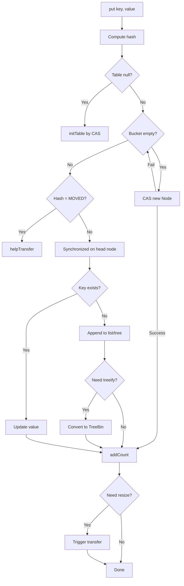
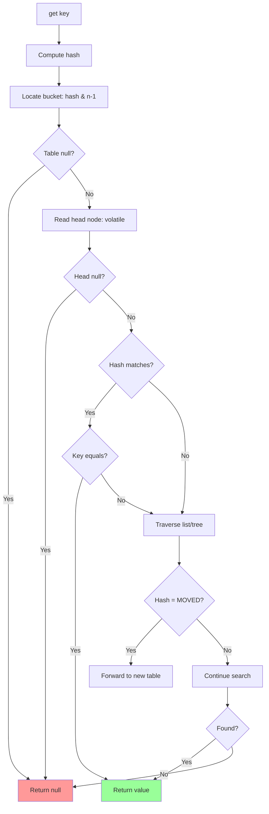

# ConcurrentHashMap - Segment Locking vs CAS, Size Estimation

## 1. Mục tiêu của Task

Hiểu sâu cơ chế đồng bộ hóa trong `ConcurrentHashMap` (CHM) qua hai thế hệ:
- **Java 7**: Segment-based locking (16 segments mặc định)
- **Java 8+**: CAS + synchronized trên node cấp thấp

Và bản chất của size estimation - tại sao `size()` lại là "estimation" thay vì giá trị chính xác trong môi trường concurrent.

> **Tóm tắt trước khi đi sâu**: CHM không lock toàn bộ map. Thay vào đó, nó phân chia không gian dữ liệu thành các vùng độc lập, mỗi vùng có cơ chế đồng bộ riêng. Điều này tạo ra trade-off cơ bản: **throughput cao** đánh đổi bằng **tính nhất quán điểm-in-time không tuyệt đối**.

---

## 2. Bản Chất và Cơ Chế Hoạt Động

### 2.1 Từ HashMap thường đến ConcurrentHashMap

**Vấn đề của HashMap trong môi trường concurrent:**

```
Thread-1: put("key", "value1")  →  đang resize
Thread-2: put("key", "value2")  →  cũng trigger resize
```

Kết quả: **Infinite loop trong resize** (Java 7) hoặc **lost update** (Java 8+). `HashMap` không thread-safe ở mọi level: read, write, và resize đều có vấn đề race condition.

**Giải pháp naive: Hashtable hoặc Collections.synchronizedMap()**

```java
// Khóa toàn bộ map cho MỌI thao tác
public synchronized V put(K key, V value) { ... }
public synchronized V get(Object key) { ... }
```

> **Vấn đề**: Lock granularity quá lớn - chỉ 1 thread được đọc/ghi tại một thởi điểm. Throughput giảm tuyến tính theo số thread.

### 2.2 Java 7: Segment-Based Locking

**Kiến trúc cốt lõi:**

```
ConcurrentHashMap
├── Segment[16]  (mặc định, concurrencyLevel)
│   ├── Segment 0: HashEntry[] table, lock riêng
│   ├── Segment 1: HashEntry[] table, lock riêng
│   └── ...
```

**Cơ chế lock:**

| Thao tác | Lock cần thiết |
|----------|---------------|
| `get()` | Không lock (volatile read) |
| `put()` | Lock segment chứa key |
| `remove()` | Lock segment chứa key |
| `resize()` | Lock từng segment riêng biệt |
| `size()` | Lock TẤT CẢ segments (2 lần) |

**Bản chất Segment locking:**

```java
// Cấu trúc Java 7
default static class Segment<K,V> extends ReentrantLock {
    volatile HashEntry<K,V>[] table;
    volatile int count;  // số phần tử trong segment
    
    final V put(K key, int hash, V value, boolean onlyIfAbsent) {
        lock();  // Lock chỉ segment này
        try {
            // Thao tác trên table cục bộ
        } finally {
            unlock();
        }
    }
}
```

> **Tại sao 16 segments?** Đây là đánh đổi mặc định giữa concurrency và memory overhead. Mỗi segment là 1 ReentrantLock (~几十 bytes) + HashEntry array. 16 segments = 16 threads có thể write đồng thởi vào các vùng khác nhau.

**Điểm mấu chốt của Java 7 CHM:**
- **Read không block**: `get()` chỉ dùng volatile read, không cần lock
- **Write chỉ block 1/16 map**: Concurrent writes trên segments khác nhau không ảnh hưởng nhau
- **Lock stripping**: Tư tưởng chia nhỏ lock để tăng concurrency

### 2.3 Java 8+: CAS + Synchronized Fine-Grained

**Tại sao bỏ Segment locking?**

Segment locking có giới hạn: concurrency bị giới hạn bởi số segments (16). Nếu nhiều thread cùng hash vào cùng segment, chúng vẫn serial. Java 8 tối ưu hơn bằng cách lock ở mức **node/bucket**.

**Kiến trúc Java 8:**

```
ConcurrentHashMap
├── Node[] table  (không còn segments)
│   ├── bucket 0: Node → Node → Node (linked list hoặc tree)
│   ├── bucket 1: Node (đơn lẻ)
│   └── bucket N: TreeBin (red-black tree nếu > 8 nodes)
├── volatile long baseCount  (đếm tổng quát)
├── volatile int sizeCtl    (điều khiển resize)
└── CounterCell[] counterCells  (cho size estimation)
```

**Hai cơ chế đồng bộ chính:**

#### A. CAS cho phần lớn thao tác

```java
// Put operation flow (simplified)
final V putVal(K key, V value, boolean onlyIfAbsent) {
    if (key == null || value == null) throw new NullPointerException();
    int hash = spread(key.hashCode());
    int binCount = 0;
    
    for (Node<K,V>[] tab = table;;) {
        Node<K,V> f; int n, i, fh;
        
        // Case 1: Table chưa khởi tạo → CAS khởi tạo
        if (tab == null || (n = tab.length) == 0)
            tab = initTable();
        
        // Case 2: Bucket trống → CAS gán node mới (KHÔNG LOCK!)
        else if ((f = tabAt(tab, i = (n - 1) & hash)) == null) {
            if (casTabAt(tab, i, null, new Node<K,V>(hash, key, value, null)))
                break;  // Thành công, không cần lock
        }
        
        // Case 3: Đang resize → giúp resize
        else if ((fh = f.hash) == MOVED)
            tab = helpTransfer(tab, f);
        
        // Case 4: Bucket có dữ liệu → synchronized trên node đầu tiên
        else {
            synchronized (f) {  // Lock chỉ bucket này!
                if (tabAt(tab, i) == f) {
                    // Thao tác trên linked list hoặc tree
                }
            }
        }
    }
    addCount(1L, binCount);  // Cập nhật size
    return null;
}
```

> **Điểm quan trọng**: Java 8 CHM dùng **CAS cho fast path** (bucket trống) và **synchronized cho slow path** (bucket đã có dữ liệu). Điều này tối ưu cho trường hợp phổ biến: thêm key mới vào bucket trống.

#### B. Synchronized chỉ trên head node của bucket

```java
synchronized (f) {  // f là node đầu tiên trong bucket
    // Chỉ thread này được thao tác trên bucket i
    // Các bucket khác hoàn toàn tự do
}
```

**Tại sao synchronized mà không phải ReentrantLock?**

| Tiêu chí | Synchronized | ReentrantLock |
|----------|-------------|---------------|
| Performance (Java 8+) | Ngang bằng hoặc tốt hơn nhờ biased locking | Có overhead nhẹ |
| Code đơn giản | Không cần try-finally manual | Cần unlock trong finally |
| Native support | JVM optimize tốt hơn | Flexible hơn (fairness, interruptible) |

Trong CHM, synchronized đủ vì:
- Lock duration rất ngắn (chỉ thao tác trên vài node)
- Không cần advanced features (fairness, condition variables)
- JVM biased locking tối ưu tốt cho trường hợp lock ngắn, ít contention

### 2.4 Cơ Chế Size Estimation

**Vấn đề cơ bản**: Làm sao biết `size()` khi nhiều thread đang đồng thởi add/remove?

**Cách tiếp cận của Java 7:**

```java
// Lock tất cả segments, đọc count, unlock
public int size() {
    final Segment<K,V>[] segments = this.segments;
    long sum = 0;
    long check = 0;
    int[] mc;
    
    // Thử không lock trước
    for (int k = 0; k < RETRIES_BEFORE_LOCK; ++k) {
        check = 0;
        for (int i = 0; i < segments.length; ++i) {
            sum += segments[i].count;
            check += segments[i].modCount;
        }
        if (mc == null) {
            mc = new int[segments.length];
            for (int i = 0; i < segments.length; ++i)
                mc[i] = segments[i].modCount;
        } else {
            // Nếu modCount thay đổi, có thread đang modify
            for (int i = 0; i < segments.length; ++i)
                if (segments[i].modCount != mc[i])
                    continue retry;  // Thử lại
        }
        return (int)sum;  // Thành công không lock
    }
    
    // Fail nhiều lần → lock tất cả
    lockAllSegments();
    try {
        return (int)sum;
    } finally {
        unlockAllSegments();
    }
}
```

> **Optimistic locking**: Thử đọc không lock trước (dùng modCount để detect thay đổi). Chỉ lock khi quá nhiều contention.

**Cách tiếp cận của Java 8:**

Sử dụng **Striped Counter** pattern - tư tưởng tương tự LongAdder trong java.util.concurrent.atomic.

```
baseCount (volatile)  ← giá trị chung
    ↑
CounterCell[0]  ← thread 1 cập nhật
CounterCell[1]  ← thread 2 cập nhật
CounterCell[N]  ← thread N cập nhật
```

```java
// Cơ chế addCount (khi put/remove)
@sun.misc.Contended static final class CounterCell {
    volatile long value;
    CounterCell(long x) { value = x; }
}

private final void addCount(long x, int check) {
    CounterCell[] as; long b, s;
    
    // Thử CAS vào baseCount trước
    if ((as = counterCells) != null ||
        !U.compareAndSwapLong(this, BASECOUNT, b = baseCount, s = b + x)) {
        
        // Contention cao → dùng CounterCell
        CounterCell a; long v; int m;
        boolean uncontended = true;
        
        if (as == null || (m = as.length - 1) < 0 ||
            (a = as[ThreadLocalRandom.getProbe() & m]) == null ||
            !(uncontended = U.compareAndSwapLong(a, CELLVALUE, v = a.value, v + x))) {
            
            // Vẫn fail → mở rộng counterCells
            fullAddCount(x, uncontended);
            return;
        }
        
        if (check <= 1) return;
        s = sumCount();  // Tính tổng từ tất cả cells
    }
    
    // Kiểm tra resize
    if (check >= 0) {
        while (s >= (long)(sizeCtl = sc)) {
            if (table == tab) transfer(tab, nextTab);
        }
    }
}
```

**@Contended annotation:**

```java
@sun.misc.Contended static final class CounterCell {
```

> **False sharing prevention**: CPU cache line thường 64 bytes. Nếu CounterCell[0] và CounterCell[1] nằm cùng cache line, thread 1 cập nhật cell[0] sẽ invalidate cache của thread 2 đang đọc cell[1]. @Contended thêm padding để đảm bảo mỗi cell nằm cache line riêng.

**Tại sao gọi là "estimation"?**

```java
public int size() {
    long n = sumCount();
    return ((n < 0L) ? 0 :
            (n > (long)Integer.MAX_VALUE) ? Integer.MAX_VALUE : (int)n);
}

final long sumCount() {
    CounterCell[] as = counterCells; CounterCell a;
    long sum = baseCount;
    if (as != null) {
        for (int i = 0; i < as.length; ++i) {
            if ((a = as[i]) != null)
                sum += a.value;
        }
    }
    return sum;
}
```

Vấn đề: Giữa lúc đọc `baseCount` và đọc `counterCells[i].value`, các thread khác có thể đã thay đổi giá trị. Không có atomic snapshot của toàn bộ counter.

> **Tóm lại size estimation**: CHM ưu tiên throughput của write operation (không lock khi cập nhật size) đánh đổi bằng việc `size()` có thể trả về giá trị slightly stale. Trong thực tế, sai lệch thường nhỏ và chấp nhận được.

---

## 3. Kiến Trúc và Luồng Xử Lý

### 3.1 Sơ đồ cấu trúc Java 8 CHM

```mermaid
graph TB
    CHM[ConcurrentHashMap] --> TABLE[Node[] table]
    CHM --> BASE[volatile long baseCount]
    CHM --> COUNTER[CounterCell[] counterCells]
    CHM --> SIZECTL[volatile int sizeCtl]
    
    TABLE --> B0[bucket 0]
    TABLE --> B1[bucket 1]
    TABLE --> BN[bucket N]
    
    B0 --> N0[Node: hash+key+value+next]
    N0 --> N1[Node...]
    
    B1 --> TREE[TreeBin: Red-black tree]
    
    COUNTER --> C0[@Contended CounterCell]
    COUNTER --> C1[@Contended CounterCell]
    
    style CHM fill:#f9f,stroke:#333
    style COUNTER fill:#bbf,stroke:#333
```

### 3.2 Luồng put() operation



### 3.3 Luồng get() operation (lock-free)



> **Quan sát quan trọng**: `get()` hoàn toàn lock-free, chỉ dựa vào volatile reads. Đây là lý do CHM read performance gần như bằng HashMap thường.

---

## 4. So Sánh Các Lựa Chọn

### 4.1 Java 7 vs Java 8 CHM

| Aspect | Java 7 (Segment) | Java 8 (CAS + sync) |
|--------|------------------|---------------------|
| **Concurrency level** | Fixed (16 segments) | Dynamic (per-bucket) |
| **Read** | Lock-free | Lock-free |
| **Write (empty bucket)** | Lock segment | CAS (no lock) |
| **Write (collision)** | Lock segment | Synchronized on node |
| **Memory overhead** | Cao (16 segment objects) | Thấp hơn |
| **Resize** | Per-segment | Concurrent transfer |
| **Tree optimization** | Không | Có (red-black tree) |

### 4.2 CHM vs Alternatives

```
┌─────────────────────────────────────────────────────────────────┐
│                    CONCURRENT MAP OPTIONS                       │
├─────────────────────────────────────────────────────────────────┤
│                                                                 │
│  ┌──────────────┐  ┌──────────────┐  ┌──────────────────────┐  │
│  │  Hashtable   │  │  Collections │  │  ConcurrentHashMap   │  │
│  │              │  │.synchronized │  │                      │  │
│  │  Lock: Full  │  │    Map       │  │  Lock: Fine-grained  │  │
│  │  Throughput: │  │              │  │  Throughput: ★★★★★   │  │
│  │  ★☆☆☆☆       │  │  Lock: Full  │  │  Consistency:        │  │
│  │              │  │  Throughput: │  │  Eventual (size)     │  │
│  │  USE: Không  │  │  ★☆☆☆☆       │  │                      │  │
│  │  legacy only │  │              │  │  USE: Default choice │  │
│  │              │  │  USE: Không  │  │                      │  │
│  └──────────────┘  └──────────────┘  └──────────────────────┘  │
│                                                                 │
│  ┌──────────────────┐  ┌─────────────────────────────────────┐ │
│  │  ConcurrentSkip  │  │        Caffeine Cache               │ │
│  │  ListMap         │  │                                     │ │
│  │                  │  │  High-performance, eviction,        │ │
│  │  Lock: Lock-free │  │  statistics, async loading          │ │
│  │  (CAS tree)      │  │                                     │ │
│  │  Throughput: ★★★ │  │  USE: Caching với đầy đủ tính năng  │ │
│  │  Sorted: YES     │  │                                     │ │
│  │                  │  │                                     │ │
│  │  USE: Cần sorted │  │                                     │ │
│  │  hoặc custom     │  │                                     │ │
│  │  comparator      │  │                                     │ │
│  └──────────────────┘  └─────────────────────────────────────┘ │
│                                                                 │
└─────────────────────────────────────────────────────────────────┘
```

### 4.3 Treeify Threshold - Tại sao 8?

```java
static final int TREEIFY_THRESHOLD = 8;
static final int UNTREEIFY_THRESHOLD = 6;
```

**Phân tích:**
- Linked list: O(n) lookup, nhưng n nhỏ thì nhanh (cache-friendly, đơn giản)
- Red-black tree: O(log n), nhưng overhead cao hơn (node lớn hơn, phức tạp hơn)

**Tại sao 8 và 6 (không phải cùng giá trị)?**

```
8: Treeify (list → tree)
6: Untreeify (tree → list)
```

> **Hysteresis**: Khoảng cách 2 (giữa 6 và 8) ngăn chặn "flip-flopping" - liên tục chuyển đổi giữa list và tree khi số phần tử dao động quanh ngưỡng.

---

## 5. Rủi Ro, Anti-patterns, Lỗi Thường Gặp

### 5.1 Anti-pattern: size() trong loop

```java
// ❌ KHÔNG BAO GIỜ LÀM THẾ NÀY
while (map.size() > 0) {
    map.remove(someKey);
}
```

**Vấn đề:**
- `size()` expensive (phải sum tất cả CounterCell)
- Giá trị thay đổi liên tục, loop có thể vô hạn hoặc bỏ sót
- **N+1 query problem** của concurrent collections

**Giải pháp:**

```java
// ✅ Dùng iterator để duyệt và xóa
for (Iterator<Map.Entry<K,V>> it = map.entrySet().iterator(); it.hasNext(); ) {
    Map.Entry<K,V> e = it.next();
    if (shouldRemove(e)) {
        it.remove();  // Safe concurrent removal
    }
}

// Hoặc dùng bulk operation
map.entrySet().removeIf(e -> shouldRemove(e));
```

### 5.2 Anti-pattern: compute* không đúng cách

```java
// ❌ Dễ dẫn đến deadlock hoặc lỗi nếu f() truy cập cùng map
map.compute(key, (k, v) -> {
    return f(v, map.get(otherKey));  // Nguy hiểm!
});
```

**Quy tắc**: Function trong `compute`, `computeIfAbsent`, `computeIfPresent` **KHÔNG ĐƯỢC** truy cập/map modify cùng map. Nó có thể dẫn đến deadlock (Java 8) hoặc ConcurrentModificationException.

### 5.3 Anti-pattern: Key/Value null

```java
// ❌ NullPointerException
map.put(null, "value");
map.put("key", null);
```

> CHM **không cho phép** null key hoặc value. Lý do: Không phân biệt được "key không tồn tại" với "key tồn tại nhưng value null" trong concurrent context (get() trả về null: là key không có hay value null?)

### 5.4 Pitfall: Không hiểu weakly-consistent iterator

```java
// Iterator của CHM là weakly-consistent
for (Map.Entry<K,V> e : map.entrySet()) {
    // Có thể thấy hoặc không thấy entries được thêm sau khi iterator tạo
    // Không bao giờ throw ConcurrentModificationException
}
```

| Collection | Iterator behavior |
|------------|-------------------|
| HashMap | Fail-fast (throw CME) |
| Hashtable | Fail-fast |
| ConcurrentHashMap | Weakly consistent |

> **Weakly consistent**: Có thể reflect hoặc không reflect recent modifications. Không bao giờ throw exception, nhưng cũng không guarantee nhìn thấy mọi thay đổi.

### 5.5 Edge case: High hash collision

```java
// Tấn công HashDoS nếu dùng hashCode() kém
customKey.hashCode() { return 42; }  // Tất cả vào 1 bucket
```

**Hậu quả:**
- Java 7: Mọi write vào cùng segment → serialization
- Java 8: Mọi write vào cùng bucket → synchronized contention

**Giải pháp:**
- CHM dùng `spread()` để cải thiện hash distribution
- Không dùng user-controlled keys với hashCode() đoán được

---

## 6. Khuyến Nghị Thực Chiến trong Production

### 6.1 Khi nào dùng CHM?

| Scenario | Recommendation |
|----------|---------------|
| Read-heavy (90%+ reads) | CHM - excellent |
| Write-heavy, nhiều thread | CHM - good |
| Cần sorted data | ConcurrentSkipListMap |
| Cần size() chính xác | Consider Collections.synchronizedMap hoặc khác |
| Cache với TTL/eviction | Caffeine/Guava Cache |
| Single-threaded | HashMap (nhanh hơn, ít memory) |

### 6.2 Monitoring và Debugging

**Metrics nên theo dõi:**

```java
// Các metric có thể expose
- map.size()          // Approximate size
- estimatedSize()     // Same as size()
- mappingCount()      // Long version của size()
```

**JVM flags để debug CHM:**

```bash
# Print CHM contention
-XX:+PrintBiasedLockingStatistics

# Monitor synchronized contention
-XX:+PrintConcurrentLocks
```

**Red flags trong production:**

1. **High CPU trong CHM operations**: Có thể excessive resizing hoặc hash collision
2. **Memory leak**: `keySet()`, `values()`, `entrySet()` views giữ reference đến map
3. **Unexpected size() values**: Có thể hiểu nhầm về weakly-consistent size

### 6.3 Tuning parameters (Java 8+)

```java
// Initial capacity để giảm resize
new ConcurrentHashMap<>(expectedSize, loadFactor, concurrencyLevel);

// concurrencyLevel giờ chỉ là estimate cho internal sizing
// Không còn hard limit như Java 7
```

### 6.4 Java 21+ Improvements liên quan

| Feature | Impact trên CHM |
|---------|-----------------|
| Virtual Threads | CHM hoạt động tốt với virtual threads vì lock ngắn |
| Sequenced Collections | Không ảnh hưởng trực tiếp |
| Foreign Function API | Không liên quan |

> Virtual threads + CHM là kết hợp tốt vì CHM locks rất ngắn, không pin carrier thread.

---

## 7. Kết Luận

**Bản chất của ConcurrentHashMap:**

1. **Concurrency qua phân đoạn**: Thay vì lock toàn bộ, CHM chia dữ liệu thành các vùng độc lập (segments Java 7, buckets Java 8), mỗi vùng có lock riêng.

2. **Optimistic reads**: `get()` hoàn toàn lock-free nhờ volatile semantics, đạt throughput gần như HashMap thường.

3. **CAS cho fast path**: Java 8 tối ưu bằng cách dùng CAS cho trường hợp bucket trống - tránh lock hoàn toàn cho inserts phân tán.

4. **Eventual size**: Size estimation qua striped counter (LongAdder pattern) - throughput cao nhưng không có snapshot atomic.

**Trade-offs cốt lõi:**

| Ưu điểm | Chi phí |
|---------|---------|
| High concurrent throughput | size() là estimation, không chính xác tuyệt đối |
| Lock-free reads | Iterator weakly-consistent |
| Fine-grained locking | Không hỗ trợ null key/value |
| Scalable writes | Function trong compute* không được truy cập cùng map |

**Khi nào dùng:**
- ✅ Multi-threaded environment với frequent reads/writes
- ✅ Không cần size() chính xác tuyệt đối
- ✅ Không cần null support

**Khi nào KHÔNG dùng:**
- ❌ Cần size() chính xác trong concurrent modifications
- ❌ Cần null keys/values
- ❌ Single-threaded (dùng HashMap thay thế)
- ❌ Cần sorting (dùng ConcurrentSkipListMap)

---

## 8. Code Reference (Chỉ khi cần)

### 8.1 Cơ chế spread() - hash redistribution

```java
static final int spread(int h) {
    // XOR higher bits with lower bits để tăng entropy
    // Necessary vì table length là power of 2 (chỉ dùng lower bits)
    return (h ^ (h >>> 16)) & HASH_BITS;
}
```

### 8.2 CAS utilities

```java
// Sử dụng Unsafe để CAS trực tiếp
static final <K,V> boolean casTabAt(Node<K,V>[] tab, int i,
                                    Node<K,V> c, Node<K,V> v) {
    return U.compareAndSwapObject(tab, ((long)i << ASHIFT) + ABASE, c, v);
}
```

### 8.3 CounterCell initialization pattern

```java
// Striped counter expansion - tương tự LongAdder
private final void fullAddCount(long x, boolean wasUncontended) {
    int h = ThreadLocalRandom.getProbe();
    boolean collide = false;
    
    for (;;) {
        CounterCell[] as; CounterCell a; int n; long v;
        
        if ((as = counterCells) != null && (n = as.length) > 0) {
            // Slot chưa có cell → tạo mới
            if ((a = as[(n - 1) & h]) == null) {
                if (cellsBusy == 0) {
                    CounterCell r = new CounterCell(x);
                    if (cellsBusy == 0 &&
                        U.compareAndSwapInt(this, CELLSBUSY, 0, 1)) {
                        // Tạo và gán cell mới
                    }
                }
                collide = false;
            }
            // ... expansion logic khi contention cao
        }
    }
}
```

---

*Research completed: ConcurrentHashMap - Segment locking vs CAS, Size estimation*

*Tập trung vào: Java 8+ implementation, striped counter mechanism, lock-free reads, production trade-offs*
