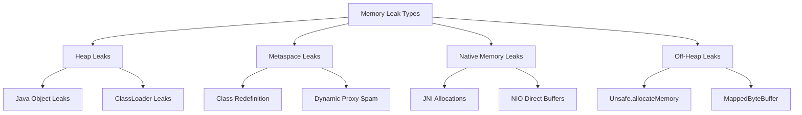

# Memory Leak trong Java: Phân tích chuyên sâu từ góc nhìn Senior Backend

> **Mức độ:** Senior/Architect | **Thờ gian đọc:** 25 phút | **Java Version:** 8-21+

---

## 📋 Tóm tắt

Memory Leak trong Java khác với C/C++ - không phải do quên `free()` mà là **giữ references không cần thiết**, khiến GC không thể thu hồi. Bài này phân tích cơ chế tầng thấp, các anti-patterns phổ biến, công cụ phát hiện chuẩn công nghiệp, và chiến lược phòng ngừa trong hệ thống production.

---

## 1. Bản chất tầng thấp: Tại sao Memory Leak xảy ra?

### 1.1 Cơ chế GC và "Unreachable" vs "Unused"

```
┌─────────────────────────────────────────────────────────────┐
│                    JVM Heap Memory                          │
├─────────────────────────────────────────────────────────────┤
│  ┌─────────────┐                                            │
│  │   Object A  │◄─────────────────┐                        │
│  │  (Leaking)  │                  │                        │
│  └─────────────┘                  │  Strong Reference      │
│         ▲                         │  (Static Map)          │
│         │                         │                        │
│  ┌──────┴──────┐                  │                        │
│  │ Static Map  │──────────────────┘                        │
│  │  (Cache)    │  ❌ GC không thu hồi được!                │
│  └─────────────┘                                           │
│                                                            │
│  Object A vẫn "reachable" qua Static Map dù business       │
│  logic đã không cần đến nó nữa → MEMORY LEAK               │
└─────────────────────────────────────────────────────────────┘
```

**Nguyên tắc vàng của GC:**
- GC chỉ thu hồi objects **unreachable** (không có đường dẫn tham chiếu từ GC Roots)
- GC **không biết** object có đang được "business logic sử dụng" hay không
- **Memory Leak = Object reachable nhưng unused**

### 1.2 GC Roots - Điểm bắt đầu của mọi đường dẫn tham chiếu

| Loại GC Root | Ví dụ | Nguy cơ Leak |
|-------------|-------|--------------|
| **Local variables** | Biến trong stack frame của đang chạy thread | Thấp (scope ngắn) |
| **Active Java threads** | Thread đang chạy | ⚠️ Cao nếu thread sống forever |
| **Static fields** | `private static Map cache = new HashMap()` | 🔴 **Rất cao** - sống đến khi class unload |
| **JNI references** | Native code references | ⚠️ Cao, khó debug |
| **Classes (by ClassLoader)** | Loaded classes | 🔴 Cao nếu custom ClassLoader leak |

### 1.3 Memory Leak Patterns phân loại theo vùng nhớ



---

## 2. Các Anti-Patterns gây Memory Leak phổ biến

### 2.1 Static Collections (Top #1 nguyên nhân)

```java
// ❌ ANTI-PATTERN: Static cache không giới hạn
public class UserService {
    private static final Map<Long, User> userCache = new HashMap<>();
    
    public User getUser(Long id) {
        if (!userCache.containsKey(id)) {
            userCache.put(id, loadFromDatabase(id)); // ← Leak ở đây!
        }
        return userCache.get(id);
    }
}
// → Cache không bao giờ được xóa, userCache tăng vô hạn
```

**Giải pháp Senior:**
```java
// ✅ SOLUTION 1: Guava Cache với expiration
import com.google.common.cache.Cache;
import com.google.common.cache.CacheBuilder;

public class UserService {
    private static final Cache<Long, User> userCache = CacheBuilder.newBuilder()
        .maximumSize(10_000)                    // Giới hạn kích thước
        .expireAfterWrite(30, TimeUnit.MINUTES) // Tự động hết hạn
        .recordStats()                          // Theo dõi hiệu suất
        .build();
}

// ✅ SOLUTION 2: Caffeine Cache (High-performance, Java 8+)
import com.github.benmanes.caffeine.cache.Caffeine;

public class UserService {
    private static final Cache<Long, User> userCache = Caffeine.newBuilder()
        .maximumSize(10_000)
        .expireAfterAccess(30, TimeUnit.MINUTES)
        .removalListener((key, value, cause) -> 
            log.info("User {} removed from cache: {}", key, cause))
        .recordStats()
        .build();
}
```

### 2.2 Unclosed Resources (Top #2)

```java
// ❌ ANTI-PATTERN: Resource không đóng
public String readFile(String path) throws IOException {
    BufferedReader reader = new BufferedReader(new FileReader(path));
    return reader.readLine(); // ← Reader không được close!
}
// → File handles leak, cuối cùng "Too many open files"
```

**Giải pháp Senior - Try-with-resources (Java 7+):**
```java
// ✅ SOLUTION 1: Try-with-resources tự động close
public String readFile(String path) throws IOException {
    try (BufferedReader reader = new BufferedReader(new FileReader(path))) {
        return reader.readLine();
    } // ← Auto-close ở đây, ngay cả khi exception
}

// ✅ SOLUTION 2: Với multiple resources
public void copyFile(String src, String dst) throws IOException {
    try (InputStream in = new FileInputStream(src);
         OutputStream out = new FileOutputStream(dst)) {
        in.transferTo(out);
    }
}
```

### 2.3 Listener/Observer Pattern không unregister

```java
// ❌ ANTI-PATTERN: Listener không được remove
public class OrderProcessor {
    public void processOrder(Order order) {
        EventBus eventBus = EventBus.getDefault();
        
        // Đăng ký listener nhưng không unregister
        eventBus.register(new OrderListener() {
            @Override
            public void onOrderCompleted(OrderEvent event) {
                // Xử lý
            }
        });
    }
}
// → Mỗi lần processOrder() tạo một listener mới, 
//   tất cả đều được giữ trong EventBus
```

**Giải pháp Senior - WeakReference Pattern:**
```java
// ✅ SOLUTION: Sử dụng WeakReference listeners
public class EventBus {
    private final Set<WeakReference<EventListener>> listeners = 
        ConcurrentHashMap.newKeySet();
    
    public void register(EventListener listener) {
        listeners.add(new WeakReference<>(listener));
    }
    
    public void publish(Event event) {
        listeners.removeIf(ref -> ref.get() == null); // Clean null refs
        listeners.forEach(ref -> {
            EventListener listener = ref.get();
            if (listener != null) {
                listener.onEvent(event);
            }
        });
    }
}
```

### 2.4 ThreadLocal không remove

```java
// ❌ ANTI-PATTERN: ThreadLocal không cleanup
public class RequestContext {
    private static final ThreadLocal<Context> contextHolder = 
        new ThreadLocal<>();
    
    public void setContext(Context ctx) {
        contextHolder.set(ctx);
    }
    // Không có remove() method!
}

// Trong thread pool: Thread A xử lý Request 1 → set Context
//                     Thread A xử lý Request 2 → Context cũ vẫn còn!
```

**Giải pháp Senior - Filter/Interceptor pattern:**
```java
// ✅ SOLUTION: Luôn cleanup trong finally block
public class RequestContext {
    private static final ThreadLocal<Context> contextHolder = 
        new ThreadLocal<>();
    
    public static void set(Context ctx) {
        contextHolder.set(ctx);
    }
    
    public static Context get() {
        return contextHolder.get();
    }
    
    public static void clear() {
        contextHolder.remove(); // ← Quan trọng!
    }
}

// Trong Servlet Filter hoặc Spring Interceptor:
@Override
public boolean preHandle(HttpServletRequest req, HttpServletResponse res, Object handler) {
    RequestContext.set(new Context(req));
    return true;
}

@Override
public void afterCompletion(...) {
    RequestContext.clear(); // ← Đảm bảo luôn chạy
}
```

### 2.5 Custom ClassLoader Leaks (Nâng cao)

```java
// ❌ ANTI-PATTERN: ClassLoader leak trong hot-reload scenarios
// Thường gặp trong Tomcat hot-deploy, OSGi, plugin systems

public class PluginManager {
    private static final Map<String, Class<?>> loadedClasses = new HashMap<>();
    
    public void loadPlugin(String pluginId, URL jarUrl) {
        URLClassLoader classLoader = new URLClassLoader(new URL[]{jarUrl});
        Class<?> pluginClass = classLoader.loadClass("com.plugin.Main");
        loadedClasses.put(pluginId, pluginClass); // ← Giữ reference đến Class
    }
    // unloadPlugin không xóa khỏi loadedClasses
}
// → ClassLoader và tất cả classes của nó không thể GC
```

---

## 3. Công cụ phát hiện Memory Leak chuẩn công nghiệp

### 3.1 VisualVM (Built-in, miễn phí)

```bash
# Khởi động VisualVM
$ jvisualvm  # Hoặc $ visualvm với JDK 9+
```

**Tính năng chính:**
| Feature | Mục đích | Cách sử dụng |
|---------|----------|--------------|
| **Monitor tab** | Theo dõi heap growth over time | Quan sát đường cong heap, nếu không giảm sau GC → leak |
| **Heap Dump** | Chụp snapshot bộ nhớ | Applications → right-click → Heap Dump |
| **Classes view** | Xem object count theo class | Tìm class có instance count tăng bất thường |
| **References** | Truy ngược reference path | "References to this object" để tìm ai giữ reference |

### 3.2 Eclipse MAT (Memory Analyzer Tool) - Công cụ mạnh nhất

```bash
# Download từ eclipse.org/mat
# Phân tích heap dump:
$ ./ParseHeapDump.sh heap_dump.hprof org.eclipse.mat.api:suspects
```

**Leak Suspects Report:**
```
┌─────────────────────────────────────────────────────────┐
│  One instance of "java.util.HashMap" loaded by          │
│  "<system class loader>" occupies 512 MB (85%) bytes.   │
│  The instance is referenced by:                          │
│    com.example.UserService.userCache (static field)     │
│  Keywords: java.util.HashMap com.example.UserService    │
└─────────────────────────────────────────────────────────┘
```

### 3.3 JProfiler (Commercial, toàn diện nhất)

**Điểm mạnh:**
- **Allocation Recording:** Theo dõi mỗi object được allocate ở đâu
- **Heap Walker:** Duyệt object graph với OQL (Object Query Language)
- **Live Memory:** Xem allocation rate real-time

### 3.4 Async-Profiler (Production-safe)

```bash
# Không ảnh hưởng performance production
$ ./profiler.sh -d 60 -f flamegraph.html <pid>

# Chỉ allocation profiling
$ ./profiler.sh -e alloc -d 60 -f alloc.html <pid>
```

### 3.5 JDK Flight Recorder (JFR) + JDK Mission Control (JMC)

```bash
# Bật JFR recording
$ java -XX:StartFlightRecording=duration=60s,filename=leak.jfr MyApp

# Hoặc trên JVM đang chạy:
$ jcmd <pid> JFR.start duration=60s filename=leak.jfr
```

**Phân tích trong JMC:**
- **Memory → Object Statistics:** Xem object allocation rate
- **Memory → GC Times:** Nếu GC liên tục nhưng heap không giảm → leak

---

## 4. Demo: Tạo và Phát hiện Memory Leak

### 4.1 Code tạo Memory Leak có chủ đích

```java
package demo;

import java.util.*;
import java.util.concurrent.*;

/**
 * Demo Memory Leak - Static Cache không giới hạn
 * 
 * Chạy với: -Xms64m -Xmx64m -XX:+HeapDumpOnOutOfMemoryError
 */
public class MemoryLeakDemo {
    
    // ❌ LEAK SOURCE: Static map không bao giờ được xóa
    private static final Map<String, byte[]> CACHE = new HashMap<>();
    
    private static final ExecutorService executor = 
        Executors.newFixedThreadPool(10);
    
    public static void main(String[] args) throws InterruptedException {
        System.out.println("Starting memory leak demo...");
        System.out.println("JVM will OOM after ~60 iterations with -Xmx64m");
        
        for (int i = 0; i < 100; i++) {
            final int iteration = i;
            
            executor.submit(() -> {
                // Mỗi iteration thêm 1MB vào cache
                byte[] data = new byte[1024 * 1024]; // 1MB
                Arrays.fill(data, (byte) iteration);
                
                String key = "key-" + iteration + "-" + System.nanoTime();
                CACHE.put(key, data); // ← LEAK: Không bao giờ remove
                
                long usedMemory = Runtime.getRuntime().totalMemory() 
                    - Runtime.getRuntime().freeMemory();
                System.out.printf("Iteration %d: Cache size = %d, Used memory = %.2f MB%n",
                    iteration, CACHE.size(), usedMemory / (1024.0 * 1024));
            });
            
            Thread.sleep(100);
        }
        
        executor.shutdown();
        executor.awaitTermination(1, TimeUnit.MINUTES);
    }
}
```

### 4.2 Chạy và phân tích

```bash
# 1. Compile
$ javac demo/MemoryLeakDemo.java

# 2. Run với heap dump on OOM
$ java -Xms64m -Xmx64m \
       -XX:+HeapDumpOnOutOfMemoryError \
       -XX:HeapDumpPath=./leak_dump.hprof \
       demo.MemoryLeakDemo

# 3. Khi OOM xảy ra, phân tích với MAT hoặc VisualVM
```

### 4.3 Fix bằng Caffeine Cache

```java
package demo;

import com.github.benmanes.caffeine.cache.*;
import java.util.concurrent.*;

/**
 * ✅ FIXED: Sử dụng Caffeine Cache với giới hạn
 */
public class FixedMemoryDemo {
    
    private static final Cache<String, byte[]> CACHE = Caffeine.newBuilder()
        .maximumSize(10)                    // Chỉ giữ 10 entries
        .expireAfterWrite(5, TimeUnit.SECONDS) // Hết hạn sau 5s
        .removalListener((key, value, cause) -> 
            System.out.println("Evicted: " + key + " due to " + cause))
        .recordStats()
        .build();
    
    public static void main(String[] args) throws InterruptedException {
        System.out.println("Running fixed version with Caffeine Cache...");
        
        for (int i = 0; i < 100; i++) {
            byte[] data = new byte[1024 * 1024]; // 1MB
            String key = "key-" + i;
            
            CACHE.put(key, data);
            
            // Stats
            CacheStats stats = CACHE.stats();
            System.out.printf("Iteration %d: Estimated size = %d, " +
                "Eviction count = %d%n", 
                i, CACHE.estimatedSize(), stats.evictionCount());
            
            Thread.sleep(100);
        }
        
        System.out.println("Completed without OOM!");
    }
}
```

---

## 5. Rủi ro & Trade-offs

### 5.1 Performance vs Memory Trade-offs

| Giải pháp | Memory | CPU | Độ phức tạp | Khi nào dùng |
|-----------|--------|-----|-------------|--------------|
| **No Cache** | ✅ Thấp | ⚠️ Cao (query DB nhiều) | Thấp | Data thay đổi liên tục |
| **Unbounded Cache** | 🔴 OOM Risk | ✅ Thấp | Thấp | **KHÔNG BAO GIỜ DÙNG** |
| **Caffeine/Guava** | ⚠️ Bounded | ✅ O(1) operations | Trung bình | **Mặc định cho production** |
| **Redis/Memcached** | ✅ Off-heap | ⚠️ Network latency | Cao | Multi-instance, large dataset |
| **Soft/Weak References** | ✅ Auto-evict | ⚠️ GC pressure | Cao | Memory-sensitive caching |

### 5.2 SoftReference vs WeakReference cho Cache

```java
// SoftReference: GC chỉ thu hồi khi JVM sắp OOM
SoftReference<byte[]> softRef = new SoftReference<>(largeData);

// WeakReference: GC thu hồi ngay ở next GC cycle
WeakReference<Object> weakRef = new WeakReference<>(obj);
```

| Loại | Khi bị GC | Use Case |
|------|-----------|----------|
| **Strong** | Không bao giờ (nếu reachable) | Default references |
| **Soft** | Khi memory pressure | Photo thumbnails, large object cache |
| **Weak** | Next GC cycle | Metadata, listeners, canonicalization |
| **Phantom** | Sau khi object finalized | Cleanup resources, track object death |

---

## 6. Java 21+ Updates: Virtual Threads và Memory

### 6.1 Virtual Thread Local Storage

```java
// Java 21+: Virtual Threads với ThreadLocal
// Mỗi virtual thread có riêng ThreadLocal nhưng carrier thread có thể thay đổi

ScopedValue<String> REQUEST_ID = ScopedValue.newInstance();

// ✅ Sử dụng ScopedValue thay vì ThreadLocal trong Virtual Threads
public void handleRequest(Request req) {
    ScopedValue.where(REQUEST_ID, req.getId()).run(() -> {
        // REQUEST_ID chỉ available trong scope này
        // Tự động cleanup khi scope kết thúc
        service.process(req);
    });
}
```

**Lợi ích:**
- Không leak giữa các virtual threads
- Carrier thread reuse an toàn
- Tự động cleanup

### 6.2 Foreign Function & Memory API (Preview Java 21)

```java
// Thay thế sun.misc.Unsafe - managed off-heap memory
try (Arena arena = Arena.ofConfined()) {
    MemorySegment segment = arena.allocate(1024);
    // Sử dụng segment...
} // ← Tự động free khi arena close
```

---

## 7. Checklist phòng ngừa Memory Leak trong Production

### ✅ Code Review Checklist

- [ ] **Static collections** có giới hạn size không?
- [ ] **ThreadLocal** có `.remove()` trong finally block?
- [ ] **Listeners/Observers** có unregister khi destroy?
- [ ] **Resources** (File, DB, Network) trong try-with-resources?
- [ ] **Cache** sử dụng Caffeine/Guava với expiration?
- [ ] **Custom ClassLoaders** được cleanup sau unload?
- [ ] **JNI/Native** allocations có free tương ứng?

### ✅ Monitoring & Alerting

```yaml
# Prometheus alerting rules
groups:
  - name: memory-leak-alerts
    rules:
      - alert: HeapMemoryLeakSuspected
        expr: |
          (
            jvm_memory_used_bytes{area="heap"} / 
            jvm_memory_max_bytes{area="heap"}
          ) > 0.85
        for: 30m
        annotations:
          summary: "Possible memory leak - heap consistently high"
          
      - alert: GCOverheadTooHigh
        expr: |
          (
            increase(jvm_gc_pause_seconds_sum[5m]) / 
            increase(jvm_gc_pause_seconds_count[5m])
          ) > 0.1  # GC chiếm > 10% thờ gian
        annotations:
          summary: "GC overhead too high - check for memory leak"
```

---

## 📚 Tài liệu tham khảo

1. **Oracle JVM GC Tuning Guide** - https://docs.oracle.com/en/java/javase/21/gctuning/
2. **Java Performance: The Definitive Guide** - Scott Oaks (O'Reilly)
3. **Eclipse MAT Documentation** - https://help.eclipse.org/mat/
4. **Caffeine Cache Wiki** - https://github.com/ben-manes/caffeine/wiki
5. **JEP 444: Virtual Threads** (Java 21) - https://openjdk.org/jeps/444

---

> **Key Takeaway:** Memory Leak trong Java không phải do "quên free" mà là "giữ reference quá lâu". Senior Engineer luôn: (1) Sử dụng bounded cache thay vì HashMap static, (2) Cleanup ThreadLocal trong finally, (3) Unregister listeners, (4) Monitor heap growth patterns.

**Ngày hoàn thành:** 26/03/2026  
**Người nghiên cứu:** Senior Backend Architect Agent
