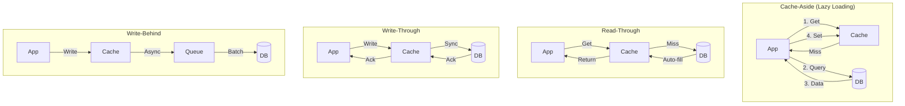

# Caching Patterns & Strategies: Bản Chất và Chiến Lược Cache Hiệu Quả

> **Mục tiêu:** Hiểu sâu bản chất cache, các pattern thiết kế, trade-off, và rủi ro production khi triển khai hệ thống cache ở quy mô lớn.

---

## 1. Mục Tiêu Nghiên Cứu

Task này tập trung trả lờI 3 câu hỏi cốt lõi:

1. **Bản chất cache là gì?** Tại sao cache lại hiệu quả, giới hạn của nó ở đâu?
2. **Các pattern cache khác nhau như thế nào?** Khi nào dùng pattern nào, trade-off là gì?
3. **Rủi ro và anti-patterns thực tế?** Cache đổ vỡ như thế nào, phòng ngừa ra sao?

---

## 2. Bản Chất và Cơ Chế Hoạt Động

### 2.1 Tại Sao Cache Hiệu Quả?

Cache hiệu quả dựa trên **nguyên lý locality** và **chi phí truy cập không đồng nhất**.

```
┌─────────────────────────────────────────────────────────────────┐
│           HIERARCHY OF MEMORY (Latency Scale)                   │
├─────────────────────────────────────────────────────────────────┤
│  L1 Cache          ~1ns       ▓▓▓▓▓▓▓▓▓▓  32-64KB              │
│  L2 Cache          ~4ns       ▓▓▓▓▓▓▓▓    256KB-512KB          │
│  L3 Cache          ~15ns      ▓▓▓▓▓▓      8-32MB              │
│  RAM (Main Memory) ~100ns     ▓▓▓▓        8-128GB             │
│  SSD               ~100μs     ▓▓          256GB-4TB           │
│  HDD               ~10ms      ▓           1-10TB              │
│  Network (DC)      ~500μs     ▓▓▓         Distributed         │
│  Network (Cross-DC)~50ms      ▓           Global              │
└─────────────────────────────────────────────────────────────────┘
          ↑ Cost per access increases 100,000x
          ↓ Throughput decreases
```

> **Insight cốt lõi:** Cache không tạo ra dữ liệu mới, nó chỉ **di chuyển dữ liệu đến vị trí truy cập nhanh hơn**.

### 2.2 Nguyên Lý Locality

| Loại Locality | Mô tả | Ví dụ trong Cache |
|---------------|-------|-------------------|
| **Temporal** | Dữ liệu vừa dùng sẽ dùng lại | User profile, config, session |
| **Spatial** | Dữ liệu gần nhau hay dùng chung | List items cùng page, related products |
| **Sequential** | Truy cập theo thứ tự | Streaming video, log reading |

### 2.3 Chi Phí Cache Miss

Mỗi cache miss tạo ra **cascade cost**:

```
Cache Miss Path:
    Application Thread
           ↓
    [Network Roundtrip to Cache]  ← T1 (0.5-5ms)
           ↓
    Cache Empty / Expired
           ↓
    [DB Connection Acquire]       ← T2 (5-50ms)
           ↓
    [DB Query Execution]          ← T3 (10-500ms)
           ↓
    [Serialization + Network]     ← T4 (1-10ms)
           ↓
    [Cache Write]                 ← T5 (0.5-5ms)
           ↓
    Response

Total Miss Cost: T1+T2+T3+T4+T5 = 17-570ms
Cache Hit Cost: ~0.5-1ms
Speedup Factor: 20x-500x
```

> **Rủi ro:** Cache miss đồng thờI (thundering herd) có thể **DDOS chính database** của bạn.

---

## 3. Caching Patterns: Kiến Trúc và Luồng Xử Lý

### 3.1 Tổng Quan 4 Pattern Chính



### 3.2 Cache-Aside (Lazy Loading) - Pattern Phổ Biến Nhất

#### Cơ Chế Hoạt Động

```java
// Pseudo-code minh họa logic Cache-Aside
public Product getProduct(String id) {
    // 1. Thử lấy từ cache trước
    Product product = cache.get(id);
    
    if (product == null) {
        // 2. Cache miss → Query DB
        product = database.query("SELECT * FROM products WHERE id = ?", id);
        
        if (product != null) {
            // 3. Populate cache (with TTL)
            cache.set(id, product, Duration.ofMinutes(10));
        }
    }
    
    return product;
}
```

#### Đặc Điểm và Trade-off

| Khía Cạnh | Chi Tiết |
|-----------|----------|
| **Complexity** | Thấp - App tự control logic |
| **Consistency** | Eventual - Cache và DB có thể lệch pha |
| **Failure Mode** | Cache down → App vẫn chạy (degraded) |
| **Use Case** | Read-heavy, data không quá nhạy cảm với consistency |

#### Rủi Ro: Thundering Herd

```
Scenario: Cache expires, 1000 requests đồng thờI

T0:    Cache key "product:123" expires
T0+:   1000 requests đến cùng lúc
       ↓
       All 1000 see cache miss
       ↓
       All 1000 query DB cùng lúc
       ↓
       DB overwhelmed / timeout
       ↓
       Cascading failure
```

**Giải pháp: Cache Stampede Protection**

| Kỹ Thuật | Nguyên Lý | Trade-off |
|----------|-----------|-----------|
| **Locking** | Một thread query DB, các thread khác wait | Đơn giản nhưng block |
| **Early Revalidation** | Refresh cache trước khi expire ( probabilistic early expiration) | Phức tạp hơn, gần như loại bỏ herd |
| **External Warming** | Background job refresh cache | Tốn resource, eventual consistency |
| **Lease Token** | Redis 6.0+ - cho phép extend TTL ngay cả khi expired | Tight integration |

> **Best Practice:** Sử dụng **probabilistic early expiration** - refresh cache khi TTL < random_threshold.

### 3.3 Read-Through Pattern

#### Cơ Chế

Cache provider tự động load data từ DB khi miss. App không thấy DB.

```
App ──Get──> Cache Provider ──Miss?──> Loader Interface
                                        ↓
                                  User-implemented
                                  DataSource Loader
                                        ↓
                                  Returns to Cache
                                        ↓
                              Populates & Returns to App
```

#### Đánh Giá

| Ưu Điểm | Nhược Điểm |
|---------|------------|
| App code đơn giản hơn | Tight coupling với cache provider |
| Cache provider control logic | Khó implement transaction handling |
| Consistent loading behavior | Testing khó hơn (mock cache layer) |

**Phù hợp:** Khi sử dụng caching framework như **Caffeine** (local) hoặc **Hazelcast** (distributed) với built-in loader.

### 3.4 Write-Through Pattern

#### Cơ Chế

```
App ──Write──> Cache ──Sync Write──> DB ──Ack──> Cache ──Ack──> App
```

Write đồng bộ cả 2 nơi trước khi return.

#### Phân Tích

| Khía Cạnh | Đánh Giá |
|-----------|----------|
| Consistency | Strong - cache luôn đồng bộ với DB |
| Latency | Cao (write = max(cache, db)) |
| Reliability | Risky - cache failure = write failure |
| Use Case | Write không thường xuyên, consistency quan trọng |

> **Anti-pattern:** Dùng Write-Through cho write-heavy workload sẽ **giết chết performance** với độ trễ gấp đôi.

### 3.5 Write-Behind (Write-Back) Pattern

#### Cơ Chế

```
App ──Write──> Cache ──Return immediately
                    ↓
            [Async Queue]
                    ↓
            Batch Write to DB (background)
```

#### Phân Tích Sâu

**Ưu điểm vượt trội:**
- Latency thấp nhất cho write path
- Batching giảm DB load
- Absorb write spikes

**Rủi ro nghiêm trọng:**
- **Data loss** khi cache crash trước khi flush
- **Complexity** của queue persistence
- **Ordering issues** trong distributed systems

**Mitigation:**
```
Write-Behind Safety Layer:
├── Persistent Queue (Redis Stream / Kafka)
├── Acknowledgment Tracking
├── Retry với Exponential Backoff
├── Dead Letter Queue (DLQ)
└── Conflict Resolution Strategy
```

### 3.6 So Sánh Toàn Diện 4 Pattern

| Pattern | Read Latency | Write Latency | Consistency | Complexity | Data Loss Risk | Use Case |
|---------|--------------|---------------|-------------|------------|----------------|----------|
| **Cache-Aside** | Fast | N/A | Eventual | Low | None | Read-heavy, general purpose |
| **Read-Through** | Fast | N/A | Eventual | Medium | None | Framework-centric apps |
| **Write-Through** | Fast | Slow | Strong | Medium | Low | Write-rare, consistency-critical |
| **Write-Behind** | Fast | Fastest | Eventual | High | Medium-High | Write-heavy, absorb spikes |

---

## 4. Cache Eviction Strategies

### 4.1 TTL Design

```
TTL Strategy Matrix:
┌─────────────────┬───────────────┬────────────────────────────┐
│ TTL Type        │ Use Case      │ Risk                       │
├─────────────────┼───────────────┼────────────────────────────┤
│ Fixed           │ Static data   │ Stale data if source đổI  │
│ Sliding         │ Session       │ Không expire nếu access    │
│ Random Jitter   │ Mass expire   │ Prevent thundering herd    │
│ Tiered          │ Hot/Warm/Cold │ Complex but efficient      │
└─────────────────┴───────────────┴────────────────────────────┘
```

### 4.2 Eviction Algorithms

| Algorithm | Mô tả | Pros | Cons |
|-----------|-------|------|------|
| **LRU** | Least Recently Used | Tốt cho temporal locality | Không biết frequency |
| **LFU** | Least Frequently Used | Giữ hot items | Cold start problem |
| **FIFO** | First In First Out | Đơn giản | Performance kém nhất |
| **Random** | Random eviction | O(1) | Unpredictable |
| **W-TinyLFU** | Windowed TinyLFU (Caffeine) | Best of LRU + LFU | Phức tạp |

> **Recommendation:** Sử dụng **Caffeine** với W-TinyLFU cho local cache, **Redis** với allkeys-lru cho distributed cache.

---

## 5. Rủi Ro và Anti-Patterns

### 5.1 Cache Penetration

**Vấn đề:** Query data không tồn tại (cache miss → DB miss)

**Giải pháp:**
1. **Null caching** - Cache negative results với TTL ngắn
2. **Bloom filter** - Check existence trước khi query

### 5.2 Cache Breakdown

**Vấn đề:** Cache server down → All traffic flood DB

**Giải pháp:**
1. **Circuit breaker** - Ngắt kết nối khi cache fail
2. **Degraded mode** - Serve stale data hoặc limited functionality
3. **Multiple cache layers** - L1 (local) + L2 (distributed)

### 5.3 Hot Key Problem

**Vấn đề:** Một key được truy cập quá nhiều → Single node bottleneck

**Giải pháp:**
1. **Local cache for hot keys** (Caffeine/Caffeine + Redis)
2. **Key sharding** - Split thành multiple keys
3. **Read replicas** - Redis replica để scale read

### 5.4 Big Key Problem

**Vấn đề:** Value quá lớn → Network bottleneck, memory pressure

**Threshold:**
- Redis String: > 10KB cần xem xét
- Redis Hash/Set: > 5000 elements
- > 1MB: **Critical issue**

---

## 6. Khuyến Nghị Thực Chiến Production

### 6.1 Stack Khuyến Nghị cho Java

```
┌─────────────────────────────────────────────────────────────┐
│                    RECOMMENDED STACK                        │
├─────────────────────────────────────────────────────────────┤
│  L1 (In-Memory)    │ Caffeine / Ehcache 3                  │
│  L2 (Distributed)  │ Redis Cluster / AWS ElastiCache       │
│  L3 (CDN)          │ CloudFlare / AWS CloudFront           │
├─────────────────────────────────────────────────────────────┤
│  Client Library    │ Lettuce (Redis) - Reactive, Cluster   │
│  Framework         │ Spring Cache + Caffeine/Redis         │
│  Monitoring        │ Redis INFO, Micrometer Metrics        │
└─────────────────────────────────────────────────────────────┘
```

### 6.2 Key Design Best Practices

```
Key Naming Convention:
  {service}:{entity}:{id}:{optional-context}
  
Ví dụ:
  user:profile:12345
  product:catalog:electronics:page:3:size:20
  session:active:abc123xyz

Key Length: < 100 bytes (Redis optimized for < 512 bytes)
Avoid: User input trong key name (injection risk)
```

### 6.3 Monitoring Checklist

| Metric | Alert Threshold | Ý Nghĩa |
|--------|-----------------|---------|
| Cache Hit Rate | < 80% | Inefficient caching |
| Cache Miss Rate | Spike > 200% | Possible stampede |
| Eviction Rate | > 100/sec | Memory pressure |
| Memory Usage | > 85% | Capacity planning |
| Command Latency | p99 > 5ms | Performance degradation |
| Connections | > 80% max | Connection pool tuning |

### 6.4 Operational Checklist

- [ ] **TTL Strategy:** TTL + jitter cho mọi key
- [ ] **Circuit Breaker:** Đoạn kết nối khi cache fail
- [ ] **Graceful Degradation:** Plan B khi cache không available
- [ ] **Cache Warming:** Pre-load critical data
- [ ] **Invalidation Strategy:** Consistent cache invalidation
- [ ] **Security:** Redis AUTH, TLS, network isolation
- [ ] **Backup:** Redis persistence config (RDB/AOF)

---

## 7. Kết Luận

### Bản Chất Cốt Lõi

Cache là **layer abstraction chi phí** - đánh đổI tính nhất quán (consistency) lấy tốc độ (speed) và khả năng chịu tải (scale).

### Quyết Định Kiến Trúc

| Câu Hỏi | Quyết Định |
|---------|------------|
| Read-heavy hay Write-heavy? | Read → Cache-Aside, Write → Write-Behind |
| Consistency quan trọng? | Write-Through hoặc invalidation pattern |
| Cache là critical dependency? | Thêm circuit breaker + degraded mode |
| Dữ liệu nào cache? | Pareto principle - 20% data = 80% reads |

### Trade-off Quan Trọng Nhất

> **Speed vs Consistency vs Complexity**
> 
> - Cache-Aside: Cân bằng tốt nhất cho hầu hết use case
> - Write-Behind: Chấp nhận rủi ro data loss để có speed tối đa
> - Write-Through: Chấp nhận latency cao để có consistency

### Anti-pattern Phổ Biến Nhất

1. **Cache everything** - Không phảI data nào cũng nên cache
2. **Ignore TTL** - Cache mãI mãI = stale data disaster
3. **No fallback** - Cache down = system down
4. **Single hot key** - Scale bottleneck ẩn

---

## 8. Tham Khảo

- [Redis Documentation - Caching Strategies](https://redis.io/docs/manual/eviction/)
- [Caffeine GitHub - Design Notes](https://github.com/ben-manes/caffeine/wiki/Design)
- [Google Groups - CacheStampede](https://groups.google.com/g/memcached/c/-qm3eWUjd08)
- Martin Kleppmann - Designing Data-Intensive Applications (Chapter 2)
