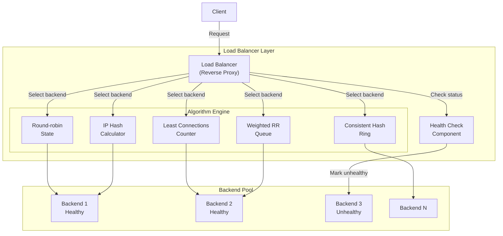
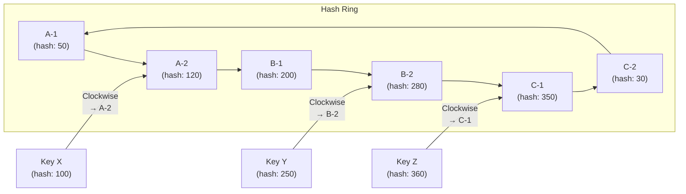
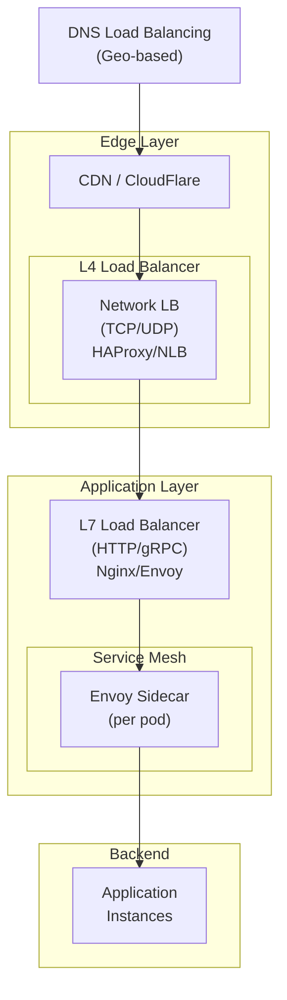

# Load Balancing Algorithms - Deep Research

## 1. Mục tiêu của task

Hiểu bản chất các thuật toán cân bằng tải (Load Balancing Algorithms) từ mức độ triển khai đến trade-off trong production. Phân tích khi nào nên dùng Round-robin, Least connections, Consistent hashing; cơ chế hoạt động bên trong; failure modes và các vấn đề vận hành thực tế.

---

## 2. Bản chất và cơ chế hoạt động

### 2.1. Tại sao cần Load Balancer?

Load Balancer (LB) đóng vai trò **traffic cop** - phân phối request đến backend instances dựa trên thuật toán định sẵn. Bản chất của LB là giải quyết bài toán:

> **Partition problem**: Chia tập request R thành N tập con sao cho mỗi backend instance nhận tải "công bằng" theo một định nghĩa cụ thể.

**"Công bằng" không đồng nghĩa "đều nhau"** - phụ thuộc vào metric: request count, connection count, response time, hoặc resource utilization.

### 2.2. Kiến trúc triển khai



### 2.3. Cơ chế Health Check

LB chỉ forward request đến **healthy backends**. Health check có 2 loại:

| Loại | Mô tả | Trade-off |
|------|-------|-----------|
| **Active** | LB chủ động ping/HTTP check backend | Chính xác nhưng tốn tài nguyên, có latency phát hiện failure |
| **Passive** | LB dựa vào response metrics (HTTP 5xx, timeout) | Không tốn overhead nhưng phát hiện chậm hơn |

**Critical insight**: Health check interval thường là 5-30s. Trong khoảng thờ gian này, backend có thể đã fail nhưng vẫn nhận traffic → **graceful degradation** và **circuit breaker** là bắt buộc ở client-side.

---

## 3. Phân tích chi tiết các thuật toán

### 3.1. Round-robin (RR)

**Cơ chế**: Xoay vòng qua danh sách backend, mỗi request đến instance tiếp theo.

```
Request 1 → Backend A
Request 2 → Backend B
Request 3 → Backend C
Request 4 → Backend A (quay lại)
```

**Implementation state**:
```
class RoundRobin {
    AtomicInteger counter = new AtomicInteger(0);
    List<Backend> backends;
    
    Backend select() {
        int index = counter.getAndIncrement() % backends.size();
        return backends.get(index);
    }
}
```

**Bản chất vấn đề**:
- Giả định tất cả request có **chi phí như nhau** (homogeneous)
- Không xét đến trạng thái của backend (busy/free)
- **Stateless** - không cần lưu trữ state phức tạp

**Khi nào dùng**:
- ✅ Backend instances đồng nhất (cùng hardware, cùng capacity)
- ✅ Request có thờ gian xử lý tương đương nhau
- ✅ Stateful services không yêu cầu sticky session

**Khi nào KHÔNG dùng**:
- ❌ Long-lived connections (WebSocket, streaming) - một backend có thể bị quá tải connections
- ❌ Request có thờ gian xử lý chênh lệch lớn
- ❌ Backend có capacity khác nhau

---

### 3.2. Least Connections (LC)

**Cơ chế**: Chọn backend có ít active connections nhất.

```
Backend A: 15 connections → NOT selected
Backend B: 8 connections  → SELECTED
Backend C: 12 connections → NOT selected
```

**Implementation**:
- Mỗi backend maintain **connection counter** (increment khi nhận request, decrement khi hoàn thành)
- LB chọn backend có counter thấp nhất

**Bản chất vấn đề**:
- Giả định: connection count ∝ load (tương quan thuận với tải)
- **Không phải lúc nào cũng đúng**: một connection có thể idle (keep-alive) nhưng vẫn được tính

**Edge case quan trọng**:
```
Scenario: Connection pool với keep-alive
- Client mở 100 connections đến LB
- Mỗi connection gửi 1 request/giây
- Backend xử lý nhanh (10ms) nhưng giữ connection mở

Kết quả: Tất cả backends có connection count tương đương,
nhưng một backend có thể chậm hơn do GC pause
→ LC không phát hiện được vấn đề
```

**Khi nào dùng**:
- ✅ Long-lived connections (WebSocket, HTTP/2, gRPC streaming)
- ✅ Request có thờ gian xử lý biến động lớn
- ✅ Backend capacity tương đương

**Khi nào KHÔNG dùng**:
- ❌ Short-lived connections nếu health check không tốt (có thể chọn backend đang fail)
- ❌ Nếu connection không tương quan với load (vd: nhiều idle connections)

---

### 3.3. Consistent Hashing

**Bài toán**: Phân phối keys K đến N nodes sao cho:
1. Phân phối đều (uniform distribution)
2. Khi thêm/xóa node, chỉ **minimal keys** bị remap (1/N keys)

**Cơ chế cơ bản**:

```
Ring space: [0, 2^32-1] hoặc [0, 2^160-1] (SHA-1)

Mỗi backend được hash thành nhiều "virtual nodes" (replicas)
ví dụ: Backend A → hash("A-1"), hash("A-2"), ..., hash("A-150")

Key K được gán cho backend đầu tiên ≥ hash(K) trên ring (clockwise)
```



**Virtual Nodes (VNodes)**:
- Mỗi physical backend → 100-200 virtual nodes trên ring
- Mục đích: **giảm variance** trong phân phối, tránh "hot spots"

**Mathematical guarantee**:
> Với N physical nodes, M virtual nodes per physical node:
> - Expected keys per node: K/N
> - Standard deviation: ~1/√M (càng nhiều VNodes càng đều)
> - Remap khi add/remove node: ~K/N keys (minimal disruption)

**Trade-off trong việc chọn số VNodes**:

| VNodes/Physical Node | Ưu điểm | Nhược điểm |
|---------------------|---------|------------|
| 10-50 | Bảng hash nhỏ, lookup nhanh | Phân phối không đều, variance cao |
| 100-200 | Cân bằng tốt | Bảng hash vừa phải |
| 500+ | Phân bố rất đều | Memory overhead cao, lookup chậm hơn |

**Khi nào dùng Consistent Hashing**:
- ✅ Cache sharding (Redis, Memcached) - tránh cache miss khi scale
- ✅ Database partitioning/sharding - stable data placement
- ✅ Session affinity (sticky sessions) - user luôn vào cùng backend
- ✅ Storage systems (Cassandra, DynamoDB) - data partitioning

**Khi nào KHÔNG dùng**:
- ❌ Cân bằng tải request độc lập - chưa có tính chất "key"
- ❌ Backend hay thay đổi (autoscaling liên tục) - remap overhead

---

### 3.4. IP Hash

**Cơ chế**: `backend = hash(client_ip) % backend_count`

**Bản chất**: Đảm bảo **session affinity** - cùng IP luôn đến cùng backend.

**Vấn đề nghiêm trọng**:
```
Scenario: NAT/Corporate Proxy
- 1000 users cùng công ty → 1 public IP
- hash(IP) → cùng backend cho tất cả
→ Backend này quá tải, các backend khác idle

Scenario: Mobile users (IP thay đổi liên tục)
- User di chuyển giữa WiFi/4G → IP thay đổi
- Session bị chuyển sang backend khác → mất session state
```

**Khi nào dùng**:
- ✅ Legacy applications yêu cầu sticky session
- ✅ Không thể dùng cookie-based affinity
- ✅ Backend có local state không share được

**Khi nào KHÔNG dùng**:
- ❌ Hệ thống có nhiều users qua NAT/proxy chung
- ❌ Mobile users có IP động
- ❌ Cần true load balancing (phân phối đều)

---

### 3.5. Weighted Algorithms

**Weighted Round-robin** và **Weighted Least Connections**:
- Gán mỗi backend một **weight** tỷ lệ với capacity
- Backend mạnh hơn → weight cao hơn → nhận nhiều traffic hơn

**Use case**: Rolling deployment với canary release
```
v1 instances: weight = 100 (stable)
v2 instances (canary): weight = 10 (thử nghiệm)
→ v2 chỉ nhận ~9% traffic
```

---

## 4. So sánh tổng hợp

| Thuật toán | State | Độ phức tạp | Phân phối | Best for | Anti-pattern |
|-----------|-------|-------------|-----------|----------|--------------|
| **Round-robin** | Stateless | O(1) | Đều nếu request đồng nhất | Stateless, đồng nhất | Long-lived connections |
| **Least Connections** | Stateful | O(N) hoặc O(log N) | Dựa trên connections | WebSocket, HTTP/2 | Nhiều idle connections |
| **Consistent Hash** | Stateful | O(log VN) | Phụ thuộc hash function | Cache, sessions, sharding | Backend hay thay đổi |
| **IP Hash** | Stateless | O(1) | Phụ thuộc IP distribution | Sticky session (legacy) | NAT/proxy environments |
| **Random** | Stateless | O(1) | Xác suất đều | Stateless, đơn giản | Yêu cầu determinism |
| **Latency-based** | Stateful | O(N) | Dựa trên response time | Geographic distribution | Network jitter |

---

## 5. Rủi ro, Anti-patterns và Lỗi thường gặp

### 5.1. Thundering Herd

**Vấn đề**: Khi một backend fail và recover:
1. Health check đánh dấu backend healthy
2. Tất cả LB đồng loạt forward traffic đến backend này
3. Backend bị quá tải và fail lại

**Giải pháp**:
- **Slow start**: Backend mới chỉ nhận traffic tăng dần trong 30-60s
- **Warm-up period**: Không đưa vào pool ngay, đợi JVM warm-up

### 5.2. Hot Spot trong Consistent Hashing

**Vấn đề**: Một key "hot" (vd: popular product ID) liên tục truy cập vào cùng backend.

**Giải pháp**:
- **Request coalescing**: Cache ngay tại LB (Varnish, Nginx proxy_cache)
- **Replication**: Hot keys replicate sang nhiều backend
- **Local cache tại client**: Giảm tải LB

### 5.3. Health Check False Positives

**Vấn đề**: Backend trả về HTTP 200 trong health check nhưng thực tế:
- Database connection pool exhausted
- Out of memory, GC thrashing
- Disk full

**Giải pháp**:
- **Deep health check**: Kiểm tra DB connectivity, disk space trong /health endpoint
- **Passive health monitoring**: Theo dõi error rate, latency - đánh dấu unhealthy nếu metrics vượt ngưỡng

### 5.4. Stale Connection State

**Vấn đề**: LB vẫn forward đến backend đã crash nhưng TCP connection chưa timeout.

**Giải pháp**:
- TCP keepalive với idle timeout ngắn (30s)
- **Circuit breaker** tại client (Hystrix, Resilience4j)

### 5.5. Autoscaling + Consistent Hashing Conflict

**Vấn đề**: Autoscaling thêm/xóa instances liên tục → Consistent Hashing remap liên tục → Cache miss storm.

**Giải pháp**:
- Dùng **Ring pop** hoặc **consistent hashing với bounded load**
- **Cache warming**: Pre-populate cache trước khi đưa vào LB pool
- **Sticky sessions cho cache**: Đừng dùng CH cho cache nếu autoscaling liên tục

---

## 6. Khuyến nghị thực chiến trong Production

### 6.1. Chọn thuật toán theo workload

```
Microservices HTTP REST API (stateless)
  → Round-robin hoặc Least Connections

WebSocket/gRPC Streaming (long-lived connections)
  → Least Connections

Redis/Memcached Cluster (cache sharding)
  → Consistent Hashing + Virtual Nodes (150+)

Database Read Replicas
  → Round-robin hoặc Latency-based

File Upload Service (long requests)
  → Least Connections

Session-aware Legacy App
  → IP Hash (nếu không tránh được) hoặc Cookie-based sticky sessions
```

### 6.2. Monitoring và Observability

**Metrics cần theo dõi**:

| Metric | Ý nghĩa | Alert threshold |
|--------|---------|-----------------|
| `backend_request_rate` | Request/second/backend | Variance > 30% so với mean |
| `backend_connection_count` | Active connections | Vượt 80% capacity |
| `backend_latency_p99` | Response time P99 | Tăng đột biến > 2x baseline |
| `backend_error_rate` | HTTP 5xx rate | > 1% trong 1 phút |
| `lb_remap_rate` | Key remaps/min (CH) | > 5% trong 1 phút |

**Distributed Tracing**:
- Tag mỗi span với `backend_id` để trace request đến instance nào
- Phát hiện hot spots bằng cách aggregate theo backend

### 6.3. Layered Load Balancing



**Tại sao cần nhiều layer**:
- **DNS**: Geographic affinity, failover giữa regions
- **L4 (Transport)**: High throughput, low latency, TCP termination
- **L7 (Application)**: HTTP routing, SSL termination, rate limiting
- **Service Mesh**: mTLS, circuit breaker, retries, observability

### 6.4. Modern Java Load Balancing

**Spring Cloud LoadBalancer** (replacement cho Ribbon):
```yaml
spring:
  cloud:
    loadbalancer:
      configurations: default
      health-check:
        interval: 5000
        refetch-instances-interval: 30000
```

**Resilience4j Circuit Breaker** (kết hợp với LB):
```java
// Circuit breaker config cho từng backend
CircuitBreakerConfig config = CircuitBreakerConfig.custom()
    .failureRateThreshold(50)        // Open nếu 50% fail
    .waitDurationInOpenState(Duration.ofSeconds(10))
    .slidingWindowSize(10)
    .build();
```

**Project Reactor Load Balancing** (Reactive):
```java
// Round-robin với backpressure awareness
Flux.fromIterable(backends)
    .flatMap(backend -> callBackend(backend)
        .onErrorResume(e -> tryNextBackend()), 
        concurrency)  // Giới hạn concurrent requests
```

---

## 7. Kết luận

### Bản chất cốt lõi

1. **Round-robin**: Đơn giản, hiệu quả cho workload đồng nhất. Điểm yếu là không xét trạng thái backend.

2. **Least Connections**: Phù hợp connection-oriented protocols. Yêu cầu state và có thể bị đánh lừa bởi idle connections.

3. **Consistent Hashing**: Giải pháp cho bài toán **stable mapping** từ key → node. Critical cho cache và sharding, overhead khi topology thay đổi.

### Trade-off quan trọng nhất

| Trade-off | Round-robin | Least Connections | Consistent Hash |
|-----------|-------------|-------------------|-----------------|
| **State** | None | Per-connection counters | Hash ring + VNodes |
| **Complexity** | Minimal | Low | Medium |
| **Fairness** | Request-based | Connection-based | Key-based |
| **Topology change** | Instant adaptation | Instant adaptation | Requires remap |
| **Best use case** | Stateless HTTP | WebSocket/Streaming | Cache/Session/Shard |

### Rủi ro lớn nhất trong production

1. **Thundering herd** khi backend recover - giải quyết bằng slow-start
2. **Health check blind spots** - cần deep health checks + passive monitoring
3. **Hot spots trong Consistent Hashing** - cần request coalescing + local caching
4. **Autoscaling + CH conflict** - cân nhắc bounded-load CH hoặc tách cache khỏi LB

### Guideline lựa chọn

- **Bắt đầu với Round-robin** cho microservices stateless
- **Chuyển sang Least Connections** khi có long-lived connections
- **Chỉ dùng Consistent Hashing** khi thực sự cần stable key-to-node mapping
- **Luôn kết hợp circuit breaker** - LB không đủ để bảo vệ backend
- **Layer your LB**: DNS → L4 → L7 → Service Mesh

---

## 8. Tài liệu tham khảo

1. Nginx Load Balancing Methods: http://nginx.org/en/docs/http/load_balancing.html
2. HAProxy Algorithms: http://cbonte.github.io/haproxy-dconv/2.4/configuration.html#4.2-balance
3. "Consistent Hashing and Random Trees" - Karger et al., 1997
4. "Maglev: A Fast and Reliable Software Network Load Balancer" - Google, 2016
5. Spring Cloud LoadBalancer Docs: https://docs.spring.io/spring-cloud-commons/docs/current/reference/html/#spring-cloud-loadbalancer
6. Envoy Load Balancing: https://www.envoyproxy.io/docs/envoy/latest/intro/arch_overview/upstream/load_balancing/load_balancing
