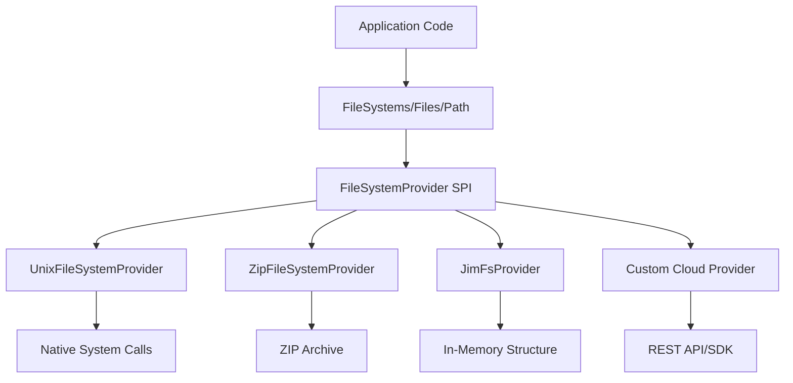
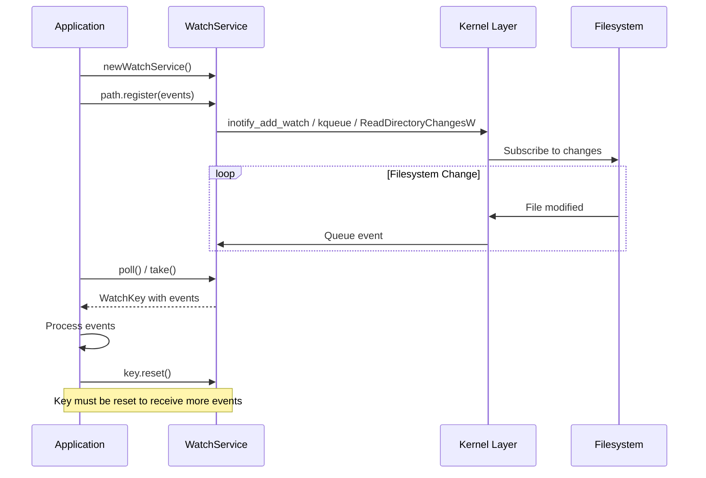

# NIO.2 (java.nio.file) - Path, Files, WatchService, FileVisitor

## 1. Mục tiêu của task

Hiểu sâu bản chất NIO.2 API được giới thiệu từ Java 7, tập trung vào:
- Cơ chế trừu tượng hóa filesystem qua `Path` interface
- File operations high-performance qua `Files` utility class
- Event-driven file monitoring qua `WatchService`
- Recursive file traversal qua `FileVisitor` pattern

Khác biệt cốt lõi so với java.io và java.nio: NIO.2 không chỉ là non-blocking I/O mà là **complete filesystem abstraction** với plugable provider architecture.

---

## 2. Bản chất và cơ chế hoạt động

### 2.1. Path Interface - Trừu tượng hóa filesystem

**Bản chất:** `Path` không phải là String wrapper đơn thuần. Nó là **filesystem-dependent representation** được bind vào `FileSystem` provider cụ thể.

```
┌─────────────────────────────────────────────────────────────┐
│                    FileSystemProvider                       │
│  ┌─────────────┐  ┌─────────────┐  ┌─────────────────────┐  │
│  │   UnixFs    │  │    ZipFs    │  │   JimFs (Memory)    │  │
│  └──────┬──────┘  └──────┬──────┘  └──────────┬──────────┘  │
└─────────┼────────────────┼────────────────────┼─────────────┘
          │                │                    │
          ▼                ▼                    ▼
      UnixPath          ZipPath            MemoryPath
      (/home/user)    (jar:file:...)      (mem:/temp)
```

**Tại sao cần abstraction này?**
- File paths không portable giữa OS (Windows `C:\` vs Unix `/`)
- Nhu cầu làm việc với virtual filesystems (JAR, ZIP, remote)
- Cần plugable architecture cho cloud storage providers

**Critical Implementation Detail:**
```java
// Path được tạo từ FileSystem specific provider
Path p1 = Paths.get("/home/user");           // Default FileSystem
Path p2 = FileSystems.getDefault().getPath("/home/user");

// Hai path này equivalent nhưng khác instance
// Path không được khuyến nghị serialize - chứa transient FileSystem reference
```

**Normalization vs Resolution:**
- `normalize()`: Loại bỏ `.` và `..` **không truy cập filesystem**
- `toRealPath()`: Resolve symbolic links, kiểm tra file tồn tại
- `resolve()`: Concatenate paths theo filesystem rules

> **Quan trọng:** `normalize()` là pure string operation. `toRealPath()` thực sự hit filesystem - có I/O cost và có thể throw IOException.

### 2.2. Files Class - Utility pattern với performance implications

`Files` là **stateless utility class** chứa static methods. Design này có ý nghĩa:
- Không cần instantiate → thread-safe by design
- Method overloads cho flexible options (CopyOption, LinkOption)
- Lazy evaluation với Stream-based operations

**Cơ chế copy/move trong Files:**

```
Files.copy(source, target, options)
         │
         ▼
┌─────────────────┐
│  CopyOption[]   │
│  - REPLACE_EXISTING
│  - COPY_ATTRIBUTES
│  - NOFOLLOW_LINKS
│  - ATOMIC_MOVE (cho move)
└────────┬────────┘
         │
         ▼
┌─────────────────┐
│  FileSystemProvider
│  .copy(source, target, opts)
└─────────────────┘
```

**Trade-off: Files.copy() vs FileInputStream/FileOutputStream:**

| Aspect | Files.copy() | Manual Streams |
|--------|-------------|----------------|
| Buffer management | OS-level optimization | User-space buffer |
| Memory footprint | Direct buffer (off-heap) | Heap buffer |
| Zero-copy support | Yes (sendfile on Linux) | No |
| Progress monitoring | Limited | Full control |
| Interrupt handling | Platform dependent | Explicit |

**Critical Production Concern:**
`Files.copy()` với large files có thể block thread dài hạn. Không có built-in timeout hoặc progress callback. Đây là lý do nhiều production systems vẫn dùng NIO `FileChannel.transferTo()` cho large file operations.

### 2.3. WatchService - Event-driven filesystem monitoring

**Bản chất:** WatchService là **kernel-level filesystem event subscription**, không phải polling.

```
┌─────────────────────────────────────────────────────────┐
│                    Kernel Layer                         │
│  ┌────────────┐  ┌────────────┐  ┌──────────────────┐   │
│  │   inotify  │  │   kqueue   │  │  ReadDirectoryChangesW │  │
│  │   (Linux)  │  │  (macOS)   │  │    (Windows)     │   │
│  └─────┬──────┘  └─────┬──────┘  └────────┬─────────┘   │
└────────┼───────────────┼──────────────────┼─────────────┘
         │               │                  │
         └───────────────┴──────────────────┘
                         │
                         ▼
              ┌──────────────────┐
              │  WatchService    │
              │  (Java Abstraction)│
              └────────┬─────────┘
                       │
         ┌─────────────┼─────────────┐
         ▼             ▼             ▼
     WatchKey      WatchKey      WatchKey
     (per dir)     (per dir)     (per dir)
```

**Kiến trúc Producer-Consumer:**
- **Producer:** OS kernel phát sinh events khi filesystem thay đổi
- **Queue:** WatchService internal queue (bounded, có thể overflow)
- **Consumer:** Application thread poll/watch lấy events

**Event Types & Semantics:**

| Event | Trigger | Lost Events? |
|-------|---------|--------------|
| ENTRY_CREATE | File created, moved into | Có thể nếu rapid create/delete |
| ENTRY_MODIFY | Content modified | Platform dependent |
| ENTRY_DELETE | File deleted, moved out | Thường reliable |
| OVERFLOW | Event queue overflow | **Critical - signals lost events** |

> **Cảnh báo Production:** `OVERFLOW` event là signal events đã bị drop. Nếu bỏ qua, system sẽ miss changes và trở nên inconsistent. Bắt buộc phải re-scan directory khi nhận OVERFLOW.

**Platform Limitations:**

| Platform | Limitation |
|----------|-----------|
| Linux (inotify) | Không recursive (phải register từng subdir) |
| macOS (kqueue) | Coalesce events, timing issues |
| Windows | Native recursive watch support |
| Network filesystems | Thường không support hoặc unreliable |

**Memory Leak Risk:**
```java
// ANTI-PATTERN - Resource leak
WatchService watcher = FileSystems.getDefault().newWatchService();
path.register(watcher, ENTRY_CREATE); // WatchKey created
// Không gọi watchKey.cancel() → kernel resource leak
```

Mỗi registered watch consumes kernel resources. Trên Linux, mỗi inotify watch chiếm ~1KB kernel memory. Hệ thống giới hạn bởi `/proc/sys/fs/inotify/max_user_watches`.

### 2.4. FileVisitor - Recursive traversal pattern

**Design Pattern:** Visitor pattern cho tree traversal. Tách biệt:
- **Traversal logic:** Files.walkFileTree() 
- **Processing logic:** FileVisitor implementation

```
walkFileTree(root, visitor)
       │
       ▼
preVisitDirectory(dir, attrs)
       │
       ▼ (nếu CONTINUE)
visitFile(file, attrs) ──────► postVisitDirectory(dir, exc)
       │                             │
       │ (nếu exception)             │ (nếu exception)
       ▼                             ▼
visitFileFailed(file, exc)    postVisitDirectory với exc
```

**Control Flow:**

| Return Value | Behavior |
|--------------|----------|
| `CONTINUE` | Tiếp tục traversal |
| `SKIP_SIBLINGS` | Skip remaining entries in current dir |
| `SKIP_SUBTREE` | (preVisit only) Skip directory contents |
| `TERMINATE` | Dừng toàn bộ traversal |

**Quan trọng:** FileVisitor là **synchronous, blocking traversal**. Mỗi file visit là blocking operation. Với deep directory trees, traversal có thể mất thời gian đáng kể.

---

## 3. Kiến trúc và luồng xử lý

### 3.1. FileSystemProvider Architecture



**Service Provider Interface (SPI):** NIO.2 sử dụng java.util.ServiceLoader để load providers. Custom filesystems có thể plug-in mà không thay đổi application code.

### 3.2. WatchService Event Flow



**Critical:** `WatchKey.reset()` must be called sau mỗi poll. Nếu không, key becomes invalid và không nhận events nữa. Đây là common bug trong production.

### 3.3. Path Resolution Flow

```
Paths.get("/home/user/../docs")
         │
         ▼
FileSystem.getPath("")
         │
         ▼
Parse path components
         │
         ▼
┌─────────────────────┐
│ Name count: 4       │
│ ["home", "user",    │
│  "..", "docs"]       │
└─────────────────────┘
         │
    ┌────┴────┐
    ▼         ▼
normalize() toRealPath()
(compute)  (resolve symlinks + verify)
    │         │
    ▼         ▼
/home/docs  /home/docs
            (throws if not exist)
```

---

## 4. So sánh các lựa chọn

### 4.1. NIO.2 vs java.io vs java.nio

| Feature | java.io (Legacy) | java.nio (NIO.1) | java.nio.file (NIO.2) |
|---------|------------------|------------------|----------------------|
| Path abstraction | String paths | N/A | Object-oriented Path |
| File operations | File methods | FileChannel | Files utility |
| Directory traversal | listFiles() recursive | N/A | walkFileTree() |
| Watch/monitor | Polling only | N/A | WatchService native |
| Symbolic links | Limited | Basic support | Full support |
| Metadata | Basic | File attributes | Rich attributes |
| Memory mapping | N/A | MappedByteBuffer | Via FileChannel |
| Asynchronous | N/A | N/A | AsynchronousFileChannel |

### 4.2. WatchService vs Polling

| Aspect | WatchService | Polling |
|--------|--------------|---------|
| Latency | Near real-time | Polling interval dependent |
| CPU usage | Zero when idle | Continuous CPU |
| Scalability | Kernel resource limited | Memory limited |
| Reliability | Platform dependent | Consistent |
| Network FS | Often broken | Works |
| Complexity | Higher | Lower |

**Khi nào dùng gì:**
- **WatchService:** Local filesystems, low-latency requirements, resource constrained environments
- **Polling:** Network filesystems (NFS, SMB), simple requirements, cross-platform consistency cần thiết

### 4.3. Files.walk() vs FileVisitor

```java
// Approach 1: Stream-based (simpler, functional)
Files.walk(root)
    .filter(Files::isRegularFile)
    .forEach(this::process);

// Approach 2: FileVisitor (more control)
Files.walkFileTree(root, new SimpleFileVisitor<>() {
    @Override
    public FileVisitResult visitFile(Path file, BasicFileAttributes attrs) {
        process(file);
        return FileVisitResult.CONTINUE;
    }
    
    @Override
    public FileVisitResult preVisitDirectory(Path dir, BasicFileAttributes attrs) {
        if (shouldSkip(dir)) return FileVisitResult.SKIP_SUBTREE;
        return FileVisitResult.CONTINUE;
    }
});
```

| Aspect | Files.walk() | FileVisitor |
|--------|--------------|-------------|
| Simplicity | High | Medium |
| Control | Limited | Full (skip, terminate) |
| Exception handling | Terminal | Per-file recovery |
| Memory | Stream laziness | Stack depth = tree depth |
| Directory filtering | Post-visit | Pre-visit (more efficient) |

---

## 5. Rủi ro, anti-patterns, lỗi thường gặp

### 5.1. WatchService Anti-patterns

**❌ Anti-pattern 1: Missing reset()**
```java
WatchKey key = watcher.take();
for (WatchEvent<?> event : key.pollEvents()) {
    // process
}
// QUÊN: key.reset(); → Key becomes invalid!
```

**❌ Anti-pattern 2: Ignoring OVERFLOW**
```java
for (WatchEvent<?> event : key.pollEvents()) {
    if (event.kind() == ENTRY_MODIFY) {
        // process
    }
    // Không handle OVERFLOW → silent data loss
}
```

**❌ Anti-pattern 3: Recursive watch naïve**
```java
// Sẽ miss newly created subdirectories!
Files.walk(dir).forEach(p -> p.register(watcher, ENTRY_CREATE));
// Sau khi watch setup, user tạo new subdir → không được watch
```

**✅ Solution:** Phải re-register watch cho new directories trong ENTRY_CREATE handler.

### 5.2. Path Comparison Traps

**❌ Anti-pattern:**
```java
Path p1 = Paths.get("/home/user");
Path p2 = Paths.get("/home/./user");
p1.equals(p2); // FALSE! Different path segments
```

**✅ Solution:**
```java
p1.toAbsolutePath().normalize().equals(
    p2.toAbsolutePath().normalize()
);
```

### 5.3. Symbolic Link Security

**Attack vector:**
```
/app/uploads/ → /etc/passwd (symlink)
```

**✅ Defense:**
```java
Path upload = uploadDir.resolve(filename);
if (!upload.toRealPath().startsWith(uploadDir.toRealPath())) {
    throw new SecurityException("Path traversal attempt");
}
```

### 5.4. FileVisitor Stack Overflow

Với deeply nested directory trees (e.g., npm_modules), recursive walkFileTree có thể StackOverflowError.

**Mitigation:**
- Giới hạn depth: `Files.walk(root, maxDepth)`
- Dùng iterative BFS thay vì DFS nếu depth không xác định

---

## 6. Khuyến nghị thực chiến trong production

### 6.1. WatchService Production Setup

```java
public class ProductionFileWatcher implements AutoCloseable {
    private final WatchService watcher;
    private final Map<WatchKey, Path> keyToPath = new ConcurrentHashMap<>();
    private final ExecutorService executor;
    
    public ProductionFileWatcher() throws IOException {
        this.watcher = FileSystems.getDefault().newWatchService();
        // Dedicated thread for event processing
        this.executor = Executors.newSingleThreadExecutor(r -> {
            Thread t = new Thread(r, "file-watcher");
            t.setDaemon(true);
            return t;
        });
    }
    
    public void registerRecursive(Path root) throws IOException {
        Files.walkFileTree(root, new SimpleFileVisitor<>() {
            @Override
            public FileVisitResult preVisitDirectory(Path dir, BasicFileAttributes attrs) 
                    throws IOException {
                WatchKey key = dir.register(watcher, 
                    ENTRY_CREATE, ENTRY_MODIFY, ENTRY_DELETE);
                keyToPath.put(key, dir);
                return FileVisitResult.CONTINUE;
            }
        });
    }
    
    public void start() {
        executor.submit(this::processEvents);
    }
    
    private void processEvents() {
        while (!Thread.interrupted()) {
            try {
                WatchKey key = watcher.take(); // Blocking
                Path dir = keyToPath.get(key);
                
                for (WatchEvent<?> event : key.pollEvents()) {
                    if (event.kind() == OVERFLOW) {
                        // CRITICAL: Full rescan required
                        handleOverflow(dir);
                        continue;
                    }
                    
                    Path filename = (Path) event.context();
                    Path child = dir.resolve(filename);
                    
                    if (event.kind() == ENTRY_CREATE && Files.isDirectory(child)) {
                        // Register new subdirectory
                        registerRecursive(child);
                    }
                    
                    processEvent(event.kind(), child);
                }
                
                boolean valid = key.reset();
                if (!valid) {
                    keyToPath.remove(key);
                    if (keyToPath.isEmpty()) break; // Nothing left to watch
                }
            } catch (InterruptedException e) {
                Thread.currentThread().interrupt();
                break;
            } catch (Exception e) {
                // Log but don't crash the watcher
                logger.error("Error processing watch event", e);
            }
        }
    }
    
    @Override
    public void close() throws IOException {
        executor.shutdownNow();
        watcher.close();
    }
}
```

### 6.2. Large File Copy với Progress

```java
public void copyWithProgress(Path source, Path target, 
        Consumer<Long> progressCallback) throws IOException {
    
    long size = Files.size(source);
    long copied = 0;
    long lastReported = 0;
    
    try (InputStream in = Files.newInputStream(source);
         OutputStream out = Files.newOutputStream(target)) {
        
        byte[] buffer = new byte[8192];
        int n;
        while ((n = in.read(buffer)) > 0) {
            out.write(buffer, 0, n);
            copied += n;
            
            // Report every 1% or 1MB
            if (copied - lastReported > Math.max(size / 100, 1024 * 1024)) {
                progressCallback.accept(copied);
                lastReported = copied;
            }
        }
    }
}
```

> Files.copy() không support progress tracking. Với large files, buộc phải dùng manual copy.

### 6.3. Secure Path Resolution

```java
public Path secureResolve(Path baseDir, String userInput) throws IOException {
    // Canonicalize base
    Path canonicalBase = baseDir.toRealPath();
    
    // Resolve and canonicalize user path
    Path resolved = canonicalBase.resolve(userInput).normalize();
    Path canonicalResolved = resolved.toRealPath();
    
    // Verify containment
    if (!canonicalResolved.startsWith(canonicalBase)) {
        throw new SecurityException("Path traversal detected: " + userInput);
    }
    
    return canonicalResolved;
}
```

### 6.4. Directory Size Calculation

```java
public long directorySize(Path dir) throws IOException {
    try (Stream<Path> walk = Files.walk(dir)) {
        return walk.parallel() // Parallel for large trees
            .filter(Files::isRegularFile)
            .mapToLong(p -> {
                try {
                    return Files.size(p);
                } catch (IOException e) {
                    return 0;
                }
            })
            .sum();
    }
}
```

---

## 7. Cập nhật Java 21+ và công cụ hiện đại

### 7.1. Java 21 Virtual Threads + NIO.2

```java
// Pre-Java 21: Thread-per-request, expensive for file operations
try (var executor = Executors.newFixedThreadPool(100)) {
    // Limited scalability
}

// Java 21+: Virtual threads - millions of concurrent file operations
try (var executor = Executors.newVirtualThreadPerTaskExecutor()) {
    Files.walk(root).forEach(path -> 
        executor.submit(() -> processFile(path))
    );
}
```

Virtual threads không thay đổi NIO.2 API nhưng làm file operations (thường blocking) scalable hơn đáng kể.

### 7.2. Foreign Function & Memory API (Preview Java 21)

Mở đường cho zero-copy operations trực tiếp với native libraries, bypassing cả NIO.2 nếu maximum performance cần thiết.

### 7.3. Third-party Enhancements

| Library | Enhancement |
|---------|-------------|
| **Apache Commons IO** | FileUtils với nhiều conveniences |
| **Guava Files** | Immutable, functional approach |
| **JimFs** | In-memory filesystem cho testing |
| **S3 NIO SPI** | S3 buckets as FileSystem |

---

## 8. Kết luận

**Bản chất NIO.2** là filesystem abstraction layer, không chỉ là I/O improvements. Nó cung cấp:

1. **Path abstraction** - OS-independent filesystem navigation
2. **WatchService** - Kernel-native event subscription (nhưng platform-limited)
3. **FileVisitor** - Controlled tree traversal pattern
4. **SPI Architecture** - Pluggable filesystem providers

**Trade-off quan trọng nhất:** WatchService cho low-latency local monitoring nhưng unreliable cho network filesystems và có kernel resource limits.

**Rủi ro lớn nhất trong production:**
- Silent event loss do OVERFLOW không được handle
- Resource leak từ WatchKey không được cancel
- Path traversal attacks từ insecure path resolution

**Khi nào nên dùng:**
- ✅ File monitoring local systems (WatchService)
- ✅ Cross-platform path manipulation (Path API)
- ✅ Recursive file operations (FileVisitor)
- ❌ Network filesystem monitoring (dùng polling)
- ❌ Large file copy cần progress (dùng manual streams)

**Tư duy cốt lõi:** NIO.2 là abstraction - nó đơn giản hóa cross-platform development nhưng ẩn đi platform-specific behaviors mà production systems cần phải hiểu để handle edge cases đúng cách.
