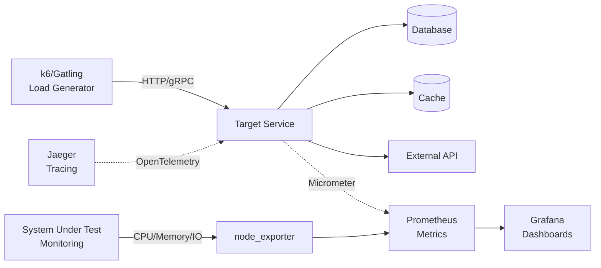
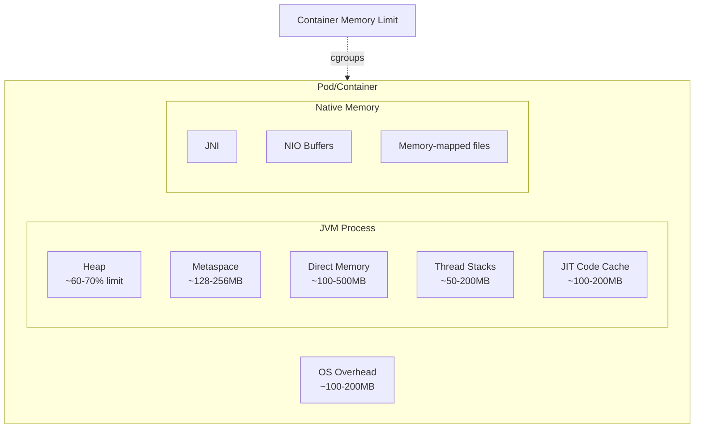

# Performance Tuning & Capacity Planning

> **Bản chất:** Capacity Planning không phải là "đoán" số lượng server cần thiết, mà là việc **mô hình hóa hệ thống dưới góc độ queuing theory**, hiểu rõ **saturation points**, và thiết kế **graceful degradation** khi vượt ngưỡng.

---

## 1. Mục tiêu của Task

Task này giải quyết bài toán: **"Làm sao để hệ thống chạy nhanh nhất có thể với resource ít nhất, và scaling đúng lúc, đúng cách?"**

Ba trụ cột:
1. **Load Testing** - Đo lường thực tế, không đoán
2. **Resource Tuning** - Tối ưu JVM, connection pool, thread pool trong containerized environment
3. **Capacity Planning** - Quyết định scale vertical vs horizontal, autoscaling policies

---

## 2. Bản Chất và Cơ Chế Hoạt Động

### 2.1 Throughput vs Latency - Mối Quan Hệ Phi Tuyến Tính

> **Nguyên lý cơ bản:** Throughput (req/s) và Latency (ms) không phải trade-off đơn giản. Chúng liên hệ qua **Little's Law** và **queuing behavior**.

**Little's Law:**
```
L = λ × W

Trong đó:
- L: Số request đang trong hệ thống (concurrency)
- λ: Throughput (request/time unit)
- W: Latency (thởi gian xử lý trung bình)
```

**Bản chất queuing:**

| Trạng thái | Đặc điểm | Dấu hiệu |
|------------|----------|----------|
| **Low load** | Latency ≈ Service time, queue gần như trống | Linear scaling, p99 ≈ p50 |
| **Knee point** | Queue bắt đầu build up, latency tăng dần | p99 > 2× p50, throughput tăng chậm |
| **Saturation** | Queue đầy, latency tăng vọt, throughput plateau | p99 >> p50, error rate tăng |
| **Collapse** | System thrashing, throughput giảm | Timeout, OOM, circuit breaker trip |

> ⚠️ **Quan trọng:** Đừng optimize cho throughput tối đa. Hãy optimize cho **throughput ở latency budget được chấp nhận**.

**Latency Budget phổ biến:**
- User-facing API: p99 < 200ms
- Internal service: p99 < 500ms  
- Background job: p99 < 5s

### 2.2 JVM Container-Aware Ergonomics

> **Vấn đề lịch sử:** Trước Java 10, JVM không nhận biết container limits. Khi chạy trong Docker với `-m 2g`, JVM vẫn nhìn thấy toàn bộ host memory và set heap size dựa trên đó → dễ bị OOM killed.

**Cơ chế UseContainerSupport (Java 10+, backported Java 8u191+):**

```
JVM đọc CGroup limits từ:
- /sys/fs/cgroup/memory/memory.limit_in_bytes (cgroup v1)
- /sys/fs/cgroup/memory.max (cgroup v2)
- /sys/fs/cgroup/cpu/cpu.cfs_quota_us + cpu.cfs_period_us

Từ đó tính toán:
- Max Heap = 25% container memory (mặc định)
- Active Processor Count = min(host CPUs, container CPU quota)
```

**Flags quan trọng:**

| Flag | Default | Ý nghĩa |
|------|---------|---------|
| `-XX:+UseContainerSupport` | true (Java 10+) | Bật container detection |
| `-XX:MaxRAMPercentage` | 25.0 | % container memory cho max heap |
| `-XX:InitialRAMPercentage` | 1.5625 | % cho initial heap size |
| `-XX:MinRAMPercentage` | 50.0 | % cho container < 200MB |

**Trade-off Memory Allocation:**

```
Container Memory = JVM Heap + Metaspace + Direct Memory + Thread Stacks + Native + Overhead

Thông thường:
- Heap: 60-70% container memory
- Metaspace: 128-256MB
- Direct Memory (Netty, NIO): 100-500MB
- Thread Stacks (1MB/stack × thread count): 50-200MB
- Overhead (kernel, metrics agent): 200-500MB
```

> 💡 **Best Practice:** Set `-XX:MaxRAMPercentage=75.0` chỉ khi bạn hiểu rõ non-heap memory usage. Safe default: 50-60%.

### 2.3 Connection Pool Sizing - Công Thức và Thực Tế

**Công thức PostgreSQL (từ cốt lõi của cơ chế):**
```
connections = ((core_count × 2) + effective_spindle_count)
```

Trong đó:
- `core_count`: Số CPU cores của database server
- `effective_spindle_count`: Số ổ đĩa (spinning disks), = 0 với SSD

**Áp dụng cho HikariCP:**

| Scenario | minimumIdle | maximumPoolSize | Lý do |
|----------|-------------|-----------------|-------|
| Microservice nhỏ (2-4 CPU) | 2-5 | 10-20 | Ít connection đủ cho throughput |
| Service cao throughput (8+ CPU) | 10-20 | 20-50 | Nhiều concurrent requests |
| Multiple services → 1 DB | - | ≤ 100 total | Tránh max_connections exceeded |

**Vấn đề "Too Many Connections":**

> **Bản chất:** Mỗi connection trong PostgreSQL tạo một OS process. 1000 connections = 1000 processes → context switching overhead, memory pressure, lock contention.

**Pool sizing với nhiều service instances:**
```
Nếu có 10 microservice, mỗi service cấu hình max 20 connections:
→ Tổng max connections = 200
→ DB server cần đủ capacity cho 200 concurrent connections
→ Nếu mỗi connection xử lý 50ms, throughput tối đa ≈ 4000 TPS
```

**HikariCP specific tuning:**

| Property | Default | Khuyến nghị | Lý do |
|----------|---------|-------------|-------|
| `connectionTimeout` | 30000 | 5000-10000 | Nhanh fail nếu pool exhausted |
| `idleTimeout` | 600000 | 300000 | Giải phóng idle connections sớm |
| `maxLifetime` | 1800000 | 1800000 | Tránh connection leaks từ DB side |
| `leakDetectionThreshold` | 0 | 60000 | Phát hiện connection không đóng |

### 2.4 Thread Pool Tuning - Từ Số Liệu Thực Tế

**Công thức cơ bản (từ "Java Concurrency in Practice"):**
```
N = N_cpu × U_cpu × (1 + W/C)

Trong đó:
- N_cpu: Số CPU cores
- U_cpu: Target CPU utilization (0-1)
- W: Wait time (blocking I/O)
- C: Compute time
```

**Thread pool types và use cases:**

| Pool Type | Kích thước | Use Case | Thread-per-request? |
|-----------|------------|----------|---------------------|
| **CPU-bound** | N_cpu + 1 | Data processing, calculations | No (use Virtual Threads) |
| **I/O-bound** | N_cpu × (1 + W/C) | HTTP client, DB calls | Yes (hoặc Virtual Threads) |
| **Mixed** | 2×N_cpu đến 4×N_cpu | Web apps thông thường | Context-dependent |

**Virtual Threads (Java 21+) - Cách mạng về Thread Pool:**

> **Bản chất:** Virtual threads không phải là "thread pool nhẹ hơn". Chúng cho phép **mô hình thread-per-request** với chi phí thấp, loại bỏ nhu cầu async programming.

```
Platform Thread (OS thread):
- Stack size: ~1MB
- Creation cost: ~1ms
- Context switch: ~100μs
- Limit: ~10,000 threads

Virtual Thread:
- Stack size: ~1KB (khi parked)
- Creation cost: ~1μs
- Context switch: ~10μs
- Limit: ~1,000,000+ threads
```

**Khi nào dùng Virtual Threads:**
- HTTP server với blocking I/O (RestTemplate, JDBC)
- Không cần reactive programming complexity
- Java 21+ available

**Khi nào KHÔNG dùng Virtual Threads:**
- Heavy CPU computation (virtual threads không tăng CPU throughput)
- Native code calls giữ virtual thread pinned
- Lock contention nghiêm trọng

### 2.5 Backpressure - Cơ Chế Chống Sụp Đổ

> **Bản chất:** Backpressure là cơ chế **communicate capacity constraints downstream**, ngăn upstream overwhelm hệ thống.

**Backpressure patterns:**

| Pattern | Cơ chế | Use Case | Trade-off |
|---------|--------|----------|-----------|
| **Reject** | Throw exception, return 503 | API Gateway, Load Balancer | Client phải retry |
| **Buffer** | Queue requests | Batch processing, async jobs | Memory risk nếu buffer đầy |
| **Drop** | Discard old/new data | Metrics, logs | Data loss acceptable |
| **Throttle** | Rate limit upstream | API limits | Fair resource sharing |

**Reactive Streams backpressure:**
```java
// Publisher chỉ gửi khi Subscriber request
interface Subscriber<T> {
    void onSubscribe(Subscription s);
    void onNext(T t);  // Xử lý item
    void onError(Throwable t);
    void onComplete();
}

interface Subscription {
    void request(long n);  // Request n items
    void cancel();
}
```

> 💡 **Key insight:** Backpressure không phải là "chậm lại", mà là **explicit flow control** giữa producer và consumer.

---

## 3. Kiến Trúc và Luồng Xử Lý

### 3.1 Load Testing Architecture



**Load testing stages:**

1. **Baseline Test:** 1 user, measure service time (loại bỏ queueing)
2. **Load Test:** Gradual ramp-up đến expected load, tìm knee point
3. **Stress Test:** Vượt quá expected load, tìm saturation và breaking point
4. **Soak Test:** Giữ steady state trong thởi gian dài (memory leak, connection pool exhaustion)
5. **Spike Test:** Sudden traffic spike, test autoscaling và circuit breaker

### 3.2 Container Resource Flow



---

## 4. So Sánh Các Lựa Chọn

### 4.1 Vertical vs Horizontal Scaling

| Yếu tố | Vertical Scaling | Horizontal Scaling |
|--------|------------------|-------------------|
| **Complexity** | Thấp - chỉ cần resize VM/container | Cao - cần distributed systems patterns |
| **Limit** | Có giới hạn phần cứng | Gần như không giới hạn |
| **Cost pattern** | Step function | Linear/sub-linear |
| **Availability** | Single point of failure | Tốt hơn (có thể tolerate node loss) |
| **Data consistency** | Đơn giản (single node) | Phức tạp (distributed state) |
| **Use case** | Database, legacy monolith | Stateless microservices |

**Quyết định:**
- State hoặc sessionful → Vertical đến mức hợp lý, sau đó shard
- Stateless + share-nothing → Horizontal
- Database → Vertical + read replicas, hoặc sharding nếu vượt giới hạn

### 4.2 Load Testing Tools

| Tool | Protocols | Scripting | Distributed | Best For |
|------|-----------|-----------|-------------|----------|
| **k6** | HTTP, gRPC, WebSocket | JavaScript | Yes (k6 cloud) | Developer-friendly, CI/CD integration |
| **Gatling** | HTTP, gRPC, JMS | Scala/Kotlin | Yes | Complex scenarios, detailed reports |
| **JMeter** | HTTP, JDBC, JMS, etc | GUI/DSL | Yes | Legacy systems, non-HTTP protocols |
| **Locust** | HTTP, gRPC | Python | Yes | Python ecosystem, programmable |
| **Vegeta** | HTTP | CLI/JSON | Limited | Quick HTTP load tests |

### 4.3 Autoscaling Strategies

| Strategy | Trigger | Response Time | Use Case | Risk |
|----------|---------|---------------|----------|------|
| **HPA (Horizontal)** | CPU/Memory threshold | 1-5 minutes | Steady load changes | Thrashing nếu threshold quá thấp |
| **VPA (Vertical)** | Resource usage | 10-60 minutes | Long-term trend | Pod restart required |
| **KEDA (Event-driven)** | Queue depth, Kafka lag | Seconds | Event-driven workloads | Cold start latency |
| **Cluster Autoscaler** | Pending pods | 3-10 minutes | Node capacity | Cost nếu không set limits |

---

## 5. Rủi Ro, Anti-patterns, và Lỗi Thường Gặp

### 5.1 Connection Pool Anti-patterns

> ❌ **Anti-pattern: Pool size = Thread pool size = 1000+**

**Tại sao sai:**
- 1000 threads × 1MB stack = 1GB memory chỉ cho thread stacks
- 1000 DB connections overwhelm database
- Context switching overhead giảm throughput

> ✅ **Solution:** Sử dụng Virtual Threads (Java 21+) hoặc giới hạn thread pool dựa trên công thức hợp lý.

### 5.2 JVM Memory Anti-patterns

| Anti-pattern | Hệ quả | Fix |
|--------------|--------|-----|
| Không set `-XX:MaxRAMPercentage` | JVM bị OOM killed trong container | Set `-XX:MaxRAMPercentage=50-75` |
| Heap quá lớn (>70% container) | Không đủ memory cho Direct Buffers, Metaspace | Giảm heap, monitor non-heap |
| Không monitor GC metrics | Miss performance degradation signs | Enable GC logging, alert trên GC pause |
| Dùng Serial GC trong production | Single-threaded GC, long pauses | Dùng G1, ZGC, hoặc Shenandoah |

### 5.3 Load Testing Anti-patterns

> ❌ **Anti-pattern: Load test từ local machine**

**Tại sao sai:**
- Local machine trở thành bottleneck trước target service
- Network latency không realistic
- Không đủ concurrent connections

> ✅ **Solution:** Dùng distributed load generators hoặc cloud-based load testing.

> ❌ **Anti-pattern: Chỉ test happy path**

**Tại sao sai:**
- Không phát hiện circuit breaker behavior
- Không test retry storms
- Không test degradation paths

### 5.4 Capacity Planning Pitfalls

| Pitfall | Dấu hiệu | Khắc phục |
|---------|----------|-----------|
| **Linear extrapolation** | Dự đoán traffic 10x dựa trên 2x data | Dùng queuing theory models, test saturation points |
| **Ignore headroom** | Hệ thống chạy 95%+ capacity thường xuyên | Plan cho 70% capacity, 30% headroom |
| **Static capacity** | Không có autoscaling | Implement HPA + cluster autoscaler |
| **Wrong metrics** | Scale dựa trên CPU khi bottleneck là DB | Identify actual bottleneck trước khi scale |

---

## 6. Khuyến Nghị Thực Chiến trong Production

### 6.1 JVM Tuning Checklist (Containerized)

```bash
# 1. Base flags cho container
-XX:+UseContainerSupport
-XX:MaxRAMPercentage=60.0
-XX:InitialRAMPercentage=30.0

# 2. GC selection (Java 17+)
-XX:+UseG1GC  # default, good balance
# hoặc
-XX:+UseZGC   # low-latency (<10ms pause), nếu heap < 16TB

# 3. GC logging ( observability )
-Xlog:gc*:file=/var/log/jvm/gc.log:time,uptime,level,tags:filecount=10,filesize=100m

# 4. Heap dump on OOM
-XX:+HeapDumpOnOutOfMemoryError
-XX:HeapDumpPath=/var/log/jvm/heapdump.hprof

# 5. Exit on OOM (cho orchestrator restart)
-XX:+ExitOnOutOfMemoryError
```

### 6.2 Connection Pool Configuration Template

```yaml
# HikariCP configuration
hikari:
  # Pool sizing: Tính toán dựa trên N_cpu và DB capacity
  minimumIdle: 5          # Đủ cho baseline load
  maximumPoolSize: 20     # Limit để tránh overwhelm DB
  
  # Timeouts - fail fast
  connectionTimeout: 5000     # 5s - không đợi lâu nếu pool exhausted
  idleTimeout: 300000         # 5m - giải phóng idle connections
  maxLifetime: 1800000        # 30m - tránh connection leaks từ DB
  
  # Diagnostics
  leakDetectionThreshold: 60000  # Log nếu connection hold > 60s
  
  # Performance
  dataSourceProperties:
    cachePrepStmts: true
    prepStmtCacheSize: 250
    prepStmtCacheSqlLimit: 2048
```

### 6.3 Load Testing Runbook

```yaml
# k6 test structure
scenarios:
  # 1. Smoke test - verify functionality
  smoke:
    executor: constant-vus
    vus: 1
    duration: '1m'
    tags: { type: smoke }
  
  # 2. Load test - find knee point
  load:
    executor: ramping-vus
    stages:
      - duration: '5m', target: 100   # Ramp up
      - duration: '10m', target: 100  # Steady state
      - duration: '5m', target: 0     # Ramp down
  
  # 3. Stress test - find breaking point
  stress:
    executor: ramping-vus
    stages:
      - duration: '2m', target: 200
      - duration: '5m', target: 400
      - duration: '5m', target: 600
      - duration: '2m', target: 0
  
  # 4. Spike test - sudden traffic
  spike:
    executor: ramping-vus
    stages:
      - duration: '30s', target: 500
      - duration: '2m', target: 500
      - duration: '30s', target: 0

thresholds:
  http_req_duration: ['p(95)<200']  # 95th percentile < 200ms
  http_req_failed: ['rate<0.01']     # Error rate < 1%
```

### 6.4 Autoscaling Policy (Kubernetes)

```yaml
apiVersion: autoscaling/v2
kind: HorizontalPodAutoscaler
metadata:
  name: api-hpa
spec:
  scaleTargetRef:
    apiVersion: apps/v1
    kind: Deployment
    name: api-service
  minReplicas: 2        # HA minimum
  maxReplicas: 20       # Cost cap
  
  metrics:
    # Primary: CPU utilization
    - type: Resource
      resource:
        name: cpu
        target:
          type: Utilization
          averageUtilization: 70   # Scale khi CPU > 70%
    
    # Secondary: Custom metric (request latency)
    - type: Pods
      pods:
        metric:
          name: http_request_duration_seconds
        target:
          type: AverageValue
          averageValue: 100m       # 100ms p95 latency
  
  behavior:
    scaleUp:
      stabilizationWindowSeconds: 60   # Đợi 60s trước khi scale up
      policies:
        - type: Percent
          value: 100
          periodSeconds: 60          # Scale up tối đa 100% mỗi 60s
    scaleDown:
      stabilizationWindowSeconds: 300  # Đợi 5m trước khi scale down
      policies:
        - type: Percent
          value: 10
          periodSeconds: 60          # Scale down từ từ, 10% mỗi 60s
```

### 6.5 Monitoring Dashboards

**RED Method Dashboard:**
- **Rate:** Requests per second (by endpoint)
- **Errors:** Error rate (by status code)
- **Duration:** p50, p95, p99 latency

**USE Method Dashboard:**
- **Utilization:** CPU%, Memory%, Connection pool usage
- **Saturation:** Request queue depth, thread pool active count
- **Errors:** JVM GC pauses, connection timeouts, circuit breaker trips

**Key Alerts:**
```yaml
# Latency degradation
- alert: HighLatency
  expr: histogram_quantile(0.95, http_request_duration_seconds) > 0.5
  for: 2m

# Error rate spike
- alert: HighErrorRate
  expr: rate(http_requests_total{status=~"5.."}[5m]) > 0.01
  for: 1m

# Resource saturation
- alert: HighCPU
  expr: rate(container_cpu_usage_seconds_total[5m]) > 0.8
  for: 5m

# JVM specific
- alert: LongGCPause
  expr: jvm_gc_pause_seconds_max > 1
  for: 1m
```

---

## 7. Kết Luận

**Bản chất của Performance Tuning & Capacity Planning:**

1. **Không phải magic numbers** - Mọi con số (pool size, heap percentage, replica count) đều phải được **đo lường và validated** trong môi trường production-like.

2. **Trade-off chính:**
   - Tăng throughput → Tăng latency (queuing)
   - Tăng reliability → Tăng cost (redundancy)
   - Tăng tiện dụng (Virtual Threads) → Giảm control (pinning risks)

3. **Container-awareness là bắt buộc** - JVM cần được cấu hình để hiểu CGroup limits. Đây là điểm khác biệt giữa "chạy được" và "chạy tốt" trong containerized environment.

4. **Backpressure > Over-provisioning** - Thiết kế hệ thống reject gracefully thay vì crash. Over-provisioning là chiến lược scale, không phải architecture.

5. **Capacity planning là continuous process** - Traffic patterns thay đổi, code thay đổi, infrastructure thay đổi. Cần regular load testing và capacity review.

> **Chốt lại:** Senior backend engineer không chỉ biết "scale lên", mà còn hiểu **khi nào scale, scale theo chiều nào, và trade-off là gì**. Performance tuning không phải để đạt benchmark tốt nhất, mà để đạt **cost/performance ratio tốt nhất** cho business requirements.

---

*Generated by OpenClaw Agent - Senior Backend Architect Research*
