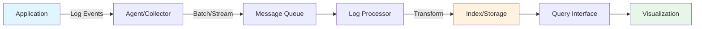
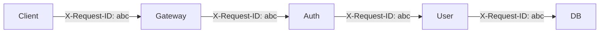

# Log Management & Analysis: Kiến Trúc Logging Production-Grade

> **Mục tiêu:** Hiểu sâu cơ chế logging ở quy mô enterprise, từ structured logging đến centralized aggregation, tối ưu chi phí storage và đảm bảo tuân thủ bảo mật.

---

## 1. Mục Tiêu Nghiên Cứu

Log management trong hệ thống phân tán không chỉ là "ghi log ra file". Nó là một kiến trúc con (sub-system) đòi hỏi:

- **Observability:** Truy vết request xuyên suốt hệ thống
- **Cost Efficiency:** Lưu trữ petabyte log mà không phá sản
- **Security:** Mask sensitive data trước khi rỏ rỉ
- **Performance:** Logging không làm chết ứng dụng

---

## 2. Bản Chất và Cơ Chế Hoạt Động

### 2.1 Log là "Dòng Máu" của Hệ Thống

Log không chỉ để debug. Trong production, log phục vụ:

| Mục đích | Dữ liệu cần thiết | Ví dụ thực tế |
|----------|------------------|---------------|
| Debugging | Stack trace, variable state | NullPointerException ở dòng X |
| Monitoring | Metrics, latency, throughput | Request duration, error rate |
| Auditing | User actions, data changes | User A đã sửa record B lúc C |
| Compliance | Access patterns, security events | GDPR data access, PCI DSS |
| Business Analytics | User behavior, funnel | Clickstream, conversion rate |

> **Quan trọng:** Mỗi mục đích có yêu cầu format, retention, và access pattern khác nhau. Không thể dùng một loại log cho tất cả.

### 2.2 Structured Logging vs Unstructured Logging

#### Unstructured (Text thuần)

```
2024-01-15 10:23:45 INFO User John logged in from IP 192.168.1.1
```

**Vấn đề:**
- Phải parse bằng regex → expensive, error-prone
- Không thể query field cụ thể (WHERE ip = '192.168.1.1')
- Schema evolution = breaking change

#### Structured (JSON)

```json
{
  "timestamp": "2024-01-15T10:23:45.123Z",
  "level": "INFO",
  "message": "User logged in",
  "fields": {
    "user_id": "john_doe",
    "ip_address": "192.168.1.1",
    "user_agent": "Mozilla/5.0...",
    "session_id": "sess_abc123"
  },
  "service": "auth-service",
  "environment": "production",
  "version": "v2.3.1"
}
```

**Ưu điểm:**
- Query bằng JSON path: `$.fields.user_id`
- Index trên field cụ thể
- Machine-readable (auto-parse)
- Schema versioning qua `version` field

### 2.3 Log Levels: Semantics và Cardinality

Log levels không phải là "độ nghiêm trọng" đơn thuần. Chúng quyết định:

| Level | Cardinality | Retention | Use Case |
|-------|-------------|-----------|----------|
| TRACE | Rất cao (1000s/request) | < 1h | Chi tiết execution path, chỉ local dev |
| DEBUG | Cao (100s/request) | 24h | State inspection, tạm thờ trong troubleshooting |
| INFO | Trung bình (10s/request) | 30d | Business events, milestones |
| WARN | Thấp (1/request) | 90d | Anomalies, recoverable errors |
| ERROR | Rất thấp | 1y | Failures, cần action |
| FATAL | Cực thấp | Permanent | System crash, data loss |

> **Cardinaliy Trap:** Log `DEBUG` với dynamic message như `"Processing user_" + userId` tạo ra infinite cardinality. Mỗi userId = 1 log pattern mới → index explosion.

**Pattern đúng:**
```java
// SAI - cardinality explosion
log.debug("Processing user " + userId);

// ĐÚNG - structured field
log.debug("Processing user", kv("user_id", userId));
// {"message": "Processing user", "user_id": "u123"}
```

---

## 3. Kiến Trúc Centralized Logging

### 3.1 Pipeline Tổng Quan



### 3.2 ELK Stack (Elasticsearch + Logstash + Kibana)

**Kiến trúc:**

```
App → Filebeat → Logstash → Elasticsearch ← Kibana
                ↓
           (Parsing/Grok)
```

**Bản chất từng thành phần:**

| Component | Vai trò | Trade-off |
|-----------|---------|-----------|
| Filebeat | Lightweight shipper | Không parse, chỉ forward |
| Logstash | Parsing, enrichment | Resource-heavy, JVM-based |
| Elasticsearch | Distributed search/index | Write-heavy = expensive |
| Kibana | Visualization | Query DSL learning curve |

**Vấn đề production với ELK:**

1. **Write Amplification:** Mỗi log → index ở nhiều shards → I/O x3-5
2. **Mapping Explosion:** Dynamic mapping từ JSON fields → memory pressure
3. **Hot-Warm Architecture bắt buộc:**
   - Hot nodes: SSD, recent data (7 days)
   - Warm nodes: HDD, older data (30 days)
   - Cold nodes: S3, archived (1y+)

### 3.3 Grafana Loki: "Prometheus cho Logs"

**Kiến trúc khác biệt:**

```
App → Promtail → Loki ← Grafana
         ↓
    (Label indexing only)
```

**Bản chất:**
- Chỉ index **labels** (metadata), không index log content
- Log content được nén và lưu thành chunks
- Query bằng LogQL: pattern matching trên chunks

**Trade-off ELK vs Loki:**

| Aspect | ELK | Loki |
|--------|-----|------|
| Index size | 100% log content | Chỉ labels (~5-10%) |
| Query speed | Sub-second (đã index) | Chậm hơn (scan chunks) |
| Storage cost | Cao | Thấp (10-50x cheaper) |
| Full-text search | Mạnh | Yếu (regex-based) |
| Operational complexity | Cao | Thấp |
| Scale | PBs của logs | PBs với chi phí thấp |

> **Khuyến nghị:** Dùng Loki cho 80% use cases (debugging, tracing). Dùng ELK cho 20% cần full-text search mạnh (security auditing, log analytics).

### 3.4 Alternative: Cloud-Native Solutions

| Solution | Pattern | Best For |
|----------|---------|----------|
| AWS CloudWatch Logs | Managed | AWS-heavy, không cần custom query |
| Google Cloud Logging | Integrated | GCP ecosystem, BigQuery integration |
| Azure Monitor Logs | OMS | Azure-first, PowerBI integration |
| Datadog Logs | SaaS | Unified observability (metrics + traces + logs) |
| Splunk | Enterprise | Security SIEM, compliance |

---

## 4. Log Aggregation Patterns

### 4.1 Push vs Pull

**Push Pattern (Filebeat, Fluentd, Vector)**
```
App → stdout/stderr → Agent → Collector
```
- Ưu: Simple, real-time
- Nhược: Backpressure handling phức tạp, agent failure = log loss

**Pull Pattern (Promtail, Loki)**
```
Agent polls /logs endpoint hoặc tail files
```
- Ưu: Service không biết về logging, dễ control rate
- Nhược: Delay (polling interval), cần expose logs

### 4.2 Sidecar vs DaemonSet

| Pattern | Kiến trúc | Khi nào dùng |
|---------|-----------|--------------|
| Sidecar | 1 container/agent mỗi pod | Multi-tenant isolation, custom config/pod |
| DaemonSet | 1 agent/node | Resource efficiency, uniform collection |

> **Best Practice:** DaemonSet cho 90% cases. Sidecar chỉ khi cần isolation hoặc custom parsing logic per service.

### 4.3 Backpressure Handling

Khi collector không xử lý kịp (down, slow):

```
App → [Buffer] → Agent → [Queue] → Collector
     ↑ disk/mem  ↑          ↑ Kafka/Redis
```

**Strategies:**
1. **Drop:** Mất log nhưng giữ app alive (không khuyến khích)
2. **Back-pressure:** Block log call (risk: app hang)
3. **Buffer to disk:** Giữ log local, retry sau (tốt nhất)

**Vector (Rust-based) config:**
```yaml
sinks:
  loki:
    type: loki
    inputs: [app_logs]
    buffer:
      type: disk
      max_size: 104857600  # 100MB
      when_full: block     # Hoặc drop_newest
```

---

## 5. Correlation ID: Distributed Tracing đơn giản

### 5.1 Bản Chất Vấn Đề

User gọi API → Gateway → Auth Service → User Service → Database. Lỗi xảy ra ở đâu?

**Không có Correlation ID:**
```
Gateway:    "Request received"
Auth:       "Token validated"
User:       "User not found"
```
→ Không biết log nào liên quan đến nhau

**Có Correlation ID:**
```json
// Gateway
{"correlation_id": "req_abc123", "message": "Request received"}

// Auth Service
{"correlation_id": "req_abc123", "message": "Token validated"}

// User Service
{"correlation_id": "req_abc123", "message": "User not found", "user_id": "xyz"}
```
→ Query: `correlation_id = "req_abc123"` → toàn bộ flow

### 5.2 Implementation Pattern



**Java Implementation (MDC - Mapped Diagnostic Context):**

```java
// Filter hoặc Interceptor
public class CorrelationIdFilter implements Filter {
    @Override
    public void doFilter(request, response, chain) {
        String correlationId = request.getHeader("X-Request-ID");
        if (correlationId == null) {
            correlationId = UUID.randomUUID().toString();
        }
        
        // Gắn vào MDC - tự động inject vào log pattern
        MDC.put("correlation_id", correlationId);
        
        try {
            chain.doFilter(request, response);
        } finally {
            MDC.clear(); // QUAN TRỌNG: clean up để tránh leak
        }
    }
}
```

**Logback pattern:**
```xml
<pattern>%d{ISO8601} [%thread] [%X{correlation_id}] %-5level %logger{36} - %msg%n</pattern>
```

Output:
```
2024-01-15T10:23:45 [http-nio-8080-exec-1] [req_abc123] INFO c.e.UserService - User found
```

### 5.3 Parent-Child Relationships (Nested Context)

Với async operations (reactive, @Async), cần propagate context:

```java
@Async
public CompletableFuture<Void> processAsync(String data) {
    // Lấy context từ parent thread
    Map<String, String> parentContext = MDC.getCopyOfContextMap();
    
    return CompletableFuture.runAsync(() -> {
        // Set vào child thread
        MDC.setContextMap(parentContext);
        
        try {
            // Processing logic
        } finally {
            MDC.clear();
        }
    });
}
```

**Với Project Reactor:**
```java
// Hook để auto-propagate MDC qua operators
Hooks.onEachOperator("MDC", 
    Operators.lift((sc, subscriber) -> new MdcSubscriber(subscriber)));
```

---

## 6. Sensitive Data Masking

### 6.1 Attack Surface của Logs

Logs là "soft target" cho data breach:
- Thường ít được bảo vệ như database
- Có thể chứa PII, credentials, tokens
- Retention dài = exposure window lớn

### 6.2 Data Classification

| Loại | Ví dụ | Xử lý |
|------|-------|-------|
| PII | Email, SSN, phone | Mask hoặc tokenize |
| Credentials | Password, API keys | NEVER log |
| Financial | Credit card, bank account | Mask hoặc truncate |
| Health | Medical records | HIPAA-compliant encryption |
| Session | JWT, session tokens | Hash hoặc partial mask |

### 6.3 Masking Strategies

**1. Field-Level Masking (Best)**
```java
log.info("User login", 
    kv("email", maskEmail(user.getEmail())),  // "j***@example.com"
    kv("ssn", maskSsn(user.getSsn()))          // "***-**-1234"
);
```

**2. Pattern-Based (Regex)**
```java
// Logstash filter hoặc trong app
pattern: "(\\d{4})-\\d{4}-\\d{4}-(\\d{4})"
replacement: "$1-****-****-$2"
// "4532-1234-5678-9012" → "4532-****-****-9012"
```

**3. Structured Approach (Jackson Mixin)**
```java
@JsonFilter("sensitiveFilter")
public class User {
    private String email;
    
    @SensitiveData(mask = MaskType.PARTIAL)
    private String creditCard;
}

// Serialization tự động mask
ObjectMapper mapper = new ObjectMapper();
mapper.addMixIn(User.class, SensitiveFilter.class);
log.info("User: {}", mapper.writeValueAsString(user));
```

### 6.4 Implementation Layers

| Layer | Ưu điểm | Nhược điểm |
|-------|---------|------------|
| Application | Early, explicit control | Cần discipline từ developers |
| Log Agent | Centralized, no code change | Can miss structured data |
| Collector | Unified policy | Too late, data already in transit |

> **Recommendation:** Defense in depth. Application-level (explicit) + Agent-level (safety net).

### 6.5 Tokenization vs Masking

**Masking:** `john@email.com` → `j***@email.com` (irreversible)
**Tokenization:** `john@email.com` → `tok_abc123` (reversible via token vault)

Dùng tokenization khi cần:
- Support "show me logs for this user" (lookup by token)
- Audit compliance (retain ability to identify)
- Debug với real data (de-tokenize on-demand)

---

## 7. Retention Policies và Cost Optimization

### 7.1 Tiered Storage

```
┌─────────────────────────────────────────────────────────┐
│  Hot (SSD)     │  Warm (HDD)    │  Cold (S3/GCS)       │
│  0-7 days      │  7-30 days     │  30d-1y              │
│  $$$           │  $$            │  $                   │
│  Query: <1s    │  Query: 5-10s  │  Query: minutes      │
└─────────────────────────────────────────────────────────┘
```

**Loki Storage Configuration:**
```yaml
schema_config:
  configs:
    - from: 2024-01-01
      store: boltdb-shipper
      object_store: s3
      schema: v11
      index:
        prefix: index_
        period: 24h

storage_config:
  aws:
    s3: s3://region/bucket
    period: 168h  # 7 days hot, sau đó cold
```

### 7.2 Log Sampling

Không cần giữ 100% logs cho mọi use case:

```java
// Error logs: 100% (quan trọng)
// Info logs: 10% sampling (đủ cho metrics)
// Debug logs: 1% hoặc dynamic (chỉ khi cần)

@Logged(samplingRate = 0.1)
public void processRequest(Request req) {
    // Chỉ log 10% requests
}
```

**Dynamic Sampling (Rate-based):**
```java
// Nếu > 1000 log/sec, tăng sampling
RateLimiter rateLimiter = RateLimiter.create(1000);

if (rateLimiter.tryAcquire()) {
    log.info("Request processed", kv("path", path));
}
```

### 7.3 Cardinality Control

**Vấn đề:** High-cardinality fields (user_id, request_id) trong labels → index explosion.

**Giải pháp:**
- Đưa high-cardinality vào **message**, không phải **labels**
- Hoặc dùng low-cardinality buckets: `user_id` → `user_hash % 100`

```java
// SAI cho Loki - cardinality cao
log.info("Request", kv("user_id", userId));  

// ĐÚNG
log.info("Request", 
    kv("user_bucket", userId.hashCode() % 100),  // Label: 100 values
    kv("user_id", userId)  // Trong message, không index
);
```

---

## 8. Anti-Patterns và Pitfalls

### 8.1 String Concatenation trong Log

```java
// ANTI-PATTERN: Luôn evaluate dù log level không cần
log.debug("Processing " + heavyComputation() + " items");

// PATTERN: Lazy evaluation
log.debug("Processing {} items", () -> heavyComputation());
// Hoặc dùng isDebugEnabled()
if (log.isDebugEnabled()) {
    log.debug("Processing " + heavyComputation() + " items");
}
```

### 8.2 Logging trong Loop

```java
// ANTI-PATTERN: 1M items = 1M log lines
for (Item item : items) {
    log.debug("Processing item: {}", item.getId());
}

// PATTERN: Aggregate
log.debug("Processing {} items", items.size());
// Hoặc sample
if (Math.random() < 0.01) {
    log.debug("Sample item: {}", items.get(0).getId());
}
```

### 8.3 Exception Swallowing

```java
// ANTI-PATTERN: Mất stack trace
catch (Exception e) {
    log.error("Error occurred: " + e.getMessage());
}

// PATTERN: Giữ nguyên stack trace
catch (Exception e) {
    log.error("Failed to process order {}", orderId, e);
}
```

### 8.4 MDC Leak

```java
// ANTI-PATTERN: Không clean MDC
try {
    MDC.put("request_id", id);
    process();
} catch (Exception e) {
    throw e;  // MDC vẫn còn!
}

// PATTERN: Always clean in finally
try {
    MDC.put("request_id", id);
    process();
} finally {
    MDC.clear();
}
```

### 8.5 Sensitive Data trong Log

```java
// ANTI-PATTERN: Credentials leak
catch (AuthException e) {
    log.error("Auth failed for {} with password {}", username, password);
}

// PATTERN: Explicit deny list
private static final Set<String> DENY_FIELDS = Set.of("password", "token", "secret");

public void logSafe(Object obj) {
    Map<String, Object> safe = sanitize(obj, DENY_FIELDS);
    log.info("Event: {}", safe);
}
```

---

## 9. Production Recommendations

### 9.1 Java Logging Stack (2024)

| Component | Recommendation | Lý do |
|-----------|---------------|-------|
| Framework | SLF4J + Logback/Log4j2 | De-facto standard, MDC support |
| Structured | logstash-logback-encoder | JSON output, tracing integration |
| Agent | Vector hoặc Fluent Bit | Fast (Rust), low overhead |
| Collector | Loki (80%) + ELK (20%) | Cost-effective, cloud-native |
| Tracing | OpenTelemetry + Correlation ID | Unified observability |

### 9.2 Configuration Checklist

```yaml
# application.yml
logging:
  pattern:
    # JSON output cho production
    console: >
      %d{ISO8601} 
      %X{correlation_id} 
      %level 
      %logger{36} 
      %msg%n
  level:
    root: INFO
    com.yourcompany: DEBUG
    # Tắt noisy libraries
    org.apache.http: WARN
    io.netty: WARN
  
  # Structured logging
  logstash:
    enabled: true
    include-context: true
```

### 9.3 Monitoring the Monitors

Log system cũng có thể fail:

| Metric | Alert | Ý nghĩa |
|--------|-------|---------|
| log_rate | < baseline 50% | App có thể đang crash hoặc stuck |
| log_lag | > 5 min | Collector backlog, log loss risk |
| error_rate | Spike | Số lỗi tăng đột biến |
| storage_utilization | > 80% | Sắp hết storage, cần archive |

---

## 10. Kết Luận

Log management trong production là **trade-off giữa observability và cost**:

1. **Structured logging** là bắt buộc - không thể query được nếu unstructured
2. **Cardinality** là kẻ thù - control labels, move high-cardinality vào messages
3. **Loki > ELK** cho 80% use cases - chi phí thấp hơn 10-50x
4. **Correlation ID** là minimum viable distributed tracing
5. **Mask sensitive data** ở application layer - defense in depth
6. **Tiered storage** - hot/warm/cold giảm cost 80%+

> **Bản chất:** Log là dữ liệu có time-to-value rất ngắn. 99% logs không bao giờ được đọc lại sau 7 ngày. Thiết kế system để giữ ít, query nhanh, chi phí thấp.

---

## Tham Khảo

1. [Grafana Loki Documentation](https://grafana.com/docs/loki/latest/)
2. [Elasticsearch Hot-Warm Architecture](https://www.elastic.co/guide/en/elasticsearch/reference/current/data-tiers.html)
3. [OWASP Logging Cheat Sheet](https://cheatsheetseries.owasp.org/cheatsheets/Logging_Cheat_Sheet.html)
4. [OpenTelemetry Log Data Model](https://opentelemetry.io/docs/specs/otel/logs/data-model/)
5. [SRE Book - Monitoring Distributed Systems](https://sre.google/sre-book/monitoring-distributed-systems/)
