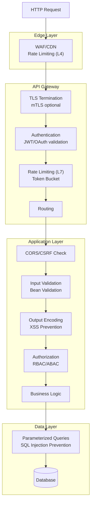

# API Security Deep Dive

> **Mục tiêu:** Hiểu sâu cơ chế bảo mật API ở tầng ứng dụng, phân tích trade-off giữa các giải pháp, và các rủi ro thực tế trong production.

---

## 1. Mục tiêu của Task

Bảo mật API không chỉ là "thêm validation" hay "dùng HTTPS". Đây là tầng phòng thủ quan trọng nhất trong microservices architecture, nơi mọi request từ client đều phải được kiểm soát trước khi chạm vào business logic.

Task này tập trung vào:
- Input validation: từ syntax đến semantic validation
- CSRF protection trong môi trường SPA/API-first
- Rate limiting: algorithm internals và distributed scenarios
- SQL injection: cơ chế và prevention strategies
- XSS mitigation: context-aware output encoding
- Secret management: lifecycle và rotation trong containers

---

## 2. Bản chất và Cơ chế Hoạt động

### 2.1 Input Validation: Defense in Depth

**Bản chất:** Input validation là việc thiết lập "boundary contracts" giữa hệ thống và thế giới bên ngoài. Mọi dữ liệu từ untrusted source đều phải được kiểm chứng trước khi processing.

#### Validation Layers

```
┌─────────────────────────────────────────────────────────┐
│  Layer 1: Syntax Validation (Format, Type, Length)     │
│  Layer 2: Semantic Validation (Business Rules)         │
│  Layer 3: Domain Validation (Entity Existence)         │
│  Layer 4: Authorization (Ownership, Permissions)       │
└─────────────────────────────────────────────────────────┘
```

**Java Bean Validation (JSR-380 / Jakarta Validation):**

| Aspect | Implementation Detail |
|--------|----------------------|
| **Constraint Resolution** | Annotation scanning via Reflection → ConstraintValidatorFactory creates validators |
| **Validation Context** | `ValidatorImpl` maintains `ConstraintValidatorContext` cho error messages tùy chỉnh |
| **Group Sequences** | `@GroupSequence` định nghĩa thứ tự validation: syntax trước, semantic sau |
| **Fail Fast** | `ValidatorFactory#setFailFast(true)` - dừng ở lỗi đầu tiên, tiết kiệm CPU |

**Custom Validator Deep Dive:**

```java
// Validator lifecycle: mỗi instance được cache và reuse
public class OrderValidator implements ConstraintValidator<ValidOrder, OrderDTO> {
    
    @Autowired private ProductRepository repo; // Dependency injection works
    
    @Override
    public void initialize(ValidOrder constraintAnnotation) {
        // Called once per annotation occurrence
        // Pre-compute regex patterns, cache metadata
    }
    
    @Override
    public boolean isValid(OrderDTO order, ConstraintValidatorContext context) {
        // Called per validation request
        // Return false triggers default message or custom via context
        
        context.disableDefaultConstraintViolation();
        context.buildConstraintViolationWithTemplate("Custom error")
               .addPropertyNode("items")
               .addConstraintViolation();
        return false;
    }
}
```

> **⚠️ Pitfall:** Validator là singleton trong default Hibernate Validator implementation. Không lưu state trong instance variables!

#### Trade-off: Validation ở đâu?

| Location | Pros | Cons | Use Case |
|----------|------|------|----------|
| **Controller** | Early fail, clear HTTP response | Duplicate logic if multiple entry points | Simple syntax validation |
| **Service Layer** | Business context available | Late fail, resource wasted | Semantic validation |
| **Domain Entity** | Invariants enforced | Coupling validation to persistence | Core business rules |
| **Database** | Ultimate consistency | Late fail, expensive rollback | Foreign key, check constraints |

**Recommendation:** Layered validation - syntax ở controller/boundary, semantic ở service, invariants ở domain.

---

### 2.2 CSRF Protection trong SPA/API-First Architecture

**Bản chất:** CSRF (Cross-Site Request Forgery) exploit trust relationship giữa browser và website. Attacker trick victim's browser into performing unwanted actions.

#### CSRF Attack Mechanism

```
1. User đăng nhập bank.com, cookie session established
2. User visit malicious.com trong cùng browser session
3. malicious.com gửi POST request đến bank.com/transfer
4. Browser tự động attach cookie của bank.com
5. bank.com nhận authenticated request → execute transfer
```

**CSRF Protection Strategies:**

| Strategy | Mechanism | SPA/API Suitability |
|----------|-----------|---------------------|
| **Synchronizer Token Pattern** | Server-generated token embedded in form/session | ❌ Không phù hợp stateless API |
| **Double Submit Cookie** | Token in cookie + header, server compares | ✅ Stateless, SPA-friendly |
| **SameSite Cookies** | Cookie attribute chặn cross-origin requests | ✅ Modern browsers, recommended |
| **Custom Headers** | X-Requested-With không thể set từ cross-origin | ✅ API-only, simple |

#### SameSite Cookie Deep Dive

```
Set-Cookie: session=abc123; SameSite=Strict; Secure; HttpOnly
```

| SameSite Value | Behavior | Risk Level |
|---------------|----------|------------|
| `Strict` | Cookie không gửi trong cross-site requests | Zero CSRF, nhưng break legitimate cross-site navigation |
| `Lax` | Cookie gửi trong top-level GET requests | Protected khỏi POST CSRF, cho phép link clicks |
| `None` | Cookie gửi trong mọi requests | Requires `Secure`, vulnerable nếu không có thêm protection |

**For SPAs:**
```javascript
// Frontend: Include token in header
fetch('/api/transfer', {
  method: 'POST',
  headers: {
    'X-CSRF-Token': getCsrfTokenFromCookie(), // Read from document.cookie
    'Content-Type': 'application/json'
  },
  credentials: 'same-origin'
});
```

```java
// Backend: Verify double-submit
@PostMapping("/transfer")
public ResponseEntity<?> transfer(
    @CookieValue("XSRF-TOKEN") String cookieToken,
    @RequestHeader("X-XSRF-TOKEN") String headerToken
) {
    if (!Objects.equals(cookieToken, headerToken)) {
        throw new CsrfException("Invalid CSRF token");
    }
    // Process transfer
}
```

> **🔑 Key Insight:** SameSite=Lax + Double Submit Cookie là combination hiệu quả nhất cho modern SPAs. SameSite giảm attack surface, double-submit bảo vệ còn lại.

---

### 2.3 Rate Limiting: Algorithm Internals

**Bản chất:** Rate limiting là control mechanism giới hạn số requests trong time window. Goals: prevent abuse, ensure fair resource allocation, protect against DDoS.

#### Algorithm Comparison

| Algorithm | Memory Usage | Burst Handling | Smoothness | Implementation Complexity |
|-----------|-------------|----------------|------------|--------------------------|
| **Token Bucket** | O(1) | ✅ Excellent | ✅ Smooth | Low |
| **Leaky Bucket** | O(1) | ❌ Queue-based | ✅ Constant rate | Medium |
| **Fixed Window** | O(1) | ❌ Thundering herd | ❌ Spike at boundary | Very Low |
| **Sliding Window** | O(n) requests | ✅ Good | ✅ Better than fixed | Medium |
| **Sliding Window Log** | O(n) timestamps | ✅ Best | ✅ Best | High |

#### Token Bucket Deep Dive

```
Bucket Capacity: 10 tokens
Refill Rate: 1 token/second

T0: 10 tokens available → request consumes 1 → 9 left
T0.5: 9 tokens → request consumes 1 → 8 left
T1: +1 token refilled → 9 tokens
```

**Implementation:**
```java
@Component
public class TokenBucketRateLimiter {
    
    private final ConcurrentHashMap<String, Bucket> buckets = new ConcurrentHashMap<>();
    
    public boolean tryAcquire(String key, long capacity, Duration refillPeriod) {
        Bucket bucket = buckets.computeIfAbsent(key, k -> new Bucket(capacity, refillPeriod));
        return bucket.tryConsume(1);
    }
    
    private static class Bucket {
        private final long capacity;
        private final long refillTokensPerPeriod;
        private final long refillPeriodMillis;
        
        private final AtomicLong tokens;
        private volatile long lastRefillTimestamp;
        
        synchronized boolean tryConsume(long tokensToConsume) {
            refill();
            long currentTokens = tokens.get();
            if (currentTokens >= tokensToConsume) {
                tokens.addAndGet(-tokensToConsume);
                return true;
            }
            return false;
        }
        
        private void refill() {
            long now = System.currentTimeMillis();
            long timePassed = now - lastRefillTimestamp;
            if (timePassed > refillPeriodMillis) {
                long tokensToAdd = (timePassed / refillPeriodMillis) * refillTokensPerPeriod;
                tokens.set(Math.min(capacity, tokens.get() + tokensToAdd));
                lastRefillTimestamp = now;
            }
        }
    }
}
```

> **⚠️ Thread Safety:** Token bucket requires synchronization hoặc atomic operations. Implementation trên dùng `synchronized` cho đơn giản; production nên dùng `LongAdder` hoặc lock-free algorithms.

#### Distributed Rate Limiting

Single-node rate limiting không đủ trong microservices. Options:

| Solution | Pros | Cons | Production Notes |
|----------|------|------|------------------|
| **Redis + Lua** | Atomic operations, fast | Single point of failure | Use Redis Cluster, Lua script đảm bảo atomicity |
| **Guava RateLimiter** | Simple, no external deps | Single node only | Chỉ dùng cho per-instance limiting |
| **Resilience4j** | Integration với Spring Boot | Single node default | Có Redis integration |
| **Envoy/Istio** | External to application | Infrastructure complexity | Best cho service mesh |

**Redis Token Bucket (Lua for Atomicity):**
```lua
-- rate_limiter.lua
local key = KEYS[1]
local capacity = tonumber(ARGV[1])
local refill_rate = tonumber(ARGV[2]) -- tokens per second
local now = tonumber(ARGV[3])
local requested = tonumber(ARGV[4])

local bucket = redis.call('HMGET', key, 'tokens', 'last_refill')
local tokens = tonumber(bucket[1]) or capacity
local last_refill = tonumber(bucket[2]) or now

-- Calculate tokens to add
local delta = math.max(0, now - last_refill)
local tokens_to_add = delta * refill_rate
tokens = math.min(capacity, tokens + tokens_to_add)

if tokens >= requested then
    tokens = tokens - requested
    redis.call('HMSET', key, 'tokens', tokens, 'last_refill', now)
    redis.call('EXPIRE', key, 60) -- TTL cleanup
    return 1 -- Allowed
else
    redis.call('HSET', key, 'last_refill', now)
    return 0 -- Denied
end
```

---

### 2.4 SQL Injection: Cơ chế và Prevention

**Bản chất:** SQL injection xảy ra khi attacker-controlled input được concatenated trực tiếp vào SQL query, thay đổi query semantics.

#### Attack Vectors

| Vector | Example Input | Resulting Query |
|--------|--------------|-----------------|
| **Tautology** | `' OR '1'='1` | `WHERE password = '' OR '1'='1'` |
| **Union** | `' UNION SELECT * FROM users--` | Data extraction từ tables khác |
| **Stacked** | `'; DROP TABLE users;--` | Multiple statement execution |
| **Blind** | Time-based boolean inference | Extract data without error messages |

#### Prevention Strategies (Theo mức độ ưu tiên)

**1. Parameterized Queries (Prepared Statements)**

```java
// ❌ Vulnerable
String query = "SELECT * FROM users WHERE username = '" + username + "'";

// ✅ Safe - JDBC PreparedStatement
String query = "SELECT * FROM users WHERE username = ?";
PreparedStatement stmt = connection.prepareStatement(query);
stmt.setString(1, username); // Escaping handled by driver
ResultSet rs = stmt.executeQuery();
```

**Cơ chế:** JDBC driver sends query structure và parameters separately. Database treats parameters as data literals, không parse như SQL code.

**2. ORM Parameter Binding**

```java
// JPA - Safe by default
@Query("SELECT u FROM User u WHERE u.username = :username")
User findByUsername(@Param("username") String username);

// Criteria API - Type safe
CriteriaBuilder cb = entityManager.getCriteriaBuilder();
CriteriaQuery<User> cq = cb.createQuery(User.class);
Root<User> root = cq.from(User.class);
cq.select(root).where(cb.equal(root.get("username"), username));
```

**3. Input Whitelisting**

```java
// Column names không thể parameterized
public List<Map<String, Object>> dynamicQuery(String column, String value) {
    // Whitelist allowed columns
    Set<String> allowedColumns = Set.of("username", "email", "created_at");
    if (!allowedColumns.contains(column)) {
        throw new IllegalArgumentException("Invalid column: " + column);
    }
    
    String query = "SELECT * FROM users WHERE " + column + " = ?";
    // ... use prepared statement for value
}
```

> **🔴 Never:** String concatenation cho identifiers (table names, column names), ORDER BY clauses, hoặc bất kỳ non-value SQL component nào.

---

### 2.5 XSS Mitigation: Context-Aware Output Encoding

**Bản chất:** XSS (Cross-Site Scripting) inject malicious scripts vào trusted websites. Types: Stored, Reflected, DOM-based.

#### Context-Aware Encoding

| Context | Encoding Required | Example |
|---------|------------------|---------|
| **HTML Content** | HTML entities | `<` → `&lt;`, `>` → `&gt;` |
| **HTML Attribute** | Attribute encoding | `"` → `&quot;` |
| **JavaScript** | JS encoding | `'` → `\x27` |
| **CSS** | CSS hex encoding | `<` → `\3c` |
| **URL** | URL encoding | `<` → `%3C` |

**OWASP Java Encoder:**
```java
// HTML content context
String safeHtml = Encode.forHtml(userInput);

// JavaScript context
String safeJs = Encode.forJavaScript(userInput);

// URL context
String safeUrl = Encode.forUriComponent(userInput);
```

**Content Security Policy (CSP):**
```http
Content-Security-Policy: default-src 'self'; script-src 'self' https://cdn.example.com; style-src 'self' 'unsafe-inline'
```

| Directive | Purpose |
|-----------|---------|
| `default-src` | Fallback cho các directives không specified |
| `script-src` | Whitelist JavaScript sources |
| `style-src` | CSS sources ('unsafe-inline' cho legacy) |
| `img-src` | Image sources |
| `connect-src` | Fetch/XHR/WebSocket destinations |
| `frame-ancestors` | Clickjacking protection |

---

### 2.6 Secret Management trong Containerized Environments

**Bản chất:** Secrets (passwords, API keys, certificates) cần được inject vào application một cách an toàn, không hardcoded, và có khả năng rotate.

#### Secret Lifecycle

```
┌──────────┐    ┌──────────┐    ┌──────────┐    ┌──────────┐    ┌──────────┐
│ Generate │───▶│ Store    │───▶│ Distribute│───▶│ Consume  │───▶│ Rotate   │
│          │    │          │    │           │    │          │    │          │
│ CSPRNG   │    │ Encrypted│    │ Inject at │    │ Use once │    │ Auto/    │
│          │    │ at rest  │    │ runtime   │    │ in memory│    │ Manual   │
└──────────┘    └──────────┘    └──────────┘    └──────────┘    └──────────┘
```

#### Solutions Comparison

| Solution | Encryption | Dynamic Secrets | Rotation | Kubernetes Integration | Cloud Agnostic |
|----------|-----------|-----------------|----------|----------------------|----------------|
| **Kubernetes Secrets** | Base64 (at rest: etcd encryption) | ❌ No | Manual | Native | ✅ Yes |
| **Sealed Secrets** | Asymmetric encryption | ❌ No | Manual | CRD-based | ✅ Yes |
| **External Secrets Operator** | Cloud KMS | ❌ No | Via cloud | CRD + sync | ❌ Cloud-specific |
| **HashiCorp Vault** | Transit encryption | ✅ Yes | Auto | Sidecar/CSI | ✅ Yes |
| **AWS Secrets Manager** | KMS | ✅ Yes | Auto | IRSA/Pod Identity | ❌ AWS only |
| **Azure Key Vault** | Azure encryption | ✅ Yes | Auto | Workload Identity | ❌ Azure only |

#### HashiCorp Vault Architecture

```
┌────────────────────────────────────────────────────────────────┐
│  Vault Server                                                  │
│  ┌─────────────┐  ┌─────────────┐  ┌─────────────────────────┐ │
│  │ Storage     │  │ Core        │  │ Auth Methods            │ │
│  │ (Encrypted) │  │ (Seal/Unseal)│  │ - Kubernetes            │ │
│  │ - Consul    │  │             │  │ - AppRole               │ │
│  │ - Integrated│  │             │  │ - JWT/OIDC              │ │
│  └─────────────┘  └─────────────┘  └─────────────────────────┘ │
│  ┌─────────────┐  ┌─────────────┐  ┌─────────────────────────┐ │
│  │ Secret      │  │ Dynamic     │  │ Audit                   │ │
│  │ Engines     │  │ Secrets     │  │ Logging                 │ │
│  │ - KV v2     │  │ - Database  │  │                         │ │
│  │ - Database  │  │ - AWS       │  │                         │ │
│  │ - PKI       │  │ - RabbitMQ  │  │                         │ │
│  └─────────────┘  └─────────────┘  └─────────────────────────┘ │
└────────────────────────────────────────────────────────────────┘
```

**Dynamic Database Credentials (Vault):**
```java
@Configuration
public class VaultDatabaseConfig {
    
    @Autowired
    private VaultTemplate vaultTemplate;
    
    @Bean
    @RefreshScope // Re-create when secret rotated
    public DataSource dataSource() {
        // Request dynamic credentials
        VaultResponse response = vaultTemplate.read("database/creds/myapp-role");
        
        String username = (String) response.getData().get("username");
        String password = (String) response.getData().get("password");
        
        // Credentials auto-expire (TTL configurable)
        HikariConfig config = new HikariConfig();
        config.setJdbcUrl("jdbc:postgresql://db:5432/myapp");
        config.setUsername(username);
        config.setPassword(password);
        config.setMaximumPoolSize(10);
        
        return new HikariDataSource(config);
    }
}
```

**Kubernetes + Vault Integration (Agent Sidecar):**
```yaml
apiVersion: apps/v1
kind: Deployment
spec:
  template:
    metadata:
      annotations:
        vault.hashicorp.com/agent-inject: "true"
        vault.hashicorp.com/role: "myapp"
        vault.hashicorp.com/agent-inject-secret-db: "database/creds/myapp"
        vault.hashicorp.com/agent-inject-template-db: |
          {{ with secret "database/creds/myapp" -}}
          export DB_USER="{{ .Data.username }}"
          export DB_PASS="{{ .Data.password }}"
          {{- end }}
    spec:
      serviceAccountName: myapp-sa
      containers:
      - name: myapp
        command: ["/bin/sh", "-c"]
        args: ["source /vault/secrets/db && java -jar app.jar"]
```

> **🔑 Production Tip:** Luôn dùng short-lived dynamic secrets. Nếu attacker steal credentials, chúng chỉ valid trong vài phút/giờ.

---

## 3. Kiến trúc và Luồng xử lý

### 3.1 API Request Security Pipeline



---

## 4. So sánh các lựa chọn

### 4.1 Input Validation Frameworks

| Framework | Integration | Custom Validators | Group Validation | Performance |
|-----------|-------------|-------------------|------------------|-------------|
| **Jakarta Bean Validation** | Native Spring | ✅ Yes | ✅ Yes | Good |
| **Spring Validator** | Spring only | ✅ Yes | ❌ No | Good |
| **Apache Commons Validator** | Any | ✅ Yes | ❌ No | Good |
| **Google Guava** | Any | Manual | ❌ No | Excellent |

**Recommendation:** Jakarta Bean Validation (Hibernate Validator) là standard cho Java. Dùng cho syntax validation; semantic validation nên ở service layer.

### 4.2 Rate Limiting Implementations

| Implementation | Distributed | Accuracy | Overhead | Best For |
|---------------|-------------|----------|----------|----------|
| **Bucket4j** | Redis extension | High | Low | In-memory, single node |
| **Resilience4j** | Redis | Medium | Low | Spring Boot integration |
| **Redis + Lua** | Native | High | Medium | Distributed systems |
| **Envoy** | Native | High | Zero (sidecar) | Service mesh |

---

## 5. Rủi ro, Anti-patterns, và Lỗi thường gặp

### 5.1 Input Validation

| Anti-pattern | Risk | Solution |
|-------------|------|----------|
| Client-side only validation | Bypass dễ dàng | Always server-side validation |
| Whitelist quá rộng | Allowed dangerous chars | Strict whitelist, fail closed |
| Error messages reveal internals | Information leakage | Generic messages, log details |
| Validation in setter methods | Bypassed by reflection | Validate at boundary |

### 5.2 CSRF

| Anti-pattern | Risk | Solution |
|-------------|------|----------|
| SameSite=None không có thêm protection | Full CSRF vulnerability | Use double-submit cookie hoặc tokens |
| CORS * cho internal APIs | CSRF from authenticated attackers | Strict origin whitelist |
| GET requests có side effects | CSRF via image/link tags | POST/PUT/DELETE cho mutations |

### 5.3 Rate Limiting

| Anti-pattern | Risk | Solution |
|-------------|------|----------|
| Per-IP limiting | Bypassed by proxies, IPv6 | Use user ID/API key |
| Global limit không có burst | Legitimate traffic dropped | Token bucket với burst capacity |
| No rate limit headers | Poor UX | Return X-RateLimit-* headers |
| Single node rate limiter | Bypassed by load balancing | Distributed store (Redis) |

### 5.4 Secret Management

| Anti-pattern | Risk | Solution |
|-------------|------|----------|
| Secrets in environment variables | Leaked in logs, dumps | Secret management tool |
| Hardcoded credentials | Source control exposure | External secret store |
| Long-lived credentials | Extended breach window | Short TTL, auto-rotation |
| Plaintext secrets at rest | Data theft | Encryption at rest (KMS) |

---

## 6. Khuyến nghị thực chiến trong Production

### 6.1 Validation Strategy

```
✅ Whitelist > Blacklist
✅ Fail fast, fail closed
✅ Layered validation (syntax → semantic → domain)
✅ Structured error responses (RFC 7807 Problem Details)
```

### 6.2 CSRF Protection Checklist

```
✅ SameSite=Lax hoặc Strict cho session cookies
✅ Double-submit cookie pattern cho SPAs
✅ CORS configured strict, không dùng * cho production
✅ GET requests không có state-changing operations
```

### 6.3 Rate Limiting Best Practices

```
✅ Different limits cho authenticated vs anonymous
✅ Rate limit headers trong responses
✅ Graceful degradation (queue, not reject)
✅ Distributed rate limiter cho microservices
✅ Circuit breaker cho downstream protection
```

### 6.4 Secret Management Maturity Model

| Level | Implementation | Characteristics |
|-------|---------------|-----------------|
| 1 | Hardcoded/config files | ❌ High risk |
| 2 | Environment variables | ⚠️ Better, still risky |
| 3 | Kubernetes Secrets | ⚠️ Native, limited features |
| 4 | External secret operator | ✅ Cloud integration |
| 5 | Vault with dynamic secrets | ✅ Short TTL, auto-rotation |

---

## 7. Kết luận

API security là multi-layered defense requiring cả technical implementation và operational discipline:

1. **Input validation** establishes boundaries - syntax ở edge, semantic ở core
2. **CSRF protection** balances security với UX (SameSite + double-submit)
3. **Rate limiting** protects resources và ensures fairness (token bucket cho burst)
4. **SQL injection prevention** is solved problem - parameterized queries everywhere
5. **XSS mitigation** requires context-aware encoding và CSP headers
6. **Secret management** demands short-lived dynamic credentials trong containerized environments

> **Bản chất cốt lõi:** Security không phải feature, mà là property của system. Nó emerges từ proper layering, defense in depth, và continuous operational attention.

**Key Takeaway:** Không có silver bullet. Mỗi layer có trade-offs, và effective security comes from understanding these trade-offs và composing appropriate controls cho specific threat model.

---

## 8. Tham khảo

- [OWASP API Security Top 10](https://owasp.org/www-project-api-security/)
- [OWASP Cheat Sheet Series](https://cheatsheetseries.owasp.org/)
- [Jakarta Bean Validation Spec](https://beanvalidation.org/)
- [HashiCorp Vault Documentation](https://www.vaultproject.io/docs)
- [IETF RFC 7807 - Problem Details](https://tools.ietf.org/html/rfc7807)
