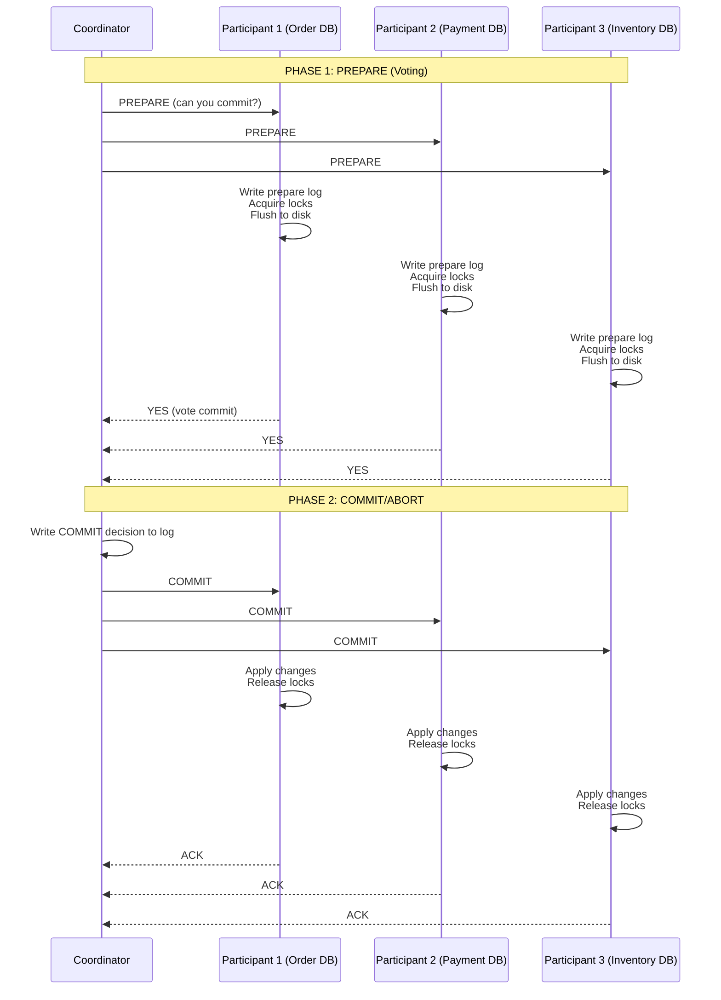
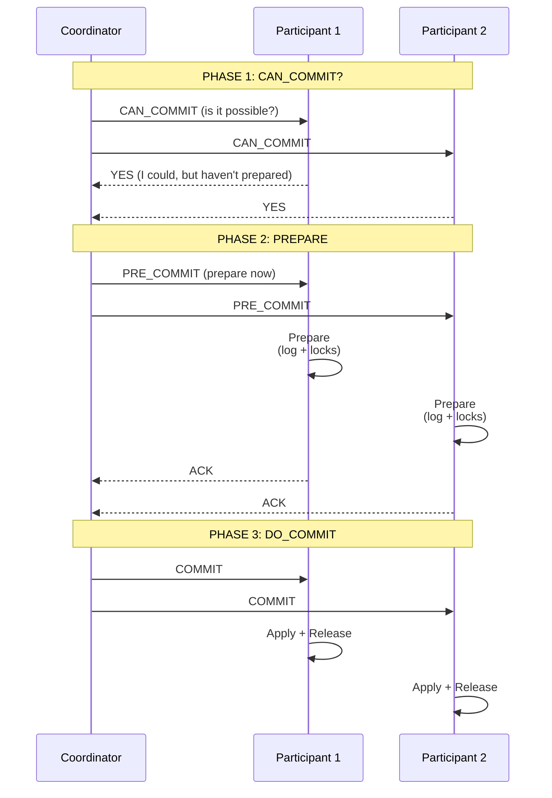
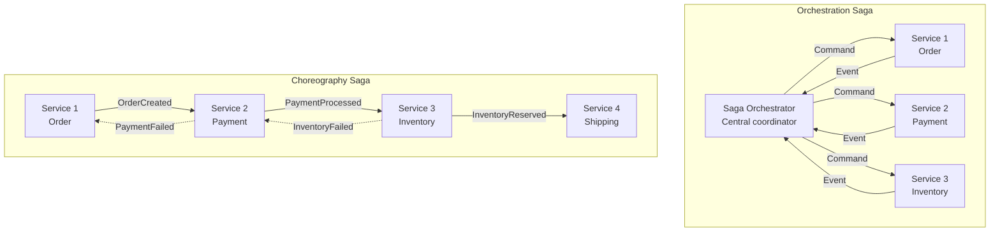
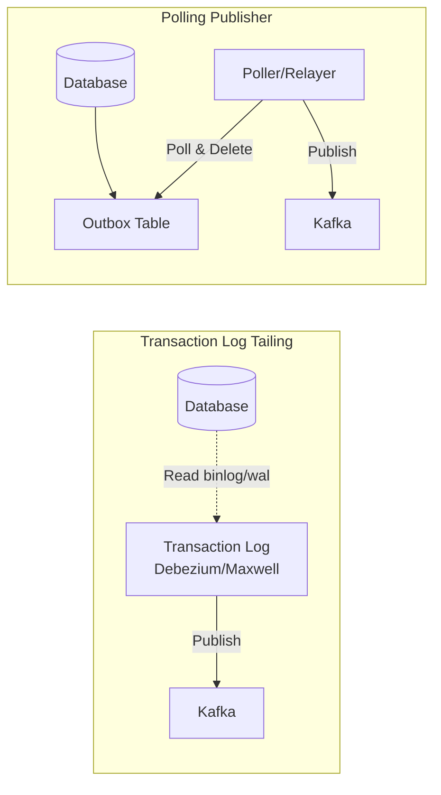

# Distributed Transactions: 2PC, 3PC, Saga Pattern, Outbox Pattern

## 1. Mục tiêu của Task

Hiểu sâu bản chất giao dịch phân tán (distributed transactions) - tại sao cần chúng, các cơ chế đảm bảo tính nhất quán dữ liệu xuyên suốt nhiều service/database, trade-off giữa các pattern, và cách vận hành thực tế trong production.

> **Bối cảnh thực tế:** Khi một business operation cần thay đổi dữ liệu ở 2+ nguồn (ví dụ: đặt hàng cần trừ tồn kho + tạo đơn hàng + thanh toán), làm sao đảm bảo hoặc cả 3 thành công, hoặc cả 3 rollback - trong khi network không đáng tin, database có thể crash, và service có thể restart bất cứ lúc nào?

---

## 2. Bản chất và Cơ chế Hoạt động

### 2.1. Tại sao Distributed Transaction khó?

**The CAP Theorem liên quan:**

```
┌─────────────────────────────────────────────────────────┐
│           DISTRIBUTED TRANSACTION CHALLENGE              │
├─────────────────────────────────────────────────────────┤
│                                                          │
│   Service A (Order DB)        Service B (Inventory DB)   │
│   ┌─────────────┐             ┌─────────────┐           │
│   │  BEGIN TX   │             │  BEGIN TX   │           │
│   │  INSERT     │ ───┐   ┌───>│  UPDATE     │           │
│   │  order...   │    │   │    │  stock...   │           │
│   │             │    │   │    │             │           │
│   │  COMMIT?    │<───┘   └───?│  COMMIT?    │           │
│   └─────────────┘   Network   └─────────────┘           │
│        │              │            │                    │
│        └──────────────┴────────────┘                    │
│                     Unreliable                           │
│                                                          │
│   PROBLEM: Nếu A commit thành công, B fail ->           │
│   Order tồn tại nhưng không trừ được tồn kho             │
└─────────────────────────────────────────────────────────┘
```

**Vấn đề cốt lõi:**
1. **Network Partition:** Không biết bên kia đã commit hay chưa
2. **Partial Failure:** Một bên thành công, một bên thất bại
3. **Durability vs Availability:** Đợi confirm lâu -> timeout -> ?
4. **Coordinator Failure:** Node điều phối crash giữa chừng

### 2.2. The Two-Phase Commit (2PC)

**Bản chất:** Consensus protocol đơn giản nhất - tất cả participants phải đồng ý trước khi commit.



**Tại sao cần Prepare Phase?**

```
┌────────────────────────────────────────────────────────────┐
│  PREPARE PHASE - "Point of No Return" Guarantee             │
├────────────────────────────────────────────────────────────┤
│                                                             │
│  Khi Participant trả lờI YES:                              │
│  1. Đã ghi log prepare vào disk (crash recovery có thể     │
│     tiếp tục commit sau restart)                           │
│  2. Đã acquire tất cả locks cần thiết                      │
│  3. Đã validate constraints, đủ resource                   │
│  4. CAM KẾT: sẵn sàng commit khi nhận lệnh                  │
│                                                             │
│  => Participant KHÔNG ĐƯỢC từ chối sau khi vote YES         │
│  => Đây là "contract" quan trọng nhất của 2PC              │
│                                                             │
└────────────────────────────────────────────────────────────┘
```

**Recovery Scenarios:**

| Scenario | Participant Action | Coordinator Action |
|----------|-------------------|-------------------|
| Coordinator crash before PREPARE | Nothing (tx chưa bắt đầu) | Restart, tx timeout abort |
| Participant crash before PREPARE | Recover, no pending tx | Resend or timeout abort |
| Coordinator crash between phases | Block đợi coordinator recover | MUST recover from log |
| Participant crash after voting YES | Recovery: query coordinator fate | Respond COMMIT/ABORT |
| Coordinator crash after COMMIT | Eventually learn fate | MUST complete commit |

**Trade-off của 2PC:**

```
┌─────────────────────────────────────────────────────────────┐
│                    2PC: BLOCKING PROTOCOL                    │
├─────────────────────────────────────────────────────────────┤
│                                                              │
│   PROS:                                                      │
│   ✓ Strong consistency - ACID xuyên suốt các nodes          │
│   ✓ Đơn giản, dễ hiểu, đã được chứng minh qua thủy tinh      │
│   ✓ Không cần compensating logic phức tạp                   │
│                                                              │
│   CONS:                                                      │
│   ✗ BLOCKING - Locks giữ suốt quá trình 2PC                 │
│   ✗ Coordinator SPOF - Crash = participants block forever   │
│   ✗ Latency = 2 RTT × participants + disk writes            │
│   ✗ Throughput giảm vì lock contention                      │
│                                                              │
│   Block Duration = Network latency × 2 + Disk I/O × N        │
│   = Thường 100ms-500ms hoặc hơn nếu coordinator chậm        │
│                                                              │
└─────────────────────────────────────────────────────────────┘
```

### 2.3. The Three-Phase Commit (3PC)

**Bản chất:** Thêm phase CAN_COMMIT để giảm blocking window, coordinator không thể unilaterally decide sau khi nhận YES.



**Tại sao 3PC "non-blocking"?**

```
┌──────────────────────────────────────────────────────────────┐
│              3PC NON-BLOCKING GUARANTEE                       │
├──────────────────────────────────────────────────────────────┤
│                                                               │
│  Nếu coordinator crash:                                       │
│                                                               │
│  Scenario 1: Trước PRE_COMMIT                               │
│  - Participants chưa prepare, có thể unilaterally abort      │
│  - Timeout -> abort is safe                                  │
│                                                               │
│  Scenario 2: Sau PRE_COMMIT (đã nhận PRE_COMMIT)              │
│  - Participants đã prepare và có thể contact nhau           │
│  - Nếu majority đã PRE_COMMIT -> commit                      │
│  - Nếu không thấy evidence -> abort                          │
│                                                               │
│  KEY INSIGHT: Sau PRE_COMMIT, participants có thể            │
│  quyết định fate bằng consensus với nhau, không cần         │
│  coordinator!                                                 │
│                                                               │
└──────────────────────────────────────────────────────────────┘
```

**Trade-off 3PC:**

| Aspect | 2PC | 3PC |
|--------|-----|-----|
| Network Rounds | 2 | 3 |
| Blocking Risk | Cao (coordinator SPOF) | Thấp hơn |
| Complexity | Đơn giản | Phức tạp hơn |
| Latency | Thấp hơn | Cao hơn ~50% |
| Message Count | 4N | 6N |
| Real-world Usage | JDBC, XA, many DBs | Rarely used! |

> **Quan trọng:** 3PC hầu như không được dùng trong production thực tế. Tại sao? Vì nó phức tạp hơn nhưng không giải quyết được vấn đề fundamental: network partition có thể khiến "non-blocking" trở thành inconsistent. FLP impossibility result cho thấy không có deterministic consensus algorithm nào hoạt động được trong asynchronous system với even one faulty process.

### 2.4. Saga Pattern

**Bản chất:** Chuyển từ "đợi tất cả sẵn sàng rồi commit" sang "thực hiện tuần tự, rollback bằng compensation".

```
┌─────────────────────────────────────────────────────────────┐
│                    SAGA: LONG-RUNNING TX                     │
├─────────────────────────────────────────────────────────────┤
│                                                              │
│  2PC mindset: "Tất cả phải đồng ý trước khi làm"             │
│  Saga mindset: "Làm ngay, nếu sai thì sửa lại sau"           │
│                                                              │
│  Local TX 1 ──> Local TX 2 ──> Local TX 3 ──> ...           │
│      │             │             │                          │
│      ▼             ▼             ▼                          │
│   Compensate   Compensate   Compensate  (if needed)         │
│      │             │             │                          │
│      ▼             ▼             ▼                          │
│  UNDO TX 1    UNDO TX 2    UNDO TX 3                        │
│                                                              │
│  Mỗi step là local transaction độc lập, đã commit!          │
│  Compensation = business logic revert, không phải DB rollback│
│                                                              │
└─────────────────────────────────────────────────────────────┘
```

**Orchestration vs Choreography:**



**So sánh Orchestration vs Choreography:**

| Criteria | Orchestration | Choreography |
|----------|---------------|--------------|
| **Control** | Centralized (Orchestrator) | Decentralized (Event-driven) |
| **Visibility** | Dễ trace, log ở một nơi | Phân tán, cần distributed tracing |
| **Coupling** | Services chỉ biết orchestrator | Services biết nhau qua events |
| **Complexity** | Orchestrator thành SPOF, phức tạp | Logic phân tán, khó debug |
| **Rollback** | Orchestrator điều phối compensation | Mỗi service tự biết compensate |
| **Best for** | Complex flows, cần visibility | Simple flows, loose coupling |

**Ví dụ Order Saga:**

```
┌─────────────────────────────────────────────────────────────────┐
│                    ORDER SAGA FLOW                              │
├─────────────────────────────────────────────────────────────────┤
│                                                                  │
│  SUCCESS PATH:                                                   │
│  ┌──────────┐    ┌────────────┐    ┌────────────┐    ┌────────┐ │
│  │  CREATE  │───>│   RESERVE  │───>│  PROCESS   │───>│ SHIP   │ │
│  │  ORDER   │    │  INVENTORY │    │  PAYMENT   │    │ ORDER  │ │
│  │  $100    │    │   -$100    │    │   -$100    │    │        │ │
│  └──────────┘    └────────────┘    └────────────┘    └────────┘ │
│       │               │                 │              │        │
│       ▼               ▼                 ▼              ▼        │
│    OrderId=1      Stock-1            Charged        Shipped     │
│    Status=PENDING Status=RESERVED    Status=PAID   Status=DONE  │
│                                                                  │
│  FAILURE PATH (Payment thất bại):                                │
│                                                                  │
│  CREATE ORDER ──> RESERVE INVENTORY ──> PROCESS PAYMENT (FAIL)  │
│       │               │                      │                   │
│       ▼               ▼                      ▼                   │
│    Keep order    RELEASE INVENTORY      (nothing to undo)        │
│    Status=FAIL   Status=AVAILABLE                                │
│                                                                  │
│  Compensation actions:                                           │
│  - releaseInventory(orderId)  -> inventory +1                    │
│  - cancelOrder(orderId)       -> order status = CANCELLED        │
│                                                                  │
└─────────────────────────────────────────────────────────────────┘
```

**Trade-off Saga:**

```
┌───────────────────────────────────────────────────────────────┐
│                   SAGA: EVENTUAL CONSISTENCY                   │
├───────────────────────────────────────────────────────────────┤
│                                                                │
│  PROS:                                                         │
│  ✓ Không cần distributed locks - mỗi service xử lý local      │
│  ✓ Không blocking - throughput cao hơn nhiều                  │
│  ✓ Service autonomy - không phụ thuộc coordinator             │
│  ✓ Dễ scale horizontally                                       │
│  ✓ Phù hợp microservices architecture                          │
│                                                                │
│  CONS:                                                         │
│  ✗ Eventual consistency - có thể nhìn thấy trạng thái "lỗi"   │
│  ✗ Compensation phức tạp, đôi khi impossible (email đã gửi)   │
│  ✗ Debugging khó khăn - trace xuyên suốt nhiều services       │
│  ✗ Risk of cascading compensations                             │
│  ✗ Partial execution visible to users                          │
│                                                                │
│  ISOLATION PROBLEM:                                            │
│  - T1: Step 1 (Order created, chưa payment)                    │
│  - T2: Query tổng doanh thu -> thấy order nhưng chưa có tiền  │
│  => "Dirty read" across saga boundaries                        │
│                                                                │
└───────────────────────────────────────────────────────────────┘
```

### 2.5. Outbox Pattern

**Bản chất:** Giải quyết "dual write problem" - làm sao ghi database và publish message đều thành công, hoặc đều thất bại.

**The Problem:**

```
┌──────────────────────────────────────────────────────────────┐
│               THE DUAL WRITE PROBLEM                          │
├──────────────────────────────────────────────────────────────┤
│                                                               │
│  Anti-pattern (RISKY):                                        │
│  ┌─────────────┐         ┌─────────────┐                     │
│  │   UPDATE    │         │   PUBLISH   │                     │
│  │   Order DB  │         │   Kafka     │                     │
│  └─────────────┘         └─────────────┘                     │
│        │                      │                              │
│        ▼                      ▼                              │
│   ACID commit              Network call                     │
│   (reliable)               (unreliable)                     │
│                                                               │
│  Scenarios:                                                   │
│  1. DB commit OK, Kafka fail -> DB updated, no event        │
│  2. Kafka OK, DB rollback -> Event sent, no data change     │
│  3. Crash between 1 & 2 -> Inconsistent state               │
│                                                               │
│  => Không có cách nào đảm bảo cả 2 đều thành công!          │
│                                                               │
└──────────────────────────────────────────────────────────────┘
```

**Outbox Pattern Solution:**

```
┌──────────────────────────────────────────────────────────────┐
│                    OUTBOX PATTERN                             │
├──────────────────────────────────────────────────────────────┤
│                                                               │
│  DATABASE (Single ACID Transaction)                           │
│  ┌─────────────────────────────────────────────────────┐    │
│  │  orders table          │  outbox table              │    │
│  │  ──────────────────────┼──────────────────────────  │    │
│  │  id: 123               │  id: 456                   │    │
│  │  status: PAID          │  topic: order_events       │    │
│  │  amount: 100           │  key: 123                  │    │
│  │  ...                   │  payload: {...}            │    │
│  │                        │  created_at: NOW()         │    │
│  └─────────────────────────────────────────────────────┘    │
│                           │                                   │
│                           │  SAME TRANSACTION               │
│                           ▼                                   │
│                     COMMIT (atomic)                          │
│                                                               │
│  Relayer/Poller          │         Message Queue            │
│  ┌────────────────┐      │      ┌─────────────────┐         │
│  │ 1. Poll outbox │──────┴─────>│  order_events   │         │
│  │ 2. Publish     │             │  topic          │         │
│  │ 3. DELETE outbox             └─────────────────┘         │
│  └────────────────┘                                          │
│                                                               │
│  Key insight: Message là "side effect" của DB write,         │
│  lưu cùng table -> cùng transaction -> atomic!               │
│                                                               │
└──────────────────────────────────────────────────────────────┘
```

**Outbox Implementation Variants:**



**So sánh Transaction Log Tailing vs Polling:**

| Approach | Pros | Cons |
|----------|------|------|
| **Transaction Log Tailing** | Near real-time, no outbox table needed, exactly-once natural | Requires DB-specific tooling (Debezium), operational complexity, parsing binary logs |
| **Polling Publisher** | Simple, generic, works with any DB | Latency = poll interval, DELETE causes write amplification, potential duplicates |

**Idempotency Requirement:**

```
┌─────────────────────────────────────────────────────────────┐
│              OUTBOX + IDEMPOTENCY KEY                        │
├─────────────────────────────────────────────────────────────┤
│                                                              │
│  Outbox pattern đảm bảo: At-least-once delivery             │
│  (Message có thể được publish 2 lần nếu relayer crash)      │
│                                                              │
│  => Consumers PHẢI implement idempotency!                    │
│                                                              │
│  Consumer logic:                                             │
│  ┌──────────────────────────────────────────────┐           │
│  │  if (processedMessages.contains(msg.id)):    │           │
│  │      return // already processed             │           │
│  │  process(msg)                                │           │
│  │  processedMessages.add(msg.id)               │           │
│  └──────────────────────────────────────────────┘           │
│                                                              │
│  Idempotency storage:                                        │
│  - In-memory (single instance only)                          │
│  - Redis (TTL-based dedup)                                   │
│  - Database (processed_events table)                         │
│                                                              │
└─────────────────────────────────────────────────────────────┘
```

---

## 3. Kiến trúc và Luồng Xử Lý

### 3.1. Decision Tree: Khi nào dùng gì?

```
┌─────────────────────────────────────────────────────────────────┐
│           DISTRIBUTED TRANSACTION DECISION TREE                  │
├─────────────────────────────────────────────────────────────────┤
│                                                                  │
│  Cần ACID xuyên suốt multiple databases?                         │
│  │                                                               │
│  ├─ YES ──> Có thể chấp nhận blocking?                          │
│  │           │                                                   │
│  │           ├─ YES ──> Có strong consistency requirement?       │
│  │           │           │                                       │
│  │           │           ├─ YES ──> Use 2PC (XA/JTA)            │
│  │           │           │           [Traditional, blocking]     │
│  │           │           │                                       │
│  │           │           └─ NO ───> Reconsider: Really need ACID?│
│  │           │                                                   │
│  │           └─ NO ───> Use Saga Pattern                        │
│  │                       [Eventual consistency, async]          │
│  │                                                               │
│  └─ NO ───> Chỉ cần đảm bảo DB + Message consistency?           │
│              │                                                   │
│              └─ YES ──> Use Outbox Pattern                       │
│                          [At-least-once delivery]               │
│                                                                  │
│  MODERN CLOUD-NATIVE DEFAULT: Saga + Outbox                      │
│  TRADITIONAL ENTERPRISE: 2PC với XA                              │
│                                                                  │
└─────────────────────────────────────────────────────────────────┘
```

### 3.2. Microservices Transaction Architecture

```
┌────────────────────────────────────────────────────────────────────┐
│           TYPICAL MICROSERVICES TX ARCHITECTURE                     │
├────────────────────────────────────────────────────────────────────┤
│                                                                     │
│  ┌──────────────┐                                                  │
│  │   API GW     │                                                  │
│  └──────┬───────┘                                                  │
│         │ HTTP/REST                                                 │
│         ▼                                                           │
│  ┌─────────────────────────────────────────────────────────┐       │
│  │              SAGA ORCHESTRATOR                           │       │
│  │  (Camunda/Temporal/AWS Step Functions/Custom)            │       │
│  │                                                          │       │
│  │  - State machine management                              │       │
│  │  - Compensation logic                                    │       │
│  │  - Retry policies                                        │       │
│  │  - Timeout handling                                      │       │
│  └─────────┬─────────────────────────────┬─────────────────┘       │
│            │                             │                         │
│            ▼                             ▼                         │
│  ┌──────────────────┐         ┌──────────────────┐                │
│  │   Order Service  │         │ Payment Service  │                │
│  │  ┌────────────┐  │         │  ┌────────────┐  │                │
│  │  │ Order DB   │  │         │  │ Payment DB │  │                │
│  │  │ + Outbox   │  │         │  │ + Outbox   │  │                │
│  │  └────────────┘  │         │  └────────────┘  │                │
│  └─────────┬────────┘         └─────────┬────────┘                │
│            │                            │                          │
│            └────────────┬───────────────┘                          │
│                         │                                          │
│                         ▼                                          │
│                  ┌──────────────┐                                  │
│                  │    Kafka     │  (Event Bus)                     │
│                  └──────────────┘                                  │
│                         │                                          │
│                         ▼                                          │
│              ┌────────────────────┐                               │
│              │  Inventory Service │                               │
│              └────────────────────┘                               │
│                                                                     │
│  KEY PATTERNS:                                                      │
│  - Saga: Cross-service coordination                                 │
│  - Outbox: Service-internal DB+message consistency                  │
│  - Idempotency: Consumer deduplication                              │
│                                                                     │
└────────────────────────────────────────────────────────────────────┘
```

---

## 4. So sánh Chi tiết

### 4.1. 2PC vs Saga Pattern

| Aspect | 2PC | Saga Pattern |
|--------|-----|--------------|
| **Consistency** | Strong (ACID) | Eventual |
| **Isolation** | Serializable | Read uncommitted (within saga) |
| **Latency** | High (blocking) | Low (async) |
| **Throughput** | Limited by lock duration | High (no distributed locks) |
| **Failure Recovery** | Automatic rollback | Compensation logic |
| **Complexity** | Protocol complexity | Business logic complexity |
| **Use Case** | Financial transactions, inventory | E-commerce, booking systems |
| **Monitoring** | Coordinator state | Distributed tracing required |
| **Java Implementation** | JTA, Atomikos, Narayana | Camunda, Temporal, custom |

### 4.2. Orchestration vs Choreography Saga

```
┌─────────────────────────────────────────────────────────────────────┐
│              ORCHESTRATION vs CHOREOGRAPHY                          │
├─────────────────────────────────────────────────────────────────────┤
│                                                                      │
│  Orchestration ("Conductor pattern"):                               │
│  ┌─────────────────────────────────────────────────────────────┐   │
│  │  Orchestrator biết toàn bộ flow:                             │   │
│  │  1. Gọi Service A (order)                                   │   │
│  │  2. Nếu OK, gọi Service B (payment)                         │   │
│  │  3. Nếu OK, gọi Service C (inventory)                       │   │
│  │  4. Nếu fail ở bước 3, gọi compensate cho B, rồi A          │   │
│  │                                                              │   │
│  │  + Dễ thay đổi flow (chỉ sửa orchestrator)                  │   │
│  │  + Dễ monitor (state tập trung)                             │   │
│  │  - Orchestrator thành SPOF                                  │   │
│  │  - Services coupled to orchestrator                         │   │
│  └─────────────────────────────────────────────────────────────┘   │
│                                                                      │
│  Choreography ("Event-driven"):                                     │
│  ┌─────────────────────────────────────────────────────────────┐   │
│  │  Mỗi service tự quyết định dựa trên events:                  │   │
│  │  - OrderService: tạo order -> publish OrderCreated          │   │
│  │  - PaymentService: listen OrderCreated -> process -> publish│   │
│  │  - InventoryService: listen PaymentProcessed -> reserve     │   │
│  │                                                              │   │
│  │  + Loose coupling (services không biết nhau)                │   │
│  │  + Natural event-sourcing                                   │   │
│  │  - Khó biết tổng thể flow (phân tán)                        │   │
│  │  - Debugging khó khăn                                       │   │
│  └─────────────────────────────────────────────────────────────┘   │
│                                                                      │
│  HYBRID APPROACH (Recommended):                                     │
│  - Orchestration cho complex flows (booking, checkout)              │
│  - Choreography cho simple notifications (email, audit)             │
│                                                                      │
└─────────────────────────────────────────────────────────────────────┘
```

---

## 5. Rủi ro, Anti-patterns, và Lỗi Thường Gặp

### 5.1. 2PC/3PC Anti-patterns

```
┌─────────────────────────────────────────────────────────────────┐
│                    2PC ANTI-PATTERNS                             │
├─────────────────────────────────────────────────────────────────┤
│                                                                  │
│  ❌ ANTI-PATTERN 1: Coordinator không persistent                 │
│     - Coordinator crash = participants block forever            │
│     => Coordinator PHẢI log tất cả quyết định vào disk          │
│                                                                  │
│  ❌ ANTI-PATTERN 2: Long-running transactions                   │
│     - Locks giữ lâu = deadlock, starvation                      │
│     => 2PC chỉ cho transactions < 100ms                          │
│                                                                  │
│  ❌ ANTI-PATTERN 3: Too many participants                        │
│     - 2PC latency = O(n), n>10 rất chậm                         │
│     => Tối đa 3-5 participants                                   │
│                                                                  │
│  ❌ ANTI-PATTERN 4: Blocking on coordinator unavailable          │
│     - Không implement timeout recovery                          │
│     => Participant phải có logic để hỏi lại coordinator         │
│                                                                  │
│  ❌ ANTI-PATTERN 5: Mixing 2PC with non-XA resources             │
│     - Message queue không XA = không rollback được              │
│     => Chỉ dùng 2PC khi tất cả resources support XA             │
│                                                                  │
└─────────────────────────────────────────────────────────────────┘
```

### 5.2. Saga Pattern Pitfalls

```
┌─────────────────────────────────────────────────────────────────┐
│                    SAGA PITFALLS                                 │
├─────────────────────────────────────────────────────────────────┤
│                                                                  │
│  ⚠️ PITFALL 1: Compensation không idempotent                    │
│      - Compensation chạy 2 lần -> data corruption               │
│      => Compensation PHẢI kiểm tra trạng thái trước khi làm     │
│                                                                  │
│  ⚠️ PITFALL 2: Compensation failure                            │
│      - Compensate cũng có thể fail!                             │
│      => Cần manual intervention, alerting, retry queue          │
│                                                                  │
│  ⚠️ PITFALL 3: Cascading compensations                         │
│      - A -> B -> C fail -> compensate B -> compensate A         │
│      - Nếu compensate A fail khi đang compensate B...           │
│      => Cần saga timeout, max retry, dead letter queue          │
│                                                                  │
│  ⚠️ PITFALL 4: "Ghost" reads within saga                        │
│      - User thấy order PAID nhưng chưa có shipping              │
│      => UI patterns: pending states, optimistic UI              │
│                                                                  │
│  ⚠️ PITFALL 5: Forgetting semantic locking                      │
│      - Saga chạy song song trên cùng resource                   │
│      => Cần application-level locking (version, status)         │
│                                                                  │
│  ⚠️ PITFALL 6: Infinite loops in choreography                   │
│      - Event A triggers B, B triggers A again                   │
│      => Event design phải có clear termination                  │
│                                                                  │
└─────────────────────────────────────────────────────────────────┘
```

### 5.3. Outbox Pattern Edge Cases

```
┌─────────────────────────────────────────────────────────────────┐
│                    OUTBOX EDGE CASES                             │
├─────────────────────────────────────────────────────────────────┤
│                                                                  │
│  🚨 EDGE CASE 1: Relayer publish thành công, DELETE fail        │
│      - DB rollback? Không, vì transaction đã commit             │
│      - => Duplicate message (at-least-once)                     │
│      - Consumer PHẢI idempotent                                 │
│                                                                  │
│  🚨 EDGE CASE 2: Relayer crash sau publish, trước DELETE        │
│      - Sau restart: publish lại message đã gửi                  │
│      - => Duplicate message                                     │
│                                                                  │
│  🚨 EDGE CASE 3: Message quá lớn cho outbox table               │
│      - CLOB/BLOB performance issues                             │
│      - => Lưu reference/pointer trong outbox, data ở object store│
│                                                                  │
│  🚨 EDGE CASE 4: Clock skew giữa services                       │
│      - created_at timestamps không đồng bộ                      │
│      - => Dùng DB server time hoặc logical timestamps           │
│                                                                  │
│  🚨 EDGE CASE 5: Transaction log tailing misses events          │
│      - Debezium down, binlog rotated                            │
│      - => Monitoring, alerts, snapshot recovery                 │
│                                                                  │
└─────────────────────────────────────────────────────────────────┘
```

---

## 6. Khuyến nghị Thực chiến trong Production

### 6.1. When to Use What

```
┌────────────────────────────────────────────────────────────────────┐
│              PRODUCTION DECISION GUIDE                              │
├────────────────────────────────────────────────────────────────────┤
│                                                                     │
│  ✅ DÙNG 2PC (XA/JTA) KHI:                                          │
│     - Legacy system integration                                     │
│     - All resources là relational databases                         │
│     - Strong ACID requirement (financial core)                      │
│     - Transaction duration < 100ms                                  │
│     - Max 3-4 participants                                          │
│                                                                     │
│  ✅ DÙNG SAGA ORCHESTRATION KHI:                                    │
│     - Complex business flows (booking, checkout)                    │
│     - Cần visibility và control                                     │
│     - Compensation logic phức tạp                                   │
│     - Dùng Camunda, Temporal, AWS Step Functions                    │
│                                                                     │
│  ✅ DÙNG SAGA CHOREOGRAPHY KHI:                                     │
│     - Simple notification flows                                     │
│     - Loose coupling là ưu tiên cao nhất                            │
│     - Team đủ mature với event-driven                               │
│     - Có distributed tracing infrastructure                         │
│                                                                     │
│  ✅ DÙNG OUTBOX KHI:                                                │
│     - Bất kỳ service nào publish events từ DB writes                │
│     - Không muốn dùng CDC tools phức tạp                            │
│     - Cần đảm bảo message không bị miss                             │
│                                                                     │
│  ❌ KHÔNG DÙNG 3PC:                                                 │
│     - Quá phức tạp, không được chứng minh trong production          │
│     - FLP impossibility vẫn áp dụng                                 │
│                                                                     │
└────────────────────────────────────────────────────────────────────┘
```

### 6.2. Monitoring & Observability

```
┌────────────────────────────────────────────────────────────────────┐
│              DISTRIBUTED TRANSACTION MONITORING                     │
├────────────────────────────────────────────────────────────────────┤
│                                                                     │
│  Metrics cần track:                                                 │
│  ┌──────────────────────────────────────────────────────────────┐ │
│  │  2PC:                                                         │ │
│  │  - coordinator_decision_time (p50, p99)                      │ │
│  │  - participant_block_duration                               │ │
│  │  - in_doubt_transaction_count                               │ │
│  │  - coordinator_recovery_time                                │ │
│  │                                                               │ │
│  │  Saga:                                                        │ │
│  │  - saga_completion_time (success vs failure)                │ │
│  │  - compensation_execution_count                              │ │
│  │  - compensation_failure_rate                                 │ │
│  │  - saga_timeout_count                                        │ │
│  │  - step_retry_count                                          │ │
│  │                                                               │ │
│  │  Outbox:                                                      │ │
│  │  - outbox_table_size (alert if > 1000)                       │ │
│  │  - relayer_lag_seconds                                       │ │
│  │  - publish_failure_rate                                      │ │
│  │  - message_age_in_outbox (p95, p99)                          │ │
│  └──────────────────────────────────────────────────────────────┘ │
│                                                                     │
│  Tracing: Mỗi distributed transaction PHẢI có trace ID xuyên suốt  │
│  - OpenTelemetry span cho mỗi saga step                           │
│  - Baggage propagation giữa các services                          │
│                                                                     │
│  Alerting:                                                          │
│  - Compensation failure > 0 trong 5 phút -> PAGE                    │
│  - Outbox lag > 30 giây -> WARNING                                  │
│  - 2PC in-doubt transactions tồn tại > 1 phút -> CRITICAL           │
│                                                                     │
└────────────────────────────────────────────────────────────────────┘
```

### 6.3. Java Implementation Stack

```
┌────────────────────────────────────────────────────────────────────┐
│              RECOMMENDED JAVA STACK                                 │
├────────────────────────────────────────────────────────────────────┤
│                                                                     │
│  2PC (Traditional):                                                 │
│  - JTA (Java Transaction API)                                     │
│  - Atomikos (open source TM)                                      │
│  - Narayana (JBoss TM)                                            │
│  - Spring JTA support                                             │
│                                                                     │
│  Saga Orchestration:                                                │
│  - Camunda (BPMN, open source)                                    │
│  - Temporal (developer-friendly, durable execution)               │
│  - Apache Camel Saga                                              │
│  - Netflix Conductor                                              │
│                                                                     │
│  Saga Choreography:                                                 │
│  - Spring Cloud Stream + Kafka                                    │
│  - Axon Framework (CQRS + Event Sourcing)                         │
│                                                                     │
│  Outbox Pattern:                                                    │
│  - Debezium (CDC, Kafka Connect)                                  │
│  - Spring Outbox Pattern (custom implementation)                  │
│  - Outbox Relay (polling approach)                                │
│                                                                     │
│  Modern Cloud-Native:                                               │
│  - Dapr (distributed application runtime, has saga, outbox)       │
│  - AWS Step Functions (managed orchestration)                     │
│  - Azure Durable Functions                                        │
│                                                                     │
└────────────────────────────────────────────────────────────────────┘
```

---

## 7. Kết luận

**Bản chất cốt lõi:**

Distributed transactions không có giải pháp "hoàn hảo". Mỗi pattern là một trade-off giữa consistency, availability, và complexity.

```
┌─────────────────────────────────────────────────────────────────┐
│                     THE FUNDAMENTAL TRUTH                        │
├─────────────────────────────────────────────────────────────────┤
│                                                                  │
│  2PC = Strong consistency + Blocking + Complexity                │
│       (Dùng khi cần ACID, chấp nhận trade-off)                  │
│                                                                  │
│  Saga = Eventual consistency + Non-blocking + Compensation       │
│       (Dùng cho microservices, cloud-native)                    │
│                                                                  │
│  Outbox = Message reliability + At-least-once + Idempotency      │
│       (Bắt buộc cho mọi event-driven architecture)              │
│                                                                  │
│  Rule of thumb:                                                  │
│  - Legacy/Financial: 2PC + XA                                    │
│  - Microservices: Saga + Outbox                                  │
│  - Never: 3PC (quá phức tạp, ít value)                          │
│                                                                  │
└─────────────────────────────────────────────────────────────────┘
```

**Key Takeaways:**

1. **2PC** vẫn có giá trị trong legacy systems nhưng không phù hợp cloud-native scale
2. **Saga Pattern** là default choice cho microservices - chấp nhận eventual consistency
3. **Outbox Pattern** là requirement cho bất kỳ event-driven system nào
4. **Compensation** trong Saga khó hơn nhiều so với rollback - design cẩn thận
5. **Idempotency** là non-negotiable cho mọi consumer trong distributed system
6. **Monitoring** distributed transactions khó hơn local transactions rất nhiều - invest vào tracing

**Modern Java (21+) Considerations:**
- Virtual Threads giúp Saga choreography dễ implement hơn ( Structured Concurrency)
- Records giúp event contracts type-safe hơn
- Pattern matching cho state machine trong Saga
- Foreign Function & Memory API cho high-performance message passing (khi cần)
