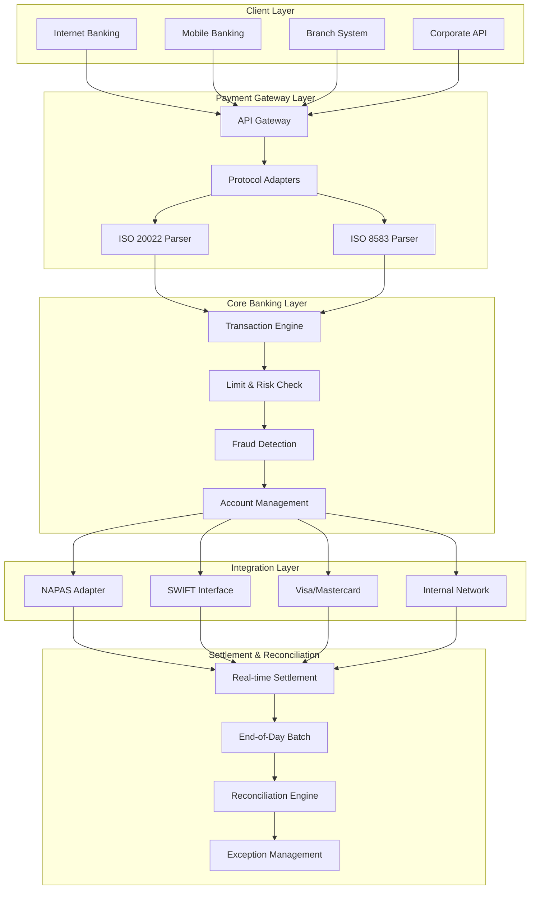

# Core Banking Integration Patterns

> **Mục tiêu:** Thấu hiểu kiến trúc tích hợp hệ thống ngân hàng lõi, các chuẩn messaging hiện đại, và patterns đảm bảo tính toàn vẹn giao dịch trong môi trường high-value transfers.

---

## 1. Mục tiêu của Task

Task này nghiên cứu các pattern tích hợp hệ thống ngân hàng lõi (Core Banking), tập trung vào:
- Chuẩn messaging **ISO 20022** và quá trình migration từ SWIFT MT sang MX
- Tích hợp **payment gateways** (NAPAS, Visa, Mastercard)
- Đảm bảo **transaction integrity** trong giao dịch giá trị cao
- Các quy trình **reconciliation** và **end-of-day batch processing**

---

## 2. Bản Chất và Cơ Chế Hoạt Động

### 2.1 ISO 20022: Kiến Trúc Messaging Thế Hệ Mới

#### Bản Chất Cơ Chế

ISO 20022 không chỉ là một định dạng message mà là **mô hình ngôn ngữ kinh doanh chuẩn hóa** (Standard Business Language Model):

```
┌─────────────────────────────────────────────────────────────────┐
│                    ISO 20022 METHODOLOGY                        │
├─────────────────────────────────────────────────────────────────┤
│                                                                   │
│   Business Layer          │   Logical Layer         │   Physical│
│   (Business Concepts)     │   (Message Concepts)    │   Layer   │
│                           │                         │           │
│   • Business Processes    │   • Business Components │   • XML   │
│   • Business Roles        │   • Message Definitions │   • JSON  │
│   • Business Activities   │   • Data Types          │   • ASN.1 │
│                           │                         │           │
└─────────────────────────────────────────────────────────────────┘
```

**Cơ chế hoạt động tầng thấp:**

1. **Business Model Repository**: ISO 20022 sử dụng **UML-based metamodel** với 4 loại building blocks:
   - **Business Roles**: Ai tham gia (Debtor, Creditor, Intermediary)
   - **Business Processes**: Hoạt động gì (Payment Initiation, Securities Settlement)
   - **Business Activities**: Chi tiết từng bước
   - **Business Entities**: Dữ liệu nào được trao đổi

2. **Message Set Derivation**: Từ business model, các message được derived theo pattern:
   ```
   Business Component → Message Component → Message Element
   ```

3. **Syntax Binding**: Message logical được binding sang physical formats (XML Schema, JSON Schema)

#### Vì Sao Thiết Kế Như Vậy?

| Design Goal | How ISO 20022 Addresses It |
|-------------|---------------------------|
| **Interoperability** | Business model độc lập với syntax, cho phép multiple serialization formats |
| **Extensibility** | Extension mechanism qua `SupplementaryData` elements mà không break backward compatibility |
| **Rich Data** | Structured remittance info, purpose codes, LEI (Legal Entity Identifier), giảm manual intervention |
| **Straight-Through Processing (STP)** | Machine-readable data model giảm tỷ lệ repair từ 10-15% xuống <1% |

#### Trade-off Quan Trọng

```
┌────────────────────────────────────────────────────────────────┐
│ ISO 20022 DESIGN TRADE-OFFS                                    │
├────────────────────────────────────────────────────────────────┤
│                                                                │
│  Richness    ◄───────────────────────────────►   Performance   │
│     │                                              │          │
│     │  • XML verbosity ↑ message size ↑           │          │
│     │  • Deep nesting ↑ parsing complexity        │          │
│     │  • Validation overhead ↑ processing time    │          │
│     │                                              │          │
│     ▼                                              ▼          │
│  JSON alternative cho high-volume internal traffic             │
│  ASN.1 cho ultra-low-latency scenarios                         │
└────────────────────────────────────────────────────────────────┘
```

> **Lưu ý quan trọng:** ISO 20022 XML messages thường lớn gấp 3-5 lần SWIFT MT equivalents. Điều này ảnh hưởng đến bandwidth, storage, và processing latency.

---

### 2.2 SWIFT MT → MX Migration: Cơ Chế và Thách Thức

#### Cơ Chế Migration

Migration từ SWIFT MT (Message Type) sang MX (Message XML) không phải là simple format conversion mà là **business process transformation**:

```
MT Message Structure          MX Message Structure
─────────────────────        ─────────────────────

Basic Header Block           Header (Business Application Header)
│── Session Number           │── From: Financial Institution
│── Sequence Number          │── To: Financial Institution
│── Session & Sequence       │── Business Message Identifier
                              │── Creation Date/Time
                              │── Duplicate indicators
                              
Application Header Block     Document (Business Message)
│── Message Type             │── Root Element (e.g., pacs.008)
│── Destination Address      │── Nested Business Components
│── Priority                 │── Structured Data Elements
│── Delivery Monitoring      │── Extension Points
                              
User Header Block            Supplementary Data (Optional)
│── Service Identifier       │── Custom extensions
│── Validation Flag          
│── Message User Reference   
                              
Text Block                   Structured Business Data
│── Fixed-width fields       │── Typed elements
│── Limited character set    │── Unicode support
│── Minimal validation       │── Schema validation
```

#### Mapping Complexity

| Aspect | SWIFT MT | SWIFT MX (ISO 20022) | Migration Challenge |
|--------|----------|---------------------|---------------------|
| **Addressing** | BIC 8/11 characters | BICFI + LEI + Other identifiers | Identifier enrichment |
| **Amounts** | Single amount field | Amount + Currency + Exchange Rate + Charge info | Data granularity ↑ |
| **Parties** | Limited party fields | Unlimited party chain with role codes | Party resolution |
| **References** | 16-character limit | Unlimited structured references | Reference migration |
| **Purpose** | Free text (4×35 chars) | Structured purpose codes | Purpose code mapping |

#### Coexistence Strategy (CBPR+ - Cross-Border Payments and Reporting Plus)

```
┌─────────────────────────────────────────────────────────────────┐
│                    CBPR+ ARCHITECTURE                           │
├─────────────────────────────────────────────────────────────────┤
│                                                                  │
│   ┌─────────────┐                    ┌─────────────┐            │
│   │   MT103     │◄─────────────────►│   pacs.008  │            │
│   │  (Legacy)   │    Translation    │(ISO 20022)  │            │
│   └──────┬──────┘    Gateway        └──────┬──────┘            │
│          │                                   │                  │
│          │    ┌─────────────────────────┐   │                  │
│          └───►│  Translation Service    │◄──┘                  │
│               │  • MyStandards (SWIFT)  │                      │
│               │  • Proprietary mappings │                      │
│               │  • Hybrid approach      │                      │
│               └─────────────────────────┘                      │
│                                                                  │
│   Coexistence Period: 2022-2025 (Extended to 2026 for some)    │
│                                                                  │
└─────────────────────────────────────────────────────────────────┘
```

> **Production Concern:** During coexistence, banks phải maintain dual-format capabilities, tăng operational complexity và cost gấp đôi.

---

### 2.3 Payment Gateway Integration Patterns

#### NAPAS (National Payment Corporation of Vietnam)

**Kiến trúc tích hợp:**

```
┌─────────────────────────────────────────────────────────────────┐
│                    NAPAS INTEGRATION ARCHITECTURE               │
├─────────────────────────────────────────────────────────────────┤
│                                                                  │
│   Member Bank                          NAPAS Network            │
│   ┌─────────────────┐                 ┌─────────────────┐       │
│   │                 │    SSL/TLS      │                 │       │
│   │  Core Banking   │◄───────────────►│  NAPAS Switch   │       │
│   │  System         │   Mutual Auth   │                 │       │
│   │                 │                 └────────┬────────┘       │
│   └────────┬────────┘                          │                │
│            │                                   │                │
│   ┌────────▼────────┐                 ┌────────▼────────┐       │
│   │   NAPAS         │                 │   Other Member  │       │
│   │   Interface     │                 │   Banks         │       │
│   │                 │                 │                 │       │
│   │ • ISO 8583      │                 └─────────────────┘       │
│   │ • XML (new)     │                                           │
│   │ • REST API      │                 Services:                 │
│   │ • MQ/Socket     │                 • NAPAS 24/7              │
│   └─────────────────┘                 • NAPAS FastPay           │
│                                       • Bill Payment            │
│                                       • QR Payment              │
│                                       • Mobile Payment          │
│                                                                  │
└─────────────────────────────────────────────────────────────────┘
```

**NAPAS ISO 8583 Message Flow:**

```
┌────────────┐     ┌────────────┐     ┌────────────┐     ┌────────────┐
│   Originator│     │  Acquiring │     │   NAPAS    │     │  Issuing   │
│   (Customer)│────►│   Bank     │────►│   Switch   │────►│   Bank     │
│             │     │            │     │            │     │            │
└────────────┘     └────────────┘     └────────────┘     └────────────┘
      │                   │                  │                  │
      │                   │  MTI 0200        │                  │
      │                   │  (Request)       │                  │
      │                   │ ───────────────► │                  │
      │                   │                  │  MTI 0200        │
      │                   │                  │  (Routing)       │
      │                   │                  │ ───────────────► │
      │                   │                  │                  │
      │                   │                  │  MTI 0210        │
      │                   │                  │  (Response)      │
      │                   │                  │ ◄─────────────── │
      │                   │  MTI 0210        │                  │
      │                   │  (Response)      │                  │
      │                   │ ◄─────────────── │                  │
      │  Authorization    │                  │                  │
      │  Result           │                  │                  │
      │ ◄──────────────── │                  │                  │
```

**Key ISO 8583 Fields trong NAPAS:**

| Field | Name | Purpose |
|-------|------|---------|
| F002 | Primary Account Number (PAN) | Thẻ/tài khoản thanh toán |
| F003 | Processing Code | Loại giao dịch (purchase, withdrawal, transfer) |
| F004 | Transaction Amount | Số tiền giao dịch |
| F007 | Transmission Date/Time | Timestamp giao dịch |
| F011 | System Trace Audit Number (STAN) | Số trace duy nhất |
| F012-F013 | Local Transaction Date/Time | Thời gian local |
| F032 | Acquiring Institution ID | Mã ngân hàng acquirer |
| F037 | Retrieval Reference Number | Số tham chiếu retrieval |
| F038 | Authorization Code | Mã ủy quyền |
| F039 | Response Code | Mã phản hồi (00 = approved) |
| F041 | Card Acceptor Terminal ID | Mã terminal |
| F042 | Card Acceptor ID | Mã merchant |

#### Visa/Mastercard Integration

```
┌─────────────────────────────────────────────────────────────────┐
│              VISA/MASTERCARD INTEGRATION PATTERNS               │
├─────────────────────────────────────────────────────────────────┤
│                                                                  │
│   ┌──────────────────────────────────────────────────────┐      │
│   │                   ISSUER PERSPECTIVE                  │      │
│   └──────────────────────────────────────────────────────┘      │
│                                                                  │
│   Core Banking ──► Card Management ──► Payment Network          │
│      System          System (CMS)      (Visa/Mastercard)        │
│                                                                  │
│   Integration options:                                           │
│   ┌─────────────────┐  ┌─────────────────┐  ┌─────────────────┐ │
│   │  Direct Connect │  │  Processor      │  │  Gateway        │ │
│   │  (High Volume)  │  │  (Outsourced)   │  │  (Aggregator)   │ │
│   │                 │  │                 │  │                 │ │
│   │ • Visa Direct   │  │ • FIS           │  │ • Stripe        │ │
│   │ • Mastercard    │  │ • Fiserv        │  │ • Adyen         │ │
│   │   Send          │  │ • TSYS          │  │ • Checkout.com  │ │
│   │ • APIs          │  │ • Worldpay      │  │                 │ │
│   └─────────────────┘  └─────────────────┘  └─────────────────┘ │
│                                                                  │
│   ┌──────────────────────────────────────────────────────┐      │
│   │                  ACQUIRER PERSPECTIVE                 │      │
│   └──────────────────────────────────────────────────────┘      │
│                                                                  │
│   Merchant ──► POS/Payment ──► Acquirer ──► Payment Network     │
│                Gateway         Processor                         │
│                                                                  │
└─────────────────────────────────────────────────────────────────┘
```

---

### 2.4 Transaction Integrity trong High-Value Transfers

#### Bản Chất Vấn Đề

High-value transfers (HVPS - High Value Payment Systems) đòi hỏi **atomicity, consistency, isolation, durability (ACID)** mở rộng sang distributed systems:

```
┌─────────────────────────────────────────────────────────────────┐
│          DISTRIBUTED TRANSACTION INTEGRITY CHALLENGES           │
├─────────────────────────────────────────────────────────────────┤
│                                                                  │
│   ┌─────────────┐      ┌─────────────┐      ┌─────────────┐    │
│   │   Bank A    │      │   Interbank │      │   Bank B    │    │
│   │   (Debit)   │◄────►│   Network   │◄────►│   (Credit)  │    │
│   │             │      │             │      │             │    │
│   │ Account:    │      │  Settlement │      │ Account:    │    │
│   │ -$1,000,000 │      │  System     │      │ +$1,000,000 │    │
│   └─────────────┘      └─────────────┘      └─────────────┘    │
│                                                                  │
│   Failure Scenarios:                                             │
│   1. Bank A debited, network timeout, Bank B never credited     │
│   2. Double-credit due to retry without idempotency             │
│   3. Partial settlement (settlement system fails mid-batch)     │
│   4. Message tampering hoặc repudiation                         │
│                                                                  │
└─────────────────────────────────────────────────────────────────┘
```

#### Pattern 1: Two-Phase Commit (2PC) với Reservation

```
┌─────────────────────────────────────────────────────────────────┐
│              TWO-PHASE COMMIT WITH RESERVATION                  │
├─────────────────────────────────────────────────────────────────┤
│                                                                  │
│   Phase 1: PREPARE                                               │
│   ═══════════════════════════════════════════════════════       │
│   │                                                               │
│   │  Coordinator ──► Bank A: Reserve $1M (status: PENDING)        │
│   │  Coordinator ──► Bank B: Validate account can receive $1M     │
│   │                                                               │
│   │  Both participants vote YES/NO                                │
│   │                                                               │
│   Phase 2: COMMIT                                                │
│   ═══════════════════════════════════════════════════════       │
│   │                                                               │
│   │  IF all YES:                                                  │
│   │    Coordinator ──► Bank A: COMMIT (status: DEBITED)           │
│   │    Coordinator ──► Bank B: COMMIT (status: CREDITED)          │
│   │                                                               │
│   │  IF any NO:                                                   │
│   │    Coordinator ──► Bank A: ROLLBACK (release reservation)     │
│   │    Coordinator ──► Bank B: ROLLBACK                           │
│   │                                                               │
│   Recovery:                                                      │
│   • Coordinator logs tất cả quyết định                           │
│   • Participants query coordinator on recovery                    │
│   • Timeout triggers heuristic rollback                          │
│                                                                  │
└─────────────────────────────────────────────────────────────────┘
```

> **Trade-off:** 2PC đảm bảo consistency nhưng có **blocking problem** - nếu coordinator fail giữa phase 1 và 2, participants giữ locks cho đến khi coordinator recover.

#### Pattern 2: Saga Pattern cho Long-Running Transactions

```
┌─────────────────────────────────────────────────────────────────┐
│                    SAGA PATTERN                                 │
├─────────────────────────────────────────────────────────────────┤
│                                                                  │
│   Choreography-Based (Event-Driven):                            │
│   ┌──────────┐    ┌──────────┐    ┌──────────┐    ┌──────────┐ │
│   │  Debit   │───►│ Validate │───►│  FX      │───►│  Credit  │ │
│   │  Local   │    │  Fraud   │    │  Convert │    │  Local   │ │
│   │  Tx      │    │  Check   │    │          │    │  Tx      │ │
│   └──────────┘    └──────────┘    └──────────┘    └──────────┘ │
│        │               │               │               │        │
│        ▼               ▼               ▼               ▼        │
│   ┌──────────┐    ┌──────────┐    ┌──────────┐    ┌──────────┐ │
│   │  Debit   │    │  Fraud   │    │  FX      │    │  Credit  │ │
│   │  Event   │    │  Event   │    │  Event   │    │  Event   │ │
│   └──────────┘    └──────────┘    └──────────┘    └──────────┘ │
│                                                                  │
│   Compensation (nếu failure ở step N):                          │
│   ┌──────────┐    ┌──────────┐    ┌──────────┐    ┌──────────┐ │
│   │ Compensate│◄───│ Compensate│◄───│ Compensate│◄───│  FAIL    │ │
│   │  Debit    │    │  FX       │    │  N-1      │    │   at N   │ │
│   └──────────┘    └──────────┘    └──────────┘    └──────────┘ │
│                                                                  │
│   Orchestration-Based (Central Coordinator):                    │
│   ┌──────────┐                                                   │
│   │ Saga     │───► Command ──► Service A                         │
│   │          │◄──── Event ───┘                                  │
│   │Orchestrator│───► Command ──► Service B (if A success)        │
│   │          │◄──── Event ───┘                                  │
│   └──────────┘                                                   │
│                                                                  │
└─────────────────────────────────────────────────────────────────┘
```

**So sánh Saga vs 2PC:**

| Aspect | 2PC | Saga |
|--------|-----|------|
| **Consistency** | Strong (immediate) | Eventual |
| **Availability** | Reduced (locks) | High (no locks) |
| **Complexity** | Lower (infrastructure) | Higher (compensation logic) |
| **Visibility** | In-flight transactions hidden | Events expose intermediate state |
| **Use Case** | Short, critical transactions | Long-running, cross-border |

#### Pattern 3: Idempotency Keys và Deduplication

```
┌─────────────────────────────────────────────────────────────────┐
│              IDEMPOTENCY IN PAYMENT PROCESSING                  │
├─────────────────────────────────────────────────────────────────┤
│                                                                  │
│   Client Request:                                                │
│   ┌─────────────────────────────────────────────────────────┐   │
│   │ POST /transfer                                            │   │
│   │ Idempotency-Key: 550e8400-e29b-41d4-a716-446655440000     │   │
│   │                                                           │   │
│   │ {                                                         │   │
│   │   "from_account": "123456",                               │   │
│   │   "to_account": "789012",                                 │   │
│   │   "amount": 1000000,                                      │   │
│   │   "currency": "USD"                                       │   │
│   │ }                                                         │   │
│   └─────────────────────────────────────────────────────────┘   │
│                                                                  │
│   Server Processing:                                             │
│   ┌─────────────────────────────────────────────────────────┐   │
│   │ 1. Check Idempotency Store                              │   │
│   │    Key: 550e8400-e29b-41d4-a716-446655440000              │   │
│   │    Status: NOT_FOUND → Proceed                          │   │
│   │                                                         │   │
│   │ 2. Execute Transaction                                  │   │
│   │    - Debit source account                               │   │
│   │    - Credit destination account                         │   │
│   │    - Record in idempotency store: PROCESSING            │   │
│   │                                                         │   │
│   │ 3. Store Result                                         │   │
│   │    Key: 550e8400-e29b-41d4-a716-446655440000            │   │
│   │    Value: { status: COMPLETED, result: {...}, ttl: 24h }│   │
│   │                                                         │   │
│   │ 4. Return Response                                      │   │
│   └─────────────────────────────────────────────────────────┘   │
│                                                                  │
│   Retry Scenario:                                                │
│   ┌─────────────────────────────────────────────────────────┐   │
│   │ Same Idempotency-Key received                           │   │
│   │ → Lookup store: COMPLETED                               │   │
│   │ → Return cached result (no re-execution)                │   │
│   └─────────────────────────────────────────────────────────┘   │
│                                                                  │
│   TTL: Time-to-live cho idempotency keys (typical 24h)          │
│   → Prevent unlimited growth của idempotency store               │
│   → Sau TTL, same key được xử lý như mới (rare edge case)        │
│                                                                  │
└─────────────────────────────────────────────────────────────────┘
```

---

### 2.5 Reconciliation Patterns

#### NRT (Near Real-Time) vs EOD (End-of-Day)

```
┌─────────────────────────────────────────────────────────────────┐
│                  RECONCILIATION ARCHITECTURE                    │
├─────────────────────────────────────────────────────────────────┤
│                                                                  │
│   Near Real-Time Reconciliation:                                │
│   ┌──────────┐     ┌──────────┐     ┌──────────┐               │
│   │ Transaction │──►│ Event    │──►│ Real-Time│               │
│   │ Completed   │   │ Published│   │ Matcher  │               │
│   └──────────┘     └──────────┘     └────┬─────┘               │
│                                          │                       │
│                                          ▼                       │
│                                   ┌──────────────┐              │
│                                   │ Exception    │              │
│                                   │ Queue        │              │
│                                   │ (Mismatches) │              │
│                                   └──────────────┘              │
│                                                                  │
│   End-of-Day Reconciliation:                                    │
│   ┌─────────────────────────────────────────────────────────┐   │
│   │ Daily Batch Window (typically 02:00 - 06:00)            │   │
│   │                                                          │   │
│   │  ┌─────────────┐        ┌─────────────┐                │   │
│   │  │  Internal   │        │  External   │                │   │
│   │  │  Ledger     │◄──────►│  Statements │                │   │
│   │  │             │  Diff  │             │                │   │
│   │  │ • TX Log    │        │ • SWIFT MT940│                │   │
│   │  │ • Balances  │        │ • NAPAS      │                │   │
│   │  │ • Positions │        │   Settlement │                │   │
│   │  └─────────────┘        └─────────────┘                │   │
│   │                                                          │   │
│   │  Matching Criteria:                                      │   │
│   │  • Transaction ID / Reference                            │   │
│   │  • Amount + Currency                                     │   │
│   │  • Value Date                                            │   │
│   │  • Counterparty                                          │   │
│   │                                                          │   │
│   │  Discrepancy Types:                                      │   │
│   │  • Missing in internal (external has, we don't)          │   │
│   │  • Missing in external (we have, external doesn't)       │   │
│   │  • Amount mismatch                                         │   │
│   │  • Timing difference (cut-off related)                   │   │
│   └─────────────────────────────────────────────────────────┘   │
│                                                                  │
└─────────────────────────────────────────────────────────────────┘
```

---

## 3. Luồng Xử Lý Tổng Thể



---

## 4. So Sánh Các Lựa Chọn

### 4.1 Message Format Comparison

| Format | Use Case | Pros | Cons |
|--------|----------|------|------|
| **ISO 20022 XML** | Cross-border, regulatory reporting | Rich semantics, validation, extensibility | Verbose, high bandwidth |
| **ISO 20022 JSON** | Internal APIs, microservices | Compact, native web support | Less tooling, fewer standards |
| **ISO 8583** | Card networks, ATM/POS | Compact, proven, real-time | Limited data, legacy |
| **SWIFT MT** | Legacy cross-border (phasing out) | Universal adoption | Rigid, limited, deprecated |
| **FIX** | Securities trading | Industry standard for trading | Overkill for payments |

### 4.2 Integration Pattern Comparison

| Pattern | Consistency | Latency | Complexity | Best For |
|---------|-------------|---------|------------|----------|
| **Synchronous 2PC** | Strong | High | Medium | Critical, short transactions |
| **Saga (Orchestration)** | Eventual | Medium | High | Long-running, multi-step |
| **Saga (Choreography)** | Eventual | Low | Very High | Highly decoupled systems |
| **Outbox + CDC** | Eventual | Low | Medium | Event sourcing patterns |

---

## 5. Rủi Ro, Anti-Patterns, và Lỗi Thường Gặp

### 5.1 Critical Anti-Patterns

> **🚨 Anti-Pattern: "Fire and Forget"**
> 
> Gửi message mà không đợi acknowledgment hoặc không có retry mechanism. Dẫn đến silent failures và mất tiền.

> **🚨 Anti-Pattern: "Dual Write"**
> 
> Update database VÀ gửi message trong cùng một transaction không được coordinate. Có thể xảy ra một trong hai thành công, một thất bại.

> **🚨 Anti-Pattern: "Naive Retry"**
> 
> Retry failed requests mà không có idempotency keys, dẫn đến double-charging hoặc double-crediting.

### 5.2 Production Failures

| Failure | Root Cause | Mitigation |
|---------|------------|------------|
| **Message Loss** | Network partition, no persistence | Outbox pattern, durable queues |
| **Duplicate Processing** | Timeout retry, no idempotency | Idempotency keys, deduplication |
| **Ordering Violation** | Concurrent processing, race conditions | Sequence numbers, partitioning |
| **Partial Failure** | 2PC coordinator crash | Timeout-based heuristic decisions |
| **Format Drift** | Schema evolution without versioning | Schema registry, backward compatibility |

### 5.3 Security Concerns

```
┌─────────────────────────────────────────────────────────────────┐
│              PAYMENT INTEGRATION SECURITY RISKS                 │
├─────────────────────────────────────────────────────────────────┤
│                                                                  │
│   Transport Layer:                                               │
│   • Man-in-the-middle attacks → mTLS, certificate pinning       │
│   • Replay attacks → Nonce, timestamps, sequence numbers        │
│                                                                  │
│   Application Layer:                                             │
│   • Message tampering → Digital signatures (XML-Sig)            │
│   • Repudiation → Non-repudiation logs, audit trails            │
│   • Injection attacks → Input validation, parameterized queries │
│                                                                  │
│   Operational:                                                   │
│   • Credential compromise → HSM, key rotation, short-lived tokens│
│   • Insider threats → Dual control, segregation of duties       │
│                                                                  │
└─────────────────────────────────────────────────────────────────┘
```

---

## 6. Khuyến Nghị Thực Chiến trong Production

### 6.1 Architecture Guidelines

1. **Adopt ISO 20022 early** - Chuẩn này sẽ là mandatory cho cross-border từ 2026. Plan migration path từ bây giờ.

2. **Implement Idempotency at Every Layer** - Từ API gateway đến core banking, mỗi layer phải hỗ trợ idempotent operations.

3. **Use Outbox Pattern for Event Publishing** - Đảm bảo atomicity giữa database update và message publication.

4. **Design for Observability** - Mỗi transaction phải có trace ID, correlation ID, và đủ context để debug.

### 6.2 Operational Checklist

```
✅ Pre-Production
   □ Load testing với peak volume × 2
   □ Chaos testing: network partitions, latency injection
   □ Failover drills cho tất cả critical components
   □ Penetration testing cho payment APIs
   □ Compliance validation (PCI-DSS, local regulations)

✅ Monitoring & Alerting
   □ Real-time transaction success rate > 99.9%
   □ Reconciliation discrepancy alerts (threshold-based)
   □ Settlement failure notifications
   □ Queue depth monitoring cho retry queues
   □ End-to-end latency SLIs

✅ Incident Response
   □ Runbook cho từng failure scenario
   □ Automated rollback capabilities
   □ Communication templates cho customer notifications
   □ Regulatory reporting procedures
```

### 6.3 Technology Recommendations

| Layer | Recommended Technologies |
|-------|-------------------------|
| **Message Parsing** | Apache Camel, Spring Integration, proprietary ISO 20022 libraries |
| **Idempotency Store** | Redis (with persistence), Cassandra, RDBMS với unique constraints |
| **Event Bus** | Apache Kafka, RabbitMQ, AWS EventBridge |
| **Saga Orchestration** | Camunda, Temporal, Netflix Conductor, custom state machines |
| **Reconciliation** | Apache Spark cho EOD batch, custom stream processing cho NRT |

---

## 7. Kết Luận

Core banking integration là bài toán **distributed systems ở cấp độ enterprise** với constraints cực kỳ nghiêm ngặt về consistency, availability, và auditability.

**Bản chất cốt lõi cần nhớ:**

1. **ISO 20022** không chỉ là format mà là ngôn ngữ kinh doanh chuẩn hóa - đầu tư vào understanding business model sẽ pay off hơn chỉ parse XML.

2. **Transaction integrity** trong distributed banking systems đòi hỏi trade-off giữa strong consistency và availability. Saga pattern + idempotency là practical middle ground cho hầu hết use cases.

3. **Reconciliation không phải là afterthought** - phải thiết kế vào system từ đầu với proper event sourcing và audit trails.

4. **Migration từ legacy (SWIFT MT, ISO 8583) sang modern standards (ISO 20022)** là journey dài - cần coexistence strategy và gradual cutover, không phải big bang.

> **Final Thought:** Trong banking, "move fast and break things" không tồn tại. "Move deliberately and verify everything" mới là operating principle. Mỗi integration decision phải balance giữa innovation velocity và risk tolerance của financial systems.

---

## 8. Tham Khảo

- ISO 20022: https://www.iso20022.org/
- SWIFT Standards: https://www.swift.com/standards
- BIS Payment Systems: https://www.bis.org/cpmi/pay_heritage.htm
- NAPAS Documentation: https://www.napas.com.vn/
- Visa Direct API: https://developer.visa.com/
- Mastercard Send: https://developer.mastercard.com/
