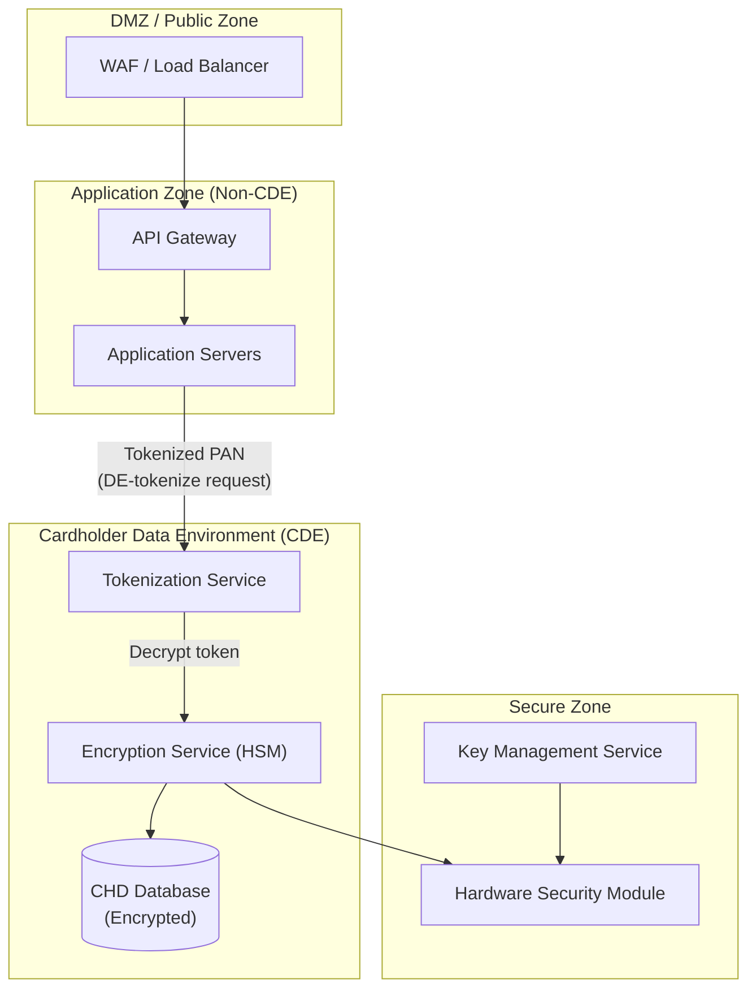
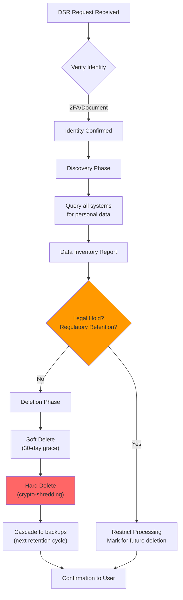
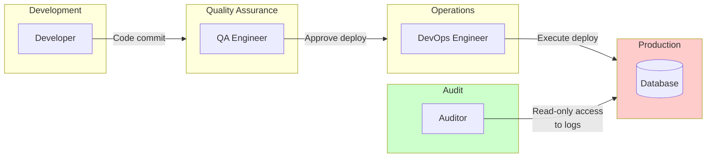
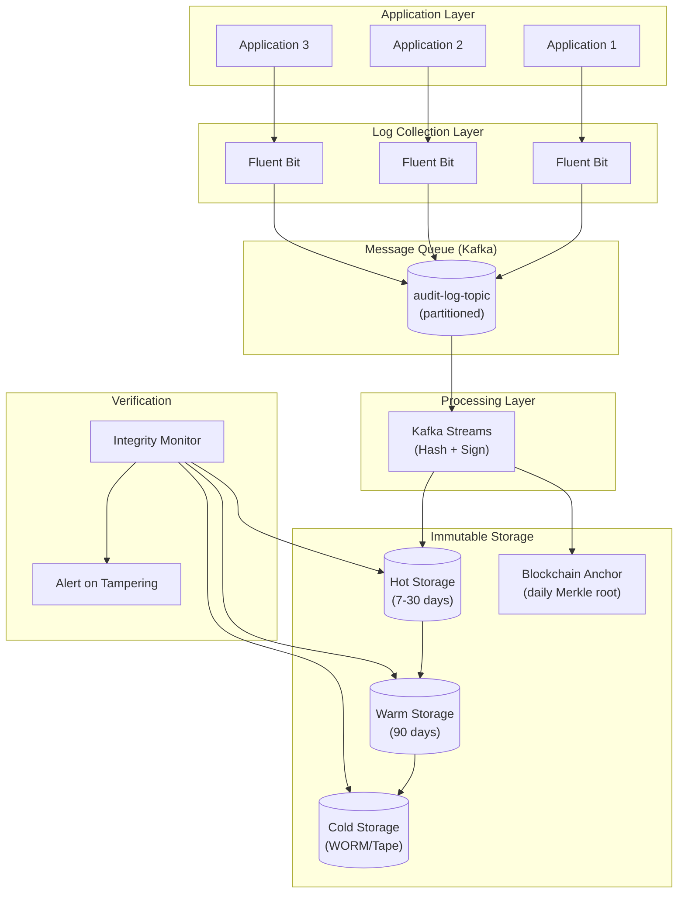
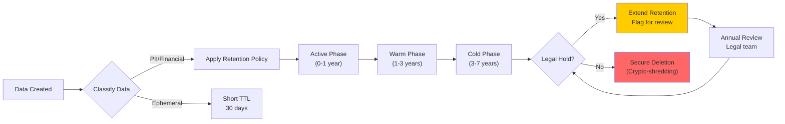

# Regulatory Compliance & Audit: Kiến Trúc Tuân Thủ Quy Định Trong Hệ Thống Tài Chính

> **Mục tiêu:** Hiểu sâu các yêu cầu tuân thủ (PCI-DSS, GDPR, SOX), thiết kế hệ thống audit log bất biến, và chiến lược bảo vệ dữ liệu nhạy cảm trong môi trường enterprise banking.

---

## 1. Mục Tiêu Củ Task

Task này tập trung vào ba trụ cột của compliance trong hệ thống tài chính:

| Lĩnh Vực | Quy Định | Mục Tiêu Kỹ Thuật |
|----------|----------|-------------------|
| **Bảo Mật Thanh Toán** | PCI-DSS | Bảo vệ dữ liệu thẻ, mã hóa, tokenization |
| **Bảo Vệ Dữ Liệu Cá Nhân** | GDPR/CCPA | Quyền riêng tư, data minimization, right to erasure |
| **Kiểm Soát Tài Chính** | SOX | Tính toàn vẹn dữ liệu, audit trail, segregation of duties |

> **Vấn đề cốt lõi:** Compliance không chỉ là "checkbox ticking" - nó ảnh hưởng sâu đến kiến trúc hệ thống, data flow, storage strategy, và operational procedures.

---

## 2. PCI-DSS: Bảo Mật Dữ Liệu Thẻ Thanh Toán

### 2.1 Bản Chất và Phạm Vi

PCI-DSS (Payment Card Industry Data Security Standard) áp dụng cho **bất kỳ entity nào** lưu trữ, xử lý, hoặc truyền tải cardholder data (CHD) hoặc sensitive authentication data (SAD).

```
┌─────────────────────────────────────────────────────────────────┐
│                    CARDHOLDER DATA (CHD)                        │
├─────────────────────────────────────────────────────────────────┤
│  Primary Account Number (PAN)      ✓ LUÔN phải bảo vệ          │
│  Cardholder Name                   ✓ NÊN bảo vệ                │
│  Expiration Date                   ✓ NÊN bảo vệ                │
│  Service Code                      ✓ NÊN bảo vệ                │
└─────────────────────────────────────────────────────────────────┘

┌─────────────────────────────────────────────────────────────────┐
│           SENSITIVE AUTHENTICATION DATA (SAD)                   │
├─────────────────────────────────────────────────────────────────┤
│  Full Track Data (magnetic stripe)  ✗ KHÔNG ĐƯỢC LƯU sau auth  │
│  CVV/CVC/CVV2/CID                   ✗ KHÔNG ĐƯỢC LƯU sau auth  │
│  PIN/PIN Block                      ✗ KHÔNG ĐƯỢC LƯU sau auth  │
└─────────────────────────────────────────────────────────────────┘
```

### 2.2 Kiến Trúc PCI-Compliant: Network Segmentation



> **Nguyên tắc cốt lõi:** "If you don't store it, you don't have to protect it" - Data minimization là chiến lược hiệu quả nhất để giảm scope PCI assessment.

### 2.3 Tokenization vs Encryption: Trade-off Analysis

| Aspect | Tokenization | Encryption |
|--------|--------------|------------|
| **Format** | Random surrogate value | Ciphertext (base64, hex) |
| **Reversibility** | Reversible via token vault | Reversible with key |
| **Data Length** | Preserves format (FF-PAN) | Expands data |
| **Performance** | Vault lookup (1-5ms) | Cryptographic operation |
| **Key Management** | Simpler (vault protection) | Complex (key rotation) |
| **Use Case** | Recurring payments, analytics | Data in transit, at rest |
| **Scope Reduction** | Yes (token ≠ CHD) | No (ciphertext = CHD) |

**Format-Preserving Tokenization (FPT):**
```
PAN: 4111-1111-1111-1111 (16 digits)
     ↓ Tokenization
Token: 4212-XXXX-XXXX-3456 (format-preserved)
       ↑ First 4: BIN preserved
       ↑ Last 4: For customer reference
       ↑ Middle: Randomized
```

### 2.4 Implementation Patterns

**Pattern 1: Point-to-Point Encryption (P2PE)**
```
[Card Reader] → (Encrypted at swipe) → [Payment Gateway] → [Processor]
       ↓                                    ↓
    DUKPT (Derived Unique Key Per Transaction)
    - Unique key derived per transaction
    - Keys never stored in plaintext
    - Even if compromised, only one transaction at risk
```

**Pattern 2: Vaultless Tokenization**
```java
// Cryptographic tokenization - không cần vault lookup
public String vaultlessTokenize(String pan, String encryptionKey) {
    // Sử dụng AES-SIV hoặc FF1 (NIST SP 800-38G)
    // Deterministic: same PAN → same token
    // Reversible với key
    // No database lookup required
}
```

### 2.5 HSM (Hardware Security Module) Integration

```
┌────────────────────────────────────────────────────────────────┐
│                    HSM SECURITY BOUNDARY                        │
├────────────────────────────────────────────────────────────────┤
│  • FIPS 140-2 Level 3+ validation                              │
│  • Keys never leave HSM (encrypted export only)                │
│  • Tamper-evident/tamper-responsive enclosure                  │
│  • Role-based access control (Crypto Officer, User)            │
│  • Dual-control for sensitive operations                       │
└────────────────────────────────────────────────────────────────┘
                              │
         ┌────────────────────┼────────────────────┐
         ▼                    ▼                    ▼
    [Key Generation]    [Encryption/Decryption]  [Key Rotation]
         │                    │                    │
    RSA/ECC keys         AES-256-GCM          Automatic
    inside HSM           inside HSM           ceremony
```

### 2.6 PCI-DSS Compliance Levels

| Level | Transaction Volume | Assessment Requirement |
|-------|-------------------|------------------------|
| 1 | > 6M Visa/MC annually | Annual QSA audit + quarterly ASV scan |
| 2 | 1M - 6M annually | Annual SAQ + quarterly ASV scan |
| 3 | 20K - 1M e-commerce | Annual SAQ + quarterly ASV scan |
| 4 | < 20K e-commerce | Annual SAQ (merchant discretion) |

---

## 3. GDPR: Quyền Riêng Tư Theo Thiết Kế

### 3.1 Bản Chất GDPR

GDPR (General Data Protection Regulation) định nghĩa **7 nguyên tắc xử lý dữ liệu**:

1. **Lawfulness, Fairness, Transparency** - Xử lý hợp pháp, công bằng, minh bạch
2. **Purpose Limitation** - Thu thập cho mục đích xác định, không dùng sai mục đích
3. **Data Minimization** - Chỉ thu thập dữ liệu cần thiết
4. **Accuracy** - Dữ liệu phải chính xác, cập nhật
5. **Storage Limitation** - Không lưu quá thời gian cần thiết
6. **Integrity and Confidentiality** - Bảo mật và bảo vệ
7. **Accountability** - Chịu trách nhiệm và chứng minh tuân thủ

### 3.2 Legal Basis for Processing

```
┌─────────────────────────────────────────────────────────────────┐
│              ARTICLE 6: LAWFULNESS OF PROCESSING                │
├─────────────────────────────────────────────────────────────────┤
│                                                                 │
│  (a) Consent              ← Người dùng đồng ý rõ ràng           │
│  (b) Contract             ← Cần thiết cho hợp đồng              │
│  (c) Legal Obligation     ← Tuân thủ luật pháp                  │
│  (d) Vital Interests      ← Bảo vệ tính mạng                    │
│  (e) Public Interest      ← Lợi ích công cộng                   │
│  (f) Legitimate Interest  ← Lợi ích hợp pháp (cân bằng test)    │
│                                                                 │
└─────────────────────────────────────────────────────────────────┘
```

> **Quan trọng:** Mỗi data processing activity PHẢI có legal basis riêng. Không thể "dùng chung" consent cho nhiều mục đích.

### 3.3 Data Subject Rights (Quyền của Chủ Thể Dữ Liệu)

| Quyền | Mô Tả | Kỹ Thuật Thực Hiện |
|-------|-------|-------------------|
| **Right to Access** | Xem dữ liệu đang lưu | API endpoint, data export |
| **Right to Rectification** | Sửa dữ liệu sai | Update API, audit log |
| **Right to Erasure** | Xóa dữ liệu ("Right to be forgotten") | Hard/soft delete, cascading |
| **Right to Restriction** | Hạn chế xử lý | Feature flag, data masking |
| **Right to Portability** | Xuất dữ liệu (machine-readable) | JSON/XML/CSV export |
| **Right to Object** | Phản đối xử lý | Opt-out mechanism |
| **Rights re: Automated Decision** | Không bị quyết định tự động | Human-in-the-loop |

### 3.4 Right to Erasure: Kiến Trúc Xử Lý



**Crypto-Shredding Strategy:**
```
┌─────────────────────────────────────────────────────────────────┐
│ User Data Encryption Architecture                               │
├─────────────────────────────────────────────────────────────────┤
│                                                                 │
│  [Personal Data] ←──(DEK)──→ [Encrypted Blob]                   │
│                         ↑                                       │
│                    Data Encryption Key (per-user)                │
│                         ↑                                       │
│              ┌─────────┴─────────┐                              │
│              │   KEK in HSM      │                              │
│              │ (Key Encrypting)  │                              │
│              └───────────────────┘                              │
│                                                                 │
│  DELETION: Xóa DEK → Data irretrievable (instant)              │
│  No need to overwrite data blocks                               │
│                                                                 │
└─────────────────────────────────────────────────────────────────┘
```

### 3.5 Data Minimization và Pseudonymization

**Privacy by Design Principles:**
```
┌─────────────────────────────────────────────────────────────────┐
│              DATA MINIMIZATION STRATEGIES                       │
├─────────────────────────────────────────────────────────────────┤
│                                                                 │
│  1. COLLECTION MINIMIZATION                                     │
│     • Không thu thập trước khi cần (just-in-time)               │
│     • Progressive profiling thay vì form dài                    │
│     • Default: không thu thập sensitive data                    │
│                                                                 │
│  2. USE LIMITATION                                              │
│     • Purpose binding trong code (policy-as-code)               │
│     • Technical enforcement, không chỉ policy                   │
│     • Separate data silos theo purpose                          │
│                                                                 │
│  3. RETENTION MANAGEMENT                                        │
│     • TTL trên mọi data entity                                  │
│     • Automated deletion workflows                              │
│     • Audit trail của deletion                                  │
│                                                                 │
└─────────────────────────────────────────────────────────────────┘
```

**Pseudonymization vs Anonymization:**

| Đặc Điểm | Pseudonymization | Anonymization |
|----------|-----------------|---------------|
| Reversibility | Reversible (với key) | Irreversible |
| GDPR Scope | Vẫn là personal data | Không còn là personal data |
| Use Case | Analytics, testing | Public datasets, research |
| Risk Level | Reduced | Eliminated |
| Re-identification | Possible (via side-channel) | Should be impossible |

---

## 4. SOX Compliance: Tính Toàn Vẹn Dữ Liệu Tài Chính

### 4.1 Bản Chất Sarbanes-Oxley Act (SOX)

SOX Section 302 và 404 yêu cầu:
- **CEO/CFO certification** của financial report accuracy
- **Internal controls** để đảm bảo accuracy
- **Audit trail** cho mọi thay đổi ảnh hưởng financial statements
- **Segregation of duties** trong financial processes

### 4.2 SOX IT General Controls (ITGC)

```
┌─────────────────────────────────────────────────────────────────┐
│                    SOX IT GENERAL CONTROLS                      │
├─────────────────────────────────────────────────────────────────┤
│                                                                 │
│  ┌─────────────────────────────────────────────────────────┐   │
│  │ ACCESS CONTROLS                                         │   │
│  │ • User provisioning/de-provisioning workflow            │   │
│  │ • Principle of least privilege                          │   │
│  │ • Regular access reviews (quarterly)                    │   │
│  │ • Privileged access monitoring                          │   │
│  └─────────────────────────────────────────────────────────┘   │
│                                                                 │
│  ┌─────────────────────────────────────────────────────────┐   │
│  │ CHANGE MANAGEMENT                                       │   │
│  │ • Separation of dev/test/prod environments              │   │
│  │ • Approval workflow cho production changes              │   │
│  │ • Emergency change procedures                           │   │
│  │ • Rollback capabilities                                 │   │
│  └─────────────────────────────────────────────────────────┘   │
│                                                                 │
│  ┌─────────────────────────────────────────────────────────┐   │
│  │ COMPUTER OPERATIONS                                     │   │
│  │ • Automated job scheduling với monitoring               │   │
│  │ • Backup and recovery procedures                        │   │
│  │ • Incident response procedures                          │   │
│  │ • Disaster recovery testing (annual)                    │   │
│  └─────────────────────────────────────────────────────────┘   │
│                                                                 │
│  ┌─────────────────────────────────────────────────────────┐   │
│  │ DATA INTEGRITY CONTROLS                                 │   │
│  │ • Input validation                                      │   │
│  │ • Database constraints                                  │   │
│  │ • Reconciliation procedures                             │   │
│  │ • Audit logging (immutable)                             │   │
│  └─────────────────────────────────────────────────────────┘   │
│                                                                 │
└─────────────────────────────────────────────────────────────────┘
```

### 4.3 Segregation of Duties (SoD)



**Conflict Matrix:**
```
┌─────────────────┬─────────┬──────────┬─────────┬──────────┐
│                 │ Develop │  Deploy  │ Approve │  Audit   │
├─────────────────┼─────────┼──────────┼─────────┼──────────┤
│ Develop         │    ✓    │    ✗     │    ✗    │    ✗     │
│ Deploy          │    ✗    │    ✓     │    ✗    │    ✗     │
│ Approve Change  │    ✗    │    ✗     │    ✓    │    ✗     │
│ Audit           │    ✗    │    ✗     │    ✗    │    ✓     │
└─────────────────┴─────────┴──────────┴─────────┴──────────┘
           ✗ = Conflict (không được phép cùng lúc)
```

---

## 5. Immutable Audit Logs: Kiến Trúc Bất Biến

### 5.1 Tại Sao Cần Immutability?

Audit log là **bằng chứng pháp lý** trong:
- **Forensic investigation** sau security incident
- **Regulatory examination** (SOX, PCI, GDPR)
- **Dispute resolution** với khách hàng
- **Insider threat detection**

> **Yêu cầu tối thiểu:** Audit log PHẢI đảm bảo tính toàn vẹn - nếu bị xóa hoặc sửa đổi, phải phát hiện được ngay lập tức.

### 5.2 Kiến Trúc Immutable Audit Log



### 5.3 Cryptographic Integrity Mechanisms

**A. Hash Chain (Simple)**
```
Entry N:   [Timestamp][Event][Hash(N-1)] → Hash(N)
Entry N+1: [Timestamp][Event][Hash(N)]   → Hash(N+1)
Entry N+2: [Timestamp][Event][Hash(N+1)] → Hash(N+2)

Tamper Entry N → Hash(N) changes → Hash(N+1) mismatch → Detection
```

**B. Merkle Tree (Scalable)**
```
                    [Root Hash]
                   /           \
            [Hash 0-1]       [Hash 2-3]
            /        \       /        \
        [H0]      [H1]   [H2]      [H3]
          |         |      |         |
       Entry0   Entry1  Entry2   Entry3

- Chỉ cần lưu Root Hash để verify toàn bộ tree
- Có thể verify individual entry mà không cần toàn bộ tree
- Dùng trong blockchain, certificate transparency
```

**C. Digital Signatures (Non-repudiation)**
```
┌─────────────────────────────────────────────────────────────────┐
│                  AUDIT LOG ENTRY STRUCTURE                      │
├─────────────────────────────────────────────────────────────────┤
│ {                                                               │
│   "timestamp": "2024-03-27T10:30:00Z",                          │
│   "sequence": 123456789,                                        │
│   "event": "ACCOUNT_TRANSFER",                                  │
│   "actor": "user_12345",                                        │
│   "resource": "account_67890",                                  │
│   "action": "DEBIT",                                            │
│   "amount": 1000.00,                                            │
│   "previous_hash": "sha256:abc123...",                          │
│   "metadata": { ... },                                          │
│                                                                   │
│   "signature": {         ← Signed by Log Server                  │
│     "alg": "Ed25519",                                           │
│     "key_id": "log-server-001",                                 │
│     "value": "sig_def456..."                                    │
│   }                                                              │
│ }                                                               │
└─────────────────────────────────────────────────────────────────┘
```

### 5.4 WORM Storage (Write Once Read Many)

```
┌─────────────────────────────────────────────────────────────────┐
│                    WORM STORAGE TIERS                           │
├─────────────────────────────────────────────────────────────────┤
│                                                                 │
│  TIER 1: Object Storage WORM (S3 Object Lock)                   │
│  ├── Compliance Mode: Không ai (kể cả root) có thể xóa          │
│  ├── Governance Mode: Có thể xóa với special permission        │
│  └── Retention: 1-7 years (legal hold possible)                 │
│                                                                 │
│  TIER 2: Cloud Archive (Glacier, Azure Archive)                 │
│  ├── Vault lock policies                                        │
│  ├── Retrieval time: minutes to hours                           │
│  └── Cost: ~$0.004/GB/month                                     │
│                                                                 │
│  TIER 3: Physical Tape (Iron Mountain)                          │
│  ├── Air-gapped (offline)                                       │
│  ├── Tamper-evident seals                                       │
│  └── Legal requirement for some industries                      │
│                                                                 │
└─────────────────────────────────────────────────────────────────┘
```

### 5.5 Blockchain Anchoring

```
┌─────────────────────────────────────────────────────────────────┐
│              BLOCKCHAIN ANCHORING PATTERN                       │
├─────────────────────────────────────────────────────────────────┤
│                                                                 │
│  Daily Process:                                                 │
│  ┌─────────────┐    ┌─────────────┐    ┌─────────────────────┐ │
│  │ All audit   │ →  │ Calculate   │ →  │ Write to Public     │ │
│  │ logs of day │    │ Merkle Root │    │ Blockchain (Bitcoin │ │
│  │             │    │             │    │ / Ethereum)         │ │
│  └─────────────┘    └─────────────┘    └─────────────────────┘ │
│                                               │                 │
│                                               ▼                 │
│                                        [Transaction ID]         │
│                                         0x7a3f...9d2e           │
│                                                                 │
│  Verification:                                                  │
│  - Anyone có thể verify Merkle Root trên blockchain            │
│  - Public blockchain = thousands of witnesses                   │
│  - Cost: ~$1-10/day depending on chain                         │
│                                                                 │
│  Alternatives:                                                  │
│  - Private blockchain (Hyperledger) giữa các ngân hàng         │
│  - Certificate Transparency logs (Google)                       │
│  - Consortium blockchain (R3 Corda)                             │
│                                                                 │
└─────────────────────────────────────────────────────────────────┘
```

---

## 6. Data Retention Strategies

### 6.1 Retention Requirements by Regulation

| Regulation | Data Type | Retention Period | Notes |
|------------|-----------|------------------|-------|
| **PCI-DSS** | CHD | As short as possible | Delete after business need |
| **PCI-DSS** | Audit logs | 1 year minimum | 3 months online, rest offline |
| **GDPR** | Personal data | Only as necessary | Data minimization principle |
| **GDPR** | Consent records | Duration of processing | Proof of legal basis |
| **SOX** | Financial records | 7 years | Immutable, tamper-evident |
| **SOX** | Change logs | 7 years | ITGC evidence |
| **Banking** | Transaction records | 5-10 years | Varies by jurisdiction |
| **Tax** | Tax records | 7-10 years | Depends on country |

### 6.2 Automated Retention Lifecycle



### 6.3 Implementation: Policy-as-Code

```yaml
# retention-policies.yaml
policies:
  - name: pci_chd
    description: "PCI Cardholder Data"
    data_types: ["pan", "track_data", "cvv"]
    retention:
      duration: "P90D"  # ISO 8601 duration
      action: "CRYPTO_SHRED"
    legal_basis: "contract_performance"
    
  - name: transaction_logs
    description: "Financial Transaction Records"
    data_types: ["transaction_record"]
    retention:
      duration: "P7Y"
      phases:
        hot: "P30D"      # Fast query
        warm: "P1Y"      # Slower, cheaper
        cold: "P6Y"      # Archive
      action: "ARCHIVE_THEN_DELETE"
    legal_basis: "legal_obligation"
    regulations: ["SOX", "Banking_Act"]
    
  - name: user_consent
    description: "Consent and Preferences"
    data_types: ["consent_record", "preference"]
    retention:
      duration: "duration_of_processing"
      action: "RETAIN_UNTIL_WITHDRAWAL"
    legal_basis: "consent"
    
  - name: audit_logs
    description: "Security Audit Trail"
    data_types: ["audit_event", "access_log"]
    retention:
      duration: "P1Y"
      phases:
        online: "P3M"
        offline: "P9M"
      action: "WORM_ARCHIVE"
      immutability: true
    legal_basis: "legal_obligation"
    regulations: ["PCI_DSS"]
```

---

## 7. Tamper-Evident Storage: Kỹ Thuật và Triển Khai

### 7.1 Tamper Detection vs Tamper Proof

| Khái Niệm | Mô Tả | Thực Tế |
|-----------|-------|---------|
| **Tamper-Proof** | Không thể sửa đổi | Không tồn tại trong thực tế |
| **Tamper-Resistant** | Khó sửa đổi | Physical controls, encryption |
| **Tamper-Evident** | Phát hiện được sửa đổi | **Mục tiêu thực tế** |
| **Tamper-Responsive** | Tự động phản ứng | Alerts, quarantine, shutdown |

### 7.2 Multi-Layer Tamper Evidence

```
┌─────────────────────────────────────────────────────────────────┐
│               LAYER 1: APPLICATION                              │
│  • Checksum on log entry creation                               │
│  • Chain of hashes linking entries                              │
│  • Digital signatures with timestamp (TSA)                      │
├─────────────────────────────────────────────────────────────────┤
│               LAYER 2: DATABASE                                 │
│  • Append-only tables (PostgreSQL INSERT only)                  │
│  • Row-level security preventing UPDATE/DELETE                  │
│  • Trigger-based integrity checks                               │
├─────────────────────────────────────────────────────────────────┤
│               LAYER 3: FILE SYSTEM                              │
│  • Append-only file attributes (chattr +a)                      │
│  • Read-only bind mounts                                        │
│  • Filesystem-level checksums (ZFS, Btrfs)                      │
├─────────────────────────────────────────────────────────────────┤
│               LAYER 4: STORAGE                                  │
│  • S3 Object Lock (Compliance Mode)                             │
│  • Azure Immutable Blob Storage                                 │
│  • Write-once media (WORM tape)                                 │
├─────────────────────────────────────────────────────────────────┤
│               LAYER 5: VERIFICATION                             │
│  • Continuous integrity monitoring                              │
│  • Blockchain anchoring (public witness)                        │
│  • Third-party audit (Big 4)                                    │
└─────────────────────────────────────────────────────────────────┘
```

### 7.3 PostgreSQL Append-Only Pattern

```sql
-- Tạo audit table với RLS (Row Level Security)
CREATE TABLE audit_log (
    id BIGSERIAL PRIMARY KEY,
    timestamp TIMESTAMPTZ DEFAULT NOW() NOT NULL,
    sequence BIGINT NOT NULL UNIQUE,  -- Sequential for chain
    event_type VARCHAR(50) NOT NULL,
    actor VARCHAR(100) NOT NULL,
    resource VARCHAR(100) NOT NULL,
    action VARCHAR(50) NOT NULL,
    payload JSONB,
    previous_hash VARCHAR(64) NOT NULL,
    entry_hash VARCHAR(64) NOT NULL,  -- Hash của toàn bộ entry
    signature VARCHAR(512)
);

-- Enable RLS
ALTER TABLE audit_log ENABLE ROW LEVEL SECURITY;

-- Chỉ cho phép INSERT (không UPDATE, DELETE)
CREATE POLICY audit_insert_only ON audit_log
    FOR ALL
    USING (false)  -- Không cho phép SELECT/UPDATE/DELETE qua RLS
    WITH CHECK (true);  -- Chỉ cho phép INSERT

-- Function tự động tính hash và sequence
CREATE OR REPLACE FUNCTION create_audit_entry()
RETURNS TRIGGER AS $$
DECLARE
    last_hash VARCHAR(64);
    new_sequence BIGINT;
BEGIN
    -- Lấy hash của entry trước đó
    SELECT entry_hash, sequence 
    INTO last_hash, new_sequence
    FROM audit_log 
    ORDER BY sequence DESC 
    LIMIT 1;
    
    IF last_hash IS NULL THEN
        last_hash := 'genesis';
        new_sequence := 1;
    ELSE
        new_sequence := new_sequence + 1;
    END IF;
    
    -- Set sequence và previous_hash
    NEW.sequence := new_sequence;
    NEW.previous_hash := last_hash;
    
    -- Tính hash của entry hiện tại
    NEW.entry_hash := encode(
        digest(
            NEW.timestamp::text || 
            NEW.sequence::text || 
            NEW.event_type || 
            NEW.actor || 
            NEW.resource || 
            NEW.action || 
            NEW.payload::text ||
            NEW.previous_hash,
            'sha256'
        ),
        'hex'
    );
    
    RETURN NEW;
END;
$$ LANGUAGE plpgsql;

CREATE TRIGGER audit_entry_trigger
    BEFORE INSERT ON audit_log
    FOR EACH ROW
    EXECUTE FUNCTION create_audit_entry();
```

---

## 8. Rủi Ro, Anti-Patterns, và Lỗi Thường Gặp

### 8.1 PCI-DSS Anti-Patterns

| Anti-Pattern | Hậu Quả | Giải Pháp |
|--------------|---------|-----------|
| **Storing CVV** | Violation of requirement 3.2 | Never store CVV, even encrypted |
| **PAN in URLs/Logs** | Data exposure in web logs | Tokenize before logging |
| **Shared CDE credentials** | Cannot trace individual actions | Individual accounts, MFA |
| **Encryption without key rotation** | Long-term key compromise risk | Automated rotation (annually) |
| **Storing keys in code/config** | Easy extraction from source | HSM, vault, environment variables |

### 8.2 GDPR Pitfalls

| Pitfall | Vấn Đề | Khắc Phục |
|---------|--------|-----------|
| **"Implied" consent** | Không hợp lệ dưới GDPR | Explicit opt-in, granular choices |
| **Cookie walls** | Bắt buộc consent để dùng service | Consent must be freely given |
| **Incomplete data deletion** | Còn sót trong backups/logs | Crypto-shredding, retention policies |
| **Cross-border transfer** | Transfer outside EEA | SCC, adequacy decision, BCRs |
| **Missing DPO** | Không có Data Protection Officer | Appoint DPO nếu required |

### 8.3 SOX Control Failures

| Failure | Impact | Prevention |
|---------|--------|------------|
| **Segregation violation** | Same person can approve và execute | Automated SoD checking |
| **Missing audit trail** | Cannot prove control operated | Immutable logging |
| **Unauthorized production access** | Uncontrolled changes | PAM (Privileged Access Management) |
| **Unapproved emergency changes** | Bypass change control | Emergency CAB, post-hoc review |
| **Stale user accounts** | Orphaned access | Automated de-provisioning |

### 8.4 Audit Log Failures

```
┌─────────────────────────────────────────────────────────────────┐
│           COMMON AUDIT LOG FAILURES                             │
├─────────────────────────────────────────────────────────────────┤
│                                                                 │
│  1. CLOCK SKEW                                                  │
│     Problem: NTP issues cause timestamp inconsistency           │
│     Impact: Cannot reconstruct event sequence                   │
│     Fix: NTP with authentication, hardware clock source         │
│                                                                 │
│  2. LOG INJECTION                                               │
│     Problem: Attacker injects fake log entries                  │
│     Impact: Corrupted audit trail                               │
│     Fix: Structured logging, input validation, signing          │
│                                                                 │
│  3. STORAGE EXHAUSTION                                          │
│     Problem: Logs fill up disk → system crash                   │
│     Impact: Service outage, log loss                            │
│     Fix: Log rotation, monitoring, automated archival           │
│                                                                 │
│  4. PERFORMANCE DEGRADATION                                     │
│     Problem: Synchronous logging blocks requests                │
│     Impact: High latency under load                             │
│     Fix: Async logging, dedicated log servers, buffering        │
│                                                                 │
│  5. INCOMPLETE COVERAGE                                         │
│     Problem: Some components không log                          │
│     Impact: Blind spots in audit trail                          │
│     Fix: Centralized logging standard, automated validation     │
│                                                                 │
└─────────────────────────────────────────────────────────────────┘
```

---

## 9. Khuyến Nghị Thực Chiến Production

### 9.1 Compliance-First Architecture

```
┌─────────────────────────────────────────────────────────────────┐
│         COMPLIANCE BY DESIGN PRINCIPLES                         │
├─────────────────────────────────────────────────────────────────┤
│                                                                 │
│  1. DEFAULT DENY                                                │
│     • Mọi data access bị từ chối mặc định                      │
│     • Explicit allow dựa trên role và purpose                  │
│     • ABAC (Attribute-Based Access Control)                     │
│                                                                 │
│  2. DATA MINIMIZATION                                           │
│     • Thu thập ít nhất có thể                                  │
│     • Tokenization ngay tại entry point                        │
│     • Auto-expiration trên mọi data                            │
│                                                                 │
│  3. DEFENSE IN DEPTH                                            │
│     • Nhiều lớp bảo vệ, không dựa vào một biện pháp          │
│     • Assume breach mentality                                   │
│     • Zero trust architecture                                   │
│                                                                 │
│  4. OBSERVABILITY                                               │
│     • Audit mọi data access và modification                    │
│     • Real-time anomaly detection                              │
│     • Tamper-evident logging                                    │
│                                                                 │
│  5. AUTOMATION                                                  │
│     • Policy-as-code để đảm bảo consistency                    │
│     • Automated compliance checks trong CI/CD                  │
│     • Self-healing nếu drift from policy                       │
│                                                                 │
└─────────────────────────────────────────────────────────────────┘
```

### 9.2 Technology Stack Recommendations

| Layer | Recommended Tools | Notes |
|-------|-------------------|-------|
| **HSM** | AWS CloudHSM, Azure Dedicated HSM, Thales Luna 7 | FIPS 140-2 Level 3 |
| **Vault** | HashiCorp Vault, AWS Secrets Manager, Azure Key Vault | Dynamic secrets, rotation |
| **Logging** | Fluent Bit → Kafka → ClickHouse/Elasticsearch | High throughput, retention |
| **WORM Storage** | S3 Object Lock, Azure Immutable Storage | Compliance mode |
| **Blockchain** | Bitcoin anchoring (Chainpoint), Hyperledger | Cost ~$1-10/day |
| **PAM** | CyberArk, HashiCorp Boundary, Teleport | Session recording, JIT access |
| **DLP** | Microsoft Purview, Symantec DLP, Nightfall | Data classification |

### 9.3 Compliance Automation

```yaml
# compliance-checks.yaml
compliance_checks:
  pci_dss:
    - name: "No CHD in logs"
      type: "regex_scan"
      pattern: "\\b(?:\\d{4}[ -]?){3}\\d{4}\\b"  # PAN pattern
      severity: "critical"
      
    - name: "CVV not stored"
      type: "database_scan"
      query: "SELECT * FROM payments WHERE cvv IS NOT NULL"
      severity: "critical"
      
    - name: "Encryption at rest"
      type: "aws_config_rule"
      rule: "encrypted-volumes"
      severity: "high"
      
  gdpr:
    - name: "Consent recorded"
      type: "database_validation"
      query: "SELECT user_id FROM users WHERE consent_version IS NULL"
      severity: "high"
      
    - name: "Data retention enforced"
      type: "ttl_validation"
      max_age: "P7Y"
      severity: "medium"
      
  sox:
    - name: "SoD check"
      type: "rbac_validation"
      conflicts:
        - ["developer", "production_deploy"]
        - ["approver", "executor"]
      severity: "critical"
      
    - name: "Immutable audit log"
      type: "log_integrity"
      chain_validation: true
      signature_check: true
      severity: "critical"
```

### 9.4 Incident Response for Compliance

```
┌─────────────────────────────────────────────────────────────────┐
│          COMPLIANCE INCIDENT RESPONSE PLAYBOOK                  │
├─────────────────────────────────────────────────────────────────┤
│                                                                 │
│  DETECTION (T+0)                                                │
│  ├── Automated alert từ monitoring                              │
│  ├── Internal whistleblower                                     │
│  └── External notification (regulator, customer)                │
│                                                                 │
│  CONTAINMENT (T+1h)                                             │
│  ├── Isolate affected systems                                   │
│  ├── Preserve evidence (forensic images)                        │
│  └── Document chain of custody                                  │
│                                                                 │
│  ASSESSMENT (T+24h)                                             │
│  ├── Determine scope of breach                                  │
│  ├── Identify affected individuals                              │
│  └── Assess regulatory notification obligations                 │
│                                                                 │
│  NOTIFICATION (T+72h GDPR, varies others)                       │
│  ├── Regulatory authorities                                     │
│  ├── Affected individuals                                       │
│  └── Public (nếu significant impact)                           │
│                                                                 │
│  REMEDIATION                                                    │
│  ├── Fix root cause                                             │
│  ├── Enhance controls                                           │
│  └── Retest validation                                          │
│                                                                 │
│  LESSONS LEARNED                                                │
│  ├── Post-incident review                                       │
│  ├── Update policies/procedures                                 │
│  └── Training update                                            │
│                                                                 │
└─────────────────────────────────────────────────────────────────┘
```

---

## 10. Kết Luận

### Bản Chất Cốt Lõi

**Compliance trong hệ thống tài chính không phải là một tính năng - nó là một ràng buộc kiến trúc.** Mỗi quy định (PCI-DSS, GDPR, SOX) đều:

1. **Giới hạn cách thiết kế:** CDE segmentation, data minimization, immutability
2. **Tăng chi phí vận hành:** Audit, monitoring, key management, retention
3. **Giảm velocity:** Change control, approval workflows, SoD
4. **Tạo competitive moat:** Compliance là barrier to entry cho đối thủ

### Trade-off Quan Trọng Nhất

| Trade-off | Option A | Option B | Recommendation |
|-----------|----------|----------|----------------|
| **Scope vs Convenience** | Reduce CDE scope (tokenize early) | Direct CHD access (simpler) | **Tokenize at edge** - complexity đáng giá |
| **Retention vs Cost** | Long retention (compliance) | Short retention (cheap) | **Tiered storage** - WORM archive |
| **Immutability vs Performance** | Blockchain verification (slow) | Hash chain (fast) | **Hybrid** - daily anchor, real-time chain |
| **Automation vs Control** | Auto-remediation (fast) | Human approval (safe) | **Risk-based** - auto for low-risk, human for high-risk |

### Rủi Ro Lớn Nhất

> **"Compliance Theater"** - Làm đủ để pass audit nhưng không thực sự bảo vệ dữ liệu.

Dấu hiệu:
- Audit logs không bao giờ được review
- Policies chỉ tồn tại trên giấy, không enforce trong code
- Emergency bypass procedures trở thành "normal operations"
- Chasing compliance checklist thay vì security outcome

### Chốt Lại

Compliance architecture = **Technical controls + Process discipline + Cultural commitment**. Thiếu một trong ba yếu tố, hệ thống sẽ fail vào lúc quan trọng nhất.

---

*Document này được tạo để nghiên cứu sâu về Regulatory Compliance & Audit trong hệ thống backend tài chính.*