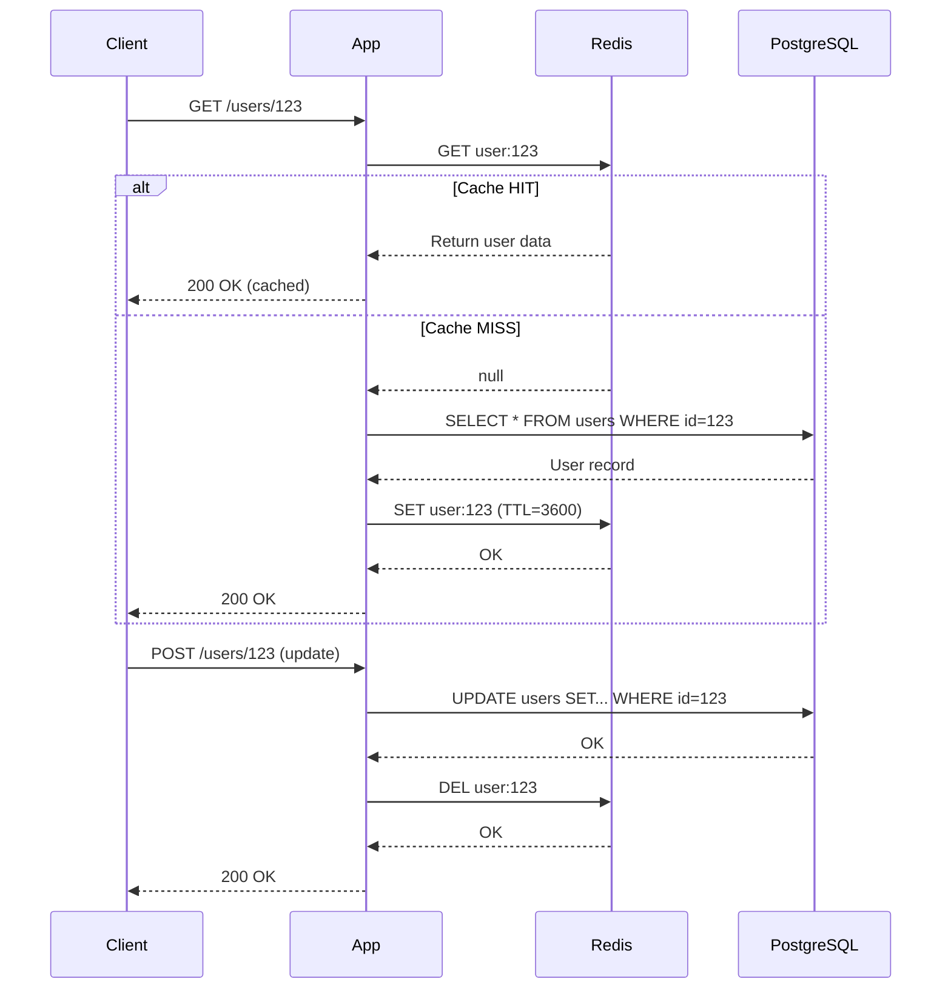
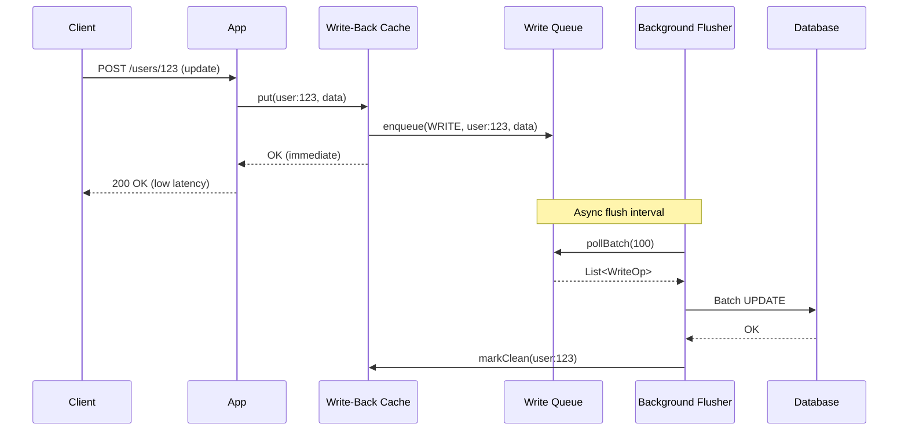

# Cache Patterns: Cache-Aside, Read-Through, Write-Through, Write-Behind

## 1. Mục tiêu của Task

Hiểu sâu bản chất của 4 pattern caching phổ biến nhất trong hệ thống production:
- **Cache-Aside (Lazy Loading)**: Ứng dụng tự quản lý cache
- **Read-Through**: Cache tự động load từ database
- **Write-Through**: Ghi đồng thờic vào cache và database
- **Write-Behind (Write-Back)**: Ghi vào cache trước, flush xuống DB sau

Mục tiêu là nắm vững **khi nào dùng pattern nào**, **rủi ro của mỗi pattern**, và **cách triển khai production-ready**.

---

## 2. Bản chất và Cơ chế Hoạt động

### 2.1 Cache-Aside (Lazy Loading)

**Bản chất**: Application layer chịu trách nhiệm hoàn toàn cho việc đọc/ghi cache. Cache chỉ là passive storage.

```
┌─────────────┐     ┌─────────────┐     ┌─────────────┐
│  Application │────▶│    Cache    │     │  Database   │
│   (Java App) │◄────│  (Redis)    │     │  (PostgreSQL)│
└──────┬──────┘     └──────┬──────┘     └─────────────┘
       │                   │
       └───────────────────┘
              Miss → Query DB
```

**Luồng xử lý Read**:
1. App query cache với key
2. **Cache HIT**: Trả về data immediately
3. **Cache MISS**: 
   - App query database
   - App write kết quả vào cache
   - App trả về kết quả cho client

**Luồng xử lý Write**:
1. App write vào database (single source of truth)
2. App invalidate hoặc update cache
   - **Invalidate**: Xóa key (preferred)
   - **Update**: Ghi đè value (risky)

> **Nguyên tắc vàng**: Cache-Aside LUÔN write-through DB trước, cache sau. Không bao giờ tin tưởng cache là source of truth.

---

### 2.2 Read-Through

**Bản chất**: Cache layer tự động load data từ database khi miss. Application không biết DB tồn tại.

```
┌─────────────┐         ┌─────────────────────────┐
│  Application │────────▶│     Cache Provider      │
│              │◄────────│  (Redis + Cache Loader) │
└─────────────┘         └───────────┬─────────────┘
                                    │
                              Miss: Auto-load
                                    │
                                    ▼
                            ┌─────────────┐
                            │  Database   │
                            └─────────────┘
```

**Cơ chế hoạt động**:
- Cache provider implement `CacheLoader` interface
- Khi `cache.get(key)` miss, provider tự động:
  1. Query database với key
  2. Deserialize/transform data
  3. Store vào cache với TTL
  4. Return cho application

**Ví dụ thực tế** (Redis with Cache Loader):
```java
// Application code đơn giản hóa
String value = redisCache.get(userId); // Không cần biết DB
// Nếu miss, Redis (với cache loader) tự query PostgreSQL
```

---

### 2.3 Write-Through

**Bản chất**: Mọi write operation đều đi qua cache layer, cache đảm bảo data được ghi xuống DB ngay lập tức.

```
┌─────────────┐         ┌─────────────────────────┐
│  Application │────────▶│     Cache Provider      │
│              │         │  (Redis + Write Handler)│
└─────────────┘         └───────────┬─────────────┘
                                    │
                    ┌───────────────┴───────────────┐
                    ▼                               ▼
            ┌─────────────┐                 ┌─────────────┐
            │    Cache    │                 │  Database   │
            │   (Redis)   │                 │(PostgreSQL) │
            └─────────────┘                 └─────────────┘
```

**Cơ chế**:
- Application chỉ gọi `cache.put(key, value)`
- Cache provider thực hiện synchronous write:
  1. Start transaction với DB
  2. Write vào database
  3. Write vào cache (hoặc ngược lại, tùy implementation)
  4. Commit transaction
  5. Return success cho app

> **Trade-off cơ bản**: Write-Through tăng độ consistent nhưng tăng latency của write operation (phải đợi cả 2 writes hoàn thành).

---

### 2.4 Write-Behind (Write-Back)

**Bản chất**: Application chỉ write vào cache. Cache asynchronously flush xuống database sau.

```
┌─────────────┐         ┌─────────────────────────┐
│  Application │────────▶│     Cache Provider      │
│              │         │   (Redis/Guava/Caffeine)│
└─────────────┘         └───────────┬─────────────┘
                                    │
                         ┌──────────┴──────────┐
                         ▼                     ▼
                  ┌─────────────┐       ┌─────────────┐
                  │    Cache    │       │  Write Queue│
                  │  (In-mem)   │       │  (Async)    │
                  └─────────────┘       └──────┬──────┘
                                               │
                                               ▼ (batch/buffered)
                                        ┌─────────────┐
                                        │  Database   │
                                        └─────────────┘
```

**Cơ chế**:
1. App write vào cache → immediate return (low latency)
2. Cache mark entry là **dirty**
3. Background thread định kỳ:
   - Collect dirty entries
   - Batch write xuống DB
   - Mark entries là clean

**Flush strategies**:
- **Time-based**: Flush mỗi X milliseconds
- **Size-based**: Flush khi queue đạt N entries
- **Event-based**: Flush trước khi cache eviction

---

## 3. Kiến trúc và Luồng Xử lý Chi tiết

### 3.1 So sánh Luồng Read

| Pattern | Cache Hit | Cache Miss | Complexity | Data Freshness |
|---------|-----------|------------|------------|----------------|
| **Cache-Aside** | O(1) từ cache | App query DB → populate cache | Thấp (App control) | Có thể stale nếu DB update |
| **Read-Through** | O(1) từ cache | Cache auto-load từ DB | Trung bình (CacheLoader impl) | Tương tự Cache-Aside |

### 3.2 So sánh Luồng Write

| Pattern | Write Latency | Data Consistency | Failure Recovery | Use Case |
|---------|---------------|------------------|------------------|----------|
| **Cache-Aside** | Thấp (chỉ DB) | Eventual consistency | Dễ (DB là source) | Read-heavy, cho phép stale |
| **Write-Through** | Cao (DB + Cache) | Strong consistency | Phức tạp | Write-heavy, cần consistency |
| **Write-Behind** | Rất thấp (chỉ cache) | Có thể mất data | Phức tạp nhất | Write-heavy, chấp nhận risk |

### 3.3 Mermaid Diagram: Cache-Aside Sequence



### 3.4 Mermaid Diagram: Write-Behind Architecture



---

## 4. Trade-off Analysis Chi tiết

### 4.1 Cache-Aside: Ưu/Nhược điểm

**Ưu điểm**:
- ✅ **Đơn giản**: Dễ hiểu, dễ implement, dễ debug
- ✅ **Flexible**: App control hoàn toàn cache logic
- ✅ **Resilient**: Cache failure không ảnh hưởng DB operations
- ✅ **Read-optimized**: Tốt cho read-heavy workloads

**Nhược điểm**:
- ❌ **Stale data**: DB update không tự động invalidate cache
- ❌ **Thundering herd**: Nhiều requests cùng miss cache, cùng query DB
- ❌ **Code duplication**: Mọi read path đều phải implement cache logic

**Thundering Herd Problem**:
```
T0: Cache key "user:123" expire
T1: 1000 concurrent requests đến
T2: Cả 1000 requests đều MISS cache
T3: Cả 1000 requests cùng query DB → DB overload
```

**Giải pháp Thundering Herd**:
- **Cache warming**: Pre-populate cache trước khi expire
- **Mutex/locking**: Chỉ 1 request được query DB, others wait
- **Stale-while-revalidate**: Trả về stale data trong khi refresh async

### 4.2 Read-Through: Ưu/Nhược điểm

**Ưu điểm**:
- ✅ **Separation of concerns**: App không biết DB tồn tại
- ✅ **DRY**: Cache logic centralized trong CacheLoader
- ✅ **Transparent**: App code sạch hơn

**Nhược điểm**:
- ❌ **Vendor lock-in**: Phụ thuộc vào cache provider (Redis, Hazelcast, etc.)
- ❌ **Complex debugging**: Harder to trace cache miss path
- ❌ **Thundering herd vẫn tồn tại** nếu không implement locking

### 4.3 Write-Through: Ưu/Nhược điểm

**Ưu điểm**:
- ✅ **Strong consistency**: Cache và DB luôn synchronized
- ✅ **No stale data**: Cache luôn fresh sau mỗi write
- ✅ **Simple mental model**: Cache là mirror của DB

**Nhược điểm**:
- ❌ **Higher write latency**: Phải đợi cả 2 writes
- ❌ **Write amplification**: Cache write failure có thể rollback DB transaction
- ❌ **Cache pollution**: Data ít đọc vẫn chiếm cache space

**Write Latency Breakdown**:
```
Write-Through latency = DB write + Network to cache + Cache write + Network return
                      ≈ 2x write latency so với chỉ ghi DB
```

### 4.4 Write-Behind: Ưu/Nhược điểm

**Ưu điểm**:
- ✅ **Lowest write latency**: Chỉ cần in-memory write
- ✅ **High write throughput**: Batch writes giảm DB pressure
- ✅ **Write coalescing**: Nhiều updates cùng key → chỉ flush latest

**Nhược điểm**:
- ❌ **Data loss risk**: Crash trước khi flush = mất data
- ❌ **Complexity cao**: Cần queue, flusher, recovery mechanisms
- ❌ **Harder debugging**: Async nature làm trace khó khăn
- ❌ **Durability concern**: Không biết chắc data đã persist

**Write-Behind Data Loss Scenarios**:
| Scenario | Mất data? | Phòng ngừa |
|----------|-----------|------------|
| Process crash | Có (nếu chưa flush) | Persistent queue (WAL) |
| Cache eviction | Có (dirty entry bị evict) | Pin dirty entries |
| Flush failure | Có (nếu không retry) | Dead letter queue |

---

## 5. Rủi ro, Anti-Patterns, và Lỗi Production

### 5.1 Cache-Aside: Lỗi thường gặp

**❌ Anti-Pattern: Update cache thay vì Invalidate**
```java
// SAI: Write race condition
public void updateUser(User user) {
    db.update(user);           // T1: update name="Alice"
    cache.put(user.id, user);  // T2: cache = "Alice"
    // T3: Another update name="Bob" 
    // T4: cache.put("Bob") → cached
    // T5: T1's put("Alice") overwrites → Stale data!
}

// ĐÚNG: Invalidate sau write
public void updateUser(User user) {
    db.update(user);
    cache.invalidate(user.id);  // Next read sẽ load fresh data
}
```

**❌ Anti-Pattern: Không có TTL hoặc TTL quá dài**
- Cache entry tồn tại mãi mãi
- Memory leak
- Stale data tồn tại lâu

**❌ Race Condition trong Read-Modify-Write**:
```
T1: Read cache (hit) → value=10
T2: Read cache (hit) → value=10
T1: Increment → value=11, write DB, invalidate cache
T2: Increment → value=11 (dựa trên stale read), write DB
→ Lost update: Expected 12, got 11
```

### 5.2 Read-Through: Lỗi thường gặp

**❌ CacheLoader không handle exceptions**:
- DB down → CacheLoader throw → Cascade failure
- Nên return null hoặc fallback value, không throw

**❌ Không implement cache warming**:
- Cold cache sau restart → DB hit liên tục

### 5.3 Write-Through: Lỗi thường gặp

**❌ Không có transaction coordination**:
```java
// RỦI RO: Partial write
db.update(user);     // Success
cache.put(user);     // Network error - FAIL
// → DB updated, cache stale

// ĐÚNG: Distributed transaction hoặc saga pattern
try {
    tx.begin();
    db.update(user);
    cache.put(user);
    tx.commit();
} catch (Exception e) {
    tx.rollback();
}
```

**❌ Cache write failure không rollback DB**:
- Dẫn đến permanent inconsistency
- Cần compensation logic hoặc retry mechanism

### 5.4 Write-Behind: Lỗi thường gặp

**❌ Không có persistent queue**:
- Process restart = mất tất cả pending writes
- Dùng Redis/RabbitMQ/Kafka làm durable queue

**❌ Flush failure không được xử lý**:
- Retry exhaustion → Data lost
- Cần dead letter queue + alerting

**❌ Buffer quá lớn**:
- Memory pressure
- Long recovery time sau crash

---

## 6. Khuyến nghị Thực chiến Production

### 6.1 Khi nào dùng pattern nào?

| Use Case | Recommended Pattern | Lý do |
|----------|---------------------|-------|
| **Read-heavy, cho phép stale** (news, catalog) | Cache-Aside | Đơn giản, flexible |
| **Read-heavy, cần consistency** (user profile) | Read-Through + TTL ngắn | Centralized logic |
| **Write-heavy, cần durability** (financial) | Write-Through | Strong consistency |
| **Write-heavy, throughput > durability** (analytics, logs) | Write-Behind | Max throughput |
| **Hybrid** (social media) | Cache-Aside (read) + Write-Through (critical writes) | Balance |

### 6.2 Cache-Aside Production Checklist

```yaml
✅ Luôn invalidate cache sau write (không update)
✅ Set TTL hợp lý (balance giữa freshness và DB load)
✅ Implement circuit breaker cho DB queries (tránh thundering herd gây DB outage)
✅ Sử dụng cache warming cho hot keys
✅ Monitoring: cache hit rate, miss rate, DB query count
✅ Distributed locking cho hot key updates (Redis Redlock hoặc database advisory locks)
```

### 6.3 Monitoring và Observability

**Metrics cần track**:
```
# Cache metrics
cache_hit_rate = cache_hits / (cache_hits + cache_misses)
cache_miss_rate = 1 - cache_hit_rate
cache_eviction_rate  # Tốc độ eviction
cache_memory_usage   # Memory pressure

# Application metrics
db_query_count       # Tăng đột biến = cache problem
request_latency_p99  # Cache miss latency impact
write_queue_depth    # Chỉ cho Write-Behind
flush_failure_rate   # Chỉ cho Write-Behind
```

**Log correlation**:
- Thêm `cache_operation` vào structured logs
- Trace ID đi qua cả cache và DB operations

### 6.4 Java Implementation Patterns

**Cache-Aside với Spring + Redis**:
```java
@Service
public class UserService {
    @Autowired private UserRepository userRepo;
    @Autowired private StringRedisTemplate redis;
    
    private static final String USER_KEY = "user:%s";
    private static final Duration TTL = Duration.ofMinutes(10);
    
    public User getUser(String id) {
        String key = String.format(USER_KEY, id);
        String cached = redis.opsForValue().get(key);
        
        if (cached != null) {
            return deserialize(cached);
        }
        
        // Cache miss - query DB
        User user = userRepo.findById(id)
            .orElseThrow(() -> new NotFoundException(id));
        
        // Populate cache
        redis.opsForValue().set(key, serialize(user), TTL);
        return user;
    }
    
    @Transactional
    public void updateUser(User user) {
        // Write DB first
        userRepo.save(user);
        
        // Invalidate cache (not update!)
        String key = String.format(USER_KEY, user.getId());
        redis.delete(key);
    }
}
```

**Write-Behind với Caffeine + Queue**:
```java
@Service
public class WriteBehindCache<K, V> {
    private final Cache<K, V> cache;
    private final BlockingQueue<WriteOp<K, V>> writeQueue;
    private final ScheduledExecutorService flusher;
    
    public WriteBehindCache(
        int maxSize, 
        Duration flushInterval,
        Consumer<List<WriteOp<K, V>>> batchWriter
    ) {
        this.cache = Caffeine.newBuilder()
            .maximumSize(maxSize)
            .writer(new CacheWriter<K, V>() {
                @Override
                public void write(K key, V value) {
                    // Enqueue instead of direct DB write
                    writeQueue.offer(new WriteOp<>(OpType.WRITE, key, value));
                }
                
                @Override
                public void delete(K key, V value, RemovalCause cause) {
                    if (cause == RemovalCause.EXPLICIT) {
                        writeQueue.offer(new WriteOp<>(OpType.DELETE, key, null));
                    }
                }
            })
            .build();
            
        this.writeQueue = new LinkedBlockingQueue<>();
        this.flusher = Executors.newSingleThreadScheduledExecutor();
        
        // Schedule async flush
        this.flusher.scheduleAtFixedRate(
            () -> flushBatch(batchWriter),
            flushInterval.toMillis(),
            flushInterval.toMillis(),
            TimeUnit.MILLISECONDS
        );
    }
    
    private void flushBatch(Consumer<List<WriteOp<K, V>>> batchWriter) {
        List<WriteOp<K, V>> batch = new ArrayList<>();
        writeQueue.drainTo(batch, 100); // Batch size 100
        
        if (!batch.isEmpty()) {
            try {
                batchWriter.accept(batch);
            } catch (Exception e) {
                // Retry hoặc DLQ
                log.error("Flush failed", e);
            }
        }
    }
}
```

### 6.5 Modern Java 21+ Considerations

**Virtual Threads cho Cache Operations**:
```java
// Java 21: Sử dụng Virtual Threads cho cache I/O
try (var executor = Executors.newVirtualThreadPerTaskExecutor()) {
    List<Future<User>> futures = userIds.stream()
        .map(id -> executor.submit(() -> cache.getUser(id)))
        .toList();
        
    // Parallel cache lookups với scalability cao
    return futures.stream()
        .map(Future::get)
        .toList();
}
```

**Structured Concurrency cho Read-Through**:
```java
// Java 21: StructuredTaskScope cho cache loading
User loadUserWithCache(String id) throws Exception {
    try (var scope = new StructuredTaskScope.ShutdownOnFailure()) {
        Future<User> cacheFuture = scope.fork(() -> cache.get(id));
        Future<User> dbFuture = scope.fork(() -> {
            // Only runs if cache miss
            User user = db.query(id);
            cache.put(id, user);
            return user;
        });
        
        scope.join().throwIfFailed();
        
        // Return cache result if available, else DB result
        return cacheFuture.state() == State.SUCCESS 
            ? cacheFuture.resultNow() 
            : dbFuture.resultNow();
    }
}
```

---

## 7. Kết luận

### Bản chất cốt lõi của từng pattern:

| Pattern | Bản chất | Trade-off chính |
|---------|----------|-----------------|
| **Cache-Aside** | Application là orchestrator | Đơn giản ↔ Stale data risk |
| **Read-Through** | Cache là data source abstraction | Code sạch ↔ Vendor lock-in |
| **Write-Through** | Cache là synchronous replica | Consistency ↔ Write latency |
| **Write-Behind** | Cache là async buffer | Throughput ↔ Durability risk |

### Quyết định kiến trúc:

> **Đa số production systems**: Sử dụng **Cache-Aside** vì tính đơn giản và kiểm soát.
> 
> **Khi cần consistency**: Cân nhắc **Write-Through** cho critical data, chấp nhận latency trade-off.
> 
> **Khi cần throughput cực cao**: **Write-Behind** với persistent queue và comprehensive monitoring.

### Nguyên tắc vàng:

1. **Cache không phải source of truth** (trừ khi dùng Write-Through)
2. **Invalidate > Update** trong Cache-Aside
3. **TTL là bắt buộc**, không có eternal cache
4. **Monitor cache hit rate**, target > 95% cho hot data
5. **Chuẩn bị cho cache failure**, hệ thống phải chạy được khi cache down

### Cập nhật hiện đại (2024):

- **Redis 7.0+**: Function commands cho server-side logic, giảm round-trip
- **Spring Boot 3.2+**: Native image support, AOT compilation cho caching
- **Java 21 Virtual Threads**: Mở rộng cache operations không lo thread exhaustion
- **Caffeine 3.0**: Window TinyLFU eviction, tốt hơn LRU/LFU đơn thuần

---

## 8. References

- [Redis Documentation: Caching Patterns](https://redis.io/docs/manual/patterns/)
- [AWS: Caching Best Practices](https://docs.aws.amazon.com/whitepapers/latest/performance-at-scale/caching.html)
- [Martin Fowler: Patterns of Enterprise Application Architecture - Cache Patterns](https://martinfowler.com/eaaCatalog/)
- [Google Cloud: Cloud Memorystore Best Practices](https://cloud.google.com/memorystore/docs/redis/best-practices)
- [Caffeine Cache: Design & Benchmarks](https://github.com/ben-manes/caffeine/wiki/Design)
