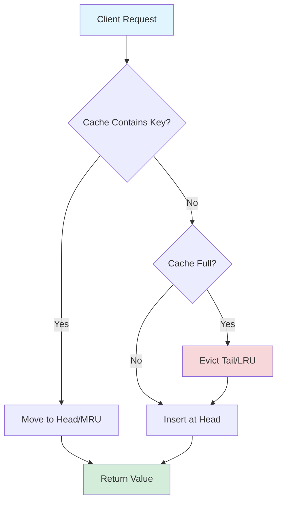
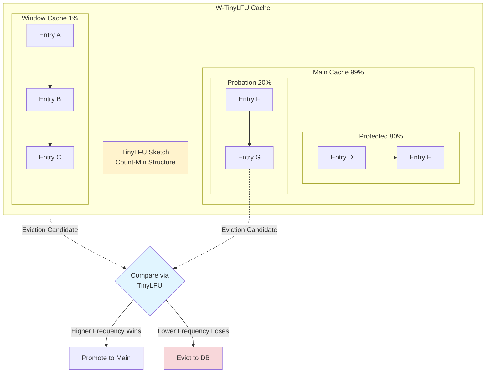

# Eviction Policies: LRU, LFU, FIFO, và Custom Policies

## 1. Mục tiêu của Task

Hiểu sâu bản chất của các thuật toán eviction (thay thế) trong cache:
- **FIFO (First-In-First-Out)**: Thay thế entry cũ nhất
- **LRU (Least Recently Used)**: Thay thế entry ít được truy cập gần đây nhất
- **LFU (Least Frequently Used)**: Thay thế entry có tần suất truy cập thấp nhất
- **Custom Policies**: W-TinyLFU, ARC, và các thuật toán hiện đại

Mục tiêu là nắm vững **cơ chế hoạt động ở tầng thấp**, **trade-off về hit rate**, **chi phí tính toán**, và **khi nào chọn policy nào** cho production workload.

---

## 2. Bản chất và Cơ chế Hoạt động

### 2.1 Tại sao cần Eviction Policy?

**Bản chất vấn đề**: Cache có capacity giới hạn (bộ nhớ RAM). Khi cache đầy và có entry mới, phải quyết định **evict entry nào** để make room.

```
┌─────────────────────────────────────────┐
│              Cache (Capacity = 4)       │
├─────────────────────────────────────────┤
│  A  │  B  │  C  │  D  │  ← Full         │
└─────────────────────────────────────────┘
         ↓ Insert E
┌─────────────────────────────────────────┐
│  ?  │  B  │  C  │  D  │  E  │  ← Evict ? │
└─────────────────────────────────────────┘
         ↑ 
    Policy quyết định
```

**Mục tiêu của eviction policy**: Tối đa hóa **cache hit rate** = Minimize số lần phải query nguồn dữ liệu chậm hơn (DB, disk, network).

> **Khái niệm quan trọng**: Eviction policy là **heuristic** - dự đoán tương lai dựa trên quá khứ. Không có policy nào optimal cho mọi workload.

---

### 2.2 FIFO (First-In-First-Out)

**Bản chất**: Queue-based eviction. Entry nào vào cache trước thì bị evict trước khi cache đầy.

**Cơ chế hoạt động**:
1. Mỗi entry được gắn timestamp khi insert
2. Khi cache đầy, tìm entry có timestamp nhỏ nhất (cũ nhất)
3. Evict entry đó, insert entry mới

**Cấu trúc dữ liệu**:
```
┌─────────────────────────────────────────┐
│  Head (Oldest)                          │
│     ↓                                   │
│  [A] → [B] → [C] → [D]  (Tail: Newest)  │
│                                         │
│  Eviction: Remove Head (A)              │
│  Insert: Add to Tail                    │
└─────────────────────────────────────────┘
```

**Implementation đơn giản**:
- Sử dụng **Queue** (LinkedList) hoặc **circular buffer**
- O(1) cho cả insert và eviction
- Không cần track access pattern

**Bài toán FIFO giải quyết**: Đơn giản, predictable, low overhead.

**Giới hạn FIFO**:
```
Workload: A được truy cập liên tục (hot key)
Cache: [A(old), B, C, D]
Insert E → Evict A (vì A vào trước)
→ Vừa evict hot key! Cache miss ngay sau đó.
```

FIFO **không quan tâm** đến access pattern. Entry có thể được evict dù đang được sử dụng nhiều.

---

### 2.3 LRU (Least Recently Used)

**Bản chất**: Giả định **temporal locality** - entry vừa được truy cập có khả năng cao được truy cập lại.

**Cơ chế hoạt động**:
1. Track thứ tự truy cập của mỗi entry
2. Khi cache đầy, evict entry **lâu nhất không được truy cập**
3. Mỗi lần access (get/put) → đưa entry lên đầu (most recent)

**Cấu trúc dữ liệu - HashMap + Doubly Linked List**:
```
┌─────────────────────────────────────────────┐
│  HashMap<Key, Node>  +  Doubly Linked List  │
├─────────────────────────────────────────────┤
│                                             │
│  MRU (Head)                                 │
│     ↓                                       │
│  [D] ←→ [C] ←→ [B] ←→ [A]                   │
│   ↑                    ↑                    │
│ Most Recent       LRU (Tail - Evict)        │
│                                             │
│  Operations:                                │
│  - Access D: Move D to Head (O(1))          │
│  - Insert E: Add to Head, evict A (O(1))    │
└─────────────────────────────────────────────┘
```

**Chi tiết implementation**:
```java
// Pseudocode cho LRU
class LRUCache<K, V> {
    private final Map<K, Node<K, V>> map;
    private final Node<K, V> head; // MRU
    private final Node<K, V> tail; // LRU
    
    // O(1) Get
    V get(K key) {
        Node<K, V> node = map.get(key);
        if (node == null) return null;
        moveToHead(node);  // Update recency
        return node.value;
    }
    
    // O(1) Put
    void put(K key, V value) {
        if (map.containsKey(key)) {
            // Update existing
            Node<K, V> node = map.get(key);
            node.value = value;
            moveToHead(node);
        } else {
            // Insert new
            if (map.size() >= capacity) {
                evictLRU();  // Remove tail
            }
            Node<K, V> newNode = new Node<>(key, value);
            addToHead(newNode);
            map.put(key, newNode);
        }
    }
    
    void moveToHead(Node<K, V> node) {
        // Remove from current position
        node.prev.next = node.next;
        node.next.prev = node.prev;
        // Add to head
        node.next = head.next;
        node.prev = head;
        head.next.prev = node;
        head.next = node;
    }
}
```

**Time Complexity**: O(1) cho cả get và put.
**Space Complexity**: O(n) cho doubly linked list + hashmap.

**Bài toán LRU giải quyết**: Tận dụng temporal locality, tránh evict hot keys.

**Giới hạn LRU**:
```
Workload: Scan pattern (truy cập tuần tự 1M keys một lần)
Cache size: 1000

Truy cập: K1, K2, K3, ..., K1000, K1001, ..., K1M

LRU behavior:
- K1 đến K1000: Cache fill up
- K1001: Evict K1 (LRU)
- K1002: Evict K2
- ...
→ Cache chứa toàn bộ K1001-K1M, không hit nào!

Đây là "cache pollution" do scan pattern.
```

LRU **không phân biệt** giữa entry được truy cập 1 lần (scan) và entry được truy cập 100 lần (hot).

---

### 2.4 LFU (Least Frequently Used)

**Bản chất**: Giả định **frequency locality** - entry được truy cập nhiều lần trong quá khứ có khả năng cao được truy cập lại.

**Cơ chế hoạt động**:
1. Mỗi entry có **access count** (frequency)
2. Mỗi lần access → increment count
3. Khi cache đầy, evict entry có **count thấp nhất**

**Cấu trúc dữ liệu - Min-Heap + HashMap**:
```
┌─────────────────────────────────────────────┐
│  HashMap<Key, Node>  +  Min-Heap (by freq)  │
├─────────────────────────────────────────────┤
│                                             │
│  Heap (Min-Frequency at root):              │
│                                             │
│       [A:1]  ← Min freq, evict candidate   │
│       /   \                                 │
│   [B:3]  [C:5]                              │
│    /                                         │
│ [D:4]                                       │
│                                             │
│  Operations:                                │
│  - Access B: Increment to 4, heapify O(log n)│
│  - Insert E: Add with freq=1, heapify O(log n)│
│  - Evict: Remove root [A:1], heapify O(log n)│
└─────────────────────────────────────────────┘
```

**Vấn đề cơ bản của LFU đơn thuần**:
```
Vấn đề 1: "Historical baggage"
- Entry A được truy cập 1000 lần trong quá khứ
- Sau đó không được truy cập nữa
- Frequency vẫn = 1000, không bao giờ bị evict
- Chiếm chỗ cho entry B mới (frequency = 1 nhưng đang hot)

Vấn đề 2: "Cache startup"
- Cache mới khởi động
- Tất cả entry đều có frequency = 1
- LFU chọn evict random trong số đó
- Không có cơ chế ưu tiên recent access
```

**LFU không đơn thuần là đủ** cho production.

---

### 2.5 W-TinyLFU (Window Tiny LFU) - Hiện đại

**Bản chất**: Kết hợp LRU (recency) + LFU (frequency) + **aging mechanism**.

Đây là algorithm được sử dụng trong **Caffeine Cache** (Java) - một trong những cache hiệu quả nhất hiện nay.

**Kiến trúc 3 vùng**:
```
┌─────────────────────────────────────────────────────────────┐
│                     W-TinyLFU Architecture                   │
├─────────────────────────────────────────────────────────────┤
│                                                             │
│   ┌──────────────┐        ┌──────────────┐                  │
│   │   Window     │        │   Main       │                  │
│   │   Cache      │        │   Cache      │                  │
│   │  (LRU, 1%)   │        │  (SLRU, 99%) │                  │
│   └──────┬───────┘        └──────┬───────┘                  │
│          │                       │                          │
│          └───────────┬───────────┘                          │
│                      │                                      │
│              ┌───────▼───────┐                              │
│              │  TinyLFU      │                              │
│              │  (Frequency   │                              │
│              │   Sketch)     │                              │
│              └───────────────┘                              │
│                                                             │
└─────────────────────────────────────────────────────────────┘
```

**Các thành phần**:

1. **Window Cache (1% capacity)**:
   - Pure LRU cho recent entries
   - Cho phép new entries có cơ hội prove themselves
   - Tránh "cache startup" problem của LFU

2. **Main Cache (99% capacity)**:
   - Segmented LRU (SLRU) với 2 segments: **Protected** và **Probation**
   - Protected: Entries đã chứng minh value
   - Probation: Entries đang được đánh giá

3. **TinyLFU Sketch**:
   - Count-Min Sketch (probabilistic data structure)
   - Track frequency với **rất ít memory** (4-bit counter per entry)
   - Periodic aging: Decay counts để tránh historical baggage

**Luồng xử lý Insert**:
```
Insert Key X:
1. Add X to Window Cache (LRU)
2. If Window Cache full:
   - Evict victim W from Window
   - Compare W vs Main Cache's probation tail (P)
   - TinyLFU decides: keep W or P based on frequency
   - Winner vào Main Cache probation
   - Loser bị evict hoàn toàn
```

**Luồng xử lý Access**:
```
Access Key X:
1. If X in Window Cache:
   - Update LRU position
   - Increment TinyLFU counter
2. If X in Main Cache (Probation):
   - Promote to Protected segment
   - Increment TinyLFU counter
3. If X in Main Cache (Protected):
   - Update LRU position trong Protected
   - Increment TinyLFU counter
   - Nếu Protected full, demote LRU của Protected xuống Probation
```

**Aging Mechanism**:
```java
// Periodically halve all counters
// Tránh "historical baggage" problem
void age() {
    for (each counter in sketch) {
        counter = counter >> 1;  // Divide by 2
    }
}
```

**Trade-off W-TinyLFU**:
- ✅ Near-optimal hit rate cho đa số workload
- ✅ O(1) operations
- ✅ Low memory overhead (sketch thay vì per-entry counter)
- ❌ Complex implementation
- ❌ Tuning parameters (window size, decay rate)

---

## 3. Kiến trúc và Luồng Xử lý

### 3.1 So sánh Cấu trúc Dữ liệu

| Policy | Data Structure | Get | Put | Evict | Memory Overhead |
|--------|---------------|-----|-----|-------|-----------------|
| **FIFO** | Queue + HashMap | O(1) | O(1) | O(1) | Thấp (timestamp) |
| **LRU** | HashMap + Doubly Linked List | O(1) | O(1) | O(1) | Trung bình (2 pointers) |
| **LFU** | HashMap + Min-Heap | O(log n) | O(log n) | O(log n) | Cao (frequency + heap) |
| **W-TinyLFU** | HashMap + Count-Min Sketch | O(1) | O(1) | O(1) | Thấp (4-bit counter) |

### 3.2 Mermaid Diagram: LRU Operations



### 3.3 Mermaid Diagram: W-TinyLFU Architecture



---

## 4. So sánh các Policy

### 4.1 Workload Analysis

| Workload Pattern | Best Policy | Lý do |
|------------------|-------------|-------|
| **Random access** | LRU/LFU tương đương | Không có locality |
| **Temporal locality** (recent = hot) | LRU | Tận dụng recency |
| **Frequency locality** (popular = hot) | LFU/W-TinyLFU | Track access count |
| **Scan pattern** (sequential) | **None work well** | Cần scan resistance |
| **Bursty access** | W-TinyLFU | Balance recency + frequency |
| **Cache startup** | W-TinyLFU | Window cache cho new entries |

### 4.2 Hit Rate Comparison (Typical)

```
Workload: Zipf distribution (80% accesses đến 20% keys)
Cache Size: 1000 entries

FIFO:  ~45% hit rate
LRU:   ~65% hit rate
LFU:   ~70% hit rate
W-TinyLFU: ~85% hit rate
Optimal (Oracle): ~90% hit rate
```

### 4.3 Trade-off Matrix

| Policy | Hit Rate | Implementation | Memory | CPU | Predictability |
|--------|----------|----------------|--------|-----|----------------|
| FIFO | ⭐⭐ | ⭐⭐⭐⭐⭐ | ⭐⭐⭐⭐⭐ | ⭐⭐⭐⭐⭐ | ⭐⭐⭐⭐⭐ |
| LRU | ⭐⭐⭐⭐ | ⭐⭐⭐⭐ | ⭐⭐⭐⭐ | ⭐⭐⭐⭐⭐ | ⭐⭐⭐ |
| LFU | ⭐⭐⭐⭐ | ⭐⭐ | ⭐⭐ | ⭐⭐ | ⭐⭐⭐ |
| W-TinyLFU | ⭐⭐⭐⭐⭐ | ⭐⭐ | ⭐⭐⭐⭐ | ⭐⭐⭐⭐ | ⭐⭐⭐ |

---

## 5. Rủi ro, Anti-Patterns, và Lỗi Production

### 5.1 LRU Anti-Patterns

**❌ Anti-Pattern: "One-hit wonder" pollution**
```
Scenario: Batch job scan 1M keys, cache size 10K

LRU sẽ giữ lại 10K keys cuối cùng của scan
→ Cache polluted bởi data không bao giờ dùng lại
→ Hit rate = 0% cho subsequent requests

Giải pháp: 
- Dùng W-TinyLFU (chỉ promote nếu frequency > 1)
- Hoặc disable caching cho scan operations
```

**❌ Anti-Pattern: Sequential access pattern**
```
User duyệt news feed: N1, N2, N3, N4, ... (mỗi item 1 lần)

LRU giữ N(last) đến N(last-9999)
Nhưng user không bao giờ quay lại xem lại
→ 100% miss rate

Giải pháp: 
- Phát hiện sequential pattern
- Không cache những entry chỉ được truy cập 1 lần
```

### 5.2 LFU Anti-Patterns

**❌ Anti-Pattern: Historical baggage**
```
T0-T1000: Key A được truy cập 1000 lần (trending)
T1001+:   Key A không còn được truy cập (outdated)
T1001+:   Key B mới bắt đầu trending

LFU: A có freq=1000, B có freq=1
→ A chiếm chỗ mãi mãi, B bị evict liên tục

Giải pháp:
- Aging mechanism (periodic decay)
- Hoặc dùng W-TinyLFU với window cache
```

**❌ Anti-Pattern: Cache startup**
```
Cache vừa restart, tất cả freq = 0
LFU chọn evict arbitrarily
→ Hit rate thấp trong thời gian warmup

Giải pháp:
- Cache warming từ persistent store
- Hoặc dùng LRU trong giai đoạn warmup
```

### 5.3 FIFO Anti-Patterns

**❌ Anti-Pattern: Long-running cache**
```
FIFO không quan tâm access pattern
→ Hot keys có thể bị evict chỉ vì insert sớm

Không nên dùng FIFO cho:
- User session cache
- Frequently accessed config
- Hot data
```

### 5.4 Production Concerns

**⚠️ Memory fragmentation**:
- Linked list implementation gây overhead pointer
- Mỗi entry LRU: +2 pointers (16 bytes trên 64-bit)
- Với 1M entries: +16MB overhead chỉ cho pointers

**⚠️ Concurrency**:
```java
// LRU với synchronized - SCALABILITY NIGHTMARE
public synchronized V get(K key) {  // Global lock!
    // ...
}
// Throughput giảm 10x với 100 threads

// Giải pháp:
- ConcurrentHashMap + StampedLock
- Hoặc dùng Caffeine (already optimized)
```

**⚠️ Cache stampede trên eviction**:
```
T0: Hot key K bị evict
T1: 1000 concurrent requests đến cho K
T2: Cả 1000 đều MISS → Query DB
→ DB overload

Giải pháp:
- Probabilistic early expiration
- Lock per key ( chỉ 1 thread load)
- Stale-while-revalidate
```

---

## 6. Khuyến nghị Thực chiến trong Production

### 6.1 Policy Selection Decision Tree

```
Workload analysis?
├── Read-heavy + Temporal locality (web pages)
│   └── → LRU hoặc W-TinyLFU
├── Mixed read/write + Bursty (API responses)
│   └── → W-TinyLFU
├── Sequential/Scan (analytics, batch)
│   └── → No cache hoặc TTL=0
├── Predictable rotation (logs, time-series)
│   └── → FIFO (đơn giản, predictable)
└── Unknown/Variable
    └── → W-TinyLFU (safest default)
```

### 6.2 Java Implementation Recommendations

**Đừng tự implement LRU/LFU**:
```java
// ❌ Đừng làm: Tự implement LinkedHashMap LRU
public class MyLRU extends LinkedHashMap {
    // Bug-prone, không optimized
}

// ✅ Hãy dùng: Caffeine
Caffeine.newBuilder()
    .maximumSize(10_000)
    .expireAfterWrite(Duration.ofMinutes(10))
    .recordStats()
    .build();
```

**Caffeine Configuration**:
```java
@Configuration
public class CacheConfig {
    
    @Bean
    public Cache<String, User> userCache() {
        return Caffeine.newBuilder()
            // Size-based eviction
            .maximumSize(100_000)
            
            // Time-based eviction (backup)
            .expireAfterWrite(Duration.ofHours(1))
            .expireAfterAccess(Duration.ofMinutes(10))
            
            // Refresh (async reload before expiry)
            .refreshAfterWrite(Duration.ofMinutes(5))
            
            // Async listener
            .removalListener((key, value, cause) -> {
                if (cause == RemovalCause.SIZE) {
                    metrics.recordEviction();
                }
            })
            
            // Stats for monitoring
            .recordStats()
            
            // Build
            .build(key -> loadFromDatabase(key));
    }
}
```

**Monitoring**:
```java
// Expose cache metrics cho Prometheus
CacheStats stats = cache.stats();

meterRegistry.gauge("cache.hit.rate", 
    stats.hitRate());
meterRegistry.gauge("cache.eviction.count", 
    stats.evictionCount());
meterRegistry.gauge("cache.load.time.avg", 
    stats.averageLoadPenalty());

// Alert khi:
// - Hit rate < 90% (có thể cache size quá nhỏ)
// - Eviction rate cao đột biến (workload thay đổi)
// - Load time tăng (DB slow)
```

### 6.3 Redis Eviction Policies

Redis cung cấp nhiều policies:
```
# redis.conf
maxmemory-policy:
- noeviction: Return error khi full
- allkeys-lru: LRU cho tất cả keys
- volatile-lru: LRU chỉ cho keys có TTL
- allkeys-lfu: LFU cho tất cả keys (Redis 4.0+)
- volatile-lfu: LFU cho keys có TTL
- allkeys-random: Random eviction
- volatile-random: Random cho keys có TTL
- volatile-ttl: Evict key có TTL sắp hết
```

**Recommendation**:
```
Use case: Cache (có thể reconstruct từ DB)
→ allkeys-lru hoặc allkeys-lfu

Use case: Session store (phải có TTL)
→ volatile-lru

Không bao giờ dùng noeviction cho cache!
→ OOM kill khi memory full
```

### 6.4 Tuning Guidelines

**Cache Size Tuning**:
```
1. Start với estimated working set size
2. Monitor hit rate
3. Nếu hit rate < 80% → Tăng cache size
4. Nếu hit rate > 99% → Có thể giảm cache size (tiết kiệm memory)

Optimal hit rate target: 90-95%
```

**W-TinyLFU Specific Tuning**:
```java
// Caffeine: Window size tuning
Caffeine.newBuilder()
    // Mặc định window = 1% of maximum
    // Tăng nếu workload có nhiều "new hot" items
    // Giảm nếu workload ổn định
    
    // Custom (through CaffeineSpec):
    .from("maximumSize=10000,expireAfterAccess=10m")
    .build();
```

---

## 7. Kết luận

### Bản chất cốt lõi:

| Policy | Heuristic | Bài toán giải quyết | Giới hạn |
|--------|-----------|---------------------|----------|
| **FIFO** | Insert time | Đơn giản, predictable | Không xử lý locality |
| **LRU** | Recency | Temporal locality | One-hit wonder pollution |
| **LFU** | Frequency | Popularity tracking | Historical baggage |
| **W-TinyLFU** | Recency + Frequency + Aging | Near-optimal cho đa số workload | Complex implementation |

### Quyết định kiến trúc:

> **Default choice cho Java**: Sử dụng **Caffeine** với W-TinyLFU. Nó cung cấp hit rate tốt nhất cho đa số workload với O(1) operations.

> **Khi đơn giản là cần thiết**: LRU implementation đơn giản (LinkedHashMap) cho small caches (< 1000 entries).

> **Khi predictability quan trọng hơn hit rate**: FIFO cho time-series data hoặc log rotation.

### Nguyên tắc vàng:

1. **Đừng tự implement eviction policy** - Dùng thư viện battle-tested (Caffeine, Redis)
2. **Monitor hit rate** - Target 90-95%, điều chỉnh cache size
3. **Phân biệt cache types**:
   - Lookup cache (user by ID) → W-TinyLFU
   - Time-series cache (recent events) → TTL + FIFO
   - Computed cache (expensive calculations) → LRU
4. **Chuẩn bị cho eviction** - Cache miss phải handle gracefully
5. **Test với realistic workload** - Synthetic benchmarks không đại diện production

### Cập nhật hiện đại (2024):

- **Caffeine 3.0**: W-TinyLFU mặc định, cải thiện 10-15% hit rate so với LRU
- **Redis 7.0**: LFU với configurable decay time
- **Java 21**: Virtual threads không ảnh hưởng đến cache internals nhưng cho phép nhiều concurrent cache operations
- **Off-heap caches**: Chronicle Map, OHC cho caches lớn (GB+) không pressure GC

---

## 8. References

- [Caffeine Cache: Design & Benchmarks](https://github.com/ben-manes/caffeine/wiki/Design)
- [TinyLFU Paper: A Highly Efficient Cache Admission Policy](https://dl.acm.org/doi/10.1145/2514229)
- [Redis Documentation: Using Redis as an LRU cache](https://redis.io/docs/manual/eviction/)
- [W-TinyLFU: Wikipedia](https://en.wikipedia.org/wiki/Cache_replacement_policies#W-TinyLFU)
- [ARC: Adaptive Replacement Cache](https://www.usenix.org/conference/fast-03/adaptive-replacement-cache)
