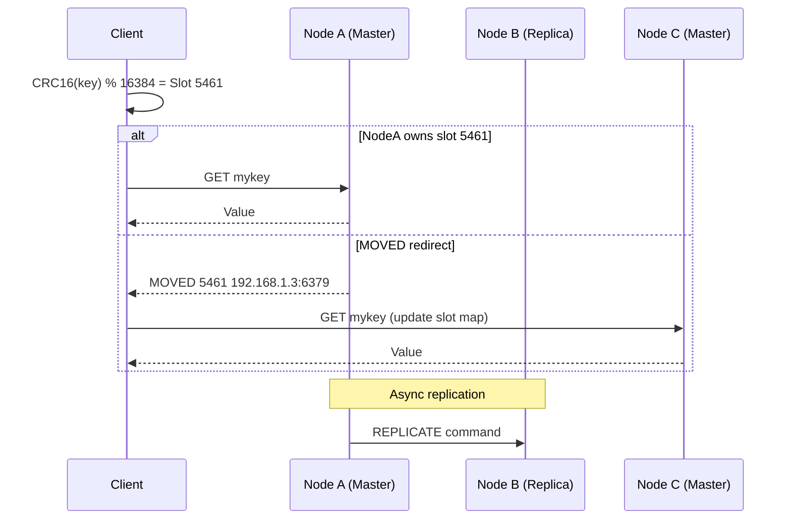
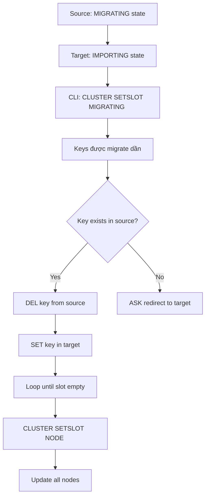
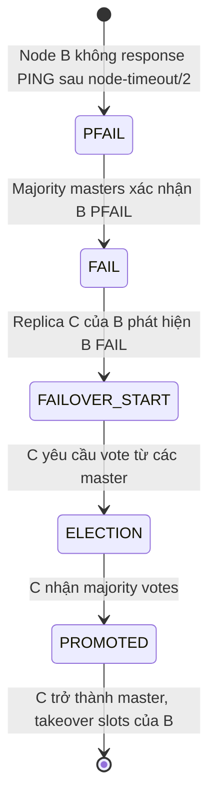
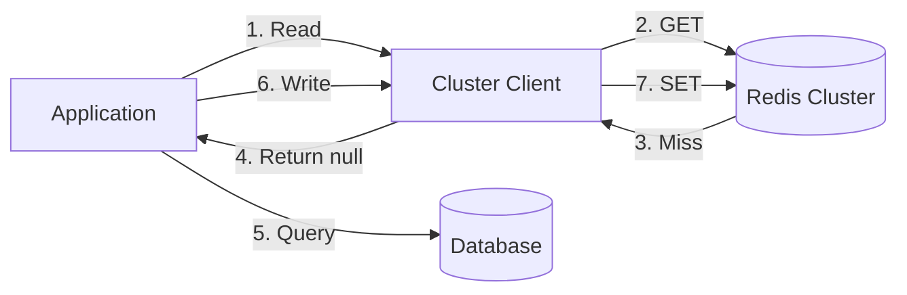

# Distributed Caching: Redis Cluster & Consistent Hashing

## 1. Mục tiêu của task

Hiểu sâu bản chất của distributed caching, tập trung vào:
- Cơ chế phân chia dữ liệu (sharding) trong Redis Cluster
- Thuật toán Consistent Hashing và vai trò trong distributed cache
- Trade-off giữa các chiến lược phân phối dữ liệu
- Rủi ro production và cách vận hành thực tế

---

## 2. Bản chất và cơ chế hoạt động

### 2.1 Vấn đề cốt lõi của Distributed Cache

Khi cache vượt quá giới hạn một node, ta phải phân chia dữ liệu. Vấn đề then chốt là **"key nào đi đâu"** và **"điều gì xảy ra khi cluster thay đổi"**.

Bản chất của distributed caching không chỉ là "nhiều Redis instance" mà là **quản lý namespace phân tán với consistency và availability có thể điều chỉnh**.

### 2.2 Redis Cluster Architecture

#### Slot-Based Sharding (16384 slots)

Redis Cluster không dùng consistent hashing truyền thống. Thay vào đó, nó dùng **fixed hash slots**:

```
Key → CRC16(key) % 16384 → Slot (0-16383) → Node
```

**Tại sao là 16384 slots?**

| Yếu tố | Giải thích |
|--------|-----------|
| 2^14 = 16384 | Vừa đủ lớn để phân phối đều, vừa đủ nhỏ để bitmap chỉ 2KB |
| Bitmap trong cluster bus | Mỗi node cần biết slot ownership của các node khác. 16384 slots = 2KB bitmap |
| Node limit thực tế | 1000 nodes là giới hạn thực tế. 16384 slots cho phép ~16 slots/node trung bình |
| CRC16 coverage | CRC16 cho ra 16-bit value, % 16384 lấy 14 bit |

> **Quan trọng:** 16384 không phải số magic. Nó là đánh đổi giữa granularity của phân phối và overhead của cluster metadata.

#### Cấu trúc Cluster Bus

Mỗi node Redis Cluster mở thêm một port (default + 10000) cho **cluster bus** - binary protocol riêng cho node-to-node communication:

- **PING/PONG**: Heartbeat và failure detection
- **UPDATE**: Thông báo slot migration  
- **PUBLISH**: Message propagation trong cluster

**Gossip Protocol:**
- Mỗi node gửi PING tới random subset của các node khác mỗi 100ms
- Thông tin về node state, slot ownership lan tỏa qua gossip
- `cluster-node-timeout` (default 15s) quyết định khi nào node bị đánh dấu FAIL

### 2.3 Consistent Hashing - Cơ chế và Ứng dụng

#### Bài toán của Traditional Hashing

```
hash(key) % N → node
```

Khi N thay đổi (thêm/xóa node), **hầu hết keys đều remap** → cache miss mass.

#### Consistent Hashing Ring

**Cơ chế:**
- Hash space: 0 đến 2^32-1 (hoặc 2^160) tạo thành một vòng tròn
- Cả keys và nodes đều được map lên ring bằng cùng hash function
- Key được gán cho node **đầu tiên theo chiều kim đồng hồ**

```
Ring visualization:

     0° (0)
      |
 270° ———— 90°
      |
    180°

Nodes: N1(45°), N2(135°), N3(225°), N4(315°)
Keys: K1(30°)→N1, K2(100°)→N2, K3(200°)→N3, K4(300°)→N4
```

**Tính chất quan trọng:**
- Khi thêm node mới: chỉ keys trong khoảng của node mới bị remap
- Khi xóa node: keys của node đó chuyển sang node kế tiếp
- **Expected keys to remap = 1/N** (với N = số nodes)

#### Virtual Nodes (Vnodes)

**Vấn đề:** Với ít nodes, phân phối có thể không đều.

**Giải pháp:** Mỗi physical node được đại diện bởi nhiều virtual nodes trên ring:

```
Physical Node A → Vnodes: A#1, A#2, A#3, ..., A#150
Physical Node B → Vnodes: B#1, B#2, B#3, ..., B#150
```

Với 150 vnodes/node và 10 nodes = 1500 điểm trên ring → phân phối gần như đều.

**Trade-off của vnodes:**

| Lợi ích | Chi phí |
|---------|---------|
| Phân phối đều hơn | Tăng metadata size (cần lưu mapping vnode→physical) |
| Recovery song song | Nhiều node tham gia rebuild khi 1 node chết |
| Rebalancing tinh vi hơn | Complexity của ring maintenance tăng |

#### Rendezvous Hashing (HRW - Highest Random Weight)

Alternative với consistent hashing:

```
for each node in nodes:
    score = hash(node_id + key)
    if score > max_score:
        max_score = score
        selected_node = node
```

**Ưu điểm:**
- Không cần ring structure
- Khi thêm node: chỉ 1/N keys remap (giống consistent hashing)
- Deterministic, không cần state

**Nhược điểm:**
- O(N) để tìm node (consistent hashing là O(log N) với binary search)
- Với N lớn (>1000), consistent hashing hiệu quả hơn

**Ứng dụng:** Memcached clients (spymemcached, FNV hash), some CDN load balancers.

---

## 3. Kiến trúc & Luồng xử lý

### 3.1 Redis Cluster Request Flow



### 3.2 Slot Migration Process

Khi resharding (di chuyển slots giữa nodes):



**Chi tiết quan trọng:**
- **MIGRATING state:** Slot vẫn thuộc source, nhưng keys mới sẽ được tạo ở target
- **ASK redirect:** Tạm thời redirect, client không cập nhật slot map vĩnh viễn (khác với MOVED)
- **Atomicity:** Không có transaction cross-slot. Migration là incremental.

### 3.3 Failure Detection & Failover



**Epoch mechanism:**
- Mỗi event (failover, config update) tăng **currentEpoch** cluster-wide
- Node với higher epoch "wins" trong conflict
- Đảm bảo consistency khi network partition xảy ra

---

## 4. So sánh các lựa chọn

### 4.1 Redis Cluster vs Redis Sentinel vs Standalone

| Aspect | Standalone | Sentinel | Cluster |
|--------|-----------|----------|---------|
| **Sharding** | Không | Không | Có (16384 slots) |
| **Replication** | Async | Async | Async |
| **Failover** | Manual | Tự động | Tự động |
| **Write scalability** | Không | Không | Có (multi-master) |
| **Memory limit** | Single node | Single node | Sum of all nodes |
| **Complexity** | Thấp | Trung bình | Cao |
| **Cross-slot operations** | N/A | N/A | Không hỗ trợ (mostly) |
| **Use case** | Cache nhỏ | HA cho cache nhỏ | Cache lớn, phân tán |

### 4.2 Consistent Hashing vs Slot-Based Sharding

| Tiêu chí | Consistent Hashing | Redis Slot-Based |
|----------|-------------------|------------------|
| **Remapping khi add node** | 1/N keys | Explicit migration |
| **Rebalancing control** | Khó kiểm soát | Precise (slot-level) |
| **Hot spot handling** | Cần virtual nodes | Manual (move slots) |
| **Client complexity** | Phải implement ring | Cluster-aware hoặc proxy |
| **Multi-key operations** | Không guarantee cùng node | Cùng slot = cùng node |
| **Flexibility** | Cao (bất kỳ client nào) | Phụ thuộc Redis protocol |

### 4.3 Hashing Algorithms trong Production

| Algorithm | Pros | Cons | Use Case |
|-----------|------|------|----------|
| **CRC16** (Redis) | Fast, đủ ngẫu nhiên | Collision possible (không quan trọng cho slotting) | Redis Cluster |
| **Murmur3** | Excellent distribution, fast | Không cryptographically secure | Cassandra, HBase |
| **FNV-1a** | Simple, fast | Worse distribution than Murmur3 | Memcached clients |
| **MD5/SHA** | Cryptographically secure | Chậm | Security-sensitive, không cho cache |

---

## 5. Rủi ro, Anti-patterns, Lỗi thường gặp

### 5.1 Redis Cluster Pitfalls

#### Hot Key Problem

```
Scenario: "user:1000:profile" được truy cập 10000 req/s
→ Node chứa slot đó bị quá tải
```

**Giải pháp:**
- Local cache trước Redis (Caffeine/Guava)
- Key replication (thêm suffix _1, _2, _3 để phân tán)
- Read replicas (nhưng Redis Cluster replica chỉ cho failover, không cho read scaling mặc định)

> **Quan trọng:** Redis Cluster replicas by default chỉ dùng cho HA, không cho read distribution. Muốn read scaling phải explicitly read từ replica với `READONLY` mode.

#### Cross-Slot Operations

```java
// LỖI: KEYS trong slots khác nhau
redis.mget("user:1000", "user:2000"); 
// CRC16("user:1000") % 16384 = Slot A
// CRC16("user:2000") % 16384 = Slot B
// → (error) CROSSSLOT Keys in request don't hash to the same slot

// GIẢI PHÁP: Hash tag
redis.mget("user:{1000}", "user:{2000}");
// CRC16("1000") % 16384 cho cả hai
```

**Hash Tag:** Phần trong `{}` được dùng để tính hash. Cho phép điều khiển slot assignment.

#### Split-Brain trong Cluster

Khi network partition xảy ra:
- Minority partition: nodes chuyển sang FAIL state
- Majority partition: có thể promote replica
- Khi partition heal: **node với higher epoch wins**, data từ lower epoch bị drop

**Prevention:**
- `min-slaves-to-write` và `min-slaves-max-lag`
- Proper `cluster-node-timeout` tuning
- Monitoring: `cluster_state:fail`

### 5.2 Consistent Hashing Anti-patterns

#### Không dùng Virtual Nodes

Với < 10 physical nodes, distribution có thể lệch 30-40%.

#### Không xử lý Node Weights

Nodes có capacity khác nhau (4GB vs 16GB RAM) nên được assigned số vnodes tương ứng.

#### Ring Rebuild Blocking

Khi ring thay đổi, một số implementation rebuild toàn bộ ring → pause. Cần incremental update.

### 5.3 Production Failures

| Symptom | Root Cause | Detection |
|---------|-----------|-----------|
| Latency spike | Hot key, slow query, or resharding | `slowlog`, `info stats` |
| Connection churn | MOVED storm (client không cache slot map) | Client metrics |
| Memory bloat | Không set TTL, hoặc hash table growth | `info memory`, `memory usage key` |
| Replication lag | High write throughput | `info replication` |
| Failover loop | `cluster-node-timeout` quá ngắn | Cluster logs |

---

## 6. Khuyến nghị thực chiến trong Production

### 6.1 Redis Cluster Sizing

```
Master nodes: 3-6 (đủ cho hầu hết use cases)
Replicas per master: 1 (hoặc 2 cho critical data)
Total nodes: 6-18
```

**Không cần nhiều master:**
- 3 masters × 5GB = 15GB total, HA tốt
- 10 masters × 1.5GB = 15GB total, phức tạp hơn, không lợi ích rõ ràng

### 6.2 Client Configuration (Java - Lettuce/Redisson)

```java
// Lettuce - Adaptive topology refresh
ClientOptions options = ClientOptions.builder()
    .socketOptions(SocketOptions.builder()
        .connectTimeout(Duration.ofSeconds(5))
        .build())
    .timeoutOptions(TimeoutOptions.enabled(Duration.ofSeconds(5)))
    .build();

ClusterTopologyRefreshOptions refreshOptions = ClusterTopologyRefreshOptions.builder()
    .enableAdaptiveRefreshTrigger(
        ClusterTopologyRefreshOptions.RefreshTrigger.MOVED_REDIRECT,
        ClusterTopologyRefreshOptions.RefreshTrigger.PERSISTENT_RECONNECTS
    )
    .adaptiveRefreshTimeout(Duration.ofSeconds(30))
    .build();

RedisClusterClient client = RedisClusterClient.create(redisUri);
client.setOptions(ClusterClientOptions.builder()
    .topologyRefreshOptions(refreshOptions)
    .validateClusterNodeMembership(false) // Cẩn thận với security
    .build());
```

**Adaptive refresh:** Tự động cập nhật slot map khi nhận MOVED redirect → giảm MOVED storm.

### 6.3 Monitoring Checklist

**Cluster health:**
```bash
redis-cli -p 6379 CLUSTER INFO | grep -E "cluster_state|cluster_slots|cluster_known_nodes"
# cluster_state:ok
# cluster_slots_assigned:16384
# cluster_slots_ok:16384
```

**Key metrics:**
- `used_memory` / `maxmemory` (có eviction policy không?)
- `instantaneous_ops_per_sec` per node (hot spot detection)
- `replication_lag` (seconds)
- `cluster_connections` (quá nhiều = client không dùng connection pooling)

### 6.4 Deployment Patterns

#### Pattern 1: Cache-Aside với Cluster



**Lưu ý:** Write phải qua cùng một code path để đảm bảo format consistency.

#### Pattern 2: Write-Through Proxy

Twemproxy hoặc Envoy làm proxy → đơn giản hóa client, nhưng thêm hop và single point of contention.

**Trade-off:**
- **Direct client:** Lower latency, complex client config, client phải handle MOVED
- **Proxy:** Higher latency, simpler client, proxy là bottleneck

### 6.5 Data Consistency Considerations

Redis Cluster provides **eventual consistency**:
- Async replication → data loss window khi failover
- `wait` command: Đợi N replicas acknowledge (nhưng ảnh hưởng latency)

**For critical data:**
```
SET key value
WAIT 1 100  # Đợi tối đa 100ms cho 1 replica ack
```

---

## 7. Kết luận

**Bản chất cốt lõi:**

Redis Cluster giải quyết bài toán distributed cache bằng **slot-based deterministic mapping** thay vì consistent hashing. Điều này cho phép:
1. **Explicit control:** Migration và rebalancing chính xác
2. **Bounded metadata:** 16384 slots là đủ nhỏ để gossip hiệu quả
3. **Operation grouping:** Multi-key operations trong cùng slot

**Consistent hashing** vẫn có giá trị trong:
- Client-side sharding (khi không dùng Redis Cluster)
- Load balancing layers (ngang hàng với caching)
- Systems yêu cầu minimal remapping (Cassandra, CDN)

**Trade-off quan trọng nhất:**
> Redis Cluster đánh đổi **operational complexity** lấy **horizontal scalability và HA**. Nếu cache < 10GB và throughput < 50k ops/s, Sentinel hoặc thậm chí standalone với proper monitoring có thể là lựa chọn pragmatic hơn.

**Rủi ro lớn nhất:**
> **Hot key và cross-slot operations** là hai nguyên nhân phổ biến nhất của incident production. Design schema với hash tags, và luôn có local cache layer cho keys được truy cập > 1000 req/s.

---

## 8. Code Reference (Minimal)

### CRC16 Implementation (Redis compatible)

```java
public class RedisCRC16 {
    private static final int[] CRC16_TABLE = {
        0x0000, 0x1021, 0x2042, 0x3063, // ... truncated for brevity
    };
    
    public static int crc16(byte[] bytes) {
        int crc = 0;
        for (byte b : bytes) {
            crc = ((crc << 8) & 0xffff) ^ CRC16_TABLE[((crc >>> 8) ^ b) & 0xff];
        }
        return crc;
    }
    
    public static int getSlot(String key) {
        // Extract hash tag if exists
        int start = key.indexOf('{');
        if (start != -1) {
            int end = key.indexOf('}', start);
            if (end != -1 && end != start + 1) {
                key = key.substring(start + 1, end);
            }
        }
        return crc16(key.getBytes(StandardCharsets.UTF_8)) & 0x3FFF; // % 16384
    }
}
```

**Ý nghĩa:** Client có thể pre-compute slot để route đúng node, giảm MOVED redirects.

### Simple Consistent Hash Ring

```java
public class ConsistentHashRing {
    private final TreeMap<Integer, String> ring = new TreeMap<>();
    private final int virtualNodes;
    
    public void addNode(String node) {
        for (int i = 0; i < virtualNodes; i++) {
            int hash = hash(node + i);
            ring.put(hash, node);
        }
    }
    
    public String getNode(String key) {
        if (ring.isEmpty()) return null;
        int hash = hash(key);
        Map.Entry<Integer, String> entry = ring.ceilingEntry(hash);
        return entry != null ? entry.getValue() : ring.firstEntry().getValue();
    }
}
```

**Lưu ý:** Production implementation cần xử lý concurrent access, node removal, và weighting.
