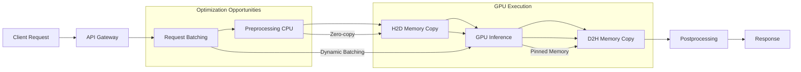

# GPU Computing in Backend: CUDA, AI Inference và Microservices Acceleration

## 1. Mục tiêu của Task

Hiểu sâu bản chất GPU computing trong backend systems, từ kiến trúc phần cứng đến integration patterns trong microservices. Tập trung vào:
- CUDA programming model và memory hierarchy
- AI inference optimization và serving patterns
- GPU memory management trong containerized environments
- Trade-offs giữa CPU vs GPU cho các workload khác nhau

---

## 2. Bản Chất và Cơ Chế Hoạt Động

### 2.1 Tại Sao GPU Khác Biệt Với CPU?

| Aspect | CPU | GPU |
|--------|-----|-----|
| **Architecture** | Few powerful cores (8-64), complex control unit | Thousands of simple cores (thousands), minimal control logic |
| **Optimization** | Latency-oriented: minimize time for single task | Throughput-oriented: maximize total work per unit time |
| **Memory** | Large cache hierarchy (L1/L2/L3), low latency | Small cache, high-bandwidth global memory (HBM2/HBM3) |
| **Clock Speed** | 3-5 GHz | 1-2 GHz |
| **Best For** | Sequential logic, branching, complex algorithms | Data-parallel operations, matrix math, bulk processing |

**Bản chất vấn đề:** GPU áp dụng **Single Instruction Multiple Thread (SIMT)** - một lệnh được thực thi đồng thởi bởi hàng nghìn threads. Điều này tạo ra throughput khổng lồ cho data-parallel workloads nhưng trở thành bottleneck với control-divergent code (nhiều if/else branches).

### 2.2 CUDA Execution Model: Từ Grid đến Thread

```
Grid (1D/2D/3D)
├── Block (0,0)          Block (1,0)         Block (2,0)
│   ├── Warp 0 (32 threads)    Warp 0            Warp 0
│   ├── Warp 1 (32 threads)    Warp 1            Warp 1
│   └── ...                    ...               ...
│   └── Warp N                 Warp N            Warp N
└── Shared Memory per Block

SM (Streaming Multiprocessor) - Physical execution unit
├── 4 Warp Schedulers
├── Register File (64K+ registers)
├── Shared Memory (configurable: 16-100KB)
├── L1 Cache / Texture Cache
└── Execution units (INT32, FP32, FP64, Tensor Cores)
```

**Quan trọng:** Threads trong cùng một warp (32 threads) thực thi **lock-step**. Nếu threads diverge (một nửa đi nhánh if, một nửa đi else), warp phải serialize - chạy từng nhánh riêng biệt, giảm efficiency 50%.

### 2.3 GPU Memory Hierarchy: Hiểu Để Tối Ưu

| Memory Type | Latency | Bandwidth | Scope | Lifetime | Best Use Case |
|-------------|---------|-----------|-------|----------|---------------|
| **Registers** | 1 cycle | 8-20 TB/s | Thread | Thread | Frequently accessed scalars |
| **Shared Memory** | ~20 cycles | 10-20 TB/s | Block | Block | Inter-thread communication, tile data |
| **L2 Cache** | ~200 cycles | 2-4 TB/s | GPU | Kernel | Reused data across blocks |
| **Global Memory** | ~400 cycles | 1-2 TB/s | Grid | Application | Large datasets, input/output |
| **Unified Memory** | Variable | Same as Global | Grid + CPU | Application | Simplified programming, cost is migration overhead |

**Critical Insight:** Global memory access pattern quyết định performance. **Coalesced access** (threads liên tiếp truy cập địa chỉ liên tiếp) → 1 transaction. **Strided/scattered access** → N transactions.

```
Coalesced (Good):    Thread 0 → addr 0, Thread 1 → addr 4, Thread 2 → addr 8...
Strided (Bad):       Thread 0 → addr 0, Thread 1 → addr 1024, Thread 2 → addr 2048...
```

### 2.4 Kernel Launch Overhead và Async Execution

CUDA operations là **asynchronous** theo default:
1. Kernel launch returns immediately (non-blocking)
2. Host tiếp tục execute trong khi GPU chạy kernel
3. `cudaDeviceSynchronize()` hoặc memory copy blocking để đợi completion

**Latency numbers quan trọng:**
- Kernel launch overhead: ~5-10 microseconds
- PCI-e copy (H2D): ~10-20 GB/s (bottleneck lớn)
- NVLink (DGX/HGX): ~300-600 GB/s (server-grade only)

> ⚠️ **Pitfall phổ biến:** Launch nhiều kernels nhỏ liên tiếp → overhead tích lũy, GPU under-utilized. Solution: Kernel fusion hoặc CUDA Graphs.

---

## 3. Kiến Trúc và Luồng Xử Lý

### 3.1 AI Inference Pipeline: End-to-End Flow



### 3.2 Dynamic Batching: Tối Ưu Throughput

**Vấn đề:** Single inference request không saturate GPU. Tensor Cores cần large matrices để đạt peak performance.

**Giải pháp:** Dynamic Batching - accumulate requests trong window ngắn (5-50ms), batch together.

```
Static Processing:    [A]→[B]→[C]→[D]  = 4 kernel launches, 4 memory transfers
Dynamic Batching:     [A,B,C,D]→→→→  = 1 kernel launch, 1 memory transfer
                      (batch_size=4)
```

**Trade-offs:**
- Throughput ↑↑ (linear với batch size)
- Latency ↑ (p99 latency tăng do waiting window)
- Memory ↑ (peak usage tăng)

**Implementation patterns:**
- **Triton Inference Server:** Built-in dynamic batching, queue management
- **TensorFlow Serving:** Batch parameters configurable
- **Custom:** Thread pool + condition variable + timeout

### 3.3 GPU Memory Management trong Microservices

**Challenge:** GPU memory không chia sẻ giữa processes như CPU. Mỗi container cần exclusive GPU access hoặc time-slicing.

| Strategy | Mechanism | Pros | Cons |
|----------|-----------|------|------|
| **Exclusive Mode** | 1 container = 1 GPU | Full performance, isolation | Low utilization, expensive |
| **Time-slicing** | NVIDIA Time-slicing (vGPU) | Better utilization, multi-tenant | Context switch overhead |
| **MPS** | Multi-Process Service | True concurrency, shared context | Limited fault isolation |
| **MIG** | Multi-Instance GPU (A100+) | Hardware partitioning, QoS | Fixed partition sizes |

**MIG (Multi-Instance GPU) Deep Dive:**
A100 80GB có thể chia thành:
- 7× 10GB instances (each with dedicated compute + memory)
- 3× 20GB + 1× 20GB
- Các combination khác tùy need

MIG instances là **hardware-isolated** - failure trong một instance không ảnh hưởng others. Phù hợp production multi-tenancy.

### 3.4 Container Integration: Docker + Kubernetes

**Device Plugin Architecture:**
```yaml
# Pod spec example
resources:
  limits:
    nvidia.com/gpu: 1  # Request 1 GPU
    nvidia.com/mig-3g.20gb: 1  # Request specific MIG profile
```

**Runtime Considerations:**
- **CUDA Toolkit:** Must match driver version (backward compatible, not forward)
- **cuDNN:** Version-sensitive với model framework
- **TensorRT:** Optimization requires target GPU architecture (sm_80 vs sm_86)

> **Version Matrix Complexity:**
> - Driver 525.85 → CUDA 12.0 compatible
> - PyTorch 2.1 → CUDA 11.8 or 12.1
> - TensorRT 8.6 → CUDA 11.x hoặc 12.x
> - Alignment failures → cryptic runtime errors

---

## 4. So Sánh Các Lựa Chọn

### 4.1 CUDA vs OpenCL vs ROCm

| Aspect | CUDA (NVIDIA) | OpenCL | ROCm (AMD) |
|--------|---------------|--------|------------|
| **Ecosystem** | Dominant, mature | Cross-platform, fragmented | Growing, Linux-focused |
| **AI Frameworks** | PyTorch, TF first-class | Limited support | PyTorch, TF có support |
| **Performance** | Optimized libraries | Variable | Competitive với CUDA |
| **Hardware Lock-in** | Yes | No | AMD only |
| **Cloud Support** | Universal | Limited | AWS, on-prem |

**Recommendation:** CUDA cho production AI workloads (ecosystem advantage quá lớn). OpenCL nếu cần cross-platform portability. ROCm nếu cost-sensitive và control hardware.

### 4.2 Inference Frameworks: TensorRT vs ONNX Runtime vs vLLM

| Framework | Best For | Optimization | Throughput | Latency |
|-----------|----------|--------------|------------|---------|
| **TensorRT** | Production NVIDIA | Graph optimization, FP16/INT8, kernel fusion | ⭐⭐⭐⭐⭐ | ⭐⭐⭐⭐⭐ |
| **ONNX Runtime** | Cross-platform, portability | Generic optimizations, NVIDIA EP available | ⭐⭐⭐⭐ | ⭐⭐⭐⭐ |
| **vLLM** | LLM serving | PagedAttention, continuous batching | ⭐⭐⭐⭐⭐ | ⭐⭐⭐⭐ |
| **Triton + TensorRT** | Enterprise microservices | Dynamic batching, ensemble models | ⭐⭐⭐⭐⭐ | ⭐⭐⭐⭐ |

**TensorRT Optimization Pipeline:**
```
ONNX Model
    ↓
TensorRT Builder
    ├── Layer Fusion (conv+bn+relu)
    ├── Precision Calibration (FP32 → FP16/INT8)
    ├── Kernel Auto-tuning
    └── Memory Optimization
    ↓
Serialized Engine (.plan file)
```

**Trade-off của INT8 Quantization:**
- Throughput: ↑ 2-4x
- Memory: ↓ 50%
- Accuracy: ~1-2% drop (task-dependent)
- Calibration: Cần representative dataset

### 4.3 CPU vs GPU Decision Matrix

| Workload Characteristic | Preferred | Rationale |
|------------------------|-----------|-----------|
| High branching, sequential logic | CPU | GPU divergence kills performance |
| Large matrix operations (GEMM) | GPU | Tensor Cores provide 10-100x speedup |
| Small batch inference (< 8) | CPU | PCIe transfer overhead dominates |
| Large batch inference (> 32) | GPU | Throughput scaling linear |
| Latency-sensitive, p99 < 10ms | CPU hoặc GPU persistent | Kernel launch + transfer overhead |
| Memory bandwidth bound | GPU | 10x memory bandwidth advantage |

---

## 5. Rủi Ro, Anti-Patterns và Lỗi Thường Gặp

### 5.1 Anti-Pattern: Synchronous H2D → Kernel → D2H per Request

**Bad Pattern:**
```python
for request in requests:
    cudaMemcpyH2D(input)      # Blocking
    launchKernel()            # Blocking
    cudaMemcpyD2H(output)     # Blocking
    return response
```

**Problem:** PCIe transfer và kernel execution không overlap → GPU idle 50-70% thởi gian.

**Solution - CUDA Streams:**
```python
# 3 requests interleaved trên 3 streams
for i, request in enumerate(requests):
    stream = streams[i % 3]
    cudaMemcpyH2DAsync(input, stream)
    launchKernelAsync(stream)
    cudaMemcpyD2HAsync(output, stream)

# Synchronize all
for stream in streams:
    stream.synchronize()
```

### 5.2 Anti-Pattern: GPU Memory Leak trong Long-Running Services

**Common Causes:**
- PyTorch: `torch.cuda.empty_cache()` không được gọi
- TensorFlow: Session không được reset
- Custom CUDA: `cudaMalloc` without `cudaFree`

**Symptom:** Gradual memory growth, OOM after hours/days.

**Monitoring:**
```bash
nvidia-smi dmon -s mu  # Monitor memory utilization
# Hoặc trong code:
torch.cuda.memory_allocated() / 1024**3  # GB used
torch.cuda.memory_reserved() / 1024**3   # GB reserved
```

### 5.3 Anti-Pattern: Wrong Thread Configuration

**CUDA Grid/Block configuration matters:**
- Block size nên là multiple of 32 (warp size)
- Threads per block: 128-512 thường optimal
- Occupancy: Số warps / SM nên maximize (hide latency)

**Pitfall:** Too few blocks → SM under-utilized. Too many threads per block → registers spill to local memory.

### 5.4 Failure Modes trong Production

| Failure | Cause | Detection | Mitigation |
|---------|-------|-----------|------------|
| **OOM Kill** | Memory growth, large batch | nvidia-smi, container metrics | Dynamic batch size limiting, memory pools |
| **Thermal Throttling** | Poor cooling, sustained load | nvidia-smi -q -d TEMPERATURE | Throttling logic, cooling alerts |
| **ECC Errors** | Memory bit flips (rare) | NVML ECC error counters | Page retirement, GPU replacement |
| **CUDA Error 700** | Illegal memory access | Application crash | Bounds checking, debugging build |
| **Hang/Timeout** | Infinite loop, deadlock | Watchdog timeout (TDR) | Kernel timeout, watchdog disable |

---

## 6. Khuyến Nghị Thực Chiến trong Production

### 6.1 Architecture Patterns

**Pattern 1: GPU Worker Pool với Queue**
```
API Gateway → Redis/RabbitMQ Queue → GPU Worker Pool (N pods)
                                    ├── Dynamic batching
                                    ├── Health checks
                                    └── Circuit breaker
```

**Pattern 2: Sidecar GPU Container**
```yaml
# Main app (CPU) + GPU sidecar pattern
containers:
  - name: api-server
    resources: { cpu: 4, memory: 8Gi }
  - name: inference-engine
    resources: { nvidia.com/gpu: 1 }
    # Communicate via localhost: gRPC/HTTP
```

**Pattern 3: Dedicated GPU Node Pool**
```yaml
# Node selector để isolate GPU workloads
nodeSelector:
  node-type: gpu-enabled
tolerations:
  - key: nvidia.com/gpu
    operator: Exists
```

### 6.2 Observability Stack

**Metrics cần monitor:**
- `nvidia_gpu_utilization` - GPU compute utilization
- `nvidia_gpu_memory_used_bytes` - Memory pressure
- `nvidia_gpu_temperature` - Thermal status
- `inference_latency_p99` - Service level indicator
- `inference_batch_size` - Batching effectiveness
- `queue_wait_time` - Request queuing

**Tools:**
- **DCGM (Data Center GPU Manager):** NVIDIA's official monitoring
- **Prometheus + Grafana:** Standard metric pipeline
- **Jaeger/Tempo:** Distributed tracing cho inference requests

### 6.3 Performance Tuning Checklist

**Pre-deployment:**
- [ ] TensorRT optimization với target precision (FP16/INT8)
- [ ] Calibration dataset đại diện cho production distribution
- [ ] Dynamic batching parameters tuned (window size, max batch)
- [ ] Memory pool pre-allocation để tránh runtime allocation
- [ ] CUDA Graph capture cho repeated operations

**Runtime:**
- [ ] Pinned (page-locked) memory cho H2D/D2H transfers
- [ ] Multiple CUDA streams cho overlap
- [ ] Warm-up iterations trước khi serve traffic
- [ ] Health checks include inference smoke test

### 6.4 Security Considerations

- **Container escape risk:** GPU devices là `/dev/nvidia*`, cần careful capability management
- **Model IP protection:** Encrypt serialized TensorRT engines, use secure enclaves nếu available
- **Side-channel attacks:** Multi-tenant GPU có thể leak qua timing attacks (MIG mitigates this)

---

## 7. Kết Luận

GPU computing trong backend không chỉ là "chạy model nhanh hơn" - nó đòi hỏi kiến trúc rethink về:

1. **Data movement là bottleneck #1:** PCIe transfer overhead thường dominates latency. Optimize với zero-copy, pinned memory, và pipeline parallelism.

2. **Throughput vs Latency trade-off:** Dynamic batching cải thiện throughput 10x nhưng tăng p99 latency. Service requirements quyết định optimal operating point.

3. **GPU là scarce resource:** Hardware partitioning (MIG), time-slicing, và efficient queuing critical cho multi-tenant deployments.

4. **Memory management khác biệt fundamental:** GPU memory không pageable, không overcommit. Pre-allocation và pool management essential.

5. **Ecosystem lock-in thực tế:** CUDA ecosystem (cuDNN, TensorRT, NCCL) cung cấp performance unmatched, nhưng đi kèm vendor lock-in cost.

**Bottom line:** GPU acceleration transforms AI serving từ "possible" thành "practical at scale", nhưng đòi hỏi investment đáng kể vào infrastructure, monitoring, và operational expertise. Không phải magic bullet - mà là specialized tool đòi hỏi deep understanding để wield effectively.

---

## 8. Tài Liệu Tham Khảo

- NVIDIA CUDA Programming Guide v12.4
- NVIDIA TensorRT Documentation
- CUDA Best Practices Guide
- "Programming Massively Parallel Processors" - Kirk & Hwu
- Triton Inference Server Architecture
- DCGM (Data Center GPU Manager) Documentation

---

*Ngày nghiên cứu: 27/03/2026*
*Researcher: Senior Backend Architect*
