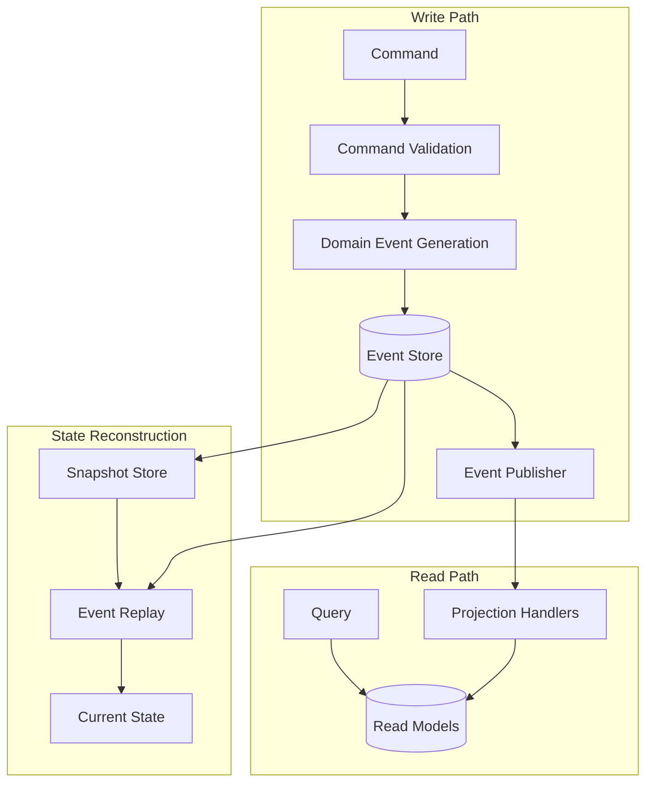

# Event Sourcing at Scale: Kiến Trúc Lưu Trữ Sự Kiện Quy Mô Lớn

## 1. Mục tiêu của Task

Hiểu sâu về Event Sourcing như một pattern kiến trúc cho hệ thống lưu trữ trạng thái dưới dạng chuỗi sự kiện bất biến, tập trung vào các thách thức và giải pháp khi triển khai ở quy mô production với hàng tỷ events, multi-year data retention, và distributed environments.

> **Core Question:** Tại sao lưu trữ state thay vì lưu trữ data lại là một paradigm shift quan trọng trong thiết kế hệ thống?

---

## 2. Bản Chất và Cơ Chế Hoạt Động

### 2.1 Event Sourcing Fundamentals

**Traditional CRUD Pattern:**
```
Database State → UPDATE → New Database State (state overwrite)
```

**Event Sourcing Pattern:**
```
Event Stream → APPEND → Immutable Event Log → State = f(events)
```

**Bản chất cơ học:**
- **Immutable Log:** Events không bao giờ bị xóa hay cập nhật - chỉ có thể append
- **State Derivation:** Current state là kết quả của việc replay tất cả events theo thứ tự
- **Temporal Dimension:** Hệ thống có "bộ nhớ thởi gian" - có thể query state ở bất kỳ thởi điểm nào trong quá khứ

### 2.2 Event Store Internals

#### 2.2.1 Storage Engine Architecture

**Append-Only Log Structure:**

| Offset | Event ID | Aggregate ID | Version | Event Type | Payload | Timestamp | Metadata |
|--------|----------|--------------|---------|------------|---------|-----------|----------|
| 0 | uuid-1 | account-123 | 1 | AccountCreated | {...} | T1 | {...} |
| 1 | uuid-2 | account-123 | 2 | MoneyDeposited | {...} | T2 | {...} |
| 2 | uuid-3 | account-456 | 1 | AccountCreated | {...} | T3 | {...} |

**Các thành phần cốt lõi:**

1. **Transaction Log (WAL - Write-Ahead Log)**
   - Mọi write phải ghi vào WAL trước khi acknowledged
   - Đảm bảo durability và crash recovery
   - Sequential I/O pattern tối ưu cho disk throughput

2. **Index Structures**
   - **Primary Index:** Event offset (global ordering)
   - **Secondary Indexes:** Aggregate ID, Event type, Timestamp
   - **Bloom Filters:** Để nhanh chóng loại trừ aggregates không tồn tại

3. **Storage Layer Options**
   - **B-Tree based:** PostgreSQL, MySQL (tốt cho random reads)
   - **LSM-Tree based:** RocksDB, Cassandra (tốt cho sequential writes)
   - **Specialized Event Stores:** EventStoreDB, Axon Server (optimized cho event sourcing)

#### 2.2.2 EventStoreDB Internals (Reference Implementation)

```
┌─────────────────────────────────────────────────────────────┐
│                     EventStoreDB Architecture                │
├─────────────────────────────────────────────────────────────┤
│  ┌─────────────┐    ┌─────────────┐    ┌─────────────────┐  │
│  │   Client    │───▶│   HTTP/     │───▶│  Command Handler│  │
│  │   API       │    │   gRPC      │    │  (Validation)   │  │
│  └─────────────┘    └─────────────┘    └─────────────────┘  │
│                                                   │         │
│  ┌─────────────┐    ┌─────────────┐              ▼         │
│  │  Projections│◀───│  Read Model │    ┌─────────────────┐  │
│  │  Engine     │    │  Cache      │◀───│  Event Storage  │  │
│  └─────────────┘    └─────────────┘    │  (Transaction   │  │
│                                        │   Log + Index)  │  │
│                                        └─────────────────┘  │
└─────────────────────────────────────────────────────────────┘
```

**Key Design Decisions trong EventStoreDB:**
- **Stream-based partitioning:** Mỗi aggregate là một stream riêng biệt
- **Optimistic concurrency:** Expected version checking để handle conflicts
- **Scavenging (compaction):** Loại bỏ tombstone records sau khi maxAge/maxCount đạt
- **Chasing Chunks:** File-based storage với chunk size cố định (256MB default)

### 2.3 Temporal Queries

**Bản chất Temporal Query:** Query state của hệ thống tại một thởi điểm cụ thể trong quá khứ.

**Implementation Strategies:**

| Strategy | Mechanism | Pros | Cons |
|----------|-----------|------|------|
| **Full Replay** | Replay tất cả events đến target timestamp | Đơn giản, chính xác | Chậm với large event streams |
| **Snapshot + Replay** | Load snapshot gần nhất + replay events sau đó | Nhanh | Cần quản lý snapshot lifecycle |
| **Temporal Index** | Pre-built index của state tại các milestones | Rất nhanh cho queries phổ biến | Tốn storage, cần maintenance |
| **Time-Travel DB** | Native DB support (Dolt, Crux) | Transparent, powerful | Vendor lock-in, immature ecosystem |

**Temporal Query Performance Optimization:**

```sql
-- Anti-pattern: Full table scan
SELECT * FROM events 
WHERE aggregate_id = 'account-123' 
  AND created_at <= '2024-01-15T10:30:00Z'
ORDER BY version;

-- Optimized: Partition pruning + index seek
SELECT * FROM events_partition_2024_q1 
WHERE aggregate_id = 'account-123' 
  AND version <= (SELECT max_version_at_time('account-123', '2024-01-15T10:30:00Z'))
ORDER BY version;
```

---

## 3. Kiến Trúc và Luồng Xử Lý

### 3.1 High-Level Architecture



### 3.2 Event Processing Pipeline

**Command Handling Flow:**

1. **Command Reception**
   - Validate command format và authorization
   - Resolve target aggregate ID

2. **Aggregate Loading**
   - Load latest snapshot (nếu có)
   - Replay events từ snapshot version đến hiện tại
   - Reconstruct aggregate state trong memory

3. **Business Logic Execution**
   - Apply business rules trên aggregate
   - Generate domain events nếu business rules pass

4. **Optimistic Concurrency Control**
   - Kiểm tra expected version trước khi append
   - Nếu version mismatch → throw ConcurrencyException

5. **Event Persistence**
   - Write events vào transaction log
   - Update secondary indexes
   - Publish events đến message bus (async)

### 3.3 Projection Architecture

**Projection = Read Model Builder**

| Aspect | Details |
|--------|---------|
| **Purpose** | Transform event stream thành queryable read models |
| **Trigger** | Event-driven (reactive) hoặc Polling (pull) |
| **Consistency** | Eventually consistent với write model |
| **Idempotency** | Must handle duplicate events gracefully |

**Projection Strategies:**

```
┌─────────────────────────────────────────────────────────────┐
│                    Projection Patterns                       │
├─────────────────────────────────────────────────────────────┤
│                                                             │
│  1. INLINE PROJECTION                                       │
│     Write Path ──▶ Event Store ──▶ Synchronous Projection   │
│     Pros: Strong consistency                                  │
│     Cons: Latency impact, coupling write/read               │
│                                                             │
│  2. ASYNC PROJECTION (Recommended)                          │
│     Write Path ──▶ Event Store ──▶ Message Bus ──▶ Workers  │
│     Pros: Decoupled, scalable, no write latency impact      │
│     Cons: Eventually consistent                             │
│                                                             │
│  3. PULL PROJECTION                                         │
│     Projection Service polls Event Store periodically       │
│     Pros: Simple, no message broker dependency              │
│     Cons: Higher latency, resource intensive                │
│                                                             │
└─────────────────────────────────────────────────────────────┘
```

---

## 4. Event Versioning và Schema Evolution

### 4.1 The Problem: Event Schema Drift

Trong hệ thống multi-year, event schemas inevitably change:
- New fields được thêm vào
- Fields cũ bị deprecate
- Event structures được refactor
- Business concepts evolve

> **Critical Rule:** Events stored 5 years ago vẫn phải deserializable và meaningful today.

### 4.2 Versioning Strategies

#### 4.2.1 Event Versioning Patterns

| Pattern | Description | When to Use |
|---------|-------------|-------------|
| **Semantic Versioning** | `AccountCreated_v1`, `AccountCreated_v2` | Breaking changes, long-term support |
| **Single Version with Defaults** | Same event type, optional fields | Non-breaking additive changes |
| **Event Upcasting** | Transform old events to new format at read time | Complex migrations, data model changes |
| **Event Migration** | Rewrite events to new format in storage | Major refactoring, performance optimization |

#### 4.2.2 Upcasting Architecture

```
┌─────────────────────────────────────────────────────────────┐
│                    Event Upcasting Chain                     │
├─────────────────────────────────────────────────────────────┤
│                                                             │
│   EventStore ──▶ V1→V2 ──▶ V2→V3 ──▶ V3→V4 ──▶ Application │
│                  UpCaster   UpCaster   UpCaster             │
│                                                             │
│   Chain of Responsibility pattern:                          │
│   - Mỗi UpCaster handle một version transition              │
│   - Có thể compose multiple transformations                 │
│   - Lazy evaluation tại read time                           │
│                                                             │
└─────────────────────────────────────────────────────────────┘
```

**Upcasting Implementation:**

```java
// V1 Event
public record AccountCreatedV1(
    String accountId,
    String ownerName,
    LocalDateTime createdAt
) {}

// V2 Event (thêm currency field)
public record AccountCreatedV2(
    String accountId,
    String ownerName,
    String currency,  // New field
    LocalDateTime createdAt
) {}

// UpCaster: V1 → V2
public class AccountCreatedV1ToV2Upcaster implements EventUpcaster {
    @Override
    public boolean canUpcast(IntermediateEventRepresentation rep) {
        return rep.getType().equals("AccountCreated") 
            && rep.getVersion().equals("1");
    }
    
    @Override
    public IntermediateEventRepresentation upcast(
            IntermediateEventRepresentation rep) {
        // Add default currency for legacy events
        return rep.upcastPayload(
            json -> json.put("currency", "USD")
        );
    }
}
```

#### 4.2.3 Schema Evolution Best Practices

**Forward Compatibility:**
- New code có thể read old events
- Đạt được bằng cách: optional fields with defaults, ignore unknown fields

**Backward Compatibility:**
- Old code có thể read new events (trong upgrade scenarios)
- Đạt được bằng cách: không remove fields, chỉ mark deprecated

**Field Evolution Rules:**

| Operation | Safe? | Strategy |
|-----------|-------|----------|
| Add optional field | ✅ Yes | Default value hoặc null |
| Add required field | ⚠️ Careful | Only with sensible default |
| Remove field | ❌ No | Deprecate first, remove sau 1-2 versions |
| Rename field | ❌ No | Add new field, dual-write, migrate, remove old |
| Change data type | ❌ No | New event version hoặc upcaster |

---

## 5. Snapshot Strategies

### 5.1 Why Snapshots Matter

**Problem:** Với aggregates có hàng trăm nghìn events, replay từ đầu mất nhiều thởi gian và memory.

**Example:**
- Bank account với 10 năm transaction history
- 1000 transactions/day × 365 days × 10 years = 3.65M events
- Replay time: ~30-60 seconds (unacceptable)

### 5.2 Snapshot Triggers

| Trigger Type | Mechanism | Trade-offs |
|--------------|-----------|------------|
| **Count-based** | Snapshot sau mỗi N events | Simple, predictable; không consider event size |
| **Time-based** | Snapshot mỗi N giây | Good for bursty traffic; potential data loss window |
| **Size-based** | Snapshot khi aggregate state đạt kích thước nhất định | Memory-efficient; harder to implement |
| **Version-based** | Snapshot tại các version milestones (v100, v200...) | Predictable; có thể bất đối xứng với business events |
| **Explicit** | Application yêu cầu snapshot | Full control; requires manual management |

### 5.3 Snapshot Storage Options

```
┌─────────────────────────────────────────────────────────────┐
│                   Snapshot Storage Strategies                │
├─────────────────────────────────────────────────────────────┤
│                                                             │
│  1. SEPARATE SNAPSHOT STORE                                 │
│     ┌─────────────┐         ┌─────────────┐                 │
│     │ Event Store │         │ Snapshot DB │                 │
│     │  (Append)   │         │  (Replace)  │                 │
│     └─────────────┘         └─────────────┘                 │
│     Pros: Performance, isolation                            │
│     Cons: Additional infrastructure                         │
│                                                             │
│  2. EVENT STORE AS SNAPSHOT SOURCE                          │
│     - Store snapshot như một loại event đặc biệt            │
│     - Query: Latest snapshot + events after it              │
│     Pros: Single source of truth                            │
│     Cons: Snapshot query pattern phức tạp                   │
│                                                             │
│  3. EXTERNAL CACHE (Redis/Memcached)                        │
│     - Snapshot = serialized aggregate in cache              │
│     - TTL-based eviction                                    │
│     Pros: Very fast reads                                   │
│     Cons: Cache invalidation complexity                     │
│                                                             │
└─────────────────────────────────────────────────────────────┘
```

### 5.4 Snapshot Consistency

**The Snapshot Consistency Problem:**

```
T1: Read snapshot at version 1000
T2: Event 1001, 1002 được append
T1: Read events from version 1001 → Misses events 1001, 1002
```

**Solutions:**

1. **Snapshot + Event Range Query**
   ```sql
   SELECT * FROM events 
   WHERE aggregate_id = ? 
     AND version > ?  -- snapshot version
     AND version <= (SELECT current_version FROM aggregates WHERE id = ?)
   ```

2. **Snapshot with Event Stream Position**
   - Snapshot lưu cả global stream position
   - Reconstruct từ snapshot position trong global stream

3. **Transactional Snapshot (if supported)**
   - Snapshot và event append trong cùng transaction
   - Only available với specialized event stores

---

## 6. Projection Rebuild Optimization

### 6.1 When to Rebuild Projections

| Scenario | Rebuild Required? |
|----------|-------------------|
| Bug trong projection logic | ✅ Yes |
| New projection type | ✅ Yes |
| Schema change in read model | ✅ Yes |
| Performance optimization | ⚠️ Maybe |
| Event upcasting | ❌ No (handled at read) |

### 6.2 Rebuild Strategies

#### 6.2.1 Full Rebuild

**Process:**
1. Drop existing read model
2. Replay all events từ đầu
3. Build new projection
4. Switch read traffic

**Optimization Techniques:**

| Technique | Speedup | Implementation |
|-----------|---------|----------------|
| **Parallel Processing** | 4-10x | Partition by aggregate ID, parallel workers |
| **Batch Writes** | 2-5x | Write to read model in batches (100-1000 events) |
| **Skip Unnecessary Events** | Variable | Filter by event type nếu projection chỉ quan tâm subset |
| **In-Memory Building** | 5-20x | Build in memory, bulk insert at end |

**Parallel Processing Architecture:**

```
┌─────────────────────────────────────────────────────────────┐
│              Parallel Projection Rebuild                     │
├─────────────────────────────────────────────────────────────┤
│                                                             │
│   Event Store ──▶ Partitioner ──┬──▶ Worker 1 ──┐         │
│                     (by agg ID) ├──▶ Worker 2 ──┤         │
│                                 ├──▶ Worker 3 ──┼──▶ Merge │
│                                 └──▶ Worker N ──┘         │
│                                                             │
│   Guarantees:                                               │
│   - Same aggregate events → same worker (ordering)          │
│   - Different aggregates → parallel processing              │
│                                                             │
└─────────────────────────────────────────────────────────────┘
```

#### 6.2.2 Incremental Rebuild

**When to use:** Large event store (billions of events), chỉ một phần projection cần update.

**Mechanism:**
- Track last processed position
- Chỉ process events từ position đó
- Useful cho "hot" projections với long rebuild time

#### 6.2.3 Blue-Green Projection

**Zero-Downtime Rebuild:**

```
Phase 1: Dual Write
┌─────────────┐     ┌─────────────────┐     ┌─────────────┐
│  Event Bus  │────▶│ Old Projection  │────▶│  Old DB     │
└─────────────┘     └─────────────────┘     └─────────────┘
         │
         └──────────▶ New Projection (rebuilding) ──▶ New DB

Phase 2: Validation
- Compare old vs new projection results
- Performance testing

Phase 3: Switch
- Route read traffic to new projection
- Decommission old projection
```

### 6.3 Projection Rebuild Monitoring

**Key Metrics:**

| Metric | Target | Alert Threshold |
|--------|--------|-----------------|
| Events/second | >10K/s | <1K/s |
| Rebuild ETA | <4 hours | >24 hours |
| Memory usage | <80% heap | >90% heap |
| Error rate | 0% | >0.1% |

---

## 7. Rủi Ro, Anti-patterns, và Lỗi Thưởng Gặp

### 7.1 Critical Anti-patterns

#### 7.1.1 "God Aggregate"

**Problem:** Aggregate quá lớn, accumulate hàng triệu events.

**Symptoms:**
- Slow load times (>1 second)
- Memory pressure
- Complex concurrency conflicts

**Solution:**
- **Aggregate Decomposition:** Split thành smaller aggregates
- **Snapshot Aggressive:** Snapshot mỗi 100-500 events
- **Archive Old Events:** Move historical events sang cold storage

#### 7.1.2 "Event Sourcing Everything"

**Problem:** Áp dụng event sourcing cho data không cần audit trail hoặc temporal queries.

**When NOT to use Event Sourcing:**
- Configuration data
- Session data
- Cached computed values
- High-volume sensor data (use time-series DB)

#### 7.1.3 "Synchronous Projection Coupling"

**Problem:** Projection logic chạy synchronous trong command handler.

**Consequences:**
- Increased command latency
- Write failures nếu projection fails
- Reduced throughput

**Solution:** Always use async projections.

### 7.2 Common Failure Modes

| Failure Mode | Cause | Mitigation |
|--------------|-------|------------|
| **Event Store Unavailable** | Network partition, disk full | Circuit breaker, exponential backoff, fallback to cached state |
| **Projection Lag** | Slow consumer, resource contention | Scale projection workers, optimize query patterns |
| **Schema Mismatch** | Deserialization failure | Version checking, dead letter queue, alerting |
| **Out-of-Order Events** | Network delays, retries | Idempotent consumers, sequence number validation |
| **Infinite Loop** | Event triggers command creates same event | Event deduplication, loop detection |

### 7.3 Security Considerations

**Sensitive Data in Events:**

| Approach | Implementation | Trade-off |
|----------|---------------|-----------|
| **Encryption at Rest** | Encrypt event payload | Cannot query by encrypted fields |
| **Tokenization** | Store tokens thay vì PII | Requires token vault |
| **Separate Sensitive Events** | Isolated stream với stricter access | Complexity |
| **Crypto-shredding** | Delete encryption key = "delete" data | Irreversible |

**Event Access Control:**
- Stream-level ACLs (who can read which aggregate types)
- Event-type filtering trong projections
- Audit log của việc read events (cho compliance)

---

## 8. Khuyến Nghị Thực Chiến trong Production

### 8.1 Event Store Selection

| Use Case | Recommended Store | Rationale |
|----------|------------------|-----------|
| **Enterprise/Spring** | Axon Server | Native Spring integration, commercial support |
| **General Purpose** | EventStoreDB | Mature, good performance, strong community |
| **Cloud-Native** | AWS EventBridge + DynamoDB | Serverless, managed, good for moderate scale |
| **High-Volume** | Apache Kafka + Cassandra | Horizontal scaling, proven at massive scale |
| **PostgreSQL-based** | PostgreSQL + custom framework | Familiar ops, good for <100M events |

### 8.2 Capacity Planning

**Storage Estimation:**

```
Storage per year = (Events per day) × (365 days) × (Avg event size)

Example:
- 1M events/day
- 2KB average event size
- 1M × 365 × 2KB = 730 GB/year

With 3x replication: ~2.2 TB/year
```

**Performance Targets:**

| Metric | Target | Stress Test |
|--------|--------|-------------|
| Write throughput | >10K events/sec | Sustained 1 hour |
| Read latency (p99) | <50ms | Including snapshot load |
| Projection lag | <5 seconds | Under 2x normal load |
| Snapshot creation | <100ms | For 10MB aggregate |

### 8.3 Monitoring & Observability

**Essential Metrics:**

```yaml
# Event Store Metrics
event_store:
  - write_latency_p99
  - read_latency_p99
  - append_rate
  - storage_utilization
  - replication_lag

# Projection Metrics  
projections:
  - processing_lag_seconds
  - events_per_second
  - error_rate
  - retry_count

# Aggregate Metrics
aggregates:
  - event_count_distribution
  - snapshot_age
  - load_time_p99
```

**Tracing Context:**
- Propagate correlation ID từ command → events → projections
- Tag spans với aggregate ID, event type
- Track end-to-end latency: Command → Event Stored → Projection Updated

### 8.4 Disaster Recovery

**Backup Strategy:**

| Component | Backup Method | RPO | RTO |
|-----------|--------------|-----|-----|
| Event Store | Continuous replication + daily snapshots | Minutes | Hours |
| Snapshots | Daily snapshots to S3/GCS | 24 hours | Minutes |
| Projections | Rebuild from events | N/A (derived) | Hours |

**Recovery Procedures:**
1. **Event Store Failure:** Promote replica, redirect traffic
2. **Data Corruption:** Restore from backup, replay events from backup point
3. **Projection Corruption:** Trigger rebuild từ event store

---

## 9. Kết Luận

**Bản chất của Event Sourcing:**

> Event Sourcing không chỉ là một pattern lưu trữ - nó là một **paradigm shift** từ việc lưu trữ "state hiện tại" sang lưu trữ "lý do tại sao state như vậy". Điều này mang lại khả năng audit hoàn hảo, temporal querying, và decoupling giữa write và read models.

**Trade-offs chính:**

| Pros | Cons |
|------|------|
| Complete audit trail | Operational complexity |
| Temporal queries | Eventually consistent reads |
| Natural event-driven architecture | Learning curve |
| Easy to add new read models | Event schema evolution challenges |
| Replay for debugging/testing | Storage overhead |

**When to use:**
- ✅ Audit requirements nghiêm ngặt (finance, healthcare)
- ✅ Complex domains với frequent state changes
- ✅ Event-driven microservices architecture
- ✅ Need for temporal analysis

**When NOT to use:**
- ❌ Simple CRUD applications
- ❌ High-write, low-read workloads không cần audit
- ❌ Teams không có experience với distributed systems

**Final Recommendation:**

Bắt đầu với **bounded context nhỏ**, sử dụng **PostgreSQL + existing framework** (Axon/EvenstoreDB client), và **aggressive snapshotting** để giảm rủi ro. Khi đạt được operational maturity, migrate sang specialized event store nếu cần scale.

---

## 10. References

- [EventStoreDB Documentation](https://developers.eventstore.com/)
- [Axon Framework Reference Guide](https://docs.axoniq.io/reference-guide/)
- [Martin Fowler - Event Sourcing](https://martinfowler.com/eaaDev/EventSourcing.html)
- [Greg Young - CQRS and Event Sourcing](https://www.youtube.com/watch?v=JHGkaShoyNs)
- [Microsoft - Cloud Design Patterns - Event Sourcing](https://docs.microsoft.com/en-us/azure/architecture/patterns/event-sourcing)
- [Exploring CQRS and Event Sourcing (MS Patterns & Practices)](https://www.microsoft.com/en-us/download/details.aspx?id=34774)
