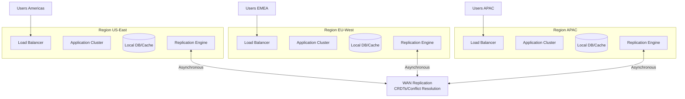
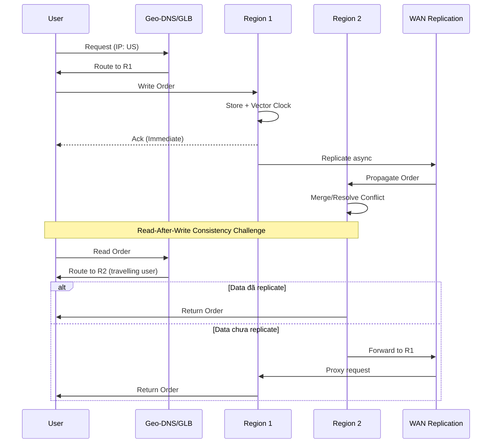
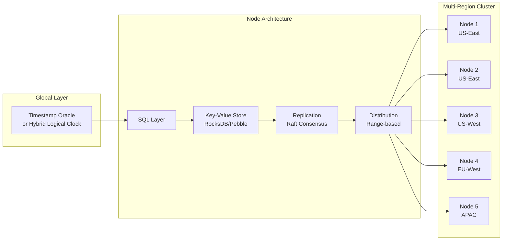

# Active-Active Multi-Region Design

## 1. Mục tiêu của Task

Hiểu sâu bản chất của thiết kế hệ thống **Active-Active Multi-Region** - kiến trúc cho phép ứng dụng hoạt động đồng thờI ở nhiều region khác nhau với khả năng ghi dữ liệu tại mọi region, đảm bảo high availability, low latency và disaster recovery mà không có single point of failure.

> **Core Question:** Làm thế nào để dữ liệu được ghi ở Singapore có thể đồng bộ với Virginia mà không gây conflict, không mất dữ liệu, và vẫn đảm bảo tính nhất quán trong giới hạn chấp nhận được?

---

## 2. Bản Chất và Cơ Chế Hoạt Động

### 2.1 The Fundamental Problem: CAP Theorem trong Multi-Region

Trong môi trường WAN (Wide Area Network), network partition là điều không thể tránh khỏi. CAP theorem nói rằng khi partition xảy ra, bạn phải chọn giữa Consistency và Availability.

**Active-Active chọn Availability + Partition tolerance**, chấp nhận eventual consistency. Nhưng "eventual" không có nghĩa là "bừa bãi" - cần cơ chế rõ ràng để:
- Xác định thứ tự sự kiện (causality tracking)
- Giải quyết conflict khi có concurrent writes
- Đảm bảo convergence (cuối cùng mọi node đều thấy cùng một giá trị)

### 2.2 Conflict-free Replicated Data Types (CRDTs)

**Bản chất:** CRDT là cấu trúc dữ liệu được thiết kế để merge tự động mà không cần coordination. Chúng đảm bảo Strong Eventual Consistency (SEC).

#### Cơ chế hoạt động:

| Loại CRDT | Cơ chế | Ví dụ |
|-----------|--------|-------|
| **State-based (CvRDT)** | Truyền toàn bộ state, merge bằng join semilattice | GCounter, PNCounter, GSet, LWWRegister |
| **Operation-based (CmRDT)** | Truyền operations, yêu cầu reliable broadcast | WOOT, Treedoc, Logoot |

#### 2.2.1 G-Counter (Grow-only Counter)

```
Mỗi node i có vector V[i]
Increment: V[i]++
Merge: V_result[k] = max(V1[k], V2[k]) ∀k
Value: sum(V[i])
```

**Tại sao hoạt động:**
- Merge operation là commutative: max(a,b) = max(b,a)
- Associative: max(max(a,b),c) = max(a,max(b,c))
- Idempotent: max(a,a) = a

#### 2.2.2 LWW-Register (Last-Writer-Wins)

```
Mỗi giá trị kèm timestamp hoặc logical clock
Write: (value, timestamp)
Merge: chọn giá trị có timestamp cao hơn
```

**Trade-off quan trọng:** Có thể mất writes (nếu clock skew hoặc writes xảy ra "đồng thờI" theo clock).

#### 2.2.3 OR-Set (Observed-Removed Set)

Vấn đề với Set truyền thống: remove rồi add lại = phần tử xuất hiện (unexpected). OR-Set giải quyết bằng unique tags:

```
Add(e): t = unique_tag(), add (e,t) vào set
Remove(e): remove tất cả tags của e đã quan sát được
Merge: union của tất cả pairs
```

**Kết quả:** Add sau Remove sẽ có tag mới → phần tử xuất hiện (expected behavior).

### 2.3 Vector Clocks và Logical Time

**Vấn đề:** Physical clock không đáng tin cậy trong distributed systems (clock skew có thể là milliseconds đến seconds).

**Giải pháp:** Vector Clocks - mỗi node N có vector V[N] độ dài = số node.

```
Khởi tạo: V = [0, 0, ..., 0]
Local event: V[i]++
Send message: V[i]++, gửi kèm message
Nhận message: V[i]++, V[j] = max(V[j], V_message[j]) ∀j
```

**So sánh events:**
- V1 ≤ V2 nếu V1[k] ≤ V2[k] ∀k → e1 happens-before e2
- V1 || V2 (concurrent) nếu không so sánh được

**Trade-offs:**
- ✅ Xác định causality chính xác
- ❌ Kích thước O(N) - không scalable khi N lớn
- ❌ Garbage collection phức tạp

**Cải tiến - Version Vectors:** Chỉ track các version thay vì toàn bộ vector, hoặc dùng dotted version vectors.

### 2.4 Conflict Resolution Strategies

Khi concurrent writes xảy ra (detected bằng vector clocks hoặc version vectors):

| Strategy | Ưu điểm | Nhược điểm | Use Case |
|----------|---------|------------|----------|
| **Last-Writer-Wins (LWW)** | Đơn giản, deterministic | Mất dữ liệu | Cache, session data |
| **Multi-Version** | Giữ tất cả versions, app chọn | Storage overhead, complexity | Financial audit logs |
| **Application-level Merge** | Business logic-aware | Cần implement custom | Shopping carts, collaborative editing |
| **CRDT Merge** | Automatic, mathematically sound | Limited data types, overhead | Counters, sets, maps |

---

## 3. Kiến Trúc và Luồng Xử Lý

### 3.1 High-Level Architecture



### 3.2 Request Routing Strategy



### 3.3 CockroachDB-style Architecture (Spanner-like)



---

## 4. So Sánh Các Giải Pháp

### 4.1 Active-Active vs Active-Passive

| Tiêu chí | Active-Active | Active-Passive | Active-Active (CRDT) |
|----------|--------------|----------------|---------------------|
| **RTO (Recovery Time)** | ~0 (tự động) | Phút đến giờ | ~0 |
| **RPO (Data Loss)** | Có thể 0 (sync) hoặc small (async) | Có thể lớn | Có thể 0 |
| **Latency** | Low (local write) | High (cross-region) | Low (local write) |
| **Complexity** | Rất cao | Thấp | Cao |
| **Cost** | Cao (N regions × full capacity) | Thấp (standby chỉ replicate) | Cao |
| **Consistency** | Eventual | Strong (khi failover) | Strong Eventual |
| **Conflict Handling** | Phức tạp | Không có (single writer) | Automatic (CRDT) |

### 4.2 Cơ chế Consensus trong WAN

| Algorithm | Pros | Cons | Best For |
|-----------|------|------|----------|
| **Paxos** | Proven correct | Khó implement, opaque | Core infrastructure (Chubby, ZooKeeper) |
| **Raft** | Understandable, leader-based | Leader bottleneck | In-region consensus (etcd, TiKV) |
| **EPaxos/Mencius** | Multi-leader, WAN-optimized | Complex, fewer implementations | True multi-region consensus |
| **CRDTs** | No coordination needed | Limited semantics | Collaborative apps, counters, shopping carts |

### 4.3 Database Choices

| Database | Multi-Region Strategy | Consistency Model | Trade-offs |
|----------|---------------------|-------------------|------------|
| **CockroachDB** | Raft across regions, geo-partitioning | Serializable (default), Bounded staleness reads | Higher write latency, strong consistency |
| **Spanner** | TrueTime, synchronous replication | External consistency (linearizability) | Requires atomic clocks, expensive |
| **Cassandra** | Tunable consistency (ONE, QUORUM, ALL) | Eventual | Manual conflict resolution, last-write-wins |
| **DynamoDB Global Tables** | Multi-master async | Eventual | No custom conflict resolution |
| **MongoDB Atlas** | Global clusters with sharding | Eventual (default), read/write concerns tunable | Single document transactions only |
| **YugabyteDB** | Raft per shard, distributed transactions | Serializable | Similar to CockroachDB |

---

## 5. Rủi Ro, Anti-Patterns, và Lỗi Thường Gặp

### 5.1 Critical Anti-Patterns

#### ❌ Anti-Pattern 1: "Split-Brain" với Automatic Failover

```
Scenario:
1. Network partition giữa Region A và Region B
2. Cả hai đều tự nhận mình là primary
3. Cả hai đều accept writes
4. Khi partition heal: unresolvable conflicts

Giải pháp: Sử dụng consensus (Raft/Paxos) hoặc third-party coordinator
```

#### ❌ Anti-Pattern 2: Clock Skew Blindness

```
Scenario:
1. Server A clock: 10:00:00, Server B clock: 10:00:05 (5s ahead)
2. Write X tại A với timestamp 10:00:01
3. Write Y tại B với timestamp 10:00:04
4. LWW chọn Y (clock-based) nhưng X thực sự xảy ra sau

Giải pháp: Dùng Hybrid Logical Clocks (HLC) hoặc Vector Clocks
```

#### ❌ Anti-Pattern 3: Read-Your-Write Violation

```
Scenario:
1. User ghi tại Region A
2. User đọc ngay tại Region B (chưa replicate)
3. Data không tồn tại → User confused

Giải pháp: Session stickiness hoặc read-after-write routing
```

### 5.2 Failure Modes

| Failure | Nguyên nhân | Phát hiện | Xử lý |
|---------|------------|-----------|-------|
| **Replication Lag** | Network congestion, high write rate | Monitor lag metrics | Backpressure, circuit breaker |
| **Conflict Storm** | Concurrent writes cùng key | Conflict rate spike | Rate limiting, key sharding |
| **Vector Clock Explosion** | Nhiều node, long-running | Memory usage | Clock pruning, epoch-based |
| **Tombstone Accumulation** | Deletes trong CRDTs | Storage bloat | Compaction, TTL |

### 5.3 Edge Cases

1. **Long Network Partitions (days):** Queue replication có thể overflow. Cần snapshot + catch-up mechanism.

2. **Massive Concurrent Writes:** Hot keys sẽ gây conflict liên tục. Cần key partitioning hoặc coordination.

3. **Schema Changes:** Giữa các region với versions khác nhau. Cần schema registry và backward compatibility.

4. **Clock Jumps:** NTP sync gây time jump. Dùng HLC (Hybrid Logical Clock) để tránh.

---

## 6. Khuyến Nghị Thực Chiến trong Production

### 6.1 Kiến trúc khuyến nghị cho từng use case

#### Use Case 1: Global E-commerce Cart

```
Solution: OR-Set CRDT + Session Affinity
- Cart là OR-Set với items (product_id, tag)
- Mỗi operation (add/remove) có unique tag
- Merge: union của tất cả items chưa bị remove
- Session stickiness cho read-your-writes
```

#### Use Case 2: Financial Transaction Ledger

```
Solution: Event Sourcing + CRDT Counter
- Immutable events append-only tại mỗi region
- Account balance = PNCounter (có thể tăng/giảm)
- Conflict: keep both events, business logic reconcile
- Strong consistency cho balance check (cross-region read)
```

#### Use Case 3: Global User Profile

```
Solution: LWW-Register với HLC + Field-level CRDTs
- Profile fields: LWW-Register cho mỗi field
- Nested objects: Map CRDT
- Avatar: Versioned blob storage
- Read-repair cho divergence detection
```

### 6.2 Monitoring & Observability

**Metrics cần theo dõi:**

```yaml
Replication:
  - replication_lag_seconds: < 1s (p99)
  - replication_throughput: > expected write rate
  - conflict_rate: < 0.01% of writes

Consistency:
  - vector_clock_size: < 100 bytes per object
  - divergence_objects: < 0.001%
  - read_repair_rate: track trend

Performance:
  - local_write_latency: < 10ms (p99)
  - cross_region_read_latency: < 200ms (p99)
  - merge_operation_latency: < 5ms
```

### 6.3 Operational Best Practices

1. **Canary Deployments:** Deploy schema changes từng region, monitor conflicts trước khi full rollout.

2. **Data Residency:** Một số data không được phép cross-border. Dùng geo-partitioning.

3. **Backup Strategy:** Per-region backup + cross-region backup cho disaster recovery.

4. **Testing:** 
   - Chaos engineering: partition network giữa regions
   - Jepsen-style testing cho consistency verification

### 6.4 Java Implementation Tips

```java
// Ví dụ: PNCounter implementation
public class PNCounter {
    private final Map<String, Long> increments = new ConcurrentHashMap<>();
    private final Map<String, Long> decrements = new ConcurrentHashMap<>();
    
    public void increment(String nodeId) {
        increments.merge(nodeId, 1L, Long::sum);
    }
    
    public void decrement(String nodeId) {
        decrements.merge(nodeId, 1L, Long::sum);
    }
    
    public void merge(PNCounter other) {
        // Component-wise max for both maps
        other.increments.forEach((k, v) -> 
            increments.merge(k, v, Math::max));
        other.decrements.forEach((k, v) -> 
            decrements.merge(k, v, Math::max));
    }
    
    public long value() {
        long inc = increments.values().stream().mapToLong(Long::longValue).sum();
        long dec = decrements.values().stream().mapToLong(Long::longValue).sum();
        return inc - dec;
    }
}
```

---

## 7. Kết Luận

### Bản chất cốt lõi

Active-Active Multi-Region Design là **sự đánh đổi có tính toán** giữa:
- **Consistency** vs **Availability** (CAP theorem)
- **Latency** vs **Correctness**
- **Operational complexity** vs **User experience**

### Key Takeaways

1. **CRDTs** là giải pháp "silver bullet" cho specific use cases (counters, sets, registers) nhưng không phải universal solution.

2. **Vector Clocks** và **Logical Time** là nền tảng để tracking causality mà không phụ thuộc physical clock.

3. **Conflict Resolution** nên được thiết kế vào business logic, không phải afterthought.

4. **Read-Your-Write** consistency là yêu cầu UX quan trọng cần session affinity hoặc proxy reads.

5. **Observability** là critical - bạn cần biết replication lag, conflict rate, và divergence ngay lập tức.

### Khi nào nên dùng Active-Active

✅ **Nên dùng khi:**
- Cần <100ms write latency globally
- Có thể chấp nhận eventual consistency
- Write conflict rate thấp hoặc có business logic merge
- RTO requirement gần 0

❌ **Không nên dùng khi:**
- Cần strong consistency cho mọi read
- Write-heavy trên cùng keys
- Không có resource cho operational complexity
- Regulatory requirements cấm data replication cross-border

### Xu hướng tương lai

- **Automerge**, **Yjs** libraries cho collaborative apps
- **Dolt** - Git-like database với native CRDTs
- **Edge databases** (LiteFS, Turso) với automatic multi-region sync
- **Database-internal CRDTs** (Redis CRDT, Riak DT)

---

## 8. Tài Liệu Tham Khảo

1. "A comprehensive study of Convergent and Commutative Replicated Data Types" - Shapiro et al. (2011)
2. "Conflict-free Replicated Data Types: An Overview" - CB Riga Workshop
3. CockroachDB Architecture Docs - https://www.cockroachlabs.com/docs/stable/architecture/overview.html
4. Spanner: Google's Globally-Distributed Database (OSDI 2012)
5. Dynamo: Amazon's Highly Available Key-value Store (SOSP 2007)
