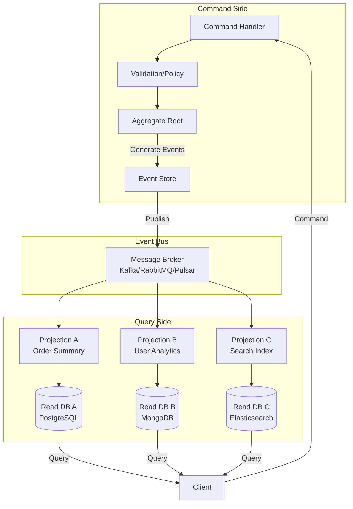

# Event Sourcing & CQRS - Event Store, Projection, Snapshots

## 1. Mục tiêu của Task

Hiểu sâu bản chất của Event Sourcing và CQRS - hai pattern thường đi kèm nhau nhưng khác biệt về mục tiêu. Phân tích cơ chế Event Store, cách xây dựng Projection để tạo read model, và chiến lược Snapshot để tối ưu performance. Xác định khi nào nên áp dụng, trade-off cốt lõi, và các rủi ro production.

---

## 2. Bản Chất và Cơ Chế Hoạt Động

### 2.1 Event Sourcing - Bản Chất

> **Event Sourcing không phải là cách lưu trữ "tốt hơn" - nó là cách lưu trữ "khác biệt" cho bài toán khác biệt.**

**Bản chất cơ chế:**

Thay vì lưu trạng thái hiện tại (current state), Event Sourcing lưu chuỗi các sự kiện (events) đã dẫn đến trạng thái đó. Mỗi event là immutable fact đã xảy ra trong quá khứ.

```
Traditional DB:    User { id: 1, balance: 100, status: ACTIVE }
                    ↓ UPDATE balance = 150
                   User { id: 1, balance: 150, status: ACTIVE }
                   
Event Sourcing:    AccountCreated { id: 1, initialBalance: 100 }
                    DepositMade { amount: 50 }
                    
                   State = fold(apply, initialState, events)
```

**Tại sao thiết kế như vậy:**

1. **Immutability là lõi** - Events không bao giờ thay đổi, chỉ append. Điều này loại bỏ race condition trong write path.

2. **Time-travel debugging** - Có thể reconstruct state tại bất kỳ thờii điểm nào bằng cách replay events đến thờii điểm đó.

3. **Audit trail tự nhiên** - Không cần tách biệt audit logging, mọi thay đổi đã được ghi lại.

4. **Event-driven integration** - Các service khác subscribe vào event stream để nhận thông báo thay đổi.

### 2.2 CQRS - Command Query Responsibility Segregation

> **CQRS không yêu cầu Event Sourcing, và Event Sourcing không yêu cầu CQRS. Nhưng chúng bổ trợ nhau tự nhiên.**

**Bản chất:**

Tách biệt model cho write operations (commands) và read operations (queries). Mỗi bên tối ưu cho mục đích riêng:

| Aspect | Command Side | Query Side |
|--------|--------------|------------|
| **Optimized for** | Consistency, validation, business rules | Performance, query flexibility |
| **Schema** | Normalized, aggregate-focused | Denormalized, view-focused |
| **Storage** | Event Store hoặc relational | Read-optimized (cache, search index, document DB) |
| **Scaling** | Vertical (strong consistency cần coordination) | Horizontal (read replicas dễ dàng) |

**Tại sao tách biệt:**

Read và write có pattern truy cập khác biệt fundamental:
- Write thường xảy ra trên 1 aggregate, cần validation phức tạp
- Read thường join nhiều aggregates, cần response nhanh, có thể eventually consistent

### 2.3 Event Store - Cơ Chế Lưu Trữ

**Bản chất vật lý:**

Event Store không phải là "database thông thường lưu events". Nó có đặc thù riêng:

```
┌─────────────────────────────────────────────────────────┐
│                    EVENT STORE                          │
├─────────────────────────────────────────────────────────┤
│  Stream: order-123                                      │
│  ├── Event 0: OrderCreated        [version: 0]          │
│  ├── Event 1: ItemAdded           [version: 1]          │
│  ├── Event 2: ItemAdded           [version: 2]          │
│  ├── Event 3: ShippingAddressSet  [version: 3]          │
│  └── Event 4: OrderConfirmed      [version: 4]          │
│                                                         │
│  Stream: order-124                                      │
│  ├── Event 0: OrderCreated        [version: 0]          │
│  └── Event 1: ItemAdded           [version: 1]          │
└─────────────────────────────────────────────────────────┘
```

**Cơ chế optimistic concurrency control:**

Mỗi stream có version. Khi append event, client phải chỉ định expected version:

```
Client A đọc order-123 tại version 4
Client B đọc order-123 tại version 4

Client A ghi Event 5 với expectedVersion=4 → Success, version=5
Client B ghi Event 5 với expectedVersion=4 → ConflictException (now at 5)
```

Đây là cơ chế **không dùng lock** - lỗi conflict được expose cho client để xử lý (retry hoặc merge).

**Physical storage considerations:**

- **Append-only log**: Events chỉ được append vào file cuối - cực kỳ hiệu quả I/O tuần tự
- **Index by stream ID**: B-tree hoặc LSM-tree index để tìm events của stream nhanh
- **Global ordering**: Event ID hoặc timestamp global để maintain causality across streams

### 2.4 Projection - Tạo Read Model

**Bản chất:**

Projection là quá trình transform event stream thành read-optimized views. Có 2 loại:

**1. Synchronous Projection (Inline):**
```
Command → Validate → Write Event → Apply to Projection → Return
```
- Pros: Read model luôn consistent
- Cons: Latency cao, write path chậm, khó scale

**2. Asynchronous Projection (Eventual Consistency):**
```
Command → Write Event → Return immediately
                    ↓
              Event Bus
                    ↓
Projection Handler → Update Read DB
```
- Pros: Write nhanh, projection có thể scale independently
- Cons: Read model eventual consistent, complexity của eventual consistency

**Cơ chế exactly-once processing:**

Projection phải đảm bảo không miss event và không process duplicate:

```
┌─────────────────┐     ┌─────────────────┐     ┌─────────────────┐
│   Event Store   │────▶│  Checkpoint     │────▶│  Projection     │
│                 │     │  (last position)│     │  Handler        │
└─────────────────┘     └─────────────────┘     └─────────────────┘
                                │
                                ▼
                        ┌─────────────────┐
                        │  Idempotency    │
                        │  (processed IDs)│
                        └─────────────────┘
```

Checkpoint lưu vị trí đã xử lý, idempotency key đảm bảo duplicate không gây hại.

### 2.5 Snapshot - Tối Ưu Replay

**Vấn đề:**

Với aggregate có 100,000 events, replay từ đầu mỗi lần load là không chấp nhận được.

**Cơ chế Snapshot:**

```
Events:  [0]──[1]──[2]──...──[99997]──[99998]──[99999]──[100000]
                               ▲
                    ┌──────────┘
                    ▼
            ┌──────────────┐
            │   Snapshot   │  (state tại version 99997)
            │   version    │
            └──────────────┘

Load: Read Snapshot → Apply events 99998-100000 (chỉ 3 events)
```

**Trade-off của snapshot:**

| Factor | Without Snapshot | With Snapshot |
|--------|-----------------|---------------|
| Memory | Tăng dần theo events | Capped |
| Load time | O(n) | O(events since snapshot) |
| Complexity | Thấp | Cao (snapshot versioning, cleanup) |
| Storage | Chỉ events | Events + snapshots |

**Snapshot strategies:**

1. **Count-based**: Snapshot mỗi N events
2. **Time-based**: Snapshot mỗi T giây
3. **Size-based**: Snapshot khi aggregate đạt kích thước nhất định
4. **On-demand**: Snapshot khi load chậm được phát hiện

---

## 3. Kiến Trúc và Luồng Xử Lý

### 3.1 Tổng Thể Hệ Thống



### 3.2 Luồng Xử Lý Command

```
1. Client gửi Command (CreateOrder)
   └── Payload: { customerId, items, shippingAddress }

2. Command Handler nhận và xác thực cơ bản
   └── Check required fields, format

3. Load Aggregate từ Event Store
   ├── Đọc snapshot gần nhất (nếu có)
   ├── Replay events từ sau snapshot
   └── Reconstruct aggregate state

4. Aggregate thực thi business logic
   ├── Validate business rules
   │   ├── Customer tồn tại?
   │   ├── Items có available?
   │   └── Credit limit đủ?
   └── Generate events nếu valid
       ├── OrderCreated
       ├── InventoryReserved
       └── PaymentAuthorized

5. Transactional append events vào Event Store
   ├── Optimistic concurrency check
   ├── Append events với expected version
   └── Nếu conflict → throw, client retry

6. Return result (thường là ID hoặc acknowledgment)
```

### 3.3 Luồng Xử Lý Projection

```
1. Event Store publish event lên Event Bus

2. Projection Consumer nhận event
   ├── Deserialize event
   ├── Check idempotency (đã xử lý chưa?)
   └── Nếu chưa → process

3. Update Read Model
   ├── Transform event thành view format
   ├── Cập nhật database
   │   ├── Upsert document
   │   ├── Update materialized view
   │   └── Reindex search
   └── Commit transaction

4. Lưu checkpoint
   └── Ghi lại position đã xử lý

5. Acknowledge message
   └── Broker xóa khỏi queue
```

---

## 4. So Sánh Các Lựa Chọn

### 4.1 Event Sourcing vs Traditional State Storage

| Criteria | Traditional CRUD | Event Sourcing |
|----------|-----------------|----------------|
| **Complexity** | Thấp | Cao |
| **Learning Curve** | Ngắn | Dài |
| **Debugging** | Difficult (current state only) | Excellent (full history) |
| **Audit** | Manual implementation | Built-in |
| **Temporal Queries** | Không | Có (state at any point) |
| **Event-Driven Integration** | Thêm complexity | Tự nhiên |
| **Storage Growth** | O(1) per entity | O(n) theo changes |
| **Operational Maturity** | Cao | Trung bình |

### 4.2 Event Store Solutions

| Solution | Type | Pros | Cons |
|----------|------|------|------|
| **EventStoreDB** | Specialized | Native event sourcing, projection built-in, commercial support | Vendor lock-in, smaller community |
| **PostgreSQL** | Relational | Familiar, ACID, JSON support | Không optimized cho event sourcing patterns |
| **Kafka** | Log-based | High throughput, retention, replay | Không là event store hoàn chỉnh (no optimistic concurrency) |
| **MongoDB** | Document | Flexible schema, good for projections | Weak transaction support (pre-4.0) |

### 4.3 Projection Strategies

| Strategy | Consistency | Use Case | Complexity |
|----------|-------------|----------|------------|
| **Inline** | Strong | Critical reads cần immediate consistency | Thấp |
| **Async - At-Least-Once** | Eventual | Most use cases | Trung bình |
| **Async - Exactly-Once** | Eventual | Financial, critical | Cao |

---

## 5. Rủi Ro, Anti-Patterns, Lỗi Thường Gặp

### 5.1 Anti-Patterns

> **Event Sourcing all the things** - Không phải mọi entity đều cần event sourcing.

**Entities phù hợp:** Orders, Accounts, Workflows
**Entities không phù hợp:** User preferences, Session data, Cache entries

> **God Events** - Event chứa quá nhiều thông tin.

```java
// BAD - Event quá lớn
OrderUpdated {
    orderId,
    customerId, customerName, customerEmail,
    shippingAddress, billingAddress,
    items[],
    status, paymentStatus, shippingStatus,
    createdAt, updatedAt, updatedBy
}

// GOOD - Focused, minimal
OrderConfirmed {
    orderId,
    confirmedAt,
    confirmationNumber
}
```

> **Direct Event Modification** - Update hoặc delete events đã lưu.

**Không bao giờ làm điều này.** Nếu event sai, append compensating event.

### 5.2 Failure Modes

**1. Event Version Mismatch (Schema Evolution)**

```
V1: OrderCreated { orderId, customerId, amount }
V2: OrderCreated { orderId, customerId, amount, currency }

Old events không có currency → deserialization lỗi
```

**Giải pháp:**
- Event schema versioning
- Upcasting: transform old events on-the-fly khi deserialize
- Default values cho new fields

**2. Projection Lag**

Read model quá chậm so với write model. User tạo order rồi query không thấy.

**Giải pháp:**
- Monitor lag metrics
- Scale projection consumers
- Read-after-write consistency pattern (đợi projection xử lý)

**3. Split Brain trong Event Store Cluster**

Split brain dẫn đến duplicate event IDs hoặc lost events.

**Giải pháp:**
- Quorum-based writes
- Conflict detection và resolution

**4. Aggregate Too Large**

Aggregate có quá nhiều events, snapshot không đủ.

**Giải pháp:**
- Archive old events
- Aggregate partitioning
- Snapshot frequency tăng

### 5.3 Production Pitfalls

| Pitfall | Impact | Prevention |
|---------|--------|------------|
| Không có disaster recovery plan | Lost all events | Backup, replication, tested restore |
| No idempotency | Duplicate processing | Idempotency keys, deduplication |
| Unbounded event growth | Storage cost, slow replay | Archiving strategy, snapshot |
| Missing checkpoint persistence | Reprocess all events on restart | Durable checkpoint storage |
| Projection without transaction | Inconsistent read model | Transactional outbox hoặc idempotency |

---

## 6. Khuyến Nghị Thực Chiến Trong Production

### 6.1 Khi Nào Nên Dùng Event Sourcing + CQRS

**Dùng khi:**
- Audit trail là requirement cứng
- Temporal queries quan trọng ("state lúc đó là gì?")
- Event-driven integration với nhiều downstream systems
- Complex domains với business rules phức tạp thay đổi theo thờii gian
- Need time-travel debugging

**Không dùng khi:**
- Simple CRUD application
- Team chưa có experience
- Không có DevOps capacity cho operational complexity
- Latency requirements rất strict (sub-10ms)
- Limited storage budget

### 6.2 Monitoring và Observability

**Metrics cần track:**

```
# Event Store
- event_append_latency (p50, p99)
- event_read_latency
- stream_count
- events_per_stream (histogram)
- storage_growth_rate

# Projection
- projection_lag (events behind)
- projection_processing_rate
- projection_error_rate
- checkpoint_age

# Aggregate
- aggregate_load_time
- aggregate_event_count
- snapshot_hit_ratio
```

**Tracing:**
- Correlation ID từ command → events → projections
- Distributed trace xuyên suốt write và read path

### 6.3 Performance Optimization

**Snapshot optimization:**
- Snapshot mỗi 100-1000 events (tùy aggregate size)
- Async snapshot creation (không block write path)
- Snapshot compression

**Projection optimization:**
- Batch processing (process nhiều events cùng lúc)
- Parallel projections (theo stream partition)
- Projection specific database tuning

**Event Store tuning:**
- Append-only file layout
- Proper indexing (stream_id, event_position)
- Archive old events to cold storage

### 6.4 Disaster Recovery

**Backup strategy:**
- Continuous replication sang secondary cluster
- Point-in-time recovery capability
- Regular restore testing

**Data integrity:**
- Event hash/signature để detect corruption
- Checksum verification
- Automated consistency checks

---

## 7. Cập Nhật Hiện Đại (Java 21+)

### 7.1 Records cho Events

```java
// Java 16+ Records - Perfect for immutable events
public record OrderCreated(
    UUID orderId,
    UUID customerId,
    BigDecimal amount,
    Currency currency,
    Instant occurredAt
) implements DomainEvent {}
```

Benefits:
- Immutable by default
- Compact syntax
- Automatic equals/hashCode/toString
- Pattern matching support

### 7.2 Sealed Classes cho Event Hierarchy

```java
// Java 17+ Sealed classes
public sealed interface OrderEvent 
    permits OrderCreated, ItemAdded, OrderConfirmed, OrderCancelled {}

public record OrderCreated(...) implements OrderEvent {}
public record ItemAdded(...) implements OrderEvent {}
```

Benefits:
- Exhaustive pattern matching
- Compile-time safety
- Clear domain model

### 7.3 Virtual Threads cho Projection

```java
// Java 21+ Virtual Threads
Thread.startVirtualThread(() -> {
    // Projection processing
    processEvent(event);
});
```

Benefits:
- Millions of concurrent projections
- Non-blocking I/O efficiency
- Reduced memory footprint per consumer

### 7.4 Modern Libraries

| Library | Purpose | Java 21+ Features |
|---------|---------|-------------------|
| **Axon Framework** | Full ES/CQRS framework | Virtual threads support |
| **EventStoreDB Java Client** | EventStoreDB client | Reactive streams |
| **Spring Modulith** | Modular monolith ES | Native support |

---

## 8. Kết Luận

**Bản chất cốt lõi:**

Event Sourcing là pattern lưu trữ **facts** thay vì **state**. CQRS là pattern tách biệt **write** và **read**. Kết hợp chúng cho phép xây dựng systems với audit trail hoàn chỉnh, temporal querying, và event-driven integration tự nhiên.

**Trade-off quan trọng nhất:**

Đánh đổi **simplicity** lấy **power**. Event Sourcing + CQRS thêm significant complexity vào mọi khía cạnh: development, testing, deployment, và operations. Chỉ đáng khi domain complexity hoặc audit requirements justify cost.

**Rủi ro lớn nhất:**

**Operational complexity** và **schema evolution**. Event store là source of truth - corruption hoặc schema mismatch có thể paralyze hệ thống. Cần robust monitoring, disaster recovery, và careful schema versioning từ ngày đầu.

**Quyết định architecture:**

> Bắt đầu với traditional CRUD. Chuyển sang Event Sourcing khi:
> 1. Audit trail là must-have
> 2. Temporal queries là business requirement
> 3. Team có operational maturity
> 4. Domain complexity justify investment

Không dùng Event Sourcing vì nó "cool" hay "modern". Dùng vì nó giải quyết bài toán cụ thể mà traditional approaches không giải quyết được.
