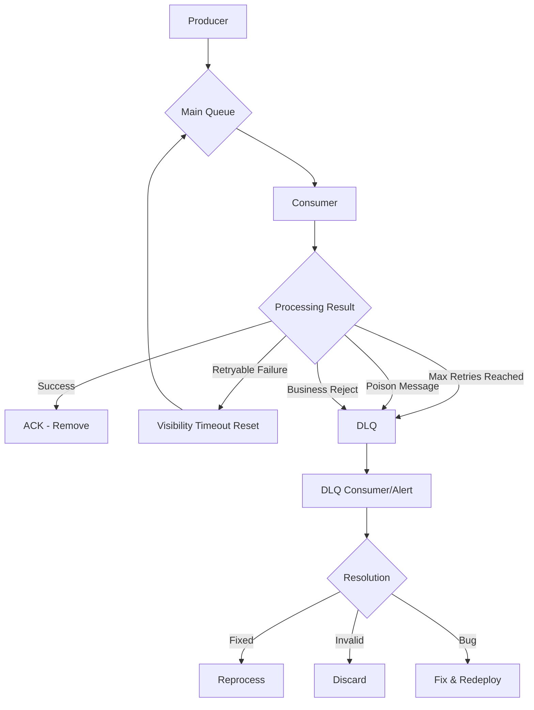

# Message Queue Patterns: Pub/Sub, Point-to-Point, Dead Letter Queue

## 1. Mục tiêu của task

Hiểu sâu bản chất các messaging patterns cốt lõi trong hệ thống phân tán:
- **Point-to-Point (P2P)**: Một message chỉ được xử lý bởi đúng một consumer
- **Publish/Subscribe (Pub/Sub)**: Một message được phân phối đến nhiều subscribers
- **Dead Letter Queue (DLQ)**: Cơ chế xử lý message thất bại một cách đáng tin cậy

> Mục tiêu cuối cùng: Biết **khi nào dùng pattern nào**, **rủi ro tiềm ẩn**, và **cách vận hành trong production**.

---

## 2. Bản chất và cơ chế hoạt động

### 2.1 Point-to-Point (P2P) Queue

#### Bản chất cơ chế

P2P dựa trên abstraction của **message queue** - một cấu trúc dữ liệu FIFO (First-In-First-Out) phân tán. Tuy nhiên, FIFO chỉ là surface. Bản chất sâu hơn:

```
┌─────────────────────────────────────────────────────────────┐
│                     P2P Queue Mechanism                      │
├─────────────────────────────────────────────────────────────┤
│                                                              │
│   Producer ──► │ Queue │ ──► Consumer A (message removed)   │
│                │       │                                    │
│   Producer ──► │ Queue │ ──► Consumer B (message removed)   │
│                                                              │
│   ┌─────────────────────────────────────────────────────┐   │
│   │  Core Property: Message được xóa sau khi ACK        │   │
│   │  Visibility Timeout: Message "ẩn" với consumer khác │   │
│   └─────────────────────────────────────────────────────┘   │
└─────────────────────────────────────────────────────────────┘
```

**Visibility Timeout** là cơ chế then chốt:
- Khi consumer pull message, message không bị xóa ngay mà chuyển sang trạng thái "invisible"
- Nếu consumer xử lý thành công → gửi ACK → message bị xóa vĩnh viễn
- Nếu consumer crash hoặc timeout → message "hiện lại" → consumer khác có thể pick up

#### Mục tiêu thiết kế

| Mục tiêu | Giải thích |
|----------|-----------|
| **Work Distribution** | Cân bằng tải tự động giữa nhiều consumer instances |
| **Fault Tolerance** | Message không mất khi consumer crash |
| **Processing Guarantee** | Đảm bảo mỗi message được xử lý ít nhất một lần (at-least-once) |
| **Decoupling** | Producer không cần biết consumer nào xử lý |

#### Trade-offs

| Ưu điểm | Nhược điểm |
|---------|-----------|
| Load balancing tự nhiên | Không broadcast được - một message chỉ đến một nơi |
| Dễ scale consumer horizontally | Ordering không đảm bảo khi có nhiều consumers |
| Auto-recovery khi consumer fail | Risk of duplicate processing nếu ACK bị miss |

> **Quan trọng**: P2P không đảm bảo **exactly-once processing** mặc định. Nếu consumer xử lý xong nhưng chết trước khi ACK, message được redeliver → duplicate processing.

---

### 2.2 Publish/Subscribe (Pub/Sub)

#### Bản chất cơ chế

Pub/Sub hoạt động dựa trên **topic** abstraction - một logical channel mà producers publish vào, subscribers lắng nghe.

```
┌─────────────────────────────────────────────────────────────┐
│                   Pub/Sub Mechanism                          │
├─────────────────────────────────────────────────────────────┤
│                                                              │
│   Producer ──► │  Topic  │ ──► Subscriber A (copy 1)        │
│                │         │ ──► Subscriber B (copy 2)        │
│   Producer ──► │  Topic  │ ──► Subscriber C (copy 3)        │
│                                                              │
│   ┌─────────────────────────────────────────────────────┐   │
│   │  Core Property: Mỗi subscriber nhận COPY riêng      │   │
│   │  Message persistence: Phụ thuộc vào retention policy│   │
│   └─────────────────────────────────────────────────────┘   │
└─────────────────────────────────────────────────────────────┘
```

**Hai mô hình Pub/Sub chính:**

| Mô hình | Đặc điểm | Use case |
|---------|----------|----------|
| **Fan-out** (Push) | Broker push message đến tất cả subscribers | Real-time notifications, live updates |
| **Pull-based** | Subscriber chủ động poll messages | Batch processing, replay capability |

**Offset Management** (đặc biệt quan trọng với pull-based):
- Mỗi subscriber duy trì **offset** - vị trí message đã đọc trong topic
- Cho phép replay: subscriber có thể "quay lại" đọc message cũ
- Independent progress: mỗi subscriber đọc với tốc độ riêng

#### Mục tiêu thiết kế

| Mục tiêu | Giải thích |
|----------|-----------|
| **Broadcast** | Một event đến nhiều hệ thống độc lập |
| **Decoupled Evolution** | Thêm subscriber mới không ảnh hưởng producer |
| **Event Sourcing Foundation** | Lưu trữ events để replay, audit |
| **Loose Coupling** | Subscribers không biết nhau tồn tại |

#### Trade-offs

| Ưu điểm | Nhược điểm |
|---------|-----------|
| Broadcast capability | Không có load balancing cho cùng một subscriber group |
| Replay capability | Storage cost cao hơn (giữ message cho tất cả subscribers) |
| Loose coupling | Harder to track "who processed what" |
| Independent scaling | Message ordering phức tạp hơn P2P |

> **Pitfall**: Nhiều ngưởi nhầm lẫn giữa **Topic với Queue**. Queue = competition (một ngườ thắng), Topic = collaboration (tất cả nhận).

---

### 2.3 Dead Letter Queue (DLQ)

#### Bản chất cơ chế

DLQ không phải là một queue pattern độc lập - nó là **cơ chế bảo vệ** cho cả P2P và Pub/Sub.

```
┌─────────────────────────────────────────────────────────────┐
│                    DLQ Mechanism                             │
├─────────────────────────────────────────────────────────────┤
│                                                              │
│   Main Queue                                                  │
│   ┌─────────┐    Process     ┌─────────┐                     │
│   │ Message │ ─────────────► │ Success │ ──► ACK             │
│   └─────────┘                └─────────┘                     │
│        │                                                      │
│        │ Max retries exceeded                                │
│        ▼                                                      │
│   ┌─────────┐    Move to     ┌─────────────────────────┐     │
│   │  FAIL   │ ─────────────► │      DLQ (Isolate)      │     │
│   └─────────┘                │  - Poison message         │     │
│                              │  - Buggy processing       │     │
│                              │  - Data anomaly           │     │
│                              └─────────────────────────┘     │
└─────────────────────────────────────────────────────────────┘
```

**Các trigger chuyển message sang DLQ:**

| Trigger | Ý nghĩa | Ví dụ |
|---------|---------|-------|
| **Max retries** | Consumer fail n lần | Exception trong code, external API down |
| **Poison message** | Message format invalid | Schema mismatch, corrupted payload |
| **Timeout** | Processing quá lâu | Infinite loop, blocking I/O |
| **Explicit reject** | Business logic từ chối | Invalid order state, fraud detection |

#### Mục tiêu thiết kế

| Mục tiêu | Giải thích |
|----------|-----------|
| **Head-of-line blocking prevention** | Message lỗi không làm tắc nghẽn queue |
| **Debugging capability** | Cô lập message lỗi để phân tích |
| **Poison pill isolation** | Bảo vệ hệ thống khỏi message "độc" |
| **Retry with backoff** | Cho phép hệ thống phục hồi trước khi retry |

#### Trade-offs

| Ưu điểm | Nhược điểm |
|---------|-----------|
| Ngăn queue tắc nghẽn | Thêm operational complexity |
| Cô lập poison messages | Cần quy trình xử lý DLQ riêng |
| Cho phép investigation | Delay trong xử lý message lỗi |
| Protect system health | Risk of DLQ overflow nếu không monitor |

---

## 3. Kiến trúc và luồng xử lý

### 3.1 So sánh high-level

```
┌─────────────────────────────────────────────────────────────────────────┐
│                        Pattern Comparison                               │
├─────────────────────────────────────────────────────────────────────────┤
│                                                                         │
│  Aspect          │  Point-to-Point      │  Pub/Sub                     │
│  ────────────────┼──────────────────────┼──────────────────────────────│
│  Delivery        │  One consumer only   │  All subscribers              │
│  Load Balancing  │  Built-in            │  Manual (consumer groups)    │
│  Ordering        │  FIFO (single queue) │  Partition-based             │
│  Persistence     │  Until consumed      │  Until retention expires     │
│  Replay          │  ❌ No               │  ✅ Yes                      │
│  Use Case        │  Task queues         │  Event streaming             │
│                                                                         │
└─────────────────────────────────────────────────────────────────────────┘
```

### 3.2 Luồng xử lý với DLQ



---

## 4. So sánh các lựa chọn triển khai

### 4.1 Message Brokers phổ biến

| Broker | P2P Support | Pub/Sub | DLQ Support | Best For |
|--------|-------------|---------|-------------|----------|
| **RabbitMQ** | ✅ Excellent | ✅ Good | ✅ Native | Complex routing, traditional MQ |
| **Apache Kafka** | ⚠️ Via Consumer Groups | ✅ Excellent | ⚠️ Manual DLQ topic | High throughput, event streaming |
| **AWS SQS** | ✅ Native | ❌ No | ✅ Native DLQ | Serverless, simple P2P |
| **AWS SNS** | ❌ No | ✅ Native | ⚠️ Via SQS DLQ | Mobile push, email |
| **Redis Streams** | ✅ Good | ✅ Good | ⚠️ Manual | In-memory, low latency |
| **ActiveMQ** | ✅ Native | ✅ Native | ✅ Native | JMS compliance |

### 4.2 Khi nào dùng pattern nào?

**Chọn Point-to-Point khi:**
- Cần load balancing giữa nhiều workers (image processing, email sending)
- Mỗi task chỉ cần xử lý một lần
- Ordering không quan trọng hoặc có thể handle trong application

**Chọn Pub/Sub khi:**
- Một event cần trigger nhiều hệ thống (order created → notification, analytics, inventory)
- Cần audit log hoặc replay capability
- Các subscribers có tốc độ xử lý khác nhau

**Chọn cả hai (hybrid):**
- Kafka Consumer Groups = Pub/Sub + P2P hybrid
- RabbitMQ with exchanges = flexible routing

---

## 5. Rủi ro, Anti-patterns, và Lỗi thường gặp

### 5.1 Failure Modes

#### P2P Failures

| Lỗi | Nguyên nhân | Hậu quả | Giải pháp |
|-----|-------------|---------|-----------|
| **Message loss** | Consumer ACK trước khi xử lý xong | Mất dữ liệu | Auto-ACK tắt, manual ACK sau xử lý |
| **Duplicate processing** | Consumer xử lý xong nhưng ACK timeout | Dữ liệu trùng lặp | Idempotent consumers |
| **Queue buildup** | Consumer chậm hơn producer | Lag tăng, memory issue | Scale consumer, backpressure |
| **Head-of-line blocking** | Message đầu queue lỗi | Toàn bộ queue stuck | DLQ với timeout |

#### Pub/Sub Failures

| Lỗi | Nguyên nhân | Hậu quả | Giải pháp |
|-----|-------------|---------|-----------|
| **Slow consumer** | Consumer không kịp xử lý | Lag tăng, disk full | Consumer group scaling |
| **Offset commit fail** | Consumer crash sau xử lý | Duplicate processing | Atomic commit (transaction) |
| **Topic explosion** | Quá nhiều topics | Management complexity | Topic naming convention |
| **Retention data loss** | Message bị xóa trước khi consume | Mất event | Tăng retention, monitor lag |

#### DLQ Failures

| Lỗi | Nguyên nhân | Hậu quả | Giải pháp |
|-----|-------------|---------|-----------|
| **DLQ ignored** | Không có process xử lý DLQ | Message accumulate | Alerting, DLQ consumer |
| **Circular retry** | Message từ DLQ về main queue lại fail | Infinite loop | Max retry in DLQ, manual only |
| **DLQ overflow** | Quá nhiều message lỗi | Resource exhaustion | DLQ retention, paging |

### 5.2 Anti-patterns

> **❌ Shared queue cho nhiều message types**
> - Vấn đề: Không thể scale independently, retry policy khác nhau gây conflict
> - Giải pháp: Separate queue per message type hoặc use routing keys

> **❌ No visibility timeout tuning**
> - Vấn đề: Timeout quá ngắn → duplicate processing; quá dài → slow recovery
> - Giải pháp: Baseline processing time + 20-30% buffer

> **❌ Synchronous processing trong consumer**
> - Vấn đề: Block thread, không tận dụng được concurrency
> - Giải pháp: Async processing, bounded queue trong consumer

> **❌ No idempotency**
> - Vấn đề: At-least-once delivery gây side effect trùng lặp
> - Giải pháp: Idempotency keys, deduplication logic

---

## 6. Khuyến nghị thực chiến trong Production

### 6.1 Observability

**Metrics cần theo dõi:**

| Metric | Ý nghĩa | Alert Threshold |
|--------|---------|-----------------|
| `QueueDepth` / `Lag` | Số message chưa xử lý | > 1000 messages |
| `ConsumerLag` | Thời gian message chờ | > 5 minutes |
| `DLQDepth` | Message trong DLQ | > 0 (investigate) |
| `ProcessingTime` | Thời gian xử lý | > p99 threshold |
| `AckLatency` | Thời gian ACK | > 1 second |

**Logging best practices:**
```
- Correlation ID: Trace message từ producer → consumer
- Message ID: Unique identifier cho mỗi message
- Timestamp: Produce time, consume time, process time
- Retry count: Số lần đã retry
```

### 6.2 Configuration Guidelines

**Visibility Timeout:**
```
visibility_timeout = p99_processing_time × 1.3
```

**Max Retries:**
```
- Transient failures (network): 3-5 retries với exponential backoff
- Business failures (validation): 0-1 retry, nếu fail → DLQ ngay
- Poison messages: 1-2 retry max để tránh infinite loop
```

**DLQ Configuration:**
```
- MaxReceiveCount: 3 (SQS), hoặc equivalent
- Retention: ≥ main queue retention
- Alerting: Immediate alert khi message vào DLQ
- Reprocess: Manual review trước khi requeue
```

### 6.3 Scaling Strategies

**P2P Scaling:**
- Scale consumer instances theo queue depth
- Use prefetch count để tránh overwhelm slow consumer
- Partition queue nếu cần ordering

**Pub/Sub Scaling:**
- Consumer groups cho load balancing trong Pub/Sub
- Partition assignment strategy: Range hoặc Round-robin
- Monitor partition lag per consumer

### 6.4 Security

- **Encryption at rest**: Message payload encrypt
- **Encryption in transit**: TLS cho tất cả connections
- **Access control**: IAM policies, không dùng shared credentials
- **Payload validation**: Schema validation trước khi xử lý

---

## 7. Kết luận

### Bản chất cốt lõi

| Pattern | Bản chất |
|---------|----------|
| **P2P** | Work distribution với **competing consumers** - một ngườ thắng, message biến mất |
| **Pub/Sub** | Event broadcast với **independent consumers** - tất cả nhận, mỗi ngườ tiến riêng |
| **DLQ** | **Circuit breaker** cho message queue - cô lập failure để bảo vệ hệ thống |

### Trade-off tổng quan

```
┌─────────────────────────────────────────────────────────┐
│           P2P vs Pub/Sub Decision Matrix                │
├─────────────────────────────────────────────────────────┤
│                                                         │
│  Cần load balancing?        ──► P2P                    │
│  Cần broadcast?             ──► Pub/Sub                │
│  Cần replay capability?     ──► Pub/Sub                │
│  Cần exactly-once?          ──► P2P + Idempotency      │
│  Cần ordering guarantee?    ──► P2P hoặc Partitioned   │
│  Cần event sourcing?        ──► Pub/Sub                │
│                                                         │
│  Production bắt buộc: DLQ cho cả hai pattern           │
│                                                         │
└─────────────────────────────────────────────────────────┘
```

### Tư duy Senior

1. **Không có pattern nào "tốt hơn"** - chỉ có "phù hợp hơn" cho use case cụ thể
2. **At-least-once là mặc định** - thiết kế consumer idempotent từ đầu
3. **DLQ không phải optional** - nó là production requirement
4. **Monitor lag** - lag là leading indicator của vấn đề
5. **Poison messages sẽ xảy ra** - luôn có schema validation và error handling

---

## 8. Tài liệu tham khảo

- AWS SQS Developer Guide - Visibility Timeout and DLQ
- Apache Kafka Documentation - Consumer Groups and Offset Management
- RabbitMQ Tutorials - Routing and Topic Exchanges
- Enterprise Integration Patterns (Hohpe, Woolf) - Messaging Patterns
- Designing Data-Intensive Applications (Martin Kleppmann) - Chapter 11
