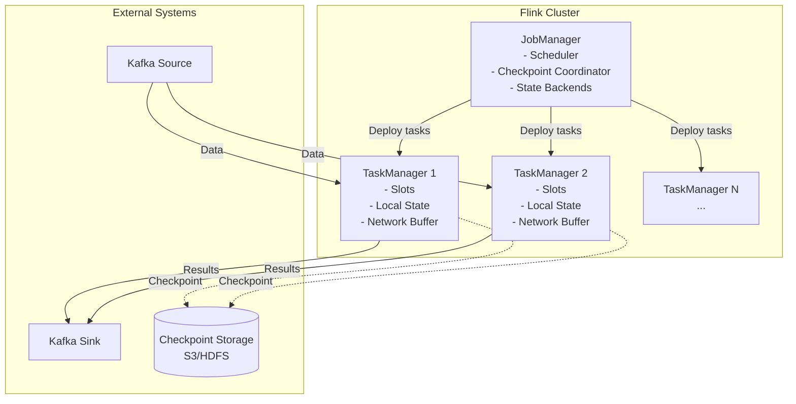
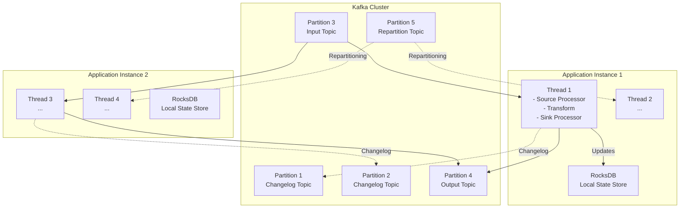
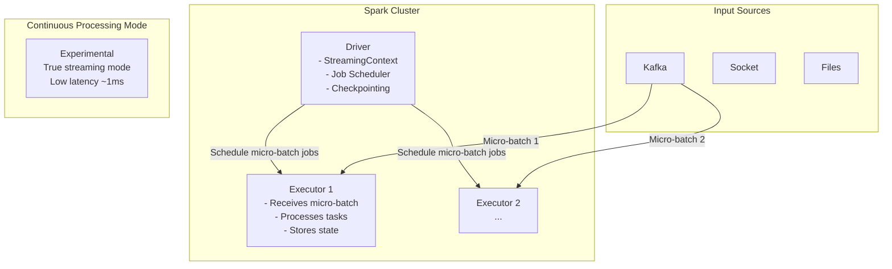

# Event Stream Processing - Flink vs Kafka Streams vs Spark Streaming

## 1. Mục tiêu của task

Hiểu sâu bản chất của stream processing engines, phân tích trade-offs giữa Flink, Kafka Streams và Spark Streaming trong các khía cạnh: state management, consistency guarantees, latency, throughput, operational complexity. Đặc biệt tập trung vào **stateful operations** - cơ chế lưu trữ và quản lý state trong distributed stream processing.

---

## 2. Bản chất và cơ chế hoạt động

### 2.1. Stream Processing Model - Event Time vs Processing Time

| Dimension | Processing Time | Event Time | Ingestion Time |
|-----------|-----------------|------------|----------------|
| **Definition** | Thởi điểm operator xử lý record | Thởi điểm event thực sự xảy ra | Thởi điểm record vào Kafka |
| **Accuracy** | ❌ Không chính xác khi có delay | ✅ Chính xác nhất | ⚠️ Trung gian |
| **Determinism** | Non-deterministic | Deterministic | Partially deterministic |
| **Use Case** | Real-time alerts không cần accuracy cao | Analytics, billing, fraud detection | Khi không có event timestamp |

> **Bản chất quan trọng**: Event time processing đòi hỏi **watermark mechanism** để xử lý out-of-order events. Watermark là một heuristic marker báo hiệu "tất cả events có timestamp < watermark đã đến".

### 2.2. State Management - Cốt lõi của Stateful Stream Processing

**Bản chất vấn đề**: Khi cần tính toán aggregation (count, sum, average) hoặc join streams, hệ thống phải lưu trữ intermediate state. Trong distributed environment, state này phải:
- **Fault-tolerant**: Không mất dữ liệu khi node crash
- **Scalable**: Có thể redistribute khi scale up/down
- **Queryable**: Cho phép debug/monitor runtime

**State Backend Architectures**:

| Backend | Flink | Kafka Streams | Spark Streaming |
|---------|-------|---------------|-----------------|
| **In-Memory** | HashMapStateBackend | In-memory stores | Memory-only (unreliable) |
| **Embedded** | EmbeddedRocksDBStateBackend | RocksDB (default) | - |
| **Remote** | - | - | RDD checkpoint to HDFS/S3 |

> **Chi tiết cơ chế RocksDB trong Kafka Streams**: RocksDB là LSM-tree based storage. Kafka Streams dùng RocksDB như một embedded key-value store trên mỗi task instance. State được replicate qua changelog topics (Kafka compacted topics) để đảm bảo fault tolerance.

### 2.3. Checkpointing & Fault Tolerance

**Flink - Chandy-Lamport Distributed Snapshots**:

```
┌─────────────────────────────────────────────────────────┐
│                    Flink JobGraph                       │
├─────────────────────────────────────────────────────────┤
│                                                          │
│   Source → [Async Barrier] → Transform → [Async Barrier] │
│      ↓                        ↓                        │
│   Snapshot state          Snapshot state              │
│   to distributed          to distributed              │
│   storage (S3/HDFS)       storage                     │
│                                                          │
│   Checkpoint Coordinator (JobManager)                   │
│   - Inject barrier markers                              │
│   - Collect ACKs from all operators                     │
│   - Complete checkpoint on global consistency           │
└─────────────────────────────────────────────────────────┘
```

**Kafka Streams - Standby Replicas + Changelog Topics**:
- Mỗi state store có một changelog topic (compacted)
- Khi instance fail, task được reschedule sang instance khác
- New instance replay changelog topic để reconstruct state
- Standby replicas (optional): giữ bản sao hot trên instance khác

**Spark Streaming - Micro-batch + RDD Lineage**:
- DStream là chuỗi RDDs (micro-batches)
- Checkpoint: Lưu RDD vào reliable storage (HDFS/S3)
- WAL (Write-Ahead Log): Lưu received data trước khi process
- Recovery: Recompute từ checkpoint + WAL

> **Trade-off quan trọng**: Flink checkpointing có **exactly-once semantics** với overhead thấp (async, incremental). Kafka Streams có **at-least-once** mặc định, configurable to exactly-once nhưng với higher latency do transactional writes.

---

## 3. Kiến trúc và luồng xử lý

### 3.1. Flink Architecture



**Key Characteristics**:
- **True streaming**: Native record-by-record processing (not micro-batch)
- **Pipelined execution**: Records flow through operators without waiting
- **Backpressure**: Natural TCP backpressure từ slow consumer → producer

### 3.2. Kafka Streams Architecture



**Key Characteristics**:
- **Library, not framework**: Chạy như một Java application bình thường
- **No separate cluster**: Sử dụng Kafka cluster làm coordination
- **Co-partitioning**: Input topics phải có cùng partition count cho joins
- **Rebalancing**: Consumer group protocol để redistribute partitions

### 3.3. Spark Streaming Architecture



**Key Characteristics**:
- **Micro-batch model**: Collect data trong interval (default 1s), rồi process như batch
- **Structured Streaming**: SQL-like API, automatic state management
- **Continuous Processing**: True streaming mode (experimental, limited features)

---

## 4. So sánh chi tiết

### 4.1. Latency vs Throughput

| Engine | Latency | Throughput | Model |
|--------|---------|------------|-------|
| **Flink** | < 100ms (typical), < 10ms (optimized) | Very High | True streaming |
| **Kafka Streams** | ~10-100ms | High | True streaming |
| **Spark Structured Streaming** | ~100ms-seconds | Very High | Micro-batch (default) |
| **Spark Continuous** | ~1ms | Medium | True streaming (limited) |

> **Insight**: Spark micro-batch có throughput cao vì vectorization và code generation, nhưng latency bị bound bởi batch interval. Flink có latency thấp nhất vì native streaming + async checkpointing.

### 4.2. State Management Comparison

| Feature | Flink | Kafka Streams | Spark Streaming |
|---------|-------|---------------|-----------------|
| **State Size** | TB-level (RocksDB spilling) | GB-level per instance (RocksDB) | Limited by executor memory |
| **Queryable State** | ✅ Yes (REST API) | ✅ Interactive Queries | ❌ Limited |
| **TTL Support** | ✅ Configurable per state | ✅ Configurable | ⚠️ Limited |
| **State Migration** | ✅ Savepoint (version upgrade) | ❌ Difficult | ⚠️ Checkpoint restore |
| **Incremental Checkpoint** | ✅ Yes | ❌ Full changelog replay | ⚠️ Limited |

### 4.3. Exactly-Once Semantics

| Engine | End-to-End Exactly-Once | Mechanism |
|--------|------------------------|-----------|
| **Flink** | ✅ Yes | Two-phase commit (2PC) với transactional sinks |
| **Kafka Streams** | ✅ Yes | Kafka transactions (producer + consumer) |
| **Spark Streaming** | ✅ Yes | Idempotent writes + checkpoint |

> **Chi tiết Flink 2PC**: Flink dùng TwoPhaseCommitSinkFunction. Trong checkpoint: pre-commit (flush data), on checkpoint ACK: actual commit. Nếu fail: abort và rollback.

### 4.4. Windowing Capabilities

| Window Type | Flink | Kafka Streams | Spark |
|-------------|-------|---------------|-------|
| **Tumbling** | ✅ | ✅ | ✅ |
| **Sliding** | ✅ | ✅ | ✅ |
| **Session** | ✅ (dynamic gap) | ✅ (static gap) | ✅ |
| **Custom** | ✅ | ⚠️ Limited | ⚠️ Limited |
| **SQL/Table API** | ✅ Rich | ❌ Limited | ✅ Rich |

> **Session Window insight**: Flink hỗ trợ dynamic session gap (gap thay đổi dựa trên data), trong khi Kafka Streams chỉ hỗ trợ fixed gap.

---

## 5. Stateful Operations Deep Dive

### 5.1. Types of Stateful Operations

```
┌─────────────────────────────────────────────────────────────────┐
│                    Stateful Operations                          │
├─────────────────────────────────────────────────────────────────┤
│                                                                  │
│  1. KEYED STATE (per-key state)                                  │
│     ┌─────────┐     ┌─────────┐     ┌─────────┐                 │
│     │ user_1  │     │ user_2  │     │ user_3  │                 │
│     │ count=5 │     │ count=3 │     │ count=7 │                 │
│     └─────────┘     └─────────┘     └─────────┘                 │
│     • ValueState<T>                                              │
│     • ListState<T>                                               │
│     • MapState<K, V>                                             │
│     • ReducingState<T>                                           │
│     • AggregatingState<IN, OUT>                                  │
│                                                                  │
│  2. OPERATOR STATE (parallel instance state)                     │
│     • ListState<T> - redistribute on scale                      │
│     • BroadcastState<K, V> - same on all instances              │
│                                                                  │
│  3. GLOBAL STATE (shared across all)                            │
│     • Not recommended - coordination overhead                    │
│                                                                  │
└─────────────────────────────────────────────────────────────────┘
```

### 5.2. State Backend Performance Characteristics

| Backend | Latency | Memory | Disk Usage | Best For |
|---------|---------|--------|------------|----------|
| **HashMap (Memory)** | ~μs | High | None | Small state, low latency |
| **RocksDB (Embedded)** | ~ms | Low | High | Large state, predictable |
| **Remote (Redis/Cassandra)** | ~10ms+ | Medium | External | Cross-job state sharing |

> **Bản chất RocksDB**: LSM-tree structure (Log-Structured Merge-tree) tối ưu cho write-heavy workloads. Data ghi vào memtable → flush thành SST files → compaction merge các SST files. Trade-off: write amplification vs read amplification.

### 5.3. State Recovery & Migration

**Flink Savepoints**:
- User-triggered, consistent snapshot
- Có thể resume từ savepoint với different parallelism
- Cho phép upgrade application code (state schema evolution)
- Cơ chế: Stop world → snapshot all state → resume

**Kafka Streams Rebalancing**:
- Consumer group rebalance khi instance join/leave
- Standby tasks (optional): maintain hot replica
- Changelog replay: rebuild state from Kafka topic
- Stateless tasks: immediate reassignment

> **Anti-pattern**: Large state + frequent rebalancing = hours of recovery time. Solution: Standby replicas hoặc incremental cooperative rebalancing.

---

## 6. Rủi ro, Anti-patterns, Lỗi thường gặp

### 6.1. Hot Partitions (Data Skew)

```
❌ ANTI-PATTERN: Unbalanced key distribution

Partition 1: 80% of data (hot partition)
Partition 2-10: 20% of data

Result: One task overwhelmed, others idle
Latency spikes, backpressure buildup

✅ SOLUTIONS:
1. Salting keys: userId + random(0-9) → reduce, then aggregate
2. Custom partitioner based on historical data
3. Flink: Rescale state with keyBy redistribution
```

### 6.2. State Size Explosion

| Cause | Symptom | Solution |
|-------|---------|----------|
| **Unbounded state** | OOM, checkpoint timeout | TTL, state cleanup |
| **Large keys** | RocksDB inefficiency | Key compaction |
| **Large values** | Serialization overhead | Value compression |
| **State churn** | Frequent updates, little reuse | Windowed aggregation |

> **Production incident**: Kafka Streams với unbounded KTable (không set retention) → RocksDB 100GB+ → startup time 30+ minutes → service degradation.

### 6.3. Watermark & Late Data

```
❌ ANTI-PATTERN: Watermark too aggressive

maxOutOfOrderness = 0ms
Result: Drop legitimate late events

❌ ANTI-PATTERN: Watermark too lenient

maxOutOfOrderness = 1 hour
Result: Windows never close, state grows forever

✅ BEST PRACTICE:
- Watermark = 99th percentile of event delay
- Side outputs for late data
- Monitoring: watermark lag metric
```

### 6.4. Checkpointing Failures

| Symptom | Root Cause | Fix |
|---------|-----------|-----|
| Checkpoint timeout | State too large | Incremental checkpoint, reduce state |
| Increasing duration | Backpressure | Tune parallelism, optimize serialization |
| Consistent failure | Network/S3 issues | Retry config, local disk fallback |

---

## 7. Khuyến nghị thực chiến trong Production

### 7.1. When to Choose What

**Choose Flink when**:
- Complex event time processing
- Large state (TB-level)
- Complex windowing (session, custom)
- Need SQL/Table API
- ML integration (FlinkML)

**Choose Kafka Streams when**:
- Already using Kafka ecosystem
- Simple transformations, aggregations
- Want library approach (not separate cluster)
- Changelog-based architecture phù hợp
- Team prefers Java/Scala only

**Choose Spark Streaming when**:
- Existing Spark batch jobs
- Need unified batch + streaming code
- MLlib integration
- SQL-heavy workloads
- Lambda architecture migration

### 7.2. Monitoring & Observability

**Critical Metrics**:

| Metric | Flink | Kafka Streams | Spark |
|--------|-------|---------------|-------|
| **Lag/Consumer lag** | numRecordsInPerSecond - numRecordsOutPerSecond | consumer-lag-metrics | inputRate vs processingRate |
| **State size** | State size per operator | RocksDB metrics | State store size |
| **Checkpoint** | Duration, size, failures | Changelog lag | Batch completion time |
| **Backpressure** | backPressuredTimeMsPerSecond | N/A | Scheduling delay |
| **Watermarks** | CurrentWatermark | N/A | Event time watermark |

### 7.3. Java 21+ Considerations

- **Virtual Threads**: Flink đang thử nghiệm virtual threads cho async I/O operations
- **Foreign Function & Memory API**: Potential cho zero-copy serialization
- **Pattern Matching**: Cleaner DSL APIs trong Flink Table API

### 7.4. Deployment Patterns

```
┌─────────────────────────────────────────────────────────────┐
│           Kubernetes Deployment Strategy                     │
├─────────────────────────────────────────────────────────────┤
│                                                              │
│  Flink: Application Mode                                     │
│  ┌─────────────┐    ┌─────────────┐    ┌─────────────┐     │
│  │ JobManager  │────│ TaskManager │────│ TaskManager │     │
│  │ (embedded)  │    │   (pods)    │    │   (pods)    │     │
│  └─────────────┘    └─────────────┘    └─────────────┘     │
│  • Single jar deployment                                     │
│  • Pod per TaskManager                                       │
│  • HPA based on CPU/backpressure                            │
│                                                              │
│  Kafka Streams: StatefulSet                                  │
│  ┌─────────────┐    ┌─────────────┐                         │
│  │  Instance   │────│  Instance   │                         │
│  │   (pod)     │    │   (pod)     │                         │
│  │  +RocksDB   │    │  +RocksDB   │                         │
│  └─────────────┘    └─────────────┘                         │
│  • PVC for RocksDB persistence                               │
│  • Anti-affinity for zone distribution                       │
│  • Headless service for discovery                           │
│                                                              │
└─────────────────────────────────────────────────────────────┘
```

---

## 8. Kết luận

**Bản chất cốt lõi**: Stream processing engines khác nhau ở **state management model** và **processing semantics**.

| Dimension | Winner | Notes |
|-----------|--------|-------|
| **Lowest latency** | Flink | Native streaming + async checkpoint |
| **Operational simplicity** | Kafka Streams | Library model, no cluster mgmt |
| **Unified batch/stream** | Spark | Same API, different execution |
| **Large state** | Flink | RocksDB spilling, incremental checkpoint |
| **Exactly-once** | Tie | All support, different trade-offs |

**Trade-off quan trọng nhất**: Event time accuracy vs latency vs operational complexity. Không có engine nào "tốt nhất" - chỉ có "phù hợp nhất" cho use case cụ thể.

**Rủi ro lớn nhất**: Unbounded state growth không được monitor → checkpoint failure → data loss hoặc infinite recovery loops.

**Recommendation**: Start với Kafka Streams nếu ecosystem đơn giản. Scale lên Flink khi cần complex windowing, large state, hoặc low latency requirements. Spark phù hợp khi có existing Spark infrastructure và ML requirements.
