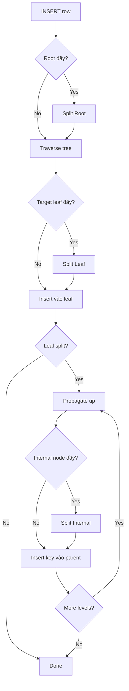

# Indexing Strategies - B-Tree, B+Tree, Hash Index, Covering Index

## 1. Mục tiêu của Task

Hiểu sâu bản chất các cấu trúc index trong database: cách chúng tổ chức dữ liệu tại tầng storage, tại sao B+Tree lại thống trị OLTP, khi nào hash index có lợi thế, và covering index tối ưu như thế nào. Không dừng ở "B-Tree cân bằng, tìm kiếm O(log n)", mà phải hiểu **chi phí thực tế trên disk**, **locality**, **write amplification**, và **lock contention**.

---

## 2. Bản Chất và Cơ Chế Hoạt Động

### 2.1 B-Tree: Nền Tảng Lý Thuyết

B-Tree (Bayer & McCreight, 1972) là cấu trúc **self-balancing search tree** được tối ưu cho **external memory** (disk-based storage).

#### Bản Chất Tầng Thấp

```
Mỗi node = 1 disk block (thường 4KB-16KB)
Mỗi node chứa: [key₁, key₂, ..., keyₙ] + [pointer₀, pointer₁, ..., pointerₙ]
Số key/node: n ∈ [t-1, 2t-1] với t là minimum degree
```

**Tại sao node lớn?**
- Disk I/O tốn kém (~10ms seek + rotational latency)
- Sequential read nhanh hơn random read
- Node lớn → ít level hơn → ít disk seek hơn

Với block size 16KB, key 8 bytes, pointer 8 bytes:
- Số key/node ≈ 16KB / 16B ≈ 1000 keys
- Height 3 → 1000³ = 1 tỷ keys chỉ cần 3 disk reads

#### Cơ Chế Split/Merge

**Split (insert vào node đầy):**
```
Node có 2t-1 keys → split thành 2 node (t-1 keys mỗi node)
Key median promoted lên parent
Height tăng khi root split
```

**Merge (delete đến < t-1 keys):**
```
Merge với sibling hoặc redistribute keys
Height giảm khi root rỗng sau merge
```

> **Trade-off quan trọng:** B-Tree giữ data trong mọi node (cả leaf và internal). Điều này làm giảm fanout (ít key/node hơn) và complicates range scan.

---

### 2.2 B+Tree: Thực Dụng Hóa Cho Database

B+Tree là biến thể B-Tree được **100% production databases** sử dụng (InnoDB, PostgreSQL, SQL Server, Oracle).

#### Điểm Khác Biệt Cốt Lõi

| Đặc điểm | B-Tree | B+Tree |
|----------|--------|--------|
| Data location | Mọi node | Chỉ leaf nodes |
| Leaf structure | Không linked | **Doubly linked list** |
| Key trong internal node | Có thể không duplicate | Duplicate của leaf keys |
| Range scan | Không hiệu quả | **Sequential scan leaf** |
| Fanout | Thấp | **Cao hơn 2-3x** |

#### Cấu Trúc InnoDB B+Tree Clustered Index

```
[Root Node] (16KB)
    │
    ├── [Internal Node Level 2]
    │       ├── [Leaf Node 1] → [(10, row1), (20, row2), (30, row3)]
    │       └── [Leaf Node 2] → [(40, row4), (50, row5), (60, row6)]
    │
    └── [Internal Node Level 2]
            └── ...

Leaf nodes linked: [Leaf 1] ↔ [Leaf 2] ↔ [Leaf 3] ↔ ...
```

**Bản chất của Clustered Index:**
- Leaf chứa **toàn bộ row data** (không chỉ pointer)
- Secondary index chứa **primary key value** (not row pointer)
- Điều này tạo ra hai hiệu ứng quan trọng:
  1. Secondary index lookup = 2 tree traversals (index → PK → data)
  2. PK size ảnh hưởng trực tiếp tất cả secondary indexes

> **Pitfall production:** Chọn UUID làm PK → mọi secondary index phình to, cache efficiency giảm, insert chậm vì page split liên tục.

---

### 2.3 Hash Index: O(1) Có Giá CỦa Nó

Hash index dùng **hash table** để map key → value location.

#### Cơ Chế Hoạt Động

```
hash(key) → bucket index
bucket chứa: [hash_value, key, value_pointer]
Collision resolution: chaining hoặc open addressing
```

#### Variants Trong Production

| Loại | Database | Đặc điểm |
|------|----------|----------|
| **Memory hash** | MySQL MEMORY engine | Chỉ equi-lookup, không range, không sort |
| **Adaptive Hash Index (AHI)** | InnoDB | Build runtime dựa trên access pattern, auto-evict |
| **Hash partition của B+Tree** | PostgreSQL hash index | Static hash, page-based |
| **In-memory hash** | Buffer pool hash | Map (tablespace_id, page_no) → frame pointer |

#### Adaptive Hash Index (AHI) - Case Study Deep Dive

AHI là một trong những tính năng quan trọng nhất của InnoDB nhưng ít được hiểu đúng.

**Cơ chế:**
```
B+Tree lookup pattern:
  root → level2 → level3 → leaf (3 page accesses)

AHI caching:
  prefix of key → leaf page address

Sau khi warm up:
  hash(key_prefix) → leaf page (1 page access)
```

**AHI partition:**
- Mặc định 8 partitions (tránh contention)
- Mỗi partition là independent hash table
- Latch-free read (RW lock cho write)

**Khi nào AHI hiệu quả:**
- Workload có **repeated access** vào subset nhỏ của data
- Point lookups (SELECT ... WHERE pk = ?)
- Secondary index với low cardinality

**Khi nào AHI harmful:**
- Workload scan-heavy (AHI không được sử dụng)
- Buffer pool nhỏ (AHI chiếm ~10% BP)
- High concurrency writes (contention trên AHI partitions)

```sql
-- Monitor AHI efficiency
SHOW ENGINE INNODB STATUS;
-- Tìm section:
-- Hash searches/sec: 1000000.00
-- Non-hash searches/sec: 1000.00
-- Ratio > 100:1 là tốt
```

---

### 2.4 Covering Index: Index-Only Scan

#### Bản Chất

Covering index = Index chứa **tất cả columns cần thiết cho query**, không cần lookup vào clustered index.

```sql
-- Table: orders (id PK, user_id, status, created_at, total, ...)
-- Index: idx_user_status (user_id, status, created_at)

SELECT created_at FROM orders 
WHERE user_id = 123 AND status = 'completed';
```

**Execution flow:**
1. Traverse B+Tree trên `idx_user_status`
2. Find leaf với user_id=123, status='completed'
3. **Read created_at từ leaf luôn** (không cần PK lookup)
4. Return

> **Giá trị cốt lõi:** Tránh random I/O vào clustered index - thường expensive nhất trong query plan.

#### Index-Only Scan Condition

```
Query cần columns: {A, B, C}
Index chứa: {A, B, C, D, E} → Covering ✓
Index chứa: {A, B} → Không covering ✗ (cần lookup C)
```

#### Covering Index với Secondary Columns

```sql
-- Index: idx_covering (user_id, status) INCLUDE (created_at, total)
-- PostgreSQL/MySQL 8.0.21+ syntax
```

**Lợi ích của INCLUDE:**
- Columns trong INCLUDE không tham gia tree structure
- Không làm tăng tree height
- Không ảnh hưởng insert/update cost nhiều
- Cho phép "cover" nhiều query patterns

---

## 3. Kiến Trúc và Luồng Xử Lý

### 3.1 B+Tree Insertion Flow



### 3.2 Page Structure trong InnoDB

```
[File Header] 38 bytes
    - Checksum, page number, prev/next page (for linked list)
    
[Page Header] 56 bytes
    - Number of records, free space, level trong tree
    
[Infimum Record] - "pseudo-record" nhỏ nhất
    
[User Records] - Dữ liệu thực tế
    - Format: [header][null bitmap][variable cols][primary key][trx_id][roll_ptr][cols...]
    - Sorted by primary key trong clustered index
    
[Supremum Record] - "pseudo-record" lớn nhất

[Page Directory] - Sparse index của records
    - Mỗi entry = offset của record
    - Binary search trong directory → linear scan ~8 records
    
[File Trailer] 8 bytes
    - Checksum (detect torn pages)
```

> **Chi tiết quan trọng:** Page Directory cho phép binary search O(log n) trong page, không phải linear scan. Đây là lý do InnoDB nhanh hơn storage engines không có directory (như MyISAM cũ).

---

## 4. So Sánh Các Lựa Chọn

### 4.1 B+Tree vs Hash Index

| Tiêu chí | B+Tree | Hash Index |
|----------|--------|------------|
| **Equality lookup** | O(log n) | O(1) average |
| **Range scan** | O(log n + m) | **Không hỗ trợ** |
| **Prefix search** | Có (LIKE 'abc%') | Không |
| **Sort/ORDER BY** | Natural order | Không |
| **Space overhead** | Thấp | Cao (load factor ~70%) |
| **Lock granularity** | Row/page | Bucket/page |
| **Sequential access** | Tốt | Kém |
| **Hotspot (write)** | Có (rightmost page) | Phân tán tốt |

### 4.2 Composite Index Ordering

```sql
-- Index: (A, B, C)
-- Query patterns và index usage:

WHERE A = ?              → ✓ Index prefix
WHERE A = ? AND B = ?    → ✓ Full prefix
WHERE A = ? AND B = ? AND C = ? → ✓ Full match
WHERE A = ? AND C = ?    → ✓ Partial (chỉ A)
WHERE B = ?              → ✗ Không dùng index
WHERE A = ? ORDER BY B   → ✓ No sort needed
WHERE A = ? ORDER BY C   → ✗ File sort (B bị skip)
```

> **Quy tắc Leftmost Prefix:** Composite index chỉ usable khi query dùng leftmost columns liên tục. Skip column ở giữa = chỉ dùng được phần trước đó.

### 4.3 Index Selectivity Analysis

```sql
-- Cardinality = Số unique values / Tổng số rows
-- Selectivity cao = Index hiệu quả

-- Ví dụ: users table với 1M rows

status ENUM('active', 'inactive') -- cardinality = 2, selectivity = 0.000002% ❌
created_at TIMESTAMP -- cardinality ≈ 1M, selectivity = 100% ✓
email VARCHAR(255) -- cardinality = 1M, selectivity = 100% ✓
gender ENUM('M', 'F', 'O') -- cardinality = 3, selectivity = 0.000003% ❌
```

> **Guideline:** Index chỉ hiệu quả khi selectivity > 1% (rule of thumb). Low cardinality columns nên dùng bitmap index (Oracle) hoặc partition pruning.

---

## 5. Rủi Ro, Anti-Patterns, Lỗi Thường Gặp

### 5.1 Write Amplification

**Mỗi INSERT vào B+Tree có thể trigger:**
1. Leaf page update (1 write)
2. Leaf split → 2 new pages + parent update (3 writes)
3. Parent split → propagate up (2+ writes)
4. Doublewrite buffer write (2 writes - InnoDB crash recovery)
5. WAL/fsync (1 write)

**Tổng: 1 INSERT → 2-10 physical writes**

> **Production concern:** Workload insert-heavy với random PK (UUID) = constant page splits = write amplification cao = SSD wear + latency spikes.

### 5.2 Index Bloat

**Nguyên nhân:**
- UPDATE = DELETE + INSERT (Mark old version as deleted, insert new)
- DELETE không reclaim space ngay (MVCC, vacuum lag)
- Page không full sau nhiều deletes

**PostgreSQL:**
```sql
-- Monitor bloat
SELECT schemaname, tablename, 
       pg_size_pretty(pg_total_relation_size(schemaname||'.'||tablename)) as total_size,
       dead_tuples
FROM pg_stat_user_tables 
WHERE dead_tuples > 10000;

-- Fix: REINDEX CONCURRENTLY idx_name;
```

**MySQL:**
```sql
-- Optimize table (rebuild clustered index)
OPTIMIZE TABLE table_name; -- Blocking!
ALTER TABLE table_name ENGINE=InnoDB; -- Online in 5.6+
```

### 5.3 Lock Contention

**Gap Lock trong InnoDB REPEATABLE READ:**
```sql
-- Transaction 1
SELECT * FROM users WHERE age > 25 FOR UPDATE;
-- Locks: all records with age > 25 + gaps between them

-- Transaction 2 (blocked)
INSERT INTO users (age) VALUES (30); -- Waits for T1
```

> **Deadlock scenario:** Hai transactions lock overlapping gap ranges theo thứ tự ngược nhau.

### 5.4 Anti-Patterns

#### 1. Index Everything
```sql
-- 10 indexes trên 1 table
-- Cost: INSERT chậm 10x, disk space, cache pollution
```

#### 2. Duplicate Indexes
```sql
INDEX (A)
INDEX (A, B)  -- Redundant! (A,B) cover (A)
INDEX (A, B, C) -- Redundant!
```

#### 3. Implicit Conversions
```sql
-- phone là VARCHAR, nhưng query dùng số
WHERE phone = 1234567890  -- CAST(phone AS UNSIGNED) → không dùng index!
WHERE phone = '1234567890'  -- ✓ Uses index
```

#### 4. Leading Wildcard
```sql
WHERE email LIKE '%@gmail.com'  -- Full table scan
WHERE email LIKE 'user@%'       -- ✓ Range scan
```

### 5.5 Hotspot - The Rightmost Page Problem

**Sequential PK (AUTO_INCREMENT):**
```
All inserts go to rightmost leaf page
→ Contention trên buffer pool latch
→ Sequential disk writes (tốt cho SSD/HDD)
```

**Random PK (UUID):**
```
Inserts scattered khắp tree
→ No contention on single page
→ Random I/O, high page split rate
→ Poor buffer pool locality
```

> **Trade-off:** Sequential PK tốt cho insert throughput nhưng tạo "hot tail". Random PK tránh hotspot nhưng phá vỡ locality.

---

## 6. Khuyến Nghị Thực Chiến Trong Production

### 6.1 Index Design Principles

1. **Primary Key Selection:**
   - Dùng AUTO_INCREMENT hoặc snowflake ID (k-sortable)
   - Tránh UUID v4 (random) - dùng UUID v7 (time-ordered) nếu cần UUID
   - PK ngắn gọn (BIGINT > VARCHAR)

2. **Composite Index Strategy:**
   - Equality columns trước (WHERE a = ? AND b = ?)
   - Range column sau (WHERE a = ? AND b > ?)
   - Cần covering: include columns SELECT ở cuối

3. **Index Maintenance:**
   ```sql
   -- PostgreSQL: Monitor và reindex
   SELECT indexrelname, idx_scan, idx_tup_read, idx_tup_fetch
   FROM pg_stat_user_indexes
   WHERE idx_scan = 0 AND schemaname = 'public';
   -- Xóa indexes không được sử dụng
   ```

### 6.2 Monitoring Key Metrics

| Metric | Tool | Threshold | Action |
|--------|------|-----------|--------|
| Index hit ratio | pg_stat_database | > 99% | Tăng shared_buffers |
| Sequential scans | pg_stat_user_tables | High on large tables | Add index |
| Index bloat | pgstattuple extension | > 50% | REINDEX |
| Lock waits | performance_schema (MySQL) | > 10ms/query | Optimize queries |
| Buffer pool hit | InnoDB status | > 95% | Tăge innodb_buffer_pool_size |

### 6.3 Query Optimization Checklist

```sql
-- 1. EXPLAIN ANALYZE trước mọi optimization
EXPLAIN (ANALYZE, BUFFERS, FORMAT JSON) SELECT ...;

-- 2. Check actual rows vs estimated rows
-- Nếu variance > 10x → ANALYZE table để update statistics

-- 3. Verify index usage
-- Seq Scan trên large table = red flag

-- 4. Check for index-only scan
-- Heap Fetches cao = cần covering index
```

### 6.4 Version-Specific Optimizations

**PostgreSQL 14+:**
- Multirange types với GiST index
- Enable `wal_compression` để giảm write amplification

**PostgreSQL 15+:**
- Improved sort performance cho DISTINCT
- `NULLS NOT DISTINCT` trong unique indexes

**MySQL 8.0:**
- Invisible indexes (test before drop)
- Descending indexes (INDEX (A DESC, B ASC))
- JSON multi-valued indexes

**MySQL 8.0.31+ (InnoDB):**
- Selective undo log purge giảm bloat
- Improved AHI partitioning

---

## 7. Kết Luận

### Bản Chất Cốt Lõi

1. **B+Tree thống trị vì:** tối ưu cho disk I/O pattern (sequential > random), natural order support, và efficient range operations - không phải vì theoretical O(log n) đẹp đẽ.

2. **Hash index niche:** Chỉ hiệu quả cho equality lookup với no range requirements. Adaptive Hash Index là optimization layer, không phải replacement.

3. **Covering index value:** Không phải vì "tránh lookup" đơn thuần, mà vì tránh **random I/O** - bottleneck thực sự trong disk-based databases.

### Trade-off Quan Trọng Nhất

| Bạn chọn | Bạn đánh đổi |
|----------|-------------|
| Sequential PK | Insert hotspot nhưng tốt locality |
| Random PK | Phân tán insert nhưng cache thrashing |
| Nhiều indexes | Query nhanh, write chậm, space lớn |
| Covering index | Query nhanh, insert/update chậm hơn |
| Hash index | O(1) equality, zero range support |

### Rủi Ro Production Lớn Nhất

1. **Write amplification** - Random PK trên high-write workload = premature SSD failure
2. **Lock contention** - Gap locks trong high-concurrency REPEATABLE READ
3. **Index bloat** - Long-running transactions preventing vacuum/purge
4. **Implicit conversions** - Index không được sử dụng mà developer không biết

### Quyết Định Kiến Trúc

- **OLTP workload:** B+Tree clustered index, sequential PK, selective secondary indexes
- **Analytics workload:** Columnar storage ( không dùng B+Tree row store), bitmap indexes cho low cardinality
- **Hybrid:** Partition pruning để isolate hot data, BRIN indexes cho append-only data

---

## 8. Tham Khảo

- MySQL Internals Manual: InnoDB Physical Structure
- PostgreSQL Documentation: Chapter 11 - Indexes
- "Database Internals" by Alex Petrov (O'Reilly, 2019)
- InnoDB Source: `storage/innobase/btr/` (b-tree operations)
- "The Art of Computer Programming, Vol 3" - Knuth (Sorting and Searching)
