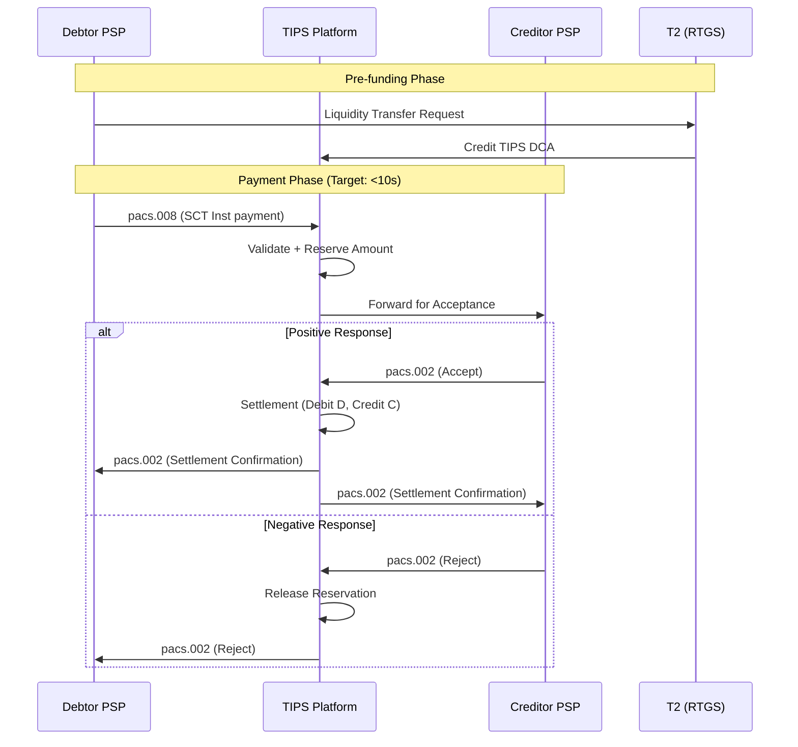
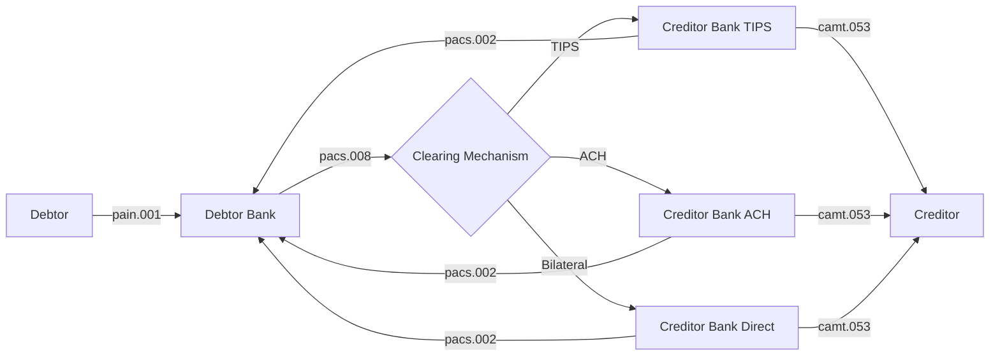
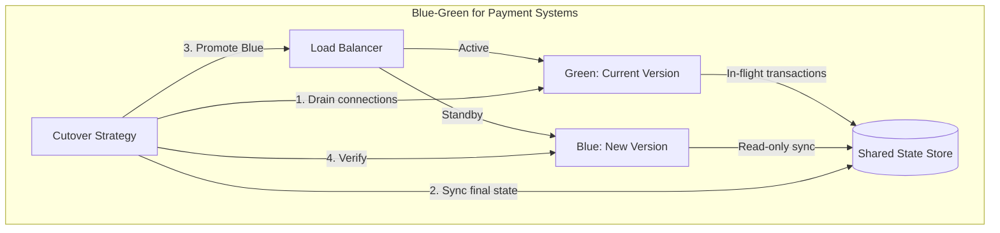

# Instant Payment Architecture: ISO 20022, SEPA Instant, FedNow & RTGS

> **Mục tiêu nghiên cứu:** Hiểu sâu kiến trúc hệ thống thanh toán tức thì (Instant Payment) - từ message standards đến operational requirements 24/7/365, bao gồm ISO 20022, SEPA Instant, FedNow và RTGS architecture.

---

## 1. Mục Tiêu và Phạm Vi

### Bản Chất Vấn Đề

Instant Payment không đơn thuần là "chuyển tiền nhanh hơn". Đây là sự thay đổi paradigmm từ:
- **Batch processing** → **Real-time streaming**
- **Business hours operation** → **24/7/365 always-on**
- **Deferred net settlement** → **Real-time gross settlement (RTGS)**
- **Store-and-forward** → **Synchronous end-to-end processing**

> **Trade-off cốt lõi:** Tốc độ (sub-10 seconds end-to-end) vs. Tính cuối cùng (finality) vs. Thanh khoản (liquidity)

### Yêu Cầu Khắt Khe
| Yêu cầu | Traditional RTGS | Instant Payment |
|---------|------------------|-----------------|
| Availability | 99.5% (18/7) | 99.99% (24/7/365) |
| Settlement Time | T+0 (same day) | Real-time (<10s) |
| Liquidity Model | End-of-day netting | Real-time pre-funding |
| Message Format | MT (proprietary) | ISO 20022 (XML/JSON) |
| Scalability | Peak-hours batch | Continuous uniform |

---

## 2. ISO 20022: Nền Tảng Dữ Liệu

### Bản Chất Cơ Chế

ISO 20022 không chỉ là "format message mới" - nó là **semantic layer** chuẩn hóa toàn bộ domain knowledge tài chính:

```
┌─────────────────────────────────────────────────────────────┐
│                    ISO 20022 Architecture                   │
├─────────────────────────────────────────────────────────────┤
│  Business Layer                                             │
│  ├── Business Actor (Debtor, Creditor, Intermediary)        │
│  ├── Business Role (Originator, Beneficiary)                │
│  └── Business Process (Payment Initiation → Clearing → Sett)│
├─────────────────────────────────────────────────────────────┤
│  Logical Layer (Message Concept)                            │
│  ├── Message Definition (pain.001, pacs.008, camt.053)      │
│  ├── Data Dictionary (business elements)                    │
│  └── Message Component (reusable building blocks)           │
├─────────────────────────────────────────────────────────────┤
│  Physical Layer (Serialization)                             │
│  ├── XML Schema (XSD) - legacy but dominant                 │
│  ├── JSON - modern APIs                                     │
│  └── ASN.1/DER - high-performance binary                    │
└─────────────────────────────────────────────────────────────┘
```

### Key Message Types cho Instant Payment

| Message | Business Area | Purpose | Critical Fields |
|---------|---------------|---------|-----------------|
| **pain.001** | Payments Initiation | Customer Credit Transfer Initiation | `<CdtTrfTxInf>`, `<PmtTpInf>` (service level SEPA) |
| **pacs.008** | Payments Clearing | FIToFICustomerCreditTransfer | `<InstdAmt>`, `<InstgAgt>`, `<InstdAgt>`, `<CdtrAcct>` |
| **pacs.002** | Payments Clearing | FIToFIPaymentStatusReport | `<TxSts>`, `<StsRsnInf>` (accept/reject reasons) |
| **camt.053** | Cash Management | BankToCustomerStatement | `<Ntry>`, `<CdtDbtInd>` (debit/credit indicator) |

> **Chi tiết quan trọng:** ISO 20022 cho phép **extension mechanisms** - các tổ chức có thể thêm supplementary data mà không break compatibility. Điều này cho phép market infrastructures (TIPS, FedNow) customize mà vẫn maintain interoperability.

### Trade-off: XML vs JSON vs Binary

| Format | Pros | Cons | Use Case |
|--------|------|------|----------|
| **XML (XSD)** | Validation nghiêm ngặt, tooling mature, audit trail rõ | Verbosity (3-5x payload size), parsing overhead | Core banking, settlement systems |
| **JSON** | Lightweight, REST-native, developer-friendly | Schema enforcement yếu, numeric precision issues | APIs, mobile banking |
| **Binary (CBOR/ASN.1)** | Tối ưu bandwidth/latency, phù hợp HFT | Khó debug, tooling hạn chế | High-frequency trading |

---

## 3. Kiến Trúc Hệ Thống Thanh Toán Tức Thì

### 3.1 TIPS (TARGET Instant Payment Settlement) - Eurosystem

#### Luồng Xử Lý Chi Tiết



#### Kiến Trúc Kỹ Thuật

TIPS được xây dựng trên nền tảng **distributed in-memory data grid**:

```
┌─────────────────────────────────────────────────────────────────┐
│                      TIPS Technical Stack                       │
├─────────────────────────────────────────────────────────────────┤
│  Access Layer                                                   │
│  ├── MX (Message Exchange) - ISO 20022 message gateway          │
│  ├── APIs - REST for queries, liquidity mgmt                    │
│  └── HSM (Hardware Security Module) - cryptographic operations  │
├─────────────────────────────────────────────────────────────────┤
│  Processing Layer                                               │
│  ├── Distributed Transaction Engine                             │
│  │   ├── In-memory state (account balances, reservations)       │
│  │   └── Event sourcing (immutable log)                         │
│  ├── Validation Engine (schema, business rules)                 │
│  └── Routing Engine (participant reachability)                  │
├─────────────────────────────────────────────────────────────────┤
│  Data Layer                                                     │
│  ├── Hot Data: In-memory grid (Redis/Hazelcast-style)           │
│  ├── Warm Data: Real-time replication (active-active)           │
│  └── Cold Data: Historical archive (compliance, audit)          │
├─────────────────────────────────────────────────────────────────┤
│  Settlement Backbone                                            │
│  └── T2 RTGS connection (liquidity management)                  │
└─────────────────────────────────────────────────────────────────┘
```

#### Key Design Decisions

1. **Central Bank Money Settlement:** Không phải commercial bank money. Điều này loại bỏ counterparty risk nhưng yêu cầu pre-funded liquidity.

2. **Reservation Pattern:** Amount được reserve trước khi forward đến beneficiary bank. Đảm bảo settlement certainty.

3. **Two-Phase Commit:** Gần như distributed transaction pattern - hold → forward → accept/reject → commit/rollback.

> **Trade-off:** Reservation pattern đảm bảo finality nhưng **lock liquidity** trong thời gian chờ response. Nếu creditor bank chậm response → liquidity bị frozen.

### 3.2 FedNow Service - Federal Reserve

#### Đặc Điểm Kiến Trúc

FedNow có một số khác biệt so với TIPS:

| Aspect | FedNow | TIPS |
|--------|--------|------|
| **Launch** | July 2023 | November 2018 |
| **Settlement** | Master Account at Fed | TIPS DCA (linked to T2) |
| **Message Format** | ISO 20022 (JSON/XML) | ISO 20022 (XML) |
| **Liquidity Model** | Intraday credit available | Pre-funded only |
| **Participation** | Optional (gradual adoption) | Mandatory for SCT Inst |

#### Liquidity Management Transfer

FedNow cung cấp **Liquidity Management Transfer (LMT)** - một capability quan trọng:

```
┌─────────────────────────────────────────────────────────────┐
│              FedNow Liquidity Architecture                  │
├─────────────────────────────────────────────────────────────┤
│                                                             │
│   ┌──────────────┐         ┌──────────────┐                │
│   │  FedNow      │◄───────►│  Master      │                │
│   │  Balance     │   LMT   │  Account     │                │
│   └──────────────┘         └──────────────┘                │
│          │                          │                       │
│          │ Intraday Credit         │ End-of-day            │
│          │ (same terms as          │ settlement            │
│          │  Fedwire)               │                       │
│          ▼                          ▼                       │
│   ┌──────────────────────────────────────┐                 │
│   │    Discount Window (if needed)       │                 │
│   └──────────────────────────────────────┘                 │
│                                                             │
└─────────────────────────────────────────────────────────────┘
```

> **Điểm mạnh của FedNow:** Participants có thể access intraday credit từ Fed, giảm liquidity burden so với pure pre-funding model.

### 3.3 SEPA Instant Credit Transfer (SCT Inst)

SCT Inst là **scheme** (business rules), không phải infrastructure. Nó định nghĩa:

- **Maximum execution time:** 10 seconds end-to-end
- **Maximum amount:** €100,000 per transaction (initially €15,000)
- **Availability:** 24/7/365
- **Reachability:** Mandatory reachability từ November 2025 (EU regulation)

#### Message Flow SCT Inst



---

## 4. RTGS vs Instant Payment: Phân Tích Sâu

### Bản Chất Khác Biệt

**Traditional RTGS (Real-Time Gross Settlement):**
- Settlement: Real-time nhưng **within business hours**
- Liquidity: Participants cần đủ balance trong RTGS account
- Finality: Immediate finality
- Volume: Typically <100k messages/day (wholesale)

**Instant Payment (TIPS/FedNow):**
- Settlement: Real-time, **24/7/365**
- Liquidity: Pre-funded TIPS account hoặc intraday credit
- Finality: Immediate finality
- Volume: Millions/day (retail + wholesale)

### Luồng Thanh Khoản (Liquidity Flow)

```
┌────────────────────────────────────────────────────────────────┐
│                    Liquidity Management                        │
├────────────────────────────────────────────────────────────────┤
│                                                                │
│   Business Hours (T2/Fedwire Open)                            │
│   ┌─────────┐     Liquidity      ┌─────────┐                  │
│   │   T2    │◄────Transfer─────►│  TIPS   │                  │
│   │ (RTGS)  │    (real-time)     │(Instant)│                  │
│   └─────────┘                    └─────────┘                  │
│        │                               │                       │
│        │                               │ 24/7 operations       │
│        │                               │ (isolated liquidity)  │
│        ▼                               ▼                       │
│   ┌─────────────────────────────────────────┐                 │
│   │   After Hours: TIPS operates standalone  │                 │
│   │   (liquidity trapped until T2 reopens)   │                 │
│   └─────────────────────────────────────────┘                 │
│                                                                │
└────────────────────────────────────────────────────────────────┘
```

> **Rủi ro thanh khoản (Liquidity Risk):** Nếu một bank bị drain liquidity vào cuối ngày, họ không thể bổ sung until next business day. Điều này yêu cầu **liquidity forecasting algorithms** tinh vi.

---

## 5. 24/7/365 Operational Requirements

### Thách Thức Kiến Trúc

Chuyển từ "batch overnight processing" sang "always-on" đòi hỏi thay đổi cơ bản:

| Aspect | Traditional | 24/7 Instant |
|--------|-------------|--------------|
| **Deployment** | Scheduled maintenance windows | Zero-downtime deployments |
| **Database** | Nightly batch reconciliation | Continuous replication |
| **Monitoring** | Business hours alerting | 24/7 automated alerting |
| **Failure Recovery** | Manual intervention acceptable | Automated failover (<5s) |
| **Capacity Planning** | Peak-hours focused | Uniform distribution |

### Zero-Downtime Deployment Patterns



### Data Consistency trong 24/7 Operations

Instant payment systems sử dụng **event sourcing + CQRS** pattern:

```
┌────────────────────────────────────────────────────────────────┐
│                    Event Sourcing Architecture                 │
├────────────────────────────────────────────────────────────────┤
│                                                                │
│   Command Side                    Query Side                   │
│   ┌──────────────┐               ┌──────────────┐             │
│   │ Command      │               │ Query API    │             │
│   │ Handler      │               │ (Read-only)  │             │
│   └──────┬───────┘               └──────┬───────┘             │
│          │                              │                      │
│          ▼                              ▼                      │
│   ┌──────────────┐               ┌──────────────┐             │
│   │ Event Store  │──────────────►│ Read Models  │             │
│   │ (Immutable)  │   (async)     │ (Projections)│             │
│   └──────────────┘               └──────────────┘             │
│          │                                                     │
│          ▼                                                     │
│   ┌──────────────┐                                             │
│   │ Settlement   │                                             │
│   │ Engine       │                                             │
│   └──────────────┘                                             │
│                                                                │
└────────────────────────────────────────────────────────────────┘
```

> **Ưu điểm:** Event sourcing cho phép **replay** transactions để audit, reconstruct state, và debug. Điều này critical cho regulatory compliance.

---

## 6. Rủi Ro, Anti-Patterns & Lỗi Thường Gặp

### 6.1 Liquidity Drain Attack

**Scenario:** Malicious actor (hoặc buggy client) gửi hàng loạt payments đến một bank, draining liquidity của họ trong TIPS.

**Mitigation:**
- Velocity limits per originator
- Liquidity warnings at 80% threshold
- Automatic liquidity transfer từ RTGS khi available

### 6.2 Duplicate Processing

**Root Cause:** Network timeout → client retry → double settlement.

**Giải pháp:**
```java
// Idempotency Key Pattern
public class PaymentProcessor {
    // Key: businessMessageIdentifier + creationDateTime
    private Cache<String, PaymentResult> processedPayments;
    
    public PaymentResult process(SCTInstPayment payment) {
        String idempotencyKey = generateKey(payment);
        
        if (processedPayments.containsKey(idempotencyKey)) {
            return processedPayments.get(idempotencyKey); // Return cached result
        }
        
        // Process with distributed lock
        return processWithLock(idempotencyKey, payment);
    }
}
```

### 6.3 Clock Synchronization Issues

Trong distributed instant payment systems, **time is critical**:

- SCT Inst requires sub-10s processing
- Timestamp discrepancies giữa banks gây reconciliation issues
- **Solution:** NTP/PTP (Precision Time Protocol) với microsecond accuracy

### 6.4 Thundering Herd Problem

Khi một popular service (ví dụ: payroll processing) triggers millions of simultaneous payments:

**Anti-Patterns:**
- ❌ Direct database writes without throttling
- ❌ Synchronous downstream calls
- ❌ No backpressure mechanism

**Best Practices:**
- ✅ Token bucket rate limiting
- ✅ Async queuing (Kafka/SQS)
- ✅ Circuit breakers cho external calls

---

## 7. Khuyến Nghị Production

### 7.1 Kiến Trúc Hệ Thống

```
┌─────────────────────────────────────────────────────────────────┐
│              Recommended Instant Payment Architecture           │
├─────────────────────────────────────────────────────────────────┤
│                                                                 │
│  ┌─────────────┐    ┌─────────────┐    ┌─────────────┐         │
│  │   API       │    │   ISO 20022 │    │   File      │         │
│  │   Gateway   │    │   Gateway   │    │   Gateway   │         │
│  └──────┬──────┘    └──────┬──────┘    └──────┬──────┘         │
│         │                  │                  │                 │
│         └──────────────────┼──────────────────┘                 │
│                            ▼                                   │
│              ┌─────────────────────────┐                       │
│              │   Message Validator     │                       │
│              │   (Schema + Business)   │                       │
│              └───────────┬─────────────┘                       │
│                          ▼                                     │
│              ┌─────────────────────────┐                       │
│              │   Transaction Engine    │                       │
│              │   (Event Sourced)       │                       │
│              └───────────┬─────────────┘                       │
│                          ▼                                     │
│              ┌─────────────────────────┐                       │
│              │   Settlement Adapter    │                       │
│              │   (TIPS/FedNow/ACH)     │                       │
│              └─────────────────────────┘                       │
│                                                                 │
│  ┌──────────────────────────────────────────────────────────┐  │
│  │  Supporting Services:                                    │  │
│  │  - Liquidity Manager (forecasting + optimization)        │  │
│  │  - Reconciliation Engine (continuous, not end-of-day)    │  │
│  │  - Fraud Detection (real-time ML scoring)                │  │
│  │  - Monitoring (distributed tracing, metrics)             │  │
│  └──────────────────────────────────────────────────────────┘  │
│                                                                 │
└─────────────────────────────────────────────────────────────────┘
```

### 7.2 Technology Stack Recommendations

| Component | Technology | Lý Do |
|-----------|------------|-------|
| **Message Queue** | Apache Kafka | High throughput, replay capability |
| **State Store** | Redis Cluster | Sub-millisecond latency |
| **Database** | PostgreSQL/CockroachDB | ACID + horizontal scaling |
| **API Gateway** | Kong/AWS API Gateway | Rate limiting, authentication |
| **Observability** | OpenTelemetry + Jaeger | Distributed tracing |
| **Schema Validation** | JAXB/Protobuf | ISO 20022 compliance |

### 7.3 Operational Excellence

**Monitoring (RED Method):**
- **Rate:** Transactions per second, by participant
- **Errors:** Rejection rates, timeout rates, validation failures
- **Duration:** End-to-end latency, p50/p99/p99.9

**Alerting:**
- Liquidity below threshold: P1 (immediate)
- Latency >5s: P2 (investigate)
- Error rate >0.1%: P2
- Participant unreachable: P1

**Chaos Engineering:**
- Simulate network partitions
- Kill random pods during peak
- Inject latency vào downstream systems

---

## 8. Kết Luận

### Bản Chất Vấn Đề

Instant Payment Architecture không chỉ là vấn đề kỹ thuật - nó là **social contract** về tính tin cậy của hệ thống tài chính:

1. **Finality is non-negotiable:** Một khi confirmed, transaction không thể reverse (trừ exception handling theo scheme rules).

2. **Liquidity is the bottleneck:** Pre-funding model yêu cầu capital efficiency cao. Banks phải balance giữa opportunity cost của idle liquidity và risk của insufficient funds.

3. **24/7 changes everything:** Traditional maintenance windows, batch jobs, end-of-day reconciliation không còn áp dụng. Mọi thứ phải continuous.

### Trade-off Quan Trọng Nhất

| Trade-off | Option A | Option B | Recommendation |
|-----------|----------|----------|----------------|
| **Speed vs Safety** | Sub-second settlement | Additional validation layers | <10s là sweet spot |
| **Pre-funded vs Credit** | Lower risk, higher capital | Higher risk, lower capital | Hybrid (FedNow model) |
| **XML vs JSON** | Strict validation | Developer velocity | XML cho core, JSON cho APIs |
| **Centralized vs Distributed** | Consistency | Availability | Distributed với strong consistency |

### Rủi Ro Lớn Nhất

**Liquidity Mismatch:** Bank không predict được intraday liquidity needs chính xác → trapped liquidity hoặc failed payments. Điều này đòi hỏi **machine learning models** cho liquidity forecasting.

---

## Tài Liệu Tham Khảo

1. ECB TIPS Documentation: `https://www.ecb.europa.eu/paym/target/tips/`
2. Federal Reserve FedNow: `https://www.frbservices.org/financial-services/fednow/`
3. ISO 20022 Message Definitions: `https://www.iso20022.org/iso-20022-message-definitions`
4. SCT Inst Rulebook: European Payments Council
5. BIS CPMI - Fast Payments Report

---

*Document version: 1.0*  
*Created: 2026-03-27*  
*Author: Senior Backend Architect Research*
