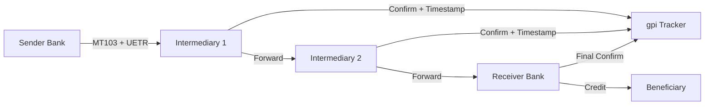
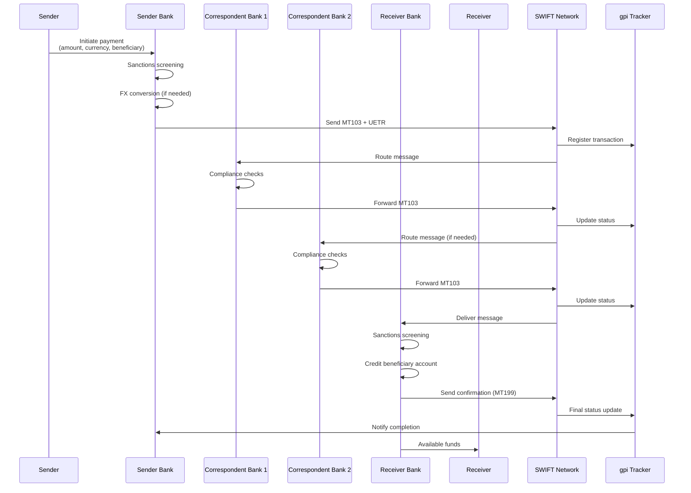

# Cross-Border Payments & Settlement

> **Tài liệu nghiên cứu:** Kiến trúc thanh toán xuyên biên giới, SWIFT gpi, mạng lưới ngân hàng đại lý, và giải pháp blockchain-based settlement.

---

## 1. Mục tiêu của Task

Task này tập trung phân tích bản chất của hệ thống thanh toán xuyên biên giới (Cross-Border Payments) - một trong những trụ cột quan trọng nhất của hệ thống tài chính toàn cầu. Chúng ta sẽ đi sâu vào:

- **SWIFT gpi**: Cơ chế cải tiến giúp thanh toán nhanh hơn, minh bạch hơn
- **Mạng lưới ngân hàng đại lý (Correspondent Banking)**: Mô hình trung gian truyền thống
- **Blockchain-based Settlement**: Các giải pháp DLT (Distributed Ledger Technology) thay thế/trợ giúp
- **AML/KYC Compliance**: Tuân thủ chống rửa tiền và xác minh khách hàng
- **Sanctions Screening**: Kiểm tra trừng phạt - rào cản pháp lý phức tạp
- **FX Risk Management**: Quản lý rủi ro tỷ giá hối đoái

---

## 2. Bản Chất và Cơ Chế Hoạt Động

### 2.1. Mô Hình Truyền Thống: Correspondent Banking

#### Bản Chất Vấn Đề

Thanh toán xuyên biên giới không phải là "chuyển tiền trực tiếp" mà là một chuỗi các giao dịch nợ (debt obligations) được chuyển giao qua nhiều trung gian.

```
┌─────────────────────────────────────────────────────────────────────────────┐
│                    CORRESPONDENT BANKING CHAIN                              │
├─────────────────────────────────────────────────────────────────────────────┤
│                                                                             │
│   Ngườigửi          Ngânhàng          Ngânhàng          Ngânhàng         Ngườinhận  
│   (Amsterdam)      gửi(ING)        trunggian         nhận(CreditSuisse)  (Geneva)  
│      │                 │                 │                 │                │       
│      │                 │                 │                 │                │       
│      │  ChuyểnEUR      │                 │                 │                │       
│      │────────────────>│                 │                 │                │       
│      │                 │                 │                 │                │       
│      │                 │   Debit USD     │                 │                │       
│      │                 │   tại BofA      │                 │                │       
│      │                 │────────────────>│                 │                │       
│      │                 │                 │                 │                │       
│      │                 │                 │   ChuyểnUSD     │                │       
│      │                 │                 │   qua CHIPS     │                │       
│      │                 │                 │────────────────>│                │       
│      │                 │                 │                 │                │       
│      │                 │                 │                 │  Credit USD    │       
│      │                 │                 │                 │  vào tài khoản │       
│      │                 │                 │                 │  tại BNY Mellon│       
│      │                 │                 │                 │───────────────>│       
│      │                 │                 │                 │                │       
│      │                 │                 │                 │  ChuyểnUSD     │       
│      │                 │                 │                 │  cho ngườinhận │       
│      │                 │                 │                 │────────────────>│      
│                                                                             │
└─────────────────────────────────────────────────────────────────────────────┘
```

#### Cơ Chế Nostro/Vostro Accounts

| Khái niệm | Định nghĩa | Ví dụ |
|-----------|------------|-------|
| **Nostro Account** | "Our account with you" - Tài khoản của ngân hàng A tại ngân hàng B | ING Amsterdam giữ USD tại Bank of America |
| **Vostro Account** | "Your account with us" - Tài khoản của ngân hàng B tại ngân hàng A | Bank of America nhìn tài khoản ING Amsterdam |
| **Loro Account** | "Their account" - Tài khoản của ngân hàng thứ ba | Tham chiếu gián tiếp |

**Bản chất kinh tế:** Không có tiền thực sự "di chuyển" xuyên biên giới. Chỉ có sự điều chỉnh số dư nợ giữa các ngân hàng thông qua hệ thống thanh toán RTGS (Real-Time Gross Settlement) của từng quốc gia.

#### Trade-off của Correspondent Banking

| Ưu điểm | Nhược điểm |
|---------|------------|
| Phủ sóng toàn cầu (200+ quốc gia) | Thờigian xử lý chậm (1-5 ngày) |
| Đảm bảo tuân thủ pháp lý local | Chi phí cao (nhiều trung gian) |
| Risk mitigation qua mạng lưới uy tín | Thiếu minh bạch về trạng thái giao dịch |
| Tích hợp với hệ thống legacy | Rủi ro tập trung vào big correspondent banks |

---

### 2.2. SWIFT gpi (Global Payments Innovation)

#### Bản Chất Cải Tiến

SWIFT gpi không thay đổi cơ chế correspondent banking mà **thêm lớp theo dõi và SLA** lên trên cơ sở hạ tầng hiện có.

**Các thành phần cốt lõi:**

1. **Universal Confirmations**: Bắt buộc xác nhận khi tiền đến tài khoản ngườinhận
2. **End-to-end Tracking**: Theo dõi real-time qua unique transaction reference (UETR)
3. **SLA Monitoring**: Giám sát thờigian xử lý tại từng hop
4. **Upfront Fee Transparency**: Hiển thị phí trước khi gửi



#### UETR (Unique End-to-End Transaction Reference)

```
Format: 36 ký tự UUID (ví dụ: 123e4567-e89b-12d3-a456-426614174000)

┌─────────────────────────────────────────────────────────────┐
│ UETR Persistence                                            │
├─────────────────────────────────────────────────────────────┤
│ • Gắn liền với giao dịch từ đầu đến cuối                    │
│ • Không đổi qua các chuyển tiếp (remittance)                │
│ • Cho phép truy vấn trạng thái bất kỳ lúc nào               │
│ • Audit trail không thể thay đổi                            │
└─────────────────────────────────────────────────────────────┘
```

#### Thực Tế Hiệu Quả

> **Dữ liệu thực tế (2024):** ~50% giao dịch SWIFT gpi đến nơi trong vòng 30 phút, 96% trong vòng 24 giờ.

**Hạn chế vẫn tồn tại:**
- Vẫn phụ thuộc vào correspondent banking network
- Không giải quyết vấn đề pre-funding requirements
- FX spread vẫn không minh bạch hoàn toàn
- Không hỗ trợ settlement finality ngay lập tức

---

### 2.3. Blockchain-based Settlement & CBDC

#### Bản Chất Cách Mạng

Blockchain/CBDC có tiềm năng **thay thế hoàn toàn correspondent banking model** bằng cách cho phép settlement trực tiếp (P2P) mà không cần trung gian.

```
┌─────────────────────────────────────────────────────────────────────────────┐
│              TRADITIONAL vs BLOCKCHAIN SETTLEMENT                           │
├─────────────────────────────────────────────────────────────────────────────┤
│                                                                             │
│  TRADITIONAL                    BLOCKCHAIN/DLT                              │
│  ───────────                    ──────────────                              │
│                                                                             │
│  Sender ──> Correspondent       Sender ─────────────────> Receiver          │
│     │         Bank 1                   │          (atomic settlement)       │
│     │            │                     │                                    │
│     │         Correspondent            │                                    │
│     │         Bank 2                   │                                    │
│     │            │                     │                                    │
│     └────────> Receiver                │                                    │
│                                                                             │
│  • Multiple hops               • Single hop                                 │
│  • Deferred net settlement     • Atomic PvP (Payment vs Payment)            │
│  • Pre-funding required        • No pre-funding                             │
│  • 1-5 days                    • Real-time (seconds)                        │
│                                                                             │
└─────────────────────────────────────────────────────────────────────────────┘
```

#### Project mBridge (BIS Innovation Hub)

**Bối cảnh:** Hợp tác giữa BIS, HKMA, Bank of Thailand, PBoC (Trung Quốc), và Central Bank of UAE.

**Kiến trúc:**
- **mBridge Ledger**: Blockchain đặc biệt được xây dựng cho central banks
- **Multi-CBDC**: Hỗ trợ nhiều đồng CBDC trên cùng nền tảng
- **PvP Settlement**: Đồng thời chuyển tiền và ngoại tệ (atomic swap)

**Kết quả pilot (2022):**
- 20 commercial banks từ 4 jurisdictions
- $12M+ phát hành trên nền tảng
- 160+ giao dịch payment và FX PvP
- Tổng giá trị > $22M

#### Trade-off: Blockchain vs Traditional

| Tiêu chí | Blockchain/CBDC | Correspondent Banking |
|----------|-----------------|----------------------|
| **Speed** | Real-time (seconds) | Hours to days |
| **Cost** | Thấp (ít trung gian) | Cao (nhiều fees) |
| **Accessibility** | 24/7/365 | Giờ làm việc hạn chế |
| **Interoperability** | Challenge (multi-chain) | Mature (SWIFT network) |
| **Regulatory clarity** | Đang phát triển | Established |
| **Scalability** | Cần thử nghiệm thêm | Proven (trillions USD/day) |
| **Finality** | Immediate (on-chain) | Deferred (end-of-day) |
| **Disintermediation** | High (risk cho banks) | Low (preserves status quo) |

#### Rủi Ro của Blockchain Settlement

> **Bank disintermediation risk:** Nếu CBDC cho phép direct access từ corporations/individuals, vai trò của commercial banks trong payment chain bị suy giảm.

> **Operational risk:** Private key management, smart contract bugs, consensus failures.

> **Cross-border regulatory fragmentation:** Mỗi quốc gia có quy định CBDC khác nhau, khó có global standard.

---

### 2.4. AML/KYC Compliance trong Cross-Border

#### Bản Chất Thách Thức

Cross-border payments phải tuân thủ regulations của **tất cả các jurisdictions** liên quan - không chỉ nơi gửi và nhận, mà còn cả những nơi intermediary banks đặt trụ sở.

```
┌─────────────────────────────────────────────────────────────────────────────┐
│           AML/KYC COMPLIANCE LAYERS                                         │
├─────────────────────────────────────────────────────────────────────────────┤
│                                                                             │
│   Layer 1: Customer Due Diligence (CDD)                                     │
│   ─────────────────────────────────────                                     │
│   • Identity verification (passport, corporate docs)                        │
│   • Beneficial ownership (UBO - Ultimate Beneficial Owner)                  │
│   • Risk profiling (PEP, sanctions, adverse media)                          │
│   • Ongoing monitoring                                                      │
│                                                                             │
│   Layer 2: Transaction Monitoring                                           │
│   ─────────────────────────────────                                         │
│   • Threshold reporting (>$10K in US, >€10K in EU)                          │
│   • Suspicious pattern detection (structuring, rapid movement)              │
│   • Velocity checks                                                         │
│                                                                             │
│   Layer 3: Sanctions Screening                                              │
│   ────────────────────────                                                  │
│   • Real-time screening against OFAC, UN, EU lists                          │
│   • Name matching algorithms (fuzzy logic)                                  │
│   • False positive management                                               │
│                                                                             │
│   Layer 4: Cross-Border Specific                                            │
│   ──────────────────────────                                                │
│   • Correspondent bank due diligence                                        │
│   • Nested account monitoring                                               │
│   • Currency control compliance                                             │
│                                                                             │
└─────────────────────────────────────────────────────────────────────────────┘
```

#### Correspondent Banking Due Diligence

Theo Wolfsberg Group và FATF recommendations, ngân hàng correspondent phải:

1. **Gather information** về respondent bank's business, management, reputation
2. **Assess AML/CFT controls** của respondent bank
3. **Obtain approval** từ senior management trước khi mở relationship
4. **Document** responsibilities của mỗi bên
5. **Monitor** ongoing basis

#### The "De-risking" Problem

> **Hiện tượng:** Nhiều major banks (Deutsche Bank, Standard Chartered, v.v.) đã cắt relationships với respondent banks ở high-risk jurisdictions để tránh compliance costs và potential penalties.

**Hệ quả:**
- Các nước đang phát triển mất access to global financial system
- Tăng informal channels (Hawala, cryptocurrencies)
- Ngược với mục tiêu financial inclusion

---

### 2.5. Sanctions Screening

#### Cơ Chế Hoạt Động

Sanctions screening là việc kiểm tra tất cả các parties (sender, receiver, beneficiaries, banks) và countries against các sanctions lists.

**Major sanctions lists:**
| List | Issuer | Scope |
|------|--------|-------|
| **SDN** | OFAC (US) | Primary, secondary sanctions |
| **Consolidated List** | UN | Global |
| **EU Sanctions** | European Union | EU members |
| **HMT Sanctions** | UK | UK and territories |

#### Technical Implementation

```
Screening Pipeline:
┌──────────────┐    ┌──────────────┐    ┌──────────────┐    ┌──────────────┐
│   Input      │───>│   Parse      │───>│    Match     │───>│   Decision   │
│   (SWIFT     │    │   (entity    │    │   (fuzzy     │    │   (hit/no    │
│   message)   │    │   extraction)│    │   matching)  │    │   hit)       │
└──────────────┘    └──────────────┘    └──────────────┘    └──────────────┘
```

**Fuzzy Matching Algorithms:**
- Levenshtein distance
- Soundex/Metaphone (phonetic matching)
- N-gram analysis
- Machine learning classifiers

**False Positive Problem:**
> Industry average: 90-95% của tất cả alerts là false positives. Mỗi alert cần manual review - operational burden rất lớn.

---

### 2.6. FX Risk Management

#### Các Loại FX Risk

| Loại | Mô tả | Ví dụ |
|------|-------|-------|
| **Transaction Risk** | Risk từ timing difference giữa commitment và settlement | Ký hợp đồng mua hàng EUR nhưng thanh toán sau 30 ngày |
| **Translation Risk** | Risk khi consolidate financial statements của subsidiary | Subsidiary Nhật Bản báo cáo JPY, convert sang USD |
| **Economic Risk** | Long-term impact của exchange rate lên competitiveness | JPY yếu làm hàng Nhật rẻ hơn trên thị trường |

#### Hedging Strategies

```
┌─────────────────────────────────────────────────────────────────────────────┐
│                    FX HEDGING INSTRUMENTS                                   │
├─────────────────────────────────────────────────────────────────────────────┤
│                                                                             │
│  1. FORWARD CONTRACTS                                                       │
│     • Lock in exchange rate today for future delivery                       │
│     • Customizable amount and maturity                                      │
│     • No upfront premium (but credit line required)                         │
│     • Obligation to transact (not optional)                                 │
│                                                                             │
│  2. FX OPTIONS                                                              │
│     • Right but not obligation to transact at strike price                  │
│     • Pay premium upfront                                                   │
│     • Asymmetric payoff (limited loss, unlimited gain)                      │
│                                                                             │
│  3. NATURAL HEDGE                                                           │
│     • Match FX inflows with outflows in same currency                       │
│     • Best practice: revenue và expense cùng currency                       │
│     • Không có transaction cost                                             │
│                                                                             │
│  4. MONEY MARKET HEDGE                                                      │
│     • Borrow in one currency, convert, invest in another                    │
│     • Synthetic forward using interest rate parity                          │
│                                                                             │
└─────────────────────────────────────────────────────────────────────────────┘
```

#### Correspondent Banking và FX

Trong correspondent banking chain, FX conversion thường xảy ra ở:
1. **Originating bank**: Convert sender's currency to USD/EUR
2. **Correspondent bank**: Convert USD/EUR sang currency của next leg
3. **Receiving bank**: Convert sang currency của beneficiary

> **Vấn đề:** Mỗi conversion = một spread. Khách hàng không biết được effective exchange rate cho đến khi nhận được tiền.

---

## 3. Kiến Trúc và Luồng Xử Lý

### 3.1. End-to-End Cross-Border Payment Flow



### 3.2. ISO 20022 Migration

SWIFT và toàn bộ ngành đang chuyển từ MT (Message Type) sang ISO 20022.

| Aspect | MT (Legacy) | ISO 20022 |
|--------|-------------|-----------|
| **Format** | Fixed-width text | XML/JSON |
| **Data capacity** | Limited (~1000 chars) | Rich, structured |
| **Remittance data** | 140 chars max | Unstructured, extensible |
| **Straight-through processing** | ~70% | >90% target |
| **Compliance data** | Limited | Rich (purpose code, ultimate debtor/creditor) |

**Benefits của ISO 20022 cho Compliance:**
- Structured data về beneficial owners
- Purpose codes chuẩn hóa
- Richer data cho sanctions screening algorithms

---

## 4. So Sánh Các Lựa Chọn

### 4.1. Settlement Models Comparison

| Model | Speed | Cost | Maturity | Use Case |
|-------|-------|------|----------|----------|
| **Correspondent Banking + SWIFT** | 1-5 days | High | Mature | High-value B2B |
| **SWIFT gpi** | Minutes-hours | Medium-High | Growing | Priority payments |
| **CBDC (Domestic)** | Real-time | Low | Pilot | Domestic retail/wholesale |
| **mBridge/Multi-CBDC** | Real-time | Low | Pilot | Cross-border wholesale |
| **Stablecoin (USDC/USDT)** | Minutes | Low-Medium | Emerging | Crypto-native |
| **Ripple/XRP** | Seconds | Low | Limited adoption | Specific corridors |

### 4.2. When to Use What

**Chọn Correspondent Banking khi:**
- Giao dịch high-value (>$1M)
- Cần legal certainty và dispute resolution
- Counterparty là ngân hàng regulated
- Không có CBDC infrastructure

**Chọn CBDC/Blockchain khi:**
- Cần real-time settlement
- Operating 24/7 là critical
- Muốn reduce correspondent banking fees
- Có regulatory support

---

## 5. Rủi Ro, Anti-patterns, và Lỗi Thường Gặp

### 5.1. High-Risk Scenarios

> **Nested Correspondent Banking:** Khi respondent bank cung cấp correspondent services cho các ngân hàng khác. Rủi ro: Khó kiểm soát ultimate beneficiary.

> **Shell Company Transactions:** Payments từ/to jurisdictions có high shell company activity (Delaware, BVI, Cayman). Cần enhanced due diligence.

> **Trade-based Money Laundering (TBML):** Over/under-invoicing trong international trade. Rất khó phát hiện vì requires trade document verification.

### 5.2. Common Implementation Pitfalls

| Pitfall | Hệ quả | Giải pháp |
|---------|--------|-----------|
| **Insufficient sanctions list updates** | Miss recent designations | Automated daily updates |
| **Poor fuzzy matching** | High false positives OR misses | ML-enhanced matching |
| **No transaction monitoring** | Regulatory penalties | Implement rules-based + behavioral |
| **Weak correspondent DD** | Reputational risk, fines | Wolfsberg Questionnaire |
| **No FX hedging** | P&L volatility | Treasury policy mandatory |

### 5.3. Technical Failures

**Message Repair Loops:**
- Invalid account numbers
- Missing mandatory fields
- Incorrect BIC codes
- **Impact:** Delays, manual intervention costs

**gpi Non-compliance:**
- Không gửi confirmations đúng hạn
- **Impact:** SLA violations, customer complaints

---

## 6. Khuyến Nghị Thực Chiến trong Production

### 6.1. Architecture Recommendations

```
┌─────────────────────────────────────────────────────────────────────────────┐
│           PRODUCTION ARCHITECTURE PATTERNS                                  │
├─────────────────────────────────────────────────────────────────────────────┤
│                                                                             │
│  1. SANCTIONS SCREENING SERVICE                                             │
│     • Microservice dedicated to screening                                   │
│     • Real-time API (< 100ms response)                                      │
│     • Async batch processing cho bulk transactions                          │
│     • Audit log immutable                                                   │
│                                                                             │
│  2. PAYMENT ORCHESTRATION LAYER                                             │
│     • State machine cho payment lifecycle                                   │
│     • Retry logic với exponential backoff                                   │
│     • Dead letter queue cho failed messages                                 │
│     • Idempotency keys để tránh duplicate                                   │
│                                                                             │
│  3. COMPLIANCE DATA LAKE                                                    │
│     • Store tất cả transactions cho 7+ years                                │
│     • Searchable index cho investigations                                   │
│     • Integration với case management tools                                 │
│                                                                             │
│  4. MONITORING                                                              │
│     • SLI: End-to-end settlement time                                       │
│     • SLO: 99% giao dịch < 1 hour                                           │
│     • Alert: Any sanctions hit, any SLA miss                                │
│                                                                             │
└─────────────────────────────────────────────────────────────────────────────┘
```

### 6.2. Operational Best Practices

**Compliance Operations:**
- Dedicated team 24/7 cho sanctions alerts
- Clear escalation procedures
- Regular training về new typologies
- Independent audit hàng năm

**Treasury Operations:**
- Daily reconciliation của nostro accounts
- FX position monitoring real-time
- Counterparty exposure limits
- Business continuity plans

### 6.3. Technology Stack Recommendations

| Function | Recommended Tools |
|----------|-------------------|
| Sanctions Screening | Dow Jones, Refinitiv World-Check, ComplyAdvantage |
| Transaction Monitoring | Featurespace, Feedzai, ThetaRay |
| gpi Tracking | SWIFT gpi Connector, API integration |
| FX Trading | 360T, Bloomberg FXGO, Refinitiv |
| Message Processing | IBM MQ, RabbitMQ, Kafka |
| ISO 20022 | MX conversion libraries, validation tools |

---

## 7. Kết Luận

**Bản chất cốt lõi của Cross-Border Payments:**

Cross-border payment không phải là "chuyển tiền" mà là **chuỗi các obligations được chuyển giao qua một mạng lưới các ngân hàng tin cậy**, dựa trên hệ thống nostro/vostro accounts và RTGS của từng quốc gia.

**Trade-off quan trọng nhất:**
- **Speed vs Compliance:** Real-time settlement (CBDC) nhanh nhưng khó kiểm soát AML/KYC
- **Cost vs Certainty:** Correspondent banking đắt nhưng có legal framework rõ ràng
- **Innovation vs Stability:** Blockchain hứa hẹn nhưng chưa proven ở quy mô lớn

**Rủi ro lớn nhất:**
- **Regulatory/Sanctions:** Một violations có thể dẫn đến penalties hàng tỷ USD và loss of banking license
- **Operational:** Message errors, repair loops, failed settlements ảnh hưởng customer trust
- **Strategic:** De-risking và CBDC adoption có thể làm thay đổi hoàn toàn correspondent banking model

**Tương lai:**
Kết hợp giữa **SWIFT gpi** (cải thiện existing infrastructure) và **CBDC pilots** (xây dựng future infrastructure). ISO 20022 migration là cơ hội để improve data quality và straight-through processing rates.

---

## 8. Tài Liệu Tham Khảo

1. SWIFT gpi Documentation - swift.com
2. BIS Project mBridge Report - bis.org
3. FATF Recommendations - fatf-gafi.org
4. Wolfsberg Group Correspondent Banking Principles
5. ISO 20022 Message Standards
6. IMF FinTech Notes - Cross-Border Payments
7. World Bank Payment Systems Report

---

*Document version: 1.0*  
*Last updated: March 2026*  
*Research completed by: Senior Backend Architect Agent*
