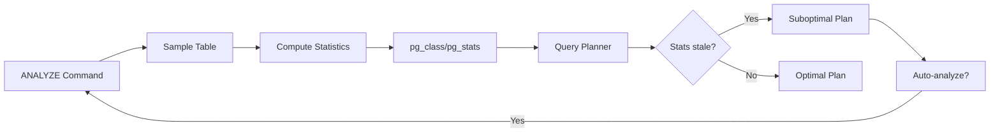
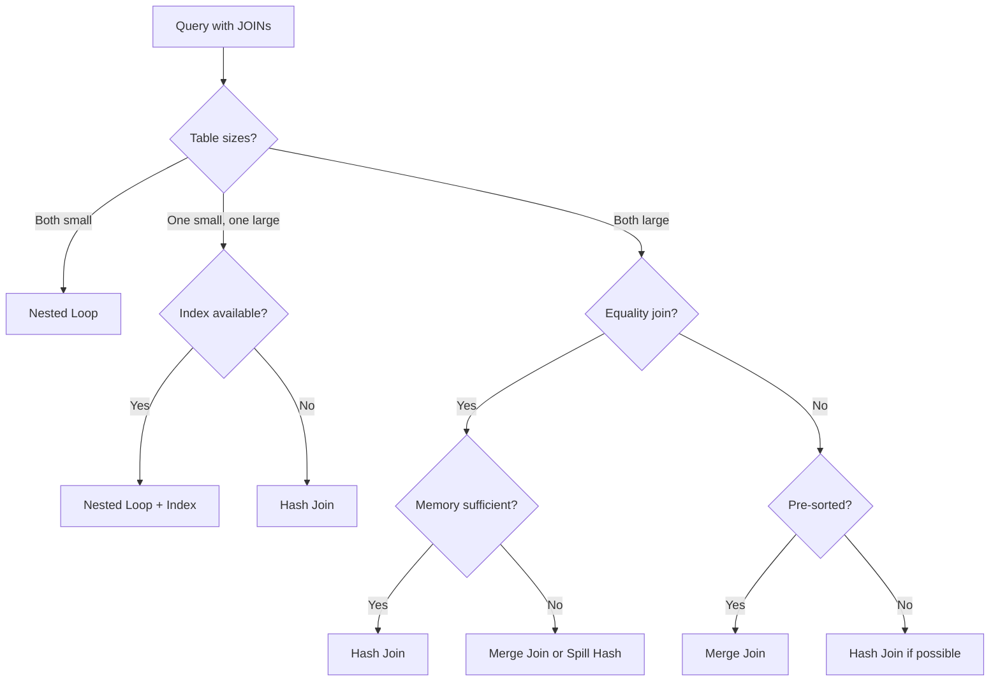

# Query Optimization - Execution Plan, Cost-based Optimizer, Join Algorithms

## 1. Mục tiêu của Task

Hiểu sâu cơ chế database engine **phân tích, tối ưu hóa và thực thi** SQL query. Không dừng lại ở "thêm index để query nhanh", mà phải nắm được:

- Query Planner quyết định execution plan như thế nào
- Cost-based optimizer tính toán chi phí ra sao
- Các join algorithm khác nhau và trade-off giữa chúng
- Cách đọc và phân tích execution plan trong production
- Anti-patterns và cách fix query performance thực tế

---

## 2. Bản chất và Cơ chế Hoạt động

### 2.1 Query Processing Pipeline

```
┌─────────────────┐    ┌─────────────────┐    ┌─────────────────┐
│   SQL Parser    │───▶│ Query Rewriter  │───▶│    Optimizer    │
│  (Syntax check) │    │ (View expand,   │    │ (Generate &     │
│                 │    │  Subquery opt)  │    │  choose plan)   │
└─────────────────┘    └─────────────────┘    └────────┬────────┘
                                                       │
                              ┌────────────────────────┘
                              ▼
                       ┌─────────────────┐
                       │  Executor       │
                       │ (Run the plan)  │
                       └─────────────────┘
```

**Bản chất vấn đề:** Query optimization là **NP-hard problem**. Không thể tìm plan tối ưu nhất trong thờigiian đa thức. Optimizer chỉ tìm **"đủ tốt" (good enough)** trong thờigian hợp lý.

### 2.2 Execution Plan - Bản đồ thực thi

Execution plan là **cây (tree)** các operators:

```
                    ┌─────────┐
                    │  LIMIT  │
                    │  (top)  │
                    └────┬────┘
                         │
                    ┌────▼────┐
                    │  SORT   │
                    │ORDER BY │
                    └────┬────┘
                         │
                 ┌───────┴───────┐
                 │   HASH JOIN   │
                 │  (customers)  │
                 └────┬────┬─────┘
                      │    │
              ┌───────┘    └───────┐
              ▼                    ▼
        ┌─────────┐          ┌─────────┐
        │SEQ SCAN │          │IDX SCAN │
        │ orders  │          │products │
        └─────────┘          └─────────┘
```

**Node types chính:**

| Node Type | Ý nghĩa | Cost đặc trưng |
|-----------|---------|----------------|
| **Seq Scan** | Đọc toàn bộ table | O(n), n = số rows |
| **Index Scan** | Đọc qua index + fetch heap | O(log n + k), k = matching rows |
| **Index Only Scan** | Chỉ đọc index (covering) | O(log n + k), no heap fetch |
| **Bitmap Index Scan** | Bitmap từ index, rồi fetch heap | Trung gian giữa Index và Seq |
| **Nested Loop** | Loop qua outer, probe inner | O(n×m) worst, O(n log m) with index |
| **Hash Join** | Build hash table từ inner | O(n+m) memory, O(n+m) time |
| **Merge Join** | Sort cả 2 inputs rồi merge | O(n log n + m log m) |
| **Sort** | Sắp xếp | O(n log n) |
| **Aggregate** | GROUP BY, COUNT, etc | O(n) hoặc O(n log n) |

### 2.3 Cost-Based Optimizer (CBO)

**Bản chất:** CBO là **heuristic estimator** - ước tính cost dựa trên statistics, không phải chạy thật.

```
Total Cost = I/O Cost + CPU Cost + Memory Cost + Network Cost
```

**Statistics Engine thu thập:**

| Thông số | Ý nghĩa | Impact |
|----------|---------|--------|
| `reltuples` | Ước tính số rows trong table | Cardinality estimation |
| `relpages` | Số pages (8KB) table chiếm | I/O cost estimate |
| `avg_width` | Trung bình row width | Memory/CPU cost |
| `n_distinct` | Số giá trị distinct của column | Selectivity calculation |
| `correlation` | Mức độ correlation giữa logical và physical order | Index scan efficiency |
| `histogram_bounds` | Phân phối giá trị (equi-depth histogram) | Range query estimation |
| `null_frac` | Phần trăm NULL | Predicate selectivity |
| `most_common_vals` | Giá trị xuất hiện nhiều nhất | Skew handling |

**Selectivity Calculation:**

```
Selectivity = (Estimated matching rows) / (Total rows)

Ví dụ: WHERE age > 30
- Nếu histogram cho thấy 60% rows > 30
- Selectivity = 0.6
```

**Cost Formula (PostgreSQL simplified):**

```
seq_page_cost = 1.0         # Mặc định: sequential I/O
random_page_cost = 4.0      # Random I/O (higher vì seek time)
cpu_tuple_cost = 0.01       # Xử lý 1 row
cpu_index_tuple_cost = 0.005 # Xử lý 1 index entry
cpu_operator_cost = 0.0025  # Thực hiện operator/comparison
```

**Ví dụ tính cost Seq Scan:**
```
Seq Scan Cost = (relpages × seq_page_cost) + (reltuples × cpu_tuple_cost)
              = (1000 × 1.0) + (10000 × 0.01)
              = 1000 + 100 = 1100
```

> **⚠️ Quan trọng:** Cost là **đơn vị tương đối**, không phải thờigian thực (ms). Dùng để so sánh plans, không phải dự đoán latency.

### 2.4 Join Algorithms - Chi tiết cơ chế

#### 2.4.1 Nested Loop Join

**Cơ chế:**
```
FOR each row r1 in outer table:
    FOR each row r2 in inner table:
        IF join_condition(r1, r2):
            output (r1, r2)
```

**Variants:**

| Variant | Điều kiện | Complexity |
|---------|-----------|------------|
| **Naive** | Không có gì | O(N×M) |
| **With Index** | Inner table có index trên join key | O(N × log M) |
| **Materialized** | Inner table nhỏ, cache vào memory | O(N + M) memory |

**Khi nào dùng:**
- Outer table rất nhỏ (nested loop tốn ít startup cost)
- Inner table có index tốt trên join key
- Join với tỷ lệ selectivity cao (ít rows match)

**Trade-off:**
- ✅ Low memory usage
- ✅ Fast startup (pipelined)
- ❌ Terrible performance khi cả 2 tables lớn

#### 2.4.2 Hash Join

**Cơ chế 2 phases:**

```
PHASE 1: BUILD
    FOR each row in inner table (smaller):
        hash_value = hash(join_key)
        insert into hash_table[hash_value]

PHASE 2: PROBE  
    FOR each row in outer table (larger):
        hash_value = hash(join_key)
        FOR each match in hash_table[hash_value]:
            IF join_key matches:
                output combined row
```

**Memory & Spill:**

```
┌─────────────────────────────────────────────┐
│           work_mem (4MB default)            │
├─────────────────────────────────────────────┤
│  Hash Table In-Memory  │  Spill to Disk    │
│  (Fast O(1) lookup)    │  (Partition,      │
│                        │   multi-pass)     │
└─────────────────────────────────────────────┘
```

- Nếu hash table > `work_mem`: **spill to disk**, tạo partitions, có thể cần multi-pass
- Spill là **performance killer**: I/O tăng đột biến

**Khi nào dùng:**
- Cả 2 tables lớn
- No suitable index
- Equality join (`=`)
- Inner table vừa đủ fit vào `work_mem` (hoặc gần fit)

**Trade-off:**
- ✅ O(N+M) time complexity tốt nhất
- ✅ Single pass qua data (nếu không spill)
- ❌ High memory usage
- ❌ Không dùng được cho range join (<, >, BETWEEN)
- ❌ Startup cost cao (phải build hash table trước)

#### 2.4.3 Merge Join

**Cơ chế:**
```
SORT outer table by join_key
SORT inner table by join_key

i = 0, j = 0
WHILE i < outer_rows AND j < inner_rows:
    IF outer[i].key == inner[j].key:
        output match
        advance both
    ELSE IF outer[i].key < inner[j].key:
        advance i
    ELSE:
        advance j
```

**Khi nào dùng:**
- Cả 2 tables đã sorted (hoặc có index sorted)
- Large result sets
- Range join hoặc merge-friendly operations

**Trade-off:**
- ✅ O(N+M) sau khi sort
- ✅ Streaming output sau sort phase
- ✅ Dùng được cho range joins
- ❌ Cost sort phase cao O(N log N)
- ❌ Không pipelined (phải wait sort)

### 2.5 Plan Generation - Dynamic Programming

PostgreSQL/MySQL dùng **dynamic programming** với pruning:

```
Level 1: Single tables (seq scan, index scan options)
Level 2: 2-table joins (all combinations)
Level 3: 3-table joins (build from level 2)
...
Level N: Complete plan

At each level: chỉ giữ lại cheapest plan cho mỗi set của tables
```

**Join Order Complexity:**
- N tables → (2N-2)!/(N-1)! possible join orders (catalan number)
- Với 10 tables: ~17,643,225,600 plans
- CBO dùng heuristics + pruning để giảm search space

---

## 3. Kiến trúc và Luồng Xử lý

### 3.1 Statistics Collection Flow



### 3.2 Execution Plan Decision Tree



---

## 4. So Sánh và Lựa Chọn

### 4.1 Join Algorithm Comparison

| Aspect | Nested Loop | Hash Join | Merge Join |
|--------|-------------|-----------|------------|
| **Best for** | Small outer, indexed inner | Large tables, equality | Large tables, sorted |
| **Time Complexity** | O(N×M) or O(N log M) | O(N+M) | O(N log N + M log M) |
| **Space Complexity** | O(1) | O(min(N,M)) | O(1) if pre-sorted |
| **Startup Cost** | Very Low | High (build phase) | Medium (sort) |
| **Range Joins** | ✅ Yes | ❌ No | ✅ Yes |
| **Streaming** | ✅ Yes | ❌ No | After sort |
| **Memory Pressure** | Low | High | Medium |

### 4.2 Index Scan vs Seq Scan

| Scenario | Seq Scan | Index Scan |
|----------|----------|------------|
| Table nhỏ (< 1000 rows) | ✅ Always better | ❌ Overhead cao |
| High selectivity (>20%) | ✅ Sequential faster | ❌ Random I/O nhiều |
| Low selectivity (<5%) | ❌ Đọc thừa nhiều | ✅ Targeted fetch |
| Covering index | ❌ Heap access needed | ✅ Index-only scan |
| SELECT * | ⚠️ Heap fetch tất cả | ⚠️ Random I/O penalty |

**Tipping Point:** Khoảng 5-20% selectivity tùy thuộc vào `random_page_cost` vs `seq_page_cost`.

### 4.3 PostgreSQL vs MySQL Optimizer

| Aspect | PostgreSQL | MySQL (InnoDB) |
|--------|------------|----------------|
| **Stats accuracy** | Excellent (histograms) | Good (samples) |
| **Join algorithms** | NL, Hash, Merge | NL, Hash (8.0+), BNL |
| **Cost model** | Highly configurable | Simpler |
| **Plan hints** | Limited (phải dùng extensions) | Index hints, join hints |
| **Parallel queries** | Mature (9.6+) | Limited (8.0+) |
| **JSON optimization** | GIN indexes | JSON indexes (8.0+) |

---

## 5. Rủi ro, Anti-patterns, và Lỗi Thường Gặp

### 5.1 Statistics Staleness

**Vấn đề:**
```sql
-- Table có 1M rows, vừa xóa 900k rows
-- Statistics vẫn nghĩ có 1M rows
EXPLAIN SELECT * FROM orders WHERE status = 'pending';
-- Seq scan được chọn (vì nghĩ có nhiều rows)
-- Thực tế chỉ còn 10 rows, index scan sẽ nhanh hơn
```

**Dấu hiệu:**
- `EXPLAIN` estimate khác `EXPLAIN ANALYZE` actual rất nhiều
- Plan bất ngờ (chọn seq scan khi nên chọn index)

**Fix:**
```sql
ANALYZE orders;  -- Manual update statistics
-- Hoặc tune: autovacuum_analyze_threshold, autovacuum_analyze_scale_factor
```

### 5.2 Correlated Subqueries - N+1 Query Problem

**Anti-pattern:**
```sql
-- Mỗi row lại chạy subquery
SELECT name, 
       (SELECT COUNT(*) FROM orders WHERE user_id = users.id)
FROM users;
-- N+1 queries!
```

**Fix:**
```sql
-- Single query với JOIN
SELECT u.name, COUNT(o.id)
FROM users u
LEFT JOIN orders o ON o.user_id = u.id
GROUP BY u.id, u.name;
-- Hoặc LATERAL JOIN nếu cần logic phức tạp hơn
```

### 5.3 Implicit Type Conversion

**Vấn đề:**
```sql
-- Column là INTEGER, query với string
WHERE user_id = '123'  -- Ngầm cast: user_id::text = '123'
-- Index trên user_id không được dùng!
```

**Fix:** Đảm bảo type match hoặc explicit cast về đúng column type.

### 5.4 Functions on Indexed Columns

**Anti-pattern:**
```sql
-- Index trên created_at, nhưng query dùng function
WHERE DATE(created_at) = '2024-01-01'
-- Function call mỗi row → Index không dùng được
```

**Fix:** Range query thay thế:
```sql
WHERE created_at >= '2024-01-01' 
  AND created_at < '2024-01-02'
```

### 5.5 OR Conditions Killing Index Usage

**Vấn đề:**
```sql
WHERE status = 'active' OR user_id = 123
-- Optimizer khó dùng index hiệu quả
```

**Fix:** UNION ALL:
```sql
SELECT * FROM orders WHERE status = 'active'
UNION ALL
SELECT * FROM orders WHERE user_id = 123 AND status != 'active';
-- Mỗi phần dùng index riêng
```

### 5.6 Memory Pressure với Hash Joins

**Dấu hiệu:** `EXPLAIN ANALYZE` hiển thị `Buckets: 131072 Batches: 4 Memory Usage: 4096kB`
- `Batches > 1` = đã spill to disk

**Fix:**
```sql
SET work_mem = '64MB';  -- Tăng cho session/query cụ thể
-- Hoặc optimize query để reduce join set size trước
```

### 5.7 Lock của SELECT FOR UPDATE

**Vấn đề:**
```sql
SELECT * FROM orders WHERE status = 'pending' FOR UPDATE;
-- Seq scan + lock tất cả rows → contention
```

**Fix:**
```sql
-- Dùng SKIP LOCKED để skip rows đang bị lock
SELECT * FROM orders 
WHERE status = 'pending' 
FOR UPDATE SKIP LOCKED 
LIMIT 10;
```

### 5.8 Parameter Sniffing (SQL Server term, PostgreSQL có tương tự)

**Vấn đề:** Prepared statement/plan cache dùng plan cho parameter A, nhưng parameter B có phân phối khác hoàn toàn.

**Dấu hiệu:** Query chậm bất thường chỉ với certain parameters.

**Fix:**
- Dùng `plan_cache_mode = force_custom_plan` (PostgreSQL 12+)
- Hoặc generic plan nếu phân phối đồng đều

---

## 6. Khuyến nghị Thực chiến trong Production

### 6.1 Monitoring & Observability

**Các metric cần track:**

| Metric | Tool | Threshold | Action |
|--------|------|-----------|--------|
| **Query duration p99** | pg_stat_statements | > 100ms | Investigate |
| **Seq scan frequency** | pg_stat_user_tables | > 50% queries | Check indexes |
| **Temp file usage** | pg_stat_database | > 0 | Tuning work_mem |
| **Plan vs Actual rows** | EXPLAIN (ANALYZE, BUFFERS) | > 10x diff | Run ANALYZE |
| **Lock wait time** | pg_locks | > 10s | Query optimization |

**Query để tìm slow queries:**
```sql
SELECT query, calls, mean_time, total_time, 
       rows / calls AS avg_rows
FROM pg_stat_statements 
ORDER BY mean_time DESC 
LIMIT 10;
```

### 6.2 Index Strategy

**Covering Index Pattern:**
```sql
-- Query thường xuyên:
SELECT user_id, created_at FROM orders 
WHERE status = 'completed' ORDER BY created_at DESC;

-- Covering index (INCLUDE để tránh heap fetch):
CREATE INDEX idx_orders_status_created 
ON orders(status, created_at) 
INCLUDE(user_id);
-- Index-only scan thay vì index scan + heap fetch
```

**Partial Index cho High Selectivity:**
```sql
-- Chỉ index rows thường xuyên query
CREATE INDEX idx_orders_pending 
ON orders(created_at) 
WHERE status = 'pending';
-- Index nhỏ hơn, targeted hơn
```

### 6.3 Query Writing Best Practices

1. **Filter sớm, filter mạnh:**
   ```sql
   -- Bad: Join trước rồi mới filter
   SELECT * FROM orders o
   JOIN users u ON o.user_id = u.id
   WHERE o.status = 'pending';
   
   -- Better: CTE để reduce dataset trước
   WITH pending_orders AS (
       SELECT * FROM orders WHERE status = 'pending'
   )
   SELECT * FROM pending_orders o
   JOIN users u ON o.user_id = u.id;
   ```

2. **LIMIT without ORDER BY là non-deterministic**

3. **Batch operations:**
   ```sql
   -- Bad: N individual INSERTs
   -- Good: INSERT ... VALUES (...), (...), (...)
   -- Hoặc COPY cho bulk load
   ```

4. **Avoid SELECT * trong production code**

### 6.4 Configuration Tuning

| Parameter | Default | Recommendation | Lý do |
|-----------|---------|----------------|-------|
| `shared_buffers` | 128MB | 25% RAM | Cache hot data |
| `effective_cache_size` | 4GB | 75% RAM | Planner estimate |
| `work_mem` | 4MB | 16-64MB | Sort/hash operations |
| `maintenance_work_mem` | 64MB | 512MB-1GB | VACUUM, CREATE INDEX |
| `random_page_cost` | 4.0 | 1.1 (SSD) | Reflect SSD latency |
| `seq_page_cost` | 1.0 | 1.0 | Keep |
| `effective_io_concurrency` | 1 | 200 (SSD) | Parallel I/O |

### 6.5 EXPLAIN ANALYZE Profiling

**Format đầy đủ:**
```sql
EXPLAIN (ANALYZE, BUFFERS, FORMAT JSON)
SELECT ...;
```

**Cần đọc:**
- `actual time=..` (startup..total) - Thờigian thực
- `rows=` - Số rows thực tế
- `loops=` - Số lần lặp
- `Buffers: shared hit/read` - Cache hit ratio

**Hit ratio calculation:**
```
Hit Ratio = shared_hit / (shared_hit + shared_read)
Target: > 99% cho hot data
```

---

## 7. Kết luận

**Bản chất cốt lõi:**

1. **Query Optimization là bài toán ước tính (estimation), không phải tính toán chính xác.** CBO dùng statistics để đoán, và đoán có thể sai khi statistics stale hoặc data skewed.

2. **Join algorithm không có "tốt nhất"** - chỉ có "phù hợp nhất cho tình huống cụ thể". Nested loop cho small dataset, Hash join cho large equality joins, Merge join cho sorted data.

3. **Cost là tương đối, không phải tuyệt đối.** Đừng chase cost number; hãy chase actual execution time và I/O efficiency.

4. **Statistics là foundation.** Không có statistics chính xác, optimizer mù quáng. Autovacuum/Autoanalyze không phải overhead - đó là investment.

5. **Index là trade-off:** Tăng read speed, giảm write speed, tốn disk space. Không phải query chậm là cần thêm index - đôi khi cần rewrite query.

**Tư duy Senior:**

- Đọc execution plan như đọc stack trace - phải hiểu ý nghĩa từng node
- Không tin "thêm index là giải pháp" mặc định - phân tích root cause
- Monitoring query performance liên tục, không chỉ khi có vấn đề
- Hiểu trade-off giữa consistency (ACID) và performance trong từng query
- Production issues 90% là do statistics stale, missing index, hoặc anti-patterns trong query writing

---

## 8. Tài liệu Tham khảo

- PostgreSQL Documentation: Chapter 70 - Query Planning
- "PostgreSQL 14 Internals" by Egor Rogov
- "Database Internals" by Alex Petrov (Chapter 4-5)
- "High Performance PostgreSQL for Rails" by Andrew Atkinson
- PGCon talks: "Query Planning" series by Bruce Momjian
