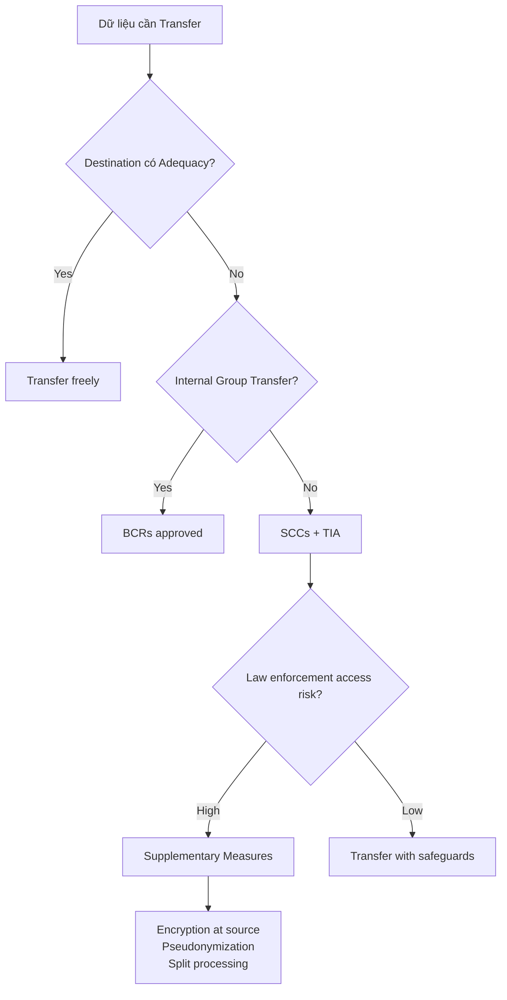
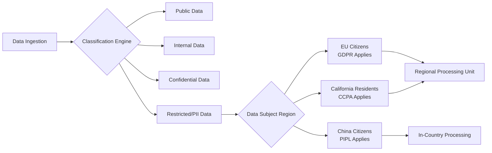
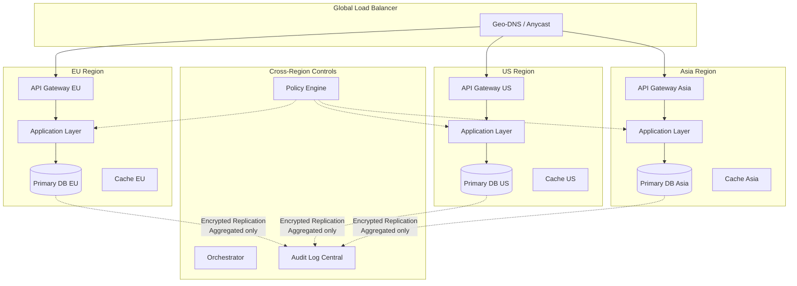
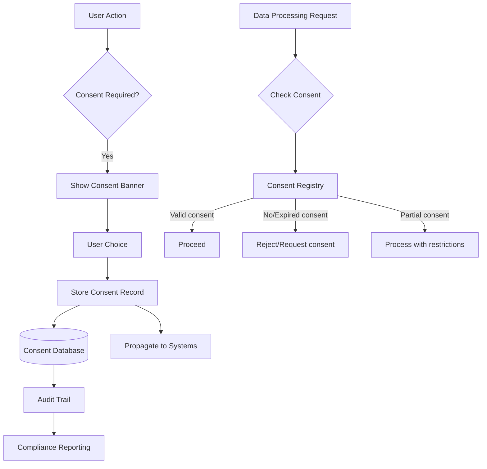

# Data Sovereignty & Privacy Engineering

## 1. Mục tiêu của Task

Nghiên cứu kiến trúc kỹ thuật để đảm bảo tuân thủ các quy định về chủ quyền dữ liệu (Data Sovereignty) và quyền riêng tư (Privacy) trong hệ thống backend enterprise. Tập trung vào:

- GDPR (General Data Protection Regulation) - EU
- CCPA/CPRA (California Consumer Privacy Act/Rights Act) - US
- Các yêu cầu về Data Residency (lưu trữ dữ liệu trong biên giới quốc gia)
- Privacy by Design và Privacy by Default
- Automated data lifecycle management
- Cross-border data transfer mechanisms

> **Bản chất vấn đề:** Data Sovereignty không chỉ là "lưu dữ liệu ở đâu" mà là kiến trúc hệ thống cho phép kiểm soát dữ liệu theo pháp lý của từng khu vực, đồng thợi đảm bảo trải nghiệm ngườii dùng liền mạch trên toàn cầu.

---

## 2. Bản Chất và Cơ Chế Hoạt Động

### 2.1 Data Sovereignty vs Data Residency vs Data Localization

| Khái niệm | Định nghĩa | Phạm vi pháp lý | Mức độ nghiêm ngặt |
|-----------|-----------|-----------------|-------------------|
| **Data Sovereignty** | Dữ liệu chịu sự điều chỉnh của luật pháp nơi nó được tạo ra | Quốc gia nơi entity tạo dữ liệu đặt trụ sở | Cao - ảnh hưởng governance |
| **Data Residency** | Dữ liệu phải được lưu trữ vật lý trong biên giới địa lý nhất định | Khu vực/quốc gia chỉ định | Trung bình - có thể có ngoại lệ |
| **Data Localization** | Bắt buộc dữ liệu phải ở trong nước, thường cấm xuất khẩu | Quốc gia áp dụng | Rất cao - cứng nhắc |

```
Ví dụ thực tế:
- GDPR (EU): Data Sovereignty - dữ liệu EU chịu GDPR dù lưu ở đâu
- Russia Data Localization Law: Cứng nhắc - dữ liệu cá nhân ngườii Nga phải ở server Nga
- China Cybersecurity Law: Cả hai - localization cho "important data" + sovereignty cho tất cả
```

### 2.2 Cơ Chế Pháp Lý Chính

#### GDPR (EU) - Extraterritorial Scope

> **Nguyên tắc then chốt:** GDPR áp dụng cho BẤT KỲ tổ chức nào xử lý dữ liệu cá nhân của cư dân EU, không phụ thuộc vào vị trí tổ chức.

**Các cơ chế transfer hợp pháp (Article 45-49):**

1. **Adequacy Decision** - EU Commission quyết định quốc gia đủ tiêu chuẩn bảo vệ
   - Ví dụ: UK, Canada (thương mại), Israel, New Zealand, Uruguay
   - **Lưu ý:** US KHÔNG còn trong danh sách sau Schrems II

2. **Standard Contractual Clauses (SCCs)** - Điều khoản hợp đồng chuẩn
   - Controller-to-Controller (C2C) - 2021 version
   - Controller-to-Processor (C2P) - 2021 version
   - **Bắt buộc:** Transfer Impact Assessment (TIA) để đánh giá rủi ro pháp lý đích đến

3. **Binding Corporate Rules (BCRs)** - Cho transfers nội bộ tập đoàn
   - Phê duyệt bởi Lead Supervisory Authority (LSA)
   - Thờii gian phê duyệt: 12-24 tháng
   - Áp dụng: Multinational corporations

4. **Derogations** - Ngoại lệ hạn chế
   - Consent explicit (phải rõ ràng, informed)
   - Performance of contract (ít áp dụng cho SaaS)
   - Legitimate interests (hạn chế, cần balancing test)

#### CCPA/CPRA (California)

**Phạm vi:** Chỉ áp dụng cho "business" đáp ứng ít nhất 1 trong 3 tiêu chí:
- Doanh thu > $25M/year
- Xử lý data của > 100,000 California residents/year
- ≥ 50% doanh thu từ bán dữ liệu cá nhân

**Quyền của ngườii dùng (Consumer Rights):**
- Right to Know: Biết dữ liệu nào được thu thập, từ đâu, cho mục đích gì
- Right to Delete: Yêu cầu xóa (với exceptions quan trọng)
- Right to Opt-Out: Từ chối bán dữ liệu (CCPA) / share (CPRA)
- Right to Non-Discrimination: Không bị phân biệt đối xử khi thực hiện quyền
- Right to Correct (CPRA mới): Sửa dữ liệu không chính xác

#### Cross-Border Transfer Mechanisms



### 2.3 Privacy by Design - 7 Foundational Principles

Theo Ann Cavoukian (Tiến sĩ, former Information and Privacy Commissioner of Ontario):

1. **Proactive not Reactive; Preventative not Remedial** - Chủ động ngăn chặn, không phản ứng sau sự cố
2. **Privacy as the Default Setting** - Privacy mặc định, không cần ngườii dùng cấu hình
3. **Privacy Embedded into Design** - Tích hợp từ đầu, không phụ kiện
4. **Full Functionality - Positive-Sum, not Zero-Sum** - Cân bằng privacy và functionality
5. **End-to-End Security - Full Lifecycle Protection** - Bảo vệ từ collection đến destruction
6. **Visibility and Transparency - Keep it Open** - Minh bạch về practices
7. **Respect for User Privacy - Keep it User-Centric** - Ngườii dùng là trung tâm

---

## 3. Kiến Trúc và Luồng Xử Lý

### 3.1 Data Classification & Taxonomy System



**Cấu trúc metadata cần thiết:**

```json
{
  "dataElement": "email_address",
  "classification": "pii",
  "sensitivityLevel": "high",
  "applicableRegulations": ["GDPR", "CCPA", "PIPL"],
  "dataSubjectCategories": ["customer", "employee"],
  "retentionPolicy": {
    "purpose": "account_management",
    "duration": "account_lifetime_plus_7_years",
    "legalBasis": "contract_performance"
  },
  "processingRestrictions": {
    "allowedRegions": ["EU", "EEA"],
    "encryptionRequired": true,
    "pseudonymization": "recommended"
  },
  "lineage": {
    "source": "user_registration",
    "transformations": ["normalization", "validation"],
    "downstreamSystems": ["crm", "analytics"]
  }
}
```

### 3.2 Regional Data Processing Architecture



### 3.3 Consent Management Platform (CMP) Architecture



**Consent Record Structure:**

```json
{
  "consentId": "uuid-v4",
  "dataSubject": {
    "id": "hashed_user_id",
    "region": "EU",
    "jurisdiction": "DE"
  },
  "timestamp": "2024-01-15T10:30:00Z",
  "mechanism": "explicit_click",
  "purposes": {
    "analytics": {
      "granted": true,
      "expiry": "2025-01-15T10:30:00Z",
      "withdrawalMethod": "privacy_portal"
    },
    "marketing": {
      "granted": false,
      "expiry": null
    },
    "personalization": {
      "granted": true,
      "expiry": "2024-07-15T10:30:00Z"
    }
  },
  "version": "privacy_policy_v2.3",
  "proof": {
    "ipHash": "sha256_hash",
    "userAgentHash": "sha256_hash",
    "timestampServer": "2024-01-15T10:30:02Z"
  }
}
```

---

## 4. So Sánh Các Lựa Chọn Triển Khai

### 4.1 Multi-Region Data Strategies

| Strategy | Mô tả | Ưu điểm | Nhược điểm | Phù hợp khi |
|----------|-------|---------|------------|-------------|
| **Geo-Sharding** | Dữ liệu ngườii dùng X ở region X | Tuân thủ tốt nhất, latency thấp | Phức tạp, cross-region query khó | Clear residency requirements, user stick to region |
| **Primary-Secondary with Regional Redaction** | Master ở một region, replicas có data redacted | Simple architecture, eventual consistency | Redaction complexity, không real-time global view | Mostly read-heavy, limited global features |
| **Federated Identity + Regional Isolation** | Identity global, data regional, aggregation APIs | Balance compliance và UX | Complex orchestration, eventual consistency | Strong identity needs, regional data processing |
| **Data Residency Gateway** | Single codebase, routing dựa trên data type | Maintainable, flexible | Gateway complexity, latency overhead | Multiple regulations, evolving requirements |

### 4.2 Encryption Strategies for Cross-Border

| Approach | Implementation | Security Level | Performance Impact | Regulatory Acceptance |
|----------|---------------|----------------|-------------------|----------------------|
| **Client-Side Encryption** | Encrypt trước khi rời client device | Highest | High (client CPU) | Excellent - data never readable by provider |
| **Field-Level Encryption** | Encrypt sensitive fields at application layer | High | Medium | Very Good - key separation |
| **Database TDE** | Transparent Data Encryption | Medium | Low | Limited - provider holds keys |
| **Bring Your Own Key (BYOK)** | Customer manages encryption keys | High | Medium | Good - control separation |
| **Hold Your Own Key (HYOK)** | Customer HSM, provider never sees keys | Highest | High | Excellent - true zero knowledge |

### 4.3 Cross-Border Transfer Mechanisms Comparison

| Mechanism | Setup Time | Cost | Flexibility | Enforcement | Best For |
|-----------|-----------|------|-------------|-------------|----------|
| SCCs + TIA | 2-4 weeks | Low-Medium | High | Contractual | Most B2B transfers |
| BCRs | 12-24 months | High (legal fees) | High | Internal policy | Large multinationals |
| Adequacy | Immediate | None | None | Automatic | Eligible countries only |
| Derogations | Immediate | None | Very Limited | Case-by-case | Emergencies only |

---

## 5. Rủi Ro, Anti-Patterns, và Lỗi Thường Gặp

### 5.1 Critical Risks

#### Data Localization Violations

> **Rủi ro pháp lý:** Vi phạm localization laws có thể dẫn đến phạt nặng và cấm hoạt động.

**Ví dụ thực tế:**
- **LinkedIn tại Nga (2016):** Bị chặn vì không lưu trữ dữ liệu ngườii dùng Nga trong nước
- **TikTok tại Ấn Độ (2020):** Bị cấm vì concerns về data sovereignty
- **Google Analytics tại EU:** Nhiều DPA (Data Protection Authority) cấm vì transfer không an toàn

#### Schrems II và Future of Transfers

Sau phán quyết Schrems II (2020):
- Privacy Shield bị vô hiệu hóa
- SCCs vẫn valid nhưng phải có TIA và supplementary measures
- **Lưu ý:** US CLOUD Act vẫn tạo rủi ro cho EU data

```
Supplementary Measures cần xem xét:
1. Encryption với keys held ở EU (không US provider)
2. Pseudonymization trước khi transfer
3. Split processing - different processors xử lý different data parts
4. Technical controls ngăn remote access từ third countries
```

### 5.2 Anti-Patterns

| Anti-Pattern | Mô tả | Tác hại | Cách khắc phục |
|-------------|-------|---------|----------------|
| **"Checkbox Compliance"** | Coi privacy như checklist, không hiểu bản chất | Không thực sự bảo vệ data, audit failures | Implement Privacy by Design |
| **Global Schema with Regional Flags** | Một schema, region column để filter | Risk data leakage, query mistakes | Separate schemas/instances per region |
| **Lazy Consent** - bundled consent | Đồng ý TOS = đồng ý all processing | Invalid consent, regulatory fines | Granular, specific consent |
| **Data Hoarding** | Giữ data "just in case" | Retention violations, breach exposure | Automated TTL, purpose limitation |
| **Cross-Region Joins** | JOIN giữa regional databases | Data leakage risk, compliance breach | Pre-aggregated data, no raw joins |
| **Log Everything Approach** | Log all data including PII | Audit log becomes liability | Structured logging, PII redaction |

### 5.3 Edge Cases và Pitfalls

**Data Subject Rights Implementation:**

1. **Right to Deletion (Right to be Forgotten)**
   - Không đơn giản là DELETE FROM table
   - Cần cascade đến backups, logs, analytics, third parties
   - Exception handling cho legal obligations (e.g., tax records)
   - Audit trail của deletion request itself

2. **Right to Data Portability**
   - Format: Machine-readable (JSON, XML) + human-readable
   - Scope: Data provided BY subject + data ABOUT subject từ observation
   - Không bao gồm: Derived data, trade secrets, other people's data

3. **Right to Object (GDPR Art. 21)**
   - Absolute right với direct marketing (must stop immediately)
   - Balancing test với legitimate interests
   - Technical challenge: Stop processing nhưng giữ identification để enforce objection

**Cross-Border Employee Monitoring:**
- Workplace monitoring thuộc "expectation of privacy"
- Khác nhau giữa jurisdictions (EU strict, US employer-friendly)
- BYOD policies cần rõ ràng về corporate data vs personal data

---

## 6. Khuyến Nghị Thực Chiến trong Production

### 6.1 Technical Implementation

#### Data Residency Router

```java
@Component
public class DataResidencyRouter {
    
    private final Map<String, DataRegion> userRegionCache;
    private final PolicyEngine policyEngine;
    
    public ProcessingLocation route(DataRequest request) {
        String userId = request.getUserId();
        DataClassification classification = request.getClassification();
        
        // 1. Determine data subject jurisdiction
        Jurisdiction jurisdiction = getJurisdiction(userId);
        
        // 2. Check applicable regulations
        Set<Regulation> regulations = policyEngine
            .getApplicableRegulations(jurisdiction, classification);
        
        // 3. Determine allowed processing locations
        Set<Region> allowedRegions = regulations.stream()
            .flatMap(r -> r.getAllowedRegions().stream())
            .collect(Collectors.toSet());
        
        // 4. Select optimal location based on latency + compliance
        return selectOptimalRegion(request, allowedRegions);
    }
    
    private ProcessingLocation selectOptimalRegion(
            DataRequest request, 
            Set<Region> allowed) {
        // Preference: User's region > Nearest allowed > Primary region
        Region userRegion = request.getUserRegion();
        if (allowed.contains(userRegion)) {
            return ProcessingLocation.of(userRegion);
        }
        
        // Fallback to nearest allowed region
        return allowed.stream()
            .min(Comparator.comparing(r -> r.distanceTo(userRegion)))
            .map(ProcessingLocation::of)
            .orElseThrow(() -> new ComplianceException(
                "No valid processing region available"));
    }
}
```

> **Lưu ý quan trọng:** Code trên chỉ minh họa logic routing. Trong production, cần thêm circuit breaker, caching, và graceful degradation khi policy engine unavailable.

#### Automated Data Lifecycle Management

```yaml
# data-lifecycle-policies.yaml
policies:
  - name: customer_pii_retention
    applies_to:
      classifications: [pii, sensitive]
      purposes: [account_management]
    retention:
      duration: "7_years_after_account_closure"
      legal_basis: "tax_obligation"
    actions:
      - trigger: "account_closed"
        delay: "30_days"
        action: "anonymize"
        target_fields: [name, email, phone]
      - trigger: "retention_period_end"
        action: "hard_delete"
        verification: "two_person_rule"
    
  - name: analytics_data_minimization
    applies_to:
      classifications: [behavioral_data]
    retention:
      duration: "26_months"
    actions:
      - trigger: "13_months"
        action: "aggregate_and_purge"
        aggregation_level: "monthly_summary"
      - trigger: "26_months"
        action: "delete"
```

### 6.2 Monitoring và Observability

**Metrics cần theo dõi:**

| Metric | Purpose | Alert Threshold |
|--------|---------|-----------------|
| `consent.conversion_rate` | Effectiveness của consent flow | < 70% |
| `data_subject_requests.volume` | DSR workload | > 100/day |
| `data_subject_requests.sla_breach` | Compliance risk | Any breach |
| `cross_border_transfer.volume` | Transfer monitoring | Sudden spikes |
| `retention_policy.violations` | Data lifecycle compliance | > 0 |
| `pii.access.anomalous` | Security incidents | ML-based anomaly |
| `encryption.at_rest.coverage` | Security posture | < 100% |

**Audit Logging Requirements:**

```json
{
  "eventType": "data_access",
  "timestamp": "2024-01-15T10:30:00Z",
  "dataSubject": {
    "idHash": "sha256_hash",
    "region": "EU"
  },
  "accessor": {
    "type": "system",
    "service": "billing_service",
    "identity": "svc:billing:prod"
  },
  "dataAccessed": {
    "classification": "pii",
    "fields": ["email", "billing_address"],
    "volume": 1
  },
  "legalBasis": "contract_performance",
  "consentId": "consent_uuid",
  "purpose": "invoice_generation",
  "location": {
    "processingRegion": "eu-west-1",
    "dataResidency": "EU"
  }
}
```

### 6.3 Incident Response cho Privacy Breaches

**GDPR Breach Notification Timeline:**

```
Phát hiện breach
    |
    v
[0-72 giờ] ---> Thông báo Supervisory Authority (nếu high risk)
    |
    v
[Không delay không cần thiết] ---> Thông báo Data Subjects (nếu high risk to rights)
```

**Breach Assessment Checklist:**

1. **Nature of breach**
   - [ ] Confidentiality (unauthorized access)
   - [ ] Integrity (unauthorized modification)
   - [ ] Availability (destruction/loss)

2. **Data categories affected**
   - [ ] Special categories (health, biometrics, etc.)
   - [ ] Financial data
   - [ ] Contact details
   - [ ] Behavioral data

3. **Scale**
   - [ ] Number of records
   - [ ] Number of data subjects
   - [ ] Duration of exposure

4. **Likely consequences**
   - [ ] Identity theft risk
   - [ ] Financial loss
   - [ ] Reputational damage
   - [ ] Discrimination

### 6.4 Organizational Practices

**Data Protection Impact Assessment (DPIA) - GDPR Article 35:**

Required khi:
- Systematic profiling
- Large-scale processing of special categories
- Systematic monitoring of public area
- New technologies (AI, biometrics)

DPIA Structure:
1. Description of processing
2. Assessment of necessity and proportionality
3. Risk assessment for rights and freedoms
4. Measures to address risks
5. Consultation with DPO (if applicable)

**Privacy Engineering Team Structure:**

```
Privacy Engineering
├── Policy & Legal Interpretation
│   └── Translate regulations to technical requirements
├── Technical Implementation
│   ├── Data classification systems
│   ├── Consent management platform
│   └── Access control & encryption
├── Privacy Operations
│   ├── DSR fulfillment automation
│   ├── Incident response
│   └── Vendor assessments
└── Privacy Assurance
    ├── Auditing & monitoring
    └── DPIA facilitation
```

---

## 7. Kết Luận

### Bản Chất Cốt Lõi

Data Sovereignty và Privacy Engineering không phải là "features" để thêm vào hệ thống - chúng là **kiến trúc nền tảng** ảnh hưởng đến mọi quyết định technical.

**7 Principles để áp dụng:**

1. **Data is jurisdictional** - Mỗi data element có "quốc tịch" pháp lý riêng
2. **Consent is contextual** - Không có "đồng ý một lần cho mọi thứ"
3. **Minimization is mandatory** - Thu thập ít nhất có thể, giữ ngắn nhất có thể
4. **Transparency builds trust** - Ngườii dùng có quyền biết và kiểm soát
5. **Security enables privacy** - Không có security thì không có privacy
6. **Automation ensures compliance** - Manual processes sẽ fail ở scale
7. **Privacy is a competitive advantage** - Không chỉ là cost center

### Trade-off Quan Trọng Nhất

| Trade-off | Lựa chọn A | Lựa chọn B | Cân nhắc |
|-----------|-----------|-----------|----------|
| **Global UX vs Regional Compliance** | Unified experience | Strict data isolation | Federated identity + regional data processing |
| **Data Utility vs Privacy** | Rich analytics | Strict minimization | Aggregation, differential privacy |
| **Speed vs Security** | Fast processing | End-to-end encryption | Field-level encryption với caching |
| **Cost vs Compliance** | Single region | Multi-region | Risk-based approach, data residency gateway |

### Rủi Ro Lớn Nhất

1. **Schrems II và tương lai của EU-US transfers** - Chuẩn bị supplementary measures
2. **Fragmentation của regulations** - Mỗi quốc gia có luật riêng (China PIPL, India DPDP, etc.)
3. **AI và automated decision-making** - GDPR Article 22, explainability requirements
4. **Cross-border enforcement** - Một breach có thể trigger nhiều jurisdictions

### Xu Hướng Tương Lai

- **Privacy-Enhancing Technologies (PETs):** Differential privacy, homomorphic encryption, secure multi-party computation
- **Data Sovereignty Clouds:** Sovereign clouds (Gaia-X EU, Oracle EU Sovereign Cloud)
- **Automated Compliance:** Continuous compliance monitoring, policy-as-code
- **Federated Learning:** Train models without centralizing data

> **Final Thought:** Trong thế giới data-driven, ability để xử lý data một cách có trách nhiệm về pháp lý và đạo đức sẽ là differentiator của các enterprise thành công.
