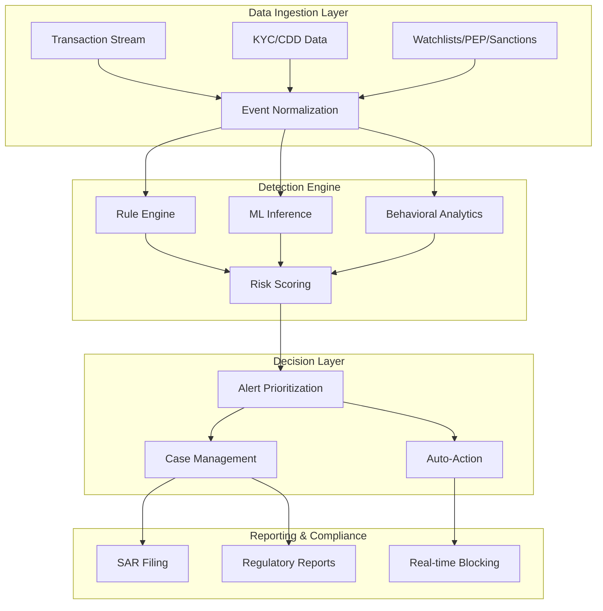

# Real-Time Transaction Monitoring: AML/CFT Compliance Systems

## 1. Mục tiêu của Task

Hiểu sâu kiến trúc và cơ chế hoạt động của hệ thống giám sát giao dịch real-time trong bối cảnh tuân thủ AML (Anti-Money Laundering) và CFT (Countering the Financing of Terrorism). Phân tích trade-off giữa rule-based và ML-based detection, chiến lược quản lý false positive, và các yêu cầu regulatory reporting trong môi trường production.

---

## 2. Bản Chất và Cơ Chế Hoạt động

### 2.1 Kiến trúc Tổng quan RTTM System



> **Bản chất cốt lõi:** RTTM không phải là một hệ thống "detect fraud" đơn thuần mà là **risk-based surveillance system** - cân bằng giữa việc phát hiện bất thường và operational cost của false positives.

### 2.2 Data Pipeline và Event Processing

#### Transaction Stream Processing Architecture

| Pattern | Latency | Complexity | Use Case |
|---------|---------|------------|----------|
| **Synchronous (In-Path)** | <100ms | Cao | Real-time blocking, velocity checks |
| **Asynchronous (Sidecar)** | 1-5s | Trung bình | Pattern detection, aggregation |
| **Batch Window** | Phút-giờ | Thấp | Historical analysis, trend detection |

> **Quan trọng:** Đa số modern RTTM systems sử dụng **lambda architecture** - kết hợp speed layer (real-time) và batch layer (deep analysis).

#### Event Enrichment Strategy

Mỗi transaction event cần được enrich với:
- **Static data:** Customer profile, KYC risk rating, account type
- **Temporal context:** Rolling window aggregates (1h, 24h, 30d)
- **Graph context:** Counterparty relationships, network proximity to high-risk entities
- **External feeds:** Sanctions lists, PEP databases, adverse media

```
Raw Transaction (50-100 fields)
    ↓ Enrichment
Enriched Event (200+ fields)
    ├── Customer vector (demographics, risk score, tenure)
    ├── Transaction vector (amount, currency, velocity)
    ├── Counterparty vector (geography, entity type, sanctions status)
    └── Network vector (degree centrality, path to high-risk)
```

### 2.3 Detection Engine Deep Dive

#### Rule-Based Detection

**Cơ chế hoạt động:**
- **Deterministic rules:** IF condition THEN action (certainty 100%)
- **Threshold-based:** Velocity limits, amount thresholds, frequency caps
- **Scenario-based:** Pre-defined money laundering patterns (layering, structuring, smurfing)

**Kiến trúc Rule Engine hiệu quả:**
```
Rule Repository (Drools/Esper/Custom)
    ├── Simple Rules: Amount > $10K AND Geography = HighRisk
    ├── Aggregate Rules: SUM(Amount) over 24h > Threshold
    ├── Sequence Rules: Pattern A followed by Pattern B within T
    └── Temporal Rules: Unusual time-of-day, day-of-week
```

> **Trade-off quan trọng:** Rules dễ explainable (regulatory requirement) nhưng không adaptive. Mỗi rule mới = technical debt vì cần maintain, test, và có thể conflict với rules hiện có.

#### ML-Based Detection

**Các mô hình phổ biến trong RTTM:**

| Model Type | Strength | Weakness | Production Concern |
|------------|----------|----------|-------------------|
| **Supervised (XGBoost/RF)** | High precision với labeled data | Cold start, label imbalance | Model drift, retraining cadence |
| **Unsupervised (Anomaly Detection)** | Phát hiện unknown patterns | High false positive rate | Threshold tuning, explainability |
| **Graph Neural Networks** | Network-based ML | Computation cost | Real-time inference latency |
| **Sequence Models (LSTM/Transformer)** | Temporal pattern recognition | Training complexity | Sequence length trade-offs |

**Feature Engineering quan trọng:**
- **Velocity features:** Txn count/amount trong rolling windows
- **Behavioral deviation:** Z-score so với historical baseline
- **Graph features:** Degree, betweenness, clustering coefficient
- **Counterparty risk:** Sanctions proximity, geography risk score

> **Production reality:** 80% effort là feature engineering và data quality, 20% là model selection.

### 2.4 Risk Scoring và Alert Generation

**Multi-Layer Risk Scoring:**

```
Layer 1: Transaction Risk Score (0-100)
    ├── Rule triggers (weighted)
    ├── ML anomaly score
    └── Behavioral deviation

Layer 2: Customer Risk Score (cumulative)
    ├── Historical alert history
    ├── KYC/CDD assessment
    └── Network risk exposure

Layer 3: Alert Priority Score
    ├── Composite risk (Layer 1 + 2)
    ├── Regulatory priority (STR/SAR deadlines)
    └── Business impact
```

---

## 3. So Sánh Rule-Based vs ML-Based Detection

### 3.1 Chi tiết Trade-off

| Dimension | Rule-Based | ML-Based | Hybrid Approach |
|-----------|------------|----------|-----------------|
| **Explainability** | ✅ Cao - deterministic logic | ⚠️ Thấp - black box | ✅ Layered explainability |
| **Adaptability** | ❌ Thấp - manual update | ✅ Cao - learns patterns | ✅ Best of both |
| **False Positive Rate** | ❌ Cao nếu rules đơn giản | ⚠️ Variable | ✅ Optimizable |
| **Implementation Cost** | ✅ Thấp ban đầu | ❌ Cao (data, infra) | ⚠️ Moderate |
| **Regulatory Acceptance** | ✅ Cao | ⚠️ Đang phát triển | ✅ Cao |
| **Latency** | ✅ <10ms | ⚠️ 10-100ms | ⚠️ Depends on architecture |

### 3.2 When to Use What

**Rule-Based phù hợp khi:**
- Regulatory requirements mandate specific scenarios (structuring $10K+)
- Known patterns với high confidence (sanctions list matching)
- Real-time blocking decisions cần 100% explainability
- Data quality không đủ cho ML

**ML-Based phù hợp khi:**
- Volume giao dịch quá lớn cho manual rule tuning
- Unknown patterns cần discovery (emerging typologies)
- Behavioral baselines cần personalization
- Sufficient labeled data và feedback loop

**Hybrid Strategy (Best Practice):**
```
Tier 1: Rule-based filters (sanctions, velocity limits) - Block/Allow
Tier 2: ML anomaly detection - Risk score augmentation
Tier 3: Human-in-the-loop - Complex case investigation
```

---

## 4. False Positive Management

### 4.1 Bản chất vấn đề

> **The False Positive Paradox:** Tighten rules để catch more ML → FP rate tăng → operational cost tăng → investigator fatigue → miss real alerts.

**Industry Benchmarks:**
- Typical FP rate: 90-95% (9/10 alerts là false positive)
- Target FP rate: 70-80% với maintained detection rate
- Investigative cost per alert: $50-200 USD

### 4.2 Chiến lược giảm FP

#### A. Pre-Detection Filtering

**Whitelist Management:**
- Known good counterparties (payroll, utilities)
- Historical confirmed false positives
- Business-justified exceptions (seasonal patterns)

**Context Enrichment:**
- Transaction purpose codes
- Customer-declared expected activity
- Seasonal/cyclical pattern recognition

#### B. Detection Tuning

**Dynamic Thresholds:**
```java
// Pseudo-code cho dynamic threshold
threshold = baseline + (std_dev * sensitivity_factor)
// sensitivity_factor được điều chỉnh dựa trên:
// - Customer segment
// - Historical false positive rate
// - Current alert queue depth
```

**Risk-Based Calibration:**
- Higher risk customers = tighter thresholds
- Lower risk customers = relaxed thresholds (reduce noise)

#### C. Post-Detection Optimization

**Alert Clustering:**
- Group related alerts (same customer, same pattern)
- Single investigation covers multiple alerts
- Reduce duplicate work

**Feedback Loop:**
- Confirmed false positives → auto-whitelist rules
- Confirmed true positives → model retraining signal
- Investigator notes → NLP analysis cho pattern improvement

### 4.3 Measuring FP Reduction Success

**Key Metrics:**
- **Alert-to-SAR ratio:** Target <10% (industry average 1-5%)
- **True Positive Rate (Recall):** Must maintain >95%
- **Precision:** TP / (TP + FP)
- **Investigation time per alert:** Trend downward
- **Auto-closure rate:** % alerts closed without investigation

---

## 5. Alert Prioritization

### 5.1 Multi-Factor Priority Scoring

```
Priority Score = w1*(Risk_Score) + w2*(Regulatory_Urgency) + w3*(Business_Impact) + w4*(Time_Sensitivity)

Where:
- Risk_Score: Composite từ detection engine
- Regulatory_Urgency: Days to SAR deadline, regulatory examination period
- Business_Impact: Transaction amount, customer tier, reputational risk
- Time_Sensitivity: Velocity patterns, active investigation context
```

### 5.2 Queue Management Strategies

| Strategy | Implementation | Best For |
|----------|---------------|----------|
| **FIFO** | Simple queue | Low volume, high regulatory scrutiny |
| **Risk-Priority** | Priority queue theo risk score | High volume, resource constrained |
| **SLA-Driven** | Deadline-aware scheduling | Multiple regulatory deadlines |
| **Skill-Based** | Route đến investigator phù hợp | Complex case types |

### 5.3 Auto-Action Framework

**Risk-Based Auto-Decisions:**

| Risk Level | Auto-Action | Human Review |
|------------|-------------|--------------|
| **Critical (95-100)** | Block transaction + Immediate alert | Real-time |
| **High (80-95)** | Hold transaction + Priority queue | Within 4 hours |
| **Medium (50-80)** | Allow + Normal queue | Within 24-48h |
| **Low (<50)** | Allow + Batch review | Weekly/monthly |

> **Quan trọng:** Auto-block decisions phải có **override mechanism** cho legitimate urgent transactions (với audit trail đầy đủ).

---

## 6. Regulatory Reporting

### 6.1 SAR (Suspicious Activity Report) Filing

**Requirements chính:**
- **Timing:** Within 30-60 days của detection (tùy jurisdiction)
- **Content:** Transaction details, investigation summary, supporting documentation
- **Format:** Regulatory-specific (FinCEN, FCA, MAS, etc.)

**Automation Levels:**

| Level | Description | Implementation |
|-------|-------------|----------------|
| **Manual** | Investigator writes narrative | Legacy systems |
| **Assisted** | Auto-populate fields, human narrative | Most modern systems |
| **Auto-Draft** | AI-generated narrative, human review | Emerging |
| **Full-Auto** | End-to-end automation (rare) | Limited scenarios |

### 6.2 Data Retention và Audit Trail

**Regulatory Requirements:**
- Transaction records: 5-7 years
- Investigation records: 5-7 years sau closure
- Model training data: Version control và explainability
- System access logs: Tamper-evident storage

**Audit Trail Components:**
```
Audit Record = {
  timestamp: ISO-8601,
  actor: user_id/system_process,
  action: CREATE/UPDATE/DELETE/VIEW,
  resource: alert_id/customer_id/transaction_id,
  before_state: encrypted_snapshot,
  after_state: encrypted_snapshot,
  justification: free_text,
  session_context: ip_address, device_id
}
```

### 6.3 Cross-Border Compliance

**Challenges:**
- Different thresholds ($10K US vs €15K EU)
- Varying definitions of "suspicious"
- Data residency requirements
- Privacy regulations (GDPR, CCPA) vs transparency

**Architecture Pattern:**
```
Global Policy Framework
    ├── Regional Rule Variations
    ├── Local Data Storage
    └── Cross-Border Reporting Gateway
```

---

## 7. Rủi ro, Anti-Patterns, và Lỗi Thường Gặp

### 7.1 Anti-Patterns Nghiêm trọng

#### 1. **Rule Sprawl**
- Triệu chứng: 1000+ rules, 50% không hoạt động, conflicts không rõ ràng
- Hệ quả: Unpredictable detection, maintenance nightmare
- Giải pháp: Regular rule rationalization, dependency mapping

#### 2. **Alert Fatigue Ignoring**
- Triệu chứng: High FP rate → investigators click "no suspicious" không đọc
- Hệ quả: Miss true positives (regulatory enforcement action)
- Giải pháp: Queue management, workload balancing, quality assurance sampling

#### 3. **Model Black Box Deployment**
- Triệu chứng: ML model không explainable, regulators reject findings
- Hệ quả: Unable to defend SAR decisions
- Giải pháp: LIME/SHAP explainability, model documentation, human oversight

#### 4. **Data Quality Blindness**
- Triệu chứng: Detection trên dirty data → garbage in, garbage out
- Hệ quả: False sense of security
- Giải pháp: Data quality monitoring, schema validation, anomaly detection on data itself

### 7.2 Edge Cases và Failure Modes

| Scenario | Risk | Mitigation |
|----------|------|------------|
| **System Outage** | Miss transactions during downtime | Replay capability, durable queue |
| **Clock Skew** | Event ordering incorrect | Logical timestamps, vector clocks |
| **Cascade Failure** | Rule storm tạo 10K alerts/phút | Circuit breaker, rate limiting |
| **Adversarial Attack** | ML evasion techniques | Adversarial training, ensemble models |
| **Regulatory Change** | New requirement, old rules | Policy-as-code, rapid deployment |

### 7.3 Production Pitfalls

1. **Latency Blindness:** Detection chậm → transaction đã settle
   - *Giải pháp:* Synchronous pre-transaction screening cho high-risk scenarios

2. **Overfitting to Historical Data:** Model học cách detect past fraud không catch future fraud
   - *Giải pháp:* Regular retraining, adversarial testing, unsupervised components

3. **Insufficient Testing:** Deploy rules/model không test với production-like data
   - *Giải pháp:* Shadow mode, A/B testing, canary deployment

4. **Poor Incident Response:** Alert generated không có clear escalation path
   - *Giải pháp:* Runbook automation, on-call integration, war room procedures

---

## 8. Khuyến nghị Thực chiến trong Production

### 8.1 Kiến trúc Technical Stack

**Recommended Components:**

| Layer | Technology Options | Considerations |
|-------|-------------------|----------------|
| **Stream Processing** | Kafka Streams, Flink, Spark Streaming | Latency vs throughput trade-off |
| **Rule Engine** | Drools, Esper, Custom DSL | Explainability, performance |
| **ML Platform** | SageMaker, Vertex AI, Custom | Model versioning, A/B testing |
| **Feature Store** | Feast, Tecton, Custom | Feature consistency, latency |
| **Case Management** | Custom, Actimize, SAS | Workflow flexibility |
| **Storage** | PostgreSQL, Cassandra, Elastic | Query patterns, retention |

### 8.2 SRE và Observability

**Critical Metrics:**
```
# Detection Quality
- Detection Rate (DR): TP / All Suspicious
- False Positive Rate (FPR): FP / All Alerts
- Alert-to-SAR Ratio: SARs Filed / Total Alerts

# System Performance
- End-to-End Latency: p50, p95, p99
- Throughput: Transactions/second processed
- Availability: 99.99% (4 nines minimum)

# Operational Efficiency
- Investigation Time: Avg time per alert
- Queue Depth: Outstanding alerts
- Auto-Closure Rate: % closed without investigation
```

**Alerting (Meta-Monitoring):**
- Detection system downtime
- Unusual alert volume spikes
- Model performance degradation
- Data quality issues

### 8.3 Compliance Best Practices

1. **Model Governance:**
   - Model cards đầy đủ (purpose, training data, limitations)
   - Regular validation bởi independent team
   - Version control cho tất cả model artifacts

2. **Documentation:**
   - Detection rule rationale
   - Threshold setting methodology
   - Investigation procedure SOPs

3. **Audit Readiness:**
   - Tamper-evident logs
   - Regular internal audit
   - Penetration testing

### 8.4 Migration và Modernization

**Phased Approach:**

```
Phase 1: Assessment (2-3 tháng)
    ├── Inventory existing rules
    ├── Measure current performance
    └── Identify quick wins

Phase 2: Foundation (3-6 tháng)
    ├── Deploy new infrastructure
    ├── Implement data pipeline
    └── Shadow mode testing

Phase 3: Migration (6-12 tháng)
    ├── Parallel run (old + new)
    ├── Gradual rule migration
    └── Performance validation

Phase 4: Optimization (Ongoing)
    ├── ML model iteration
    ├── Threshold tuning
    └── Continuous improvement
```

---

## 9. Kết Luận

**Bản chất cốt lõi của RTTM:**

Real-Time Transaction Monitoring là **risk-based decision system** cân bằng giữa bảo vệ tổ chức khỏi tội phạm tài chính và operational cost của việc điều tra. Không có "perfect detection" - chỉ có optimal trade-off giữa detection rate và false positive rate.

**Điểm then chốt:**

1. **Hybrid Detection:** Kết hợp rule-based (explainability) và ML-based (adaptability) là best practice

2. **False Positive Management:** Chiến lược giảm FP quan trọng ngang với detection - alert fatigue là kẻ thù thực sự

3. **Regulatory Compliance:** System design phải tích hợp audit trail, explainability, và reporting từ đầu

4. **Production Reality:** 80% effort là data quality, feature engineering, và operational process - không phải fancy algorithms

5. **Continuous Evolution:** Money laundering techniques evolve → detection systems must evolve faster

> **Final Thought:** RTTM không phải là "set and forget" system. Đòi hỏi continuous monitoring, regular tuning, và organizational commitment để balance giữa compliance và customer experience.

---

## 10. Tài Liệu Tham khảo

1. FATF Recommendations - International Standards on Combating Money Laundering
2. Wolfsberg Group - Guidance on Transaction Monitoring and Filtering
3. ACAMS - Transaction Monitoring Systems Implementation Best Practices
4. FinCEN - SAR Filing Instructions and Guidance
5. MAS - Technology Risk Management Guidelines for Financial Institutions
6. IEEE Papers - "Machine Learning for Anti-Money Laundering" (2020-2024)

---

*Document Version: 1.0*
*Research Date: March 2026*
*Author: Senior Backend Architecture Research Team*
