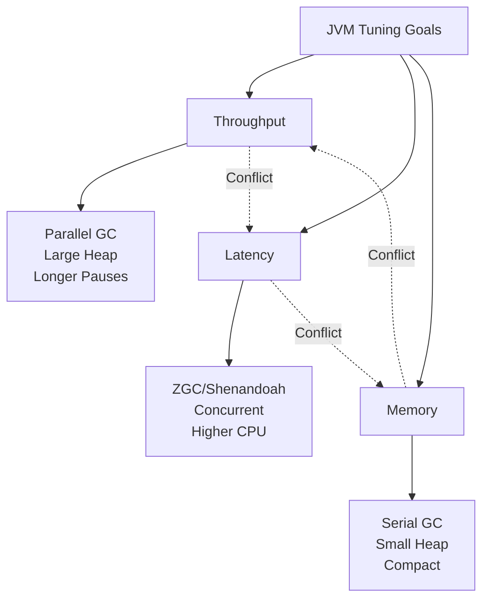

# 🔧 JVM Tuning: Tối Ưu Hóa Ứng Dụng Java Ở Trình Độ Senior

> **Tóm tắt:** Bài nghiên cứu này đi sâu vào cơ chế JVM memory management, các tham số tuning quan trọng, trade-offs giữa performance và stability, cùng với best practices và anti-patterns thường gặp trong production systems.

---

## 📋 Mục Lục

1. [Cơ Chế Tầng Thấp (Low-Level Mechanisms)](#1-cơ-chế-tầng-thấp-low-level-mechanisms)
2. [Các Tham Số Tuning Cốt Lõi](#2-các-tham-số-tuning-cốt-lõi)
3. [Giải Pháp & Công Cụ Chuẩn Công Nghiệp](#3-giải-pháp--công-cụ-chuẩn-công-nghiệp)
4. [Rủi Ro & Đánh Đổi (Trade-offs)](#4-rủi-ro--đánh-đổi-trade-offs)
5. [Anti-patterns & Lỗi Thường Gặp](#5-anti-patterns--lỗi-thường-gặp)
6. [Java 21+ Virtual Threads & Tuning Mới](#6-java-21-virtual-threads--tuning-mới)
7. [Demo & Kịch Bản Thực Tế](#7-demo--kịch-bản-thực-tế)

---

## 1. Cơ Chế Tầng Thấp (Low-Level Mechanisms)

### 1.1 Memory Layout trong JVM

```
┌─────────────────────────────────────────────────────────┐
│                    JVM Process Memory                    │
├─────────────────────────────────────────────────────────┤
│  ┌──────────────┐  ┌──────────────┐  ┌──────────────┐   │
│  │   Heap       │  │    Stack     │  │ Metaspace    │   │
│  │  (Objects)   │  │ (References) │  │(Class Meta)  │   │
│  │  -Xms/-Xmx   │  │  -Xss        │  │ -XX:Max...   │   │
│  └──────────────┘  └──────────────┘  └──────────────┘   │
│                                                         │
│  ┌──────────────┐  ┌──────────────┐                     │
│  │ Code Cache   │  │ Direct Buffers                      │
│  │ (JIT)        │  │ (Off-Heap)   │                     │
│  └──────────────┘  └──────────────┘                     │
└─────────────────────────────────────────────────────────┘
```

#### Tại sao cần tuning?

**Cơ chế cấp phát bộ nhớ:**
- **Heap Memory:** Sử dụng TLAB (Thread Local Allocation Buffer) để giảm contention giữa các threads. Mỗi thread có buffer riêng trong Eden space.
- **Metaspace:** Thay thế PermGen từ Java 8+, lưu class metadata trong native memory thay vì heap. Điều này loại bỏ `OutOfMemoryError: PermGen` nhưng tạo ra rủi ro mới với native memory exhaustion.
- **Direct Memory:** Sử dụng `ByteBuffer.allocateDirect()` cho I/O operations, bypass heap để giảm copy overhead nhưng không được GC quản lý trực tiếp.

### 1.2 Cơ Chế GC và Stop-The-World

| Collector | Algorithm | Stop-the-world | Use Case |
|-----------|-----------|----------------|----------|
| **G1 GC** | Region-based, mixed collections | Ngắn, predictable | Default Java 9+, heap > 6GB |
| **ZGC** | Concurrent, colored pointers | < 1ms | Latency-sensitive, heap > 100GB |
| **Shenandoah** | Concurrent evacuation | < 10ms | Latency-sensitive, balanced throughput |

> ⚠️ **Quan trọng:** `-Xms` và `-Xmx` nên được đặt bằng nhau để tránh dynamic heap resizing gây pause không cần thiết.

---

## 2. Các Tham Số Tuning Cốt Lõi

### 2.1 Heap Memory Parameters

```bash
# Cấu hình cơ bản cho production
java \
  -Xms4g -Xmx4g \                    # Heap size: cố định 4GB
  -XX:NewRatio=2 \                    # Old:Young = 2:1
  -XX:SurvivorRatio=8 \               # Eden:S0:S1 = 8:1:1
  -XX:+UseG1GC \                      # Sử dụng G1 Garbage Collector
  -XX:MaxGCPauseMillis=200 \          # Target pause 200ms
  -XX:InitiatingHeapOccupancyPercent=45 \
  -jar application.jar
```

#### Phân tích chi tiết:

| Tham số | Chức năng | Giá trị đề xuất | Rủi ro khi sai |
|---------|-----------|-----------------|----------------|
| `-Xms` | Initial heap size | = `-Xmx` | Dynamic resize gây pause |
| `-Xmx` | Maximum heap size | 70-80% RAM | OOM hoặc OS swapping |
| `-XX:NewRatio` | Old/Young ratio | 2 (Java 8+) | Premature promotion |
| `-XX:MaxMetaspaceSize` | Class metadata limit | 256m-512m | Metaspace OOM |
| `-Xss` | Thread stack size | 1m (default) | StackOverflow hoặc OOM |

### 2.2 G1 GC Tuning Parameters

```bash
# G1 GC advanced tuning cho latency-sensitive applications
java \
  -Xms8g -Xmx8g \
  -XX:+UseG1GC \
  -XX:MaxGCPauseMillis=100 \
  -XX:G1HeapRegionSize=16m \           # Region size: 1m-32m
  -XX:G1NewSizePercent=20 \            # Min young generation %
  -XX:G1MaxNewSizePercent=35 \          # Max young generation %
  -XX:G1ReservePercent=10 \             # Reserve for evacuation
  -XX:+G1UseAdaptiveIHOP \              # Adaptive IHOP
  -XX:InitiatingHeapOccupancyPercent=35 \
  -jar app.jar
```

> 📌 **Nguyên tắc vàng:** G1 GC phân chia heap thành các region (1-32MB). Region size ảnh hưởng đến:
> - Humongous objects allocation (> 50% region size)
> - Parallelism của collection cycles
> - Memory fragmentation

### 2.3 Metaspace & Direct Memory

```bash
# Giới hạn Metaspace để tránh memory leak từ dynamic class loading
-XX:MetaspaceSize=128m \
-XX:MaxMetaspaceSize=256m \
-XX:MinMetaspaceFreeRatio=40 \
-XX:MaxMetaspaceFreeRatio=70

# Direct Buffer Memory (NIO)
-XX:MaxDirectMemorySize=1g
```

**Tại sao MetaspaceSize ≠ MaxMetaspaceSize?**
- MetaspaceSize: Trigger full GC khi đạt ngưỡng để reclaim class metadata
- MaxMetaspaceSize: Hard limit để tránh unbounded growth
- Nếu không set MaxMetaspaceSize → Risk: Native memory exhaustion

---

## 3. Giải Pháp & Công Cụ Chuẩn Công Nghiệp

### 3.1 Monitoring & Profiling Tools

| Tool | Purpose | Best For |
|------|---------|----------|
| **JConsole** | JMX monitoring | Basic heap/thread monitoring |
| **VisualVM** | Heap dump, CPU profiling | Development & debugging |
| **JProfiler** | Comprehensive profiling | Production deep analysis |
| **async-profiler** | Low overhead sampling | Production safe profiling |
| **Prometheus + JMX Exporter** | Time-series metrics | Kubernetes/Docker environments |
| **GCeasy** | GC log analysis | Automated GC optimization suggestions |

### 3.2 GC Log Configuration (Java 17+)

```bash
# Unified GC logging (Java 9+)
-Xlog:gc*:file=/var/log/app/gc.log:time,uptime,level,tags:filecount=10,filesize=100m

# Hoặc chi tiết hơn cho tuning
-Xlog:gc+heap=trace,gc+ergo=debug,gc+phases=debug:file=gc-detailed.log
```

### 3.3 Container-aware Tuning (Docker/K8s)

```bash
# Java 17+ container support (Cgroup-aware)
-XX:+UseContainerSupport \
-XX:MaxRAMPercentage=75.0 \
-XX:InitialRAMPercentage=50.0

# Trước Java 10 (không tự động nhận container limits)
-XX:+UnlockExperimentalVMOptions \
-XX:+UseCGroupMemoryLimitForHeap \
-XX:MaxRAMFraction=2
```

> ⚠️ **Pitfall cổ điển:** Java 8 không nhận Docker memory limits → JVM nhận toàn bộ host RAM làm `-Xmx` default → Container bị kill bởi OOM killer.

---

## 4. Rủi Ro & Đánh Đổi (Trade-offs)

### 4.1 Throughput vs Latency vs Memory Footprint



### 4.2 Phân tích Trade-offs

| Scenario | Recommendation | Lý do |
|----------|---------------|-------|
| **Microservices (small heap)** | Serial GC hoặc G1 với small heap | Low overhead, fast startup |
| **Batch processing** | Parallel GC | Max throughput, latency không quan trọng |
| **Web services (p99 latency)** | ZGC hoặc Shenandoah | < 10ms pauses |
| **Big Data (Spark/Flink)** | G1 GC với large region size | Balance throughput và latency |

### 4.3 Memory Pressure Analysis

**Khi nào nên tăng heap?**
- GC frequency > 1 lần/phút
- Promotion rate cao (Old gen tăng nhanh)
- Allocation rate > 1GB/giây

**Khi nào nên giảm heap?**
- System đang swap (thrashing)
- RSS memory >> committed heap
- Không có memory pressure nhưng GC overhead thấp (< 1%)

---

## 5. Anti-patterns & Lỗi Thường Gặp

### 5.1 ❌ Sai lầm phổ biến

| Anti-pattern | Tác hại | Giải pháp |
|--------------|---------|-----------|
| `-Xms` ≠ `-Xmx` | Heap resize pauses, memory fragmentation | Luôn set bằng nhau |
| Quá lớn heap không cần thiết | Long GC pauses, hidden memory leaks | Size theo thực tế usage |
| `-XX:+DisableExplicitGC` | System.gc() bị ignore → Direct memory không được clean | Cẩn thận với NIO/direct buffers |
| Thiếu GC logging | Khó diagnose production issues | Luôn bật GC logging |
| Bỏ qua Metaspace limit | Native OOM, khó debug | Set MaxMetaspaceSize |

### 5.2 Memory Leak Scenarios

```java
// ❌ ANTI-PATTERN: Static collections holding references
public class Cache {
    private static final Map<String, Object> GLOBAL_CACHE = new HashMap<>();
    // Không bao giờ được clear → OOM
}

// ✅ BEST PRACTICE: SoftReference hoặc WeakReference
public class ProperCache {
    private static final Map<String, SoftReference<Object>> CACHE = new ConcurrentHashMap<>();
    
    public Object get(String key) {
        SoftReference<Object> ref = CACHE.get(key);
        return ref != null ? ref.get() : null; // GC có thể reclaim
    }
}
```

### 5.3 Thread Stack Sizing

```bash
# ❌ Quá lớn → Waste memory (1000 threads × 2MB = 2GB!)
-Xss2m

# ❌ Quá nhỏ → StackOverflowError với deep recursion
-Xss128k

# ✅ Mặc định thường ổn (1MB), chỉ điều chỉnh khi cần
-Xss1m
```

---

## 6. Java 21+ Virtual Threads & Tuning Mới

### 6.1 Virtual Threads (Project Loom)

```java
// Java 21+ - Virtual threads không sử dụng OS threads
ExecutorService executor = Executors.newVirtualThreadPerTaskExecutor();
```

**Tác động đến JVM Tuning:**

| Aspect | Traditional Threads | Virtual Threads |
|--------|-------------------|----------------|
| Stack size | `-Xss` (1MB default) | ~KB range, automatically managed |
| Thread count | Limited by OS (~10K) | Millions possible |
| Memory per thread | ~1MB + | ~KB |
| Pinning issue | N/A | Cần tránh synchronized blocks |

### 6.2 ZGC Improvements (Java 21)

```bash
# Java 21: ZGC supports generational collection (experimental)
-XX:+UseZGC \
-XX:+ZGenerational \
-XX:ZCollectionInterval=5
```

**Generational ZGC:**
- Young objects collected more frequently
- Reduced memory footprint
- Better throughput while maintaining low latency

### 6.3 String Deduplication (G1)

```bash
# Tự động dedup strings trong heap
-XX:+UseStringDeduplication

# Hiệu quả nhất khi ứng dụng có nhiều duplicate strings
# (JSON parsing, log messages, etc.)
```

---

## 7. Demo & Kịch Bản Thực Tế

### 7.1 Tạo Memory Pressure Test

```java
// MemoryPressureTest.java
import java.util.*;
import java.util.concurrent.*;

public class MemoryPressureTest {
    private static final List<byte[]> MEMORY_HOG = new ArrayList<>();
    private static final ExecutorService EXECUTOR = Executors.newFixedThreadPool(100);
    
    public static void main(String[] args) throws Exception {
        System.out.println("Starting memory pressure test...");
        System.out.println("Max Heap: " + Runtime.getRuntime().maxMemory() / 1024 / 1024 + " MB");
        
        // Simulate allocation patterns
        for (int i = 0; i < 1000; i++) {
            final int iteration = i;
            EXECUTOR.submit(() -> {
                // Allocate 1MB per task
                byte[] data = new byte[1024 * 1024];
                Arrays.fill(data, (byte) iteration);
                
                // Keep 10% in memory to simulate cache
                if (iteration % 10 == 0) {
                    synchronized (MEMORY_HOG) {
                        MEMORY_HOG.add(data);
                    }
                }
                
                // Simulate work
                try {
                    Thread.sleep(100);
                } catch (InterruptedException e) {
                    Thread.currentThread().interrupt();
                }
            });
        }
        
        EXECUTOR.shutdown();
        EXECUTOR.awaitTermination(5, TimeUnit.MINUTES);
        
        System.out.println("Test completed. Objects in 'cache': " + MEMORY_HOG.size());
    }
}
```

### 7.2 Run với Different GC Collectors

```bash
# Build
javac MemoryPressureTest.java
jar cvfe memory-test.jar MemoryPressureTest MemoryPressureTest.class

# Test 1: G1 GC (default)
java -Xms512m -Xmx512m -XX:+UseG1GC -Xlog:gc:gc-g1.log -jar memory-test.jar

# Test 2: ZGC
java -Xms512m -Xmx512m -XX:+UseZGC -Xlog:gc:gc-zgc.log -jar memory-test.jar

# Test 3: Serial GC (single-threaded)
java -Xms512m -Xmx512m -XX:+UseSerialGC -Xlog:gc:gc-serial.log -jar memory-test.jar

# Analyze results
grep "Pause" gc-*.log | awk '{print $1, $3}'
```

### 7.3 Metaspace Leak Simulation

```java
// MetaspaceLeakDemo.java
import java.net.*;
import java.io.*;

public class MetaspaceLeakDemo {
    public static void main(String[] args) throws Exception {
        System.out.println("Simulating metaspace pressure...");
        
        for (int i = 0; i < 100000; i++) {
            // Dynamic class loading tạo ra nhiều class metadata
            URLClassLoader classLoader = new URLClassLoader(
                new URL[] { new File(".").toURI().toURL() },
                MetaspaceLeakDemo.class.getClassLoader()
            );
            
            try {
                Class<?> clazz = classLoader.loadClass("MemoryPressureTest");
                Object instance = clazz.getDeclaredConstructor().newInstance();
            } catch (Exception e) {
                // Expected for classes without default constructor
            }
            
            // ClassLoader không được close → Class metadata tích lũy trong Metaspace
            // classLoader.close(); // ❌ Missing!
            
            if (i % 1000 == 0) {
                System.out.println("Loaded " + i + " classes...");
            }
        }
    }
}
```

**Run với Metaspace limits:**

```bash
# Giới hạn Metaspace để trigger OOM nhanh
java -XX:MaxMetaspaceSize=64m -Xlog:gc+metaspace -cp . MetaspaceLeakDemo

# Fixed version với try-with-resources
java -XX:MaxMetaspaceSize=64m -cp . MetaspaceLeakDemoFixed
```

### 7.4 Production JVM Options Template

```bash
#!/bin/bash
# production-jvm-opts.sh - Template cho production deployment

APP_NAME="my-application"
HEAP_SIZE="4g"
GC_LOG_DIR="/var/log/${APP_NAME}"

JAVA_OPTS=""
# Memory
JAVA_OPTS="${JAVA_OPTS} -Xms${HEAP_SIZE} -Xmx${HEAP_SIZE}"
JAVA_OPTS="${JAVA_OPTS} -XX:MetaspaceSize=128m -XX:MaxMetaspaceSize=256m"
JAVA_OPTS="${JAVA_OPTS} -XX:MaxDirectMemorySize=1g"

# GC Configuration
JAVA_OPTS="${JAVA_OPTS} -XX:+UseG1GC"
JAVA_OPTS="${JAVA_OPTS} -XX:MaxGCPauseMillis=200"
JAVA_OPTS="${JAVA_OPTS} -XX:+UseStringDeduplication"

# GC Logging
JAVA_OPTS="${JAVA_OPTS} -Xlog:gc*:file=${GC_LOG_DIR}/gc.log:time,uptime:filecount=10,filesize=100m"

# Heap Dump on OOM
JAVA_OPTS="${JAVA_OPTS} -XX:+HeapDumpOnOutOfMemoryError"
JAVA_OPTS="${JAVA_OPTS} -XX:HeapDumpPath=${GC_LOG_DIR}/heap-dump.hprof"

# Error handling
JAVA_OPTS="${JAVA_OPTS} -XX:+ExitOnOutOfMemoryError"
JAVA_OPTS="${JAVA_OPTS} -XX:+CrashOnOutOfMemoryError"

# Container awareness
JAVA_OPTS="${JAVA_OPTS} -XX:+UseContainerSupport"
JAVA_OPTS="${JAVA_OPTS} -XX:MaxRAMPercentage=75.0"

echo "JVM Options: ${JAVA_OPTS}"
exec java ${JAVA_OPTS} -jar "${APP_NAME}.jar"
```

---

## 📊 Summary & Checklist

### Pre-deployment Checklist

- [ ] `-Xms` = `-Xmx` (fixed heap size)
- [ ] Metaspace limits được set
- [ ] GC logging enabled
- [ ] Heap dump on OOM enabled
- [ ] Container limits được respect (Java 17+ hoặc flags tương thích)
- [ ] GC collector phù hợp với latency requirements
- [ ] GC logs được monitor và analyze định kỳ

### Key Metrics to Monitor

| Metric | Healthy Threshold | Action khi vượt ngưỡng |
|--------|-------------------|------------------------|
| GC Overhead | < 5% của CPU time | Tune GC hoặc tăng heap |
| GC Pause Time | < 200ms (p99) | Chuyển sang ZGC/Shenandoah |
| Heap Usage | < 70% sau full GC | Tăng heap hoặc fix memory leak |
| Metaspace Usage | < 80% của Max | Tăng limit hoặc fix class leak |

---

## 📚 References

1. [Oracle JVM Tuning Guide](https://docs.oracle.com/en/java/javase/21/gctuning/)
2. [G1 GC: From Garbage First to Low Latency](https://blogs.oracle.com/javamagazine/post/g1gc-from-garbage-first-to-low-latency)
3. [ZGC: A Scalable Low-Latency Garbage Collector](https://openjdk.org/projects/zgc/)
4. [Java Performance: The Definitive Guide](https://www.oreilly.com/library/view/java-performance-the/9781449363512/)

---

*Document version: 1.0 | Java Version: 17-21+ | Last updated: 2026-03-26*
