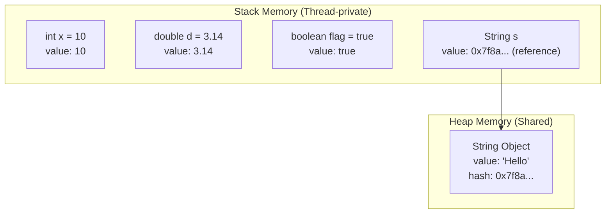

# 1.2.4 Biến và Kiểu Dữ Liệu: Primitive vs Reference Types

> **Senior Insight:** Hiểu sâu sự khác biệt giữa Primitive và Reference types là nền tảng để tối ưu memory, debug hiệu quả, và tránh các lỗi subtle như `==` vs `.equals()` hay NullPointerException.

---

## 1. Bản Chất: Cơ Chế Tầng Thấp

### 1.1 Stack vs Heap - Nơi Lưu Trữ Quyết Định Tất Cả



| Đặc điểm | Primitive Types | Reference Types |
|----------|-----------------|-----------------|
| **Nơi lưu trữ** | Stack (trực tiếp) | Heap (object), Stack (reference) |
| **Kích thước** | Fixed (1-8 bytes) | Variable (object header + data) |
| **Default value** | 0, false, '\u0000' | null |
| **So sánh `==`** | So sánh giá trị | So sánh địa chỉ memory |
| **Nullability** | Không thể null | Có thể null |
| **Performance** | Nhanh (truy cập trực tiếp) | Chậm hơn (dereference) |

### 1.2 Bộ Nhớ Chi Tiết

**Primitive trên Stack:**
```java
// 4 biến primitive = 4 vùng nhớ liên tiếp trên Stack
int a = 100;        // 4 bytes
long b = 1000L;     // 8 bytes  
double c = 3.14;    // 8 bytes
boolean d = true;   // 1 byte (thực tế JVM align thành 4 bytes)
// Tổng: ~25 bytes, truy cập O(1)
```

**Reference trên Heap:**
```java
// String là reference type
String s = "Hello"; // Stack: 8 bytes (reference)
                    // Heap: 24+ bytes (object header + char[] + hash)
                    // Total: ~40+ bytes

// Object header (mark word + klass pointer):
// - 64-bit JVM: 12-16 bytes (compressed oops)
// - 64-bit JVM (no compression): 16 bytes
```

> **⚠️ Senior Warning:** Một `int` primitive chỉ tốn 4 bytes. Nhưng `Integer` object tốn **16 bytes** (12 header + 4 value + padding). Dùng `Integer` trong collection có thể tăng memory gấp **4 lần** so với primitive array.

---

## 2. Wrapper Classes & Autoboxing

### 2.1 Integer Cache - Cơ Chế Tối Ưu Bí Ẩn

```java
Integer a = 127;    // Autoboxing: Integer.valueOf(127)
Integer b = 127;
System.out.println(a == b);     // true (cùng object từ cache)

Integer c = 128;
Integer d = 128;
System.out.println(c == d);     // false (object khác nhau!)
```

**Giải thích JVM:**
```java
// Integer.valueOf() implementation:
public static Integer valueOf(int i) {
    if (i >= IntegerCache.low && i <= IntegerCache.high)
        return IntegerCache.cache[i + (-IntegerCache.low)];
    return new Integer(i);
}

// Mặc định: cache từ -128 đến 127
// Có thể điều chỉnh: -XX:AutoBoxCacheMax=<size>
```

| Type | Cache Range |
|------|-------------|
| `Byte` | -128 đến 127 (tất cả) |
| `Short` | -128 đến 127 |
| `Integer` | -128 đến 127 (có thể mở rộng) |
| `Long` | -128 đến 127 |
| `Character` | 0 đến 127 |
| `Boolean` | TRUE, FALSE |
| `Float`, `Double` | Không cache |

### 2.2 Autoboxing/Unboxing Cost

```java
// Anti-pattern: Hidden autoboxing trong loop
long sum = 0L;
for (Integer i = 0; i < 1000000; i++) {  // ⚠️ Autoboxing mỗi iteration!
    sum += i;  // Unboxing: i.intValue()
}
// Performance hit: ~3-4x slower so với primitive
```

**Benchmark (JMH):**
```
Benchmark                    Mode  Cnt   Score   Error  Units
PrimitiveLoop.sum            avgt   25   0.352 ± 0.012  ms/op
BoxedLoop.sum                avgt   25   1.247 ± 0.045  ms/op  ⚠️ 3.5x slower
```

---

## 3. Rủi Ro & Anti-patterns

### 3.1 So Sánh `==` vs `.equals()`

```java
String s1 = new String("hello");
String s2 = new String("hello");

System.out.println(s1 == s2);      // false (khác địa chỉ heap)
System.out.println(s1.equals(s2)); // true (cùng nội dung)

// String Literal Pool - Optimization
String s3 = "hello";  // Interned string
String s4 = "hello";
System.out.println(s3 == s4);      // true (cùng object trong pool)
```

**String Interning:**
```java
// Tối ưu memory khi có nhiều String giống nhau
String configKey = "database.connection.url".intern();
// String pool nằm trong PermGen (Java <7) hoặc Heap (Java 7+)
```

### 3.2 NullPointerException (NPE) Risks

```java
// Primitive không bao giờ null
int x = null;  // ❌ Compile error

// Reference có thể null
Integer y = null;
int z = y;     // ❌ Runtime: NullPointerException (unboxing)
```

### 3.3 Collection Generics & Primitives

```java
// ❌ Không thể dùng primitive trong generics
List<int> numbers;  // Compile error!

// ✅ Phải dùng wrapper
List<Integer> numbers = new ArrayList<>();
numbers.add(42);  // Autoboxing: Integer.valueOf(42)

// Java 8+ Stream: Boxed cost ẩn
int sum = IntStream.range(0, 1000000)  // IntStream - primitive
                   .sum();             // No boxing!

// ❌ Tránh:
int sum = Stream.iterate(0, i -> i + 1)  // Stream<Integer> - boxed!
                .limit(1000000)
                .mapToInt(Integer::intValue)  // Phải unbox
                .sum();
```

---

## 4. Java 21+ Features

### 4.1 Primitive Types in Patterns (Preview Java 21, Standard Java 23+)

```java
// Pattern matching với primitive - Java 23+
switch (obj) {
    case int i -> System.out.println("Integer: " + i);
    case double d -> System.out.println("Double: " + d);
    case String s -> System.out.println("String: " + s);
    default -> System.out.println("Other");
}
```

### 4.2 Value Classes (Java 23+ Preview)

```java
// Value class - identity-free, memory efficient
value class Point {
    private final int x;
    private final int y;
    
    public Point(int x, int y) {
        this.x = x;
        this.y = y;
    }
}

// Value class không có identity:
// - Không dùng == (chỉ dùng equals)
// - Không synchronized
// - Memory layout tối ưu như primitive
```

### 4.3 Unnamed Patterns (Java 21+)

```java
// Khi không cần giá trị
record User(String name, int age) {}

switch (user) {
    case User(_, int age) when age >= 18 -> System.out.println("Adult");
    case User(_, _) -> System.out.println("Minor");
}
```

---

## 5. Best Practices & Recommendations

### 5.1 When to Use What

| Scenario | Recommendation | Lý do |
|----------|---------------|-------|
| Local variables, calculations | **Primitive** | Performance, memory |
| Collections (cần null) | **Wrapper** | Nullability, generics |
| DTOs/API responses | **Wrapper** | JSON serialization, null |
| Counters, indices | **Primitive** | Không cần null |
| Database entities | **Wrapper** | Nullable columns |
| Financial calculations | **BigDecimal** | Precision (không dùng float/double) |

### 5.2 Performance Checklist

```java
// ✅ Prefer primitive streams
long sum = LongStream.of(values).sum();

// ❌ Avoid boxed streams
long sum = Stream.of(values).mapToLong(Long::longValue).sum();

// ✅ Use specialized collections cho primitive
IntList fastList = new IntArrayList();  // Eclipse Collections
TIntIntMap fastMap = new TIntIntHashMap();  // Trove

// ❌ Tránh autoboxing trong hot paths
public void process(int value) {  // Primitive
    // ...
}
```

### 5.3 Modern Java Patterns

```java
// Optional với primitive (Java 8+)
OptionalInt maybeValue = OptionalInt.of(42);
int value = maybeValue.orElse(0);  // Không unboxing risk

// Null-safe operations
Integer input = getMaybeNull();
int result = input != null ? input : 0;
// Hoặc dùng Objects.requireNonNullElse
int result = Objects.requireNonNullElse(input, 0);
```

---

## 6. Demo: Memory & Performance Comparison

```java
import java.util.*;

public class PrimitiveVsReferenceDemo {
    
    public static void main(String[] args) {
        memoryComparison();
        performanceComparison();
        pitfallDemo();
    }
    
    static void memoryComparison() {
        Runtime runtime = Runtime.getRuntime();
        
        // Primitive array
        System.gc();
        long memBefore = runtime.totalMemory() - runtime.freeMemory();
        int[] primitiveArray = new int[1_000_000];
        long memAfter = runtime.totalMemory() - runtime.freeMemory();
        System.out.println("Primitive array (1M int): " + (memAfter - memBefore) / 1024 + " KB");
        // ~4 MB
        
        // Integer array (boxed)
        System.gc();
        memBefore = runtime.totalMemory() - runtime.freeMemory();
        Integer[] boxedArray = new Integer[1_000_000];
        for (int i = 0; i < 1_000_000; i++) {
            boxedArray[i] = i;  // Autoboxing
        }
        memAfter = runtime.totalMemory() - runtime.freeMemory();
        System.out.println("Boxed array (1M Integer): " + (memAfter - memBefore) / 1024 / 1024 + " MB");
        // ~16+ MB (4x memory!)
    }
    
    static void performanceComparison() {
        // Primitive sum
        long start = System.nanoTime();
        long sum = 0;
        for (int i = 0; i < 10_000_000; i++) {
            sum += i;
        }
        long primitiveTime = System.nanoTime() - start;
        
        // Boxed sum
        start = System.nanoTime();
        Long sumBoxed = 0L;
        for (Integer i = 0; i < 10_000_000; i++) {
            sumBoxed += i;  // Autoboxing + unboxing
        }
        long boxedTime = System.nanoTime() - start;
        
        System.out.println("Primitive: " + primitiveTime / 1_000_000 + " ms");
        System.out.println("Boxed: " + boxedTime / 1_000_000 + " ms");
        System.out.println("Overhead: " + (boxedTime * 100 / primitiveTime - 100) + "%");
    }
    
    static void pitfallDemo() {
        Integer a = 127;
        Integer b = 127;
        System.out.println("127 == 127: " + (a == b));  // true (cached)
        
        Integer c = 128;
        Integer d = 128;
        System.out.println("128 == 128: " + (c == d));  // false (not cached!)
        System.out.println("128.equals(128): " + c.equals(d));  // true
        
        // NullPointerException
        Integer nullInt = null;
        try {
            int x = nullInt;  // Unboxing null
        } catch (NullPointerException e) {
            System.out.println("NPE khi unboxing null!");
        }
    }
}
```

---

## 7. Tóm Tắt Cho Senior Developer

| Nguyên tắc | Giải thích |
|------------|-----------|
| **Stack vs Heap** | Primitive trên Stack (nhanh, thread-safe), Reference trên Heap (flexible, shared) |
| **Autoboxing cost** | ~3-4x performance hit, ~4x memory overhead trong collections |
| **Integer cache** | -128..127 được cache; `==` hoạt động bất ngờ trong range này |
| **NPE risk** | Unboxing null Integer/Long → NPE; primitive thì không bao giờ null |
| **Stream optimization** | Dùng `IntStream`, `LongStream` thay vì `Stream<Integer>` |
| **Java 21+** | Value classes, pattern matching primitives - tương lai của Java |

> **💡 Key Takeaway:** Dùng primitive cho performance-critical code. Dùng wrapper khi cần nullability hoặc generics. Hiểu autoboxing cost để tránh "death by a thousand allocations".

---

## References

1. [JLS 4.1 - The Kinds of Types and Values](https://docs.oracle.com/javase/specs/jls/se21/html/jls-4.html)
2. [JEP 402 - Classes for the Basic Primitives](https://openjdk.org/jeps/402)
3. [JEP 455 - Primitive Types in Patterns](https://openjdk.org/jeps/455)
4. [JMH - Java Microbenchmark Harness](https://openjdk.org/projects/code-tools/jmh/)
5. [Eclipse Collections - Primitive Collections](https://github.com/eclipse/eclipse-collections)
