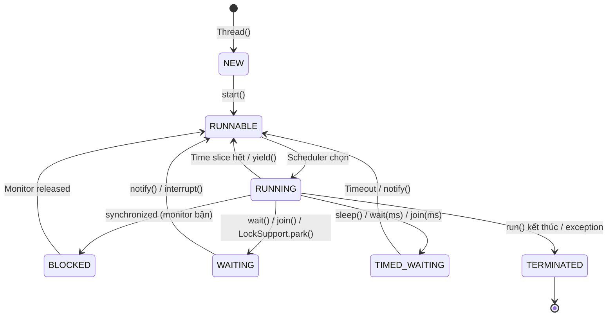
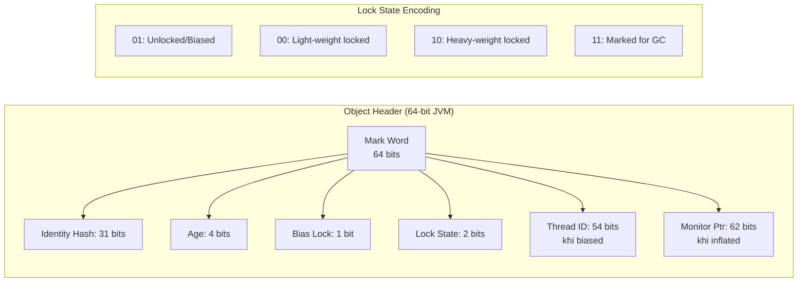
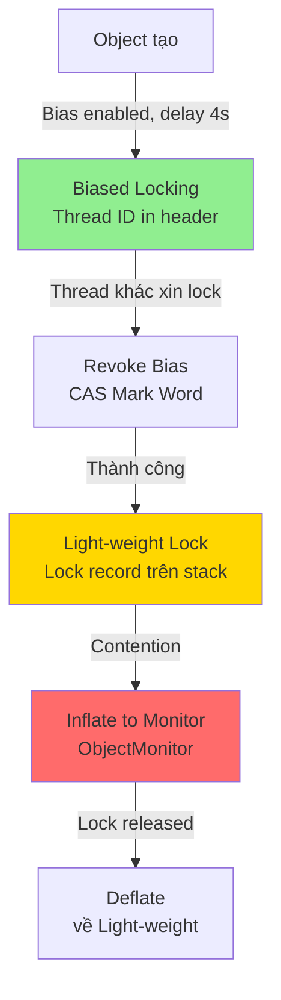
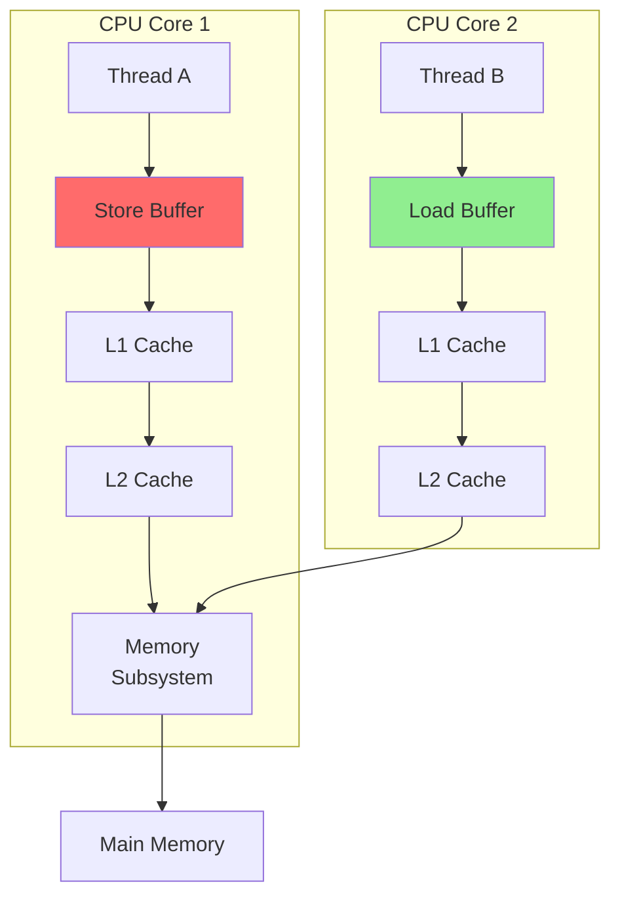
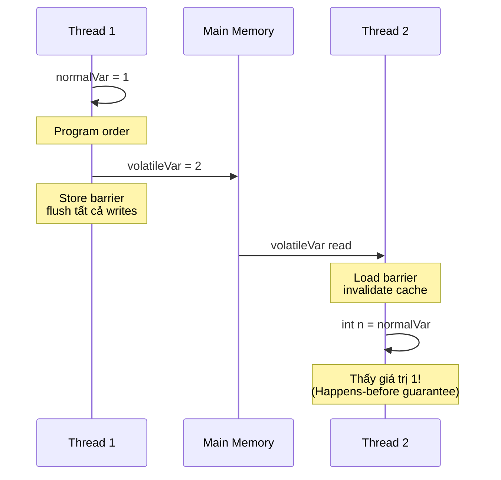
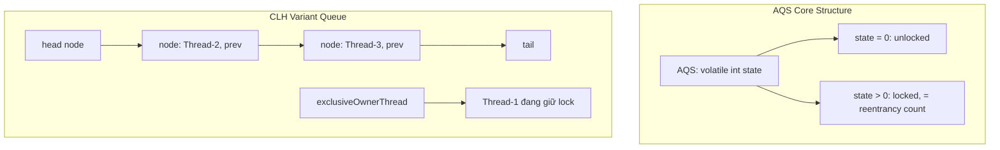
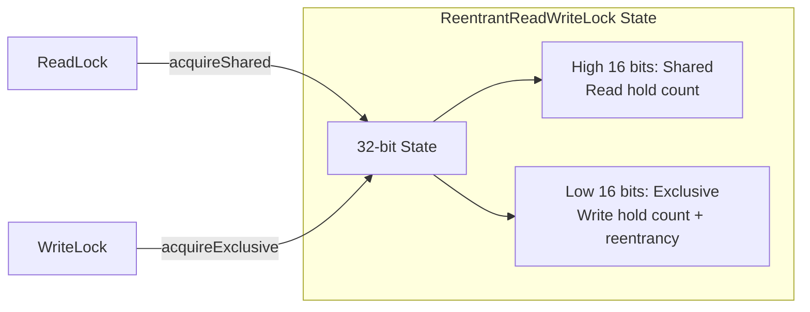

# 🔬 Thread Lifecycle & Synchronization: Sâu Tầng Thấp

> **Mức độ:** Senior Backend Architect | **Thờ gian đọc:** 35 phút | **Java Version:** 8 - 21+

---

## 1. Thread Lifecycle - Trạng Thái và Chuyển Đổi

### 1.1 Bản Chất Trạng Thái Thread



### 1.2 Chi Tiết Từng Trạng Thái

| Trạng thái | Thread.State | Ý nghĩa | Native OS State |
|------------|--------------|---------|-----------------|
| **NEW** | `NEW` | Thread object tạo, chưa `start()` | Không có OS thread |
| **RUNNABLE** | `RUNNABLE` | Sẵn sàng / đang chạy | `RUNNING` hoặc `READY` |
| **BLOCKED** | `BLOCKED` | Chờ monitor lock | `BLOCKED` (mutex contention) |
| **WAITING** | `WAITING` | Chờ notify/join vô hạn | `WAITING` |
| **TIMED_WAITING** | `TIMED_WAITING` | Chờ có timeout | `TIMED_WAITING` |
| **TERMINATED** | `TERMINATED**` | Hoàn thành | Thread destroyed |

> **🔑 Insight Senior:** `RUNNABLE` không đồng nghĩa với "đang chạy". Thread có thể đang chờ CPU (ready queue). Điều này quan trọng khi profile - `RUNNABLE` threads có thể là CPU bound hoặc thực sự idle.

### 1.3 Thread Dump Analysis

```bash
# Lấy thread dump
jstack <pid> > threaddump.txt
jcmd <pid> Thread.print

# Sample output analysis:
"http-nio-8080-exec-5" #27 daemon prio=5 os_prio=0 cpu=1234.56ms elapsed=120.45s tid=0x00007f12345678 nid=0x1234 waiting for monitor entry [0x00007f1234567000]
   java.lang.Thread.State: BLOCKED (on object monitor)
        at com.example.Service.process(Service.java:42)
        - waiting to lock <0x000000076b5c7d58> (a com.example.Resource)
        - locked <0x000000076b5c7d68> (a java.util.ArrayList)
```

**Giải mã thread dump:**
- `daemon`: Background thread (không chặn JVM exit)
- `prio=5`: Java priority (1-10, mặc định 5)
- `cpu=1234.56ms`: CPU time consumed
- `nid=0x1234`: Native thread ID (hex)
- `waiting for monitor entry`: BLOCKED on synchronized
- `waiting on condition`: WAITING/TIMED_WAITING (LockSupport, Object.wait)

---

## 2. Synchronized - Monitor Lock Tầng Thấp

### 2.1 Object Header và Mark Word



```java
// Object header layout (OpenJDK HotSpot)
// 64-bit JVM với CompressedOops:
// | Mark Word (64 bits) | Klass Pointer (32 bits) | Array Length (32 bits, nếu array) |

// Để xem object header (cần JVM flags)
// -XX:+UnlockDiagnosticVMOptions -XX:+PrintBiasedLockingStatistics
```

### 2.2 Lock Escalation - Từ Bias Đến Heavy



### 2.3 Biased Locking (Java 8-17) - Đã Bị Loại Bỏ

```java
// ⚠️ Java 18+: Biased locking deprecated, Java 20: Removed
// Lý do: Contention costs > benefits trong modern workloads

// Tắt biased locking (Java 8-17 nếu cần)
// -XX:-UseBiasedLocking

// Java 18+ mặc định tắt
// Java 20+: Flag bị xóa hoàn toàn
```

> **🔑 Senior Note:** Biased locking tốt cho single-thread access patterns (collections synchronized nhưng chỉ 1 thread dùng), nhưng gây overhead khi revoke. Java 20+ loại bỏ vì uncontended synchronized đã rất nhanh nhờ JIT optimizations.

### 2.4 Thin vs Thick Lock Implementation

```java
// Light-weight (Thin) Lock:
// - Lock record trên stack của owning thread
// - Mark Word trỏ đến lock record ( displaced mark word )
// - CAS operation khi acquire/release

public class ThinLockDemo {
    private final Object lock = new Object();
    
    public void method() {
        // JIT compile thành:
        // 1. CAS Mark Word với lock record address
        // 2. Nếu thất bại → slow path (inflate hoặc spin)
        synchronized (lock) {
            // critical section
        }
        // 3. Restore displaced Mark Word
    }
}

// Heavy-weight (Thick/Inflated) Lock:
// - ObjectMonitor (C++ struct) được tạo
// - WaitSet (threads WAITING) + EntryList (threads BLOCKED)
// - _owner pointer đến thread đang giữ lock
// - OS-level mutex + condition variable
```

### 2.5 Synchronized Method vs Block

```java
public class SynchronizedComparison {
    private final Object lock = new Object();
    private int counter;
    
    // Synchronized method: lock trên instance (this)
    // ACC_SYNCHRONIZED flag trong method info
    public synchronized void increment() {
        counter++;
    }
    
    // Tương đương bytecode:
    // monitorenter this
    // ... method body ...
    // monitorexit this
    // monitorexit this  // duplicate cho exception path
    
    // Synchronized block: explicit lock object
    // monitorenter/monitorexit instructions
    public void incrementBlock() {
        synchronized (lock) {
            counter++;
        }
    }
    
    // Static synchronized: lock trên Class object
    public static synchronized void staticMethod() {
        // lock = SynchronizedComparison.class
    }
}
```

### 2.6 Performance Characteristics

| Scenario | Latency | Throughput | Notes |
|----------|---------|------------|-------|
| Uncontended | ~10-20ns | Cao | JIT optimized, no kernel call |
| Contended (few threads) | ~100ns-1μs | Trung bình | Spin + adaptive spinning |
| Contended (many threads) | ~10-100μs+ | Thấp | Park/unpark, context switch |
| Heavy contention | ~ms | Rất thấp | OS scheduling, priority inversion |

---

## 3. Volatile - Memory Visibility và Happens-Before

### 3.1 Bản Chất Memory Barrier



```java
// Memory barriers được inject bởi JVM:
// - LoadLoad: đảm bảo thứ tự đọc
// - StoreStore: đảm bảo thứ tự ghi  
// - LoadStore: đọc trước khi ghi
// - StoreLoad: ghi trước khi đọc (đắt nhất)

public class VolatileMemoryBarriers {
    private volatile int volatileVar;
    private int normalVar;
    
    public void writer() {
        normalVar = 1;        // StoreStore barrier sau đây
        volatileVar = 2;      // StoreLoad barrier ở đây
    }
    
    public void reader() {
        int v = volatileVar;  // LoadLoad + LoadStore barriers
        int n = normalVar;    // Đảm bảo thấy giá trị 1 (nếu writer xong)
    }
}
```

### 3.2 Happens-Before Relationship



### 3.3 Volatile không phải Atomic

```java
// ❌ ANTI-PATTERN: Volatile không đảm bảo atomic compound ops
public class VolatileNotAtomic {
    private volatile int counter = 0;
    
    public void increment() {
        counter++; // READ-WRITE không atomic!
        // Bytecode: getfield, iconst_1, iadd, putfield
        // Race condition giữa read và write
    }
}

// ✅ SOLUTIONS:
// 1. Synchronized (nếu cần mutual exclusion)
// 2. AtomicInteger (lock-free CAS)
// 3. LongAdder (Java 8+, high throughput)

import java.util.concurrent.atomic.AtomicInteger;
import java.util.concurrent.atomic.LongAdder;

public class CorrectVolatile {
    private final AtomicInteger counter = new AtomicInteger(0);
    private final LongAdder highContentionCounter = new LongAdder();
    
    public void atomicIncrement() {
        counter.incrementAndGet(); // CAS loop
    }
    
    public void adderIncrement() {
        highContentionCounter.increment(); // Striped counters
    }
}
```

### 3.4 Double-Checked Locking - Pattern Phức Tạp

```java
// ❌ ANTI-PATTERN (trước Java 5): Broken DCL
public class BrokenDCL {
    private static Singleton instance;
    
    public static Singleton getInstance() {
        if (instance == null) {              // Check 1
            synchronized (Singleton.class) {
                if (instance == null) {      // Check 2
                    instance = new Singleton(); // ❌ RACE!
                }
            }
        }
        return instance;
    }
}
// Vấn đề: Instruction reordering có thể publish reference
// trước khi constructor hoàn thành

// ✅ CORRECT DCL (Java 5+):
public class CorrectDCL {
    private static volatile Singleton instance;
    
    public static Singleton getInstance() {
        Singleton result = instance; // Local var optimization
        if (result == null) {
            synchronized (CorrectDCL.class) {
                result = instance;
                if (result == null) {
                    instance = result = new Singleton();
                }
            }
        }
        return result;
    }
}

// ✅ BETTER: Initialization-on-demand holder
public class BestSingleton {
    private BestSingleton() {}
    
    private static class Holder {
        static final BestSingleton INSTANCE = new BestSingleton();
    }
    
    public static BestSingleton getInstance() {
        return Holder.INSTANCE; // Class loading = synchronization
    }
}
```

---

## 4. ReentrantLock - AQS và Flexible Locking

### 4.1 AbstractQueuedSynchronizer (AQS) Architecture



```java
// AQS internal (simplified)
public abstract class AbstractQueuedSynchronizer {
    private volatile int state;           // Lock state
    private transient volatile Node head; // Dummy head
    private transient volatile Node tail;
    private transient Thread exclusiveOwnerThread;
    
    static final class Node {
        volatile int waitStatus;
        volatile Node prev;
        volatile Node next;
        volatile Thread thread;
        // CANCELLED = 1, SIGNAL = -1, CONDITION = -2, PROPAGATE = -3
    }
}
```

### 4.2 ReentrantLock Implementation Deep Dive

```java
import java.util.concurrent.locks.ReentrantLock;
import java.util.concurrent.locks.Lock;
import java.util.concurrent.TimeUnit;

public class ReentrantLockDeepDive {
    // Non-fair lock (mặc định): throughput cao hơn
    private final Lock nonFairLock = new ReentrantLock();
    
    // Fair lock: thứ tự FIFO, giảm starvation
    private final Lock fairLock = new ReentrantLock(true);
    
    public void demonstrateLock() {
        // Non-fair path:
        // 1. Try acquire (CAS state 0→1)
        // 2. Nếu thất bại → check if owner = current thread (reentrancy)
        // 3. Nếu vẫn fail → acquireQueued (park/unpark)
        
        nonFairLock.lock();
        try {
            // Critical section
        } finally {
            nonFairLock.unlock(); // Phải unlock!
        }
    }
    
    // Advanced features không có trong synchronized
    public void advancedLocking() throws InterruptedException {
        // 1. Try-lock với timeout
        if (nonFairLock.tryLock(100, TimeUnit.MILLISECONDS)) {
            try {
                // làm việc
            } finally {
                nonFairLock.unlock();
            }
        } else {
            // Handle cannot acquire lock
        }
        
        // 2. Interruptible lock acquisition
        try {
            nonFairLock.lockInterruptibly();
            // Nếu thread bị interrupt trong khi chờ → InterruptedException
        } finally {
            if (Thread.interrupted()) {
                Thread.currentThread().interrupt(); // preserve
            }
        }
        
        // 3. Query lock state
        ReentrantLock rl = (ReentrantLock) nonFairLock;
        boolean locked = rl.isLocked();
        boolean heldByCurrent = rl.isHeldByCurrentThread();
        int holdCount = rl.getHoldCount(); // reentrancy depth
    }
}
```

### 4.3 Fair vs Non-Fair Lock

```java
import java.util.concurrent.locks.ReentrantLock;
import java.util.concurrent.CountDownLatch;

public class FairnessComparison {
    
    public static void main(String[] args) throws Exception {
        testLock(new ReentrantLock(false), "Non-Fair");
        testLock(new ReentrantLock(true), "Fair");
    }
    
    static void testLock(ReentrantLock lock, String name) throws Exception {
        int threads = 5;
        int iterations = 100000;
        CountDownLatch latch = new CountDownLatch(threads);
        long[] acquireTimes = new long[threads];
        
        for (int i = 0; i < threads; i++) {
            final int idx = i;
            new Thread(() -> {
                long totalWait = 0;
                for (int j = 0; j < iterations; j++) {
                    long start = System.nanoTime();
                    lock.lock();
                    long acquired = System.nanoTime();
                    totalWait += (acquired - start);
                    
                    // Minimal work
                    Thread.yield();
                    
                    lock.unlock();
                }
                acquireTimes[idx] = totalWait / iterations;
                latch.countDown();
            }).start();
        }
        
        latch.await();
        
        long avgWait = 0;
        for (long t : acquireTimes) avgWait += t;
        avgWait /= threads;
        
        System.out.printf("%s: Avg wait time = %d ns%n", name, avgWait);
        // Non-Fair: ~50-100ns (barging allowed)
        // Fair: ~200-500ns (queue traversal)
    }
}
```

| Đặc điểm | Non-Fair Lock | Fair Lock |
|----------|---------------|-----------|
| **Throughput** | Cao hơn (~30%) | Thấp hơn |
| **Latency** | Thấp hơn | Cao hơn |
| **Starvation** | Có thể xảy ra | Ngăn chặn |
| **Use case** | General purpose | Predictable latency |

> **🔑 Senior Recommendation:** Mặc định dùng non-fair. Chỉ chuyển fair khi có measured starvation issues.

### 4.4 Condition Variables - Thay Thế wait/notify

```java
import java.util.concurrent.locks.ReentrantLock;
import java.util.concurrent.locks.Condition;
import java.util.LinkedList;

public class ConditionVariableDemo {
    private final ReentrantLock lock = new ReentrantLock();
    private final Condition notFull = lock.newCondition();
    private final Condition notEmpty = lock.newCondition();
    private final LinkedList<Integer> buffer = new LinkedList<>();
    private final int capacity = 10;
    
    // Multiple conditions = multiple wait-sets
    // vs synchronized: chỉ có 1 wait-set per object
    
    public void produce(int value) throws InterruptedException {
        lock.lock();
        try {
            while (buffer.size() == capacity) {
                notFull.await(); // Giải phóng lock, chờ signal
            }
            buffer.add(value);
            notEmpty.signal(); // Chỉ đánh thức consumer
        } finally {
            lock.unlock();
        }
    }
    
    public int consume() throws InterruptedException {
        lock.lock();
        try {
            while (buffer.isEmpty()) {
                notEmpty.await();
            }
            int value = buffer.remove();
            notFull.signal(); // Chỉ đánh thức producer
            return value;
        } finally {
            lock.unlock();
        }
    }
}

// So sánh với synchronized approach:
// synchronized: notify() đánh thức bất kỳ thread nào
// Condition: signal() có thể target cụ thể (notEmpty/notFull)
```

---

## 5. ReadWriteLock - Phân Tách Read/Write

### 5.1 Architecture và State Encoding



```java
import java.util.concurrent.locks.ReentrantReadWriteLock;
import java.util.concurrent.locks.ReadWriteLock;

public class ReadWriteLockInternals {
    private final ReadWriteLock rwLock = new ReentrantReadWriteLock();
    private final java.util.concurrent.locks.Lock readLock = rwLock.readLock();
    private final java.util.concurrent.locks.Lock writeLock = rwLock.writeLock();
    
    // State encoding (32-bit int):
    // bits 31-16: shared count (read locks held)
    // bits 15-0:  exclusive count (write locks held, includes reentrancy)
    // Special value: 0x0000_0001 = write lock held once
    //                0x0001_0000 = one read lock held
    
    private int data = 0;
    
    public int readData() {
        readLock.lock();
        try {
            return data; // Multiple threads có thể đọc đồng thời
        } finally {
            readLock.unlock();
        }
    }
    
    public void writeData(int value) {
        writeLock.lock();
        try {
            data = value; // Exclusive access
        } finally {
            writeLock.unlock();
        }
    }
}
```

### 5.2 Lock Downgrading - Pattern Quan Trọng

```java
import java.util.concurrent.locks.ReentrantReadWriteLock;

public class LockDowngrading {
    private final ReentrantReadWriteLock rwLock = new ReentrantReadWriteLock();
    private final ReentrantReadWriteLock.ReadLock readLock = rwLock.readLock();
    private final ReentrantReadWriteLock.WriteLock writeLock = rwLock.writeLock();
    
    private volatile int cacheValid;
    private int cachedData;
    
    // ✅ PATTERN: Write → Read downgrading
    public int processWithDowngrade(int newData) {
        writeLock.lock();
        try {
            // Modify data
            cachedData = newData;
            cacheValid = 1;
            
            // Downgrade: giữ readLock trước khi release writeLock
            // Đảm bảo không có writer nào chen vào
            readLock.lock();
            
        } finally {
            writeLock.unlock(); // Release write, vẫn giữ read
        }
        
        try {
            // Read-only operations sau khi modify
            return cachedData * 2;
        } finally {
            readLock.unlock();
        }
    }
    
    // ❌ ANTI-PATTERN: Read → Write upgrading
    public void wrongUpgrade() {
        readLock.lock();
        try {
            if (cacheValid == 0) {
                // ❌ DEADLOCK RISK!
                // Không thể acquire writeLock khi đang giữ readLock
                writeLock.lock(); // Block forever nếu không phải same thread
                // ...
            }
        } finally {
            readLock.unlock();
        }
    }
    
    // ✅ CORRECT: Release read before write
    public void correctUpgrade() {
        readLock.lock();
        int temp;
        try {
            temp = cachedData;
        } finally {
            readLock.unlock(); // Release trước
        }
        
        // Re-check sau khi release
        writeLock.lock();
        try {
            if (cacheValid == 0) {
                cachedData = computeExpensive();
                cacheValid = 1;
            }
        } finally {
            writeLock.unlock();
        }
    }
    
    private int computeExpensive() {
        return 42;
    }
}
```

### 5.3 StampedLock - Java 8+ Optimistic Reading

```java
import java.util.concurrent.locks.StampedLock;

public class StampedLockDemo {
    private final StampedLock lock = new StampedLock();
    private double x, y;
    
    // ✅ Optimistic reading: không block, validate sau
    public double distanceFromOrigin() {
        long stamp = lock.tryOptimisticRead(); // Không acquire lock
        double currentX = x;
        double currentY = y;
        
        // Validate không có writer nào modify trong khi đọc
        if (!lock.validate(stamp)) {
            // Có writer chen vào → fallback to read lock
            stamp = lock.readLock();
            try {
                currentX = x;
                currentY = y;
            } finally {
                lock.unlockRead(stamp);
            }
        }
        
        return Math.sqrt(currentX * currentX + currentY * currentY);
    }
    
    // Write với conversion
    public void move(double deltaX, double deltaY) {
        long stamp = lock.writeLock();
        try {
            x += deltaX;
            y += deltaY;
        } finally {
            lock.unlockWrite(stamp);
        }
    }
    
    // Try convert write to read
    public void modifyAndRead() {
        long stamp = lock.writeLock();
        try {
            x = 1.0;
            y = 2.0;
            
            // Convert write → read
            long readStamp = lock.tryConvertToReadLock(stamp);
            if (readStamp != 0L) {
                stamp = readStamp;
                // Vẫn giữ read lock
                System.out.println("x = " + x);
            }
        } finally {
            lock.unlock(stamp); // Unlock read hoặc write tùy state
        }
    }
}
```

| Lock Type | Use Case | Performance |
|-----------|----------|-------------|
| `ReentrantReadWriteLock` | Read-heavy, cần reentrancy | Tốt |
| `StampedLock` | Read-heavy, optimistic | Tốt nhất (read không block) |
| `StampedLock` | Write-heavy | Không tốt (optimistic failures) |

---

## 6. Java 21+: Virtual Threads và Synchronization

### 6.1 Virtual Thread và synchronized

```java
// ⚠️ Java 21: Virtual threads + synchronized = Carrier thread pinned

public class VirtualThreadPinning {
    
    public void demonstratePinning() {
        Thread.startVirtualThread(() -> {
            // synchronized block = PINNING!
            // Virtual thread bị "mounted" trên platform thread
            // Không unmount được cho đến khi release lock
            synchronized (this) {
                // Carrier thread blocked ở đây
                // Không thể chạy virtual threads khác
            }
        });
    }
    
    // ✅ SOLUTION: Dùng ReentrantLock thay vì synchronized
    private final java.util.concurrent.locks.Lock lock = 
        new java.util.concurrent.locks.ReentrantLock();
    
    public void virtualThreadFriendly() {
        Thread.startVirtualThread(() -> {
            lock.lock();
            try {
                // LockSupport.park() friendly
                // Virtual thread có thể unmount khi block
            } finally {
                lock.unlock();
            }
        });
    }
}
```

> **🔑 Java 21 Critical Insight:**
> - `synchronized` methods/blocks làm "pin" virtual thread xuống carrier thread
> - Thread pinning không phải bug, nhưng làm giảm scalability của virtual threads
> - JEP 491 (Target: JDK 24) sẽ fix pinning trong synchronized

### 6.2 Monitoring Pinning

```bash
# JVM flag để detect pinning
java -Djdk.tracePinnedThreads=full -jar app.jar

# Output khi pinning xảy ra:
# Thread[#23,ForkJoinPool-1-worker-3,5,CarrierThreads]
# java.lang.VirtualThread$VThreadContinuation onPinnedContinuing
#     at java.base/java.lang.VirtualThread.parkOnCarrierThread
#     at app//com.example.Service.process(Service.java:25)
#     at java.base/java.lang.VirtualThread.run
```

---

## 7. Anti-patterns và Best Practices

### ❌ Anti-patterns

```java
// 1. Holding lock trong I/O hoặc long operations
public class LockInIO {
    private synchronized void process() {
        // ❌ Lock held trong khi đọc file/network
        String data = httpClient.fetchData(); 
        database.save(data);
    }
}

// 2. Nested lock acquisition không có thứ tự (deadlock)
public class DeadlockRisk {
    private final Object lockA = new Object();
    private final Object lockB = new Object();
    
    public void method1() {
        synchronized (lockA) {
            synchronized (lockB) { // Risk!
                // ...
            }
        }
    }
    
    public void method2() {
        synchronized (lockB) {
            synchronized (lockA) { // DEADLOCK!
                // ...
            }
        }
    }
}

// 3. Locking trên mutable objects
public class WrongLockObject {
    private String lock = "LOCK";
    
    public void process() {
        synchronized (lock) { // ❌ lock có thể đổi reference!
            // ...
        }
    }
    
    public void changeLock() {
        lock = "NEW_LOCK"; // ❌ Threads khác lock trên object khác!
    }
}

// 4. Livelock: threads liên tục respond nhưng không tiến triển
public class LivelockExample {
    private boolean active = true;
    
    public synchronized void tryProcess() {
        while (active) {
            // Làm ít việc rồi yield
            Thread.yield(); // ❌ Busy-wait với synchronization
        }
    }
}
```

### ✅ Best Practices

```java
// 1. Private final lock objects
public class GoodLocking {
    private final Object lock = new Object();
    private final ReadWriteLock rwLock = new ReentrantReadWriteLock();
    
    public void process() {
        synchronized (lock) {
            // ...
        }
    }
}

// 2. Lock ordering consistency
public class OrderedLocking {
    private final Object lockA = new Object();
    private final Object lockB = new Object();
    
    // Luôn acquire A trước B
    public void operation1() {
        synchronized (lockA) {
            synchronized (lockB) {
                // ...
            }
        }
    }
    
    public void operation2() {
        synchronized (lockA) { // Same order!
            synchronized (lockB) {
                // ...
            }
        }
    }
}

// 3. Try-with-resources style cho locks
public class LockBestPractice {
    private final Lock lock = new ReentrantLock();
    
    public void safeLock() {
        lock.lock();
        try {
            // Critical section
        } finally {
            lock.unlock(); // Luôn unlock
        }
    }
}
```

---

## 8. Performance Comparison Matrix

| Mechanism | Latency (uncontended) | Throughput (high contention) | Reentrancy | Interruptible | Timeout | Condition |
|-----------|----------------------|------------------------------|------------|---------------|---------|-----------|
| `synchronized` | ~10-20ns | Thấp (kernel transitions) | ✅ | ❌ | ❌ | ❌ |
| `ReentrantLock` | ~20-40ns | Cao (AQS) | ✅ | ✅ | ✅ | ✅ |
| `ReadWriteLock` | ~40-80ns | Rất cao (read-shared) | ✅ | ✅ | ✅ | ✅ |
| `StampedLock` | ~5-10ns (optimistic) | Cao | ❌ | ❌ | ❌ | ❌ |
| `VarHandle` | ~5ns | N/A | N/A | ❌ | ❌ | ❌ |

---

## 9. References

- [JLS 17 - Threads and Locks](https://docs.oracle.com/javase/specs/jls/se21/html/jls-17.html)
- [Java Memory Model Pragmatics (Aleksandar Prokopec)](https://aleksandar-prokopec.com/post/2021/05/25/java-memory-model-pragmatics/)
- [JEP 444: Virtual Threads](https://openjdk.org/jeps/444)
- [JEP 491: Synchronize Virtual Threads without Pinning](https://openjdk.org/jeps/491) (JDK 24+)
- [The Art of Multiprocessor Programming (Herlihy & Shavit)](https://www.amazon.com/Art-Multiprocessor-Programming-Revised-Reprint/dp/0123973376)

---

*Ngày nghiên cứu: 27/03/2026*  
*Người thực hiện: Senior Backend Architect Agent*  
*Phiên bản: 1.0*
