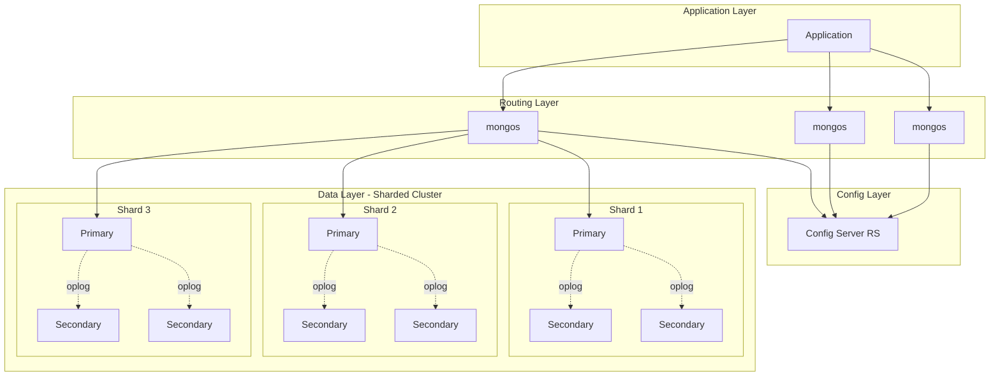

# MongoDB: Document Model, Sharding, Replication & Aggregation Pipeline

## 1. Mục tiêu của task

Nắm vững bản chất cơ chế lưu trữ, phân phối và xử lý dữ liệu của MongoDB - document database phổ biến nhất trong hệ sinh thái NoSQL. Hiểu sâu trade-off giữa flexibility và consistency, horizontal scaling vs operational complexity.

---

## 2. Bản chất và cơ chế hoạt động

### 2.1 Document Model & BSON Storage

**Bản chất của BSON:**

BSON (Binary JSON) không chỉ là JSON nhị phân hóa. Nó là định dạng tuần tự hóa được thiết kế để **traversal nhanh** - mỗi field có độ dài prefix, cho phép skip qua các field không cần thiết mà không phải parse toàn bộ document.

```
[BSON Document Structure]
├─ Document Length (4 bytes)
├─ Element 1
│   ├─ Type (1 byte)
│   ├─ Field Name (C-string)
│   └─ Value (variable)
├─ Element 2...
└─ Terminator (0x00)
```

> **Trade-off quan trọng:** BSON thêm overhead ~20-30% so với JSON text, nhưng cho phép random access O(1) đến bất kỳ field nào. JSON phải parse tuần tự O(n).

**Giới hạn 16MB/document:**
- Không phải arbitrary constraint - đây là **backpressure mechanism** để ngăn unbounded document growth
- Document quá lớn → RAM pressure khi working set không fit memory
- GridFS là workaround, nhưng introduce network round-trip penalty

**ObjectId - không chỉ là random string:**

```
[ObjectId 12 bytes]
├─ Timestamp (4 bytes) - bắt đầu từ Unix epoch
├─ Machine ID (3 bytes) - định danh máy tạo
├─ Process ID (2 bytes) - định danh process
└─ Counter (3 bytes) - tăng dần, init random
```

> **Lưu ý production:** ObjectId có thể leak thông tin nhạy cảm (timestamp creation, machine fingerprint). Trong HIPAA/GDPR contexts, cân nhắc dùng UUIDv4.

### 2.2 WiredTiger Storage Engine

**MVCC Implementation:**

WiredTiger dùng **copy-on-write B-trees** kết hợp MVCC. Mỗi transaction thấy snapshot point-in-time, không bị block bởi writers khác.

```
[Page State Evolution]
Time T1: [Root] → [Page A: v1]
Time T2: TX1 update Page A → [Page A': v2] (new physical page)
         [Root'] → [Page A': v2] + [Page A: v1] (vẫn visible cho TX0)
Time T3: TX1 commit → [Root'] trở thành canonical
Time T4: Checkpoint flush → v1 reclaimed
```

**Cache Architecture:**
- WiredTiger cache = 50% RAM - 1GB (default), **KHÔNG** phải OS page cache
- Document-level locking (contrast với InnoDB row-level): trade-off giữa granularity và overhead
- **Dirty page ratio** quan trọng hơn hit ratio - cache pressure xảy ra khi eviction không kịp với write rate

**Checkpoint & Journal:**
- Checkpoints mỗi 60s (configurable) - recovery point
- Journal WAL ghi mọi operation, synced mỗi 100ms (storage.journal.commitIntervalMs)
- **Key insight:** Journal cho durability, checkpoints cho fast recovery. Nếu crash: replay journal từ last checkpoint.

### 2.3 Replica Set - Consensus & Failover

**Raft-based Election (MongoDB 4.0+):**

MongoDB dùng variant của Raft consensus, không phải Paxos. Quy tắc bầu cử:

```
[Election Quorum Requirements]
- Priority 0 members không thể thành primary
- Arbiter không vote nếu có đủ data-bearing nodes
- "Majority" được định nghĩa là (N/2 + 1) votes
```

**Oplog - Logical Log vs Physical Log:**

| Characteristic | Oplog (MongoDB) | WAL (PostgreSQL) | Binlog (MySQL) |
|----------------|-----------------|------------------|----------------|
| **Format** | Idempotent operations | Physical page changes | Statement/Row events |
| **Replication** | Statement-based, idempotent | Physical replication | Mixed/Row-based |
| **Lag Impact** | Secondary apply sequentially | Byte-for-byte identical | Depends on binlog_format |
| **Point-in-time Recovery** | Không hỗ trợ trực tiếp | Có | Có với binlog |

> **Critical trade-off:** Oplog idempotency cho phép idempotent re-application (an toàn khi network partition), nhưng không hỗ trợ PITR như physical log.

**Replication Lag Scenarios:**

```
[Lag Sources]
1. Network latency: bandwidth constraint giữa regions
2. Disk I/O: secondary slower disk → apply bottleneck
3. Large transactions: oplog entry lớn block subsequent ops
4. Read preference: secondary read tăng load, giảm apply rate
```

**Flow Control (MongoDB 4.2+):**

Khi replication lag vượt `flowControlTargetLagSeconds` (default 10s), primary giảm write rate bằng cách giới hạn tickets. Đây là **backpressure mechanism** - ưu tiên consistency availability.

### 2.4 Sharding - Horizontal Partitioning

**Chunk-based Distribution:**

```
[Chunk Range Partitioning]
Shard Key: userId (hashed hoặc ranged)

Chunk 1: userId ∈ [min, 1000) → Shard A
Chunk 2: userId ∈ [1000, 2000) → Shard B
Chunk 3: userId ∈ [2000, 3000) → Shard C
Chunk 4: userId ∈ [3000, 4000) → Shard A (rebalancing)
```

**Config Server Replica Set (CSRS):**
- Lưu metadata: chunk ranges, shard locations, collection settings
- CSRS unavailable → cluster read-only (không thể chunk migration)
- **Operational note:** CSRS là single point of metadata truth, nhưng không phải data path

**mongos - Query Router:**
- Stateless, scalable horizontally
- Caching chunk metadata trong memory (refresh khi stale)
- **Targeted query:** query có shard key → route đến 1 shard
- **Broadcast query:** query không có shard key → scatter-gather tất cả shards

**Balancer & Chunk Migration:**

```
[Migration Process]
1. Balancer detect imbalance (chunk count diff > threshold)
2. Source shard donate chunk: 
   - Clone documents to destination
   - Catch-up sync delta changes
   - Critical section: block writes → atomic switch metadata
3. Config server update chunk location
4. Source xóa chunk cũ
```

> **Production hazard:** Chunk migration là expensive operation - disk I/O + network. Chạy balancer trong maintenance window nếu data lớn.

**Jumbo Chunks:**
- Chunk vượt `maxChunkSize` (default 64MB) **và không thể split** (single shard key value quá lớn)
- Jumbo chunk không thể migrate → hotspot shard
- **Prevention:** Chọn shard key có cardinality cao, tránh monotonic increasing keys

### 2.5 Aggregation Pipeline

**Pipeline Architecture:**

```
[Pipeline Execution Model]
Collection → Stage 1 → Stage 2 → ... → Stage N → Result
              ↓         ↓              ↓
         $match    $group        $project
         (filter)  (aggregate)   (transform)
```

**Optimization - Predicate Pushdown:**

MongoDB tự động reorder stages:
- `$match` sớm nhất có thể → giảm working set
- `$project`/`$unset` sau `$match` → giảm field transfer
- `$limit`/`$skip` pushdown khi có thể

**Memory Constraints:**
- Pipeline stage limit: 100MB RAM/stage (trước spilling)
- `$group` và `$sort` có thể spill to disk (slower)
- `allowDiskUse: true` để enable spilling

**Sharded Aggregation:**
- `$match` + `$project` → push to shards (parallel)
- `$group` without shard key → merge ở primary shard
- `$group` with shard key → pipeline pushdown

---

## 3. Kiến trúc tổng quan



---

## 4. So sánh các lựa chọn

### 4.1 Sharding Strategy

| Strategy | Use Case | Pros | Cons |
|----------|----------|------|------|
| **Hashed Sharding** | Uniform distribution, write-heavy | Write spread evenly | Range queries scatter-gather |
| **Ranged Sharding** | Range queries, time-series | Locality for range scans | Hotspot on sequential writes |
| **Zoned Sharding** | Geo-partitioning, compliance | Data residency control | Complex zone configuration |
| **Compound Shard Key** | Multi-dimension access | Flexible routing | Cardinality complexity |

### 4.2 Read Preference Trade-offs

| Mode | Consistency | Latency | Use Case |
|------|-------------|---------|----------|
| `primary` | Strong | Higher | Critical writes/reads |
| `primaryPreferred` | Strong (fallback eventual) | Variable | Most production apps |
| `secondary` | Eventual | Lower | Analytics, reporting |
| `secondaryPreferred` | Eventual (fallback strong) | Variable | Read-heavy with fallback |
| `nearest` | Eventual | Lowest | Geo-distributed, latency-sensitive |

### 4.3 Write Concern Matrix

| Concern | Durability | Performance | Risk |
|---------|------------|-------------|------|
| `w: 1` | Single node | Fastest | Data loss on primary failure |
| `w: majority` | Majority nodes | Slower | Safe, recommended |
| `w: all` | All nodes | Slowest | Availability hit |
| `j: true` | Journal flushed | +10-20% latency | Crash recovery |

---

## 5. Rủi ro, anti-patterns, lỗi thường gặp

### 5.1 Shard Key Anti-patterns

```javascript
// ANTI-PATTERN 1: Monotonic increasing key
db.orders.createIndex({ createdAt: 1 }) // shard key
// Result: All writes go to last chunk → hotspot

// ANTI-PATTERN 2: Low cardinality
db.users.createIndex({ status: 1 }) // only 3 values: active/inactive/banned
// Result: Maximum 3 chunks, không scale

// ANTI-PATTERN 3: Large array growth
db.posts.updateOne(
  { _id: 1 },
  { $push: { comments: { $each: newComments } } }
)
// Result: Document growth → padding factor waste, potential 16MB limit
```

### 5.2 Replication Lag Failures

```javascript
// Scenario: Write to primary, immediate read from secondary
await db.collection('orders').insertOne(order, { writeConcern: { w: 1 } })
const result = await db.collection('orders')
  .find({ userId })
  .readPref('secondaryPreferred') // Danger!
  .toArray()
// Result: Order might not exist yet → "lost" data illusion
```

**Solution:** Session-level causal consistency hoặc read từ primary sau write.

### 5.3 Aggregation Memory Bomb

```javascript
// ANTI-PATTERN: Large $group without index
db.sales.aggregate([
  { $match: { year: 2024 } }, // 10M documents
  { $group: { _id: "$customerId", total: { $sum: "$amount" } } },
  // Memory explosion nếu nhiều unique customers
])

// BETTER: Pre-filter hoặc dùng $out/$merge để materialize
```

### 5.4 Index explosion

- Multikey index trên array lớn: mỗi array element = 1 index entry
- Compound index order matters: ESR rule (Equality, Sort, Range)
- TTL index overhead: background purge không block, nhưng tạo delete load

### 5.5 Production Pitfalls

| Issue | Symptom | Root Cause |
|-------|---------|------------|
| **Jumbo chunks** | Shard imbalance | Poor shard key, large documents |
| **Balancer stall** | Migration không progress | Chunk too large, network timeout |
| **Oplog window** | Initial sync thất bại | Oplog quá nhỏ so với data change rate |
| **WiredTiger eviction** | Latency spike | Cache pressure, dirty ratio > 20% |
| **Election storm** | Frequent failover | Network flapping, `electionTimeoutMillis` too low |

---

## 6. Khuyến nghị thực chiến trong production

### 6.1 Capacity Planning

```yaml
# Rule of thumb cho sharding threshold
shard_when:
  - working_set_size > 0.7 * RAM
  - write_throughput > 10K ops/s (single node limit)
  - data_size > 2TB (operational consideration)
  
# WiredTiger cache sizing
cache_size_gb: max(0.5 * (RAM_GB - 1), 0.25 * RAM_GB)
# MongoDB tự tính, nhưng monitor `wiredTiger.cache` metrics
```

### 6.2 Shard Key Design

```javascript
// GOOD: Compound key với cardinality + locality
db.events.createIndex({ 
  tenantId: 1,    // grouping (equality)
  timestamp: 1,   // range (time-series)
  _id: 1          // uniqueness
})

// GOOD: Hashed cho write distribution
db.sessions.createIndex({ userId: "hashed" })
```

### 6.3 Monitoring Checklist

```javascript
// Các metrics quan trọng (mongostat, prometheus exporter)

// Replication health
rs.printSecondaryReplicationInfo()  // lag per member
db.getReplicationInfo()              // oplog window

// Sharding health
sh.status()                          // chunk distribution
sh.isBalancerRunning()               // balancer state

// Storage health
db.serverStatus().wiredTiger.cache   // cache hit/miss, eviction
db.serverStatus().opcounters         // operation rates
db.serverStatus().connections        // connection count
```

### 6.4 Operational Best Practices

1. **Backup Strategy:**
   - Logical: `mongodump` (portable, slow for large data)
   - Physical: Filesystem snapshots/LVM (fast, point-in-time)
   - Continuous: Oplog backup cho PITR

2. **Upgrade Path:**
   - Rolling upgrade: secondary → stepdown primary → upgrade old primary
   - Feature compatibility version: upgrade x.y.z → set FCV → upgrade x.y+1

3. **Connection Management:**
   - Connection pool: 10-100 per app instance (tùy workload)
   - `maxPoolSize` + `waitQueueTimeoutMS` để fail fast

4. **Security:**
   - TLS cho tất cả intra-cluster communication
   - RBAC: principle of least privilege
   - Encryption at rest (WiredTiger native hoặc filesystem)

---

## 7. Kết luận

**Bản chất của MongoDB:**

MongoDB là **distributed document store** trade-off giữa **schema flexibility** và **operational complexity**. Không phải "schemaless" mà là "schema dynamic" - bạn vẫn cần thiết kế schema, chỉ là schema có thể evolve.

**Trade-off cốt lõi:**
- **Sharding** cho scalability nhưng thêm latency (network hop) và complexity (shard key design, rebalancing)
- **Replication** cho availability nhưng có eventual consistency và replication lag
- **Document model** cho developer productivity nhưng có 16MB limit và no native joins

**Khi nào dùng:**
- Dữ liệu có cấu trúc linh hoạt, cần iterate nhanh
- Write-heavy workload cần horizontal scale
- Geo-distributed deployment, cần local read latency

**Khi nào KHÔNG nên dùng:**
- Complex multi-document ACID transactions (support có nhưng expensive)
- Heavy analytical queries (dùng data warehouse thay thế)
- Strict schema enforcement requirement tại database level

---

## 8. Code tham khảo (minimization)

```javascript
// Connection với proper settings cho production
const client = new MongoClient(uri, {
  maxPoolSize: 50,
  minPoolSize: 10,
  serverSelectionTimeoutMS: 5000,
  socketTimeoutMS: 45000,
  retryWrites: true,
  w: 'majority',
  readPreference: 'primaryPreferred'
});

// Session với causal consistency cho read-after-write
db.getMongo().setReadPref('primaryPreferred')
const session = db.getMongo().startSession({
  readConcern: { level: 'majority' },
  writeConcern: { w: 'majority' }
});

// Aggregation với proper optimization
pipeline = [
  { $match: { status: 'active', createdAt: { $gte: startDate } } },
  { $sort: { createdAt: -1 } },
  { $limit: 1000 },
  { $lookup: { from: 'users', localField: 'userId', foreignField: '_id', as: 'user' } },
  { $unwind: { path: '$user', preserveNullAndEmptyArrays: true } }
]
// Note: $lookup trong pipeline là left outer join, không phải inner join
```
