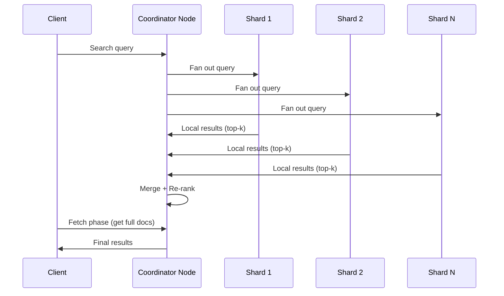
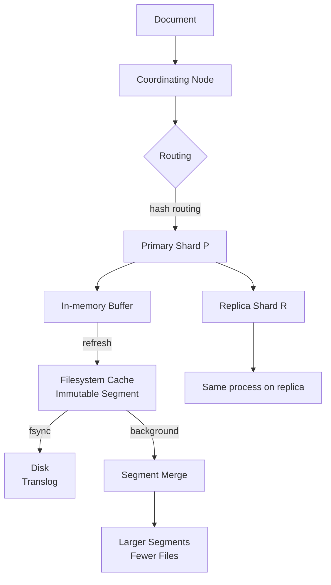
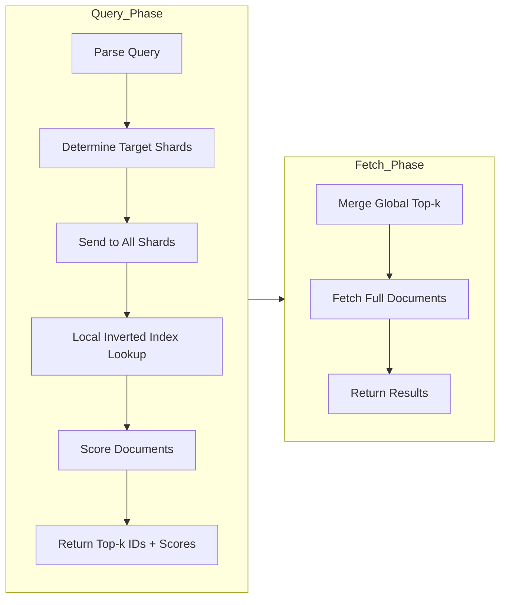

# Elasticsearch Deep Dive: Inverted Index, Sharding & Relevance Scoring

## 1. Mục tiêu của Task

Hiểu sâu bản chất của Elasticsearch (ES) như một distributed search engine, tập trung vào 3 trụ cột:
- **Inverted Index**: Cấu trúc dữ liệu lõi cho full-text search
- **Sharding**: Cơ chế phân tán và scale horizontally
- **Relevance Scoring**: Thuật toán đánh giá độ liên quan (BM25) và các yếu tố ảnh hưởng

> **Không phải hướng dẫn sử dụng ES**. Mục tiêu là hiểu **tại sao** ES thiết kế như vậy và **khi nào** nên/không nên dùng.

---

## 2. Bản Chất và Cơ Chế Hoạt Động

### 2.1 Inverted Index - Trái Tim Củả Full-Text Search

#### Bản chất cấu trúc

Inverted index là ánh xạ ngược từ **term** → **list of documents** chứa term đó.

```
Văn bản gốc:
Doc 1: "Java programming language"
Doc 2: "Java virtual machine"
Doc 3: "Python programming"

Inverted Index:
java          → [1, 2]
programming   → [1, 3]
language      → [1]
virtual       → [2]
machine       → [2]
python        → [3]
```

**Tại sao gọi là "inverted"?** Vì truyền thống forward index lưu document → terms, còn inverted index đảo ngược mối quan hệ để hỗ trợ tìm kiếm nhanh.

#### Cấu trúc chi tiết trong Lucene/ES

```
Term Dictionary (sorted)    |    Postings List
----------------------------|--------------------------------
java                        |    DocId: 1, 2
                            |    Term Freq: [2, 1]          ← số lần xuất hiện
                            |    Positions: [[0], [0]]      ← vị trí trong doc
                            |    Payloads: [...]            ← optional metadata
programming                 |    DocId: 1, 3
                            |    Term Freq: [1, 1]
                            |    Positions: [[1], [1]]
```

**Các thành phần quan trọng:**

| Thành phần | Mục đích | Chi phí lưu trữ |
|-----------|----------|----------------|
| DocIds | Xác định document chứa term | ~1-4 bytes/doc |
| Term Frequencies | Tính relevance (TF) | ~1 byte/doc |
| Positions | Phrase queries, proximity search | ~1-4 bytes/occurrence |
| Offsets | Highlighting | ~2-8 bytes/occurrence |
| Payloads | Custom metadata | Tùy custom |

> **Trade-off storage vs query speed**: Càng lưu nhiều metadata (positions, offsets), query càng nhanh nhưng index size tăng 2-4x.

#### Segment-based Architecture (Lucene)

ES/Lucene không update index trực tiếp. Thay vào đó:

```
Write Flow:
  Document mới → In-memory buffer → Refresh → Immutable Segment
                                                    ↓
                                          Background Merge
                                                    ↓
                                          Larger, Optimized Segments
```

**Tại sao segments immutable?**

1. **Lock-free reads**: Không cần locking khi search, vì segment không đổi
2. **OS Page Cache friendly**: File mapping (mmap) hiệu quả hơn với immutable files
3. **Compression tốt hơn**: Có thể apply các thuật toán compression mạnh hơn
4. **Cache locality**: Term dictionary và postings list được cache hiệu quả

**Hệ quả của immutability:**

> Updates = Delete old doc + Index new doc (soft delete marker)
> 
> Delete = Chỉ đánh dấu deleted bit trong segment

Điều này tạo ra **deleted documents** - tài liệu đã xóa/update nhưng vẫn chiếm dung lượng cho đến khi segment merge.

#### Text Analysis Pipeline

Trước khi vào inverted index, text phải qua **Analysis**:

```
Raw Text → Character Filters → Tokenizer → Token Filters → Terms
             (strip HTML)    (split words)  (lowercase,    (đưa vào
                                            stopwords,     inverted
                                            stemming)      index)
```

**Ví dụ thực tế:**

```
Input:  "Elasticsearch is GREAT for Search!"
        ↓
Tokenizer (standard): ["Elasticsearch", "is", "GREAT", "for", "Search"]
        ↓
Lowercase filter:     ["elasticsearch", "is", "great", "for", "search"]
        ↓
Stopword removal:     ["elasticsearch", "great", "search"]  (bỏ "is", "for")
        ↓
Stemming:             ["elasticsearch", "great", "search"]  (giữ nguyên trong ví dụ này)
```

**Analyzer selection là quyết định kiến trúc:**

| Use Case | Analyzer | Lý do |
|----------|----------|-------|
| Tiếng Anh chung | `standard` hoặc `english` | Cân bằng precision/recall |
| Log analysis | `keyword` hoặc custom | Giữ nguyên để filter chính xác |
| Product search | Custom với synonyms | "laptop" = "notebook" |
| Code search | `whitespace` + custom | Preserve case, symbols |
| Tiếng Việt | `vi_analyzer` (ICU) | Xử lý dấu thanh, từ ghép |

> **Anti-pattern**: Dùng cùng analyzer cho index và search trong mọi trường hợp. Thực tế nên dùng `search_analyzer` khác `analyzer` khi cần (vd: index synonyms, nhưng search không expand).

---

### 2.2 Sharding - Distributed Architecture

#### Bản chất sharding trong ES

Shard là **index độc lập, self-contained** - về mặt logic là một Lucene index riêng biệt.

```
Index: "products" (1TB data)
       ├── Primary Shard 0  (250MB) → Replica 0
       ├── Primary Shard 1  (250MB) → Replica 1
       ├── Primary Shard 2  (250MB) → Replica 2
       └── Primary Shard 3  (250MB) → Replica 3

Node 1: [Primary 0, Replica 1]
Node 2: [Primary 1, Replica 2]
Node 3: [Primary 2, Replica 3]
Node 4: [Primary 3, Replica 0]
```

**Shard không chia sẻ gì với nhau:**
- Mỗi shard có inverted index riêng
- Mỗi shard có translog riêng
- Mỗi shard được JVM heap quản lý độc lập

> **Điều này có nghĩa**: Query phải execute trên **tất cả** shards liên quan, sau đó merge results.

#### Routing - Document đi đâu?

```java
shard = hash(_routing) % num_primary_shards
```

Default: `_routing` = `_id` của document

**Vấn đề với routing:**

> **Số primary shards không thể thay đổi sau khi tạo index** (trước ES 7.x).
> 
> Tại sao? Vì thay đổi số shards làm thay đổi routing hash → documents sẽ nằm sai shard.

**Giải pháp khi cần scale:**
1. **Reindex API**: Tạo index mới với số shards khác, copy data
2. **Split API** (ES 6.x+): Tăng shards gấp đôi (vd: 5 → 10)
3. **Shrink API**: Giảm shards (vd: 10 → 5)

#### Search Execution Flow



**Query Then Fetch Pattern:**

1. **Query Phase**: 
   - Query đến tất cả shards
   - Mỗi shard trả về **doc IDs + scores** (không phải full documents)
   - Coordinator merge và sort toàn bộ

2. **Fetch Phase**:
   - Coordinator biết top-k documents thực sự
   - Fetch full document content từ các shards liên quan

**Vấn đề với deep pagination:**

```
Page 1 (size=10, from=0):  Query top 10 từ mỗi shard → merge → top 10
Page 1000 (from=10000):   Query top 10010 từ mỗi shard → merge → lấy 10 docs
```

> **O(n) với n = from + size** - không scalable cho deep pagination.

**Giải pháp:**
- `search_after`: Dùng sort values từ page trước làm "cursor"
- `scroll`: Lưu context cho batch processing (không dùng cho real-time UI)
- `point_in_time` (ES 7.10+): Kết hợp PIT + search_after cho pagination ổn định

#### Shard Allocation Strategy

**Các yếu tố allocation quyết định performance:**

| Factor | Impact | Best Practice |
|--------|--------|---------------|
| Shard size | Query latency, recovery time | 10-50GB/shard |
| Shard count/node | Heap pressure, context switching | < 20 shards/GB heap |
| Hot/warm architecture | Cost optimization | Hot: SSD, recent data |
| Rack awareness | High availability | Spread replicas across racks |

**Shard size trade-off:**

```
Shards quá nhỏ (< 1GB):
  ✅ Recovery nhanh
  ✅ Rebalancing linh hoạt
  ❌ Query overhead (phải query nhiều shards)
  ❌ Memory overhead (mỗi shard cần heap)

Shards quá lớn (> 100GB):
  ✅ Fewer shards to query
  ❌ Recovery chậm (hours/days)
  ❌ Rebalancing expensive
  ❌ GC pressure khi merge
```

> **Rule of thumb**: Target 20-40GB/shard cho time-series data, < 50GB cho static content.

---

### 2.3 Relevance Scoring - BM25 Algorithm

#### Từ TF-IDF đến BM25

**TF-IDF (cũ):**
```
score(q, d) = Σ(tf(t,d) × idf(t))

where:
  tf(t,d) = frequency của term t trong doc d
  idf(t) = log(N / df(t))  (N = total docs, df = docs chứa t)
```

**Vấn đề của TF-IDF:**
1. **TF không normalized**: Doc dài bị lợi thế (nhiều term hơn)
2. **TF linear growth**: 100 occurrences không gấp 100 lần 1 occurrence về mặt ý nghĩa
3. **IDF sensitivity**: Rare terms có IDF quá cao, dễ bị spam

**BM25 (Okapi BM25) - ES default:**

```
score(q, d) = Σ IDF(t) × [TF(t,d) × (k1 + 1)] / [TF(t,d) + k1 × (1 - b + b × |d|/avgdl)]

where:
  k1 = 1.2 (default) - controls term frequency saturation
  b = 0.75 (default) - controls field length normalization
```

#### BM25 Saturation Curve

```
TF Score Contribution
    │
1.0 ┤                    ╭───────
    │               ╭────╯
0.8 ┤          ╭────╯
    │     ╭────╯
0.5 ┤╭────╯
    │╯
0.0 ┼────┬────┬────┬────┬────┬──→ TF
    0    5   10   20   50  100

Với k1 = 1.2: Score tăng nhanh ở TF thấp, saturate ở TF cao
```

**Ý nghĩa thực tế:**
- Document chứa 5 occurrences của "java" không có nghĩa gấp 5 lần document chứa 1 occurrence
- Sự khác biệt giảm dần khi TF tăng (diminishing returns)

#### Field Length Normalization (b parameter)

```
|d|/avgdl = 1.0  → b có ảnh hưởng 0%
|d|/avgdl = 2.0  → b=0.75: penalty ~43%
|d|/avgdl = 0.5  → b=0.75: bonus ~37%
```

**Tuning b:**
- **b = 1.0**: Full length normalization (tài liệu dài bị penalize mạnh)
- **b = 0**: No length normalization (title ngang hàng với body)

> **Use case b = 0**: Title field - "Java" trong title ngắn và "Java" trong title dài nên có cùng trọng số.

#### Practical Scoring Factors

```
Final Score = Σ(Score(term)) × boost(query) × boost(field) × boost(doc)
```

| Boost Type | Scope | Use Case |
|-----------|-------|----------|
| Query boost | Query time | Ưu tiên certain terms |
| Field boost | Index time | Title quan trọng hơn body |
| Document boost | Index time | Premium content |
| Function score | Query time | Recency, popularity, geography |

**Function Score Query (điều chỉnh score động):**

```json
{
  "function_score": {
    "query": { "match": { "title": "java" }},
    "functions": [
      { "gauss": { "date": { "origin": "now", "scale": "7d" }}},
      { "field_value_factor": { "field": "popularity", "factor": 1.2 }}
    ],
    "score_mode": "multiply"
  }
}
```

---

## 3. Kiến Trúc và Luồng Xử Lý

### 3.1 Write Path (Indexing Flow)



**Durability guarantees:**

| Setting | Durability | Performance | Use Case |
|---------|-----------|-------------|----------|
| `index.translog.durability: async` | Có thể mất 5s data | Cao | Log ingestion, có thể tolerate loss |
| `index.translog.durability: request` (default) | No data loss | Thấp hơn | Critical data, transactional |

**Refresh interval trade-off:**

```
refresh_interval: 1s (default)
  ✅ Data searchable sau 1s
  ❌ Tạo nhiều small segments → merge pressure

refresh_interval: 30s
  ✅ Fewer segments, better indexing throughput
  ❌ Data visible sau 30s (near-real-time)

refresh_interval: -1 (disabled)
  ✅ Best indexing throughput
  ❌ Manual refresh needed
  📌 Dùng cho bulk import, reindex
```

### 3.2 Query Execution Phases



**Query caching:**

| Cache Type | What | Invalidation |
|-----------|------|--------------|
| Node Query Cache | Filter contexts (bitsets) | Per segment, background refresh |
| Shard Request Cache | Query results (size=0 aggregations) | Refresh, flush |
| Field Data Cache | Field values for sorting/aggregations | Manual clear, circuit breaker |

---

## 4. So Sánh và Lựa Chọn

### 4.1 Elasticsearch vs Alternatives

| Feature | Elasticsearch | Solr | OpenSearch | Typesense | Meilisearch |
|---------|---------------|------|------------|-----------|-------------|
| **Lucene-based** | ✅ | ✅ | ✅ (fork) | ❌ | ❌ |
| **Distributed** | ✅ Native | ✅ (SolrCloud) | ✅ | ❌ | ❌ |
| **Complex queries** | ✅✅✅ | ✅✅✅ | ✅✅ | ✅ | ✅ |
| **Aggregations** | ✅✅✅ | ✅✅ | ✅✅✅ | ❌ | ✅ |
| **Learning curve** | Steep | Steeper | Steep | Easy | Easy |
| **Self-hosted cost** | High (RAM) | High (RAM) | High (RAM) | Low | Low |
| **Managed service** | Elastic Cloud, AWS | - | AWS, Aiven | Typesense Cloud | Meilisearch Cloud |

### 4.2 When NOT to use Elasticsearch

| Scenario | Better Alternative | Lý do |
|----------|-------------------|-------|
| Primary data store | PostgreSQL, MongoDB | ES không có transactions, eventual consistency |
| Complex relationships | Neo4j, PostgreSQL | ES không có join thực sự (denormalized) |
| Small dataset (< 1GB) | PostgreSQL full-text | Overkill, operational overhead |
| Real-time strict (< 100ms) | In-memory (Redis) | ES là near-real-time |
| Frequent updates cùng document | Cassandra, MongoDB | Update = delete + insert, expensive |
| ACID requirements | Any relational DB | ES không đảm bảo ACID |

---

## 5. Rủi Ro, Anti-patterns và Pitfall

### 5.1 Production Failure Modes

#### **Split Brain (trước ES 7.x)**

```
Network partition → 2 nodes tự nhận là master
→ 2 cluster states khác nhau
→ Data divergence
```

> **Giải pháp ES 7.x+**: `discovery.type: single-node` hoặc minimum_master_nodes được tính tự động.

#### **Too Many Shards**

**Triệu chứng:**
- Heap usage cao (> 75%)
- GC pressure, long GC pauses
- Slow cluster state updates

**Nguyên nhân:**
```
30 indices × 5 primary × 1 replica = 300 shards
Mỗi shard cần ~1MB heap overhead + cache
→ 300MB+ chỉ cho overhead
```

> **Giới hạn**: Tối đa 20 shards trên 1GB heap.

#### **Mapping Explosion**

```
{"user_1_name": "John", "user_1_age": 30,
 "user_2_name": "Jane", "user_2_age": 25,
 ...}
```

Mỗi field unique → mapping entry mới → cluster state tăng → OOM.

> **Giới hạn mặc định**: `index.mapping.total_fields.limit: 1000`

#### **Deep Paging Death**

```
GET /products/_search
{
  "from": 100000,
  "size": 100
}
```

→ Coordinator phải sort 100,100 documents từ TẤT CẢ shards.

> **Giải pháp**: Dùng `search_after` hoặc `scroll`.

### 5.2 Common Anti-patterns

| Anti-pattern | Tại sao tệ | Cách làm đúng |
|-------------|-----------|---------------|
| Nested queries sâu | O(n²) complexity | Flatten nếu có thể, dùng `parent-child` cho scale |
| Script fields heavy | Chạy trên từng doc, chậm | Pre-compute tại index time |
| Wildcard queries leading `*` | Scan tất cả terms | Dùng `index_prefixes` hoặc `ngram` |
| Default replicas = 1 cho critical data | Single node failure = unavailable | `number_of_replicas: 2` cho production |
| No alias, query trực tiếp index | Reindex downtime | Dùng alias cho zero-downtime reindex |

---

## 6. Khuyến Nghị Thực Chiến Production

### 6.1 Sizing and Capacity Planning

**RAM:**
- 50% heap cho ES (tối đa 31GB - compressed OOPs threshold)
- 50% còn lại cho OS filesystem cache

**Disk:**
- SSD bắt buộc cho hot tier
- 1:24 ratio disk:RAM (vd: 64GB RAM → 1.5TB disk/shard)

**CPU:**
- Heavy indexing: Nhiều cores
- Heavy search: High clock speed

### 6.2 Monitoring Essentials

**Metrics phải theo dõi:**

| Metric | Alert Threshold | Ý nghĩa |
|--------|-----------------|---------|
| `jvm.heap.used` | > 75% | GC pressure, có thể OOM |
| `indices.search.query_time` | P99 > 100ms | Slow queries cần optimize |
| `indices.indexing.index_time` | Spike bất thường | Indexing bottleneck |
| `cluster.health.status` | Yellow/Red | Replica/primary shard issues |
| `node.stats.fs.available` | < 20% | Disk sắp full, ES sẽ reject writes |
| `indices.segments.count` | > 100/shard | Cần force merge |

### 6.3 Index Lifecycle Management (ILM)

```
Hot Phase (0-7 days):    SSD, 1s refresh, searchable
Warm Phase (7-30 days):  HDD OK, 30s refresh, force merge
Cold Phase (30-90 days): Read-only, minimize replicas
Frozen Phase (90d+):     Snapshot đến S3, searchable snapshot
Delete Phase (1 year):   Xóa
```

### 6.4 Security Checklist

- [ ] TLS in-transit (node-to-node, client-to-node)
- [ ] Authentication enabled (native, LDAP, or SAML)
- [ ] Role-based access control (RBAC)
- [ ] Field-level security cho sensitive data
- [ ] Audit logging enabled
- [ ] No bind to 0.0.0.0 mà không có firewall
- [ ] Scripting disabled nếu không cần (hoặc sandboxed)

---

## 7. Kết Luận

**Bản chất của Elasticsearch:**

1. **Inverted Index** cho phép search nhanh bằng cách đảo ngược mapping từ term → documents. Immutability của segments cho phép lock-free reads và efficient caching, nhưng đòi hỏi merge overhead.

2. **Sharding** cho phép horizontal scaling nhưng tạo ra coordination cost. Mỗi query phải fan-out đến tất cả shards, merge results, rồi fetch documents. Đây là trade-off của distributed search.

3. **BM25 Scoring** giải quyết vấn đề của TF-IDF bằng saturation curve (diminishing returns) và field length normalization, nhưng vẫn đơn giản hơn ML-based ranking.

**Khi nào dùng ES:**
- Full-text search với complex queries
- Log aggregation và analytics (ELK stack)
- E-commerce product search
- **Không dùng** làm primary data store, cho frequent updates, hoặc strict real-time.

**Trade-off cốt lõi:**
> Near-real-time indexing vs. query performance. ES chọn cân bằng này bằng refresh interval, immutable segments, và async merges. Hiểu điều này giúp tune đúng cho use case.

---

## 8. Tham Khảo

- [Lucene's Practical Scoring Function](https://lucene.apache.org/core/8_11_0/core/org/apache/lucene/search/similarities/BM25Similarity.html)
- [Elasticsearch: The Definitive Guide - O'Reilly](https://www.elastic.co/guide/en/elasticsearch/guide/current/index.html)
- [Elastic Blog: BM25 Demystified](https://www.elastic.co/blog/practical-bm25-part-2-the-bm25-algorithm-and-its-variables)
- [Elasticsearch Reference - Shard Allocation](https://www.elastic.co/guide/en/elasticsearch/reference/current/shards-allocation.html)
