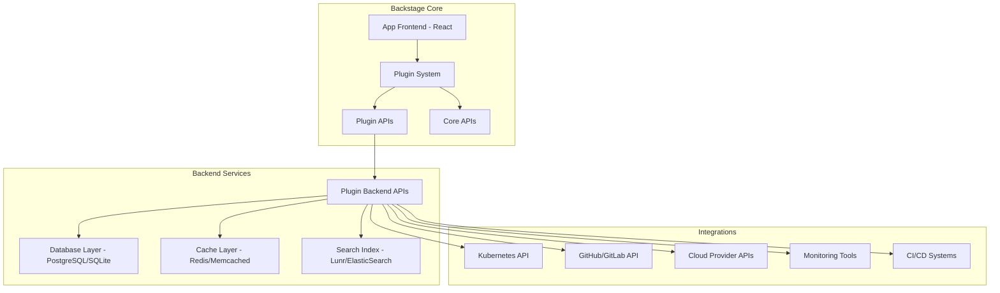
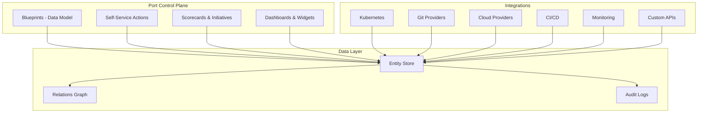
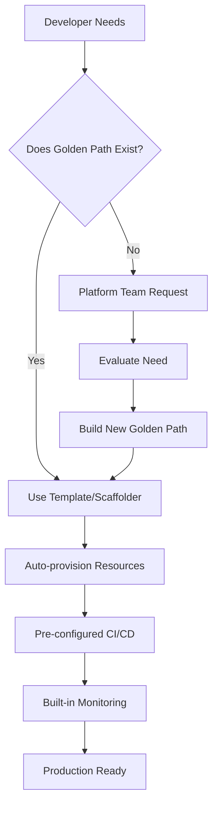
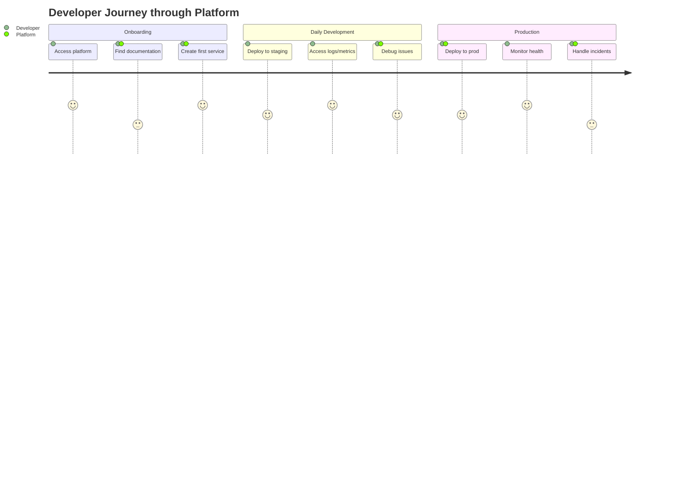
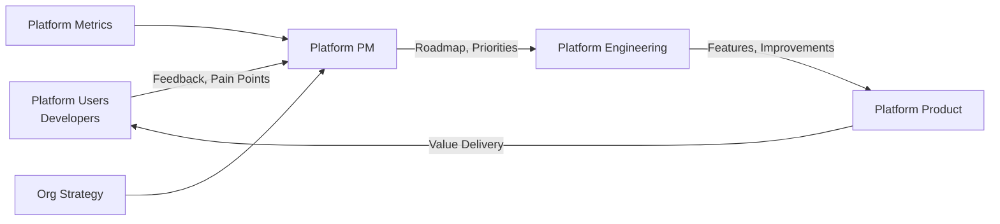

# Platform as a Product: Internal Developer Platform (IDP) & Platform Engineering

## 1. Mục tiêu của Task

Hiểu sâu về **Platform as a Product** - triết lý biến Internal Developer Platform (IDP) thành một sản phẩm thực sự phục vụ developers, thay vì là một bộ công cụ IT từ trên xuống. Tập trung vào:
- Bản chất của platform engineering và sự khác biệt so với traditional DevOps
- Kiến trúc nội bộ của các IDP hàng đầu (Backstage, Port)
- Chiến lược "golden paths" và self-service infrastructure
- Metrics đo lường developer experience (DX)
- Chiến lược adoption và cognitive load reduction

---

## 2. Bản Chất và Cơ Chế Hoạt Động

### 2.1 Từ DevOps đến Platform Engineering: Sự Chuyển Dịch Paradigm

**Vấn đề cốt lõi của DevOps truyền thống:**

Mô hình "You build it, you run it" của DevOps dẫn đến **cognitive overload** - mỗi developer phải hiểu quá nhiều thứ: Kubernetes, Terraform, CI/CD pipelines, monitoring, security policies, cloud resources... Điều này làm giảm productivity và tăng burnout.

> **Cognitive Load Theory áp dụng cho Software Engineering:**
> - **Intrinsic load:** Kiến thức cần thiết để giải quyết bài toán nghiệp vụ (business logic)
> - **Extraneous load:** Kiến thức về infrastructure, tooling, process (không liên quan trực tiếp đến business value)
> - **Germane load:** Kiến thức giúp học và cải thiện trong tương lai

**Platform Engineering giải quyết bằng cách:** Tách extraneous load khỏi development team, chuyển gánh nặng này sang dedicated platform team. Developer chỉ cần tương tác với abstracted, self-service interfaces.

**Sự khác biệt cốt lõi:**

| Aspect | Traditional DevOps | Platform Engineering |
|--------|-------------------|---------------------|
| **Mindset** | "Everyone is responsible for everything" | "Specialized teams enable others" |
| **Interface** | Raw tools (kubectl, Terraform CLI) | Curated self-service portal |
| **Cognitive Load** | High - devs learn everything | Low - devs focus on business logic |
| **Team Structure** | Embedded DevOps engineers | Centralized platform team as product team |
| **Success Metrics** | Deployment frequency, MTTR | Developer productivity, NPS, time-to-market |

### 2.2 Backstage: Kiến Trúc Nội Bộ

**Backstage** (open-sourced by Spotify, donated to CNCF) là platform framework phổ biến nhất hiện nay.

**Core Architecture:**



**Key Components:**

1. **Software Catalog:** Central metadata store về tất cả software components (services, libraries, APIs, resources). Sử dụng **descriptor files** (`catalog-info.yaml`) để khai báo:
   ```yaml
   apiVersion: backstage.io/v1alpha1
   kind: Component
   metadata:
     name: payment-service
     annotations:
       github.com/project-slug: org/payment-service
       backstage.io/kubernetes-id: payment-service
   spec:
     type: service
     lifecycle: production
     owner: payments-team
     system: payment-platform
   ```

2. **Plugin System:** Kiến trúc micro-frontend cho phép:
   - Frontend plugins (React components)
   - Backend plugins (Node.js/Express APIs)
   - Isolated development và deployment
   - Plugin-to-plugin communication qua APIs

3. **Scaffolder (Software Templates):** Templating engine cho "golden paths":
   - Cookiecutter templates hoặc custom templating
   - Multi-step workflows với input forms
   - Automated repository creation, CI/CD setup
   - Resource provisioning (K8s namespaces, databases)

4. **TechDocs:** Documentation-as-code sử dụng MkDocs:
   - Docs live cùng source code
   - Auto-generated API documentation
   - Search và versioning

**Trade-offs của Backstage:**

| Ưu điểm | Nhược điểm |
|---------|-----------|
| Open source, community lớn | Setup phức tạp, cần dedicated team maintain |
| Highly customizable | Customization requires React/TypeScript expertise |
| Rich plugin ecosystem | Plugin quality varies, một số outdated |
| Software Catalog làm backbone | Catalog có thể bị stale nếu không auto-sync |
| Scalable architecture | Resource intensive ở scale lớn (cần proper caching/indexing) |

### 2.3 Port: Kiến Trúc No-Code/Low-Code IDP

**Port** là commercial IDP alternative, focus vào "building IDP without coding".

**Kiến trúc khác biệt:**



**Core Concepts:**

1. **Blueprints:** Domain-specific language để định nghĩa entity types:
   ```json
   {
     "identifier": "microservice",
     "title": "Microservice",
     "schema": {
       "properties": {
         "language": {"type": "string", "enum": ["java", "go", "python"]},
         "tier": {"type": "string", "enum": ["critical", "standard", "experimental"]},
         "owner": {"type": "string", "format": "user"}
       }
     }
   }
   ```

2. **Self-Service Actions:** No-code workflow builder cho:
   - Day-2 operations (scale, restart, rollback)
   - Resource provisioning
   - Permission requests
   - Integration với Terraform, GitHub Actions, etc.

3. **Scorecards:** Automated governance qua policy-as-code:
   - Define quality gates (code coverage, security scans)
   - Track compliance across catalog
   - Initiatives để drive improvements

**Backstage vs Port - So sánh chi tiết:**

| Criteria | Backstage | Port |
|----------|-----------|------|
| **Deployment Model** | Self-hosted (your infrastructure) | SaaS (Port-hosted) hoặc Self-hosted |
| **Customization** | Unlimited (code-level) | Limited to configuration & webhooks |
| **Time-to-value** | Weeks-months (cần development) | Days (no-code setup) |
| **Vendor Lock-in** | Low (open source) | High (proprietary data model) |
| **Scalability** | Manual scaling required | Auto-scaling (SaaS) |
| **Cost Model** | Infrastructure + headcount | Per-developer licensing |
| **Best For** | Large orgs with platform teams | Mid-size orgs muốn nhanh |

---

## 3. Golden Paths: Chiến Lược Self-Service Infrastructure

### 3.1 Bản Chất của Golden Path

**Definition:** Các "đường mòn được đánh dấu" - pre-approved, supported workflows để thực hiện common tasks mà vẫn maintain organizational standards.

**Tại sao cần Golden Paths:**

> **Paved Road vs Wild West:**
> - **Wild West:** Mỗi team tự chọn tools, patterns → Fragmentation, maintenance nightmare, security risks
> - **Paved Road:** Platform team cung cấp blessed paths → Consistency, supportability, faster onboarding
> - **Key insight:** Golden paths không phải là "mandatory" mà là "easiest path" - developers vẫn có thể deviate nếu có lý do chính đáng

**Cấu trúc của một Golden Path:**



### 3.2 Golden Path Implementation Patterns

**Pattern 1: Cookiecutter Templates (Backstage Scaffolder)**

Template structure:
```
template/
├── template.yaml          # Template metadata
├── skeleton/              # Template files
│   ├── ${{values.name}}/
│   ├── src/
│   ├── k8s/
│   ├── .github/
│   └── catalog-info.yaml
```

Template parameters define:
- Service type (microservice, library, cronjob)
- Technology stack (Java/Spring, Go, Python)
- Infrastructure needs (database, cache, queue)
- Ownership và team assignment

**Pattern 2: Terraform Modules với Wrapper**

Thay vì expose raw Terraform, platform team cung cấp:
```hcl
module "microservice" {
  source = "platform-team/microservice/aws"
  version = "~> 2.0"
  
  service_name = var.name
  environment  = var.env
  
  # Pre-configured, validated inputs only
  instance_size = var.size  # "small", "medium", "large" - không phải raw instance type
  
  # Security best practices built-in
  enable_encryption = true
  backup_retention = 7
}
```

**Pattern 3: Platform CLI/CTL**

Custom CLI tool wrap complex operations:
```bash
# Thay vì: kubectl apply + terraform apply + github api calls + jenkins job trigger
platformctl service create \
  --name payment-api \
  --template spring-boot \
  --owner payments-team \
  --production
```

### 3.3 Quản Lý Golden Path Lifecycle

| Giai đoạn | Hoạt động | Metrics |
|-----------|-----------|---------|
| **Creation** | Identify common pattern → Build template → Document | Time to create path |
| **Adoption** | Onboard teams → Gather feedback → Iterate | % new services using path |
| **Maintenance** | Update dependencies → Security patches → Feature additions | # of outdated services |
| **Deprecation** | Announce EOL → Migration support → Archive | Migration completion rate |

> **Anti-pattern: Golden Cage**
> Tạo quá nhiều constraints khiến developers không thể innovate. Platform team phải balance giữa standardization và flexibility.

---

## 4. Developer Experience (DX) Metrics

### 4.1 Framework đo lường DX

**SPACE Framework** (Microsoft Research):

| Dimension | Metrics | Platform Relevance |
|-----------|---------|-------------------|
| **S**atisfaction | Developer NPS, eNPS, survey scores | Platform team là internal service provider |
| **P**erformance | Lead time, deployment frequency, change failure rate | Platform directly impacts these DORA metrics |
| **A**ctivity | PRs merged, commits, builds | Proxy for productivity (nhưng cẩn thận gaming) |
| **C**ommunication | Collaboration tools usage, documentation views | Platform as collaboration hub |
| **E**fficiency | Time waiting for builds, time to provision resources | Core platform value proposition |

**DORA Metrics** (DevOps Research & Assessment):

```
┌─────────────────────────────────────────────────────────┐
│  DEPLOYMENT FREQUENCY                                   │
│  ─────────────────────                                  │
│  How often deploy to production?                        │
│  Platform impact: Self-service deployments, automation  │
├─────────────────────────────────────────────────────────┤
│  LEAD TIME FOR CHANGES                                  │
│  ─────────────────────────                              │
│  Commit to production time                              │
│  Platform impact: Fast builds, reliable tests, golden paths│
├─────────────────────────────────────────────────────────┤
│  CHANGE FAILURE RATE                                    │
│  ─────────────────────                                  │
│  % deployments causing incidents                        │
│  Platform impact: Standardized testing, canary releases │
├─────────────────────────────────────────────────────────┤
│  TIME TO RESTORE SERVICE                                │
│  ───────────────────────────                            │
│  Mean time to recovery (MTTR)                           │
│  Platform impact: Automated rollback, observability     │
└─────────────────────────────────────────────────────────┘
```

### 4.2 Platform-Specific Metrics

**Platform Engineering Metrics:**

| Metric Category | Specific Metrics | Target |
|----------------|------------------|--------|
| **Adoption** | % services in catalog, template usage rate, self-service action usage | >80% services cataloged |
| **Efficiency** | Time to create new service, time to provision infrastructure, build duration | <15 min for new service |
| **Reliability** | Platform uptime, template success rate, infrastructure provisioning success | >99.9% uptime |
| **Developer Sentiment** | Platform NPS, support ticket volume, feature request backlog | NPS >50 |
| **Cost Efficiency** | Infrastructure utilization, idle resource detection, cost per service | 20% cost reduction |

**Developer Journey Metrics:**



### 4.3 Measuring Cognitive Load

**Cognitive Load Indicators:**

| Indicator | Measurement Method | Red Flag |
|-----------|-------------------|----------|
| Context switching | Number of tools needed for common task | >5 tools for basic deploy |
| Documentation complexity | Time to find answer in docs | >10 min for standard question |
| Onboarding duration | Time to first productive commit | >1 week for experienced dev |
| Support tickets | Volume of "how-to" questions | >20% tickets are basic usage |
| Tool sprawl | Number of similar tools in use | Multiple CI/CD systems |

---

## 5. Platform Adoption Strategies

### 5.1 Adoption Curve và Các Giai Đoạn

```
Adoption Rate
    │
100%│                                    ╭───────
    │                              ╭────╯
 75%│                        ╭────╯
    │                  ╭────╯
 50%│            ╭────╯
    │      ╭────╯
 25%│╭────╯
    │╯
  0%└────────────────────────────────────────
      Innovators  Early    Early    Late     Laggards
      (2.5%)     Adopters  Majority Majority (16%)
                  (13.5%)  (34%)   (34%)
```

**Chiến lược cho từng nhóm:**

| Group | Characteristics | Strategy |
|-------|----------------|----------|
| **Innovators** | Eager to try new things, technical | Early access program, feedback sessions |
| **Early Adopters** | Opinion leaders, influence others | Success stories, internal case studies |
| **Early Majority** | Pragmatic, need proven value | Mandatory for new projects, migration support |
| **Late Majority** | Skeptical, risk-averse | Sunset old tools, provide extensive support |
| **Laggards** | Resistant to change | Executive mandate, dedicated migration help |

### 5.2 Platform-as-a-Product Approach

**Product Management for Internal Platforms:**



**Key Product Practices:**

1. **User Research:** Regular interviews, surveys, shadowing developers
2. **Roadmap Visibility:** Public roadmap, RFC process for major changes
3. **Release Notes:** Clear communication of changes, deprecations
4. **Support Model:** SLAs, on-call rotation, escalation paths
5. **Community Building:** Internal DevOps guilds, platform office hours

### 5.3 Migration Strategies

**Big Bang vs Incremental:**

| Approach | Pros | Cons | When to Use |
|----------|------|------|-------------|
| **Big Bang** | Fast transition, clear cutover | High risk, major disruption | Small org, simple landscape |
| **Incremental** | Lower risk, gradual learning | Longer timeline, dual maintenance | Large org, complex systems |
| **Strangler Fig** | Gradual replacement, rollback possible | Requires architecture changes | Monolith decomposition |
| **Greenfield** | No legacy burden | Doesn't address existing tech debt | New teams, new products |

**Migration Tactics:**

```
Phase 1: Catalog Existing (Read-only)
  └── Import all services vào Software Catalog
  └── No workflow changes, chỉ visibility
  
Phase 2: New Services on Platform
  └── Mandatory platform cho services mới
  └── Optional cho existing services
  
Phase 3: Incentivize Migration
  └── Better support cho platform services
  └── New features chỉ available trên platform
  
Phase 4: Deprecate Legacy
  └── Sunset old tooling
  └── Migration deadlines
  └── Executive mandate if needed
```

---

## 6. Rủi Ro, Anti-Patterns và Lỗi Thường Gặp

### 6.1 Anti-Patterns trong Platform Engineering

**1. Platform Team as Ticket Takers**
```
❌ Platform team chỉ thực hiện requests từ dev teams
   → Reactive, không có strategy
   → Burnout vì volume requests
   
✅ Platform team là product team với vision và roadmap
   → Proactive problem solving
   → Say "no" để maintain focus
```

**2. Build It and They Will Come**
```
❌ Xây platform "perfect" rồi mới launch
   → Không có user feedback
   → Solve wrong problems
   
✅ MVP approach, iterative với user feedback
   → Early adopters shape platform
   → Continuous improvement
```

**3. One Size Fits All**
```
❌ Cùng platform cho tất cả teams (mobile, backend, ML, data)
   → Over-engineering cho some, under-powered cho others
   
✅ Platform tiers hoặc specialized platforms
   → Backend platform, Data platform, Mobile platform
```

**4. Ignoring the Long Tail**
```
❌ Chỉ focus vào top 80% use cases
   → Edge cases become blockers
   → Shadow IT emerges
   
✅ Escape hatches và extensibility points
   → Custom resources, bring-your-own-tools options
```

### 6.2 Common Failure Modes

**Failure Mode: Platform Becomes Bottleneck**

| Symptom | Root Cause | Solution |
|---------|-----------|----------|
| Long wait times for resources | Manual approval processes | Automate with guardrails |
| Platform team overwhelmed | Too many custom requests | Self-service with constraints |
| Shadow IT emerges | Platform too restrictive | Balance governance và flexibility |

**Failure Mode: Stale Catalog**

| Symptom | Root Cause | Solution |
|---------|-----------|----------|
| Catalog doesn't reflect reality | Manual updates forgotten | Auto-sync via GitOps, webhooks |
| Orphaned resources | No lifecycle management | Automated cleanup policies |
| Outdated documentation | Docs separate from code | Docs-as-code, auto-generation |

**Failure Mode: Developer Resistance**

| Symptom | Root Cause | Solution |
|---------|-----------|----------|
| Low adoption despite investment | Platform doesn't solve real problems | User research, product-market fit |
| "Platform makes things slower" | Poor UX, complex workflows | Usability testing, DX focus |
| Teams bypass platform | Too many constraints, lack of trust | Escape hatches, transparency |

### 6.3 Risk Mitigation Strategies

```mermaid
riskDiagram
    title Platform Engineering Risk Matrix
    
    quadrant 1 [High Impact / High Probability]
      Adoption resistance
      Platform becoming bottleneck
      
    quadrant 2 [High Impact / Low Probability]
      Major security incident
      Vendor abandonment (commercial tools)
      
    quadrant 3 [Low Impact / High Probability]
      Minor bugs
      Documentation gaps
      
    quadrant 4 [Low Impact / Low Probability]
      Niche feature requests
      Third-party plugin issues
```

**Mitigation Strategies:**

| Risk | Mitigation |
|------|-----------|
| Adoption Resistance | Executive sponsorship, demonstrate value, address pain points |
| Vendor Lock-in | Multi-vendor strategy, open standards, data portability |
| Platform Team Burnout | Sustainable on-call, headcount planning, automation |
| Technical Debt | Regular refactoring, deprecation policies, architectural runway |
| Security Vulnerabilities | Automated scanning, least privilege, regular audits |

---

## 7. Khuyến Nghị Thực Chiến trong Production

### 7.1 Organizational Structure

**Platform Team Structure:**

```
Platform Engineering Organization
│
├── Platform Experience (PX)
│   ├── Developer Advocates
│   ├── Technical Writers
│   └── UX Researchers
│
├── Platform Infrastructure
│   ├── Compute Platform (K8s, VMs)
│   ├── Data Platform
│   └── Networking & Security
│
├── Platform Products
│   ├── IDP (Backstage/Port)
│   ├── CI/CD Platform
│   └── Observability Platform
│
└── Platform SRE
    ├── Platform Reliability
    ├── Incident Response
    └── Capacity Planning
```

**Team Topologies Integration:**

| Team Type | Role in Platform Engineering |
|-----------|------------------------------|
| **Platform Team** | Core IDP development và maintenance |
| **Enabling Team** | Temporary support cho adoption |
| **Complicated Subsystem** | Specialized platforms (ML, Data) |
| **Stream-aligned** | Platform users, feedback providers |

### 7.2 Implementation Roadmap

**Phase 1: Foundation (Months 1-3)**
- [ ] Identify platform team và leadership
- [ ] Select IDP solution (build vs buy)
- [ ] Catalog existing services và tools
- [ ] Define first golden paths (top 2-3 use cases)
- [ ] Set up basic metrics collection

**Phase 2: MVP Launch (Months 4-6)**
- [ ] Deploy core platform
- [ ] Onboard 2-3 pilot teams
- [ ] Implement initial self-service capabilities
- [ ] Establish feedback loops
- [ ] Document và training materials

**Phase 3: Scale (Months 7-12)**
- [ ] Expand to all teams
- [ ] Add advanced features (cost management, security)
- [ ] Migrate legacy services
- [ ] Optimize based on metrics
- [ ] Build internal community

**Phase 4: Mature (Year 2+)**
- [ ] Advanced automation (AI-assisted operations)
- [ ] Multi-region, multi-cloud support
- [ ] FinOps integration
- [ ] Continuous improvement culture

### 7.3 Success Metrics Dashboard

**Executive Dashboard:**

```
┌─────────────────────────────────────────────────────────────┐
│  PLATFORM ENGINEERING DASHBOARD                             │
├─────────────────────────────────────────────────────────────┤
│                                                              │
│  DORA Metrics              │  Platform Adoption              │
│  ─────────────             │  ─────────────────              │
│  🚀 Deploy Frequency: 12/day│  📊 Services in Catalog: 87%    │
│  ⏱️ Lead Time: 2.3 hours    │  📋 Template Usage: 92%         │
│  ❌ Failure Rate: 2.1%      │  🎯 Self-Service Rate: 78%      │
│  🔄 MTTR: 15 minutes        │                                 │
│                            │  Developer Experience           │
│  Infrastructure            │  ───────────────────            │
│  ─────────────             │  😊 Platform NPS: +45            │
│  💰 Cost Savings: $120K/mo  │  🎫 Support Tickets: ↓ 40%      │
│  🌱 Carbon Reduction: 15%   │  📚 Documentation Score: 8.2/10 │
│  🔒 Security Incidents: 0   │                                 │
│                            │  Team Health                    │
│                            │  ───────────                    │
│                            │  👥 Platform Team: 8 engineers  │
│                            │  😰 Burnout Risk: Low           │
│                            │  📈 Open Roles: 2               │
└─────────────────────────────────────────────────────────────┘
```

### 7.4 Tooling Recommendations

| Category | Open Source | Commercial | Considerations |
|----------|-------------|------------|----------------|
| **IDP Framework** | Backstage | Port, Cortex, OpsLevel | Backstage cần team maintain, Port nhanh hơn |
| **Service Catalog** | Backstage Catalog | Port Blueprints | Consider data freshness |
| **Scaffolding** | Backstage Scaffolder | Port Actions, Cookiecutter | Template versioning quan trọng |
| **Documentation** | TechDocs, MkDocs | Confluence, Notion | Docs-as-code preferred |
| **Analytics** | Custom dashboards | Faros.ai, Cortex | DORA metrics automation |
| **Cost Management** | OpenCost | CloudHealth, Vantage | Showback vs Chargeback |

---

## 8. Kết Luận

**Bản chất của Platform as a Product:**

Platform Engineering không phải là việc xây dựng một bộ công cụ hoàn hảo, mà là **tạo ra một sản phẩm liên tục evolve** dựa trên nhu cầu thực tế của developers. Thành công không đo bằng số lượng features, mà bằng **cognitive load reduction** và **developer productivity improvement**.

**Trade-off quan trọng nhất:**

| Trade-off | Recommendation |
|-----------|----------------|
| **Standardization vs Flexibility** | Golden paths mặc định, escape hatches cho edge cases |
| **Build vs Buy** | Core platform build, specialized tools buy/integrate |
| **Centralized vs Federated** | Centralized platform team, federated platform capabilities |
| **Speed vs Quality** | MVP launch, iterative improvement based on feedback |

**Rủi ro lớn nhất:**

Platform team trở thành bottleneck thay vì enabler. Điều này xảy ra khi:
- Team bị overwhelm bởi custom requests
- Thiếu self-service capabilities
- Platform không được treat như một product với proper PM và UX

**Chốt lại:**

> Platform Engineering thành công khi developers không nhận ra platform tồn tại - họ chỉ thấy công việc của họ dễ dàng hơn, nhanh hơn, và ít frustrating hơn. Platform là invisible infrastructure, enable flow state cho developers tập trung vào business value.

**Next Steps cho Implementation:**

1. **Assess:** Đánh giá current state, pain points, cognitive load
2. **Vision:** Define platform vision và success criteria
3. **Team:** Form dedicated platform team với product mindset
4. **Pilot:** Start small với 1-2 golden paths
5. **Iterate:** Continuous feedback, measure, improve
6. **Scale:** Expand adoption, add capabilities
7. **Evolve:** Platform never "done" - continuous product evolution

---

## 9. Tài Liệu Tham Khảo

**Sách và Whitepapers:**
- "Team Topologies" by Matthew Skelton và Manuel Pais
- "Platform Engineering" by Luca Galante (Humanitec)
- "Accelerate" by Nicole Forsgren, Jez Humble, Gene Kim
- CNCF Platforms White Paper

**Công cụ và Frameworks:**
- [Backstage](https://backstage.io/) - Open Platform for Developer Portals
- [Port](https://port.io/) - Developer Portal Platform
- [Cortex](https://www.cortex.io/) - Service Catalog
- [Humanitec](https://humanitec.com/) - Internal Developer Platform

**Community và Resources:**
- [Platform Engineering Community](https://platformengineering.org/)
- [Backstage Discord](https://discord.com/invite/backstage-687207715902193673)
- [DORA Research](https://dora.dev/)
- [CNCF Platforms Working Group](https://github.com/cncf/tag-app-delivery/tree/main/platforms-working-group)

---

*Document Version: 1.0*  
*Last Updated: 2026-03-28*  
*Research completed as part of Backend Architecture Learning Path*
