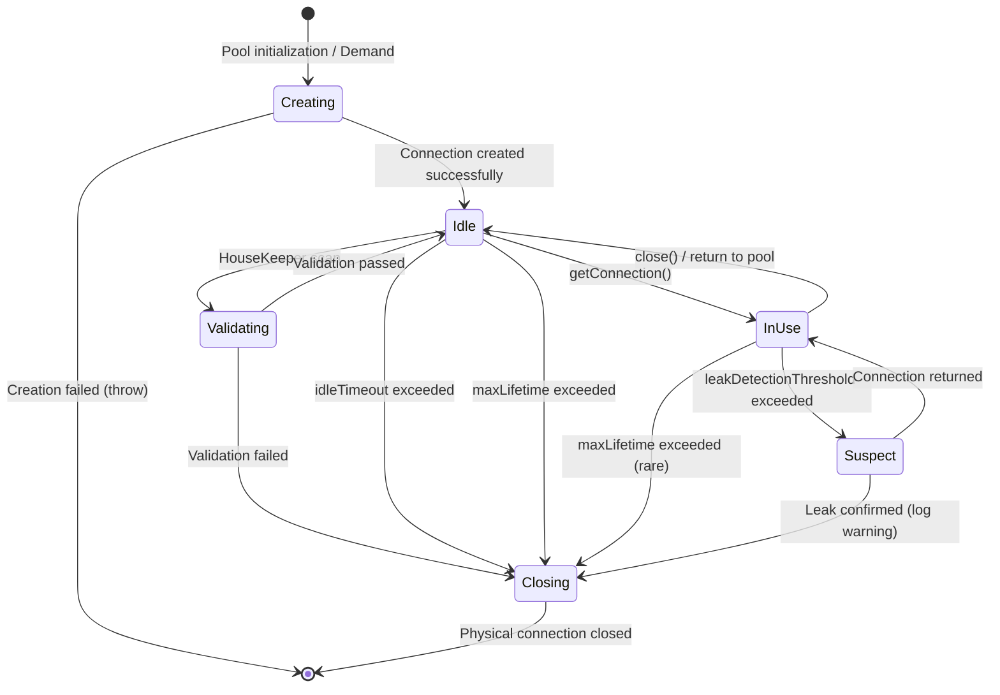

# Connection Pooling - HikariCP, Connection Lifecycle, Pool Sizing

## 1. Mục tiêu của Task

Hiểu sâu cơ chế Connection Pooling trong Java applications, tập trung vào:
- Bản chất vì sao cần connection pooling và chi phí thực sự của việc tạo connection
- Kiến trúc HikariCP - thư viện pooling phổ biến nhất, tại sao nó nhanh
- Vòng đờ connection trong pool và các trạng thái chuyển tiếp
- Chiến lược sizing pool - công thức và thực tế production
- Trade-off giữa resource usage, latency, và throughput

## 2. Bản Chất và Cơ Chế Hoạt Động

### 2.1 Tại Sao Cần Connection Pooling?

Mỗi khi tạo một database connection mới, hệ thống phải thực hiện:

| Bước | Chi phí | Mô tả chi tiết |
|------|---------|----------------|
| TCP Handshake | ~1-3ms (LAN) / 50-150ms (WAN) | 3-way handshake để thiết lập kết nối |
| TLS/SSL Handshake | ~50-200ms | Nếu dùng encryption, thêm 2-RTT |
| Authentication | ~1-5ms | DB server verify credentials, check permissions |
| Connection Setup | ~0.5-2ms | Alloc buffer, init session state, set params |
| **Tổng** | **~3-10ms (LAN)** / **100-350ms (WAN)** | Chưa tính network jitter |

> **Quan trọng**: 5-10ms có vẻ nhỏ, nhưng với 1000 TPS, đó là 5-10 giây CPU time mỗi giây - hoàn toàn wasted.

**Vấn đề sâu hơn**: Không chỉ là latency. Mỗi connection tiêu tốn:
- **Memory**: ~2-5MB trên DB server (PostgreSQL/MySQL buffer per connection)
- **File descriptors**: 1 socket = 1 fd
- **Thread/Process**: Một số DB tạo thread/process mỗi connection
- **CPU cycles**: Maintenance, keep-alive checks

### 2.2 Kiến Trúc HikariCP - Tại Sao Nó Nhanh?

HikariCP được gọi là "zero-overhead" connection pool. Điều này đến từ 3 quyết định kiến trúc cốt lõi:

#### FastList thay vì ArrayList

```java
// FastList - custom implementation của HikariCP
public final class FastList<T> extends ArrayList<T> {
    // Bỏ qua bounds checking trong hot path
    @Override
    public T get(int index) {
        return elementData[index]; // Không check index >= size
    }
    
    @Override
    public boolean remove(Object element) {
        // Tìm từ cuối lên - phổ biến hơn trong pooling
        for (int i = size - 1; i >= 0; i--) {
            if (element == elementData[i]) {
                // Fast remove - swap with last instead of shift
                elementData[i] = elementData[--size];
                elementData[size] = null;
                return true;
            }
        }
        return false;
    }
}
```

**Bản chất**: 
- Bỏ `rangeCheck()` - tiết kiệm ~1-2ns mỗi lần get
- Remove từ cuối lên - thường gặp trong pool (LIFO pattern)
- Fast remove bằng swap - O(1) thay vì O(n) shift

#### ConcurrentBag - Lock-Free Data Structure

HikariCP không dùng `BlockingQueue` hay `LinkedBlockingDeque` như các pool khác. Thay vào đó, dùng custom `ConcurrentBag`:

```
┌─────────────────────────────────────────────────────────┐
│                    ConcurrentBag                        │
├─────────────────────────────────────────────────────────┤
│  ┌──────────────┐    ┌──────────────┐                  │
│  │  SharedList  │    │  ThreadLocal │                  │
│  │  (CopyOnWrite│    │    List      │                  │
│  │   ArrayList) │    │              │                  │
│  └──────┬───────┘    └──────┬───────┘                  │
│         │                   │                           │
│         ▼                   ▼                           │
│  ┌──────────────────────────────────┐                  │
│  │     SynchronousQueue (handoff)   │                  │
│  │   - Dùng cho waiting threads     │                  │
│  │   - Lock-free transfer           │                  │
│  └──────────────────────────────────┘                  │
└─────────────────────────────────────────────────────────┘
```

**Flow lấy connection**:
1. **ThreadLocal** (không lock): Check list local trước - ~99% hit rate
2. **SharedList** (CAS): Nếu local empty, scan shared với CAS
3. **Handoff** (SynchronousQueue): Nếu vẫn empty, block vào queue, chờ connection return

**So sánh chi phí**:
| Pool Type | getConnection() cost | lock contention |
|-----------|---------------------|-----------------|
| Apache DBCP2 | ~50-100ns | High (ReentrantLock) |
| c3p0 | ~200-500ns | Very High (synchronized) |
| Tomcat JDBC | ~30-80ns | Medium |
| **HikariCP** | **~10-20ns** | **Minimal (lock-free)** |

#### House-Keeping Thread

HikariCP có 1 thread duy nhất (`HouseKeeper`) xử lý tất cả:
- Connection validation (background)
- Idle timeout eviction
- Leak detection
- Max lifetime enforcement

```
HouseKeeper (1 thread)
    │
    ├─── every 30s (housekeepingPeriodMs)
    │       │
    │       ├─── Scan pool, identify:
    │       │       - Connections idle > idleTimeout
    │       │       - Connections age > maxLifetime
    │       │       - Connections failed validation
    │       │
    │       └─── Close và remove khỏi pool
    │
    └─── Không block user threads
```

**Quan trọng**: Validation và eviction diễn ra background, không làm chậm `getConnection()`.

### 2.3 Connection Lifecycle Trong Pool



**Chi tiết từng trạng thái**:

| Trạng thái | Mô tả | Chuyển tiếp |
|------------|-------|-------------|
| **Creating** | Đang tạo physical connection | Thành công → Idle, Failed → Exception |
| **Idle** | Sẵn sàng trong pool | getConnection() → InUse, hoặc timeout → Closing |
| **InUse** | Đang được thread sử dụng | close() → Idle, hoặc leak → Suspect |
| **Validating** | Background check connection health | Pass → Idle, Fail → Closing |
| **Closing** | Đang đóng physical connection | → Terminated |
| **Suspect** | Nghi ngờ leak (held > threshold) | Return → Idle, Confirm → Closing |

## 3. Pool Sizing - Công Thức và Thực Tế

### 3.1 Công thức cơ bản (PostgreSQL Wiki)

```
connections = ((core_count * 2) + effective_spindle_count)
```

- **core_count**: Số CPU cores của DB server
- **effective_spindle_count**: Số ổ đĩa (hoặc RAID stripe sets)

**Ví dụ**: 8-core, 4 SSD → (8 × 2) + 4 = **20 connections**

### 3.2 Tại sao công thức này?

Database query thường có 2 phase:
1. **Active**: CPU-bound (parse, plan, hash join, sort)
2. **Waiting**: I/O-bound (disk read/write)

Với connections = 2×cores:
- Khi 1 connection đang I/O wait → core rảnh chạy connection khác
- Tỷ lệ 2:1 đảm bảo CPU không idle nhưng không oversubscribed

> **Quan trọng**: Công thức này cho **DB server** connections, không phải **application pool size**.

### 3.3 Thực tế Production - Little's Law

```
L = λ × W

Trong đó:
- L = Số connections cần thiết (concurrency)
- λ = Arrival rate (requests per second)
- W = Average time per request (seconds)
```

**Ví dụ thực tế**:
- 1000 requests/second (λ)
- Mỗi request dùng connection 50ms (W)
- L = 1000 × 0.05 = **50 connections**

Nhưng đây là **average**. Peak có thể cao hơn 2-3x → pool size = 100-150.

### 3.4 Trade-off Matrix

| Pool Size | Latency (p99) | Throughput | DB Load | Memory | Risk |
|-----------|--------------|------------|---------|--------|------|
| Quá nhỏ (<10) | Cao (queueing) | Thấp | Thấp | Thấp | **Connection wait timeout** |
| Nhỏ (10-20) | Trung bình | Trung bình | Thấp | Thấp | Queueing under load |
| **Vừa (20-50)** | **Thấp** | **Cao** | **Vừa** | **Vừa** | **Balanced** |
| Lớn (50-100) | Thấp | Cao | Cao | Cao | DB contention |
| Quá lớn (>100) | Cao (contention) | Thấp | **Rất cao** | Cao | **DB death spiral** |

> **Anti-pattern**: "Tôi sẽ set pool size = 500 cho chắc" → Đây là cách giết database nhanh nhất.

### 3.5 HikariCP Recommendations

```properties
# Mặc định tốt cho hầu hết ứng dụng
maximumPoolSize=10
minimumIdle=10

# Điều chỉnh theo DB capacity
# Nếu DB có 100 connections limit:
# - 5 app instances × 20 = 100 (không margin)
# - 4 app instances × 20 = 80 (có margin cho admin/maintenance)
```

## 4. Configuration Deep Dive

### 4.1 Các tham số quan trọng

| Property | Default | Ý nghĩa | Khi nào điều chỉnh |
|----------|---------|---------|-------------------|
| `maximumPoolSize` | 10 | Số connection tối đa | Theo DB capacity và app instances |
| `minimumIdle` | 10 | Số connection luôn giữ | Giảm nếu traffic thấp và muốn tiết kiệm resource |
| `idleTimeout` | 600000 (10m) | Thời gian tối đa idle | Giảm nếu muốn release sớm, tăng nếu traffic pattern burst |
| `maxLifetime` | 1800000 (30m) | Tuổi thọ tối đa connection | Theo DB firewall timeout (nên < firewall timeout) |
| `connectionTimeout` | 30000 (30s) | Thời gian chờ connection | Giảm nếu muốn fail fast |
| `validationTimeout` | 5000 (5s) | Thời gian validate | Giảm nếu network ổn định |
| `leakDetectionThreshold` | 0 (off) | Ngưỡng phát hiện leak | Bật = 60000 (60s) trong dev/staging |

### 4.2 Connection Validation

HikariCP hỗ trợ 3 chế độ validation:

```java
// 1. JDBC4 Connection.isValid() - Mặc định, recommended
// Lightweight, driver-native, không cần round-trip

// 2. Custom query - Chỉ khi JDBC4 không đáng tin
config.setConnectionTestQuery("SELECT 1");
// Có network round-trip, chậm hơn ~1-2ms

// 3. No validation - Không khuyến nghị
// Connection dead sẽ fail ở query đầu tiên
```

**Thực tế**: JDBC4 `isValid()` đủ tốt cho 99% trường hợp.

## 5. Rủi Ro và Anti-Patterns

### 5.1 Connection Leaks

**Dấu hiệu**:
- Pool exhausted liên tục
- `connectionTimeout` exceptions
- Connection count tăng dần theo thời gian

**Nguyên nhân phổ biến**:
```java
// 1. Quên close trong exception path
try {
    Connection conn = dataSource.getConnection();
    // ... operation ...
    conn.close(); // Không chạy nếu exception ở trên
} catch (SQLException e) {
    // handle
}

// 2. Sử dụng trong callback async
Connection conn = dataSource.getConnection();
executor.submit(() -> {
    // Sử dụng conn - nhưng conn được giữ trong closure
    // Không biết khi nào task chạy xong
});

// 3. ThreadLocal không remove
private static final ThreadLocal<Connection> connHolder = new ThreadLocal<>();
// Set nhưng không remove() khi xong
```

**Giải pháp**: Dùng try-with-resources
```java
try (Connection conn = dataSource.getConnection()) {
    // ... operation ...
} // Auto-close ngay cả khi exception
```

### 5.2 Oversized Pool

**Triệu chứng**:
- DB CPU 100% nhưng throughput thấp
- High context switching trên DB
- Lock contention trong DB engine

**Nguyên nhân**: Quá nhiều concurrent queries → thrashing.

**Giải pháp**: 
- Giảm pool size
- Thêm read replicas
- Cache ở application layer

### 5.3 Long-Running Transactions

```java
// Anti-pattern: Giữ connection trong thời gian dài
try (Connection conn = dataSource.getConnection()) {
    conn.setAutoCommit(false);
    // ... 100ms processing ...
    // ... call external API (500ms) ...
    // ... 100ms more processing ...
    conn.commit(); // Giữ connection ~700ms
}
```

**Vấn đề**: 1 connection bị chiếm 700ms → giảm effective pool size.

**Giải pháp**:
- External calls trước hoặc sau transaction
- Dùng `TransactionTemplate` với timeout
- Consider Saga pattern cho long business processes

### 5.4 Connection Storm

**Scenario**: Application khởi động với `minimumIdle = maximumPoolSize = 100`

```
App start
    │
    ├─── Tạo 100 connections đồng thời
    │       │
    │       └─── DB server: 100 concurrent connection requests
    │               │
    │               └─── CPU spike, memory pressure
    │               └─── Có thể reject một số connection
    │
    └─── Một số instances fail to start
```

**Giải pháp**:
```properties
# Tắt eager initialization
initializationFailTimeout=-1

# Hoặc tăng dần
minimumIdle=5
maximumPoolSize=100
```

## 6. Khuyến Nghị Thực Chiến

### 6.1 Production Checklist

- [ ] **Pool size**: Tính toán dựa trên DB capacity, không phải "cho chắc"
- [ ] **maxLifetime**: < firewall/DB idle timeout (thường 28-29m nếu firewall timeout = 30m)
- [ ] **leakDetectionThreshold**: Bật ở dev/staging (60s), tắt ở prod (overhead)
- [ ] **Metrics**: Expose pool metrics (active, idle, waiting, timeout rate)
- [ ] **Fail-fast**: `connectionTimeout` = 5-10s (không để user chờ 30s)

### 6.2 Monitoring

**Metrics cần theo dõi**:

```java
// HikariCP expose qua Micrometer/JMX
HikariPoolMXBean poolMXBean = hikariDataSource.getHikariPoolMXBean();

// Key metrics:
poolMXBean.getActiveConnections();   // Đang sử dụng
poolMXBean.getIdleConnections();     // Sẵn sàng
poolMXBean.getPendingThreads();      // Đang chờ connection
poolMXBean.getTotalConnections();    // Tổng hiện có
```

**Alert thresholds**:
- `pendingThreads > 0` liên tục → Pool undersized
- `activeConnections == maximumPoolSize` > 80% thời gian → Cân nhắc tăng pool hoặc optimize query
- `timeoutRate > 0.1%` → Critical, investigate immediately

### 6.3 Multi-Instance Deployment

```
DB Server (max_connections = 200)
    │
    ├─── App Instance 1: poolSize = 20
    ├─── App Instance 2: poolSize = 20
    ├─── App Instance 3: poolSize = 20
    ├─── App Instance 4: poolSize = 20
    └─── App Instance 5: poolSize = 20
    
Total: 100 connections (để 100 cho admin/maintenance)
```

**Lưu ý**: Khi scale horizontally, giảm pool size mỗi instance.

## 7. So Sánh với Các Pool Khác

| Feature | HikariCP | Tomcat JDBC | Apache DBCP2 | c3p0 |
|---------|----------|-------------|--------------|------|
| Performance | ⭐⭐⭐⭐⭐ | ⭐⭐⭐⭐ | ⭐⭐⭐ | ⭐⭐ |
| Memory footprint | ⭐⭐⭐⭐⭐ | ⭐⭐⭐⭐ | ⭐⭐⭐ | ⭐⭐ |
| Configuration simplicity | ⭐⭐⭐⭐⭐ | ⭐⭐⭐⭐ | ⭐⭐⭐ | ⭐⭐ |
| Features (JMX, etc.) | ⭐⭐⭐⭐ | ⭐⭐⭐⭐⭐ | ⭐⭐⭐⭐⭐ | ⭐⭐⭐⭐ |
| Active maintenance | ⭐⭐⭐⭐⭐ | ⭐⭐⭐⭐ | ⭐⭐⭐ | ⭐ |

**Kết luận**: HikariCP là lựa chọn mặc định cho Java applications. Chỉ consider khác nếu cần feature đặc biệt.

## 8. Kết Luận

### Bản chất cốt lõi

Connection pooling là **caching ở tầng connection** - trade-off memory và resource để đổi lấy latency và throughput. Hiểu sai dẫn đến:
- Pool quá nhỏ → Queueing, timeout, user impact
- Pool quá lớn → DB contention, death spiral

### Trade-off quan trọng nhất

| Lựa chọn | Ưu điểm | Nhược điểm |
|----------|---------|------------|
| Pool lớn | Thấp latency, ít wait | DB load cao, contention |
| Pool nhỏ | DB load thấp, ổn định | Có thể queueing |
| Validation thường xuyên | Connection healthy | Overhead |
| Validation ít | Hiệu suất cao | Có thể dùng dead connection |

### Rủi ro lớn nhất trong production

1. **Connection leaks** - Pool exhaustion, cascading failures
2. **Oversized pools** - DB death spiral, không recover được
3. **Không hiểu DB capacity** - Giới hạn connections là hard limit của DB

### Quy tắc vàng

> **"Pool size không phải là magic number - nó là kết quả của capacity planning và load testing."**

1. Bắt đầu nhỏ (10-20), measure, điều chỉnh
2. Luôn để margin cho DB (không dùng 100% connections)
3. Monitor `pendingThreads` - đó là early warning
4. Dùng try-with-resources - không bao giờ leak connection

---

*Research hoàn thành: Connection Pooling - HikariCP, Connection lifecycle, Pool sizing*
