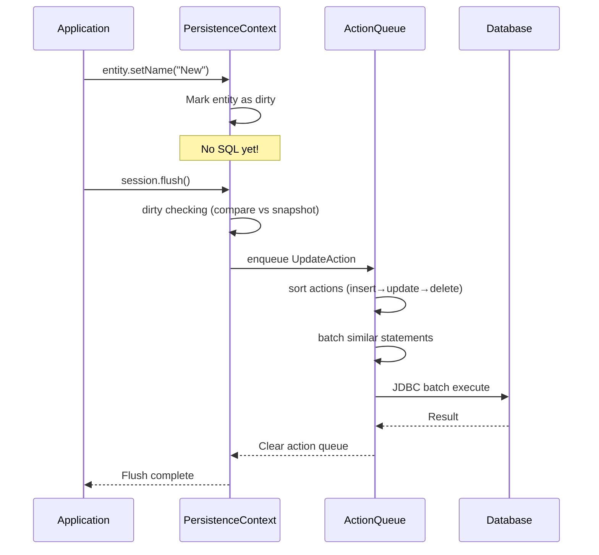
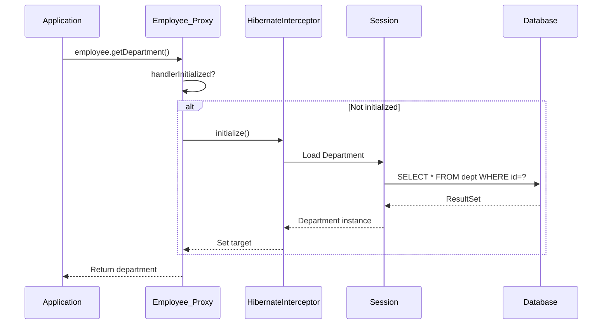
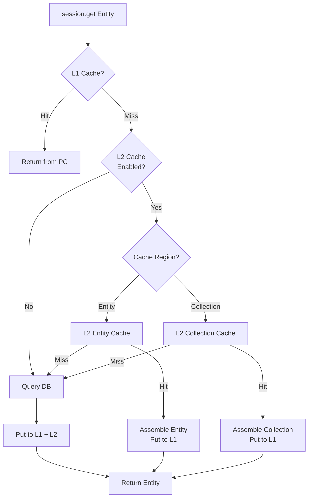

# Hibernate Internals: Session, Cache Levels, Lazy Loading & N+1 Problem

## 1. Mục Tiêu Nghiên Cứu

Hiểu sâu bản chất cơ chế Hibernate ORM, tập trung vào:
- **Session và Persistence Context**: Unit of Work pattern, dirty checking, flush mechanism
- **Cache Architecture**: Two-level caching strategy, coherence guarantees, invalidation
- **Lazy Loading**: Proxy pattern, bytecode instrumentation, session-bound loading
- **N+1 Problem**: Root cause, detection, và các chiến lược mitigation

> **Đọc giả mục tiêu**: Backend developer đã biết Hibernate cơ bản, cần hiểu sâu để tối ưu production systems.

---

## 2. Bản Chất và Cơ Chế Hoạt Động

### 2.1 Session và Persistence Context

#### Unit of Work Pattern

Hibernate Session là implementation của **Unit of Work** pattern - một transactional boundary quản lý tất cả thay đổi đối với database trong một business operation.

```
┌─────────────────────────────────────────────────────────────────┐
│                      PERSISTENCE CONTEXT                         │
│  (HashMap<EntityKey, EntityInstance> - Entity-by-key cache)     │
├─────────────────────────────────────────────────────────────────┤
│                                                                  │
│  EntityKey(Employee, id=1)  →  Employee@7a8d (MANAGED)          │
│  EntityKey(Department, id=5) → Department@3b4c (MANAGED)        │
│  EntityKey(Employee, id=2)  →  Employee@9d2e (REMOVED)          │
│                                                                  │
├─────────────────────────────────────────────────────────────────┤
│  DIRTY CHECKING QUEUE                                            │
│  [Employee@7a8d, Department@3b4c]                               │
├─────────────────────────────────────────────────────────────────┤
│  ACTION QUEUE (Insert/Update/Delete)                            │
│  [Delete(Employee@9d2e), Update(Employee@7a8d)]                 │
└─────────────────────────────────────────────────────────────────┘
                              │
                              ▼
                    ┌─────────────────┐
                    │  JDBC BATCHING  │
                    │  (Statements)   │
                    └─────────────────┘
```

#### Bản Chất Entity Lifecycle

| State | Đặc điểm | Memory location | Identity guarantee |
|-------|----------|-----------------|-------------------|
| **TRANSIENT** | Chưa có ID, chưa attach | Heap (new object) | Không |
| **MANAGED** | Có ID, trong Persistence Context | Persistence Context Map | Có - same reference |
| **DETACHED** | Có ID, không còn trong PC | Heap only | Không |
| **REMOVED** | Đánh dấu xóa, còn trong PC | PC đến khi flush | Có |

> **Quan trọng**: Trong cùng một Session, `session.get(Employee.class, 1L)` gọi 100 lần vẫn trả về **cùng một object reference** - đây là 1st-level cache guarantee.

#### Dirty Checking Mechanism

Hibernate không theo dõi thay đổi real-time. Thay vào đó:

1. **Snapshot tại load time**: Khi entity được load, Hibernate lưu một "snapshot" (array of field values) trong `EntityEntry`
2. **Comparison tại flush time**: So sánh current state vs snapshot
3. **Chỉ update changed fields** (nếu `@DynamicUpdate`)

```java
// Bên trong DefaultFlushEntityEventListener
defaultFlushEntityEventListener.java:

final Object[] currentState = persister.getPropertyValues(entity);
final Object[] loadedState = entry.getLoadedState(); // Snapshot

for (int i = 0; i < propertyCount; i++) {
    if (!types[i].isEqual(loadedState[i], currentState[i])) {
        dirtyProperties[j++] = i; // Mark as dirty
    }
}
```

**Trade-off**:
- **Ưu**: Không overhead khi modify fields, simple mental model
- **Nhược**: Flush time cost tăng với số lượng entities; không biết "what changed" ngay lập tức

#### Flush Modes và Timing

| FlushMode | Khi nào flush | Use case |
|-----------|---------------|----------|
| `ALWAYS` | Mỗi query | Đảm bảo consistency (rất hiếm) |
| `AUTO` | Trước query có thể affected | Default, cân bằng |
| `COMMIT` | Chỉ tại commit | Batch processing, performance |
| `MANUAL` | Chỉ khi `flush()` gọi explicit | Full control (risky) |

> **Pitfall**: `FlushMode.COMMIT` + `@Transactional(readOnly=true)` query vẫn có thể trigger flush nếu có pending changes - `readOnly` không ngăn flush!

---

### 2.2 Cache Architecture

#### Two-Level Caching Strategy

```
┌─────────────────────────────────────────────────────────────────┐
│  REQUEST LAYER                                                  │
│  session.get(Employee.class, 1L)                                │
└─────────────────────────────────────────────────────────────────┘
                              │
                              ▼
┌─────────────────────────────────────────────────────────────────┐
│  L1 CACHE (Session/Persistence Context)                         │
│  ├─ Scope: Session lifetime                                     │
│  ├─ Guarantee: Object identity (== comparison)                 │
│  ├─ Automatic: Yes (always enabled)                            │
│  └─ Invalidation: Session close/clear                          │
└─────────────────────────────────────────────────────────────────┘
                              │ Cache miss
                              ▼
┌─────────────────────────────────────────────────────────────────┐
│  L2 CACHE (SessionFactory/Process Level)                        │
│  ├─ Scope: Application/cluster                                 │
│  ├─ Provider: Caffeine, EhCache, Redis, Infinispan            │
│  ├─ Configurable: Entity, Collection, Query, NaturalId        │
│  └─ Strategy: Read-Write, Read-Only, Nonstrict-Read-Write     │
└─────────────────────────────────────────────────────────────────┘
                              │ Cache miss
                              ▼
┌─────────────────────────────────────────────────────────────────┐
│  DATABASE                                                       │
└─────────────────────────────────────────────────────────────────┘
```

#### L2 Cache Coherence Models

| Strategy | Consistency | Locking | Use Case |
|----------|-------------|---------|----------|
| `READ_ONLY` | Immutable data | None | Reference data, enums |
| `NONSTRICT_READ_WRITE` | Eventual | Soft lock (brief) | Read-heavy, some stale OK |
| `READ_WRITE` | Strong (within JVM) | Pessimistic | Critical data |
| `TRANSACTIONAL` | XA/2PC | JTA coordination | Distributed transactions |

> **Bản chất**: `READ_WRITE` dùng "soft lock" - version field để detect conflict, không phải database lock.

#### Query Cache: Double-Edged Sword

Query cache lưu **kết quả của query** (list of IDs), không phải entities:

```
Query: "FROM Employee WHERE department = 'IT'"
Query Cache: [1, 5, 9, 12]  ← List of IDs

L2 Entity Cache:
  Employee#1 → Employee@proxy1
  Employee#5 → Employee@proxy2
  Employee#9 → Employee@proxy3
  Employee#12 → Employee@proxy4
```

**Vấn đề**: Query cache invalidates **aggressively** - bất kỳ INSERT/UPDATE/DELETE nào trên table đều invalidate toàn bộ cached queries cho entity đó.

> **Anti-pattern**: Query cache cho entity có write frequency cao → cache hit rate ~0%, chỉ tốn memory overhead.

---

### 2.3 Lazy Loading Mechanism

#### Bytecode Enhancement vs Proxy Pattern

Hibernate có 2 cơ chế lazy loading:

| Mechanism | Implementation | When | Characteristics |
|-----------|----------------|------|-----------------|
| **Javassist Proxy** | Subclass at runtime | Default | Entity must be non-final, need no-args constructor |
| **Bytecode Enhancement** | Compile-time weaving | Ant/Maven/Gradle plugin | Final class OK, field-level lazy |

#### Proxy Structure

```java
// Hibernate-generated proxy (runtime subclass)
public class Employee_$$_javassist_0 extends Employee {
    private boolean handlerInitialized = false;
    private LazyInitializer handler;
    
    @Override
    public String getName() {
        if (!handlerInitialized) {
            handler.initialize(); // Triggers SQL SELECT
            handlerInitialized = true;
        }
        return super.getName();
    }
}
```

#### Session-Bound Loading Constraint

> **Rule bất diệt**: Lazy loading chỉ hoạt động khi entity's Session còn **open**.

```
┌─────────────────────────────────────────────────────────────────┐
│  Session Open                                                   │
│  ├─ Load Employee (proxy)                                      │
│  ├─ Access employee.getDepartment()                            │
│  │  └─ Proxy intercepts → SQL SELECT department               │
│  └─ OK                                                         │
└─────────────────────────────────────────────────────────────────┘

┌─────────────────────────────────────────────────────────────────┐
│  Session Closed (hoặc entity detached)                         │
│  ├─ Load Employee (proxy)                                      │
│  ├─ Session.close()                                            │
│  ├─ Access employee.getDepartment()                            │
│  │  └─ LazyInitializationException                            │
│  └─ FAILED                                                     │
└─────────────────────────────────────────────────────────────────┘
```

**Các anti-patterns phổ biến**:
1. **Open Session in View**: Session mở suốt request → connection hogging
2. **Detached entity with lazy fields**: Trả entity qua API, frontend access → crash
3. **DTO conversion with lazy access**: Converter chạy outside transaction

---

### 2.4 N+1 Problem

#### Root Cause Analysis

```
Problem: N+1 SELECT

1st Query: SELECT * FROM employees LIMIT 100        ← 1 query
           Returns 100 Employee proxies

N Queries:  SELECT * FROM departments WHERE id = ?  ← 100 queries
            (1 cho mỗi employee.getDepartment())

Total: 101 queries cho 100 records
```

#### Why It Happens

Default fetch strategy là `FetchType.LAZY` cho `@ManyToOne` và `@OneToMany`:

```java
@Entity
public class Employee {
    @ManyToOne(fetch = FetchType.LAZY)  // Default là LAZY
    private Department department;       // Proxy được inject
}
```

Khi access `employee.getDepartment()` trong loop, mỗi access trigger một SQL SELECT.

#### Detection và Monitoring

**Log pattern detection**:
```
-- N+1 pattern trong logs:
select e1_0.id,e1_0.name from employee e1_0 limit 100;  -- 1 query
select d1_0.id,d1_0.name from department d1_0 where d1_0.id=?; -- x100
```

**Hibernate Statistics**:
```java
Statistics stats = sessionFactory.getStatistics();
long queryCount = stats.getQueryExecutionCount();
long entityLoadCount = stats.getEntityLoadCount();
```

> **Metric**: Nếu `queryCount` >> `entityLoadCount / batchSize`, nghi ngờ N+1.

---

## 3. Kiến Trúc và Luồng Xử Lý

### 3.1 Session Flush Flow



### 3.2 Lazy Loading Interception



### 3.3 L2 Cache Lookup Flow



---

## 4. So Sánh và Lựa Chọn

### 4.1 Fetch Strategies

| Strategy | SQL Pattern | Memory | Use Case |
|----------|-------------|--------|----------|
| **LAZY** | N+1 queries (if not careful) | Low | Default, navigation sparse |
| **EAGER (JOIN)** | 1 query with JOIN | Medium | Always need association |
| **EAGER (SELECT)** | 2 queries | Medium | Separate queries acceptable |
| **BATCH** | 1 + (N/batch_size) | Low-Medium | Balance |
| **SUBSELECT** | 2 queries total | Medium | Collection of collections |

### 4.2 Caching Strategies Comparison

```
┌─────────────────┬─────────────┬─────────────┬─────────────┬─────────────┐
│    Strategy     │  Latency    │ Consistency │  Complexity │   Cost      │
├─────────────────┼─────────────┼─────────────┼─────────────┼─────────────┤
│ No L2 Cache     │  High       │ Perfect     │  Low        │  DB CPU     │
│ L2 - ReadOnly   │  Very Low   │ Immutable   │  Low        │  Memory     │
│ L2 - NonStrict  │  Low        │ Eventual    │  Medium     │  Memory     │
│ L2 - ReadWrite  │  Low        │ Strong      │  Medium     │  Memory+CPU │
│ L2 - QueryCache │  Variable   │ Weak        │  High       │  Memory     │
└─────────────────┴─────────────┴─────────────┴─────────────┴─────────────┘
```

---

## 5. Rủi Ro, Anti-Patterns và Lỗi Thường Gặp

### 5.1 Critical Anti-Patterns

#### 1. Session-per-Operation
```java
// ANTI-PATTERN
for (Long id : employeeIds) {
    Employee e = sessionFactory.openSession().get(Employee.class, id);
    // Each iteration: new Session, no L1 cache benefit
}
```

#### 2. Unbounded Persistence Context
```java
// ANTI-PATTERN - Memory leak
for (int i = 0; i < 1000000; i++) {
    Employee e = new Employee();
    session.save(e);
    // Persistence Context grows unbounded
}
// Solution: session.flush() + session.clear() every N iterations
```

#### 3. Lazy Loading in DTO Mapping
```java
// ANTI-PATTERN
transactional
public EmployeeDTO getEmployee(Long id) {
    Employee e = employeeRepository.findById(id);
    return mapper.map(e, EmployeeDTO.class); // Crash if DTO access lazy fields
}
```

### 5.2 N+1 Mitigation Strategies

| Strategy | Implementation | Trade-off |
|----------|----------------|-----------|
| **JOIN FETCH** | `JOIN FETCH e.department` | Cartesiản product risk với multiple collections |
| **Entity Graph** | `@NamedEntityGraph` | Compile-time, type-safe |
| **Batch Loading** | `@BatchSize(size=50)` | Extra queries nhưng bounded |
| **Subselect** | `@Fetch(FetchMode.SUBSELECT)` | 2 queries, good for nested collections |
| **Explicit fetch** | Separate query for collection | Manual, explicit |

> **Best Practice**: Thường JOIN FETCH cho single association, Batch Loading cho collections.

### 5.3 Cache Stampede Prevention

Cache stampede xảy ra khi cache miss đồng loạt:

```
T0: Cache expires
T1: 1000 requests → cache miss → 1000 DB queries
```

**Solutions**:
1. **External locking**: Lock trước khi query DB
2. **Probabilistic early expiration**: Expire ngẫu nhiên trước TTL
3. **Warmup**: Pre-populate cache trước expiration

---

## 6. Khuyến Nghị Production

### 6.1 Configuration Checklist

```properties
# Connection & Pooling
hibernate.connection.pool_size=20
hibernate.connection.isolation=READ_COMMITTED

# Batching
hibernate.jdbc.batch_size=50
hibernate.order_inserts=true
hibernate.order_updates=true
hibernate.jdbc.batch_versioned_data=true

# Statistics & Monitoring
hibernate.generate_statistics=true
hibernate.session.events.log.LOG_QUERIES_SLOWER_THAN_MS=100

# Cache
hibernate.cache.use_second_level_cache=true
hibernate.cache.use_query_cache=true
hibernate.cache.region.factory_class=org.hibernate.cache.jcache.JCacheRegionFactory
```

### 6.2 Monitoring Metrics

| Metric | Alert Threshold | Meaning |
|--------|-----------------|---------|
| Query execution count / request | > 10 | Potential N+1 |
| L2 cache hit ratio | < 80% | Cache config issue |
| Entity load time p99 | > 50ms | Slow queries |
| Dirty check time | > 10ms/session | Too many entities in PC |
| Flush entity count | > 1000 | Unbounded PC |

### 6.3 Modern Java (21+) Considerations

- **Virtual Threads**: Hibernate 6.2+ compatible, nhưng vẫn cần chú ý connection pool sizing
- **Records**: Không thể dùng làm @Entity (cần mutable), nhưng OK cho DTO projections
- **SequencedCollections**: Hibernate 6.4+ tận dụng cho `@OrderColumn` optimization

---

## 7. Kết Luận

### Bản Chất Tóm Tắt

1. **Session là Unit of Work**: Persistence Context đảm bảo object identity và track changes thông qua snapshot comparison. Đây là abstraction quan trọng để ORM hoạt động transparent.

2. **Caching là Trade-off**: L1 cache = object identity (bắt buộc), L2 cache = performance (optional nhưng cần careful configuration). Query cache thường ít giá trị hơn entity cache.

3. **Lazy Loading là Session-Bound**: Proxy pattern + bytecode generation cho phép deferred loading, nhưng constraint là Session phải open. Đây là nguyên nhân chính của `LazyInitializationException`.

4. **N+1 là Tốn Kém Nhưng Dễ Tránh**: Root cause là mismatched fetch strategy với access pattern. JOIN FETCH, Batch Loading, và Entity Graph là các công cụ để optimize.

### Quyết Định Kiến Trúc

| Scenario | Recommendation |
|----------|----------------|
| Read-heavy, reference data | L2 Cache (ReadOnly) + LAZY |
| Write-heavy, critical data | No L2 Cache + EAGER (if always needed) |
| Complex queries | Query cache OFF, optimize SQL instead |
| Microservices | Careful with entity graph boundaries, prefer DTO projections |
| High concurrency | Monitor cache stampede, consider external cache |

### Tư Duy Senior

> Hibernate là **leaky abstraction**. Nó giấu SQL nhưng không giấu được performance characteristics. Hiểu **khi nào** nó tạo ra SQL nào là kỹ năng quan trọng hơn viết HQL/JPQL đúng cú pháp.

> **Golden Rule**: Luôn xem SQL generated trong development. Công cụ: `spring.jpa.show-sql=true`, datasource-proxy, hoặc Hibernate Statistics.

---

*Research completed: 2026-03-28*
*Target audience: Senior Backend Engineers transitioning to Expert level*
