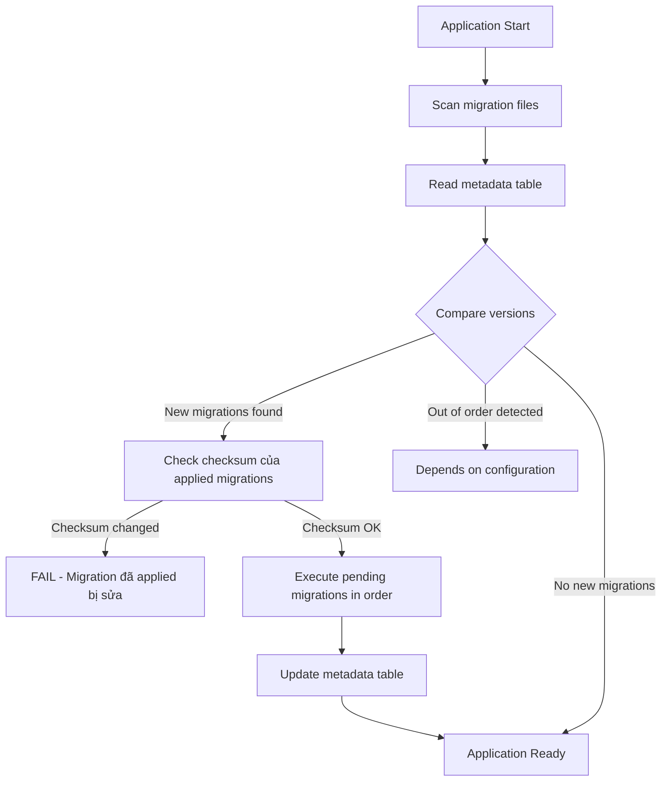
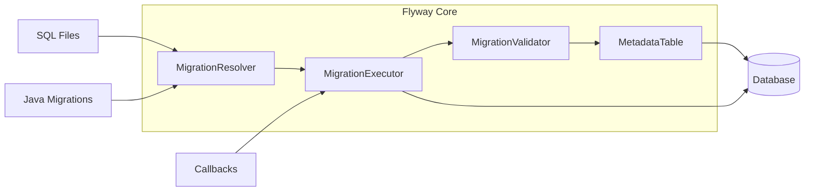
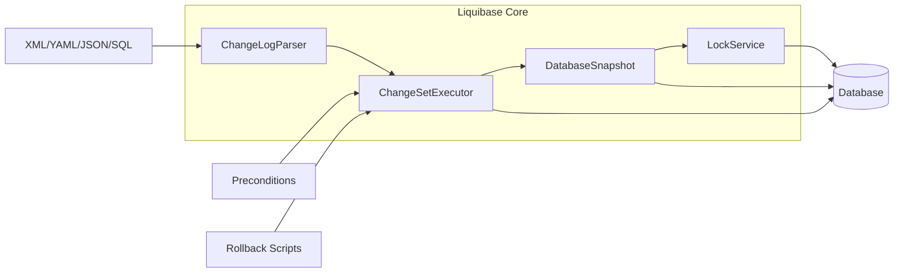
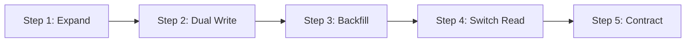

# Database Migration: Flyway, Liquibase & Versioning Strategies

## 1. Mục tiêu của Task

Hiểu sâu bản chất database migration: tại sao cần migration thay vì schema management thủ công, các chiến lược versioning khác nhau, cơ chế hoạt động bên trong của Flyway và Liquibase, và cách vận hành migration trong production với zero-downtime deployments.

## 2. Bản Chất và Cơ Chế Hoạt Động

### 2.1 Tại sao cần Database Migration?

**Bài toán cốt lõi:** Schema database và application code phải đồng bộ. Khi code thay đổi (deploy), schema có thể cần thay đổi theo.

**Không dùng migration = Manual Schema Management:**
```
Developer A thêm cột mới → chạy ALTER TABLE trên local
Developer B tạo bảng mới → chạy CREATE TABLE trên local
Deploy lên production → "Ai nhớ chạy script gì?"
→ Lỗi, downtime, data loss
```

**Migration giải quyết vấn đề:**
- **Version Control cho Schema:** Schema là code, được version cùng application
- **Repeatability:** Cùng một version → cùng một schema, mọi environment
- **Audit Trail:** Biết ai thay đổi gì, khi nào, tại sao
- **Rollback Capability:** Khôi phục về trạng thái trước đó

### 2.2 Cơ Chế Hoạt động Cốt lõi

Tất cả migration tools đều dựa trên **Migration Metadata Table**:

```sql
-- Flyway: flyway_schema_history
-- Liquibase: databasechangelog

CREATE TABLE flyway_schema_history (
    installed_rank INT PRIMARY KEY,
    version VARCHAR(50),
    description VARCHAR(200),
    type VARCHAR(20),
    script VARCHAR(1000),
    checksum BIGINT,        -- ← Quan trọng: phát hiện thay đổi
    installed_by VARCHAR(100),
    installed_on TIMESTAMP,
    execution_time INT,
    success BOOLEAN
);
```

**Luồng xử lý khi application start:**



**Bản chất checksum:** Đảm bảo immutability của migration history. Nếu migration đã chạy bị sửa đổi → FAIL. Điều này ngăn:
- Developer sửa lỗi trong migration đã deploy
- Environment drift (dev khác production)
- Non-repeatable deployments

### 2.3 Versioning Strategies

#### **Sequential Versioning (Flyway mặc định)**
```
V1__Initial_schema.sql
V2__Add_user_table.sql
V3__Add_email_index.sql
```

**Cơ chế:** Simple integer sequence. Mỗi file = một version.

**Trade-offs:**
| Ưu điểm | Nhược điểm |
|---------|------------|
| Đơn giản, dễ hiểu | Merge conflict khi nhiều developer cùng thêm migration |
| Thứ tự rõ ràng | Không thể insert version giữa (V1 → V3, bỏ V2?) |
| Checksum validation chặt | Hotfix khó khăn khi cần "quay lại" |

**Conflict resolution:** Team phải thống nhất ai "lấy" version number tiếp theo, hoặc dùng timestamp.

#### **Timestamp Versioning**
```
V20240328072300__Add_user_table.sql
V20240328081530__Add_email_index.sql
```

**Giải quyết:** Merge conflict vì timestamp gần như unique.

**Vấn đề mới:** 
- Khó đọc thứ tự logic
- Các migration độc lập về mặt logic có thể có timestamp "sai" thứ tự
- Khó quản lý trong đầu

#### **Semantic Versioning (Liquibase)**
```xml
<changeSet id="1" author="developer1">
<changeSet id="2" author="developer2">
```

**Không phụ thuộc vào thứ tự file** mà dựa vào `id` + `author` + `md5sum`.

**Ưu điểm lớn:** Có thể có nhiều changeset trong cùng file, merge dễ dàng hơn.

### 2.4 Migration Types

**Versioned Migration (Stateful):**
- Thay đổi schema có trạng thái (CREATE, ALTER, DROP)
- Chạy **một lần duy nhất**
- Có thể rollback

**Repeatable Migration (Stateless):**
- Không thay đổi schema (CREATE OR REPLACE VIEW, PROCEDURE, FUNCTION)
- Chạy lại mỗi khi checksum thay đổi
- Thường dùng cho: Views, Stored Procedures, Triggers, Reference data

```
R__Create_user_stats_view.sql
R__Update_calculate_price_function.sql
```

**Khác biệt cốt lõi:**
```
Versioned: ALTER TABLE users ADD COLUMN age INT;  -- Chạy 1 lần
Repeatable: CREATE OR REPLACE VIEW active_users AS...;  -- Chạy lại khi sửa
```

## 3. Kiến trúc và Luồng Xử Lý

### 3.1 Flyway Architecture



**Thành phần chính:**

1. **MigrationResolver:** Tìm và parse migration files
   - Support: SQL, Java (JavaMigration interface)
   - Pattern matching: V{version}__{description}.sql
   - Placeholder replacement: ${table_prefix}users → app_users

2. **MigrationExecutor:** Thực thi migration
   - Transaction management (mặc định: 1 migration = 1 transaction)
   - Error handling và rollback
   - Connection pooling integration

3. **MigrationValidator:** Kiểm tra tính hợp lệ
   - Checksum validation
   - Version ordering
   - Missing migrations detection

4. **MetadataTable:** Theo dõi trạng thái
   - Đã chạy migration nào
   - Checksum để phát hiện thay đổi
   - Execution time để monitor

### 3.2 Liquibase Architecture



**Điểm khác biệt cốt lõi:**

| Flyway | Liquibase |
|--------|-----------|
| SQL-first approach | Abstract model (XML/YAML/JSON) |
| Mỗi file = 1 migration | Nhiều changeset trong 1 file |
| Rollback phải viết thủ công | Tự động generate rollback (hạn chế) |
| Đơn giản, ít learning curve | Nhiều tính năng, phức tạp hơn |
| Checksum file-based | MD5 của changeset |

### 3.3 Liquibase ChangeLog Model

```xml
<?xml version="1.0" encoding="UTF-8"?>
<databaseChangeLog>
    <changeSet id="1" author="alice">
        <preConditions onFail="MARK_RAN">
            <not><tableExists tableName="users"/></not>
        </preConditions>
        <createTable tableName="users">
            <column name="id" type="BIGINT" autoIncrement="true">
                <constraints primaryKey="true"/>
            </column>
        </createTable>
        <rollback>
            <dropTable tableName="users"/>
        </rollback>
    </changeSet>
</databaseChangeLog>
```

**Bản chất của XML model:**
- **Database-agnostic:** Cùng changelog chạy được trên MySQL, PostgreSQL, Oracle
- **Abstract syntax:** Liquibase translate sang native SQL
- **Preconditions:** Kiểm tra trước khi chạy, tránh lỗi idempotent
- **Rollback:** Declarative rollback (nhưng không phải lúc nào cũng hoàn hảo)

## 4. So Sánh Chi Tiết: Flyway vs Liquibase

### 4.1 Feature Comparison

| Feature | Flyway | Liquibase | Winner |
|---------|--------|-----------|--------|
| **Ease of use** | ★★★★★ | ★★★☆☆ | Flyway |
| **SQL-native** | Yes | Optional | Flyway |
| **Multi-database support** | Good | Excellent | Liquibase |
| **Rollback** | Manual only | Auto + Manual | Liquibase |
| **Conditional logic** | Limited | Rich (preconditions) | Liquibase |
| **Programmatic API** | Good | Good | Tie |
| **Maven/Gradle integration** | Excellent | Excellent | Tie |
| **Spring Boot support** | Native | Via starter | Flyway |
| **Community/Enterprise** | Both | Both | Tie |

### 4.2 Use Case Analysis

**Chọn Flyway khi:**
- Team chỉ dùng 1-2 loại database
- Thích SQL-first, không muốn abstraction
- Cần đơn giản, dễ onboard
- Spring Boot project
- Không cần rollback phức tạp

**Chọn Liquibase khi:**
- Multi-database environment
- Cần conditional logic phức tạp
- Rollback tự động quan trọng
- Cần database-agnostic model
- Enterprise với nhiều constraints

### 4.3 Performance So Sánh

**Startup overhead:**
```
Flyway: ~50-100ms (scan files + validate checksums)
Liquibase: ~100-200ms (parse XML + validate)
```

**Không đáng kể** cho hầu hết applications. Điểm quan trọng là **migration execution time**, phụ thuộc vào SQL complexity, không phải tool.

## 5. Rủi Ro, Anti-patterns và Lỗi Thường Gặp

### 5.1 Critical Failures

#### **1. Modifying Applied Migration (Checksum Mismatch)**

```
Production: V3__Add_column.sql đã chạy
Developer: Sửa V3__Add_column.sql trên local để "fix lỗi"
Deploy: FAIL - Checksum mismatch
```

**Giải pháp:** NEVER modify applied migration. Luôn tạo migration mới.

#### **2. Long-Running Migration giữa Deployment**

```sql
-- V5__Add_index_on_large_table.sql
CREATE INDEX CONCURRENTLY idx_orders_user_id ON orders(user_id);
-- Table có 100M rows → Mất 30 phút
```

**Vấn đề:** 
- Deployment timeout
- Application không start
- Kubernetes pod killed → Migration incomplete

**Giải pháp:**
```sql
-- Dùng CONCURRENTLY (PostgreSQL) hoặc ONLINE (SQL Server)
-- Hoặc: Chạy migration riêng, không trong deployment pipeline
```

#### **3. Data Migration Without Transaction Control**

```sql
-- Xóa 10M records trong 1 transaction
DELETE FROM old_logs WHERE created_at < '2023-01-01';
-- → Table lock, rollback segment explosion
```

**Giải pháp:**
```sql
-- Batch processing
DELETE FROM old_logs 
WHERE id IN (SELECT id FROM old_logs WHERE created_at < '2023-01-01' LIMIT 10000);
-- Chạy nhiều lần cho đến khi hết
```

### 5.2 Anti-patterns

#### **Anti-pattern 1: Shared Database với Multiple Apps**

```
App A: V1__Create_users.sql
App B: V1__Create_orders.sql  
→ Conflict! Cùng version number, khác nội dung
```

**Giải pháp:** Schema separation hoặc prefix version: `V2024_appA_1`, `V2024_appB_1`

#### **Anti-pattern 2: Data Seeding trong Migration**

```sql
-- V5__Seed_admin_user.sql
INSERT INTO users (email, password) VALUES ('admin@company.com', 'hashed_password');
```

**Vấn đề:**
- Password là secret, không nên trong VCS
- Data seeding nên dùng application logic hoặc environment-specific config

**Giải pháp:** Dùng `R__` (Repeatable) cho reference data, hoặc separate seeding tool.

#### **Anti-pattern 3: Không có Baseline**

```
Database production đã tồn tại từ trước khi dùng migration
Bắt đầu dùng Flyway → "Table already exists" error
```

**Giải pháp:** Baseline migration
```bash
flyway baseline -baselineVersion=1 -baselineDescription="Existing schema"
```

### 5.3 Edge Cases

#### **Concurrent Migration (Race Condition)**

Khi multiple instances khởi động cùng lúc (Kubernetes Deployment với 3 replicas):

```
Pod 1: SELECT * FROM flyway_schema_history → No pending migrations
Pod 2: SELECT * FROM flyway_schema_history → No pending migrations  
Pod 1: INSERT new migration
Pod 2: INSERT new migration → Duplicate key exception!
```

**Giải pháp:** Advisory lock hoặc table lock

**Flyway:** Tự động dùng advisory lock (PostgreSQL) hoặc table lock
**Liquibase:** `databasechangeloglock` table

```sql
-- Liquibase lock table
CREATE TABLE databasechangeloglock (
    id INT PRIMARY KEY,
    locked BOOLEAN,
    lockgranted TIMESTAMP,
    lockedby VARCHAR(255)
);
-- Chỉ 1 process có thể lock và chạy migration
```

## 6. Khuyến Nghị Thực Chiến trong Production

### 6.1 Zero-Downtime Migration Strategy

**Expand-Contract Pattern:**



**Ví dụ: Đổi cột `phone` từ VARCHAR sang JSON để hỗ trợ nhiều số:**

**Step 1 - Expand (Migration 1):**
```sql
ALTER TABLE users ADD COLUMN phone_data JSONB;
```

**Step 2 - Dual Write (Application Code):**
```java
// Ghi vào cả 2 cột
user.setPhone(phone);
user.setPhoneData(toJson(phone));
userRepository.save(user);
```

**Step 3 - Backfill (Migration 2):**
```sql
UPDATE users SET phone_data = to_jsonb(phone) WHERE phone_data IS NULL;
```

**Step 4 - Switch Read (Application Code):**
```java
// Đọc từ cột mới
return fromJson(user.getPhoneData());
```

**Step 5 - Contract (Migration 3):**
```sql
ALTER TABLE users DROP COLUMN phone;
```

**Timeline:** Có thể mất 1-2 weeks giữa các bước để đảm bảo safety.

### 6.2 Migration Sizing Guidelines

| Migration Type | Max Duration | Strategy |
|---------------|--------------|----------|
| DDL (CREATE, ALTER) | < 5 seconds | Chạy trong deployment |
| DDL với large table | > 5 seconds | Online DDL hoặc gh-ost/pt-online-schema-change |
| DML (data update) | < 30 seconds | Chạy trong deployment |
| DML với nhiều records | > 30 seconds | Batch job riêng, không trong migration |

### 6.3 Monitoring và Observability

**Metrics cần track:**

```yaml
# Flyway metrics via Micrometer
flyway.pending: Số migration đang chờ
flyway.success: Số migration thành công
flyway.failed: Số migration thất bại
flyway.execution.time: Thời gian chạy migration
```

**Health check:**
```java
@Component
public class MigrationHealthIndicator implements HealthIndicator {
    @Autowired
    private Flyway flyway;
    
    @Override
    public Health health() {
        var info = flyway.info();
        var pending = info.pending().length;
        
        if (pending > 0) {
            return Health.down()
                .withDetail("pending_migrations", pending)
                .build();
        }
        return Health.up().build();
    }
}
```

### 6.4 CI/CD Integration

**Pipeline stages:**

```yaml
stages:
  - migration-validate  # Chỉ validate, không chạy
  - migration-test      # Chạy trên test DB
  - deploy              # Chạy trên production

migration-validate:
  script:
    - flyway validate -url=jdbc:h2:mem:testdb
  
migration-test:
  script:
    - flyway migrate -url=$TEST_DB_URL
    
# Production: migration chạy trong application startup
# hoặc separate init container trong Kubernetes
```

**Kubernetes Init Container Pattern:**

```yaml
apiVersion: apps/v1
kind: Deployment
spec:
  template:
    spec:
      initContainers:
        - name: db-migration
          image: myapp:latest
          command: ["flyway", "migrate"]
          env:
            - name: FLYWAY_URL
              valueFrom: { secretKeyRef: { name: db-secret, key: url } }
      containers:
        - name: app
          image: myapp:latest
          # App chỉ start sau khi migration xong
```

**Ưu điểm:** App không start nếu migration fail.
**Nhược điểm:** Deployment chậm hơn (phải đợi migration).

### 6.5 Backup Strategy

**Trước khi chạy migration production:**

```bash
# 1. Logical backup (structure + data)
pg_dump -h prod-db -U admin mydb > backup_$(date +%Y%m%d_%H%M%S).sql

# 2. Hoặc snapshot (nếu cloud)
aws rds create-db-snapshot \
  --db-instance-identifier mydb \
  --db-snapshot-identifier pre-migration-$(date +%s)

# 3. Chạy migration
flyway migrate

# 4. Verify
flyway info
flyway validate
```

### 6.6 Team Workflow

**Branching Strategy:**

```
main: production migrations
  ↓
feature/add-user-profile: V8__Add_profile_table.sql
  ↓  
feature/add-order-index: V9__Add_order_index.sql (after merge V8)
  ↓
main: V8, V9 (sequential)
```

**Quy tắc:** 
- Mỗi PR chỉ chứa 1 migration (hoặc related migrations)
- Version number phải sequential
- Review migration như review code (không chỉ review Java, phải review SQL)

## 7. Kết Luận

### Bản Chất cốt lõi của Database Migration

1. **Schema as Code:** Database schema là code, version-controlled, reviewable, repeatable
2. **Immutability:** Migration đã chạy không được sửa → đảm bảo consistency
3. **Ordering:** Thứ tự execution là deterministic, không thể tùy tiện
4. **Safety:** Mọi thay đổi production phải có rollback plan

### Trade-off quan trọng nhất

**Simplicity (Flyway) vs Flexibility (Liquibase):**

- Flyway: "Đủ tốt" cho 80% use cases, dễ onboard, ít surprise
- Liquibase: Power user tool, cần learning curve nhưng linh hoạt hơn

### Rủi ro lớn nhất trong Production

**Long-running migration blocking deployment** → Solution: Separate heavy migrations, dùng online schema change tools, hoặc expand-contract pattern.

### Khi nào dùng gì

| Tình huống | Khuyến nghị |
|-----------|-------------|
| Startup nhỏ, Spring Boot | Flyway |
| Enterprise, multi-database | Liquibase |
| Zero-downtime requirement cao | Either + expand-contract pattern |
| Cần rollback tự động | Liquibase |
| Team thích SQL | Flyway |
| Cần conditional logic phức tạp | Liquibase |

### Tư duy quan trọng

> Migration không phải là "chạy SQL để thay đổi schema". Migration là "quản lý sự thay đổi của database trong suốt vòng đời application".

Hãy đối xử với migration như production code: review, test, monitor, và có rollback plan.
