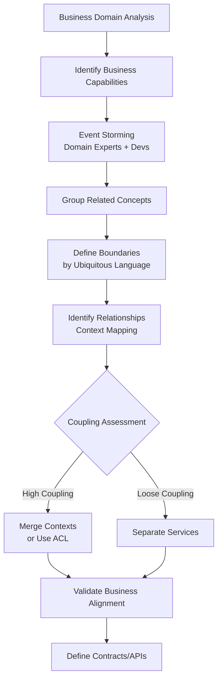

# Service Decomposition - Domain-Driven Design & Bounded Contexts

## 1. Mục tiêu của task

Hiểu sâu bản chất của việc phân tách service trong kiến trúc Microservices thông qua Domain-Driven Design (DDD), tập trung vào:
- Bản chất của Bounded Context và Subdomain
- Cơ chế xác định ranh giới service
- Trade-off khi phân tách service
- Anti-patterns và rủi ro production
- Chiến lược migration từ monolith

---

## 2. Bản chất và cơ chế hoạt động

### 2.1 Domain-Driven Design (DDD) - Tư duy cốt lõi

DDD không phải là framework hay library. Đây là **tư duy thiết kế** tập trung vào việc:
- **Model hóa business domain** thay vì model hóa database schema
- **Ubiquitous Language**: Dùng chung ngôn ngữ giữa domain experts và developers
- **Strategic Design**: Xác định ranh giới và mối quan hệ giữa các phần của hệ thống

> **Quan trọng**: DDD giải quyết vấn đề **complexity inherent trong business logic**, không phải complexity từ kỹ thuật (scaling, latency, throughput).

### 2.2 Bounded Context - Đơn vị phân tách cốt lõi

**Bản chất**: Bounded Context là **ranh giới ngữ nghĩa (semantic boundary)** trong đó một domain model nhất định có ý nghĩa và áp dụng được.

```
┌─────────────────────────────────────────────────────────────┐
│                     E-commerce System                        │
├─────────────────────────────────────────────────────────────┤
│  ┌──────────────┐  ┌──────────────┐  ┌──────────────┐      │
│  │   Catalog    │  │    Order     │  │   Payment    │      │
│  │   Context    │  │   Context    │  │   Context    │      │
│  │              │  │              │  │              │      │
│  │ Product.id   │  │ Order.id     │  │ Transaction  │      │
│  │ Product.name │  │ Order.total  │  │ PaymentMethod│      │
│  │ Price.amount │  │ Order.status │  │ FraudCheck   │      │
│  └──────────────┘  └──────────────┘  └──────────────┘      │
│                                                             │
│  → Mỗi Context có model riêng, database riêng (thường)     │
│  → Product trong Catalog ≠ Product trong Order (khái niệm) │
└─────────────────────────────────────────────────────────────┘
```

**Ví dụ cụ thể**: Thuật ngữ "Product"
- Trong **Catalog Context**: Product có attributes (name, description, images, specs)
- Trong **Pricing Context**: Product có (basePrice, discounts, currency, taxRules)
- Trong **Inventory Context**: Product có (SKU, quantity, warehouse, reorderLevel)
- Trong **Shipping Context**: Product có (weight, dimensions, fragile, hazmat)

> **Đây không phải là duplication!** Mỗi context model hóa một khía cạnh khác nhau của cùng một thực thể ngoài đờithực.

### 2.3 Subdomain - Phân loại business capability

Eric Evans phân chia domain thành 3 loại:

| Subdomain Type | Đặc điểm | Ví dụ | Chiến lược |
|---------------|----------|-------|------------|
| **Core Domain** | Competitive advantage, complex business rules | Recommendation engine, Pricing algorithm | In-house, best engineers, DDD nghiêm ngặt |
| **Supporting Domain** | Cần thiết nhưng không phân biệt | Inventory management, User profiles | In-house hoặc outsource, DDD nhẹ |
| **Generic Domain** | Commodity, solved problem | Authentication, Payment processing, Email | Mua/Buy off-the-shelf, không DDD |

**Mối quan hệ**: 
```
Business Domain (toàn bộ lĩnh vực kinh doanh)
    ├── Core Subdomain 1 → Bounded Context A
    ├── Core Subdomain 2 → Bounded Context B  
    ├── Supporting Subdomain 3 → Bounded Context C
    └── Generic Subdomain 4 → External Service / SaaS
```

> **Nguyên tắc vàng**: Không mọi Bounded Context đều là Microservice. Một service có thể chứa nhiều context nếu coupling cao.

### 2.4 Context Mapping - Mối quan hệ giữa các Context

Các pattern kết nối bounded contexts:

**Upstream-Downstream Relationship**:
```
Upstream (Supplier) ──────► Downstream (Consumer)
    (định nghĩa model)       (phụ thuộc model)
```

**Integration Patterns**:

| Pattern | Khi nào dùng | Trade-off |
|---------|-------------|-----------|
| **Partnership** | 2 teams cùng phát triển, cần phối hợp chặt | Linh hoạt nhưng coordination cost cao |
| **Customer-Supplier** | Clear owner, consumer có tiếng nói | Cần negotiation, release coordination |
| **Conformist** | Consumer chấp nhận model của supplier nguồn | Đơn giản nhưng bị lock-in model |
| **Anti-Corruption Layer (ACL)** | Model upstream không phù hợp, cần bảo vệ domain | Complexity + latency, nhưng bảo vệ domain purity |
| **Open Host Service** | Cung cấp API công khai cho nhiều consumers | Tốn effort maintain backward compatibility |
| **Published Language** | Shared model/contract (protobuf, OpenAPI) | Cần versioning strategy rõ ràng |
| **Separate Ways** | Không cần integration, duplicate functionality có thể chấp nhận | Duplication nhưng decoupling tuyệt đối |
| **Big Ball of Mud** | Legacy system không thể refactor | Technical debt cao, cần strangler fig pattern |

---

## 3. Kiến trúc và luồng phân tách

### 3.1 Quy trình xác định Bounded Context



### 3.2 Heuristics xác định service boundaries

**The Single Responsibility Principle (SRP) cho Services**:
> "A service should have only one reason to change, and that reason should be a business reason."

**Các heuristic thực tế**:

1. **Business Capability Alignment**: Service = một business capability
   - Order Management, Payment Processing, Inventory, Shipping

2. **Change Cohesion**: Những gì thay đổi cùng nhau thì nên ở cùng nhau
   - Nếu thay đổi pricing logic luôn kéo theo thay đổi promotion → có thể cùng service

3. **Team Autonomy**: Một team có thể own và deploy độc lập
   - Conway's Law: "Organizations design systems that mirror their communication structure"

4. **Data Ownership**: Service owns data của nó
   - Không cho phép service khác truy cập DB trực tiếp → chỉ qua API

5. **Transaction Boundary**: Nếu cần ACID transaction → có thể nên chung service
   - Distributed transaction là complexity cao

### 3.3 Các chiến lược decomposition

**Decompose by Business Capability** (Khuyến nghị):
```
E-commerce
├── Product Catalog Service
├── Shopping Cart Service  
├── Order Service
├── Payment Service
├── Shipping Service
├── User Service
└── Notification Service
```

**Decompose by Subdomain** (DDD purist):
```
Domain: Ride Hailing
├── Matching Context (Core)
├── Pricing Context (Core)  
├── Payment Context (Generic → Stripe)
├── Identity Context (Generic → Auth0)
└── Notification Context (Supporting)
```

**Decompose by Entity** (Anti-pattern cần tránh):
```
❌ Đừng làm thế này:
├── Product Service
├── Order Service
├── User Service
→ Quá granular, chatty communication
```

---

## 4. So sánh các chiến lược

### 4.1 Monolith vs Microservices trade-off

| Aspect | Modular Monolith | Microservices |
|--------|-----------------|---------------|
| **Deployment** | Single unit, coordinated | Independent, parallel |
| **Complexity** | Code complexity | Operational complexity |
| **Latency** | In-process method calls | Network calls (ms overhead) |
| **Consistency** | Database transaction | Eventual consistency, sagas |
| **Scaling** | Scale entire app | Scale individual services |
| **Failure isolation** | Single point of failure | Partial degradation |
| **Tech diversity** | Homogeneous | Polyglot possible |
| **Team structure** | Colocated teams | Distributed teams |
| **Debugging** | Single codebase | Distributed tracing |
| **Data queries** | SQL joins across tables | API composition or CQRS |

> **Quyết định**: Đừng bắt đầu với microservices. Bắt đầu với modular monolith, trích xuất khi cần.

### 4.2 Kích thước service: "Micro" nghĩa là gì?

**Service sizing spectrum**:

| Approach | Size | Pros | Cons |
|----------|------|------|------|
| **Nan_services** | < 100 LOC | Isolation tối đa | Operational nightmare, chatty |
| **Microservices** | Team fits in 2 pizzas (~8-10 người) | Balanced | Cần mature DevOps |
| **Macroservices** | Multiple domains, large codebase | Reduced coordination | Risk of distributed monolith |
| **Monolith** | Entire application | Simplest ops | Scaling limits, deployment risk |

**Two Pizza Rule không phải về LOC**, mà về:
- Cognitive load (một developer hiểu được service)
- Team autonomy (độc lập develop/deploy)
- Communication overhead

---

## 5. Rủi ro, Anti-patterns, và lỗi thường gặp

### 5.1 Distributed Monolith (Anti-pattern nguy hiểm nhất)

**Triệu chứng**:
- Không thể deploy service độc lập (phụ thuộc version khác)
- Circular dependencies giữa services
- Shared database với foreign keys
- Synchronous call chains dài (A→B→C→D)

**Tác hại**: 
- Tất cả complexity của microservices (network, distributed tracing)
- Không có benefit của microservices (independent deploy)

**Phát hiện**:
```bash
# Vẽ dependency graph
# Nếu thấy cycle hoặc mọi service phụ thuộc lẫn nhau → distributed monolith
```

### 5.2 Shared Database

**Vấn đề**:
- Services coupling qua database schema
- Không thể thay đổi schema không phá vỡ service khác
- Data integrity logic bị phân tán

**Giải pháp**: Database per Service + Event Sourcing/Outbox Pattern

### 5.3 Chatty Services

**Triệu chứng**: Quá nhiều network calls để hoàn thành một operation

**Ví dụ tệ**:
```
GET /orders/123
  → GET /users/456 (lấy user info)
  → GET /products/789 (lấy product info)  
  → GET /inventory/789 (kiểm tra stock)
  → GET /payments/abc (kiểm tra payment)
```

**Giải pháp**: 
- API Gateway aggregation
- BFF (Backend for Frontend) pattern
- CQRS với materialized views

### 5.4 Premature Decomposition

**Triệu chứng**: Chia microservices khi business domain chưa ổn định

**Hậu quả**:
- Refactoring cross-service tốn kém
- Constant contract changes
- Team phải maintain nhiều repos

**Quy tắc**: 
> "Monolith first, extract later. Don't distribute your domain model until it's stable."

### 5.5 Distributed Transactions (2PC)

**Vấn đề**: Trying to enforce ACID across services

**Tại sao 2PC không nên dùng**:
- Coordinator là single point of failure
- Locking resources across services → deadlock risk
- Latency cao (2 round-trips minimum)
- Không scale

**Thay thế**: Saga Pattern (choreography hoặc orchestration)

### 5.6 Service Sprawl

**Triệu chứng**: Quá nhiều services, team không thể quản lý

**Giới hạn thực tế**:
- Một team nên own 2-4 services
- Tổng số services nên < 10 cho small org, < 50 cho large org

---

## 6. Khuyến nghị thực chiến trong Production

### 6.1 Migration từ Monolith: Strangler Fig Pattern

**Cách thực hiện**:
```
Phase 1: Identify bounded context in monolith
         └── Add seams (interfaces) trong codebase

Phase 2: Build new service alongside
         └── Implement anti-corruption layer

Phase 3: Redirect traffic gradually
         └── Feature flags để toggle routing

Phase 4: Retire old code
         └── Only after stable in production
```

**Quan trọng**: Không big-bang rewrite. Migrate incrementally theo business value.

### 6.2 Contract Design

**Backward Compatibility Strategy**:
- **Expand-contract pattern**: Thêm field mới → migrate consumers → xóa field cũ
- **Versioning**: /v1/, /v2/ trong path hoặc header
- **Breaking changes**: Coordinate release, không spontaneous

**Schema Evolution** (Protobuf/Avro):
- Required fields: Không bao giờ remove
- Optional fields: Có thể add/remove
- Default values: Luôn có cho optional

### 6.3 Data Consistency Strategy

| Scenario | Pattern | Trade-off |
|----------|---------|-----------|
| Read-after-write consistency | Saga + Read model update | Eventual consistency window |
| Cross-service query | API Composition hoặc CQRS | Latency vs consistency |
| Write to multiple services | Outbox Pattern + CDC | Complexity vs reliability |

**Outbox Pattern Implementation**:
```
Service A                        Message Broker
┌─────────┐    ┌──────────┐      ┌─────────┐
│ Business│───►│ Outbox   │─────►│ Kafka   │──────► Service B
│  Table  │    │  Table   │ CDC  │         │
└─────────┘    └──────────┘      └─────────┘
     │                               │
     └──── Same Transaction ─────────┘
```

### 6.4 Observability

**Mỗi service phải có**:
- **Structured logging** với correlation ID
- **Health check endpoints** (/health, /ready)
- **Metrics**: Latency p50/p95/p99, error rate, throughput
- **Distributed tracing**: Trace ID propagate qua tất cả calls

### 6.5 Team Organization (Inverse Conway Maneuver)

> "Structure teams around bounded contexts, not the other way around."

**Stream-aligned teams**:
- Team owns một hoặc nhiều related bounded contexts
- End-to-end responsibility: code → deploy → operate
- Không hand-off giữa dev và ops

---

## 7. Kết luận

**Bản chất của Service Decomposition**:

Service decomposition không phải là kỹ thuật phân tách code, mà là **phân tách cognitive load và organizational autonomy** dựa trên business domain.

**Bounded Context** là khái niệm cốt lõi: ranh giới ngữ nghĩa nơi model có ý nghĩa nhất quán. Không phải entity, không phải database table.

**Trade-off quan trọng nhất**:
- **Monolith**: Trade operational simplicity lấy long-term scalability limits
- **Microservices**: Trade code simplicity lấy operational complexity

**Rủi ro lớn nhất**: 
**Distributed Monolith** - trạng thái tệ nhất của cả hai thế giới: complexity của phân tán mà không có benefit của independent deployment.

**Quy tắc vàng**:
1. Bắt đầu với modular monolith
2. Trích xuất service khi coupling thấp và business value rõ ràng
3. Service boundaries theo business capabilities, không theo technical layers
4. Mỗi service owns data của nó
5. Accept eventual consistency, tránh distributed transactions

**Khi nào KHÔNG nên dùng Microservices**:
- Team < 10 người
- Domain chưa ổn định, thay đổi liên tục
- Không có mature DevOps practices
- Không có automated testing culture
- Latency requirements rất khắt khe (< 10ms p99)

---

## References

1. Evans, Eric. "Domain-Driven Design: Tackling Complexity in the Heart of Software"
2. Newman, Sam. "Building Microservices" (2nd Edition)
3. Richardson, Chris. "Microservices Patterns"
4. Vernon, Vaughn. "Implementing Domain-Driven Design"
5. Martin Fowler - "Monolith First" (martinfowler.com/bliki/MonolithFirst.html)
