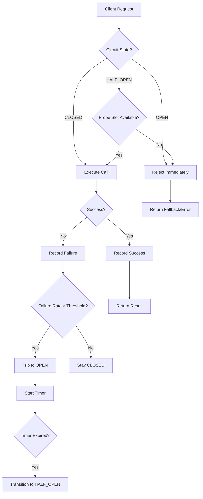
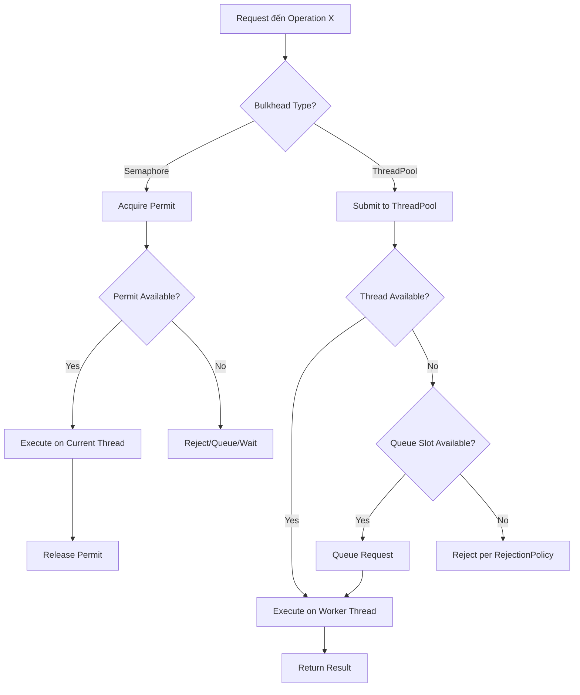

# Circuit Breaker & Bulkhead - Resilience Patterns, Fallback Strategies

## 1. Mục tiêu của task

Hiểu sâu hai pattern resilience quan trọng nhất trong distributed systems:
- **Circuit Breaker**: Ngăn cascading failure khi downstream service gặp sự cố
- **Bulkhead**: Cách ly resource để fault ở một phần không làm sập toàn bộ hệ thống

Mục tiêu là nắm vững cơ chế hoạt động, trade-off, failure modes và áp dụng đúng trong production.

---

## 2. Bản chất và cơ chế hoạt động

### 2.1 Circuit Breaker - Ngắt mạch bảo vệ

#### Bài toán Circuit Breaker giải quyết

Khi service A gọi service B, nếu B chậm hoặc lỗi:
- Threads của A bị block chờ response → thread pool cạn kiệt
- Request mới tiếp tục đổ vào B → load tăng thêm cho B đang gặp vấn đề
- Timeout kéo dài → user experience tệ
- **Cascading failure**: A sập theo B, rồi C gọi A cũng sập...

> **Bản chất**: Circuit Breaker là một **state machine** theo dõi failure rate và tự động "ngắt mạch" khi phát hiện downstream đang unhealthy, tránh waste resource vào những request chắc chắn fail.

#### State Machine của Circuit Breaker

```
┌─────────────┐
│   CLOSED    │ ← Bình thường, request đi qua
│  (Healthy)  │
└──────┬──────┘
       │ Failure count >= threshold
       ▼
┌─────────────┐
│    OPEN     │ ← Ngắt mạch, reject ngay lập tức
│   (Trip)    │   Chờ timeout duration
└──────┬──────┘
       │ Timeout hết
       ▼
┌─────────────┐
│ HALF-OPEN   │ ← Cho phép 1 số request thử nghiệm
│  (Testing)  │   Để kiểm tra recovery
└──────┬──────┘
       │
       ├── Success rate cao ──► CLOSED
       │
       └── Failure detected ──► OPEN
```

#### Ba trạng thái chi tiết

| State | Behavior | Transition Condition |
|-------|----------|---------------------|
| **CLOSED** | Request đi qua bình thường, đếm failure | Failure rate > threshold → OPEN |
| **OPEN** | Reject ngay (fast-fail), không gọi downstream | Sau timeoutDuration → HALF-OPEN |
| **HALF-OPEN** | Cho phép N request "thăm dò" đi qua | Success rate OK → CLOSED; Fail → OPEN |

#### Cơ chế đếm failure - Sliding Window

Circuit Breaker cần đếm failure rate một cách chính xác. Có 2 cách tiếp cận:

**1. Count-based Sliding Window**
- Lưu N request gần nhất trong buffer
- Tính failure rate = failed / N
- Ưu điểm: Đơn giản, không phụ thuộc thờgian
- Nhược điểm: Không phản ánh burst traffic đúng mức

**2. Time-based Sliding Window**
- Chia thờgian thành các bucket (vd: 1 giây)
- Mỗi bucket đếm success/fail
- Tính failure rate = failed / total trong window (vd: 60 giây)
- Ưu điểm: Phản ánh đúng traffic pattern theo thờgian thực
- Nhược điểm: Cần nhiều memory hơn, phức tạp hơn

> **Resilience4j sử dụng cả 2**: Time-based mặc định, có thể cấu hình count-based.

#### Counting Strategy: Sliding Window chi tiết

```
Time-based (60s window, 10s buckets):

Bucket:  [0-10s] [10-20s] [20-30s] [30-40s] [40-50s] [50-60s] [60-70s] ← Current
Failures:   2       1        5        0        3        1        0
                                              ↑
                                         Window slide,
                                    loại bỏ bucket [0-10s]

Failure rate = (1+5+0+3+1+0) / total calls in 60s
```

### 2.2 Bulkhead - Vách ngăn cách ly

#### Bài toán Bulkhead giải quyết

Resource trong một service là finite:
- Thread pool giới hạn
- Connection pool giới hạn
- Memory giới hạn

Nếu không có cách ly:
- User A gọi API nặng → chiếm hết threads
- User B gọi API nhẹ → không có thread để xử lý
- **Hoặc**: Feature X có bug leak connection → Feature Y cũng bị ảnh hưởng

> **Bản chất**: Bulkhead áp dụng nguyên tắc **compartmentalization** từ thiết kế tàu thủy - chia tàu thành nhiều buồng kín, nước tràn vào một buồng không làm chìm cả tàu.

#### Hai loại Bulkhead

**1. Semaphore Bulkhead (Counting)**
- Giới hạn số concurrent calls đến một operation
- Không cần thread pool riêng
- Thread gốc xử lý, chỉ acquire semaphore
- Nhanh, nhẹ, ít overhead

```
┌─────────────────────────────────────┐
│           Application               │
│  ┌─────────────────────────────┐    │
│  │   Shared Thread Pool (100)  │    │
│  └─────────────────────────────┘    │
│           │                         │
│    ┌──────┴──────┐                  │
│    ▼             ▼                  │
│ ┌─────────┐  ┌─────────┐           │
│ │Semaphore│  │Semaphore│           │
│ │   10    │  │   20    │           │
│ │(Feature A)│  │(Feature B)│        │
│ └────┬────┘  └────┬────┘           │
│      │            │                 │
│   Service A    Service B            │
└─────────────────────────────────────┘
```

**2. Thread Pool Bulkhead (Fixed Thread Pool)**
- Mỗi compartment có thread pool riêng
- Cách ly hoàn toàn về thread
- Có thể đặt queue size, rejection policy
- Nặng hơn, cần tuning thread pool

```
┌─────────────────────────────────────┐
│           Application               │
│  ┌─────────────────────────────┐    │
│  │   Shared Thread Pool (50)   │    │
│  │   (For các request khác)    │    │
│  └─────────────────────────────┘    │
│                                     │
│  ┌─────────────┐  ┌─────────────┐   │
│  │ ThreadPool  │  │ ThreadPool  │   │
│  │   (10)      │  │   (20)      │   │
│  │ Feature A   │  │ Feature B   │   │
│  └──────┬──────┘  └──────┬──────┘   │
│         │                │          │
│      Service A        Service B     │
└─────────────────────────────────────┘
```

#### So sánh hai loại Bulkhead

| Aspect | Semaphore Bulkhead | Thread Pool Bulkhead |
|--------|-------------------|---------------------|
| **Resource** | Semaphore permit | Dedicated threads |
| **Overhead** | Thấp (~atomic counter) | Cao (thread management) |
| **Isolation** | Logical (same threads) | Physical (different threads) |
| **Use case** | CPU-bound, nhanh | I/O-bound, có thể block lâu |
| **Timeout handling** | Khó (dùng Future) | Dễ (thread interrupt) |
| **Context switching** | Không | Có |

---

## 3. Kiến trúc và luồng xử lý

### 3.1 Circuit Breaker Flow



### 3.2 Bulkhead Flow



### 3.3 Kết hợp Circuit Breaker + Bulkhead

Trong production, hai pattern này thường đi cùng nhau:

```
Request Flow:

Client → API Gateway
            │
            ▼
    ┌───────────────┐
    │ Rate Limiter  │ ← Giới hạn request rate
    └───────┬───────┘
            │
            ▼
    ┌───────────────┐
    │   Bulkhead    │ ← Cách ly resource per service/feature
    │  (Semaphore)  │
    └───────┬───────┘
            │
            ▼
    ┌───────────────┐
    │Circuit Breaker│ ← Ngắt mạch nếu downstream unhealthy
    │   (CLOSED)    │
    └───────┬───────┘
            │
            ▼
    ┌───────────────┐
    │  Retry Logic  │ ← Retry với exponential backoff
    │  (Optional)   │
    └───────┬───────┘
            │
            ▼
    ┌───────────────┐
    │   Timeout     │ ← Giới hạn thờgian chờ
    └───────┬───────┘
            │
            ▼
      Downstream Service
```

---

## 4. So sánh các lựa chọn triển khai

### 4.1 Java Libraries Comparison

| Library | Circuit Breaker | Bulkhead | Retry | Rate Limiter | Notes |
|---------|----------------|----------|-------|--------------|-------|
| **Resilience4j** | ✅ | ✅ | ✅ | ✅ | Modern, lightweight, functional style |
| **Hystrix** | ✅ | ✅ | ❌ | ❌ | Netflix, đã maintenance mode |
| **Sentinel** | ✅ | ✅ | ✅ | ✅ | Alibaba, rich dashboard |
| **Failsafe** | ✅ | ✅ | ✅ | ✅ | Simple, flexible policies |
| **Spring Cloud CB** | ✅ | ❌ | ❌ | ❌ | Spring abstraction, configurable |

### 4.2 Resilience4j - Modern Choice

Resilience4j là thư viện được khuyến nghị cho Java hiện đại:

**Kiến trúc**: Modular, mỗi pattern là một module riêng
- `resilience4j-circuitbreaker`
- `resilience4j-bulkhead`
- `resilience4j-retry`
- `resilience4j-ratelimiter`
- `resilience4j-timelimiter`

**Thread-safety**: Không dùng synchronization, dùng `AtomicReference` + CAS

**Metrics**: Tích hợp Micrometer → Prometheus/Grafana

**Why Resilience4j over Hystrix**:
- Hystrix dùng thread isolation mặc định → overhead cao
- Hystrix đã stop active development
- Resilience4j functional, compose được nhiều decorator
- Resilience4j hỗ trợ Java 21+ tốt hơn

### 4.3 Configuration Trade-offs

#### Circuit Breaker Config

```yaml
# Example Resilience4j config
resilience4j.circuitbreaker:
  configs:
    default:
      # Khi nào mở mạch?
      failureRateThreshold: 50        # 50% failures → OPEN
      slowCallRateThreshold: 80       # 80% slow calls → OPEN  
      slowCallDurationThreshold: 2s   # Call > 2s = slow
      
      # Window counting
      slidingWindowSize: 100          # Hoặc time-based
      slidingWindowType: COUNT_BASED  # Hoặc TIME_BASED
      minimumNumberOfCalls: 10        # Cần ít nhất 10 calls để tính rate
      
      # Khi nào thử lại?
      waitDurationInOpenState: 30s    # Chờ 30s trước khi HALF_OPEN
      permittedNumberOfCallsInHalfOpenState: 5  # Cho phép 5 probe calls
      
      # Tự động chuyển states?
      automaticTransitionFromOpenToHalfOpenEnabled: true
      
      # Exceptions nào tính là failure?
      recordExceptions:
        - java.io.IOException
        - java.util.concurrent.TimeoutException
      ignoreExceptions:
        - com.example.BusinessException  # Không tính vào failure rate
```

**Trade-off Analysis**:

| Config | Aggressive | Conservative |
|--------|-----------|--------------|
| `failureRateThreshold` | 30% | 70% |
| `waitDurationInOpenState` | 5s | 60s |
| `slidingWindowSize` | 10 | 1000 |
| **Kết quả** | Nhạy, có thể trip sớm | Chậm, chịu đựng failures lâu |
| **Risk** | False positive, trip khi transient error | Slow to react, cascading failure |

> **Recommendation**: Bắt đầu conservative (50%, 30s, 100), monitor rồi tune dần.

#### Bulkhead Config

```yaml
resilience4j.bulkhead:
  configs:
    semaphore:
      maxConcurrentCalls: 50          # Giới hạn concurrent
      maxWaitDuration: 0              # 0 = fail fast, không đợi
    
    threadpool:
      maxThreadPoolSize: 20
      coreThreadPoolSize: 10
      queueCapacity: 50               # Queue trước khi reject
      keepAliveDuration: 20s          # Thread idle timeout
```

**Trade-off Semaphore vs ThreadPool**:

| Scenario | Recommended | Lý do |
|----------|-------------|-------|
| Fast calls (<100ms) | Semaphore | Ít overhead, không cần context switch |
| Slow I/O calls (>1s) | ThreadPool | Cách ly blocking, có queue buffer |
| Mixed workload | Semaphore + CB | CB bảo vệ, Semaphore giới hạn |
| Critical path | ThreadPool | Cách ly tối đa, một compartment fail không ảnh hưởng |

---

## 5. Rủi ro, Anti-patterns, Lỗi thường gặp

### 5.1 Circuit Breaker Anti-patterns

#### ❌ Anti-pattern 1: Shared Circuit Breaker cho nhiều downstream khác nhau

```java
// SAI - Một CB cho cả Payment và Inventory
CircuitBreaker cb = CircuitBreaker.ofDefaults("downstream");

// Khi Inventory chậm → CB trip → Payment cũng bị block
paymentService.process(cb);
inventoryService.check(cb);
```

**Hệ quả**: False cascading - service healthy bị ảnh hưởng vì service khác fail.

**✅ Fix**: Mỗi downstream có CB riêng

```java
CircuitBreaker paymentCB = CircuitBreaker.ofDefaults("payment-service");
CircuitBreaker inventoryCB = CircuitBreaker.ofDefaults("inventory-service");
```

#### ❌ Anti-pattern 2: Quá nhạy hoặc quá chậm

```yaml
# Quá nhạy - dễ false positive
failureRateThreshold: 10      # Chỉ cần 10% fail là trip
slidingWindowSize: 5          # Window quá nhỏ
waitDurationInOpenState: 1s   # Chờ 1s rồi thử lại
```

**Hệ quả**: CB liên tục trip/ngắt, gây flapping, ảnh hưởng availability.

```yaml
# Quá chậm - phản ứng kém
failureRateThreshold: 95      # Chỉ trip khi gần như 100% fail
slidingWindowSize: 10000      # Window quá lớn, average ra chậm
waitDurationInOpenState: 5m   # Chờ 5 phút mới thử lại
```

**Hệ quả**: CB không kịp bảo vệ, cascading failure xảy ra trước khi trip.

#### ❌ Anti-pattern 3: Không có Fallback

```java
// SAI - Chỉ throw exception khi CB OPEN
@CircuitBreaker(name = "payment")
public PaymentResult processPayment(PaymentRequest req) {
    return paymentClient.charge(req);  // CB OPEN → throw exception
}
```

**Hệ quả**: User thấy error, không có graceful degradation.

**✅ Fix**: Luôn có fallback

```java
@CircuitBreaker(name = "payment", fallbackMethod = "fallbackPayment")
public PaymentResult processPayment(PaymentRequest req) {
    return paymentClient.charge(req);
}

private PaymentResult fallbackPayment(PaymentRequest req, Exception ex) {
    // 1. Queue for later processing
    // 2. Return "pending" status
    // 3. Use cached/stale data
    return PaymentResult.queued(req.getId());
}
```

#### ❌ Anti-pattern 4: Fallback gọi lại chính service

```java
@CircuitBreaker(name = "payment", fallbackMethod = "retryFallback")
public PaymentResult processPayment(PaymentRequest req) {
    return paymentClient.charge(req);
}

// SAI - Fallback lại gọi service đang fail
private PaymentResult retryFallback(PaymentRequest req, Exception ex) {
    return processPayment(req);  // Vòng lặn vô hạn hoặc waste resource
}
```

**Hệ quả**: Bypass CB protection, resource exhaustion.

### 5.2 Bulkhead Anti-patterns

#### ❌ Anti-pattern 1: Bulkhead quá nhỏ so với capacity

```yaml
# Thread pool chỉ 5 threads cho service nhận 1000 RPS
maxThreadPoolSize: 5
queueCapacity: 10
```

**Hệ quả**: Throttling không cần thiết, tự gây bottleneck.

#### ❌ Anti-pattern 2: Bulkhead quá lớn → không có cách ly

```yaml
# Bulkhead lớn bằng cả application thread pool
maxConcurrentCalls: 1000  # Trong khi total threads = 1000
```

**Hệ quả**: Một feature fail vẫn chiếm hết resource.

#### ❌ Anti-pattern 3: Không xử lý Rejection

```java
@Bulkhead(name = "heavyOperation")
public Result heavyOperation() { ... }
// Không có xử lý khi BulkheadFullException
```

**Hệ quả**: Exception leak lên user, 500 error.

**✅ Fix**: Có fallback hoặc return degraded response.

### 5.3 Common Failure Modes

| Failure | Nguyên nhân | Cách phát hiện | Khắc phục |
|---------|-------------|----------------|-----------|
| **CB Flapping** | Threshold quá thấp, window nhỏ | CB metrics nhảy liên tục giữa OPEN/CLOSED | Tăng window size, điều chỉnh threshold |
| **CB Not Triggering** | ignoreExceptions quá rộng, threshold cao | Failures tăng nhưng CB vẫn CLOSED | Review exception config, giảm threshold |
| **Bulkhead Starvation** | Một compartment chiếm hết threads | Metric: waiting queue cao, rejected tăng | Tăng pool size hoặc tách compartment |
| **Memory Leak** | Queue không giới hạn, fallback giữ reference | Heap tăng dần theo thờgian | Giới hạn queue, review fallback logic |
| **Timeout Mismatch** | CB timeout > downstream timeout | CB chưa trip mà request đã timeout trước | Đảm bảo CB waitDuration < request timeout |

---

## 6. Khuyến nghị thực chiến trong Production

### 6.1 Monitoring & Observability

#### Metrics cần track

**Circuit Breaker Metrics**:
```
resilience4j_circuitbreaker_state          # State: 0=CLOSED, 1=OPEN, 2=HALF_OPEN
resilience4j_circuitbreaker_calls_total    # Total calls (success/failure)
resilience4j_circuitbreaker_failure_rate   # Current failure rate %
resilience4j_circuitbreaker_slow_calls     # Slow call count
```

**Bulkhead Metrics**:
```
resilience4j_bulkhead_available_concurrent_calls   # Available permits
resilience4j_bulkhead_max_allowed_concurrent_calls # Max permits
```

#### Alerting Rules

```yaml
# Prometheus Alerting
- alert: CircuitBreakerOpen
  expr: resilience4j_circuitbreaker_state == 1
  for: 1m
  labels:
    severity: warning
  annotations:
    summary: "Circuit breaker {{ $labels.name }} is OPEN"

- alert: CircuitBreakerHighFailureRate
  expr: resilience4j_circuitbreaker_failure_rate > 0.3
  for: 2m
  labels:
    severity: warning
  annotations:
    summary: "High failure rate for {{ $labels.name }}"

- alert: BulkheadSaturated
  expr: |
    (resilience4j_bulkhead_max_allowed_concurrent_calls - 
     resilience4j_bulkhead_available_concurrent_calls) / 
    resilience4j_bulkhead_max_allowed_concurrent_calls > 0.9
  for: 1m
  labels:
    severity: critical
```

### 6.2 Configuration Guidelines

#### Circuit Breaker Best Practices

```yaml
# Cho HTTP downstream (REST APIs)
http-downstream:
  failureRateThreshold: 50
  slowCallRateThreshold: 80
  slowCallDurationThreshold: 2s  # 95th percentile latency ~2s
  waitDurationInOpenState: 30s   # Đủ để downstream recover
  slidingWindowSize: 100
  minimumNumberOfCalls: 20       # Đủ sample size
  permittedNumberOfCallsInHalfOpenState: 10

# Cho gRPC downstream (binary, nhanh hơn)
grpc-downstream:
  failureRateThreshold: 50
  slowCallDurationThreshold: 500ms
  waitDurationInOpenState: 15s   # Nhanh hơn vì gRPC recover nhanh

# Cho Database (cần conservative - DB khó scale)
database:
  failureRateThreshold: 30       # Thấp hơn vì DB issue nghiêm trọng
  waitDurationInOpenState: 60s   # Cho DB đủ thờgian recover
```

#### Bulkhead Best Practices

```yaml
# Tính toán bulkhead size:
# 1. Xác định total threads: 200
# 2. Identify critical compartments: Payment (30%), Inventory (20%), Catalog (20%)
# 3. Reserved: 30% cho các operations khác

payment-bulkhead:
  maxConcurrentCalls: 60        # 30% của 200
  maxWaitDuration: 100ms        # Fail fast nếu đầy

inventory-bulkhead:
  maxConcurrentCalls: 40        # 20%
  
general-bulkhead:
  maxConcurrentCalls: 60        # 30% còn lại
```

### 6.3 Fallback Strategies

| Strategy | Use Case | Implementation |
|----------|----------|----------------|
| **Cache/Stale Data** | Read operations | Return last known good value với timestamp |
| **Queue for Later** | Write operations | Lưu vào local queue/SQS, process async |
| **Degraded Mode** | Non-critical features | Disable feature, thông báo user |
| **Alternative Path** | Có backup service | Gọi secondary service |
| **Default Value** | Config/defaults | Return safe default |

### 6.4 Testing Resilience

**Chaos Engineering với Circuit Breaker**:

```java
// Test: Giả lập downstream failure
@Test
void shouldTripAfterThreshold() {
    // Arrange: Mock downstream luôn fail
    when(paymentClient.charge(any())).thenThrow(new IOException());
    
    // Act: Gọi nhiều lần để vượt threshold
    IntStream.range(0, 20).forEach(i -> {
        try {
            paymentService.process(mockRequest);
        } catch (Exception ignored) {}
    });
    
    // Assert: CB nên OPEN
    assertThat(circuitBreaker.getState()).isEqualTo(OPEN);
}

// Test: Recovery sau timeout
@Test
void shouldCloseAfterRecovery() throws InterruptedException {
    // Trip CB trước
    tripCircuitBreaker();
    
    // Chờ waitDuration
    Thread.sleep(31000);  // 30s + buffer
    
    // Mock downstream đã recover
    when(paymentClient.charge(any())).thenReturn(success);
    
    // Gọi probe calls (permittedNumberOfCallsInHalfOpenState)
    IntStream.range(0, 5).forEach(i -> 
        paymentService.process(mockRequest));
    
    // Assert: CB nên CLOSED
    assertThat(circuitBreaker.getState()).isEqualTo(CLOSED);
}
```

### 6.5 Integration với Spring Boot

```java
@Configuration
public class ResilienceConfig {
    
    @Bean
    public Customizer<Resilience4JCircuitBreakerFactory> defaultCustomizer() {
        return factory -> factory.configureDefault(id -> new Resilience4JConfigBuilder(id)
            .circuitBreakerConfig(CircuitBreakerConfig.custom()
                .failureRateThreshold(50)
                .waitDurationInOpenState(Duration.ofSeconds(30))
                .slidingWindowSize(100)
                .build())
            .timeLimiterConfig(TimeLimiterConfig.custom()
                .timeoutDuration(Duration.ofSeconds(5))
                .build())
            .build());
    }
}

@Service
public class OrderService {
    
    @CircuitBreaker(name = "payment", fallbackMethod = "fallbackPayment")
    @Bulkhead(name = "payment")
    @TimeLimiter(name = "payment")
    public CompletableFuture<PaymentResult> processPayment(Order order) {
        return CompletableFuture.supplyAsync(() -> 
            paymentClient.charge(order));
    }
    
    private CompletableFuture<PaymentResult> fallbackPayment(
            Order order, Exception ex) {
        return CompletableFuture.completedFuture(
            PaymentResult.degraded(order.getId()));
    }
}
```

---

## 7. Kết luận

### Bản chất cốt lõi

**Circuit Breaker** là **state machine** ngăn cascading failure bằng cách:
- Theo dõi failure rate trong sliding window
- Tự động "ngắt mạch" khi downstream unhealthy
- Thử nghiệm recovery bằng half-open state

**Bulkhead** là **compartmentalization** bảo vệ resource bằng cách:
- Giới hạn concurrent calls per operation (semaphore)
- Hoặc cách ly hoàn toàn bằng dedicated thread pools
- Đảm bảo fault ở một phần không làm sập toàn bộ

### Trade-off quan trọng nhất

| Aspect | Trade-off |
|--------|-----------|
| **Sensitivity** | Nhạy (bảo vệ sớm) vs Chậm (tránh false positive) |
| **Isolation level** | Semaphore (nhanh, ít overhead) vs ThreadPool (cách ly tốt, overhead cao) |
| **Wait strategy** | Fail fast (trả lời nhanh) vs Queue (giảm rejected nhưng tăng latency) |

### Rủi ro lớn nhất trong production

1. **Configuration drift**: Không tune theo traffic pattern thực tế
2. **Missing fallback**: CB trip → exception leak → 500 error
3. **Shared CB/Bulkhead**: Một downstream fail ảnh hưởng downstream khác
4. **Insufficient monitoring**: Không biết CB đang trip hoặc Bulkhead đang saturated

### Checklist triển khai

- [ ] Mỗi downstream có CB riêng
- [ ] Mỗi critical operation có Bulkhead riêng  
- [ ] Fallback cho mọi protected operation
- [ ] Metrics export (Micrometer → Prometheus)
- [ ] Alerting cho CB OPEN và Bulkhead saturated
- [ ] Chaos testing cho recovery flow
- [ ] Document cấu hình và lý do chọn giá trị đó

---

*Research completed: 2026-03-28*
