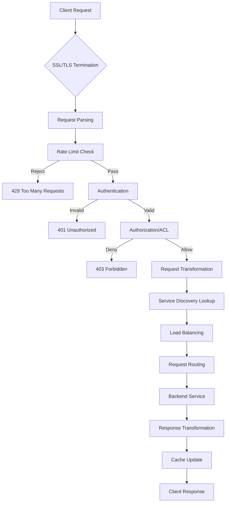
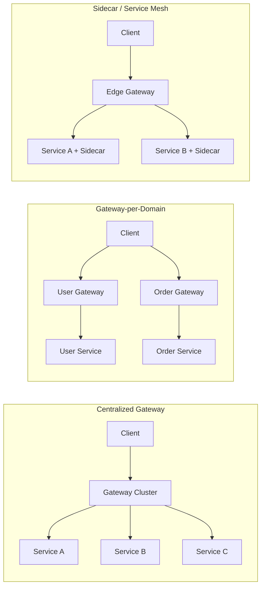

# API Gateway Patterns - Routing, Rate Limiting, Authentication Aggregation

## 1. Mục tiêu của task

Hiểu sâu bản chất của API Gateway trong kiến trúc microservices:
- Cơ chế routing: pattern matching, path rewriting, dynamic routing
- Rate limiting: thuật toán, distributed state, burst handling
- Authentication aggregation: token validation, claim propagation, multi-IDP support
- Trade-offs giữa centralized gateway vs sidecar proxy
- Production concerns: latency, single point of failure, cache invalidation

---

## 2. Bản chất và cơ chế hoạt động

### 2.1 API Gateway là gì? Không chỉ là "reverse proxy nâng cao"

| Khía cạnh | Reverse Proxy truyền thống | API Gateway hiện đại |
|-----------|---------------------------|---------------------|
| **Mục tiêu** | Load balancing, SSL termination | Cross-cutting concerns của microservices |
| **Routing** | Static, dựa trên host/path | Dynamic, content-based, canary, A/B testing |
| **Transformation** | Hạn chế (header manipulation) | Protocol translation, request/response rewriting |
| **Policy Enforcement** | Basic ACL | Rate limiting, authz, quota, throttling |
| **Observability** | Access logs | Distributed tracing, metrics, correlation IDs |

> **Cốt lõi:** API Gateway là **Policy Enforcement Point (PEP)** - nơi tập trung các cross-cutting concerns mà không làm ô nhiễm business logic của services.

### 2.2 Routing Patterns

#### 2.2.1 Path-Based Routing

```
/api/users/*     → user-service:8080
/api/orders/*    → order-service:8080
/api/payments/*  → payment-service:8080
```

**Bản chất cơ chế:**
- Router maintain **Trie data structure** cho O(m) lookup (m = path length)
- Wildcard matching: `**` (multi-segment) vs `*` (single-segment)
- Priority: Exact match > Single wildcard > Double wildcard

**Trade-off:**
- **Pros:** Simple, fast, predictable
- **Cons:** Không thể routing dựa trên body content (JSON/XML parsing cost cao)

#### 2.2.2 Header-Based Routing (Canary / A/B Testing)

```
X-Canary-Version: v2  → order-service-v2:8080
X-Canary-Version: v1  → order-service-v1:8080
```

**Cơ chế:**
- Extract header value → Lookup routing table → Forward
- Weighted routing: Random number 0-100, route dựa trên weight threshold

**Production Concern:**
- Header injection từ client → **Security risk** (client có thể tự chọn version)
- **Solution:** Gateway tự inject header dựa trên user segment (user-id hash % 100)

#### 2.2.3 Dynamic Routing (Service Discovery Integration)

```java
// Pseudo-code cơ chế lookup
ServiceInstance selectInstance(String serviceName) {
    List<Instance> instances = discoveryClient.getInstances(serviceName);
    // Filter: health check, metadata match
    // Load balance: Round-robin, Least connections, Consistent hashing
    return loadBalancer.choose(instances);
}
```

**Critical Design Decision:**
| Strategy | Latency | Consistency | Use Case |
|----------|---------|-------------|----------|
| Client-side LB | Thấp (0-hop) | Eventual | High-throughput internal services |
| Server-side LB | Cao (+1 hop) | Strong | External-facing, dynamic scaling |
| Sidecar proxy | Medium | Eventual | Service mesh (Istio, Linkerd) |

### 2.3 Rate Limiting - Thuật toán và Distributed State

#### 2.3.1 Các thuật toán rate limiting

| Thuật toán | Cơ chế | Burst handling | Memory |
|------------|--------|----------------|--------|
| **Fixed Window** | Đếm request trong khoảng thờigian cố định | Thảm họa ở window boundary | O(1) |
| **Sliding Window Log** | Lưu timestamp từng request | Chính xác | O(n) |
| **Sliding Window Counter** | Ước lượng dựa trên previous window | Gần đúng (~acceptable) | O(1) |
| **Token Bucket** | Bổ sung token theo tốc độ, tiêu thụ khi request | Tự nhiên (burst = bucket size) | O(1) |
| **Leaky Bucket** | Queue + constant outflow | Không (smooth output) | O(queue size) |

**Bản chất vấn đề:**

> **Fixed Window Thundering Herd:** Tại thờigian T+59s, có thể có 2x limit requests (cừa window cũ + window mới). Đây là lý do production systems **không dùng** Fixed Window đơn giản.

#### 2.3.2 Distributed Rate Limiting

**Challenge:** Multiple gateway instances → cần shared state

**Các approach:**

1. **Redis-based (Token Bucket)**
   ```
   LUA script atomically:
   1. Get current tokens
   2. Calculate refill: (now - last_refill) * rate
   3. If tokens >= 1: decrement and allow
   4. Else: reject
   ```
   - **Trade-off:** Redis round-trip (+1-2ms) nhưng consistency cao
   - **Optimization:** Local cache + async sync (eventual consistency)

2. **Gossip Protocol (Cassandra-style)**
   - Mỗi node maintain local counter + gossip với peers
   - **Trade-off:** Không cần external dependency nhưng có thể over-allow

3. **Consistent Hashing Partitioning**
   - Shard rate limit keys theo consistent hashing
   - Mỗi key chỉ tồn tại trên 1 node → local computation
   - **Trade-off:** Hot key problem (1 user chiếm hết capacity của 1 node)

**Khuyến nghị Production:**
- Dùng **Redis Cell module** (CL.THROTTLE command) hoặc **Redis + Lua script** cho atomicity
- Local cache layer cho keys "hot" (top 1% users)
- Stale-while-revalidate pattern: cho phép dùng local count trong khi sync async

### 2.4 Authentication Aggregation

#### 2.4.1 Multi-IDP Support Pattern

```
Client → Gateway → [Auth0|Keycloak|Cognito|Internal LDAP] → Service
```

**Bản chất:** Gateway là **Federated Identity Gateway**

**Cơ chế Token Validation:**

| Method | Latency | Security | Complexity |
|--------|---------|----------|------------|
| **JWT Signature Verify** | Thấp (local) | Medium (key rotation concern) | Thấp |
| **Introspection Endpoint** | Cao (+RTT to IDP) | Cao (revocation check real-time) | Trung bình |
| **Token Binding** | Thấp | Cao (cryptographic binding) | Cao |

**Production Pattern - Tiered Validation:**
1. **JWT Signature verify** (local, fast) - reject malformed/expired tokens
2. **Cache lookup** - kiểm tra revocation list (local cache TTL 1-5 phút)
3. **Async introspection** - cho high-value operations (payment, admin)

#### 2.4.2 Claim Propagation & Context Enrichment

```http
# Request từ client
GET /api/orders
Authorization: Bearer <jwt>

# Gateway thêm headers trước khi forward
X-User-Id: 12345
X-User-Roles: USER,PREMIUM
X-Request-Id: uuid-v4
X-IdP-Source: auth0
```

**Security Concerns:**
- **Header spoofing:** Service phải **ignore** incoming X-User-* headers từ client
- **Claim size:** JWT quá lớn → header size limit (8KB thường là limit)
- **Sensitive claims:** Không forward PII (email, phone) trừ khi service cần

**Best Practice:**
```java
// Gateway strips all X-Internal-* headers from client request
// Gateway adds verified claims from JWT
// Services trust X-Internal-* headers implicitly
```

---

## 3. Kiến trúc và Luồng xử lý

### 3.1 Request Lifecycle trong Gateway



### 3.2 Gateway Deployment Patterns



| Pattern | Team Autonomy | Latency | Operational Complexity | Blast Radius |
|---------|---------------|---------|----------------------|--------------|
| **Centralized** | Thấp (shared) | +1 hop | Thấp (1 cluster) | Cao (SPOF) |
| **Per-Domain** | Cao (owned by domain team) | +1 hop | Trung bình | Trung bình |
| **Sidecar** | Cao | +0 hop (localhost) | Cao (per service) | Thấp |

---

## 4. So sánh các lựa chọn triển khai

### 4.1 Open Source API Gateways

| Gateway | Ngôn ngữ | Strengths | Weaknesses | Best For |
|---------|----------|-----------|------------|----------|
| **Kong** | Lua/OpenResty | Plugin ecosystem, perf cao | Lua learning curve, config complexity | Enterprise, complex routing |
| **Spring Cloud Gateway** | Java | Spring ecosystem, code-based config | JVM memory, GC pauses | Java shops, Spring ecosystem |
| **NGINX + Lua** | C/Lua | Performance tốt nhất | Code complexity, maintenance | High throughput, simple routing |
| **Envoy** | C++ | Service mesh native, xDS API | Config verbosity, resource usage | Istio/Service mesh |
| **Apache APISIX** | Lua/OpenResty | Dynamic config (no restart), multi-tenant | Newer, smaller community | Dynamic environments |
| **Zuul 2** | Java | Netflix proven at scale | Maintenance mode, legacy | Netflix ecosystem |

### 4.2 Cloud Managed Gateways

| Service | Provider | Trade-off |
|---------|----------|-----------|
| **AWS API Gateway** | AWS | Tight integration nhưng vendor lock-in, cold start latency |
| **Azure API Management** | Azure | Good policy system, expensive at scale |
| **Google Cloud Endpoints** | GCP | ESP proxy hoặc serverless, good for GKE |
| **Cloudflare API Gateway** | Cloudflare | Edge deployment, DDoS protection built-in |

---

## 5. Rủi ro, Anti-patterns, Lỗi thường gặp

### 5.1 Anti-patterns

#### ❌ **The "Smart Gateway" Trap**
```java
// KHÔNG NÊN: Gateway chứa business logic
if (userType == "PREMIUM" && orderAmount > 1000) {
    routeToSpecialService();
}
```
- **Vấn đề:** Gateway thay đổi khi business rule thay đổi
- **Solution:** Gateway chỉ enforce policies, business logic ở service

#### ❌ **Over-aggregation**
```java
// KHÔNG NÊN: Gateway gọi 5 services để compose 1 response
// → Gateway thành "distributed monolith", high coupling
```
- **Solution:** Backend-for-Frontend (BFF) pattern - separate gateway per client type

#### ❌ **Sync Auth Every Request**
```java
// KHÔNG NÊN: Gọi IDP introspection cho mỗi request
// → Latency cao, IDP thành bottleneck
```
- **Solution:** JWT local verification + async revocation check

### 5.2 Failure Modes

| Scenario | Nguyên nhân | Mitigation |
|----------|-------------|------------|
| **Gateway Overload** | Traffic spike, no rate limiting | Circuit breaker, horizontal scaling, caching |
| **IDP Unavailable** | Authentication service down | Token caching, grace period, fallback to cached claims |
| **Hot Key in Rate Limit** | 1 user spamming requests | Per-user + global rate limit, progressive penalty |
| **Memory Leak** | Connection pool không được release | Timeout config, max connection limit, monitoring |
| **Config Drift** | Multiple gateway instances khác config | GitOps, config validation, canary rollout |

### 5.3 Security Pitfalls

1. **Trusting Client Headers:** Gateway phải strip tất cả `X-Forwarded-*`, `X-User-*` headers từ client
2. **Information Leakage:** Error messages từ backend expose internal structure
3. **DoS via Large Payload:** Không validate request size → OOM
4. **SSRF via URL parameters:** Gateway routing dựa trên user input URL

---

## 6. Khuyến nghị thực chiến trong Production

### 6.1 Latency Budget

> **Rule of thumb:** Gateway thêm 1-5ms latency cho mỗi hop. Budget allocation:
- SSL termination: 0.5-1ms
- Request parsing: 0.5ms
- Rate limiting (local): 0.1ms
- Rate limiting (Redis): 1-3ms
- Auth (JWT verify): 0.5ms
- Auth (Redis cache check): 0.5-1ms
- Service discovery: 0.1-0.5ms (with local cache)

**Target:** P99 < 10ms overhead

### 6.2 Monitoring & Observability

**Metrics bắt buộc:**
- Request rate, error rate, latency (RED method)
- Active connections, connection pool saturation
- Rate limit hits (by key, by endpoint)
- Auth cache hit/miss ratio
- Route lookup latency

**Distributed Tracing:**
- Gateway inject `traceparent`, `X-Request-ID`
- Trace qua: Gateway → Service → Database
- Sampling: 100% cho error, 1-10% cho success

### 6.3 Configuration Management

**GitOps Approach:**
```yaml
# routes.yaml trong Git repo
routes:
  - path: /api/users/**
    service: user-service
    rateLimit: 
      requests: 1000
      window: 60s
    auth:
      required: true
      providers: [auth0, internal]
```

**Canary Config Rollout:**
- 1% traffic → new config
- Monitor error rate, latency
- Auto-rollback nếu error > threshold

### 6.4 Scaling Strategies

| Resource | Scaling Trigger | Strategy |
|----------|-----------------|----------|
| CPU | > 70% | Horizontal Pod Autoscaler |
| Memory | > 80% | Vertical scaling hoặc session affinity |
| Connections | > 80% pool | Increase pool size hoặc connection multiplexing |
| Latency | P99 > 100ms | Add instances, optimize routes |

---

## 7. Kết luận

**Bản chất của API Gateway:**
> API Gateway là **cross-cutting concern aggregator** - tập trung những vấn đề chung (auth, rate limiting, routing) để services tập trung vào business logic. Nó là **Policy Enforcement Point** quan trọng nhất trong hệ thống microservices.

**Trade-off cốt lõi:**
- **Centralized** = Operational simplicity nhưng team coupling và SPOF risk
- **Decentralized** = Team autonomy nhưng operational complexity
- **Stateless vs Stateful** = Rate limiting distributed cần state, ảnh hưởng latency

**Rủi ro lớn nhất trong production:**
1. Gateway trở thành **distributed monolith** (chứa business logic)
2. **Single point of failure** không có circuit breaker, auto-scaling
3. **Authentication bottleneck** - sync call IDP cho mỗi request
4. **Hot key problem** trong distributed rate limiting

**Quyết định kiến trúc quan trọng:**
- Dùng **Token Bucket + Redis Cell** cho rate limiting
- **JWT local verify + async revocation check** cho auth
- **Tiered caching** cho service discovery và rate limit state
- **GitOps + Canary rollout** cho config management

---

## 8. Code tham khảo (tối thiểu)

### 8.1 Lua script cho Redis Token Bucket

```lua
-- Token bucket implementation in Redis
local key = KEYS[1]
local rate = tonumber(ARGV[1])      -- tokens per second
local capacity = tonumber(ARGV[2])   -- bucket capacity
local requested = tonumber(ARGV[3])  -- tokens requested (usually 1)

local now = redis.call('TIME')
local now_ms = now[1] * 1000 + now[2] / 1000

local bucket = redis.call('HMGET', key, 'tokens', 'last_refill')
local tokens = tonumber(bucket[1]) or capacity
local last_refill = tonumber(bucket[2]) or now_ms

-- Calculate tokens to add based on time passed
local delta_ms = now_ms - last_refill
local tokens_to_add = (delta_ms / 1000) * rate
tokens = math.min(capacity, tokens + tokens_to_add)

-- Check if request can be satisfied
if tokens >= requested then
    tokens = tokens - requested
    redis.call('HMSET', key, 'tokens', tokens, 'last_refill', now_ms)
    redis.call('PEXPIRE', key, 60000) -- TTL 60s
    return 1 -- Allowed
else
    redis.call('HSET', key, 'last_refill', now_ms)
    return 0 -- Rejected
end
```

**Giải thích:** Script này đảm bảo atomicity cho token bucket operations trong distributed environment.

### 8.2 Spring Cloud Gateway Route Config

```yaml
spring:
  cloud:
    gateway:
      routes:
        - id: user-service
          uri: lb://user-service
          predicates:
            - Path=/api/users/**
          filters:
            - name: RequestRateLimiter
              args:
                redis-rate-limiter.replenishRate: 10
                redis-rate-limiter.burstCapacity: 20
            - name: CircuitBreaker
              args:
                name: userServiceCB
                fallbackUri: forward:/fallback
```

---

**References:**
- Netflix Zuul 2 Architecture
- Kong Gateway Documentation
- Redis Cell Module (Rate Limiting)
- OWASP API Security Top 10
- AWS API Gateway Best Practices
