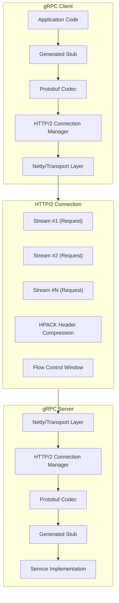
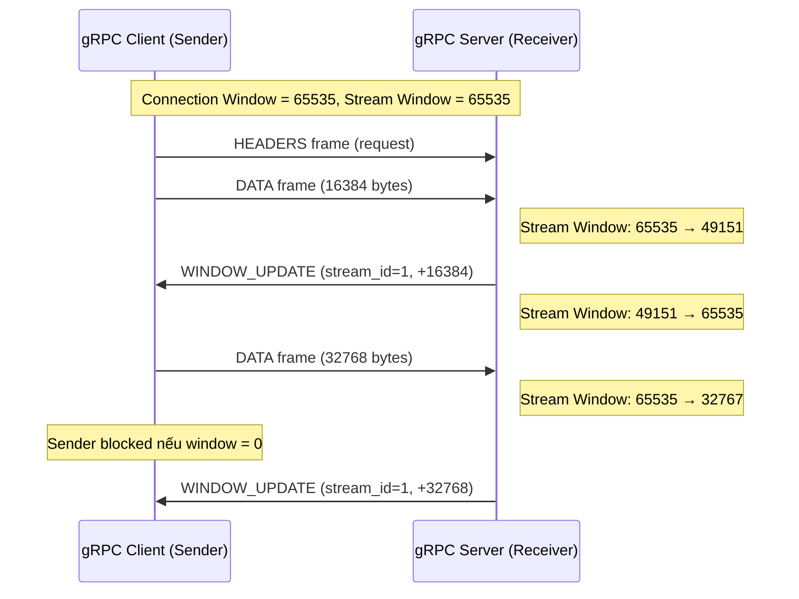
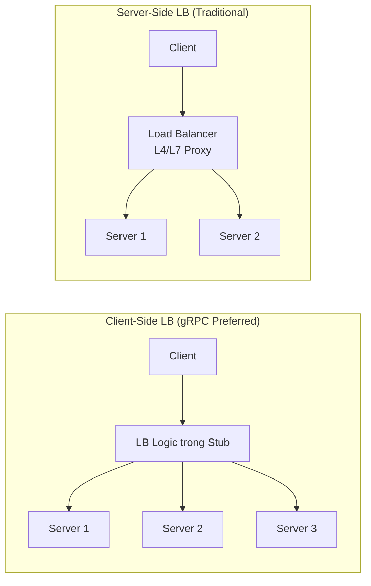
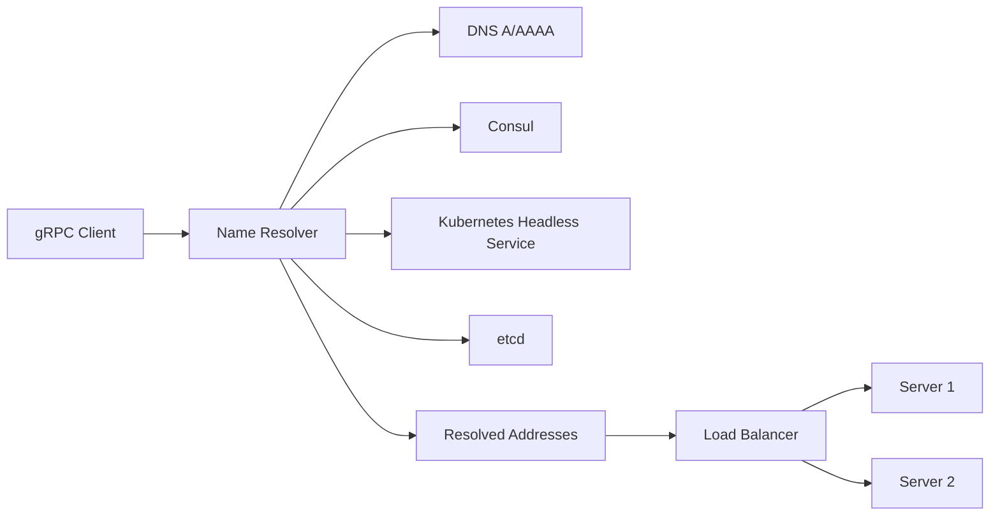
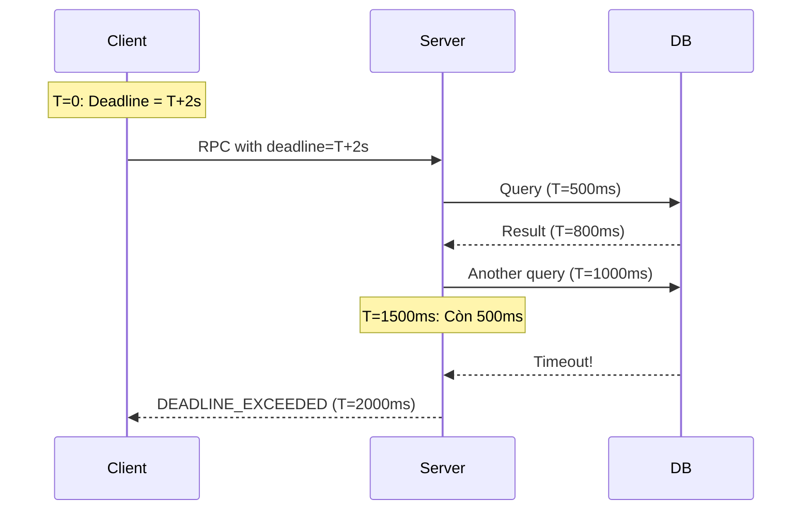
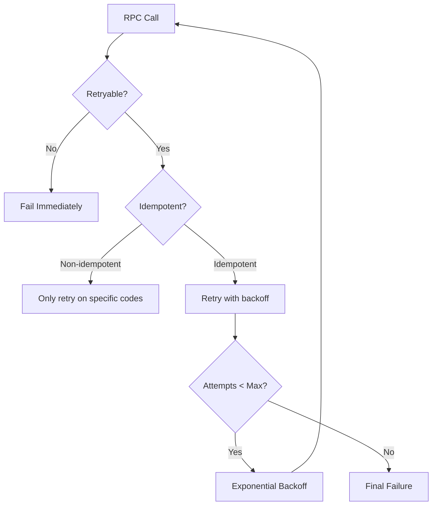
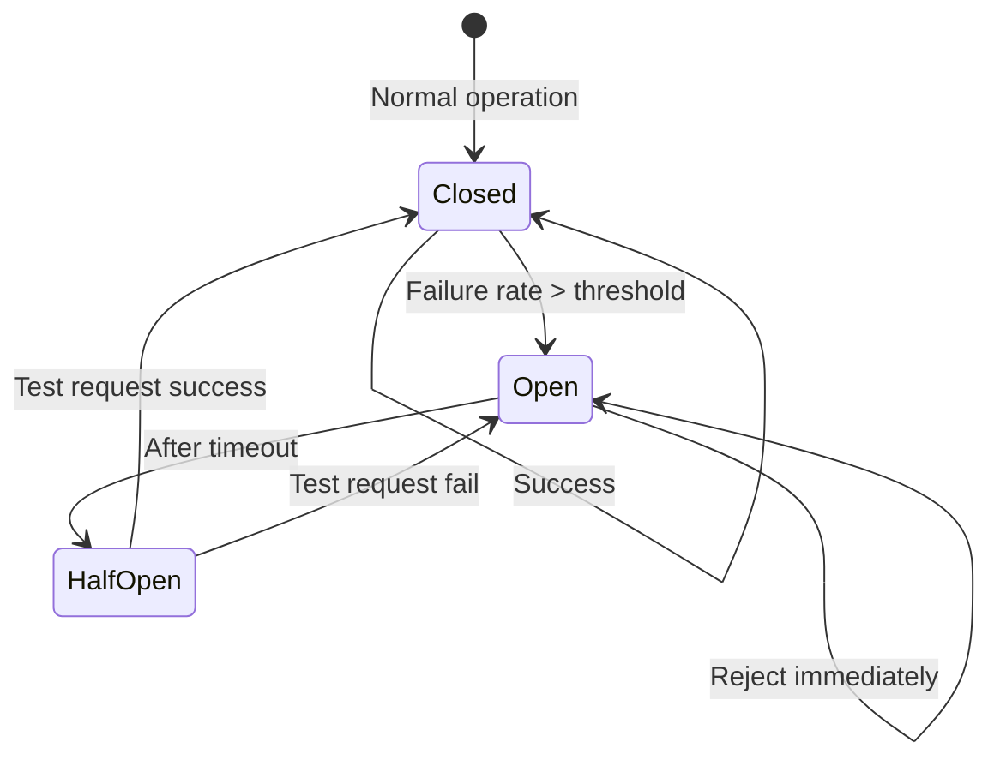

# gRPC Internals: Kiến Trúc Từ Tầng Transport Đến Production Patterns

## 1. Mục tiêu của Task

Hiểu sâu cơ chế vận hành bên trong gRPC - từ cách HTTP/2 được tận dụng để truyền tải message, cơ chế serialization của Protocol Buffers, chiến lược load balancing, cho đến các patterns quan trọng trong production như deadlines, retries và circuit breaker. Mục tiêu là nắm được **bản chất thiết kế** để đưa ra quyết định đúng đắn khi triển khai hệ thống thực tế.

---

## 2. Bản Chất và Cơ Chế Hoạt Động

### 2.1 Kiến Trúc Tổng Thể: Lớp Network Stack

gRPC không phải là một protocol độc lập - nó là **framework RPC xây dựng trên nền HTTP/2**, sử dụng Protocol Buffers làm Interface Definition Language (IDL) và serialization format.



**Điểm then chốt:** gRPC kế thừa toàn bộ ưu điểm của HTTP/2 (multiplexing, header compression, flow control) mà không phát minh lại bánh xe ở tầng transport.

### 2.2 HTTP/2 Flow Control: Cơ Chế Credit-Based

HTTP/2 sử dụng **sliding window flow control** ở hai cấp độ:

#### 2.2.1 Connection-Level Flow Control

- Mỗi HTTP/2 connection có một `window size` mặc định: **65,535 bytes** (16-bit max)
- Window size có thể tăng lên đến **2^31-1 bytes** qua WINDOW_UPDATE frames
- Receiver quảng bá available buffer space; sender chỉ gửi nếu window > 0

#### 2.2.2 Stream-Level Flow Control

- Mỗi stream (request/response pair) có window size riêng, độc lập
- Cho phép receiver giới hạn băng thông cho từng stream cụ thể
- gRPC tận dụng điều này cho **backpressure** tự nhiên



**Ý nghĩa trong production:**
- **Backpressure tự nhiên:** Khi server quá tải, window không được cập nhật → client tự động ngừng gửi
- **Memory protection:** Không cần unbounded buffer, tránh OOM
- **Fairness giữa streams:** Một stream chậm không làm nghẽn toàn bộ connection

**Trade-off:** Window size quá nhỏ → throughput giảm do nhiều round-trip WINDOW_UPDATE. Window quá lớn → memory pressure, khó kiểm soát backpressure.

### 2.3 Protobuf Serialization: Binary Format Internals

Protocol Buffers không chỉ là "JSON nhị phân" - nó sử dụng **schema-based encoding** rất hiệu quả.

#### 2.3.1 Wire Format

Mỗi field được encode theo pattern: `[field_number << 3 | wire_type] [length?] [data]`

| Wire Type | Meaning | Used For |
|-----------|---------|----------|
| 0 | Varint | int32, int64, uint32, uint64, sint32, sint64, bool, enum |
| 1 | 64-bit | fixed64, sfixed64, double |
| 2 | Length-delimited | string, bytes, embedded messages, packed repeated fields |
| 5 | 32-bit | fixed32, sfixed32, float |

#### 2.3.2 Varint Encoding

- Sử dụng **Variable-length encoding** cho integers
- 7 bits dữ liệu + 1 bit continuation flag mỗi byte
- Số nhỏ (<128) chỉ cần 1 byte; số lớn cần nhiều byte hơn
- **ZigZag encoding** cho signed int: map [-64,63] → [0,127] để giảm số byte

```
Ví dụ: Encode số 150 (varint)
150 = 10010110 (binary)
→ Split thành 7-bit chunks: 0000001 0010110
→ Thêm continuation bit: 10010110 00000001 (little-endian)
→ Kết quả: 0x96 0x01 (2 bytes thay vì 4 bytes cho int32)
```

#### 2.3.3 So Sánh Kích Thước

| Data | JSON | Protobuf | Giảm |
|------|------|----------|------|
| `{\"id\": 12345, \"name\": \"John\"}` | ~30 bytes | ~10 bytes | 67% |
| Array 1000 integers | ~10KB | ~2KB | 80% |
| Complex nested message | ~5KB | ~800 bytes | 84% |

**Lưu ý quan trọng:** Protobuf không nén data, chỉ **serialize hiệu quả**. Nếu cần nén mạnh hơn, kết hợp với gzip (đã support trong gRPC).

#### 2.3.4 Schema Evolution

Protobuf được thiết kế cho backward/forward compatibility:

```protobuf
message User {
  int32 id = 1;           // Không bao giờ đổi field number
  string name = 2;
  // Thêm field mới - old code ignore
  optional string email = 3;
  // Không dùng lại field number đã bỏ
  reserved 4, 5;
}
```

**Quy tắc vàng:**
1. Không bao giờ thay đổi field number của existing field
2. Không xóa field, dùng `reserved` để tránh tái sử dụng số
3. Thêm field mới với số chưa dùng
4. `optional` cho phép kiểm tra presence (proto3)

---

## 3. Load Balancing Strategies

gRPC hỗ trợ nhiều chiến lược load balancing ở **client-side** - đây là khác biệt so với traditional HTTP load balancing.

### 3.1 Client-Side vs Server-Side Load Balancing



| Aspect | Client-Side LB | Server-Side LB |
|--------|---------------|----------------|
| Latency | Thấp hơn (trực tiếp đến server) | Cao hơn (qua proxy) |
| Hop count | 1 (client → server) | 2 (client → LB → server) |
| Connection pooling | Tối ưu (subchannel mỗi backend) | Khó optimize |
| Complexity | Client phức tạp hơn | Infrastructure phức tạp |
| Health checking | Per-client | Centralized |

### 3.2 Các Chiến Lược Load Balancing

#### Pick First (Default cho single backend)
- Chọn connection đầu tiên available
- Không có load balancing thực sự
- Phù hợp khi có external LB (như Kubernetes Service)

#### Round Robin
- Xoay vòng qua tất cả available backends
- Công bằng nhưng không consider capacity differences
- **Trade-off:** Đơn giản nhưng có thể gửi request đến server đang quá tải

#### Weighted Round Robin / Least Request
- Gán weight cho từng backend
- Hoặc chọn backend có ít outstanding request nhất
- Cần health check và capacity information

#### Ring Hash / Consistent Hashing
- Hash của request key → chọn backend
- Đảm bảo cùng key luôn đến cùng backend
- **Use case:** Cache affinity, session stickiness

```java
// Cấu hình load balancing trong gRPC Java
ManagedChannel channel = ManagedChannelBuilder
    .forTarget("dns:///service.example.com")
    .defaultLoadBalancingPolicy("round_robin")  // Hoặc "pick_first"
    .build();
```

### 3.3 Service Discovery Integration

gRPC sử dụng **Name Resolver** để tách biệt service discovery:



**Production pattern:** Kubernetes headless service (`clusterIP: None`) trả về tất cả Pod IPs → gRPC client-side LB phân phối trực tiếp.

---

## 4. Deadlines, Retries và Circuit Breaker

### 4.1 Deadlines (Timeouts)

Deadline là **absolute time point** khi request phải hoàn thành, không phải duration.



**Vấn đề then chốt:** Deadline phải được **propagate qua toàn bộ call chain**:
- Service A gọi Service B với deadline
- Service B phải set deadline nhỏ hơn khi gọi Service C
- Tránh "timeout stacking" - mỗi layer đợi full timeout

```java
// Java gRPC deadline propagation
Deadline deadline = Context.current().getDeadline();
if (deadline != null) {
    // Còn bao nhiêu thời gian
    long remainingNanos = deadline.timeRemaining(TimeUnit.NANOSECONDS);
    // Set deadline mới = remaining - buffer
    stub.withDeadlineAfter(remainingNanos - BUFFER, TimeUnit.NANOSECONDS)
        .callMethod();
}
```

**Trade-off deadline values:**
| Scenario | Deadline | Risk |
|----------|----------|------|
| Quá ngắn | < 100ms | False positive timeout, low success rate |
| Phù hợp | 1-5s | Balance giữa UX và resource |
| Quá dài | > 30s | Resource hogging, cascade failure |

### 4.2 Retry Policy

gRPC retry không đơn giản là "gửi lại" - cần **idempotency awareness**:



**Retryable Status Codes:**
- `UNAVAILABLE`: Server tạm thời unavailable
- `RESOURCE_EXHAUSTED`: Throttle, nên retry sau
- `DEADLINE_EXCEEDED`: Có thể retry nếu còn time

**NON-Retryable (idempotent hay không):**
- `INVALID_ARGUMENT`: Request sai, retry vô nghĩa
- `ALREADY_EXISTS`: Duplicate, retry có thể gây lỗi business
- `PERMISSION_DENIED`: Auth issue

**Exponential Backoff:**
```
Delay = BaseDelay * (2 ^ attempt) + jitter
MaxDelay = cap để tránh delay quá lớn
```

**Vấn đề Retry Storm:** Nhiều clients retry đồng thời → thundering herd. Giải pháp:
- Random jitter để spread retries
- Circuit breaker để stop retries early
- Server-side rate limiting

### 4.3 Circuit Breaker Pattern

Circuit breaker ngăn **cascade failure** khi một service xuống.



**Các trạng thái:**

| State | Behavior | Purpose |
|-------|----------|---------|
| **CLOSED** | Request đi qua bình thường | Normal operation |
| **OPEN** | Từ chối request ngay lập tức | Protect failing service, fail fast |
| **HALF-OPEN** | Cho phép 1 test request | Probe recovery |

**Triển khai gRPC với Resilience4j:**

```java
// Circuit breaker config
CircuitBreakerConfig config = CircuitBreakerConfig.custom()
    .failureRateThreshold(50)          // Mở khi 50% fail
    .slowCallRateThreshold(80)         // Hoặc 80% slow calls
    .slowCallDurationThreshold(Duration.ofSeconds(2))
    .waitDurationInOpenState(Duration.ofSeconds(10))
    .permittedNumberOfCallsInHalfOpenState(3)
    .build();

// Decorate gRPC call
Supplier<Response> decorated = CircuitBreaker
    .decorateSupplier(circuitBreaker, 
        () -> stub.callMethod(request));
```

**Trade-off Circuit Breaker:**
- **Sensitivity cao:** Dễ OPEN, có thể reject healthy requests (false positive)
- **Sensitivity thấp:** Chậm phản ứng, để lọt nhiều request vào failing service
- **Half-open probing:** Quá thường xuyên → gây load; quá hiếm → recovery chậm

---

## 5. Rủi Ro, Anti-patterns và Lỗi Thường Gặp

### 5.1 Connection Management

**Lỗi: Tạo channel mỗi request**
```java
// ❌ SAI - Channel creation is expensive!
for (Request req : requests) {
    ManagedChannel channel = ManagedChannelBuilder
        .forAddress("server", 50051)
        .build();
    GreeterGrpc.GreeterBlockingStub stub = GreeterGrpc.newBlockingStub(channel);
    stub.sayHello(req);  // Performance disaster
}

// ✅ ĐÚNG - Reuse channel
ManagedChannel channel = ManagedChannelBuilder
    .forAddress("server", 50051)
    .build();
GreeterGrpc.GreeterBlockingStub stub = GreeterGrpc.newBlockingStub(channel);
for (Request req : requests) {
    stub.sayHello(req);
}
```

**Nguyên nhân:** Mỗi channel = TCP connection + HTTP/2 negotiation + TLS handshake. Tạo channel mỗi request → connection churn, CPU overhead, latency cao.

### 5.2 Message Size Limits

**Lỗi: Không config message size**
- Default max: 4MB cho inbound messages
- Unary call với payload lớn → `RESOURCE_EXHAUSTED`

```java
// Tăng limit nếu cần (nhưng cân nhắc memory)
ManagedChannelBuilder
    .maxInboundMessageSize(16 * 1024 * 1024)  // 16MB
    .build();
```

**Khuyến nghị:** Streaming cho large data thay vì tăng limit.

### 5.3 Deadline Anti-patterns

**Lỗi: Không set deadline**
- Request treo mãi khi server fail
- Resource leak (thread, connection)

**Lỗi: Deadline quá dài**
- Không fail fast
- Cascade timeout

**Lỗi: Không propagate deadline**
- Microservice A đợi 5s, gọi B với 5s, B gọi C với 5s
- Total time có thể > 5s, A timeout nhưng B và C vẫn chạy

### 5.4 Streaming Misuse

**Lỗi: Dùng streaming cho request/response đơn giản**
- Streaming thêm complexity (error handling, flow control)
- Unary call đơn giản hơn, dễ debug

**Lỗi: Không handle backpressure trong streaming**
```java
// ❌ SAI - Gửi liên tục không kiểm soát
for (Message msg : largeDataset) {
    requestObserver.onNext(msg);  // Có thể OOM server
}

// ✅ ĐÚNG - Respect backpressure
requestObserver = asyncStub.streamingMethod(responseObserver);
for (Message msg : largeDataset) {
    requestObserver.onNext(msg);
    if (requestObserver.isReady()) {
        // Continue
    } else {
        // Wait or buffer
    }
}
```

### 5.5 Error Handling

**Lỗi: Chỉ dùng Status Code chung chung**
```java
// ❌ Không helpful
responseObserver.onError(Status.INTERNAL.withDescription("error").asRuntimeException());

// ✅ Chi tiết hơn
responseObserver.onError(
    Status.INVALID_ARGUMENT
        .withDescription("field 'email' must be valid format")
        .augmentDescription("error_code: INVALID_EMAIL_FORMAT")
        .asRuntimeException()
);
```

---

## 6. Khuyến Nghị Thực Chiến Production

### 6.1 Monitoring và Observability

**Metrics cần thu thập:**

| Metric | Ý nghĩa | Alert threshold |
|--------|---------|-----------------|
| `grpc_server_handled_total` | Request count | Baseline |
| `grpc_server_handling_seconds` | Latency histogram | p99 > SLA |
| `grpc_server_msg_received_total` | Message rate | Unexpected spike |
| `grpc_client_roundtrip_latency` | End-to-end latency | p99 > SLA |
| `grpc_client_retries_total` | Retry rate | > 5% |
| `grpc_client_open_circuit_breakers` | CB state | > 0 |

**Distributed Tracing:**
- Propagate trace context qua gRPC metadata
- Mỗi RPC là một span trong distributed trace
- Xác định bottleneck trong call chain

### 6.2 Connection Pooling Best Practices

```java
// Channel config production-ready
ManagedChannel channel = ManagedChannelBuilder
    .forTarget("dns:///service.example.com")
    .defaultLoadBalancingPolicy("round_robin")
    .enableRetry()  // Bật retry policy
    .maxRetryAttempts(3)
    .keepAliveTime(60, TimeUnit.SECONDS)      // Ping interval
    .keepAliveTimeout(10, TimeUnit.SECONDS)   // Ping timeout
    .idleTimeout(30, TimeUnit.MINUTES)        // Close idle conn
    .maxInboundMessageSize(8 * 1024 * 1024)   // 8MB
    .build();
```

### 6.3 Health Checking

**gRPC Health Checking Protocol:**
```protobuf
service Health {
  rpc Check(HealthCheckRequest) returns (HealthCheckResponse);
  rpc Watch(HealthCheckRequest) returns (stream HealthCheckResponse);
}
```

- Load balancer gọi `Check()` để xác định backend health
- `Watch()` cho real-time health updates
- Tách biệt: gRPC service health ≠ HTTP health check

### 6.4 Security

**TLS Mutual Authentication:**
```java
ManagedChannel channel = NettyChannelBuilder
    .forAddress("server", 50051)
    .sslContext(GrpcSslContexts.forClient()
        .trustManager(caCert)           // Verify server
        .keyManager(clientCert, clientKey)  // Client auth
        .build())
    .build();
```

**Authorization:**
- Interceptor để validate JWT/Token từ metadata
- RBAC (Role-Based Access Control) trong service

### 6.5 Versioning và Backward Compatibility

**Protobuf Schema Management:**
- Dùng **Buf** hoặc **Protolock** để detect breaking changes
- Breaking change = bất kỳ thay đổi nào làm old client fail

**Chiến lược versioning:**
1. **Package versioning:** `v1`, `v2` packages
2. **Service versioning:** `GreeterV1`, `GreeterV2`
3. **Field deprecation:** `reserved` + comment

---

## 7. Kết Luận

gRPC là **framework RPC hiệu suất cao** xây dựng trên nền HTTP/2, không phải protocol độc lập. Bản chất của nó nằm ở:

1. **HTTP/2 Multiplexing:** Một connection cho nhiều concurrent request, flow control tự nhiên cho backpressure
2. **Protobuf Efficiency:** Schema-based binary encoding, không phải generic serialization
3. **Client-Side Intelligence:** Load balancing, health checking, retry logic ở client thay vì proxy

**Trade-off quan trọng nhất:** gRPC đánh đổi **infrastructure simplicity** lấy **performance và flexibility**. Client phức tạp hơn, debugging khó hơn (binary protocol), nhưng đạt được throughput cao, latency thấp, và features như streaming, flow control.

**Rủi ro production lớn nhất:**
- **Connection mismanagement:** Tạo channel mỗi request
- **Deadline negligence:** Request treo, cascade failure
- **Retry storms:** Không có circuit breaker
- **Breaking schema changes:** Không có compatibility check

**Quyết định kiến trúc then chốt:** Dùng client-side LB khi cần low latency và connection control; dùng server-side LB (proxy) khi cần simplicity và centralized policies.
