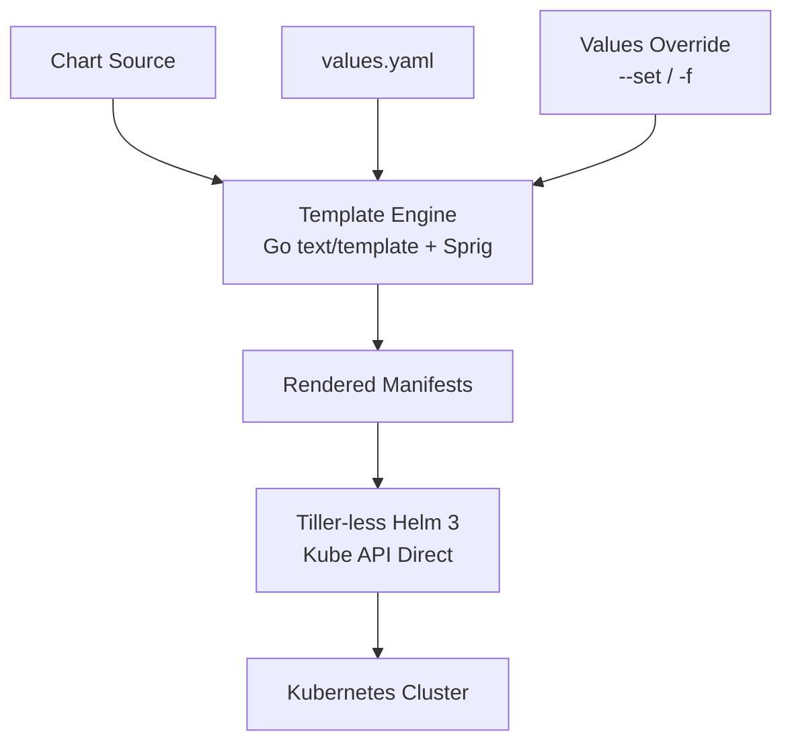
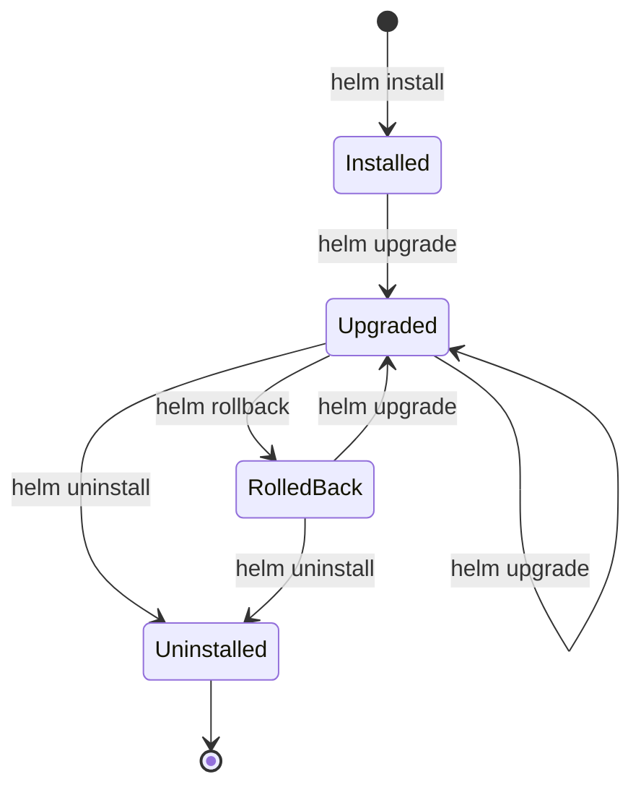

# Helm Charts - Templating, Values, Releases

## 1. Mục tiêu của task

Hiểu sâu bản chất Helm Charts - công cụ quản lý package cho Kubernetes, tập trung vào:
- Cơ chế templating và render template của Helm
- Hệ thống values và quản lý cấu hình đa môi trường
- Vòng đỳ releases và chiến lược quản lý phiên bản
- Trade-offs và best practices trong production

## 2. Bản chất và cơ chế hoạt động

### 2.1 Helm là gì? Tại sao cần Helm?

**Bản chất**: Helm là package manager + templating engine cho Kubernetes. Nó giải quyết bài toán:
- **Configuration drift**: Cùng một ứng dụng nhưng khác config giữa các môi trường
- **Versioning**: Theo dõi và rollback các phiên bản deployment
- **Reusability**: Package ứng dụng thành chart có thể cài đặt ở nhiều cluster

**Vấn đề Helm giải quyết**:
```
Không có Helm: 100 microservices × 4 môi trường = 400 YAML files cần maintain
Có Helm: 100 charts × 4 values files = Giảm 75% duplication, tập trung logic vào templates
```

### 2.2 Kiến trúc tổng quan



**Helm 3 vs Helm 2**:
| Aspect | Helm 2 | Helm 3 |
|--------|--------|--------|
| Architecture | Client-Server (Tiller) | Client-only |
| Security | Tiller có cluster-wide permissions | User permissions via kubeconfig |
| Release Storage | ConfigMaps/Secrets in kube-system | Secrets in release namespace |
| Library Charts | Limited | Full support |
| JSON Schema | Không | Có validation |

> **Quan trọng**: Helm 3 loại bỏ Tiller - component gây ra nhiều vấn đề bảo mật và operational complexity. Đây là lý do chính để migrate nếu đang dùng Helm 2.

### 2.3 Chart Structure Deep Dive

```
mychart/
├── Chart.yaml          # Metadata: name, version, dependencies
├── values.yaml         # Default configuration values
├── values.schema.json  # (Optional) JSON Schema validation
├── charts/             # Sub-charts dependencies
├── templates/          # Template files
│   ├── _helpers.tpl    # Named templates (reusable blocks)
│   ├── NOTES.txt       # Post-install instructions
│   ├── deployment.yaml
│   ├── service.yaml
│   ├── ingress.yaml
│   ├── hpa.yaml
│   ├── pdb.yaml
│   └── serviceaccount.yaml
└── README.md           # Documentation
```

**Chart.yaml bản chất**:
```yaml
apiVersion: v2           # v2 = Helm 3, v1 = Helm 2
name: myapp
description: A Helm chart for Kubernetes
type: application        # application | library
version: 1.2.3           # Chart version (SemVer)
appVersion: "2.0.0"      # Application version (informational)
kubeVersion: ">=1.21.0"  # Kubernetes version constraint
dependencies:
  - name: postgresql
    version: "12.x.x"
    repository: "https://charts.bitnami.com/bitnami"
    condition: postgresql.enabled  # Conditional dependency
    tags:
      - database
```

## 3. Template Engine - Cơ chế hoạt động

### 3.1 Go Template + Sprig

Helm sử dụng Go's `text/template` package kết hợp với [Sprig library](http://masterminds.github.io/sprig/) - bộ functions mở rộng.

**Rendering Pipeline**:
```
1. Parse tất cả files trong templates/
2. Load values từ values.yaml + overrides
3. Execute templates với values context
4. Validate output YAML
5. Apply vào cluster
```

**Cơ chế quan trọng - Template Context**:
```
Root context trong template = values + built-in objects:
- .Values      → Content của values.yaml + overrides
- .Release     → Metadata về release (Name, Namespace, Revision)
- .Chart       → Content của Chart.yaml
- .Capabilities → Cluster capabilities (API versions, KubeVersion)
- .Template    → Template being executed (Name, BasePath)
```

### 3.2 Template Functions & Control Structures

**Built-in Objects**:
| Object | Purpose | Example |
|--------|---------|---------|
| `.Values` | User-provided values | `.Values.replicaCount` |
| `.Release` | Release metadata | `.Release.Name`, `.Release.Namespace` |
| `.Chart` | Chart metadata | `.Chart.Name`, `.Chart.Version` |
| `.Capabilities` | Cluster info | `.Capabilities.KubeVersion.Version` |
| `.Template` | Template info | `.Template.Name` |
| `.Files` | Access non-template files | `.Files.Get "config.json"` |

**Control Structures**:
```yaml
# Conditionals
{{- if .Values.ingress.enabled }}
apiVersion: networking.k8s.io/v1
kind: Ingress
...
{{- end }}

# With scope (đổi context)
{{- with .Values.podSecurityContext }}
securityContext:
  {{- toYaml . | nindent 8 }}
{{- end }}

# Range (iteration)
{{- range .Values.env }}
- name: {{ .name }}
  value: {{ .value | quote }}
{{- end }}
```

### 3.3 Named Templates (Partial Templates)

`_helpers.tpl` chứa reusable template blocks - **pattern quan trọng cho DRY**:

```yaml
{{/* Common labels */}}
{{- define "myapp.labels" -}}
app.kubernetes.io/name: {{ include "myapp.name" . }}
helm.sh/chart: {{ include "myapp.chart" . }}
app.kubernetes.io/instance: {{ .Release.Name }}
app.kubernetes.io/managed-by: {{ .Release.Service }}
{{- end -}}

{{/* Selector labels */}}
{{- define "myapp.selectorLabels" -}}
app.kubernetes.io/name: {{ include "myapp.name" . }}
app.kubernetes.io/instance: {{ .Release.Name }}
{{- end -}}
```

**Sử dụng**:
```yaml
metadata:
  labels:
    {{- include "myapp.labels" . | nindent 4 }}
spec:
  selector:
    matchLabels:
      {{- include "myapp.selectorLabels" . | nindent 6 }}
```

> **Lưu ý quan trọng**: Dùng `nindent` thay vì `indent` khi include templates. `nindent` thêm newline trước content, tránh lỗi YAML formatting.

## 4. Values System - Quản lý Configuration

### 4.1 Values Hierarchy & Precedence

**Precedence (cao → thấp)**:
```
1. --set (command line)           # Highest priority
2. -f values-production.yaml      # Values files
3. values.yaml trong chart        # Default
4. Chart's parent values          # For subcharts
```

**Merge behavior**: Deep merge cho objects, override cho primitives.

```yaml
# values.yaml (default)
replicaCount: 1
resources:
  limits:
    cpu: 100m
    memory: 128Mi

# values-production.yaml
replicaCount: 5
resources:
  limits:
    cpu: 1000m      # Override
    memory: 1Gi     # Override
```

Kết quả merge:
```yaml
replicaCount: 5      # Override hoàn toàn
resources:
  limits:
    cpu: 1000m       # Override
    memory: 1Gi      # Override
```

### 4.2 Values Structuring Strategies

**Strategy 1: Flat Structure (đơn giản)**:
```yaml
replicaCount: 3
image: nginx:1.21
servicePort: 80
```

**Strategy 2: Hierarchical (khuyến nghị)**:
```yaml
replicaCount: 3

image:
  repository: nginx
  tag: "1.21"
  pullPolicy: IfNotPresent

service:
  type: ClusterIP
  port: 80
  annotations: {}

ingress:
  enabled: true
  className: nginx
  hosts:
    - host: api.example.com
      paths:
        - path: /
          pathType: Prefix
```

**Trade-offs**:
| Strategy | Pros | Cons |
|----------|------|------|
| Flat | Đơn giản, dễ override | Khó organize, dễ conflict names |
| Hierarchical | Clear organization | Dài hơn, phải nhớ path |

### 4.3 Multi-Environment Management

**Pattern: Environment-specific values files**:
```
values/
├── values.yaml           # Default (dev)
├── values.staging.yaml   # Staging overrides
├── values.production.yaml # Production overrides
└── values.local.yaml     # Local development
```

**Triển khai**:
```bash
# Development (default values.yaml)
helm install myapp ./mychart

# Staging
helm install myapp ./mychart -f values/values.staging.yaml

# Production
helm install myapp ./mychart -f values/values.production.yaml

# Local với custom settings
helm install myapp ./mychart -f values/values.local.yaml --set replicaCount=1
```

> **Best Practice**: Không bao giờ để secrets trong values files. Dùng Sealed Secrets, External Secrets Operator, hoặc Vault integration.

## 5. Releases - Vòng đỳ và Quản lý Phiên bản

### 5.1 Release Storage Mechanism

**Helm 3 Storage**:
- Releases được lưu dưới dạng **Secrets** trong namespace của release
- Secret name format: `sh.helm.release.v1.<release-name>.v<revision>`
- Data được lưu dưới dạng gzipped + base64 encoded

```bash
# Xem release secret
kubectl get secrets -n <namespace> | grep sh.helm.release
kubectl get secret sh.helm.release.v1.myapp.v5 -o yaml
```

**Tại sao dùng Secrets thay vì ConfigMaps?**:
- Bảo mật: Release data có thể chứa sensitive values
- RBAC: Secrets có permission model chi tiết hơn
- Encryption at rest: Secrets có thể được encrypt

### 5.2 Release Lifecycle



**Revision Management**:
```bash
# Xem lịch sử releases
helm history myapp

# Output:
# REVISION    UPDATED                     STATUS          CHART           APP VERSION
# 1           Mon Mar 1 10:00:00 2026     superseded      myapp-1.0.0     1.0.0
# 2           Mon Mar 1 11:00:00 2026     superseded      myapp-1.1.0     1.1.0
# 3           Mon Mar 1 12:00:00 2026     deployed        myapp-1.2.0     1.2.0
# 4           Mon Mar 1 13:00:00 2026     failed          myapp-1.3.0     1.3.0

# Rollback về revision 2
helm rollback myapp 2
```

### 5.3 Atomic Deployments & Hooks

**Atomic Flag** (khuyến nghị cho production):
```bash
helm upgrade --install myapp ./mychart --atomic --timeout 5m
```
- Nếu deployment fail → tự động rollback
- Tránh partial deployment states

**Helm Hooks** - Execute jobs at specific lifecycle points:

| Hook | Timing | Use Case |
|------|--------|----------|
| `pre-install` | Before resources created | Database migration setup |
| `post-install` | After all resources ready | Smoke tests, notifications |
| `pre-delete` | Before deletion | Backup data |
| `post-delete` | After deletion | Cleanup external resources |
| `pre-upgrade` | Before upgrade | Check prerequisites |
| `post-upgrade` | After upgrade | Migration, cache warming |
| `pre-rollback` | Before rollback | - |
| `post-rollback` | After rollback | - |

**Hook Example - Database Migration**:
```yaml
apiVersion: batch/v1
kind: Job
metadata:
  name: {{ include "myapp.fullname" . }}-db-migrate
  annotations:
    "helm.sh/hook": pre-upgrade,pre-install
    "helm.sh/hook-weight": "-5"
    "helm.sh/hook-delete-policy": before-hook-creation,hook-succeeded
spec:
  template:
    spec:
      restartPolicy: Never
      containers:
        - name: migrate
          image: "{{ .Values.image.repository }}:{{ .Values.image.tag }}"
          command: ["python", "manage.py", "migrate"]
```

> **Quan trọng**: `hook-delete-policy` giúp cleanup hooks đã chạy xong, tránh Job accumulation.

## 6. Advanced Patterns & Trade-offs

### 6.1 Subcharts & Dependencies

**Use Cases**:
- Deploy application + database trong cùng release
- Library charts cho common patterns

**Chart.yaml dependencies**:
```yaml
dependencies:
  - name: postgresql
    version: "12.x.x"
    repository: "https://charts.bitnami.com/bitnami"
    condition: postgresql.enabled
    alias: db  # Custom alias
  - name: redis
    version: "17.x.x"
    repository: "https://charts.bitnami.com/bitnami"
    condition: redis.enabled
```

**Condition Pattern**:
```yaml
# values.yaml
postgresql:
  enabled: true
  auth:
    username: myapp
    password: secret
```

**Trade-offs của Subcharts**:
| Approach | Pros | Cons |
|----------|------|------|
| Subcharts | Atomic deployment, shared lifecycle | Tight coupling, harder to upgrade independently |
| Separate Releases | Independent lifecycle | Coordination complexity, no atomic rollback |

> **Recommendation**: Subcharts cho tightly-coupled dependencies (app + its database), separate releases cho shared infrastructure (Redis cluster dùng bởi nhiều apps).

### 6.2 Library Charts

Library charts = reusable template functions, không deploy resources.

```yaml
# Chart.yaml của library
apiVersion: v2
name: common
description: Common library chart
type: library  # Quan trọng!
version: 1.0.0
```

**Named templates trong library**:
```yaml
{{/* common/templates/_labels.tpl */}}
{{- define "common.labels.standard" -}}
app.kubernetes.io/name: {{ .Chart.Name }}
app.kubernetes.io/instance: {{ .Release.Name }}
app.kubernetes.io/managed-by: {{ .Release.Service }}
{{- end -}}
```

**Sử dụng**:
```yaml
# Chart.yaml
dependencies:
  - name: common
    version: "1.x.x"
    repository: "file://../common"

# templates/deployment.yaml
metadata:
  labels:
    {{- include "common.labels.standard" . | nindent 4 }}
```

### 6.3 Schema Validation (JSON Schema)

`values.schema.json` validate values trước khi install/upgrade:

```json
{
  "$schema": "https://json-schema.org/draft-07/schema#",
  "type": "object",
  "properties": {
    "replicaCount": {
      "type": "integer",
      "minimum": 1,
      "maximum": 100
    },
    "image": {
      "type": "object",
      "properties": {
        "repository": { "type": "string" },
        "tag": { "type": "string" },
        "pullPolicy": {
          "type": "string",
          "enum": ["Always", "IfNotPresent", "Never"]
        }
      },
      "required": ["repository", "tag"]
    }
  },
  "required": ["image"]
}
```

**Lợi ích**:
- Fail fast - phát hiện lỗi cấu hình sớm
- Self-documenting - schema mô tả expected values
- IDE support - autocomplete, validation

## 7. Production Concerns & Anti-patterns

### 7.1 Common Anti-patterns

**Anti-pattern 1: Hardcoded values trong templates**:
```yaml
# ❌ Bad - không configurable
image: nginx:1.21

# ✅ Good - configurable qua values
image: "{{ .Values.image.repository }}:{{ .Values.image.tag }}"
```

**Anti-pattern 2: Missing resource limits**:
```yaml
# ❌ Bad - không có resource limits
resources: {}

# ✅ Good - default limits, override được
resources:
  limits:
    cpu: 100m
    memory: 128Mi
  requests:
    cpu: 100m
    memory: 128Mi
```

**Anti-pattern 3: Secrets trong values**:
```yaml
# ❌ Bad - secrets trong plaintext
password: mysecretpassword

# ✅ Good - reference external secret
env:
  - name: DB_PASSWORD
    valueFrom:
      secretKeyRef:
        name: db-credentials
        key: password
```

**Anti-pattern 4: Không dùng helper templates**:
```yaml
# ❌ Bad - duplicate logic
labels:
  app: myapp
  release: {{ .Release.Name }}

# ✅ Good - reusable helper
labels:
  {{- include "myapp.labels" . | nindent 4 }}
```

### 7.2 Security Best Practices

1. **RBAC Least Privilege**: Helm sử dụng kubeconfig permissions. Đảm bảo user chỉ có quyền cần thiết.

2. **Chart Verification**: Dùng provenance files và sign charts
```bash
helm package --sign --key mykey ./mychart
helm install --verify myapp ./mychart-1.0.0.tgz
```

3. **No Sensitive Data in Values**: Dùng External Secrets Operator
```yaml
# values.yaml
externalSecrets:
  enabled: true
  secretStore:
    name: vault-backend
    kind: SecretStore
```

4. **Pod Security Context**:
```yaml
podSecurityContext:
  runAsNonRoot: true
  runAsUser: 1000
  fsGroup: 1000

securityContext:
  allowPrivilegeEscalation: false
  readOnlyRootFilesystem: true
  capabilities:
    drop:
      - ALL
```

### 7.3 Observability

**Helm Release Monitoring**:
```bash
# List releases với status
helm list --all-namespaces --output json

# Release history
helm history myapp --max 10

# Diff giữa versions
helm diff upgrade myapp ./mychart --values values.production.yaml
```

**Prometheus Metrics cho Helm**:
- `helm_release_info` - Release metadata
- `helm_release_status` - Current status
- Custom: Export chart version metrics trong app

**Logging Best Practices**:
- Thêm `app.kubernetes.io/version` labels để trace
- Ghi revision vào application logs
- Dùng `helm get values myapp --revision 3` để debug

## 8. Comparison: Helm vs Alternatives

| Tool | Use Case | Pros | Cons |
|------|----------|------|------|
| **Helm** | Package management, templating | Mature, ecosystem lớn, templating mạnh | Templating complexity, "templating YAML" vấn đề |
| **Kustomize** | Native k8s config customization | Không cần additional tool, k8s native | No packaging, limited templating |
| **Jsonnet/Tanka** | Programmatic configs | Full programming language | Learning curve, smaller community |
| **CDK8s** | TypeScript/Python/Java configs | Type safety, IDE support | Abstraction overhead |
| **Pulumi** | Infrastructure as Code | Full programming language | Heavyweight, commercial |

**When to use what**:
- **Helm**: Cần package management, nhiều environments, shared charts
- **Kustomize**: Native k8s workflows, patching configs, simpler use cases
- **Jsonnet/Tanka**: Complex conditional logic, programmatic generation

> **Modern trend**: Kustomize được tích hợp sẵn trong kubectl (`kubectl apply -k`), Helm phù hợp hơn cho packaging và distribution.

## 9. Tooling Ecosystem

| Tool | Purpose |
|------|---------|
| `helm-diff` | Xem diff trước khi upgrade |
| `helm-secrets` | Integrate với SOPS/Mozilla Secrets |
| `helm-unittest` | Unit testing cho templates |
| `chart-testing` | CI/CD testing cho charts |
| `helmfile` | Declarative spec for helm deployments |

## 10. Kết luận

### Bản chất cốt lõi

Helm là **templating engine + package manager** giải quyết bài toán configuration management trong Kubernetes. Điểm mạnh cốt lõi:

1. **Templating**: Go template + Sprig cho conditional logic và reusable components
2. **Values hierarchy**: Deep merge cho multi-environment configuration
3. **Release tracking**: Revision-based rollback và history
4. **Packaging**: Distributable, versioned application packages

### Trade-offs chính

| Trade-off | Decision |
|-----------|----------|
| Templating complexity vs. Reusability | Chấp nhận learning curve để gain DRY principle |
| Helm vs Kustomize | Helm cho packaging, Kustomize cho native workflows |
| Subcharts vs Separate releases | Subcharts cho tight coupling, separate cho shared infra |
| Hooks vs CI/CD | Hooks cho app-specific logic, CI/CD cho orchestration |

### Rủi ro lớn nhất trong Production

1. **Configuration drift**: Không track values changes, manual edits vào cluster
2. **Secrets in values**: Hardcoded passwords trong git
3. **Failed upgrades không rollback**: Không dùng `--atomic` flag
4. **Resource limits missing**: Apps consume cluster resources unbounded
5. **Chart bloat**: Too many conditionals, unmaintainable templates

### Khuyến nghị thực chiến

1. Luôn dùng Helm 3 (no Tiller)
2. Mỗi chart nên deploy một application duy nhất
3. Implement JSON schema validation
4. Dùng `--atomic` và `--timeout` cho production deployments
5. Secrets management via External Secrets Operator, không bao giờ trong values
6. CI/CD integration: `helm lint`, `helm template`, `helm test`
7. Version bump automation với semantic versioning
