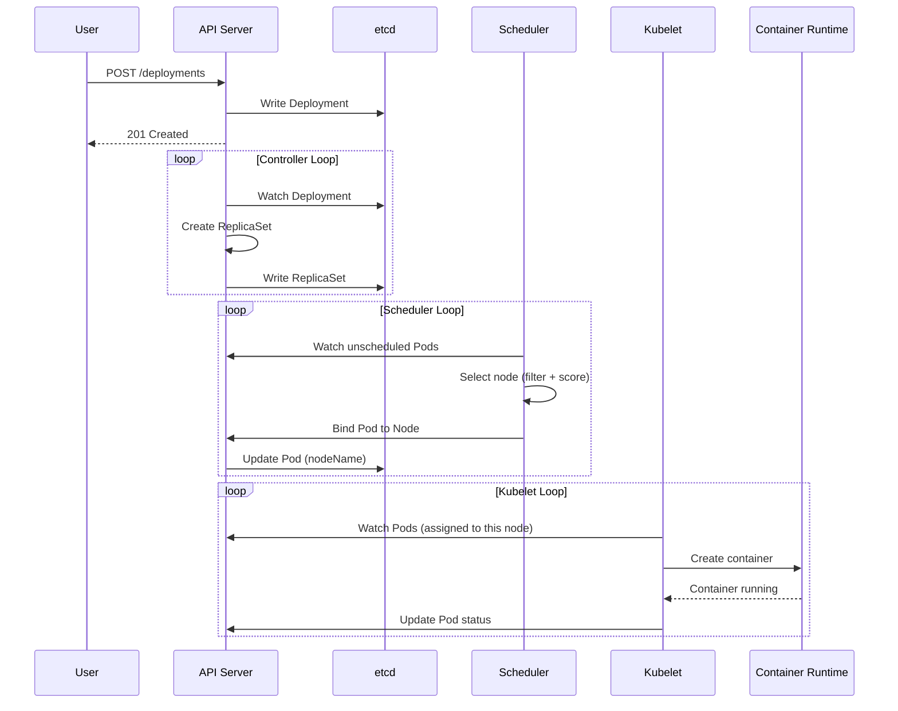
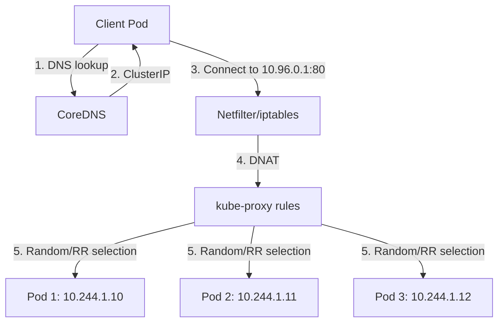

# Kubernetes Core Concepts: Deployments, Services, ConfigMaps & Health Probes

> **Nghiên cứu chuyên sâu về kiến trúc và cơ chế hoạt động nội bại của Kubernetes**  
> *Từ góc nhìn Senior Backend Architect - Tập trung vào bản chất, trade-off và production concerns*

---

## 1. Mục tiêu nghiên cứu

Hiểu sâu 4 khái niệm cốt lõi trong Kubernetes:

- **Deployment**: Cơ chế declarative rollout, rolling update và rollback
- **Service**: Service discovery, load balancing và kube-proxy internals  
- **ConfigMap**: Externalized configuration, hot reload và storage mechanism
- **Health Probes**: Liveness, Readiness, Startup probes - phân biệt rõ use case

---

## 2. Bản chất và cơ chế hoạt động

### 2.1 Deployment: Declarative Control Loop

#### Bản chất kiến trúc

Deployment **không trực tiếp quản lý Pod**. Thay vào đó, nó sử dụng **intermediary controller pattern** qua ReplicaSet:

```
Deployment → ReplicaSet → Pod
```

**Tại sao cần ReplicaSet trung gian?**

| Lý do | Giải thích |
|-------|-----------|
| **Immutability** | Mỗi thay đổi PodTemplate tạo ReplicaSet mới, giữ history |
| **Rollback capability** | ReplicaSet cũ không bị xóa ngay, cho phép revert |
| **Gradual rollout** | Scale up/down giữa old và new ReplicaSet tuần tự |
| **Self-healing** | ReplicaSet đảm bảo số lượng Pod đúng desired state |

#### Cơ chế Rolling Update

```
Phase 1: Old RS (replicas=3) ←── 100% traffic
         New RS (replicas=0)

Phase 2: Old RS (replicas=2) ←── 66% traffic  
         New RS (replicas=1) ←── 33% traffic

Phase 3: Old RS (replicas=0)
         New RS (replicas=3) ←── 100% traffic
```

**Controller Loop chi tiết:**

1. **Detection**: Deployment controller detect `.spec.template` thay đổi (hash comparison)
2. **New ReplicaSet Creation**: Tạo RS mới với `pod-template-hash` mới
3. **Scaling Logic**: `maxUnavailable` + `maxSurge` quyết định tốc độ rollout
4. **Progress Tracking**: `.status.updatedReplicas` theo dõi tiến độ
5. **Cleanup**: ReplicaSet cũ bị giữ lại theo `revisionHistoryLimit` (default: 10)

> **Critical Trade-off**: `maxSurge` cao = rollout nhanh nhưng tốn resource tạm thờ; `maxUnavailable` cao = tiết kiệm resource nhưng giảm availability

#### Pod-template-hash: Collision Avoidance

```yaml
# Pod label tự động sinh
labels:
  app: nginx
  pod-template-hash: "7c4f8b9d2a"  # hash của PodTemplateSpec
```

- Hash dựa trên **toàn bộ PodTemplateSpec** (containers, env, volumes, ...)
- Mỗi thay đổi nhỏ → hash khác → selector không match → RS mới
- Giúp Deployment **không bao gờ nhầm lẫn** giữa old và new Pods

---

### 2.2 Service: Virtual IP và Load Balancing

#### Bản chất Service IP

Kubernetes Service không phải là "real network interface". Nó là **virtual IP (ClusterIP)** được implement bởi kube-proxy trên mỗi node.

```
┌─────────────────────────────────────────┐
│              Pod Client                 │
│  curl http://my-service:80              │
│       ↓                                 │
│  DNS resolve: my-service → 10.96.123.45 │
│       ↓                                 │
│  Netfilter/iptables/IPVS interception   │
│       ↓                                 │
│  DNAT to Pod IP: 10.244.1.23:8080      │
└─────────────────────────────────────────┘
```

> **Key insight**: Traffic đến Service IP **never leaves the node** ở mức network layer - được intercept và redirect ngay tại kernel level.

#### EndpointSlice: Scalable Service Discovery

**Tại sao EndpointSlice thay thế Endpoints?**

| Endpoints (cũ) | EndpointSlice (mới) |
|----------------|---------------------|
| 1 object chứa tất cả endpoints | Chia thành nhiều slice (max 100 endpoints/slice) |
| O(n) update cost | O(1) update cost |
| Scaling bottleneck | Support 100,000+ endpoints |
| Single source of truth | Better for topology-aware routing |

```yaml
# EndpointSlice structure
addressType: IPv4
ports:
  - name: http
    protocol: TCP
    port: 80
endpoints:
  - addresses: ["10.244.1.10"]
    conditions:
      ready: true
      serving: true
      terminating: false
    nodeName: node-1
    zone: us-west1-a
```

#### kube-proxy Modes: Deep Comparison

| Mode | Mechanism | Pros | Cons | Use Case |
|------|-----------|------|------|----------|
| **iptables** | Netfilter rules | Simple, stable, low latency | O(n) rules, no connection draining | < 1000 services, default |
| **IPVS** | Kernel load balancer | O(1) lookup, rich LB algorithms | Extra kernel module, complexity | 1000+ services, high throughput |
| **nftables** | Modern netfilter | Better performance than iptables | Linux 5.13+ required | Future-proof |

**iptables mode chi tiết:**

```
Chain KUBE-SERVICES (references)
├── KUBE-SVC-ABC123 (match ClusterIP:Port) 
│   └── KUBE-SEP-XYZ789 (random/round-robin to endpoint)
│       └── DNAT to 10.244.1.10:8080
```

- Mỗi Service = 1 chain
- Mỗi Endpoint = 1 rule trong chain  
- `statistic mode random` để load balance

**IPVS mode chi tiết:**

```
ipvsadm -Ln
TCP  10.96.123.45:80 rr
  -> 10.244.1.10:8080    Masq    1    0    0
  -> 10.244.1.11:8080    Masq    1    0    0
```

- Sử dụng kernel's IP Virtual Server
- Native load balancing (rr, wrr, lc, wlc, sh, dh, ...)
- Better connection tracking và session affinity

> **Production Advice**: IPVS cho cluster >100 nodes hoặc >1000 services. iptables đủ cho majority use cases.

---

### 2.3 ConfigMap: Decoupling Configuration

#### Storage và Retrieval Flow

```
ConfigMap Creation
       ↓
   API Server validate
       ↓
   Write to etcd (plain text!)
       ↓
   kubelet watch → mount to Pod
```

**3 Mounting Strategies:**

| Method | Update Behavior | Use Case |
|--------|-----------------|----------|
| **Environment Variables** | Immutable (container start) | Static config, credentials |
| **Volume Mount** | Auto-update (kubelet sync) | Dynamic config, hot reload |
| **Command Args** | Immutable | Startup parameters |

#### Cơ chế Hot Reload (Volume Mount)

```
kubelet watch ConfigMap via API
       ↓
ConfigMap updated (kubectl apply)
       ↓
kubelet receive watch event
       ↓
Update file in /var/lib/kubelet/pods/.../volumes/...
       ↓
Application sees new content (atomic symlink swap)
```

> **Important Limitation**: File update là atomic nhưng **application phải tự detect và reload**. Kubernetes không restart container.

#### Size Limit và Performance

- **Hard limit**: 1 MiB (etcd limitation)
- **Binary data**: Base64 encode trong `binaryData` field
- **Performance**: Large ConfigMap = slow startup (kubelet phải mount nhiều data)

> **Anti-pattern Alert**: Đừng dùng ConfigMap cho large files. Dùng PersistentVolume hoặc object storage.

---

### 2.4 Health Probes: Container Lifecycle Management

#### 3 Loại Probe: Phân biệt rõ use case

```
Container Start
      ↓
Startup Probe ──► Success?
      │ Yes
      ↓
Liveness + Readiness Probes bắt đầu
      ↓
Readiness Pass? ──► YES: Traffic đi vào
      │                    NO: Remove khỏi Service endpoints
      ↓
Liveness Fail? ──► YES: Restart container
```

| Probe | Purpose | Action on Fail | Critical Config |
|-------|---------|----------------|-----------------|
| **Startup** | Detect slow-start apps | Nothing (wait) | `failureThreshold` cao |
| **Liveness** | Detect deadlock/hang | Restart container | `periodSeconds` ≥ 10 |
| **Readiness** | Detect not-ready state | Remove from LB | `initialDelaySeconds` |

#### Probe Execution chi tiết

**kubelet probe mechanism:**

```
kubelet goroutine (per container)
       ↓
Prober Manager điều phối
       ↓
Exec probe: docker exec / cat file
HTTP probe: GET /health (kubelet's net namespace)
TCP probe: net.DialTimeout
       ↓
Result → Update container status → API Server
```

> **Critical Insight**: Probes chạy trong **kubelet's network namespace**, không phải container's namespace. Đối với HTTP probe, kubelet connect trực tiếp đến container IP.

#### Probe Parameters Deep Dive

```yaml
livenessProbe:
  httpGet:
    path: /health
    port: 8080
    httpHeaders:
      - name: X-Health-Check
        value: "kubelet"
  initialDelaySeconds: 30    # Đợi app khởi động
  periodSeconds: 10          # Tần suất check
  timeoutSeconds: 5          # Request timeout
  successThreshold: 1        # Cần bao nhiêu success để pass
  failureThreshold: 3        # Cần bao nhiêu fail để trigger action
```

**Failure Threshold Calculation:**

```
Time to restart = initialDelaySeconds + (periodSeconds × failureThreshold)
                = 30 + (10 × 3) 
                = 60 seconds
```

> **Production Rule**: Liveness probe phải có `failureThreshold` cao hơn Readiness. Nếu không sẽ gây restart loop khi app bị quá tải.

---

## 3. Kiến trúc và Luồng xử lý

### 3.1 Pod Creation Flow



### 3.2 Service Traffic Flow



---

## 4. So sánh và Trade-off

### 4.1 Deployment Strategies

| Strategy | Speed | Risk | Zero Downtime | Use Case |
|----------|-------|------|---------------|----------|
| **RollingUpdate** | Medium | Medium | Yes | Default, most apps |
| **Recreate** | Fast (downtime) | Low | No | Dev, stateful singletons |
| **Blue-Green** | Fast | Low | Yes | Critical production |
| **Canary** | Slow | Low | Yes | Risky changes |

### 4.2 Service Types

| Type | Internal | External | Use Case |
|------|----------|----------|----------|
| **ClusterIP** | ✓ | ✗ | Internal communication |
| **NodePort** | ✓ | ✓ (via node IP) | Dev, bypass LB |
| **LoadBalancer** | ✓ | ✓ (cloud LB) | Production external |
| **ExternalName** | DNS CNAME only | - | External service proxy |
| **Headless** | Direct Pod IPs | - | StatefulSets, direct access |

### 4.3 ConfigMap vs Secret

| Aspect | ConfigMap | Secret |
|--------|-----------|--------|
| **Purpose** | Non-sensitive config | Sensitive data |
| **etcd storage** | Plain text | Base64 (not encrypted by default!) |
| **Size limit** | 1 MiB | 1 MiB |
| **RAM handling** | Mounted as tmpfs | Mounted as tmpfs (no swap) |
| **Access control** | RBAC | RBAC + encryption at rest |

---

## 5. Rủi ro, Anti-patterns và Pitfalls

### 5.1 Deployment Anti-patterns

```yaml
# ❌ ANTI-PATTERN: Using 'latest' tag
image: myapp:latest  # Rollback impossible, cache issues

# ✅ GOOD: Immutable tags
image: myapp:v1.2.3-sha256:abc123...
```

```yaml
# ❌ ANTI-PATTERN: No resource limits
resources: {}  # Noisy neighbor, OOM killed arbitrarily

# ✅ GOOD: Explicit resources
resources:
  requests:
    memory: "256Mi"
    cpu: "250m"
  limits:
    memory: "512Mi"  # No CPU limit = allow burst
```

```yaml
# ❌ ANTI-PATTERN: No health probes
# Container được coi là "running" ngay khi process start
# Dẫn đến 502 errors khi traffic đi vào app chưa ready

# ✅ GOOD: All 3 probes
cstartupProbe: ...  # Cho slow-start apps
readinessProbe: ... # Traffic routing
livenessProbe: ...  # Deadlock detection
```

### 5.2 Service Pitfalls

**Session Affinity Confusion:**

```yaml
# ❌ ANTI-PATTERN: Assuming sticky session mặc định
# kube-proxy load balance randomly by default

# ✅ GOOD: Explicit when needed
sessionAffinity: ClientIP
sessionAffinityConfig:
  clientIP:
    timeoutSeconds: 10800
```

**DNS Caching Issues:**

```
Application cache DNS result indefinitely
       ↓
Service endpoints thay đổi (Pod reschedule)
       ↓
App vẫn connect đến old Pod IP (connection refused/timeout)
```

> **Fix**: Dùng Service IP (stable) thay vì Pod IP. Hoặc implement DNS TTL respect trong app.

### 5.3 ConfigMap/Secret Risks

**Security Misconfigurations:**

```yaml
# ❌ CRITICAL: Secret trong env var
env:
  - name: DB_PASSWORD
    valueFrom:
      secretKeyRef:
        name: db-secret
        key: password
# Risk: env vars visible trong /proc, ps, docker inspect

# ✅ BETTER: Volume mount (tmpfs, not disk)
volumeMounts:
  - name: secret-volume
    mountPath: /secrets
    readOnly: true
```

**etcd Encryption:**

> **Default**: Secrets lưu trong etcd **không encrypted** (base64 ≠ encryption)

```bash
# Kiểm tra encryption
etcdctl get /registry/secrets/default/my-secret
# Output: plaintext password!
```

**Solution**: Enable Encryption at Rest:

```yaml
# EncryptionConfiguration
apiVersion: apiserver.config.k8s.io/v1
kind: EncryptionConfiguration
resources:
  - resources:
      - secrets
    providers:
      - aescbc:
          keys:
            - name: key1
              secret: <base64-encoded-key>
      - identity: {}  # fallback
```

### 5.4 Probe Failures Cascade

```yaml
# ❌ ANTI-PATTERN: Liveness probe quá nhạy
livenessProbe:
  httpGet:
    path: /health
    port: 8080
  periodSeconds: 1      # Quá nhanh
  failureThreshold: 1   # Restart ngay khi 1 fail
  
# Hệ quả: High load → slow response → restart loop → more load
```

> **Golden Rule**: Liveness probe failureThreshold ≥ 3 × Readiness probe failureThreshold

---

## 6. Khuyến nghị Production

### 6.1 Deployment Best Practices

```yaml
apiVersion: apps/v1
kind: Deployment
metadata:
  name: production-app
spec:
  replicas: 3
  strategy:
    type: RollingUpdate
    rollingUpdate:
      maxSurge: 25%        # Cho phép tạm thờ 4 pods
      maxUnavailable: 0    # Không giảm availability
  revisionHistoryLimit: 10  # Giữ history để rollback
  minReadySeconds: 30       # Đợi pod thực sự stable
  template:
    spec:
      terminationGracePeriodSeconds: 60  # Cho graceful shutdown
      containers:
        - name: app
          image: app:v1.2.3  # Immutable tag
          resources:
            requests:
              memory: "512Mi"
              cpu: "500m"
            limits:
              memory: "1Gi"    # Memory limit bắt buộc
          securityContext:
            runAsNonRoot: true
            readOnlyRootFilesystem: true
```

### 6.2 Service Production Checklist

- [ ] Sử dụng **ClusterIP** cho internal communication
- [ ] Đặt **multi-AZ topology** cho high availability  
- [ ] Enable **topology-aware routing** (k8s 1.27+)
- [ ] Đặt **externalTrafficPolicy: Local** khi cần preserve client IP
- [ ] Monitor endpointSlice sync latency

### 6.3 ConfigMap/Secret Production

```yaml
# ConfigMap cho non-sensitive
data:
  LOG_LEVEL: "info"
  MAX_CONNECTIONS: "100"

# Secret cho sensitive (đã encrypted at rest)
stringData:  # Không cần base64 encode thủ công
  DB_PASSWORD: "actual-password"
```

**External Secret Management:**

> Production nên dùng **External Secrets Operator** hoặc **Vault CSI** để:
- Không lưu secrets trong git
- Rotation tự động
- Audit logging

### 6.4 Health Probe Production Standards

```yaml
# Startup Probe - cho apps khởi động chậm
startupProbe:
  httpGet:
    path: /health/startup
    port: 8080
  failureThreshold: 30    # 30 × 10s = 5 min max startup
  periodSeconds: 10

# Readiness Probe - traffic routing
readinessProbe:
  httpGet:
    path: /health/ready
    port: 8080
  initialDelaySeconds: 5
  periodSeconds: 5
  failureThreshold: 3     # 15s before removal from LB

# Liveness Probe - deadlock detection  
livenessProbe:
  httpGet:
    path: /health/live
    port: 8080
  initialDelaySeconds: 10
  periodSeconds: 10
  failureThreshold: 6     # 60s before restart (phải > readiness)
  timeoutSeconds: 5
```

**Endpoint Design:**

```java
// /health/ready - kiểm tra dependencies (DB, cache)
@GetMapping("/health/ready")
public ResponseEntity<Void> ready() {
    if (!database.isConnected() || !cache.isAvailable()) {
        return ResponseEntity.status(503).build();
    }
    return ResponseEntity.ok().build();
}

// /health/live - chỉ kiểm tra JVM chưa deadlock
@GetMapping("/health/live")
public ResponseEntity<Void> live() {
    return ResponseEntity.ok().build();  // Đơn giản, nhanh
}
```

### 6.5 Monitoring Essentials

| Metric | Source | Alert Threshold |
|--------|--------|-----------------|
| Pod restart rate | kubelet | > 5 restarts/hour |
| Probe failures | kubelet | Any failure > 0 |
| EndpointSlice lag | API server | > 30 seconds |
| Deployment rollout stuck | Deployment | ProgressDeadlineExceeded |
| OOMKilled events | Events | Any occurrence |

---

## 7. Kết luận

### Bản chất cốt lõi

| Concept | Bản chất | Mục tiêu thiết kế |
|---------|----------|-------------------|
| **Deployment** | Control loop qua ReplicaSet abstraction | Declarative updates + rollback |
| **Service** | Virtual IP + kube-proxy load balancing | Decoupling + stable endpoint |
| **ConfigMap** | etcd-backed key-value store | Externalized configuration |
| **Health Probes** | Kubelet-driven lifecycle hooks | Automated failure recovery |

### Trade-off quan trọng nhất

1. **Deployment**: `maxSurge` vs `maxUnavailable` - Speed vs Resource cost
2. **Service**: iptables vs IPVS - Simplicity vs Scalability  
3. **ConfigMap**: Hot reload capability vs Application complexity
4. **Probes**: Sensitivity vs Stability - False positive restart loops

### Rủi ro production lớn nhất

1. **No resource limits** → OOM cascade failures
2. **Missing readiness probe** → Traffic to unready pods
3. **Over-sensitive liveness** → Restart storms under load
4. **Unencrypted secrets** → etcd data breach exposure
5. **'latest' image tag** → Unreproducible deployments

### Tư duy áp dụng

> Kubernetes là **desired state system**, không phải imperative commands. Hãy:
- Define desired state rõ ràng trong YAML
- Let controllers handle the how
- Monitor actual vs desired state gap
- Design for failure (pods ephemeral by design)

---

*Research completed: 2026-03-28*  
*Next topic: Helm Charts - Templating và Release Management*
