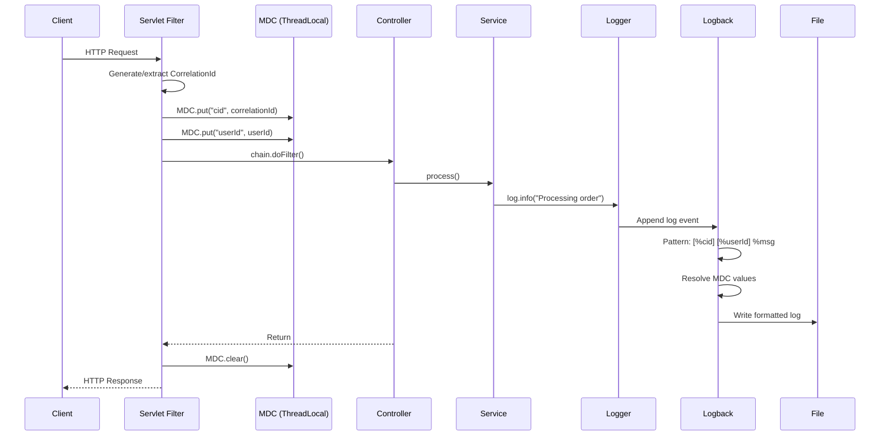
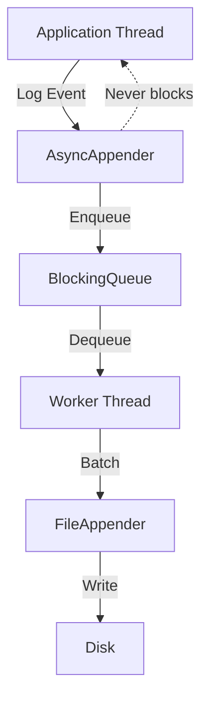

# Structured Logging - SLF4J, Logback, MDC, Correlation IDs

## 1. Mục tiêu của Task

Hiểu sâu bản chất của logging trong hệ thống production: tại sao cần structured logging, cách triển khai với SLF4J/Logback, cơ chế MDC hoạt động, và vai trò của Correlation ID trong distributed systems.

> **Core Question**: Tại sao `System.out.println()` là anti-pattern và logging framework phức tạp như vậy để làm gì?

---

## 2. Bản Chất và Cơ Chế Hoạtộng

### 2.1 Tại Sao Cần Logging Framework?

**Bản chất vấn đề**: Logging không chỉ là "in ra console". Trong production, log là:
- **Dữ liệu** để debug, audit, phân tích
- **Luồng thông tin** cần routing tới nhiều destination
- **Cấu trúc** để máy có thể parse và query

**Trade-off của logging**:

| Không dùng Framework | Dùng SLF4J + Logback |
|---------------------|---------------------|
| + Đơn giản, không dependency | + Decoupled, thay đổi implementation dễ dàng |
| + Không learning curve | + Multiple appenders, async logging |
| - Không thể tắt log ở runtime | + Structured output (JSON) |
| - Không format/template | + MDC cho distributed context |
| - Performance kém (string concatenation) | + Auto-sampling, throttling |

### 2.2 SLF4J - Facade Pattern trong Logging

SLF4J áp dụng **Facade Pattern** để decouple application code khỏi logging implementation:

```
┌─────────────────────────────────────┐
│      Application Code               │
│   LoggerFactory.getLogger(...)      │
└──────────────┬──────────────────────┘
               │
               ▼
┌─────────────────────────────────────┐
│           SLF4J API                 │
│      (Logger, LoggerFactory)        │
└──────────────┬──────────────────────┘
               │ Binding (runtime)
               ▼
┌─────────────────────────────────────┐
│    Logback / Log4j2 / JUL / ...     │
└─────────────────────────────────────┘
```

**Bản chất binding**: SLF4J sử dụng `StaticLoggerBinder` được tạo ra tại compile-time bởi concrete implementation. Đây là lý do:
- Chỉ được phép có **1 implementation** trên classpath
- Cần exclude transitive dependencies (ví dụ: Spring Boot đã include logback, không thêm log4j-slf4j-impl)

> ⚠️ **Common Pitfall**: `Multiple SLF4J bindings found on classpath` - ứng dụng vẫn chạy nhưng behavior không đoán trước được.

### 2.3 Logback Architecture

Logback có 3 thành phần chính:

```
Logger (named hierarchy)
    │
    ├── Level (TRACE < DEBUG < INFO < WARN < ERROR)
    │
    ├── Appender (output destination)
    │       ├── ConsoleAppender
    │       ├── FileAppender
    │       ├── RollingFileAppender
    │       ├── AsyncAppender
    │       └── SMTPAppender / DBAppender / ...
    │
    └── Encoder/Layout (formatting)
            ├── PatternLayoutEncoder
            └── JsonEncoder
```

**Logger Hierarchy**: Loggers có tên dạng package (`com.example.service.UserService`). Child logger kế thừa level từ parent nếu không explicitly set.

```
root (INFO)
├── com (INFO - inherited)
│   └── example (INFO - inherited)
│       └── service (DEBUG - explicitly set)
│           └── UserService (DEBUG - inherited)
```

> **Key Insight**: Setting `com.example.service` = DEBUG chỉ affect package đó, không làm noise từ Spring/Hibernate internal.

### 2.4 MDC - Mapped Diagnostic Context

**Bản chất**: MDC là một **ThreadLocal<Map<String, String>>** (hoặc scoped value trong Java 21+ với virtual threads).

```
Thread A:                              Thread B:
┌──────────────────┐                  ┌──────────────────┐
│ MDC: {           │                  │ MDC: {           │
│   requestId: 123 │                  │   requestId: 456 │
│   userId: abc    │                  │   userId: def    │
│ }                │                  │ }                │
└──────────────────┘                  └──────────────────┘
        │                                      │
        ▼                                      ▼
   Log: [123][abc] GET /api/users        [456][def] POST /api/orders
```

**Cơ chế ThreadLocal**:
- Mỗi thread có bản sao riêng của MDC map
- **Vấn đề với Thread Pool**: Khi thread được reuse, MDC từ request trước vẫn còn!
- **Giải pháp**: Luôn `MDC.clear()` hoặc `MDC.remove(key)` khi request kết thúc (thường trong finally block hoặc Servlet Filter)

**Virtual Threads (Java 21+)**: ThreadLocal không scale tốt với virtual threads (millions threads). Java 21 giới thiệu **ScopedValue** - lightweight, immutable, và tự động cleanup khi scope kết thúc.

### 2.5 Correlation ID - Distributed Tracing Context

**Bản chất bài toán**: Trong microservices, 1 request đi qua nhiều services. Làm sao trace đường đi?

```
Client ──► API Gateway ──► User Service ──► Order Service ──► Payment Service
              │                │                  │                  │
         [cid:abc123]     [cid:abc123]      [cid:abc123]      [cid:abc123]
```

**Correlation ID Pattern**:
1. Gateway tạo/random UUID khi nhận request
2. Ghi vào MDC + truyền qua HTTP Header (`X-Correlation-Id`)
3. Mỗi service downstream extract từ header, đưa vào MDC
4. Log format include correlation ID

**Propagation**:
- **Synchronous**: HTTP Header (Feign, RestTemplate, WebClient interceptor)
- **Asynchronous**: Message Header (Kafka, RabbitMQ)
- **Thread pool**: `MDC.getCopyOfContextMap()` + `MDC.setContextMap()` khi submit task

---

## 3. Kiến Trúc và Luồng Xử Lý

### 3.1 Request Lifecycle với MDC



### 3.2 Async Logging Architecture



**Bản chất AsyncAppender**:
- Application thread chỉ "gửi" log event vào queue (O(1))
- Worker thread riêng handle I/O blocking operation
- Queue full behavior: **DROP** (mất log) hoặc **BLOCK** (slow down app)
- **Trade-off**: Latency vs durability

---

## 4. So Sánh Các Lựa Chọn

### 4.1 Logging Implementations

| Feature | Logback | Log4j2 | java.util.logging |
|---------|---------|--------|-------------------|
| Performance | Tốt | Tốt nhất (LMAX Disruptor) | Cơ bản |
| Async logging | Có (AsyncAppender) | Built-in, tối ưu | Không |
| JSON output | Cần encoder | Built-in JSONLayout | Không |
| Configuration | XML/Groovy | XML/JSON/YAML | Properties |
| Spring Boot default | ✅ Default | Cần exclude logback | Không support |

> **Recommendation**: Logback đủ tốt cho hầu hết use cases. Chuyển Log4j2 nếu throughput > 100K logs/second và latency cực kỳ quan trọng.

### 4.2 Structured Log Formats

| Format | Pros | Cons | Use Case |
|--------|------|------|----------|
| **Plain Text** | Human readable, simple | Khó parse, không query được | Local dev, small scale |
| **JSON** | Machine parseable, schema | Verbose, harder to read | Production, ELK/Loki |
| **Logfmt** | Balance readability/parse | Ít tool hỗ trợ | Heroku-style |

**JSON Schema recommendation**:
```json
{
  "timestamp": "2024-01-15T10:30:00.000Z",
  "level": "INFO",
  "logger": "com.example.OrderService",
  "thread": "http-nio-8080-exec-3",
  "message": "Order created",
  "correlationId": "abc123",
  "userId": "user456",
  "duration": 45,
  "context": {
    "orderId": "ORD-789",
    "amount": 100.00
  }
}
```

### 4.3 MDC Alternatives

| Approach | Pros | Cons |
|----------|------|------|
| **ThreadLocal (MDC)** | Simple, native support | Không work với reactive (WebFlux), cần cleanup |
| **Reactor Context** | Native reactive support | Chỉ Project Reactor, learning curve |
| **Virtual Threads + ScopedValue** | Lightweight, auto-cleanup | Java 21+, ecosystem chưa mature |

---

## 5. Rủi Ro, Anti-Patterns và Lỗi Thường Gặp

### 5.1 Anti-Patterns Nguy Hiểm

```java
// ❌ ANTI-PATTERN: String concatenation
log.info("Processing order " + orderId + " for user " + userId);
// -> Luôn execute concatenation dù log level disabled

// ✅ CORRECT: Parameterized logging
log.info("Processing order {} for user {}", orderId, userId);
// -> SLF4J chỉ format nếu level enabled

// ❌ ANTI-PATTERN: Log và throw
log.error("Failed to process", e);
throw new OrderException("Failed", e);
// -> Duplicate stack trace, noise trong log

// ✅ CORRECT: Chỉ throw, caller sẽ log nếu cần
throw new OrderException("Failed to process order " + orderId, e);

// ❌ ANTI-PATTERN: Log sensitive data
log.info("User login: password={}", password);
// -> PCI-DSS/SOC2 violation, data leak

// ✅ CORRECT: Mask hoặc không log
log.info("User {} logged in", userId);
```

### 5.2 MDC Memory Leak

```java
// ❌ ANTI-PATTERN: Không clear MDC
@GetMapping("/api/users/{id}")
public User getUser(@PathVariable String id) {
    MDC.put("userId", id);
    return userService.findById(id);
    // MDC vẫn còn "userId" sau khi request kết thúc!
    // Thread pool reuse -> wrong userId cho request sau
}

// ✅ CORRECT: Try-finally hoặc Filter
public void doFilter(request, response, chain) {
    String cid = extractOrGenerate(request);
    MDC.put("cid", cid);
    try {
        chain.doFilter(request, response);
    } finally {
        MDC.clear(); // Luôn cleanup
    }
}
```

### 5.3 Async Logging Risks

| Risk | Impact | Mitigation |
|------|--------|------------|
| Queue full | Mất log hoặc block app | Monitor queue size, đủ disk I/O |
| JVM crash | Mất log trong queue | `immediateFlush=true` cho critical logs |
| Disk full | Silent log loss | Log rotation, alerting |
| Wrong MDC context | Correlation ID mismatch | Clear MDC trước khi reuse thread |

### 5.4 Log Injection Attack

```java
// User input: "Order\n[FAKE] Legitimate log entry"
log.info("Processing order: {}", userInput);

// Output:
// 2024-01-15 INFO Processing order: Order
// 2024-01-15 [FAKE] Legitimate log entry  <- FAKE ENTRY!

// ✅ CORRECT: Sanitize input hoặc dùng JSON encoder
// JSON encoder tự động escape newline và special chars
```

---

## 6. Khuyến Nghị Thực Chiến Production

### 6.1 Configuration Best Practices

**logback-spring.xml** (Spring Boot):
```xml
<configuration>
    <!-- Console cho dev/local -->
    <springProfile name="!prod">
        <appender name="CONSOLE" class="ch.qos.logback.core.ConsoleAppender">
            <encoder>
                <pattern>%d{HH:mm:ss.SSS} [%thread] %-5level %logger{36} - %msg%n</pattern>
            </encoder>
        </appender>
        <root level="INFO">
            <appender-ref ref="CONSOLE"/>
        </root>
    </springProfile>

    <!-- JSON cho production -->
    <springProfile name="prod">
        <appender name="JSON" class="ch.qos.logback.core.ConsoleAppender">
            <encoder class="net.logstash.logback.encoder.LogstashEncoder">
                <includeContext>true</includeContext>
                <includeMdc>true</includeMdc>
                <fieldNames>
                    <timestamp>timestamp</timestamp>
                    <message>message</message>
                </fieldNames>
            </encoder>
        </appender>
        <root level="WARN">
            <appender-ref ref="JSON"/>
        </root>
        <!-- DEBUG cho package riêng -->
        <logger name="com.example" level="INFO"/>
    </springProfile>
</configuration>
```

### 6.2 MDC Filter Pattern

```java
@Component
@Order(Ordered.HIGHEST_PRECEDENCE)
public class CorrelationIdFilter extends OncePerRequestFilter {
    private static final String CID_HEADER = "X-Correlation-Id";
    private static final String CID_MDC_KEY = "cid";
    
    @Override
    protected void doFilterInternal(HttpServletRequest request, 
                                    HttpServletResponse response, 
                                    FilterChain chain) throws ServletException, IOException {
        String cid = request.getHeader(CID_HEADER);
        if (cid == null) {
            cid = UUID.randomUUID().toString();
        }
        
        MDC.put(CID_MDC_KEY, cid);
        response.setHeader(CID_HEADER, cid);
        
        try {
            chain.doFilter(request, response);
        } finally {
            MDC.clear();
        }
    }
}
```

### 6.3 Monitoring và Alerting

**Metrics cần theo dõi**:
- Log rate (logs/second) - detect log spam
- Error rate (% ERROR logs) - SLI cho reliability
- Async queue size - detect backpressure
- Disk usage - prevent log loss

**Sample Prometheus query**:
```promql
# Error rate trong 5 phút
sum(rate(logback_events_total{level="error"}[5m])) by (service)

# Log rate anomaly
sum(rate(logback_events_total[1m])) > 10000  # Bất thường nếu > 10K/s
```

### 6.4 Cost Optimization

Logs là **expensive** ở scale lớn:

| Strategy | Implementation | Saving |
|----------|---------------|--------|
| **Sampling** | Log 1% của DEBUG/INFO | 99% volume |
| **Dynamic level** | Switch WARN/INFO runtime | Immediate |
| **Hot/cold separation** | Recent logs: SSD, old: S3 | 80% storage |
| **Filtering** | Drop health check logs | 10-20% volume |

---

## 7. Kết Luận

### Bản Chất Cốt Lõi

1. **SLF4J** là facade - decouple code khỏi implementation, cho phép thay đổi mà không sửa code

2. **MDC** là ThreadLocal storage - cơ chế đơn giản nhưng yêu cầu strict cleanup để tránh leak context

3. **Correlation ID** là pattern - không phải library feature, là kỷ luật propagate context qua tất cả boundaries

4. **Structured logging** là bước tiến hóa - từ human-readable text sang machine-parseable data

### Trade-off Quan Trọng Nhất

**Throughput vs Durability**: Async logging cho throughput cao nhưng accept risk mất log khi crash. Critical logs (audit, security) nên synchronous.

### Rủi Ro Lớn Nhất

**MDC context leak trong thread pool** - silent bug, khó detect, ảnh hưởng data isolation giữa các request. Luôn `MDC.clear()` trong finally block.

### Checklist Production

- [ ] JSON output cho production
- [ ] Correlation ID filter với auto-cleanup
- [ ] Parameterized logging (không concat)
- [ ] No sensitive data in logs
- [ ] Async appender với queue monitoring
- [ ] Log rotation và retention policy
- [ ] Error rate alerting
- [ ] Performance: sampling cho DEBUG/TRACE

---

## 8. Code Tham Khảo (Tối Thiểu)

### Logstash Encoder Dependency

```xml
<dependency>
    <groupId>net.logstash.logback</groupId>
    <artifactId>logstash-logback-encoder</artifactId>
    <version>7.4</version>
</dependency>
```

### WebClient Correlation ID Propagation

```java
public WebClient createWebClient(WebClient.Builder builder) {
    return builder
        .filter((request, next) -> {
            String cid = MDC.get("cid");
            if (cid != null) {
                request.headers().add("X-Correlation-Id", cid);
            }
            return next.exchange(request);
        })
        .build();
}
```

### MDC với Virtual Threads (Java 21+)

```java
// ScopedValue thay thế ThreadLocal
private static final ScopedValue<String> CID = ScopedValue.newInstance();

public void handleRequest(Request req) {
    ScopedValue.where(CID, generateCid())
               .run(() -> {
                   // Trong scope này, CID.get() available
                   process(req);
               });
    // Auto-cleanup khi scope kết thúc
}
```

---

**Tài liệu tham khảo**:
- SLF4J Manual: https://www.slf4j.org/manual.html
- Logback Documentation: https://logback.qos.ch/documentation.html
- Java ScopedValue (JEP 446): https://openjdk.org/jeps/446
