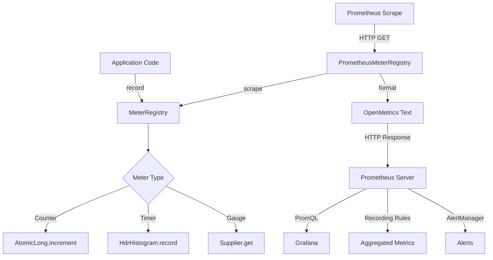

# Metrics Collection: Micrometer, Prometheus & Custom Metrics

## 1. Mục tiêu của Task

Task này tập trung vào bản chất của hệ thống metrics trong production, bao gồm:
- Cơ chế hoạt động của Micrometer như một abstraction layer
- Giao thức pull-based của Prometheus và tại sao lại chọn pull thay vì push
- Thiết kế và triển khai custom metrics đúng cách
- Vận hành, monitoring và troubleshooting metrics ở scale lớn

---

## 2. Bản Chất và Cơ Chế Hoạt Động

### 2.1. Micrometer: Facade Pattern cho Metrics

**Bản chất kiến trúc:**
Micrometer hoạt động như một **facade pattern** giữa application code và các monitoring backends khác nhau. Thiết kế này giải quyết bài toán vendor lock-in trong observability.

```
┌─────────────────────────────────────────────────────────────┐
│                    Application Code                         │
│  registry.counter("http.requests", "uri", "/api/users")     │
└──────────────────────┬──────────────────────────────────────┘
                       │
                       ▼
┌─────────────────────────────────────────────────────────────┐
│              Micrometer MeterRegistry                       │
│  ┌─────────────┐  ┌──────────────┐  ┌──────────────────┐   │
│  │   Counter   │  │   Timer      │  │   Gauge          │   │
│  │  (AtomicLong)│  │ (HdrHistogram)│  │ (Supplier<T>)   │   │
│  └─────────────┘  └──────────────┘  └──────────────────┘   │
└──────────────────────┬──────────────────────────────────────┘
                       │
           ┌───────────┼───────────┐
           ▼           ▼           ▼
    ┌──────────┐ ┌──────────┐ ┌──────────┐
    │Prometheus│ │  StatsD  │ │DataDog   │
    │  (Pull)  │ │  (Push)  │ │  (Push)  │
    └──────────┘ └──────────┘ └──────────┘
```

**Meter Types và cơ chế bên trong:**

| Meter Type | Cơ chế lưu trữ | Use case | Chi phí memory |
|------------|---------------|----------|----------------|
| **Counter** | `AtomicLong` (thread-safe) | Đếm sự kiện (requests, errors) | Thấp - 8 bytes |
| **Timer** | `HdrHistogram` + `TimeWindowMax` | Latency distribution | Cao - ~10KB/metric |
| **Gauge** | `WeakReference<Supplier<T>>` | Giá trị tại thởi điểm hiện tại | Thấp - 1 reference |
| **DistributionSummary** | `HdrHistogram` | Payload size, queue length | Cao - ~10KB/metric |
| **LongTaskTimer** | `ConcurrentHashMap<Long, Sample>` | Đo thởi gian chạy của tasks dài hạn | Trung bình |

**Tại sao Counter dùng `AtomicLong` mà không phải `LongAdder`?**
- `LongAdder` tốt hơn cho high-contention scenarios (nhiều threads cùng write)
- Tuy nhiên, metrics thường được read rất thường xuyên (scrape intervals 15-30s)
- `AtomicLong` có read path nhanh hơn đáng kể so với `LongAdder.sum()`
- Micrometer chấp nhận trade-off này vì scrape operations diễn ra liên tục

**Timer và HdrHistogram:**
- Timer không lưu từng sample riêng lẻ → memory bounded
- Sử dụng `HdrHistogram` với mỗi bucket là một counter
- Mặc định: 3 significant digits precision, max value ~1 hour
- Memory footprint cố định (~10KB) bất kể số lượng samples

### 2.2. Prometheus: Pull-Based Architecture

**Tại sao Pull thay vì Push?**

| Aspect | Pull (Prometheus) | Push (StatsD, DataDog) |
|--------|-------------------|------------------------|
| **Phát hiện targets** | Service discovery tự động | Cần configure endpoint |
| **High availability** | Multiple Prometheus instances scrape cùng target | Load balancing phức tạp |
| **Debugging** | `curl localhost:8080/actuator/prometheus` | Khó trace metrics từ đâu |
| **Network partitions** | Không nhận data = target down (clear signal) | Buffer đầy → drop silently |
| **Rate calculation** | Client timestamp → accurate rate | Server receive time → drift issues |
| **Cardinality control** | Prometheus reject khi quá nhiều labels | Client gửi liên tục |

**Cơ chế scrape:**
```
┌──────────────┐                    ┌──────────────┐
│  Prometheus  │ ──GET /metrics────▶│   Target     │
│  Server      │◀──Text format─────│   (Java App) │
│              │    (exposition)    │              │
└──────────────┘                    └──────────────┘
      │
      │ Query (PromQL)
      ▼
┌──────────────┐
│   Grafana    │
│  Dashboard   │
└──────────────┘
```

**Exposition Format (OpenMetrics):**
```
# HELP http_requests_total Total HTTP requests
# TYPE http_requests_total counter
http_requests_total{uri="/api/users",method="GET",status="200"} 1024
http_requests_total{uri="/api/users",method="GET",status="500"} 12

# HELP http_request_duration_seconds HTTP request latency
# TYPE http_request_duration_seconds histogram
http_request_duration_seconds_bucket{le="0.1"} 800
http_request_duration_seconds_bucket{le="0.5"} 950
http_request_duration_seconds_bucket{le="+Inf"} 1024
http_request_duration_seconds_sum 156.3
http_request_duration_seconds_count 1024
```

**Bản chất Histogram trong Prometheus:**
- Client-side bucketing: Java app phân loại samples vào các buckets
- Trade-off: Precision vs. Aggregation capability
- Ví dụ: Buckets [0.1, 0.5, 1.0, +Inf] → chỉ biết "có bao nhiêu request < 0.1s", không biết exact distribution
- **Vấn đề:** Không thể tính percentiles chính xác từ aggregated data
- **Giải pháp:** Recording rules hoặc native histograms (experimental)

### 2.3. Custom Metrics: Thiết kế đúng cách

**Dimensions (Labels) vs. Metric Names:**

❌ **Sai:** Tạo metric name động
```java
// ANTI-PATTERN: Metric name chứa dynamic values
registry.counter("http_requests_" + uri + "_" + method);
// Tạo ra: http_requests_api_users_GET, http_requests_api_orders_POST
// → Cardinality explosion, Prometheus OOM
```

✅ **Đúng:** Dùng labels (dimensions)
```java
// BEST PRACTICE: Labels cho dimensions
registry.counter("http_requests_total", 
    "uri", uri, 
    "method", method,
    "status", String.valueOf(statusCode));
```

**Cardinality Budget:**

| Cardinality | Impact | Recommendation |
|-------------|--------|----------------|
| < 100 | Safe | Standard metrics |
| 100-1000 | Caution | User-facing metrics, user_id=ALL |
| 1000-10000 | Danger | Request-level metrics, careful |
| > 10000 | Critical | Prometheus will OOM, never do |

**High Cardinality Anti-Patterns:**
1. **User ID as label:** `user_id="12345"` → Mỗi user = 1 time series mới
2. **Timestamps as labels:** `timestamp="2024-01-01T12:00:00Z"` → Vô hạn cardinality
3. **Request IDs:** `request_id="abc-123"` → Garbage data
4. **Stack traces as labels:** Unbounded length + high cardinality

---

## 3. Kiến Trúc và Luồng Xử Lý

### 3.1. Metrics Pipeline



### 3.2. Timer Lifecycle chi tiết

```
┌──────────────────────────────────────────────────────────────┐
│                     HTTP Request bắt đầu                      │
└───────────────────────┬──────────────────────────────────────┘
                        │ Timer.Sample.start(registry)
                        ▼
┌──────────────────────────────────────────────────────────────┐
│  Timer.Sample lưu:                                            │
│  - startTime = System.nanoTime()                              │
│  - registry reference                                         │
└───────────────────────┬──────────────────────────────────────┘
                        │
                        ▼ (Request processing)
┌──────────────────────────────────────────────────────────────┐
│                     HTTP Request kết thúc                     │
└───────────────────────┬──────────────────────────────────────┘
                        │ sample.stop(timer)
                        ▼
┌──────────────────────────────────────────────────────────────┐
│  Tính toán:                                                  │
│  duration = (now - startTime) / 1_000_000_000.0 (seconds)    │
│  timer.record(duration)                                       │
└───────────────────────┬──────────────────────────────────────┘
                        │
                        ▼
┌──────────────────────────────────────────────────────────────┐
│  Histogram buckets được cập nhật:                            │
│  - duration ≤ bucket → increment counter                     │
│  - sum += duration                                           │
│  - count++                                                   │
│  - max được cập nhật (TimeWindowMax)                         │
└──────────────────────────────────────────────────────────────┘
```

**Tại sao dùng `System.nanoTime()` thay vì `currentTimeMillis()`?**
- `nanoTime()`: Monotonic clock, không bị ảnh hưởng bởi system time changes
- `currentTimeMillis()`: Wall-clock time, có thể jump backward/forward
- Duration calculation requires monotonic source

---

## 4. So Sánh Các Lựa Chọn

### 4.1. Micrometer vs. Dropwizard Metrics

| Criteria | Micrometer | Dropwizard Metrics |
|----------|-----------|-------------------|
| **Abstraction** | Multi-backend support | Chỉ hỗ trợ JMX, Graphite, etc. riêng lẻ |
| **Spring Integration** | Native (Spring Boot 2+) | Thêm dependency riêng |
| **Timer Precision** | HdrHistogram | Exponentially decaying reservoirs |
| **Memory Efficiency** | Bounded (HDR) | Unbounded (reservoirs grow) |
| **Tag/Dimension Support** | First-class | Hạn chế |
| **Active Maintenance** | High (Pivotal/Vmware) | Low |

**Khi nào dùng Dropwizard?** Chỉ khi maintain legacy codebase.

### 4.2. Prometheus vs. Other Solutions

```
┌────────────────────────────────────────────────────────────────┐
│                    Metric Scale                                │
├────────────────────────────────────────────────────────────────┤
│                                                                │
│  Low Cardinality     Medium Scale        High Scale           │
│  (< 1K series)       (< 100K series)     (> 1M series)        │
│       │                    │                   │              │
│       ▼                    ▼                   ▼              │
│  ┌─────────┐        ┌──────────┐       ┌──────────────┐       │
│  │Prometheus│       │Thanos/   │       │Cortex/       │       │
│  │Single   │        │Victoria  │       │Mimir         │       │
│  │Node     │        │Metrics   │       │(distributed) │       │
│  └─────────┘        └──────────┘       └──────────────┘       │
│                                                                │
│  Use case:          Use case:          Use case:               │
│  - Small teams      - Multi-cluster    - Enterprise            │
│  - Single DC        - Long-term        - Global scale          │
│  - 15-day retention   storage          - Multi-tenant          │
│                                                                │
└────────────────────────────────────────────────────────────────┘
```

### 4.3. Pull vs. Push trong thực tế

**Scenarios phù hợp cho Push:**
- Short-lived jobs (batch jobs, serverless functions)
- IoT devices (firewall/NAT issues)
- Multi-cloud với complex service discovery

**Scenarios phù hợp cho Pull:**
- Long-running services
- Kubernetes environments
- Cần strong consistency trong monitoring

---

## 5. Rủi Ro, Anti-Patterns và Lỗi Thường Gặp

### 5.1. High Cardinality Death

**Triệu chứng:**
- Prometheus memory usage tăng vọt
- Scrape duration tăng từ ms → seconds
- "Too many time series" errors
- OOM kills

**Cách phát hiện:**
```promql
# Đếm số series cho một metric
count by (__name__) ({__name__=~"http_requests_total"})

# Tìm high cardinality labels
topk(10, count by (label) (metric_name))
```

**Phòng ngừa:**
```java
// Validation wrapper
public class SafeMetrics {
    private static final int MAX_CARDINALITY = 100;
    private final Map<String, Set<String>> labelValues = new ConcurrentHashMap<>();
    
    public void record(String metric, String... tags) {
        for (int i = 0; i < tags.length; i += 2) {
            String label = tags[i];
            String value = tags[i + 1];
            
            Set<String> values = labelValues.computeIfAbsent(label, k -> ConcurrentHashMap.newKeySet());
            if (values.size() >= MAX_CARDINALITY && !values.contains(value)) {
                // Gộp vào "other" bucket
                tags[i + 1] = "other";
            } else {
                values.add(value);
            }
        }
        // Record metric...
    }
}
```

### 5.2. Timer Misuse

❌ **Sai: Tạo timer cho mỗi request**
```java
// ANTI-PATTERN: Tạo đối tượng Timer mới mỗi lần
Timer timer = Timer.builder("http.request")
    .tag("uri", request.getUri())
    .register(registry);
timer.record(() -> process(request));
```

✅ **Đúng: Reuse Timer với tags**
```java
// BEST PRACTICE: Reuse Timer object
private final Timer httpTimer = Timer.builder("http.request")
    .publishPercentiles(0.5, 0.95, 0.99)
    .register(registry);

public void handle(Request req) {
    httpTimer.record(() -> process(req));
}
```

### 5.3. Missing Context (MDC không sync với Metrics)

**Vấn đề:** Logs có trace_id nhưng metrics không có → khó correlate

**Giải pháp:**
```java
// Common tags cho tất cả metrics
registry.config().commonTags(
    "application", appName,
    "instance", instanceId,
    "version", buildVersion
);

// Per-request tags via Micrometer's Observation API (Spring Boot 3+)
Observation.createNotStarted("http.request", registry)
    .contextualName("GET /api/users")
    .lowCardinalityKeyValue("uri", "/api/users")
    .highCardinalityKeyValue("user.id", userId) // Cẩn thận cardinality!
    .observe(() -> process());
```

### 5.4. Histogram Bucket Selection

**Vấn đề:** Buckets không phù hợp với traffic pattern

```java
// Mặc định của Micrometer cho JVM (millisecond buckets)
// [1, 5, 10, 25, 50, 100, 250, 500, 1000, 2500, 5000, 10000]

// Nếu API của bạn thường xuyên: 50-100ms
// → Buckets trên quá coarse, không đủ precision

// Custom SLA-aligned buckets
Timer.builder("api.response")
    .sla(Duration.ofMillis(50),   // p50 target
         Duration.ofMillis(100),  // p95 target  
         Duration.ofMillis(200))  // p99 target
    .register(registry);
```

---

## 6. Khuyến Nghị Thực Chiến trong Production

### 6.1. Metric Naming Conventions

```
[namespace]_[subsystem]_[metric]_[unit]_[suffix]

Ví dụ:
- http_requests_total           (counter - đếm tuyệt đối)
- http_request_duration_seconds  (histogram/timer - có unit)
- jvm_memory_used_bytes         (gauge - current value)
- database_connection_active    (gauge - không có _total)
```

**Suffix conventions:**
- `_total`: Counter, giá trị tăng liên tục
- `_seconds`, `_bytes`, `_ratio`: Units
- `_count`, `_sum`, `_bucket`: Histogram components

### 6.2. Sizing và Performance

**Memory estimation cho Prometheus:**
```
Memory = 
  # Time series × (bytes/series) × retention_hours / 2
  
Ví dụ:
  - 100K time series
  - 15 ngày retention (360h)
  - ~300 bytes/series overhead
  
  Memory ≈ 100,000 × 300 × 360 / 2 ≈ 5.4 GB
```

**Scrape configuration:**
```yaml
# prometheus.yml
global:
  scrape_interval: 15s      # Trade-off: Freshness vs. Load
  scrape_timeout: 10s       # Phải < scrape_interval
  evaluation_interval: 15s  # Rule evaluation

scrape_configs:
  - job_name: 'java-apps'
    metrics_path: '/actuator/prometheus'
    static_configs:
      - targets: ['app:8080']
    # Rate limiting cho high-cardinality targets
    sample_limit: 10000     # Drop scrape nếu > 10K samples
```

### 6.3. Alerting Best Practices

**Avoid flapping alerts:**
```promql
# ❌ Flapping: Alert ngay khi threshold breach
rate(http_requests_total{status=~"5.."}[1m]) > 0.1

# ✅ Stable: Sustained error rate
(
  sum(rate(http_requests_total{status=~"5.."}[5m])) 
  / 
  sum(rate(http_requests_total[5m]))
) > 0.05
for: 5m  # Phải sustain ít nhất 5 phút
```

**USE Method (Brendan Gregg):**
```promql
# Utilization
rate(process_cpu_seconds_total[5m]) / process_cpu_max_seconds

# Saturation  
rate(http_server_requests_seconds_count[5m]) / max_requests_per_second

# Errors
rate(http_requests_total{status=~"5.."}[5m])
```

### 6.4. Distributed Systems Considerations

**Global view với Thanos/Cortex:**
```
┌──────────────┐     ┌──────────────┐     ┌──────────────┐
│ Prometheus   │     │ Prometheus   │     │ Prometheus   │
│  (Zone A)    │     │  (Zone B)    │     │  (Zone C)    │
└──────┬───────┘     └──────┬───────┘     └──────┬───────┘
       │                    │                    │
       └────────────────────┼────────────────────┘
                            │ Sidecar/Shipper
                            ▼
                     ┌──────────────┐
                     │Object Storage│
                     │  (S3/GCS)    │
                     └──────┬───────┘
                            │
                            ▼
                     ┌──────────────┐
                     │   Thanos     │
                     │  Query Layer │
                     └──────────────┘
```

---

## 7. Kết Luận

**Bản chất cốt lõi của metrics collection:**

1. **Micrometer là abstraction, không phải implementation** - Cho phép đổi backend mà không đổi code, nhưng phải hiểu trade-offs của từng backend.

2. **Pull model của Prometheus là deliberate design choice** - Ưu tiên reliability và debuggability của monitoring system, chấp nhận complexity trong service discovery.

3. **Cardinality là resource trong distributed monitoring** - Mỗi label value = 1 time series mới = memory + CPU trên Prometheus. Budget và giới hạn nghiêm ngặt.

4. **Timer/Histogram là công cụ mạnh nhưng đắt** - Mỗi timer ~10KB memory. Không tạo timer per-request, reuse meters.

5. **Metrics không phải logs** - Metrics cho aggregates, trends, alerting. Logs cho debugging chi tiết. Đừng mix (không bao giờ put request_id vào labels).

**Trade-off quan trọng nhất:**
- Precision vs. Cost: Càng nhiều labels, càng chi tiết → Memory Prometheus tăng exponentially
- Freshness vs. Load: Scrape interval thấp → Dữ liệu mới, nhưng tăng network và CPU

**Rủi ro lớn nhất trong production:**
High cardinality từ dynamic labels (user_id, request_id) → Prometheus OOM → Mất toàn bộ monitoring capability → Blind flying → Production incident không phát hiện được.

**Checklist trước khi deploy metrics mới:**
- [ ] Không có dynamic values trong metric names
- [ ] Labels có bounded cardinality (< 1000 values)
- [ ] Timer buckets aligned với SLA thực tế
- [ ] Common tags (app, instance, version) được set
- [ ] Memory usage của app được monitor (HdrHistogram overhead)
- [ ] Prometheus scrape config có sample_limit
- [ ] Alert rules dùng sustained thresholds, không instantaneous
